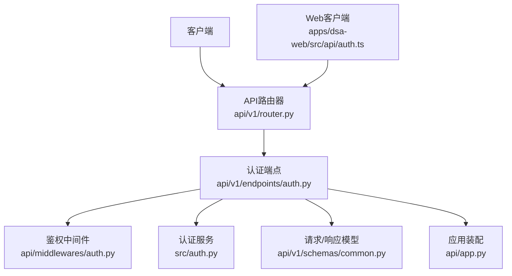
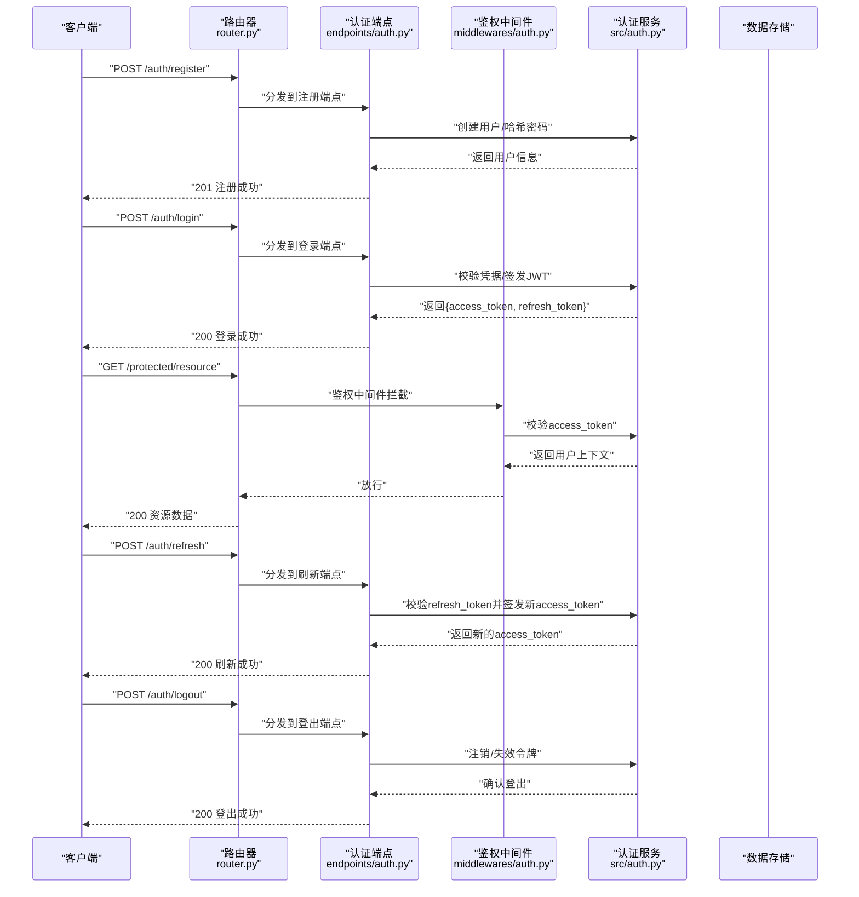
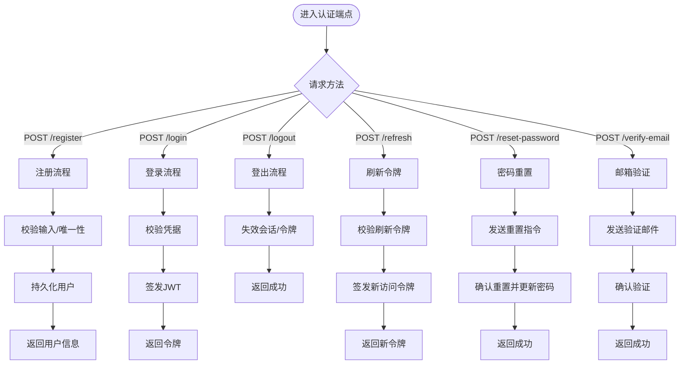
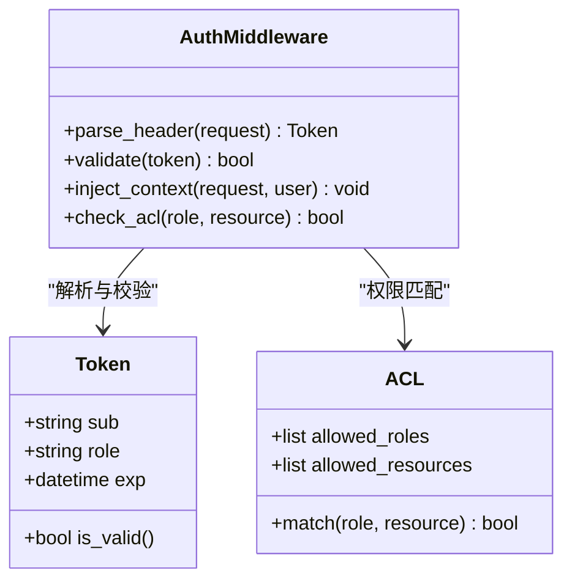
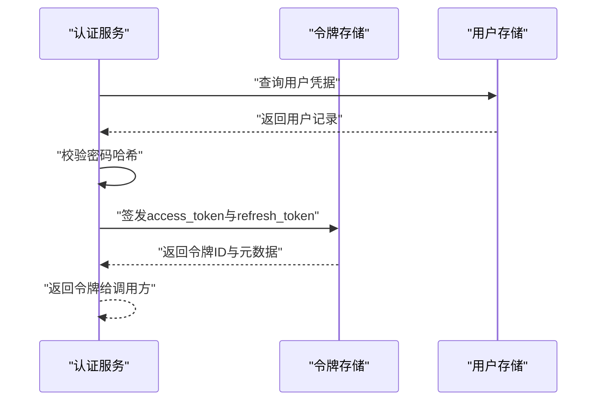
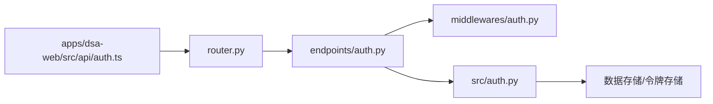

# 认证授权API

<cite>
**本文引用的文件**   
- [api/v1/endpoints/auth.py](file://api/v1/endpoints/auth.py)
- [api/middlewares/auth.py](file://api/middlewares/auth.py)
- [src/auth.py](file://src/auth.py)
- [api/app.py](file://api/app.py)
- [api/v1/router.py](file://api/v1/router.py)
- [api/v1/schemas/common.py](file://api/v1/schemas/common.py)
- [tests/test_auth_api.py](file://tests/test_auth_api.py)
- [apps/dsa-web/src/api/auth.ts](file://apps/dsa-web/src/api/auth.ts)
</cite>

## 目录
1. [简介](#简介)
2. [项目结构](#项目结构)
3. [核心组件](#核心组件)
4. [架构总览](#架构总览)
5. [详细组件分析](#详细组件分析)
6. [依赖关系分析](#依赖关系分析)
7. [性能考虑](#性能考虑)
8. [故障排查指南](#故障排查指南)
9. [结论](#结论)
10. [附录](#附录)

## 简介
本文件面向开发者与集成方，系统化说明认证与授权相关的API接口与流程，覆盖用户注册、登录、登出、JWT令牌生成/验证/刷新、密码重置、邮箱验证等安全能力；并提供权限控制机制（角色管理与访问控制列表）、安全最佳实践、客户端集成示例与常见问题解决方案。文档内容基于代码库中的认证路由、中间件、服务实现以及前端调用封装进行归纳整理。

## 项目结构
认证授权相关代码主要分布在以下位置：
- API层：v1版本路由与端点定义
- 中间件层：鉴权中间件与错误处理
- 服务层：认证核心逻辑（JWT、密码、会话等）
- 前端：Web客户端的认证API封装与状态管理
- 测试：认证相关用例与契约校验

**图示来源** 
- [api/v1/router.py](file://api/v1/router.py)
- [api/v1/endpoints/auth.py](file://api/v1/endpoints/auth.py)
- [api/middlewares/auth.py](file://api/middlewares/auth.py)
- [src/auth.py](file://src/auth.py)
- [api/v1/schemas/common.py](file://api/v1/schemas/common.py)
- [api/app.py](file://api/app.py)
- [apps/dsa-web/src/api/auth.ts](file://apps/dsa-web/src/api/auth.ts)

**章节来源**
- [api/v1/router.py](file://api/v1/router.py)
- [api/v1/endpoints/auth.py](file://api/v1/endpoints/auth.py)
- [api/middlewares/auth.py](file://api/middlewares/auth.py)
- [src/auth.py](file://src/auth.py)
- [api/v1/schemas/common.py](file://api/v1/schemas/common.py)
- [api/app.py](file://api/app.py)
- [apps/dsa-web/src/api/auth.ts](file://apps/dsa-web/src/api/auth.ts)

## 核心组件
- 认证端点：提供注册、登录、登出、刷新令牌、密码重置、邮箱验证等HTTP接口
- 鉴权中间件：解析并校验JWT，注入当前用户上下文，执行角色/权限检查
- 认证服务：负责JWT签发与校验、密码哈希与校验、令牌刷新策略、安全参数配置
- 数据模型：统一的请求/响应结构与错误码约定
- 前端封装：统一发起认证请求、处理令牌存储与自动刷新

**章节来源**
- [api/v1/endpoints/auth.py](file://api/v1/endpoints/auth.py)
- [api/middlewares/auth.py](file://api/middlewares/auth.py)
- [src/auth.py](file://src/auth.py)
- [api/v1/schemas/common.py](file://api/v1/schemas/common.py)
- [apps/dsa-web/src/api/auth.ts](file://apps/dsa-web/src/api/auth.ts)

## 架构总览
下图展示从客户端到服务端认证处理的完整调用链，包括JWT签发、校验与刷新流程。

**图示来源** 
- [api/v1/router.py](file://api/v1/router.py)
- [api/v1/endpoints/auth.py](file://api/v1/endpoints/auth.py)
- [api/middlewares/auth.py](file://api/middlewares/auth.py)
- [src/auth.py](file://src/auth.py)

## 详细组件分析

### 认证端点（注册、登录、登出、刷新、密码重置、邮箱验证）
- 注册：接收用户名、邮箱、密码等字段，校验唯一性与密码强度，持久化用户记录，返回基础用户信息
- 登录：校验用户名/邮箱与密码，成功后签发短期访问令牌与长期刷新令牌
- 登出：使当前会话或令牌失效，清理本地状态
- 刷新：使用刷新令牌换取新的访问令牌，支持滑动过期策略
- 密码重置：发送重置链接或一次性验证码，校验后更新密码
- 邮箱验证：发送验证邮件，用户点击链接或输入验证码完成验证

**图示来源** 
- [api/v1/endpoints/auth.py](file://api/v1/endpoints/auth.py)
- [src/auth.py](file://src/auth.py)

**章节来源**
- [api/v1/endpoints/auth.py](file://api/v1/endpoints/auth.py)
- [src/auth.py](file://src/auth.py)

### 鉴权中间件（JWT校验与权限控制）
- 解析请求头中的Authorization Bearer令牌
- 校验签名、有效期、黑名单（如已登出）
- 将用户上下文注入到请求对象
- 根据角色与访问控制列表（ACL）判断是否允许访问受保护资源

**图示来源** 
- [api/middlewares/auth.py](file://api/middlewares/auth.py)
- [src/auth.py](file://src/auth.py)

**章节来源**
- [api/middlewares/auth.py](file://api/middlewares/auth.py)
- [src/auth.py](file://src/auth.py)

### 认证服务（JWT、密码、刷新策略）
- JWT签发：包含用户标识、角色、过期时间，使用强密钥与算法
- 令牌校验：验证签名、过期、黑名单；支持短生命周期访问令牌与长生命周期刷新令牌
- 密码安全：使用安全的哈希算法与盐值，禁止明文存储
- 刷新策略：支持滑动过期、限流与设备绑定（可选）

**图示来源** 
- [src/auth.py](file://src/auth.py)

**章节来源**
- [src/auth.py](file://src/auth.py)

### 数据模型（请求/响应与错误码）
- 统一响应结构：包含状态码、消息、数据体
- 错误码：区分认证失败、权限不足、参数校验错误、系统异常
- 字段约束：必填项、长度限制、格式校验（邮箱、密码复杂度）

**章节来源**
- [api/v1/schemas/common.py](file://api/v1/schemas/common.py)

### 前端集成（Web客户端）
- 封装认证API：注册、登录、登出、刷新、重置密码、邮箱验证
- 令牌存储：优先使用HttpOnly Cookie或内存存储，避免XSS风险
- 自动刷新：在访问令牌过期前自动刷新，提升用户体验
- 错误处理：统一捕获网络与业务错误，提示用户重试或重新登录

**章节来源**
- [apps/dsa-web/src/api/auth.ts](file://apps/dsa-web/src/api/auth.ts)

## 依赖关系分析
- 路由层依赖端点定义，端点依赖鉴权中间件与认证服务
- 认证服务依赖数据存储与令牌存储
- 前端依赖后端API契约，遵循统一的错误处理与令牌管理策略

**图示来源** 
- [api/v1/router.py](file://api/v1/router.py)
- [api/v1/endpoints/auth.py](file://api/v1/endpoints/auth.py)
- [api/middlewares/auth.py](file://api/middlewares/auth.py)
- [src/auth.py](file://src/auth.py)
- [apps/dsa-web/src/api/auth.ts](file://apps/dsa-web/src/api/auth.ts)

**章节来源**
- [api/v1/router.py](file://api/v1/router.py)
- [api/v1/endpoints/auth.py](file://api/v1/endpoints/auth.py)
- [api/middlewares/auth.py](file://api/middlewares/auth.py)
- [src/auth.py](file://src/auth.py)
- [apps/dsa-web/src/api/auth.ts](file://apps/dsa-web/src/api/auth.ts)

## 性能考虑
- 令牌校验：使用无状态JWT减少数据库查询，必要时结合缓存加速黑名单校验
- 密码哈希：选择合适算法与迭代次数，平衡安全性与性能
- 并发登录：限制同一用户并发会话数，防止资源滥用
- 刷新令牌：采用滑动过期策略，降低频繁刷新带来的开销

[本节为通用指导，不直接分析具体文件]

## 故障排查指南
- 常见错误码：401未认证、403权限不足、400参数错误、409冲突（重复注册）
- 调试建议：启用详细日志、检查JWT签名与过期时间、验证密码哈希算法一致性
- 前端问题：检查令牌存储方式、自动刷新逻辑、跨域与Cookie设置

**章节来源**
- [tests/test_auth_api.py](file://tests/test_auth_api.py)
- [api/v1/schemas/common.py](file://api/v1/schemas/common.py)

## 结论
本认证授权体系通过清晰的端点设计、健壮的中间件校验与安全的服务实现，提供了完整的用户身份管理与访问控制能力。结合前端封装与安全最佳实践，可有效保障系统的安全性与用户体验。建议在部署时严格配置密钥、启用HTTPS、实施速率限制与审计日志，以进一步提升整体安全性。

[本节为总结性内容，不直接分析具体文件]

## 附录
- 安全最佳实践
  - 令牌存储：优先使用HttpOnly Cookie或内存存储，避免本地存储泄露
  - 传输安全：强制HTTPS，启用HSTS，校验证书链
  - 防重放攻击：使用随机nonce、时间戳与签名校验
  - 密码策略：最小长度、复杂度要求、定期更换
  - 会话管理：限制并发会话、及时失效、支持远程注销
- 客户端集成示例
  - 初始化认证客户端，设置基础URL与超时
  - 登录成功后保存令牌，并在后续请求中自动附加
  - 实现令牌刷新拦截器，处理401响应并重试
- 常见问题解决方案
  - 令牌无效：检查过期时间与签名密钥一致性
  - 权限不足：确认用户角色与ACL配置
  - 邮箱验证失败：检查邮件服务配置与链接有效性

[本节为补充信息，不直接分析具体文件]