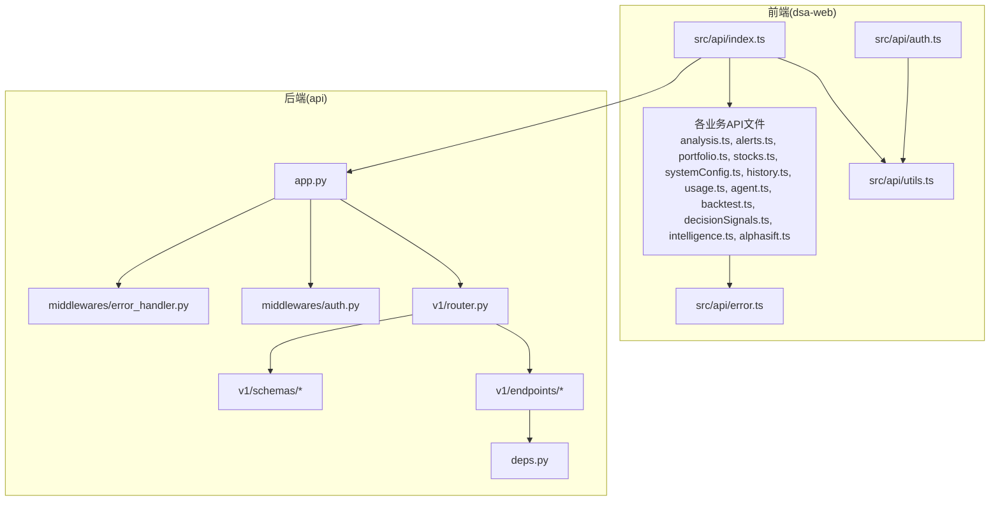
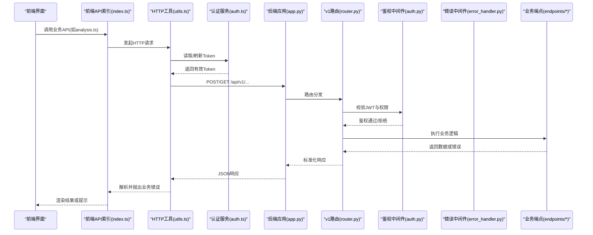
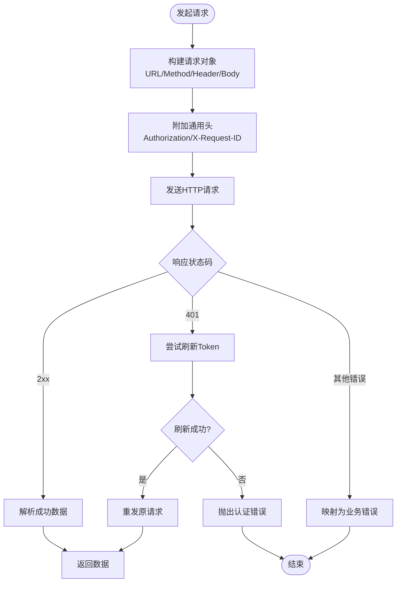
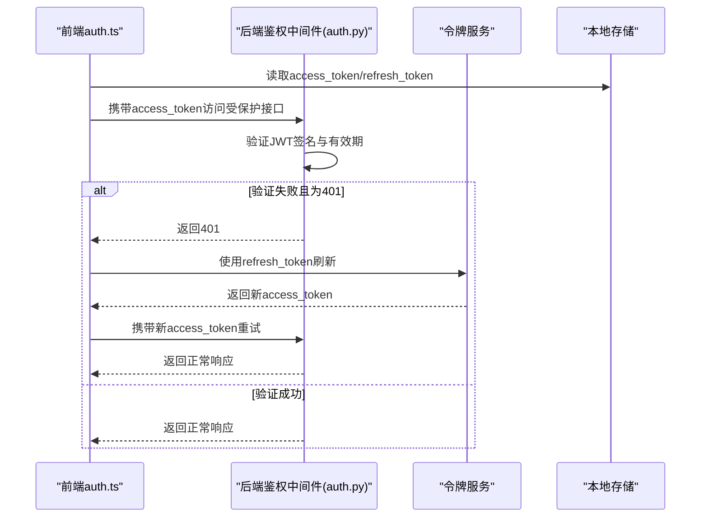
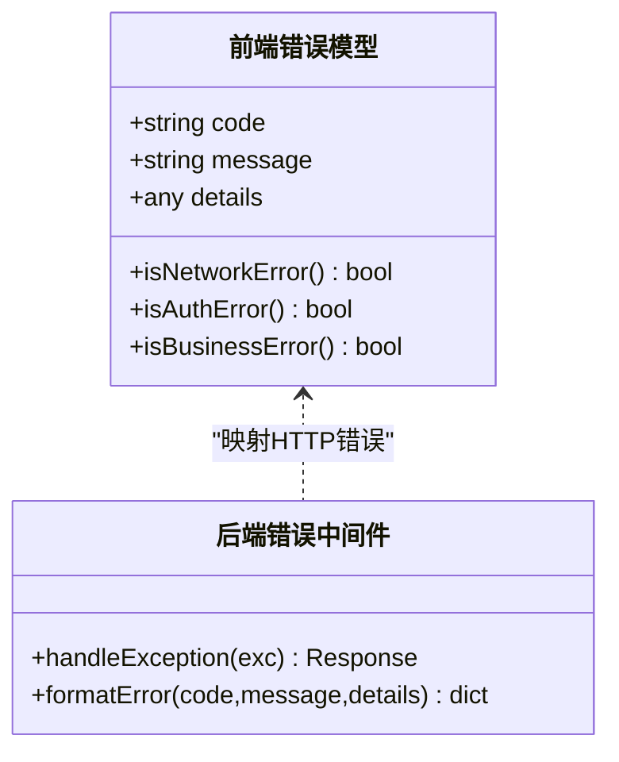
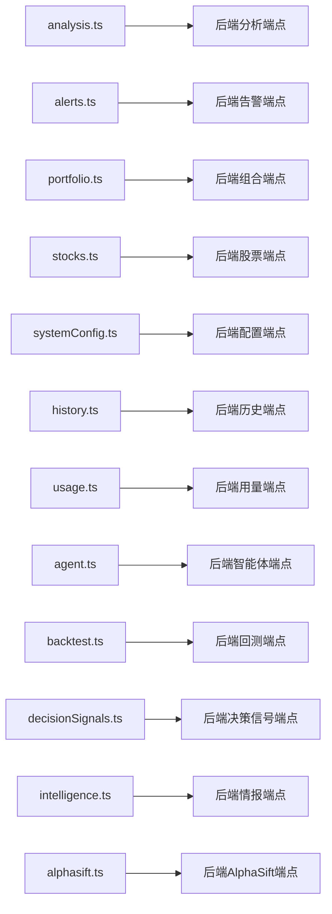
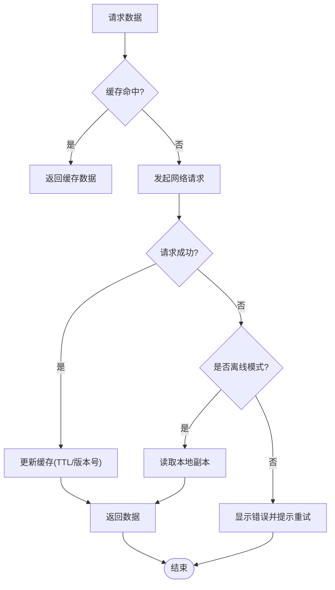
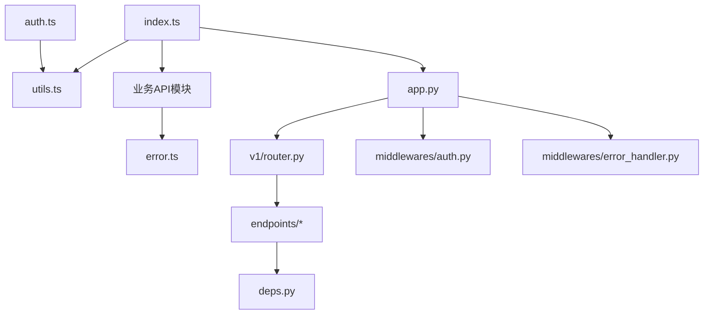

# API集成

<cite>
**本文引用的文件**   
- [api/app.py](file://api/app.py)
- [api/v1/router.py](file://api/v1/router.py)
- [api/middlewares/auth.py](file://api/middlewares/auth.py)
- [api/middlewares/error_handler.py](file://api/middlewares/error_handler.py)
- [api/deps.py](file://api/deps.py)
- [apps/dsa-web/src/api/index.ts](file://apps/dsa-web/src/api/index.ts)
- [apps/dsa-web/src/api/utils.ts](file://apps/dsa-web/src/api/utils.ts)
- [apps/dsa-web/src/api/auth.ts](file://apps/dsa-web/src/api/auth.ts)
- [apps/dsa-web/src/api/analysis.ts](file://apps/dsa-web/src/api/analysis.ts)
- [apps/dsa-web/src/api/alerts.ts](file://apps/dsa-web/src/api/alerts.ts)
- [apps/dsa-web/src/api/portfolio.ts](file://apps/dsa-web/src/api/portfolio.ts)
- [apps/dsa-web/src/api/stocks.ts](file://apps/dsa-web/src/api/stocks.ts)
- [apps/dsa-web/src/api/systemConfig.ts](file://apps/dsa-web/src/api/systemConfig.ts)
- [apps/dsa-web/src/api/history.ts](file://apps/dsa-web/src/api/history.ts)
- [apps/dsa-web/src/api/usage.ts](file://apps/dsa-web/src/api/usage.ts)
- [apps/dsa-web/src/api/agent.ts](file://apps/dsa-web/src/api/agent.ts)
- [apps/dsa-web/src/api/backtest.ts](file://apps/dsa-web/src/api/backtest.ts)
- [apps/dsa-web/src/api/decisionSignals.ts](file://apps/dsa-web/src/api/decisionSignals.ts)
- [apps/dsa-web/src/api/intelligence.ts](file://apps/dsa-web/src/api/intelligence.ts)
- [apps/dsa-web/src/api/alphasift.ts](file://apps/dsa-web/src/api/alphasift.ts)
- [apps/dsa-web/src/api/error.ts](file://apps/dsa-web/src/api/error.ts)
</cite>

## 目录
1. [简介](#简介)
2. [项目结构](#项目结构)
3. [核心组件](#核心组件)
4. [架构总览](#架构总览)
5. [详细组件分析](#详细组件分析)
6. [依赖关系分析](#依赖关系分析)
7. [性能考虑](#性能考虑)
8. [故障排查指南](#故障排查指南)
9. [结论](#结论)
10. [附录](#附录)

## 简介
本文件面向前端与后端API集成的设计与实现，覆盖HTTP客户端封装、请求拦截器与响应处理、按功能模块划分的API服务组织、统一错误处理、认证授权（JWT令牌管理、自动刷新与权限控制）、数据同步策略（实时数据更新、缓存机制与离线支持）、API版本管理与向后兼容、调试技巧与性能优化建议。目标是帮助开发者快速理解并高效扩展API集成能力。

## 项目结构
后端采用FastAPI模块化路由设计，按v1版本划分端点与Schema；中间件负责鉴权与错误处理；依赖注入统一管理数据库与配置。前端基于TypeScript/React，使用统一的HTTP工具封装和按业务域拆分的API服务文件，集中处理认证、错误、缓存与重试等横切关注点。

图表来源
- [api/app.py](file://api/app.py)
- [api/v1/router.py](file://api/v1/router.py)
- [api/middlewares/auth.py](file://api/middlewares/auth.py)
- [api/middlewares/error_handler.py](file://api/middlewares/error_handler.py)
- [api/deps.py](file://api/deps.py)
- [apps/dsa-web/src/api/index.ts](file://apps/dsa-web/src/api/index.ts)
- [apps/dsa-web/src/api/utils.ts](file://apps/dsa-web/src/api/utils.ts)
- [apps/dsa-web/src/api/auth.ts](file://apps/dsa-web/src/api/auth.ts)
- [apps/dsa-web/src/api/error.ts](file://apps/dsa-web/src/api/error.ts)

章节来源
- [api/app.py](file://api/app.py)
- [api/v1/router.py](file://api/v1/router.py)
- [api/middlewares/auth.py](file://api/middlewares/auth.py)
- [api/middlewares/error_handler.py](file://api/middlewares/error_handler.py)
- [api/deps.py](file://api/deps.py)
- [apps/dsa-web/src/api/index.ts](file://apps/dsa-web/src/api/index.ts)
- [apps/dsa-web/src/api/utils.ts](file://apps/dsa-web/src/api/utils.ts)
- [apps/dsa-web/src/api/auth.ts](file://apps/dsa-web/src/api/auth.ts)
- [apps/dsa-web/src/api/error.ts](file://apps/dsa-web/src/api/error.ts)

## 核心组件
- HTTP客户端封装：前端通过utils.ts提供统一的请求方法，集中处理基础URL、超时、重试、序列化与反序列化。
- 请求拦截器：在index.ts或utils.ts中注册请求拦截器，自动附加Authorization头、租户ID、追踪ID等。
- 响应处理：统一解析成功/失败响应，转换错误码为业务错误类型，便于上层消费。
- 认证服务：auth.ts封装登录、获取用户信息、令牌刷新流程，维护本地存储的token与过期时间。
- 业务API服务：按模块拆分analysis.ts、alerts.ts、portfolio.ts、stocks.ts、systemConfig.ts、history.ts、usage.ts、agent.ts、backtest.ts、decisionSignals.ts、intelligence.ts、alphasift.ts，每个文件暴露领域函数。
- 错误处理：error.ts定义统一错误模型与异常映射，配合后端中间件返回一致的错误结构。

章节来源
- [apps/dsa-web/src/api/utils.ts](file://apps/dsa-web/src/api/utils.ts)
- [apps/dsa-web/src/api/index.ts](file://apps/dsa-web/src/api/index.ts)
- [apps/dsa-web/src/api/auth.ts](file://apps/dsa-web/src/api/auth.ts)
- [apps/dsa-web/src/api/error.ts](file://apps/dsa-web/src/api/error.ts)
- [apps/dsa-web/src/api/analysis.ts](file://apps/dsa-web/src/api/analysis.ts)
- [apps/dsa-web/src/api/alerts.ts](file://apps/dsa-web/src/api/alerts.ts)
- [apps/dsa-web/src/api/portfolio.ts](file://apps/dsa-web/src/api/portfolio.ts)
- [apps/dsa-web/src/api/stocks.ts](file://apps/dsa-web/src/api/stocks.ts)
- [apps/dsa-web/src/api/systemConfig.ts](file://apps/dsa-web/src/api/systemConfig.ts)
- [apps/dsa-web/src/api/history.ts](file://apps/dsa-web/src/api/history.ts)
- [apps/dsa-web/src/api/usage.ts](file://apps/dsa-web/src/api/usage.ts)
- [apps/dsa-web/src/api/agent.ts](file://apps/dsa-web/src/api/agent.ts)
- [apps/dsa-web/src/api/backtest.ts](file://apps/dsa-web/src/api/backtest.ts)
- [apps/dsa-web/src/api/decisionSignals.ts](file://apps/dsa-web/src/api/decisionSignals.ts)
- [apps/dsa-web/src/api/intelligence.ts](file://apps/dsa-web/src/api/intelligence.ts)
- [apps/dsa-web/src/api/alphasift.ts](file://apps/dsa-web/src/api/alphasift.ts)

## 架构总览
前后端通过RESTful接口通信，前端以模块化的API服务调用后端v1路由，后端通过中间件完成鉴权与错误处理，依赖注入提供共享资源。

图表来源
- [apps/dsa-web/src/api/index.ts](file://apps/dsa-web/src/api/index.ts)
- [apps/dsa-web/src/api/utils.ts](file://apps/dsa-web/src/api/utils.ts)
- [apps/dsa-web/src/api/auth.ts](file://apps/dsa-web/src/api/auth.ts)
- [api/app.py](file://api/app.py)
- [api/v1/router.py](file://api/v1/router.py)
- [api/middlewares/auth.py](file://api/middlewares/auth.py)
- [api/middlewares/error_handler.py](file://api/middlewares/error_handler.py)

## 详细组件分析

### HTTP客户端封装与拦截器
- 统一请求方法：封装fetch或axios调用，设置base URL、超时、重试次数、退避策略。
- 请求拦截器：自动附加Authorization、X-Request-ID、X-Tenant-ID等头部；对敏感参数进行脱敏。
- 响应拦截器：统一解析成功体与错误体，将HTTP状态码映射到业务错误类型；对401触发自动刷新流程。

图表来源
- [apps/dsa-web/src/api/utils.ts](file://apps/dsa-web/src/api/utils.ts)
- [apps/dsa-web/src/api/auth.ts](file://apps/dsa-web/src/api/auth.ts)

章节来源
- [apps/dsa-web/src/api/utils.ts](file://apps/dsa-web/src/api/utils.ts)
- [apps/dsa-web/src/api/index.ts](file://apps/dsa-web/src/api/index.ts)

### 认证与授权流程（JWT）
- 登录：前端auth.ts调用后端认证接口，成功后保存access_token与refresh_token及过期时间。
- 自动刷新：当访问受限接口返回401时，优先检查本地token是否即将过期；若过期则调用刷新接口获取新令牌并重试原请求。
- 权限控制：后端中间件校验JWT签名、角色与权限范围，未通过则返回403；前端根据权限动态隐藏菜单或禁用操作。

图表来源
- [apps/dsa-web/src/api/auth.ts](file://apps/dsa-web/src/api/auth.ts)
- [api/middlewares/auth.py](file://api/middlewares/auth.py)

章节来源
- [apps/dsa-web/src/api/auth.ts](file://apps/dsa-web/src/api/auth.ts)
- [api/middlewares/auth.py](file://api/middlewares/auth.py)

### 统一错误处理机制
- 前端error.ts定义错误枚举与异常类，将HTTP错误转换为业务错误，便于UI层展示与埋点。
- 后端error_handler.py捕获未处理异常，输出标准错误结构（错误码、消息、堆栈），避免泄露敏感信息。
- 约定错误码：网络错误、认证错误、权限错误、参数校验错误、业务错误分类清晰。

图表来源
- [apps/dsa-web/src/api/error.ts](file://apps/dsa-web/src/api/error.ts)
- [api/middlewares/error_handler.py](file://api/middlewares/error_handler.py)

章节来源
- [apps/dsa-web/src/api/error.ts](file://apps/dsa-web/src/api/error.ts)
- [api/middlewares/error_handler.py](file://api/middlewares/error_handler.py)

### 按功能模块划分的API服务
- analysis.ts：分析与报告相关接口，支持批量提交与异步任务查询。
- alerts.ts：告警订阅、规则管理与通知推送。
- portfolio.ts：投资组合CRUD、持仓快照与风险指标。
- stocks.ts：股票搜索、基本信息与行情数据。
- systemConfig.ts：系统配置项的读写与热更新。
- history.ts：历史数据查询与分页。
- usage.ts：用量统计与配额管理。
- agent.ts：智能体对话、工具调用与流式事件。
- backtest.ts：回测任务创建、进度与结果下载。
- decisionSignals.ts：决策信号生成、评估与聚合。
- intelligence.ts：情报采集与摘要。
- alphasift.ts：AlphaSift数据源集成。

图表来源
- [apps/dsa-web/src/api/analysis.ts](file://apps/dsa-web/src/api/analysis.ts)
- [apps/dsa-web/src/api/alerts.ts](file://apps/dsa-web/src/api/alerts.ts)
- [apps/dsa-web/src/api/portfolio.ts](file://apps/dsa-web/src/api/portfolio.ts)
- [apps/dsa-web/src/api/stocks.ts](file://apps/dsa-web/src/api/stocks.ts)
- [apps/dsa-web/src/api/systemConfig.ts](file://apps/dsa-web/src/api/systemConfig.ts)
- [apps/dsa-web/src/api/history.ts](file://apps/dsa-web/src/api/history.ts)
- [apps/dsa-web/src/api/usage.ts](file://apps/dsa-web/src/api/usage.ts)
- [apps/dsa-web/src/api/agent.ts](file://apps/dsa-web/src/api/agent.ts)
- [apps/dsa-web/src/api/backtest.ts](file://apps/dsa-web/src/api/backtest.ts)
- [apps/dsa-web/src/api/decisionSignals.ts](file://apps/dsa-web/src/api/decisionSignals.ts)
- [apps/dsa-web/src/api/intelligence.ts](file://apps/dsa-web/src/api/intelligence.ts)
- [apps/dsa-web/src/api/alphasift.ts](file://apps/dsa-web/src/api/alphasift.ts)

章节来源
- [apps/dsa-web/src/api/analysis.ts](file://apps/dsa-web/src/api/analysis.ts)
- [apps/dsa-web/src/api/alerts.ts](file://apps/dsa-web/src/api/alerts.ts)
- [apps/dsa-web/src/api/portfolio.ts](file://apps/dsa-web/src/api/portfolio.ts)
- [apps/dsa-web/src/api/stocks.ts](file://apps/dsa-web/src/api/stocks.ts)
- [apps/dsa-web/src/api/systemConfig.ts](file://apps/dsa-web/src/api/systemConfig.ts)
- [apps/dsa-web/src/api/history.ts](file://apps/dsa-web/src/api/history.ts)
- [apps/dsa-web/src/api/usage.ts](file://apps/dsa-web/src/api/usage.ts)
- [apps/dsa-web/src/api/agent.ts](file://apps/dsa-web/src/api/agent.ts)
- [apps/dsa-web/src/api/backtest.ts](file://apps/dsa-web/src/api/backtest.ts)
- [apps/dsa-web/src/api/decisionSignals.ts](file://apps/dsa-web/src/api/decisionSignals.ts)
- [apps/dsa-web/src/api/intelligence.ts](file://apps/dsa-web/src/api/intelligence.ts)
- [apps/dsa-web/src/api/alphasift.ts](file://apps/dsa-web/src/api/alphasift.ts)

### 数据同步策略（实时、缓存与离线）
- 实时数据更新：对高频数据（如行情、告警）采用轮询或WebSocket/SSE；前端在utils.ts中实现去抖与增量更新。
- 缓存机制：对读多写少的接口（如系统配置、股票列表）启用内存缓存与浏览器缓存（ETag/Last-Modified）；缓存失效策略包含TTL与主动失效。
- 离线支持：关键数据落盘（IndexedDB/LocalStorage），网络恢复后执行增量同步与冲突合并；失败重试与幂等性保证。

[此图为概念流程图，不直接映射具体源码文件]

### API版本管理与向后兼容
- 版本前缀：所有接口统一以/api/v1开头，便于未来升级至v2而不影响现有客户端。
- 兼容性策略：新增字段默认可选，废弃字段保留一段时间并提供迁移指引；服务端对未知字段忽略，避免破坏旧客户端。
- 变更发布：通过CHANGELOG与OpenAPI文档记录版本差异，前端按版本特性开关渐进启用新功能。

章节来源
- [api/v1/router.py](file://api/v1/router.py)

## 依赖关系分析
前端API模块依赖统一的HTTP工具与认证服务；后端路由依赖中间件与依赖注入容器。模块间耦合度低，职责清晰。

图表来源
- [apps/dsa-web/src/api/index.ts](file://apps/dsa-web/src/api/index.ts)
- [apps/dsa-web/src/api/utils.ts](file://apps/dsa-web/src/api/utils.ts)
- [apps/dsa-web/src/api/error.ts](file://apps/dsa-web/src/api/error.ts)
- [apps/dsa-web/src/api/auth.ts](file://apps/dsa-web/src/api/auth.ts)
- [api/app.py](file://api/app.py)
- [api/v1/router.py](file://api/v1/router.py)
- [api/middlewares/auth.py](file://api/middlewares/auth.py)
- [api/middlewares/error_handler.py](file://api/middlewares/error_handler.py)
- [api/deps.py](file://api/deps.py)

章节来源
- [apps/dsa-web/src/api/index.ts](file://apps/dsa-web/src/api/index.ts)
- [apps/dsa-web/src/api/utils.ts](file://apps/dsa-web/src/api/utils.ts)
- [apps/dsa-web/src/api/error.ts](file://apps/dsa-web/src/api/error.ts)
- [apps/dsa-web/src/api/auth.ts](file://apps/dsa-web/src/api/auth.ts)
- [api/app.py](file://api/app.py)
- [api/v1/router.py](file://api/v1/router.py)
- [api/middlewares/auth.py](file://api/middlewares/auth.py)
- [api/middlewares/error_handler.py](file://api/middlewares/error_handler.py)
- [api/deps.py](file://api/deps.py)

## 性能考虑
- 请求合并与去抖：对频繁触发的查询（如搜索、实时行情）进行请求合并与防抖，减少无效网络开销。
- 缓存策略：合理设置TTL与缓存键，结合ETag/Last-Modified降低带宽占用；对热点数据使用内存缓存。
- 并发控制：限制并发请求数，避免雪崩；对长耗时任务采用异步队列与进度回调。
- 压缩与传输：启用Gzip/Brotli压缩，按需加载大体积数据；分页与懒加载提升首屏性能。
- 监控与度量：接入APM与错误上报，收集P95/P99延迟与错误率，定位瓶颈。

[本节为通用指导，不直接分析具体文件]

## 故障排查指南
- 常见问题
  - 401未认证：检查本地token是否过期、刷新流程是否被阻断；确认Authorization头是否正确传递。
  - 403权限不足：核对用户角色与接口权限映射；检查后端中间件的权限校验逻辑。
  - 500服务器错误：查看后端错误中间件日志，定位异常堆栈；确认输入参数是否符合Schema。
  - 网络超时：调整超时阈值与重试策略；检查代理与跨域配置。
- 调试技巧
  - 前端：开启网络面板与拦截器日志，打印请求头与响应体；使用Mock服务隔离后端不稳定因素。
  - 后端：启用详细日志与请求追踪ID；使用测试客户端模拟边界条件与异常路径。
  - 联调：使用Postman/curl构造最小可复现用例，逐步缩小问题范围。

章节来源
- [api/middlewares/error_handler.py](file://api/middlewares/error_handler.py)
- [apps/dsa-web/src/api/error.ts](file://apps/dsa-web/src/api/error.ts)

## 结论
本API集成方案通过统一的HTTP客户端封装、清晰的模块划分、完善的认证与错误处理机制，实现了前后端解耦与高内聚。结合缓存、实时同步与离线策略，提升了用户体验与系统韧性。遵循版本管理与兼容性原则，确保长期演进的可维护性。建议持续完善监控与性能优化，保障在高负载场景下的稳定性。

[本节为总结性内容，不直接分析具体文件]

## 附录
- 最佳实践
  - 接口命名遵循RESTful规范，动词+名词，避免歧义。
  - 错误码分层：网络层、认证层、业务层分别定义，便于定位。
  - 文档先行：使用OpenAPI描述接口契约，自动生成前端类型与SDK。
  - 安全加固：HTTPS强制、CORS白名单、敏感数据脱敏、速率限制。
- 参考文件
  - 前端API索引与工具：[apps/dsa-web/src/api/index.ts](file://apps/dsa-web/src/api/index.ts)、[apps/dsa-web/src/api/utils.ts](file://apps/dsa-web/src/api/utils.ts)
  - 认证与错误：[apps/dsa-web/src/api/auth.ts](file://apps/dsa-web/src/api/auth.ts)、[apps/dsa-web/src/api/error.ts](file://apps/dsa-web/src/api/error.ts)
  - 后端应用与路由：[api/app.py](file://api/app.py)、[api/v1/router.py](file://api/v1/router.py)
  - 中间件与依赖：[api/middlewares/auth.py](file://api/middlewares/auth.py)、[api/middlewares/error_handler.py](file://api/middlewares/error_handler.py)、[api/deps.py](file://api/deps.py)