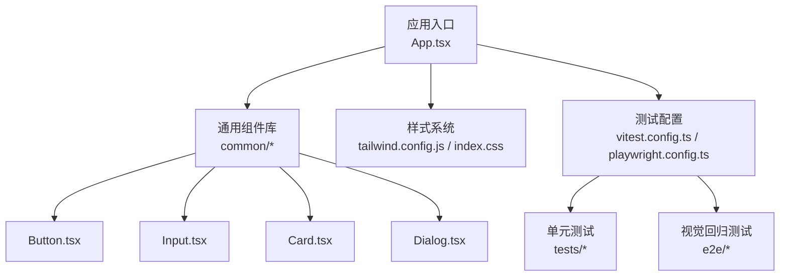
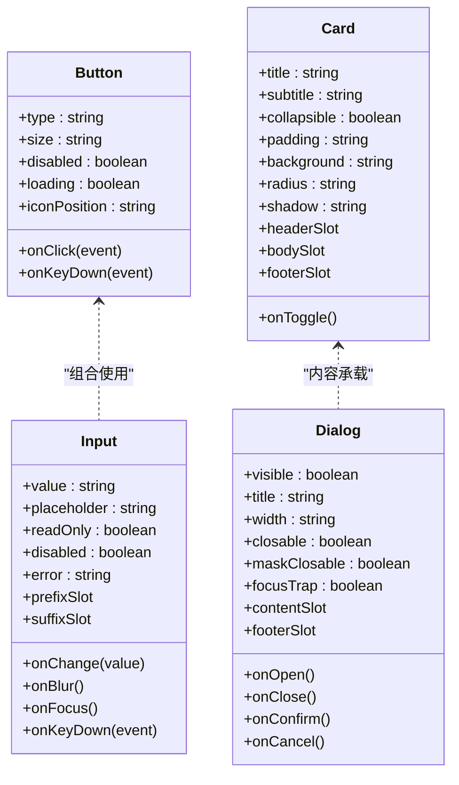
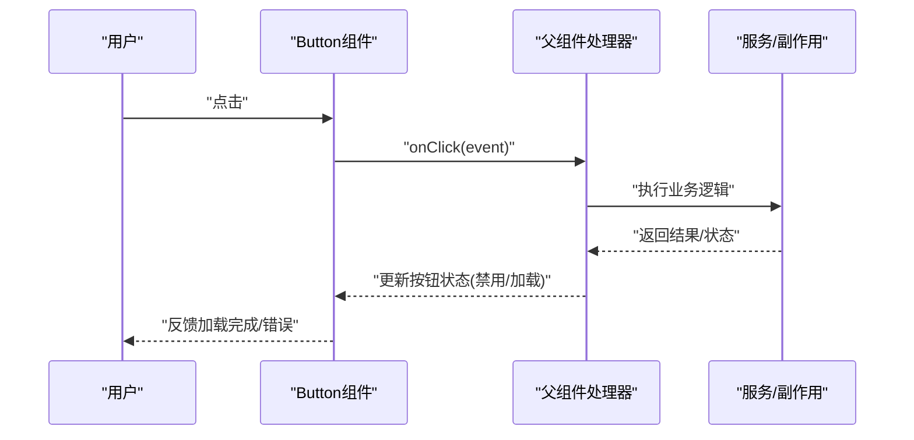
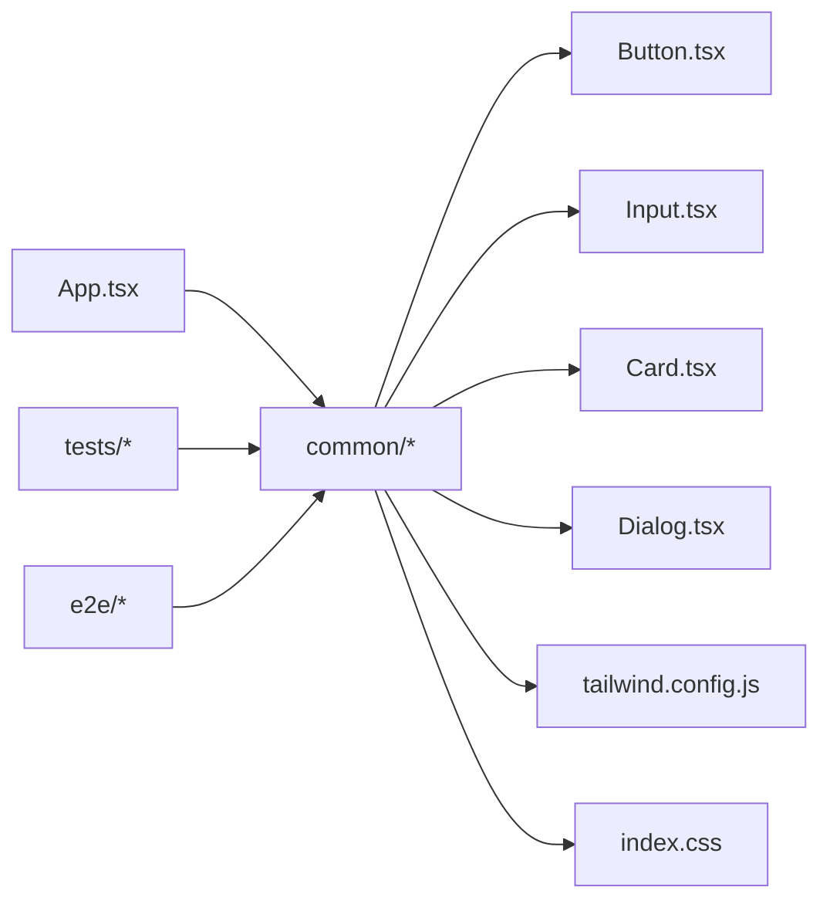

# UI组件系统

<cite>
**本文引用的文件**   
- [apps/dsa-web/src/components/common/Button.tsx](file://apps/dsa-web/src/components/common/Button.tsx)
- [apps/dsa-web/src/components/common/Input.tsx](file://apps/dsa-web/src/components/common/Input.tsx)
- [apps/dsa-web/src/components/common/Card.tsx](file://apps/dsa-web/src/components/common/Card.tsx)
- [apps/dsa-web/src/components/common/Dialog.tsx](file://apps/dsa-web/src/components/common/Dialog.tsx)
- [apps/dsa-web/tailwind.config.js](file://apps/dsa-web/tailwind.config.js)
- [apps/dsa-web/index.css](file://apps/dsa-web/index.css)
- [apps/dsa-web/vitest.config.ts](file://apps/dsa-web/vitest.config.ts)
- [apps/dsa-web/playwright.config.ts](file://apps/dsa-web/playwright.config.ts)
- [apps/dsa-web/e2e/market-structure-card-visual.spec.ts](file://apps/dsa-web/e2e/market-structure-card-visual.spec.ts)
- [apps/dsa-web/tests/ui_governance.test.ts](file://apps/dsa-web/tests/ui_governance.test.ts)
- [apps/dsa-web/src/App.tsx](file://apps/dsa-web/src/App.tsx)
</cite>

## 目录
1. [简介](#简介)
2. [项目结构](#项目结构)
3. [核心组件](#核心组件)
4. [架构总览](#架构总览)
5. [详细组件分析](#详细组件分析)
6. [依赖关系分析](#依赖关系分析)
7. [性能考量](#性能考量)
8. [故障排查指南](#故障排查指南)
9. [结论](#结论)
10. [附录](#附录)

## 简介
本文件面向UI组件系统的开发者与维护者，系统化阐述可复用组件的设计原则、接口与事件模型、基础组件库（按钮、输入框、卡片、对话框）的使用与定制方式、组件组合模式（复合组件与插槽）、样式系统（Tailwind CSS配置、主题定制与CSS变量），以及测试策略（单元测试与视觉回归测试）。文档同时提供最佳实践与性能优化建议，帮助团队在复杂业务中保持组件的一致性与可维护性。

## 项目结构
Web端应用位于 apps/dsa-web 目录，组件集中在 src/components 下，其中 common 子目录为通用基础组件；tailwind.config.js 与 index.css 负责样式系统与主题；vitest.config.ts 与 playwright.config.ts 分别支撑单元测试与端到端/视觉回归测试；e2e 目录存放基于Playwright的视觉回归用例；tests 目录包含单元测试与治理类测试。

图表来源
- [apps/dsa-web/src/App.tsx](file://apps/dsa-web/src/App.tsx)
- [apps/dsa-web/src/components/common/Button.tsx](file://apps/dsa-web/src/components/common/Button.tsx)
- [apps/dsa-web/src/components/common/Input.tsx](file://apps/dsa-web/src/components/common/Input.tsx)
- [apps/dsa-web/src/components/common/Card.tsx](file://apps/dsa-web/src/components/common/Card.tsx)
- [apps/dsa-web/src/components/common/Dialog.tsx](file://apps/dsa-web/src/components/common/Dialog.tsx)
- [apps/dsa-web/tailwind.config.js](file://apps/dsa-web/tailwind.config.js)
- [apps/dsa-web/index.css](file://apps/dsa-web/index.css)
- [apps/dsa-web/vitest.config.ts](file://apps/dsa-web/vitest.config.ts)
- [apps/dsa-web/playwright.config.ts](file://apps/dsa-web/playwright.config.ts)

章节来源
- [apps/dsa-web/src/App.tsx](file://apps/dsa-web/src/App.tsx)
- [apps/dsa-web/tailwind.config.js](file://apps/dsa-web/tailwind.config.js)
- [apps/dsa-web/index.css](file://apps/dsa-web/index.css)
- [apps/dsa-web/vitest.config.ts](file://apps/dsa-web/vitest.config.ts)
- [apps/dsa-web/playwright.config.ts](file://apps/dsa-web/playwright.config.ts)

## 核心组件
本节聚焦基础组件库的设计与实现模式，覆盖接口设计、属性定义、事件处理与组合能力。

- 按钮 Button
  - 职责：触发操作、支持多种尺寸与状态、可禁用与加载态。
  - 关键属性：类型（primary/secondary/ghost等）、尺寸（sm/md/lg）、是否禁用、是否加载中、图标位置、点击回调。
  - 事件：onClick、onKeyDown（无障碍键盘交互）。
  - 组合：可与图标组件组合，支持前缀/后缀插槽。

- 输入框 Input
  - 职责：文本输入、校验反馈、占位提示、前后缀内容。
  - 关键属性：值、占位符、是否只读/禁用、错误信息、前缀/后缀插槽、输入回调、失焦回调、回车回调。
  - 事件：onChange、onBlur、onFocus、onKeyDown。
  - 组合：与标签Label、提示信息Message组合使用。

- 卡片 Card
  - 职责：承载内容区块、统一边距与阴影、支持头部/主体/底部区域划分。
  - 关键属性：标题、副标题、是否可折叠、内边距、背景色、圆角、阴影等级。
  - 事件：折叠切换、自定义头部点击。
  - 组合：通过插槽注入头部、主体、底部内容。

- 对话框 Dialog
  - 职责：模态窗口、确认/提示、表单容器。
  - 关键属性：可见性控制、标题、宽度、是否可关闭、遮罩层行为、滚动行为、焦点管理。
  - 事件：打开/关闭、确认/取消、ESC关闭、点击遮罩关闭。
  - 组合：通过插槽注入内容区、底部操作区。

章节来源
- [apps/dsa-web/src/components/common/Button.tsx](file://apps/dsa-web/src/components/common/Button.tsx)
- [apps/dsa-web/src/components/common/Input.tsx](file://apps/dsa-web/src/components/common/Input.tsx)
- [apps/dsa-web/src/components/common/Card.tsx](file://apps/dsa-web/src/components/common/Card.tsx)
- [apps/dsa-web/src/components/common/Dialog.tsx](file://apps/dsa-web/src/components/common/Dialog.tsx)

## 架构总览
组件系统采用“基础组件 + 组合模式”的分层架构：
- 基础组件层：Button、Input、Card、Dialog 等原子化组件，关注自身职责与可访问性。
- 组合层：将基础组件拼装为业务组件（如表单、表格、列表等），通过插槽机制灵活扩展。
- 样式层：以 Tailwind CSS 为核心，配合全局CSS变量进行主题定制。
- 测试层：单元测试验证逻辑与边界条件，视觉回归测试保障UI一致性。

图表来源
- [apps/dsa-web/src/components/common/Button.tsx](file://apps/dsa-web/src/components/common/Button.tsx)
- [apps/dsa-web/src/components/common/Input.tsx](file://apps/dsa-web/src/components/common/Input.tsx)
- [apps/dsa-web/src/components/common/Card.tsx](file://apps/dsa-web/src/components/common/Card.tsx)
- [apps/dsa-web/src/components/common/Dialog.tsx](file://apps/dsa-web/src/components/common/Dialog.tsx)

## 详细组件分析

### 按钮 Button
- 设计要点
  - 明确语义化标签与键盘可达性（Enter/Space触发）。
  - 状态管理：默认、悬停、聚焦、禁用、加载中。
  - 尺寸与类型映射到统一的样式令牌（颜色、间距、字号）。
- 接口约定
  - 属性：type、size、disabled、loading、iconPosition、children。
  - 事件：onClick、onKeyDown。
- 组合模式
  - 支持图标插槽，允许前缀或后缀插入图标。
- 示例路径
  - [Button.tsx](file://apps/dsa-web/src/components/common/Button.tsx)

章节来源
- [apps/dsa-web/src/components/common/Button.tsx](file://apps/dsa-web/src/components/common/Button.tsx)

### 输入框 Input
- 设计要点
  - 受控与非受控两种模式，推荐受控模式便于上层状态管理。
  - 错误状态与提示信息联动，保证可访问性（aria-invalid、aria-describedby）。
  - 前后缀插槽用于图标、按钮、单位等。
- 接口约定
  - 属性：value、placeholder、readOnly、disabled、error、prefixSlot、suffixSlot。
  - 事件：onChange、onBlur、onFocus、onKeyDown。
- 示例路径
  - [Input.tsx](file://apps/dsa-web/src/components/common/Input.tsx)

章节来源
- [apps/dsa-web/src/components/common/Input.tsx](file://apps/dsa-web/src/components/common/Input.tsx)

### 卡片 Card
- 设计要点
  - 分区清晰：头部、主体、底部，便于布局与对齐。
  - 折叠功能需管理展开/收起状态，并保留焦点与动画过渡。
- 接口约定
  - 属性：title、subtitle、collapsible、padding、background、radius、shadow。
  - 事件：onToggle。
  - 插槽：headerSlot、bodySlot、footerSlot。
- 示例路径
  - [Card.tsx](file://apps/dsa-web/src/components/common/Card.tsx)

章节来源
- [apps/dsa-web/src/components/common/Card.tsx](file://apps/dsa-web/src/components/common/Card.tsx)

### 对话框 Dialog
- 设计要点
  - 模态行为：阻止背景滚动、焦点陷阱、ESC关闭、遮罩点击关闭。
  - 尺寸与定位：宽度、居中、层级（z-index）管理。
  - 可访问性：role="dialog"、aria-modal、aria-labelledby。
- 接口约定
  - 属性：visible、title、width、closable、maskClosable、focusTrap。
  - 事件：onOpen、onClose、onConfirm、onCancel。
  - 插槽：contentSlot、footerSlot。
- 示例路径
  - [Dialog.tsx](file://apps/dsa-web/src/components/common/Dialog.tsx)

章节来源
- [apps/dsa-web/src/components/common/Dialog.tsx](file://apps/dsa-web/src/components/common/Dialog.tsx)

### 组件组合模式与插槽机制
- 组合原则
  - 单一职责：每个组件只做一件事，并通过props与插槽暴露扩展点。
  - 显式契约：属性命名一致、类型约束严格、默认值合理。
- 插槽机制
  - 命名插槽：headerSlot、bodySlot、footerSlot、prefixSlot、suffixSlot、contentSlot、footerSlot。
  - 作用域插槽：向插槽传递上下文数据（如行数据、状态）。
- 复合组件
  - 由多个基础组件拼装而成，内部维护局部状态，对外暴露简洁API。
- 示例路径
  - [Card.tsx](file://apps/dsa-web/src/components/common/Card.tsx)
  - [Dialog.tsx](file://apps/dsa-web/src/components/common/Dialog.tsx)
  - [Input.tsx](file://apps/dsa-web/src/components/common/Input.tsx)

章节来源
- [apps/dsa-web/src/components/common/Card.tsx](file://apps/dsa-web/src/components/common/Card.tsx)
- [apps/dsa-web/src/components/common/Dialog.tsx](file://apps/dsa-web/src/components/common/Dialog.tsx)
- [apps/dsa-web/src/components/common/Input.tsx](file://apps/dsa-web/src/components/common/Input.tsx)

### 样式系统与主题定制
- Tailwind CSS 配置
  - 主题色板、字体、间距、圆角、阴影等令牌集中管理。
  - 插件与自定义工具类扩展。
- CSS 变量
  - 使用CSS变量定义颜色、字号、间距等，便于运行时切换主题。
- 组件样式
  - 优先使用Tailwind原子类，必要时通过CSS变量覆盖默认样式。
- 示例路径
  - [tailwind.config.js](file://apps/dsa-web/tailwind.config.js)
  - [index.css](file://apps/dsa-web/index.css)

章节来源
- [apps/dsa-web/tailwind.config.js](file://apps/dsa-web/tailwind.config.js)
- [apps/dsa-web/index.css](file://apps/dsa-web/index.css)

### API调用时序（以按钮触发为例）

图表来源
- [apps/dsa-web/src/components/common/Button.tsx](file://apps/dsa-web/src/components/common/Button.tsx)
- [apps/dsa-web/src/App.tsx](file://apps/dsa-web/src/App.tsx)

## 依赖关系分析
- 组件间依赖
  - Button、Input 作为原子组件，被组合组件引用。
  - Card、Dialog 作为容器型组件，承载其他组件。
- 样式依赖
  - 所有组件依赖 Tailwind 原子类与全局CSS变量。
- 测试依赖
  - vitest 用于单元测试，playwright 用于端到端与视觉回归测试。

图表来源
- [apps/dsa-web/src/App.tsx](file://apps/dsa-web/src/App.tsx)
- [apps/dsa-web/src/components/common/Button.tsx](file://apps/dsa-web/src/components/common/Button.tsx)
- [apps/dsa-web/src/components/common/Input.tsx](file://apps/dsa-web/src/components/common/Input.tsx)
- [apps/dsa-web/src/components/common/Card.tsx](file://apps/dsa-web/src/components/common/Card.tsx)
- [apps/dsa-web/src/components/common/Dialog.tsx](file://apps/dsa-web/src/components/common/Dialog.tsx)
- [apps/dsa-web/tailwind.config.js](file://apps/dsa-web/tailwind.config.js)
- [apps/dsa-web/index.css](file://apps/dsa-web/index.css)
- [apps/dsa-web/tests/ui_governance.test.ts](file://apps/dsa-web/tests/ui_governance.test.ts)
- [apps/dsa-web/e2e/market-structure-card-visual.spec.ts](file://apps/dsa-web/e2e/market-structure-card-visual.spec.ts)

章节来源
- [apps/dsa-web/src/App.tsx](file://apps/dsa-web/src/App.tsx)
- [apps/dsa-web/tailwind.config.js](file://apps/dsa-web/tailwind.config.js)
- [apps/dsa-web/index.css](file://apps/dsa-web/index.css)
- [apps/dsa-web/tests/ui_governance.test.ts](file://apps/dsa-web/tests/ui_governance.test.ts)
- [apps/dsa-web/e2e/market-structure-card-visual.spec.ts](file://apps/dsa-web/e2e/market-structure-card-visual.spec.ts)

## 性能考量
- 渲染优化
  - 避免不必要的重渲染：合理使用React.memo、useMemo、useCallback。
  - 大列表虚拟化：长列表使用虚拟滚动减少DOM节点数量。
- 样式优化
  - 按需引入Tailwind类，避免冗余样式。
  - 使用CSS变量减少重复计算，提升主题切换性能。
- 事件处理
  - 防抖/节流：对高频事件（如输入、滚动）进行节流或防抖。
  - 事件委托：在父级统一处理事件，降低监听器数量。
- 资源加载
  - 图片懒加载、代码分割、动态导入。
- 可访问性
  - 确保键盘导航与屏幕阅读器友好，减少无障碍回退成本。

[本节为通用指导，不直接分析具体文件]

## 故障排查指南
- 常见问题
  - 样式未生效：检查Tailwind配置是否正确、CSS变量是否覆盖、类名冲突。
  - 事件未触发：确认事件绑定、冒泡与捕获顺序、受控状态同步。
  - 对话框焦点问题：检查焦点陷阱、ESC关闭、遮罩点击行为。
  - 输入校验失败：确认错误信息绑定、aria属性设置、提交拦截。
- 调试建议
  - 使用浏览器开发者工具检查DOM结构与样式。
  - 在单元测试中模拟事件与状态变化，快速定位问题。
  - 使用视觉回归测试对比截图差异，定位UI回归。
- 示例路径
  - [ui_governance.test.ts](file://apps/dsa-web/tests/ui_governance.test.ts)
  - [market-structure-card-visual.spec.ts](file://apps/dsa-web/e2e/market-structure-card-visual.spec.ts)

章节来源
- [apps/dsa-web/tests/ui_governance.test.ts](file://apps/dsa-web/tests/ui_governance.test.ts)
- [apps/dsa-web/e2e/market-structure-card-visual.spec.ts](file://apps/dsa-web/e2e/market-structure-card-visual.spec.ts)

## 结论
本UI组件系统以基础组件为核心，结合组合模式与插槽机制，实现了高内聚、低耦合的可复用组件库。通过Tailwind CSS与CSS变量的样式体系，保证了主题一致性与可扩展性。测试策略覆盖单元测试与视觉回归，确保质量与稳定性。遵循本文档的最佳实践与性能优化建议，可在复杂业务场景中高效构建一致的界面体验。

[本节为总结性内容，不直接分析具体文件]

## 附录
- 组件开发最佳实践
  - 明确组件职责与边界，避免过度封装。
  - 属性命名规范：动词表示事件，形容词表示状态，名词表示数据。
  - 默认值与必填项分离，提供清晰的TypeScript类型定义。
  - 可访问性优先：语义化标签、键盘交互、屏幕阅读器支持。
- 性能优化清单
  - 使用React.memo包裹纯展示组件。
  - 避免在渲染过程中创建新对象或函数。
  - 大组件拆分与懒加载，减少首屏体积。
- 测试策略建议
  - 单元测试：覆盖边界条件、异常分支、状态转换。
  - 视觉回归：关键页面与组件截图对比，自动化CI集成。
  - 端到端测试：模拟用户操作流程，验证整体链路。

[本节为补充性内容，不直接分析具体文件]