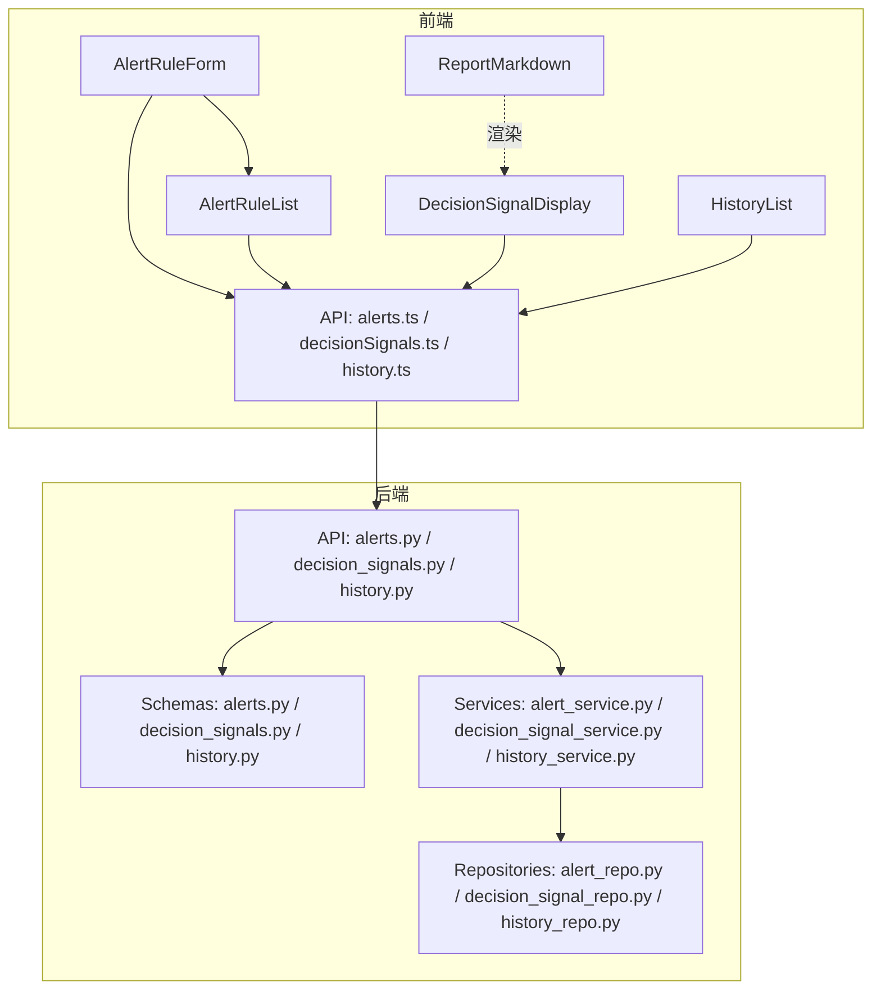
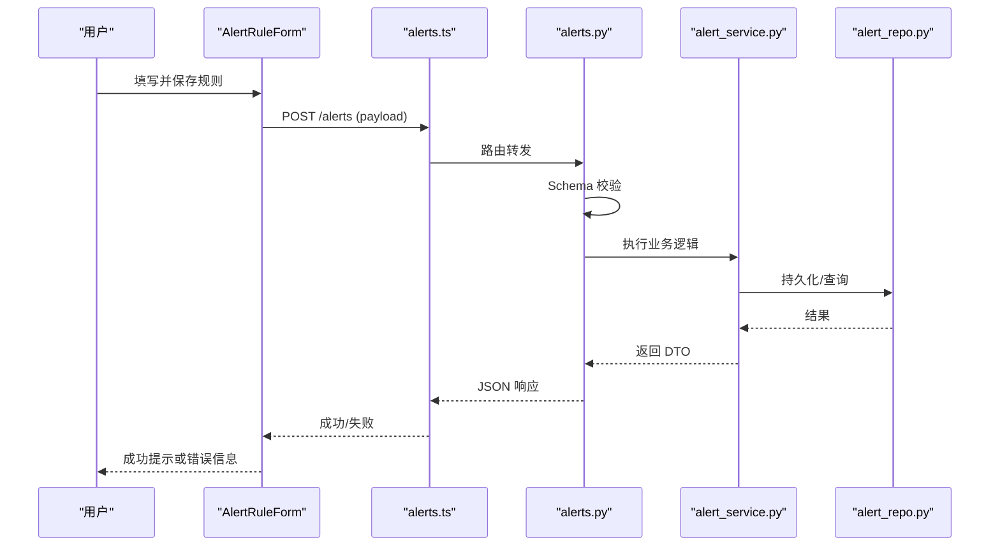
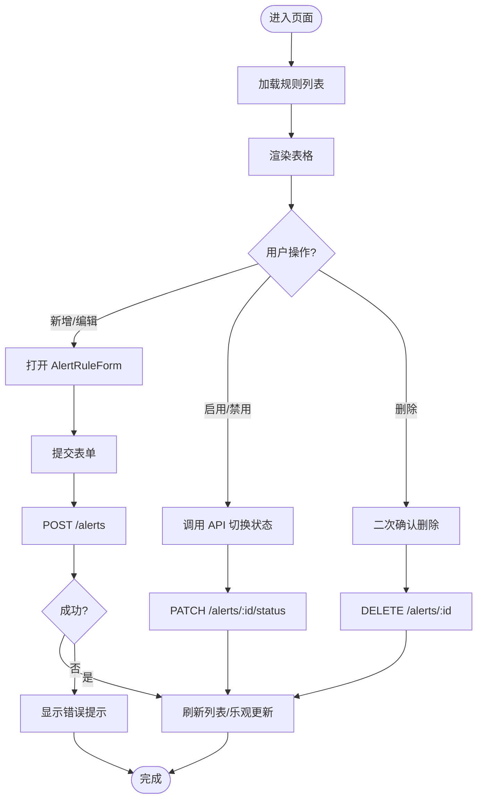
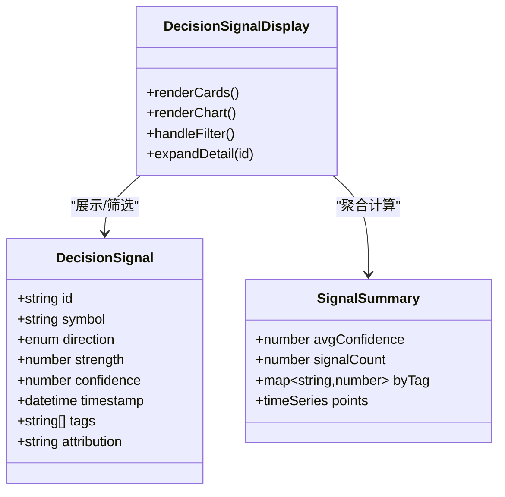
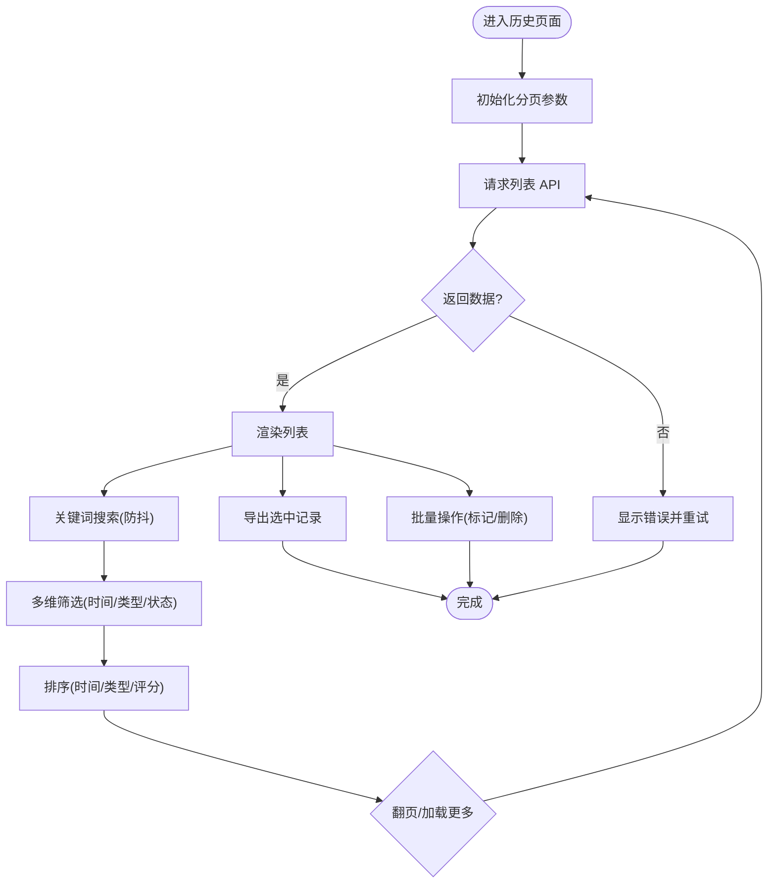
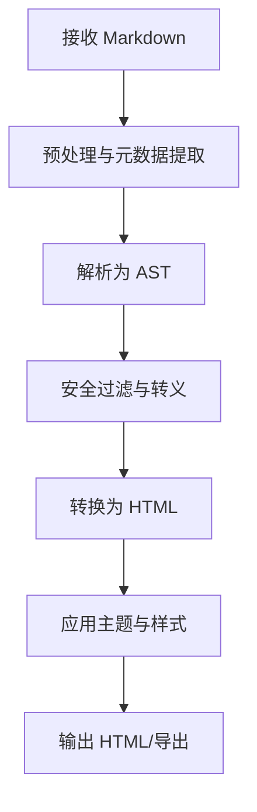
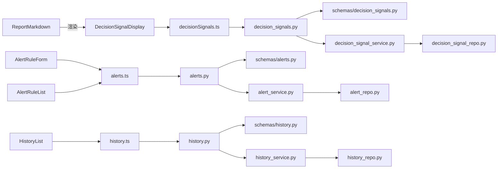

# 专业领域组件

<cite>
**本文档引用的文件**   
- [apps/dsa-web/src/components/alerts/AlertRuleForm.tsx](file://apps/dsa-web/src/components/alerts/AlertRuleForm.tsx)
- [apps/dsa-web/src/components/alerts/AlertRuleList.tsx](file://apps/dsa-web/src/components/alerts/AlertRuleList.tsx)
- [apps/dsa-web/src/components/decision-signals/DecisionSignalDisplay.tsx](file://apps/dsa-web/src/components/decision-signals/DecisionSignalDisplay.tsx)
- [apps/dsa-web/src/components/history/HistoryList.tsx](file://apps/dsa-web/src/components/history/HistoryList.tsx)
- [apps/dsa-web/src/components/report/ReportMarkdown.tsx](file://apps/dsa-web/src/components/report/ReportMarkdown.tsx)
- [apps/dsa-web/src/api/alerts.ts](file://apps/dsa-web/src/api/alerts.ts)
- [apps/dsa-web/src/api/decisionSignals.ts](file://apps/dsa-web/src/api/decisionSignals.ts)
- [apps/dsa-web/src/api/history.ts](file://apps/dsa-web/src/api/history.ts)
- [api/v1/endpoints/alerts.py](file://api/v1/endpoints/alerts.py)
- [api/v1/endpoints/decision_signals.py](file://api/v1/endpoints/decision_signals.py)
- [api/v1/endpoints/history.py](file://api/v1/endpoints/history.py)
- [api/v1/schemas/alerts.py](file://api/v1/schemas/alerts.py)
- [api/v1/schemas/decision_signals.py](file://api/v1/schemas/decision_signals.py)
- [api/v1/schemas/history.py](file://api/v1/schemas/history.py)
- [src/services/alert_service.py](file://src/services/alert_service.py)
- [src/services/decision_signal_service.py](file://src/services/decision_signal_service.py)
- [src/services/history_service.py](file://src/services/history_service.py)
- [src/repositories/alert_repo.py](file://src/repositories/alert_repo.py)
- [src/repositories/decision_signal_repo.py](file://src/repositories/decision_signal_repo.py)
- [src/repositories/history_repo.py](file://src/repositories/history_repo.py)
</cite>

## 目录
1. [简介](#简介)
2. [项目结构](#项目结构)
3. [核心组件](#核心组件)
4. [架构总览](#架构总览)
5. [详细组件分析](#详细组件分析)
6. [依赖分析](#依赖分析)
7. [性能考虑](#性能考虑)
8. [故障排查指南](#故障排查指南)
9. [结论](#结论)
10. [附录](#附录)

## 简介
本文件聚焦于专业领域的前端业务组件与后端服务、数据层的协作关系，围绕以下目标展开：
- 警报规则 AlertRuleForm 与 AlertRuleList 的业务逻辑和用户交互设计
- 决策信号 DecisionSignalDisplay 的数据可视化与交互功能
- 历史记录 HistoryList 的分页、搜索与筛选能力
- 报告渲染 ReportMarkdown 的 Markdown 解析与安全处理
- 组件状态管理与数据同步策略
- 错误处理与用户反馈机制
- 专业组件与业务逻辑的解耦设计与可测试性考量

## 项目结构
前端位于 apps/dsa-web/src/components，按功能域划分（alerts、decision-signals、history、report），API 调用集中在 src/api。后端 API 定义在 api/v1/endpoints 与 schemas，业务逻辑在 src/services，数据访问在 src/repositories。

图表来源
- [apps/dsa-web/src/components/alerts/AlertRuleForm.tsx](file://apps/dsa-web/src/components/alerts/AlertRuleForm.tsx)
- [apps/dsa-web/src/components/alerts/AlertRuleList.tsx](file://apps/dsa-web/src/components/alerts/AlertRuleList.tsx)
- [apps/dsa-web/src/components/decision-signals/DecisionSignalDisplay.tsx](file://apps/dsa-web/src/components/decision-signals/DecisionSignalDisplay.tsx)
- [apps/dsa-web/src/components/history/HistoryList.tsx](file://apps/dsa-web/src/components/history/HistoryList.tsx)
- [apps/dsa-web/src/components/report/ReportMarkdown.tsx](file://apps/dsa-web/src/components/report/ReportMarkdown.tsx)
- [apps/dsa-web/src/api/alerts.ts](file://apps/dsa-web/src/api/alerts.ts)
- [apps/dsa-web/src/api/decisionSignals.ts](file://apps/dsa-web/src/api/decisionSignals.ts)
- [apps/dsa-web/src/api/history.ts](file://apps/dsa-web/src/api/history.ts)
- [api/v1/endpoints/alerts.py](file://api/v1/endpoints/alerts.py)
- [api/v1/endpoints/decision_signals.py](file://api/v1/endpoints/decision_signals.py)
- [api/v1/endpoints/history.py](file://api/v1/endpoints/history.py)
- [api/v1/schemas/alerts.py](file://api/v1/schemas/alerts.py)
- [api/v1/schemas/decision_signals.py](file://api/v1/schemas/decision_signals.py)
- [api/v1/schemas/history.py](file://api/v1/schemas/history.py)
- [src/services/alert_service.py](file://src/services/alert_service.py)
- [src/services/decision_signal_service.py](file://src/services/decision_signal_service.py)
- [src/services/history_service.py](file://src/services/history_service.py)
- [src/repositories/alert_repo.py](file://src/repositories/alert_repo.py)
- [src/repositories/decision_signal_repo.py](file://src/repositories/decision_signal_repo.py)
- [src/repositories/history_repo.py](file://src/repositories/history_repo.py)

章节来源
- [apps/dsa-web/src/components/alerts/AlertRuleForm.tsx](file://apps/dsa-web/src/components/alerts/AlertRuleForm.tsx)
- [apps/dsa-web/src/components/alerts/AlertRuleList.tsx](file://apps/dsa-web/src/components/alerts/AlertRuleList.tsx)
- [apps/dsa-web/src/components/decision-signals/DecisionSignalDisplay.tsx](file://apps/dsa-web/src/components/decision-signals/DecisionSignalDisplay.tsx)
- [apps/dsa-web/src/components/history/HistoryList.tsx](file://apps/dsa-web/src/components/history/HistoryList.tsx)
- [apps/dsa-web/src/components/report/ReportMarkdown.tsx](file://apps/dsa-web/src/components/report/ReportMarkdown.tsx)
- [apps/dsa-web/src/api/alerts.ts](file://apps/dsa-web/src/api/alerts.ts)
- [apps/dsa-web/src/api/decisionSignals.ts](file://apps/dsa-web/src/api/decisionSignals.ts)
- [apps/dsa-web/src/api/history.ts](file://apps/dsa-web/src/api/history.ts)
- [api/v1/endpoints/alerts.py](file://api/v1/endpoints/alerts.py)
- [api/v1/endpoints/decision_signals.py](file://api/v1/endpoints/decision_signals.py)
- [api/v1/endpoints/history.py](file://api/v1/endpoints/history.py)
- [api/v1/schemas/alerts.py](file://api/v1/schemas/alerts.py)
- [api/v1/schemas/decision_signals.py](file://api/v1/schemas/decision_signals.py)
- [api/v1/schemas/history.py](file://api/v1/schemas/history.py)
- [src/services/alert_service.py](file://src/services/alert_service.py)
- [src/services/decision_signal_service.py](file://src/services/decision_signal_service.py)
- [src/services/history_service.py](file://src/services/history_service.py)
- [src/repositories/alert_repo.py](file://src/repositories/alert_repo.py)
- [src/repositories/decision_signal_repo.py](file://src/repositories/decision_signal_repo.py)
- [src/repositories/history_repo.py](file://src/repositories/history_repo.py)

## 核心组件
- AlertRuleForm：负责创建/编辑警报规则，包含字段校验、提交与失败回退、乐观更新与错误提示。
- AlertRuleList：展示规则列表，支持启用/禁用、删除、批量操作与刷新；与表单联动保持状态一致。
- DecisionSignalDisplay：聚合并可视化决策信号，包括指标卡片、趋势图、评分与置信度、时间线等，并提供交互筛选与详情展开。
- HistoryList：历史记录的列表视图，提供分页、关键词搜索与多维筛选（时间范围、类型、状态等）。
- ReportMarkdown：将 Markdown 内容安全渲染为 HTML，内置白名单与脚本过滤，支持主题切换与导出。

章节来源
- [apps/dsa-web/src/components/alerts/AlertRuleForm.tsx](file://apps/dsa-web/src/components/alerts/AlertRuleForm.tsx)
- [apps/dsa-web/src/components/alerts/AlertRuleList.tsx](file://apps/dsa-web/src/components/alerts/AlertRuleList.tsx)
- [apps/dsa-web/src/components/decision-signals/DecisionSignalDisplay.tsx](file://apps/dsa-web/src/components/decision-signals/DecisionSignalDisplay.tsx)
- [apps/dsa-web/src/components/history/HistoryList.tsx](file://apps/dsa-web/src/components/history/HistoryList.tsx)
- [apps/dsa-web/src/components/report/ReportMarkdown.tsx](file://apps/dsa-web/src/components/report/ReportMarkdown.tsx)

## 架构总览
前端通过统一的 API 层与后端 REST 接口通信，后端由路由层、Schema 校验、Service 业务编排与 Repository 数据访问组成。组件仅关注 UI 状态与交互，业务规则下沉至 Service 层，保证可测试性与可维护性。

图表来源
- [apps/dsa-web/src/components/alerts/AlertRuleForm.tsx](file://apps/dsa-web/src/components/alerts/AlertRuleForm.tsx)
- [apps/dsa-web/src/api/alerts.ts](file://apps/dsa-web/src/api/alerts.ts)
- [api/v1/endpoints/alerts.py](file://api/v1/endpoints/alerts.py)
- [api/v1/schemas/alerts.py](file://api/v1/schemas/alerts.py)
- [src/services/alert_service.py](file://src/services/alert_service.py)
- [src/repositories/alert_repo.py](file://src/repositories/alert_repo.py)

## 详细组件分析

### 警报规则：AlertRuleForm 与 AlertRuleList
- 表单设计
  - 字段：规则名称、触发条件（阈值/表达式）、标的范围、通知渠道、生效时间窗、优先级等。
  - 校验：必填项、数值范围、正则匹配、重复规则检测。
  - 交互：实时预览、草稿自动保存、提交加载态、失败重试。
- 列表设计
  - 展示：规则名、状态、最近触发时间、优先级、操作按钮。
  - 操作：启用/禁用、编辑、删除、复制、批量导入/导出。
  - 同步：与表单共享规则缓存，避免重复请求；变更时局部刷新。

图表来源
- [apps/dsa-web/src/components/alerts/AlertRuleForm.tsx](file://apps/dsa-web/src/components/alerts/AlertRuleForm.tsx)
- [apps/dsa-web/src/components/alerts/AlertRuleList.tsx](file://apps/dsa-web/src/components/alerts/AlertRuleList.tsx)
- [apps/dsa-web/src/api/alerts.ts](file://apps/dsa-web/src/api/alerts.ts)
- [api/v1/endpoints/alerts.py](file://api/v1/endpoints/alerts.py)
- [api/v1/schemas/alerts.py](file://api/v1/schemas/alerts.py)
- [src/services/alert_service.py](file://src/services/alert_service.py)
- [src/repositories/alert_repo.py](file://src/repositories/alert_repo.py)

章节来源
- [apps/dsa-web/src/components/alerts/AlertRuleForm.tsx](file://apps/dsa-web/src/components/alerts/AlertRuleForm.tsx)
- [apps/dsa-web/src/components/alerts/AlertRuleList.tsx](file://apps/dsa-web/src/components/alerts/AlertRuleList.tsx)
- [apps/dsa-web/src/api/alerts.ts](file://apps/dsa-web/src/api/alerts.ts)
- [api/v1/endpoints/alerts.py](file://api/v1/endpoints/alerts.py)
- [api/v1/schemas/alerts.py](file://api/v1/schemas/alerts.py)
- [src/services/alert_service.py](file://src/services/alert_service.py)
- [src/repositories/alert_repo.py](file://src/repositories/alert_repo.py)

### 决策信号：DecisionSignalDisplay
- 数据模型
  - 信号维度：方向（看多/看空/中性）、强度、置信度、时间戳、来源、归因标签。
  - 聚合视图：按时间窗口汇总、加权评分、趋势折线、热力图。
- 可视化与交互
  - 指标卡片：关键数值、同比/环比变化、颜色编码。
  - 图表：折线图、柱状图、散点分布；支持缩放、平移、工具提示。
  - 筛选：时间范围、信号类型、标的、置信度阈值。
  - 详情：点击行展开归因说明、证据链、相关事件。

图表来源
- [apps/dsa-web/src/components/decision-signals/DecisionSignalDisplay.tsx](file://apps/dsa-web/src/components/decision-signals/DecisionSignalDisplay.tsx)
- [apps/dsa-web/src/api/decisionSignals.ts](file://apps/dsa-web/src/api/decisionSignals.ts)
- [api/v1/endpoints/decision_signals.py](file://api/v1/endpoints/decision_signals.py)
- [api/v1/schemas/decision_signals.py](file://api/v1/schemas/decision_signals.py)
- [src/services/decision_signal_service.py](file://src/services/decision_signal_service.py)
- [src/repositories/decision_signal_repo.py](file://src/repositories/decision_signal_repo.py)

章节来源
- [apps/dsa-web/src/components/decision-signals/DecisionSignalDisplay.tsx](file://apps/dsa-web/src/components/decision-signals/DecisionSignalDisplay.tsx)
- [apps/dsa-web/src/api/decisionSignals.ts](file://apps/dsa-web/src/api/decisionSignals.ts)
- [api/v1/endpoints/decision_signals.py](file://api/v1/endpoints/decision_signals.py)
- [api/v1/schemas/decision_signals.py](file://api/v1/schemas/decision_signals.py)
- [src/services/decision_signal_service.py](file://src/services/decision_signal_service.py)
- [src/repositories/decision_signal_repo.py](file://src/repositories/decision_signal_repo.py)

### 历史记录：HistoryList
- 分页
  - 服务端分页：page/page_size、cursor-based 可选；前端维持当前页码与每页大小。
  - 虚拟滚动：大数据量下按需渲染，减少重排。
- 搜索
  - 关键词：标题、摘要、标签模糊匹配。
  - 防抖：输入延迟 300ms 触发查询。
- 筛选
  - 时间范围：起止日期选择器。
  - 类型：分析报告、决策信号、市场回顾等。
  - 状态：已读/未读、已归档/未归档。
- 交互
  - 排序：按时间、类型、评分。
  - 导出：CSV/PDF 导出选中记录。
  - 批量：全选/反选、批量标记已读。

图表来源
- [apps/dsa-web/src/components/history/HistoryList.tsx](file://apps/dsa-web/src/components/history/HistoryList.tsx)
- [apps/dsa-web/src/api/history.ts](file://apps/dsa-web/src/api/history.ts)
- [api/v1/endpoints/history.py](file://api/v1/endpoints/history.py)
- [api/v1/schemas/history.py](file://api/v1/schemas/history.py)
- [src/services/history_service.py](file://src/services/history_service.py)
- [src/repositories/history_repo.py](file://src/repositories/history_repo.py)

章节来源
- [apps/dsa-web/src/components/history/HistoryList.tsx](file://apps/dsa-web/src/components/history/HistoryList.tsx)
- [apps/dsa-web/src/api/history.ts](file://apps/dsa-web/src/api/history.ts)
- [api/v1/endpoints/history.py](file://api/v1/endpoints/history.py)
- [api/v1/schemas/history.py](file://api/v1/schemas/history.py)
- [src/services/history_service.py](file://src/services/history_service.py)
- [src/repositories/history_repo.py](file://src/repositories/history_repo.py)

### 报告渲染：ReportMarkdown
- 解析流程
  - 输入：原始 Markdown 字符串。
  - 预处理：清理不可见字符、统一换行、提取元数据（标题、作者、时间）。
  - 转换：AST 构建、节点遍历、生成 HTML。
- 安全处理
  - 白名单：仅允许安全的 HTML 标签与属性。
  - 过滤：移除 script、event handler、data URI、内联样式风险。
  - 转义：对用户输入进行实体转义，防止 XSS。
- 渲染增强
  - 主题：明/暗主题切换，CSS 变量注入。
  - 扩展：表格、代码块高亮、数学公式（可选）、图片懒加载。
  - 导出：HTML/PDF 导出，保留样式与链接。

图表来源
- [apps/dsa-web/src/components/report/ReportMarkdown.tsx](file://apps/dsa-web/src/components/report/ReportMarkdown.tsx)

章节来源
- [apps/dsa-web/src/components/report/ReportMarkdown.tsx](file://apps/dsa-web/src/components/report/ReportMarkdown.tsx)

## 依赖分析
- 前端组件依赖 API 模块，API 模块封装 HTTP 请求、错误映射与重试策略。
- 后端路由依赖 Schema 进行入参校验，Service 编排业务逻辑，Repository 负责数据访问。
- 组件间通过 props、上下文或轻量状态管理（如 hooks）解耦，避免直接耦合业务实现。

图表来源
- [apps/dsa-web/src/components/alerts/AlertRuleForm.tsx](file://apps/dsa-web/src/components/alerts/AlertRuleForm.tsx)
- [apps/dsa-web/src/components/alerts/AlertRuleList.tsx](file://apps/dsa-web/src/components/alerts/AlertRuleList.tsx)
- [apps/dsa-web/src/components/decision-signals/DecisionSignalDisplay.tsx](file://apps/dsa-web/src/components/decision-signals/DecisionSignalDisplay.tsx)
- [apps/dsa-web/src/components/history/HistoryList.tsx](file://apps/dsa-web/src/components/history/HistoryList.tsx)
- [apps/dsa-web/src/components/report/ReportMarkdown.tsx](file://apps/dsa-web/src/components/report/ReportMarkdown.tsx)
- [apps/dsa-web/src/api/alerts.ts](file://apps/dsa-web/src/api/alerts.ts)
- [apps/dsa-web/src/api/decisionSignals.ts](file://apps/dsa-web/src/api/decisionSignals.ts)
- [apps/dsa-web/src/api/history.ts](file://apps/dsa-web/src/api/history.ts)
- [api/v1/endpoints/alerts.py](file://api/v1/endpoints/alerts.py)
- [api/v1/endpoints/decision_signals.py](file://api/v1/endpoints/decision_signals.py)
- [api/v1/endpoints/history.py](file://api/v1/endpoints/history.py)
- [api/v1/schemas/alerts.py](file://api/v1/schemas/alerts.py)
- [api/v1/schemas/decision_signals.py](file://api/v1/schemas/decision_signals.py)
- [api/v1/schemas/history.py](file://api/v1/schemas/history.py)
- [src/services/alert_service.py](file://src/services/alert_service.py)
- [src/services/decision_signal_service.py](file://src/services/decision_signal_service.py)
- [src/services/history_service.py](file://src/services/history_service.py)
- [src/repositories/alert_repo.py](file://src/repositories/alert_repo.py)
- [src/repositories/decision_signal_repo.py](file://src/repositories/decision_signal_repo.py)
- [src/repositories/history_repo.py](file://src/repositories/history_repo.py)

章节来源
- [apps/dsa-web/src/api/alerts.ts](file://apps/dsa-web/src/api/alerts.ts)
- [apps/dsa-web/src/api/decisionSignals.ts](file://apps/dsa-web/src/api/decisionSignals.ts)
- [apps/dsa-web/src/api/history.ts](file://apps/dsa-web/src/api/history.ts)
- [api/v1/endpoints/alerts.py](file://api/v1/endpoints/alerts.py)
- [api/v1/endpoints/decision_signals.py](file://api/v1/endpoints/decision_signals.py)
- [api/v1/endpoints/history.py](file://api/v1/endpoints/history.py)
- [api/v1/schemas/alerts.py](file://api/v1/schemas/alerts.py)
- [api/v1/schemas/decision_signals.py](file://api/v1/schemas/decision_signals.py)
- [api/v1/schemas/history.py](file://api/v1/schemas/history.py)
- [src/services/alert_service.py](file://src/services/alert_service.py)
- [src/services/decision_signal_service.py](file://src/services/decision_signal_service.py)
- [src/services/history_service.py](file://src/services/history_service.py)
- [src/repositories/alert_repo.py](file://src/repositories/alert_repo.py)
- [src/repositories/decision_signal_repo.py](file://src/repositories/decision_signal_repo.py)
- [src/repositories/history_repo.py](file://src/repositories/history_repo.py)

## 性能考虑
- 前端
  - 列表虚拟化：HistoryList 对大数据集采用虚拟滚动，降低 DOM 压力。
  - 防抖与节流：搜索与高频操作使用防抖，减少无效请求。
  - 增量更新：AlertRuleList 对单条状态变更进行局部刷新，避免全量重绘。
  - 资源优化：ReportMarkdown 的图片懒加载与按需高亮。
- 后端
  - 分页与索引：HistoryList 与 DecisionSignal 查询使用分页与必要索引。
  - 缓存策略：热点数据（如规则列表、信号摘要）短期缓存，降低 DB 压力。
  - 异步任务：耗时操作（如批量导出、复杂聚合）走队列异步执行。

[本节为通用指导，不直接分析具体文件]

## 故障排查指南
- 常见错误
  - 网络超时/重试：API 层统一捕获并提示“网络异常”，支持手动重试。
  - 表单校验失败：前端即时提示，定位到具体字段；后端 Schema 校验失败返回明确错误码。
  - 渲染异常：ReportMarkdown 捕获解析错误，降级为纯文本展示并记录日志。
- 调试建议
  - 前端：开启请求日志、查看网络面板、检查状态更新链路。
  - 后端：检查路由日志、Schema 校验错误、Service 异常堆栈、Repository 查询性能。
- 恢复策略
  - 乐观更新失败时回滚本地状态。
  - 列表页支持“重新加载”与“清空筛选”。
  - 报告渲染失败时提供“下载原始 Markdown”选项。

章节来源
- [apps/dsa-web/src/api/alerts.ts](file://apps/dsa-web/src/api/alerts.ts)
- [apps/dsa-web/src/api/decisionSignals.ts](file://apps/dsa-web/src/api/decisionSignals.ts)
- [apps/dsa-web/src/api/history.ts](file://apps/dsa-web/src/api/history.ts)
- [api/v1/endpoints/alerts.py](file://api/v1/endpoints/alerts.py)
- [api/v1/endpoints/decision_signals.py](file://api/v1/endpoints/decision_signals.py)
- [api/v1/endpoints/history.py](file://api/v1/endpoints/history.py)
- [api/v1/schemas/alerts.py](file://api/v1/schemas/alerts.py)
- [api/v1/schemas/decision_signals.py](file://api/v1/schemas/decision_signals.py)
- [api/v1/schemas/history.py](file://api/v1/schemas/history.py)

## 结论
本套专业领域组件以清晰的职责边界与分层架构实现了警报规则管理、决策信号可视化与历史记录检索，并通过严格的安全处理与完善的错误反馈提升用户体验。组件与业务逻辑解耦，便于单元测试与集成测试覆盖，具备良好的可扩展性与可维护性。

[本节为总结性内容，不直接分析具体文件]

## 附录
- 最佳实践
  - 组件只持有 UI 状态，业务规则下沉至 Service。
  - API 层统一错误映射与重试策略。
  - 渲染层坚持白名单与转义，杜绝 XSS。
  - 列表与图表组件支持虚拟化与按需加载。
- 可测试性
  - 组件：Mock API 与状态快照测试。
  - 服务：断言业务规则与边界条件。
  - 仓库：隔离数据库，使用内存或测试夹具。

[本节为通用指导，不直接分析具体文件]