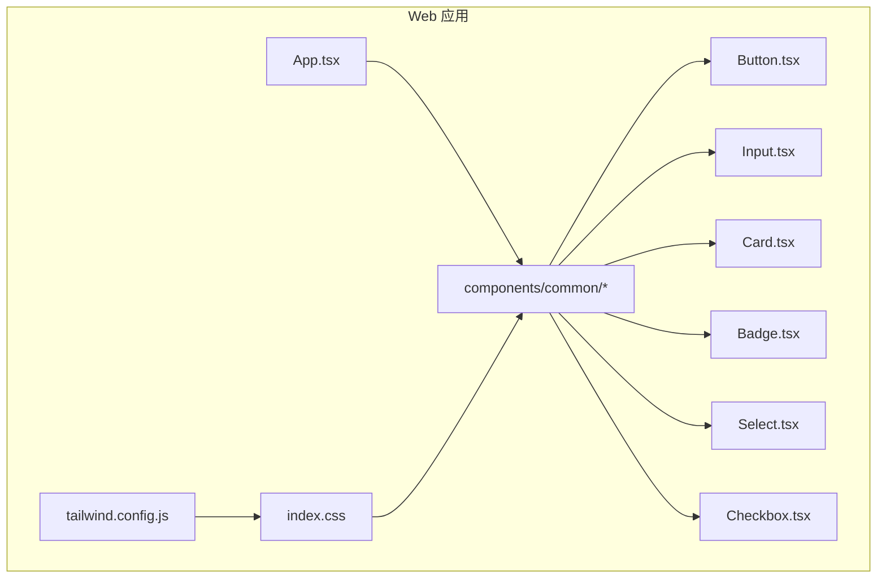
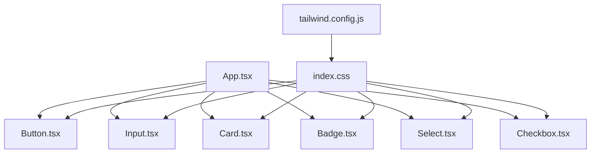
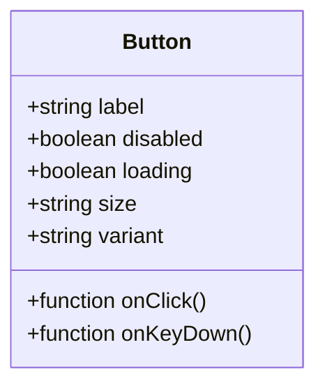
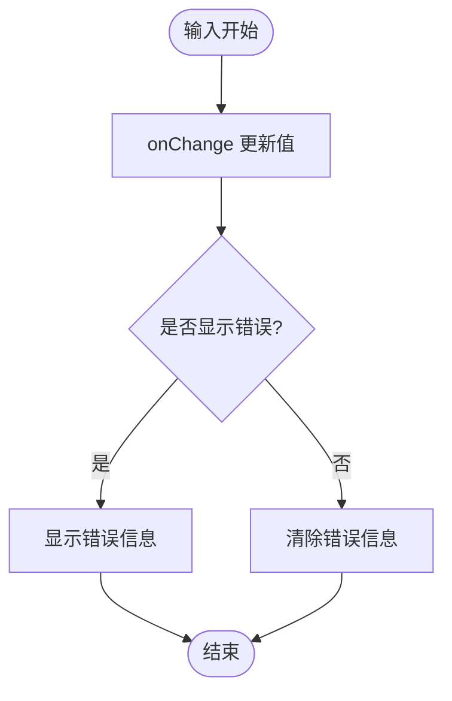
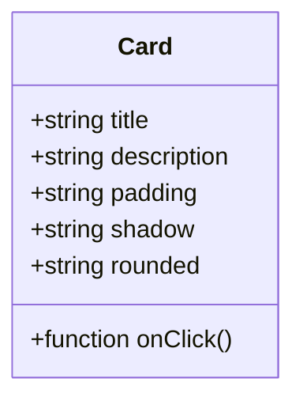
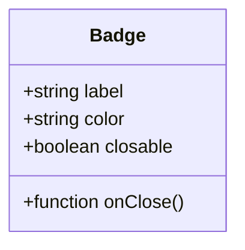
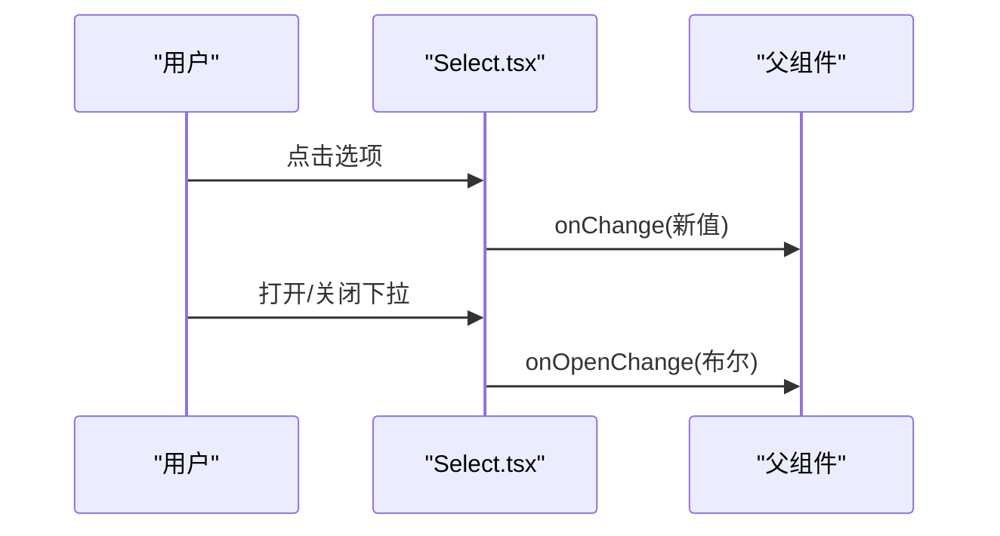
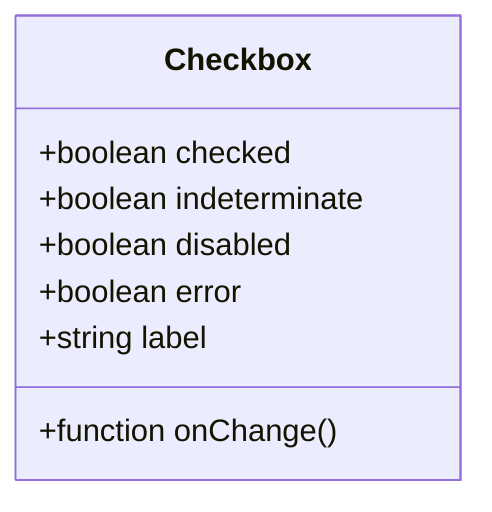
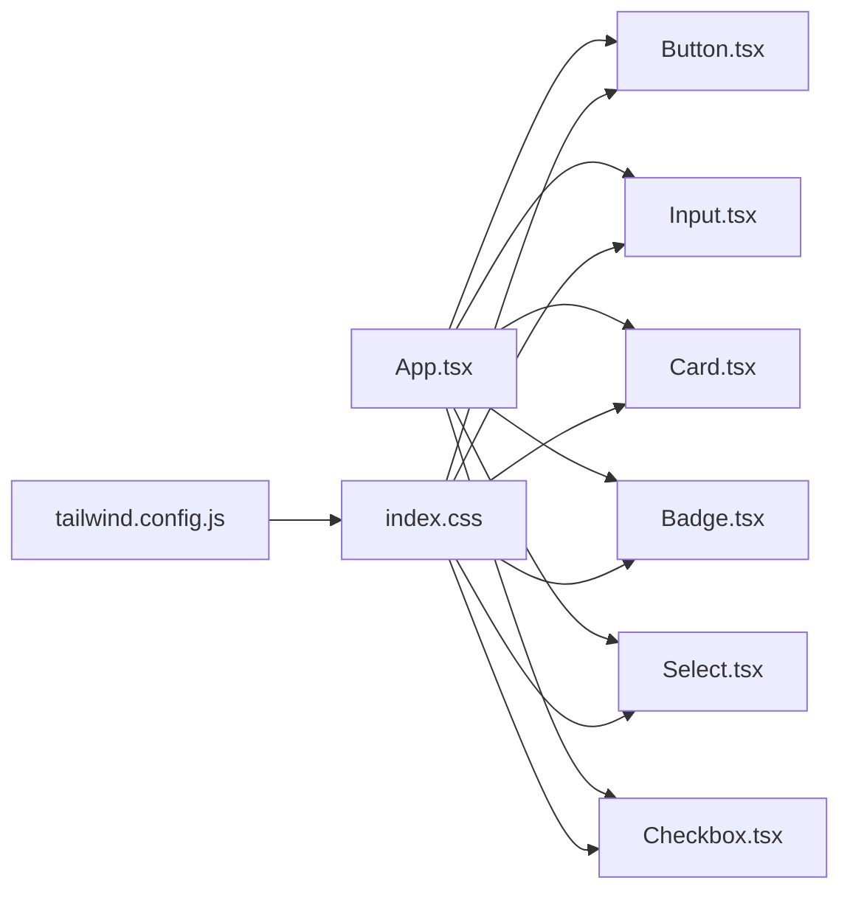

# 基础组件

<cite>
**本文档引用的文件**   
- [apps/dsa-web/src/components/common/Button.tsx](file://apps/dsa-web/src/components/common/Button.tsx)
- [apps/dsa-web/src/components/common/Input.tsx](file://apps/dsa-web/src/components/common/Input.tsx)
- [apps/dsa-web/src/components/common/Card.tsx](file://apps/dsa-web/src/components/common/Card.tsx)
- [apps/dsa-web/src/components/common/Badge.tsx](file://apps/dsa-web/src/components/common/Badge.tsx)
- [apps/dsa-web/src/components/common/Select.tsx](file://apps/dsa-web/src/components/common/Select.tsx)
- [apps/dsa-web/src/components/common/Checkbox.tsx](file://apps/dsa-web/src/components/common/Checkbox.tsx)
- [apps/dsa-web/tailwind.config.js](file://apps/dsa-web/tailwind.config.js)
- [apps/dsa-web/src/index.css](file://apps/dsa-web/src/index.css)
- [apps/dsa-web/src/App.tsx](file://apps/dsa-web/src/App.tsx)
</cite>

## 目录
1. [简介](#简介)
2. [项目结构](#项目结构)
3. [核心组件](#核心组件)
4. [架构总览](#架构总览)
5. [详细组件分析](#详细组件分析)
6. [依赖分析](#依赖分析)
7. [性能考虑](#性能考虑)
8. [故障排查指南](#故障排查指南)
9. [结论](#结论)
10. [附录](#附录)

## 简介
本文件面向前端开发者与使用者，系统化梳理并文档化基础UI组件库（按钮、输入框、卡片、徽章、选择框、复选框）的实现与使用方式。内容覆盖：
- Props 接口定义与默认值
- 事件处理机制
- 样式定制选项（基于 Tailwind CSS）
- 可访问性支持（a11y）
- 响应式设计策略
- 性能优化技巧与最佳实践
- 典型用法、组合用法与高级配置示例路径

## 项目结构
Web 应用位于 apps/dsa-web 目录，基础组件集中在 components/common 下，样式体系采用 Tailwind CSS，并通过 index.css 进行全局样式初始化。入口页面 App.tsx 用于演示与集成各组件。

图表来源
- [apps/dsa-web/src/App.tsx](file://apps/dsa-web/src/App.tsx)
- [apps/dsa-web/src/components/common/Button.tsx](file://apps/dsa-web/src/components/common/Button.tsx)
- [apps/dsa-web/src/components/common/Input.tsx](file://apps/dsa-web/src/components/common/Input.tsx)
- [apps/dsa-web/src/components/common/Card.tsx](file://apps/dsa-web/src/components/common/Card.tsx)
- [apps/dsa-web/src/components/common/Badge.tsx](file://apps/dsa-web/src/components/common/Badge.tsx)
- [apps/dsa-web/src/components/common/Select.tsx](file://apps/dsa-web/src/components/common/Select.tsx)
- [apps/dsa-web/src/components/common/Checkbox.tsx](file://apps/dsa-web/src/components/common/Checkbox.tsx)
- [apps/dsa-web/tailwind.config.js](file://apps/dsa-web/tailwind.config.js)
- [apps/dsa-web/src/index.css](file://apps/dsa-web/src/index.css)

章节来源
- [apps/dsa-web/src/App.tsx](file://apps/dsa-web/src/App.tsx)
- [apps/dsa-web/tailwind.config.js](file://apps/dsa-web/tailwind.config.js)
- [apps/dsa-web/src/index.css](file://apps/dsa-web/src/index.css)

## 核心组件
本节对六大基础组件进行统一说明，涵盖：
- Props 接口要点与默认值
- 事件处理与受控/非受控模式
- 样式定制（Tailwind 类名、主题变量）
- 可访问性与响应式行为
- 常见用法与组合示例路径

章节来源
- [apps/dsa-web/src/components/common/Button.tsx](file://apps/dsa-web/src/components/common/Button.tsx)
- [apps/dsa-web/src/components/common/Input.tsx](file://apps/dsa-web/src/components/common/Input.tsx)
- [apps/dsa-web/src/components/common/Card.tsx](file://apps/dsa-web/src/components/common/Card.tsx)
- [apps/dsa-web/src/components/common/Badge.tsx](file://apps/dsa-web/src/components/common/Badge.tsx)
- [apps/dsa-web/src/components/common/Select.tsx](file://apps/dsa-web/src/components/common/Select.tsx)
- [apps/dsa-web/src/components/common/Checkbox.tsx](file://apps/dsa-web/src/components/common/Checkbox.tsx)

## 架构总览
组件层通过统一的样式系统（Tailwind）与全局样式（index.css）保持一致的视觉语言；业务页面通过 App.tsx 引入并使用这些组件。所有交互事件在组件内部封装，向上抛出标准化回调，便于上层状态管理。

图表来源
- [apps/dsa-web/src/App.tsx](file://apps/dsa-web/src/App.tsx)
- [apps/dsa-web/tailwind.config.js](file://apps/dsa-web/tailwind.config.js)
- [apps/dsa-web/src/index.css](file://apps/dsa-web/src/index.css)
- [apps/dsa-web/src/components/common/Button.tsx](file://apps/dsa-web/src/components/common/Button.tsx)
- [apps/dsa-web/src/components/common/Input.tsx](file://apps/dsa-web/src/components/common/Input.tsx)
- [apps/dsa-web/src/components/common/Card.tsx](file://apps/dsa-web/src/components/common/Card.tsx)
- [apps/dsa-web/src/components/common/Badge.tsx](file://apps/dsa-web/src/components/common/Badge.tsx)
- [apps/dsa-web/src/components/common/Select.tsx](file://apps/dsa-web/src/components/common/Select.tsx)
- [apps/dsa-web/src/components/common/Checkbox.tsx](file://apps/dsa-web/src/components/common/Checkbox.tsx)

## 详细组件分析

### 按钮 Button
- 功能概述：提供标准点击交互，支持多种尺寸、颜色变体、禁用态与加载态。
- Props 接口要点
  - 文本与图标：支持纯文本、图标前置/后置、自定义子节点
  - 尺寸：小/中/大
  - 颜色：主色、次要、危险、成功等语义化变体
  - 状态：disabled、loading
  - 布局：块级/行内、宽度自适应
  - 事件：onClick、onKeyDown（键盘回车/空格触发）
- 默认属性值
  - 尺寸：中
  - 颜色：主色
  - disabled/loading：false
- 事件处理机制
  - 点击事件冒泡控制，避免重复触发
  - 键盘可达性：Enter/Space 触发 onClick
  - loading 状态下禁用交互
- 样式定制选项
  - 通过 className 追加 Tailwind 类名
  - 支持 hover/focus/disabled 状态样式覆盖
- 可访问性支持
  - role="button"（当以非 button 元素渲染时）
  - aria-disabled、aria-busy（loading）
  - 焦点可见性
- 响应式设计
  - 移动端全宽、桌面端按需宽度
- 使用示例路径
  - 基本用法：[Button.tsx](file://apps/dsa-web/src/components/common/Button.tsx)
  - 组合用法（图标+文字）：[Button.tsx](file://apps/dsa-web/src/components/common/Button.tsx)
  - 高级配置（loading+禁用+键盘事件）：[Button.tsx](file://apps/dsa-web/src/components/common/Button.tsx)

图表来源
- [apps/dsa-web/src/components/common/Button.tsx](file://apps/dsa-web/src/components/common/Button.tsx)

章节来源
- [apps/dsa-web/src/components/common/Button.tsx](file://apps/dsa-web/src/components/common/Button.tsx)

### 输入框 Input
- 功能概述：文本输入控件，支持占位符、只读、禁用、错误提示、前缀/后缀插槽。
- Props 接口要点
  - value/onChange 受控模式
  - placeholder、type、readOnly、disabled
  - error、helperText
  - prefix/suffix（图标或文本）
  - maxLength、autoFocus
  - 事件：onChange、onFocus、onBlur、onKeyDown
- 默认属性值
  - type：text
  - readOnly/disabled：false
  - error/helperText：空
- 事件处理机制
  - 受控模式下 onChange 同步父级状态
  - 失焦校验提示展示
- 样式定制选项
  - 通过 className 扩展样式
  - 错误态高亮边框与提示文本颜色
- 可访问性支持
  - aria-invalid（error 为真）
  - aria-describedby（关联 helperText/error）
  - 标签关联（for/id）
- 响应式设计
  - 全宽适配，移动端字体大小调整
- 使用示例路径
  - 基本用法：[Input.tsx](file://apps/dsa-web/src/components/common/Input.tsx)
  - 组合用法（前缀/后缀+错误提示）：[Input.tsx](file://apps/dsa-web/src/components/common/Input.tsx)
  - 高级配置（受控+校验+键盘事件）：[Input.tsx](file://apps/dsa-web/src/components/common/Input.tsx)

图表来源
- [apps/dsa-web/src/components/common/Input.tsx](file://apps/dsa-web/src/components/common/Input.tsx)

章节来源
- [apps/dsa-web/src/components/common/Input.tsx](file://apps/dsa-web/src/components/common/Input.tsx)

### 卡片 Card
- 功能概述：内容容器，提供阴影、圆角、内边距与标题/描述区域。
- Props 接口要点
  - title、description
  - padding、shadow、rounded
  - header/footer 插槽
  - 事件：无强制事件，仅透传 onClick
- 默认属性值
  - padding：中等
  - shadow：默认
  - rounded：中等
- 事件处理机制
  - 可选点击事件透传
- 样式定制选项
  - 通过 className 覆盖背景、边框、阴影
- 可访问性支持
  - 语义化标签（article/div），必要时添加 role="region"
- 响应式设计
  - 移动端增加上下间距，卡片宽度自适应
- 使用示例路径
  - 基本用法：[Card.tsx](file://apps/dsa-web/src/components/common/Card.tsx)
  - 组合用法（标题+描述+底部操作）：[Card.tsx](file://apps/dsa-web/src/components/common/Card.tsx)
  - 高级配置（自定义阴影/圆角/点击）：[Card.tsx](file://apps/dsa-web/src/components/common/Card.tsx)

图表来源
- [apps/dsa-web/src/components/common/Card.tsx](file://apps/dsa-web/src/components/common/Card.tsx)

章节来源
- [apps/dsa-web/src/components/common/Card.tsx](file://apps/dsa-web/src/components/common/Card.tsx)

### 徽章 Badge
- 功能概述：轻量状态标识，支持颜色变体与可关闭。
- Props 接口要点
  - label、color、closable
  - onClose（closable 为真时触发）
- 默认属性值
  - color：默认
  - closable：false
- 事件处理机制
  - 关闭按钮点击触发 onClose
- 样式定制选项
  - 通过 className 覆盖颜色与尺寸
- 可访问性支持
  - role="status"（表示状态）
  - aria-label（描述性文本）
- 响应式设计
  - 小屏紧凑布局，多徽章自动换行
- 使用示例路径
  - 基本用法：[Badge.tsx](file://apps/dsa-web/src/components/common/Badge.tsx)
  - 组合用法（多色+可关闭）：[Badge.tsx](file://apps/dsa-web/src/components/common/Badge.tsx)
  - 高级配置（自定义样式+事件）：[Badge.tsx](file://apps/dsa-web/src/components/common/Badge.tsx)

图表来源
- [apps/dsa-web/src/components/common/Badge.tsx](file://apps/dsa-web/src/components/common/Badge.tsx)

章节来源
- [apps/dsa-web/src/components/common/Badge.tsx](file://apps/dsa-web/src/components/common/Badge.tsx)

### 选择框 Select
- 功能概述：下拉选择控件，支持单选/多选、搜索过滤、禁用与错误提示。
- Props 接口要点
  - options（label/value）
  - value/multiple 受控模式
  - searchable、placeholder、disabled、error
  - onChange、onOpenChange
- 默认属性值
  - multiple：false
  - searchable：false
  - disabled/error：false
- 事件处理机制
  - 选择变更触发 onChange
  - 打开/关闭下拉触发 onOpenChange
- 样式定制选项
  - 通过 className 覆盖下拉菜单与选项样式
- 可访问性支持
  - aria-expanded、aria-selected、aria-disabled
  - 键盘导航（上下键、回车确认、Esc 关闭）
- 响应式设计
  - 移动端全屏下拉面板
- 使用示例路径
  - 基本用法：[Select.tsx](file://apps/dsa-web/src/components/common/Select.tsx)
  - 组合用法（多选+搜索）：[Select.tsx](file://apps/dsa-web/src/components/common/Select.tsx)
  - 高级配置（禁用+错误+键盘事件）：[Select.tsx](file://apps/dsa-web/src/components/common/Select.tsx)

图表来源
- [apps/dsa-web/src/components/common/Select.tsx](file://apps/dsa-web/src/components/common/Select.tsx)

章节来源
- [apps/dsa-web/src/components/common/Select.tsx](file://apps/dsa-web/src/components/common/Select.tsx)

### 复选框 Checkbox
- 功能概述：布尔选择控件，支持标签、禁用、错误提示与自定义样式。
- Props 接口要点
  - checked/indeterminate 受控模式
  - label、disabled、error
  - onChange
- 默认属性值
  - checked：false
  - indeterminate：false
  - disabled/error：false
- 事件处理机制
  - 切换选中状态触发 onChange
- 样式定制选项
  - 通过 className 覆盖勾选框与标签样式
- 可访问性支持
  - aria-checked、aria-disabled
  - 键盘可达性（空格切换）
- 响应式设计
  - 移动端增大点击区域
- 使用示例路径
  - 基本用法：[Checkbox.tsx](file://apps/dsa-web/src/components/common/Checkbox.tsx)
  - 组合用法（分组+半选）：[Checkbox.tsx](file://apps/dsa-web/src/components/common/Checkbox.tsx)
  - 高级配置（禁用+错误+键盘事件）：[Checkbox.tsx](file://apps/dsa-web/src/components/common/Checkbox.tsx)

图表来源
- [apps/dsa-web/src/components/common/Checkbox.tsx](file://apps/dsa-web/src/components/common/Checkbox.tsx)

章节来源
- [apps/dsa-web/src/components/common/Checkbox.tsx](file://apps/dsa-web/src/components/common/Checkbox.tsx)

## 依赖分析
- 组件间耦合度低，均通过 props 与事件通信，便于独立测试与复用
- 样式依赖 Tailwind CSS，通过 tailwind.config.js 与 index.css 统一管理主题与全局样式
- 入口 App.tsx 作为集成点，组织并演示各组件的使用

图表来源
- [apps/dsa-web/src/App.tsx](file://apps/dsa-web/src/App.tsx)
- [apps/dsa-web/tailwind.config.js](file://apps/dsa-web/tailwind.config.js)
- [apps/dsa-web/src/index.css](file://apps/dsa-web/src/index.css)
- [apps/dsa-web/src/components/common/Button.tsx](file://apps/dsa-web/src/components/common/Button.tsx)
- [apps/dsa-web/src/components/common/Input.tsx](file://apps/dsa-web/src/components/common/Input.tsx)
- [apps/dsa-web/src/components/common/Card.tsx](file://apps/dsa-web/src/components/common/Card.tsx)
- [apps/dsa-web/src/components/common/Badge.tsx](file://apps/dsa-web/src/components/common/Badge.tsx)
- [apps/dsa-web/src/components/common/Select.tsx](file://apps/dsa-web/src/components/common/Select.tsx)
- [apps/dsa-web/src/components/common/Checkbox.tsx](file://apps/dsa-web/src/components/common/Checkbox.tsx)

章节来源
- [apps/dsa-web/src/App.tsx](file://apps/dsa-web/src/App.tsx)
- [apps/dsa-web/tailwind.config.js](file://apps/dsa-web/tailwind.config.js)
- [apps/dsa-web/src/index.css](file://apps/dsa-web/src/index.css)

## 性能考虑
- 减少重渲染
  - 将频繁变化的状态提升到父组件，使用 memo/useMemo 缓存计算结果
  - 列表型组件（如 Select 的 options）进行稳定引用与分页/虚拟滚动
- 事件优化
  - 防抖/节流输入与搜索（Input/Select）
  - 合并多次 setState，避免抖动
- 样式与资源
  - 利用 Tailwind 的按需生成，避免冗余 CSS
  - 图片/图标懒加载与按需引入
- 可访问性与交互
  - 确保键盘可达与焦点顺序合理，提升无障碍体验与可用性

## 故障排查指南
- 样式未生效
  - 检查 tailwind.config.js 是否正确配置扫描路径
  - 确认 index.css 已正确引入
- 事件不触发
  - 检查 disabled/loading 状态是否阻止交互
  - 验证受控模式的 value/checked 是否与父级状态一致
- 可访问性问题
  - 核对 aria-* 属性与键盘导航是否符合预期
- 常见问题定位
  - 使用浏览器开发者工具检查 DOM 结构与样式覆盖
  - 在控制台打印 props 与事件参数，确认数据流

章节来源
- [apps/dsa-web/tailwind.config.js](file://apps/dsa-web/tailwind.config.js)
- [apps/dsa-web/src/index.css](file://apps/dsa-web/src/index.css)
- [apps/dsa-web/src/components/common/Button.tsx](file://apps/dsa-web/src/components/common/Button.tsx)
- [apps/dsa-web/src/components/common/Input.tsx](file://apps/dsa-web/src/components/common/Input.tsx)
- [apps/dsa-web/src/components/common/Select.tsx](file://apps/dsa-web/src/components/common/Select.tsx)

## 结论
本基础组件库以清晰的 Props 接口、稳定的事件模型与 Tailwind 驱动的样式体系，提供了可扩展、可访问且响应式的 UI 能力。建议在实际项目中遵循受控模式、合理的状态管理与性能优化策略，以获得一致的交互体验与良好的可维护性。

## 附录
- 快速上手清单
  - 在 App.tsx 中引入所需组件
  - 根据业务需求设置 props 与事件回调
  - 通过 className 进行样式微调
  - 使用浏览器开发者工具调试 a11y 与性能
- 参考路径
  - 组件实现：[Button.tsx](file://apps/dsa-web/src/components/common/Button.tsx)、[Input.tsx](file://apps/dsa-web/src/components/common/Input.tsx)、[Card.tsx](file://apps/dsa-web/src/components/common/Card.tsx)、[Badge.tsx](file://apps/dsa-web/src/components/common/Badge.tsx)、[Select.tsx](file://apps/dsa-web/src/components/common/Select.tsx)、[Checkbox.tsx](file://apps/dsa-web/src/components/common/Checkbox.tsx)
  - 样式配置：[tailwind.config.js](file://apps/dsa-web/tailwind.config.js)、[index.css](file://apps/dsa-web/src/index.css)
  - 集成入口：[App.tsx](file://apps/dsa-web/src/App.tsx)