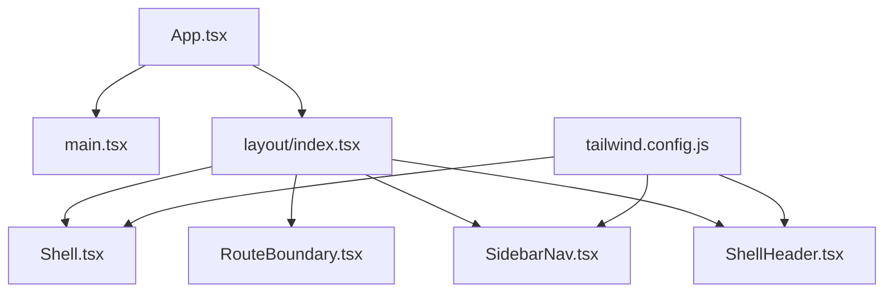
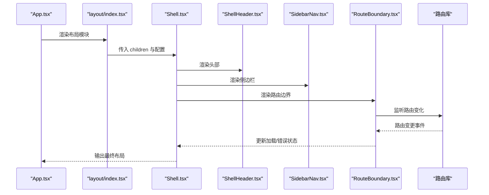
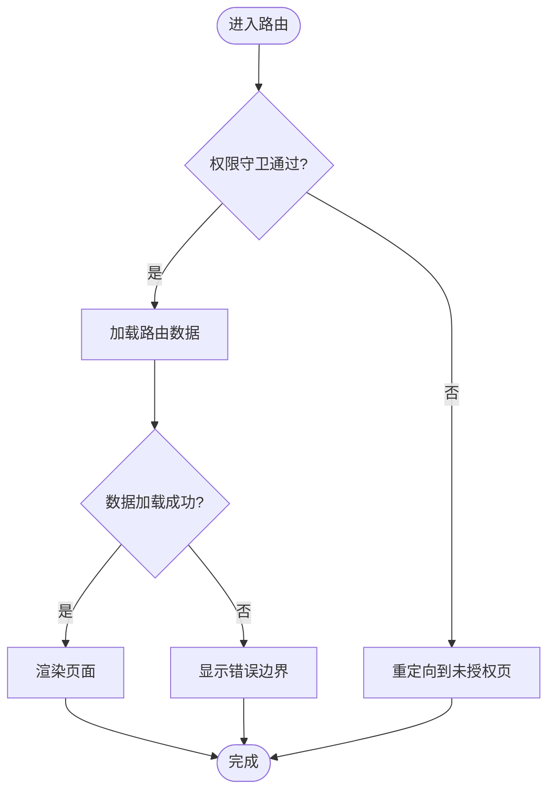
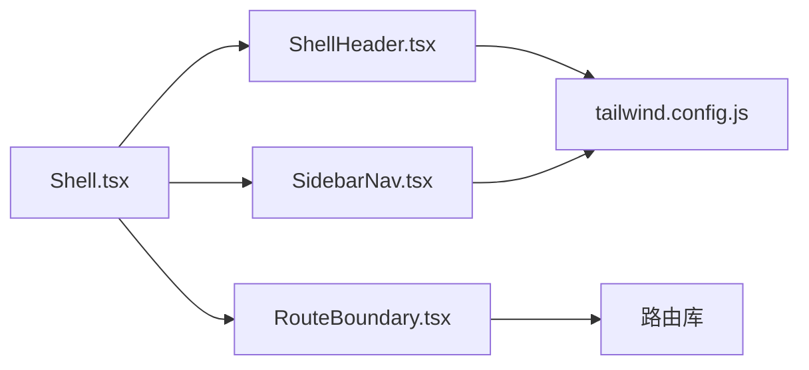

# 布局组件

<cite>
**本文引用的文件**   
- [apps/dsa-web/src/components/layout/index.tsx](file://apps/dsa-web/src/components/layout/index.tsx)
- [apps/dsa-web/src/components/layout/Shell.tsx](file://apps/dsa-web/src/components/layout/Shell.tsx)
- [apps/dsa-web/src/components/layout/RouteBoundary.tsx](file://apps/dsa-web/src/components/layout/RouteBoundary.tsx)
- [apps/dsa-web/src/components/layout/SidebarNav.tsx](file://apps/dsa-web/src/components/layout/SidebarNav.tsx)
- [apps/dsa-web/src/components/layout/ShellHeader.tsx](file://apps/dsa-web/src/components/layout/ShellHeader.tsx)
- [apps/dsa-web/src/App.tsx](file://apps/dsa-web/src/App.tsx)
- [apps/dsa-web/src/main.tsx](file://apps/dsa-web/src/main.tsx)
- [apps/dsa-web/tailwind.config.js](file://apps/dsa-web/tailwind.config.js)
</cite>

## 目录
1. [简介](#简介)
2. [项目结构](#项目结构)
3. [核心组件](#核心组件)
4. [架构总览](#架构总览)
5. [详细组件分析](#详细组件分析)
6. [依赖分析](#依赖分析)
7. [性能考虑](#性能考虑)
8. [故障排查指南](#故障排查指南)
9. [结论](#结论)
10. [附录](#附录)

## 简介
本文件面向“布局组件”的完整说明，聚焦以下目标：
- 页面外壳组件 Shell 的设计模式与职责边界
- 路由边界组件 RouteBoundary 的作用与使用方式
- 侧边栏导航 SidebarNav 的实现原理与自定义配置项
- 头部组件 ShellHeader 的功能特性与扩展机制
- 响应式布局适配方案与移动端优化策略
- 布局组件的组合使用示例与主题定制方法
- 路由守卫与权限控制在布局中的应用实践

## 项目结构
布局相关代码位于 Web 应用前端目录 apps/dsa-web/src/components/layout。该目录采用“按功能划分”的组织方式，将外壳、路由边界、侧边栏、头部等职责拆分为独立组件，便于复用与维护。



图表来源
- [apps/dsa-web/src/App.tsx](file://apps/dsa-web/src/App.tsx)
- [apps/dsa-web/src/main.tsx](file://apps/dsa-web/src/main.tsx)
- [apps/dsa-web/src/components/layout/index.tsx](file://apps/dsa-web/src/components/layout/index.tsx)
- [apps/dsa-web/src/components/layout/Shell.tsx](file://apps/dsa-web/src/components/layout/Shell.tsx)
- [apps/dsa-web/src/components/layout/RouteBoundary.tsx](file://apps/dsa-web/src/components/layout/RouteBoundary.tsx)
- [apps/dsa-web/src/components/layout/SidebarNav.tsx](file://apps/dsa-web/src/components/layout/SidebarNav.tsx)
- [apps/dsa-web/src/components/layout/ShellHeader.tsx](file://apps/dsa-web/src/components/layout/ShellHeader.tsx)
- [apps/dsa-web/tailwind.config.js](file://apps/dsa-web/tailwind.config.js)

章节来源
- [apps/dsa-web/src/components/layout/index.tsx](file://apps/dsa-web/src/components/layout/index.tsx)
- [apps/dsa-web/src/components/layout/Shell.tsx](file://apps/dsa-web/src/components/layout/Shell.tsx)
- [apps/dsa-web/src/components/layout/RouteBoundary.tsx](file://apps/dsa-web/src/components/layout/RouteBoundary.tsx)
- [apps/dsa-web/src/components/layout/SidebarNav.tsx](file://apps/dsa-web/src/components/layout/SidebarNav.tsx)
- [apps/dsa-web/src/components/layout/ShellHeader.tsx](file://apps/dsa-web/src/components/layout/ShellHeader.tsx)
- [apps/dsa-web/tailwind.config.js](file://apps/dsa-web/tailwind.config.js)

## 核心组件
- Shell（页面外壳）
  - 职责：提供全局布局容器、侧边栏与头部区域、主内容区占位、响应式状态管理、主题与国际化上下文注入点。
  - 设计模式：组合模式 + 渲染插槽（children），通过 props 暴露可配置项（如是否显示侧边栏、头部行为、断点控制）。
- RouteBoundary（路由边界）
  - 职责：在路由切换时统一处理加载态、错误态、权限校验与过渡动画；保证布局层与业务路由解耦。
- SidebarNav（侧边栏导航）
  - 职责：渲染菜单树、支持折叠/展开、高亮当前路由、响应式收起、键盘导航与无障碍属性。
  - 配置项：菜单数据源、分组、图标、权限标识、跳转规则、子菜单展开策略。
- ShellHeader（头部）
  - 职责：展示系统标题、用户信息入口、通知、搜索、主题切换、语言切换等；支持插槽扩展。
  - 扩展机制：通过 props 或插槽注入自定义按钮、下拉菜单、模态框触发器。

章节来源
- [apps/dsa-web/src/components/layout/Shell.tsx](file://apps/dsa-web/src/components/layout/Shell.tsx)
- [apps/dsa-web/src/components/layout/RouteBoundary.tsx](file://apps/dsa-web/src/components/layout/RouteBoundary.tsx)
- [apps/dsa-web/src/components/layout/SidebarNav.tsx](file://apps/dsa-web/src/components/layout/SidebarNav.tsx)
- [apps/dsa-web/src/components/layout/ShellHeader.tsx](file://apps/dsa-web/src/components/layout/ShellHeader.tsx)

## 架构总览
整体布局由 Shell 作为根容器，内部组合 ShellHeader 与 SidebarNav，并在主内容区挂载 RouteBoundary。RouteBoundary 负责路由切换时的生命周期与错误处理，确保布局稳定。



图表来源
- [apps/dsa-web/src/App.tsx](file://apps/dsa-web/src/App.tsx)
- [apps/dsa-web/src/components/layout/index.tsx](file://apps/dsa-web/src/components/layout/index.tsx)
- [apps/dsa-web/src/components/layout/Shell.tsx](file://apps/dsa-web/src/components/layout/Shell.tsx)
- [apps/dsa-web/src/components/layout/ShellHeader.tsx](file://apps/dsa-web/src/components/layout/ShellHeader.tsx)
- [apps/dsa-web/src/components/layout/SidebarNav.tsx](file://apps/dsa-web/src/components/layout/SidebarNav.tsx)
- [apps/dsa-web/src/components/layout/RouteBoundary.tsx](file://apps/dsa-web/src/components/layout/RouteBoundary.tsx)

## 详细组件分析

### Shell（页面外壳）
- 设计模式
  - 组合模式：将 Header、Sidebar、Content 组合为统一布局。
  - 插槽模式：通过 children 注入页面内容，保持布局与业务解耦。
  - 状态提升：将响应式状态（如侧边栏折叠）提升到 Shell，供 Header 与 Sidebar 共享。
- 关键能力
  - 响应式断点控制：根据屏幕宽度自动调整侧边栏显示策略。
  - 主题与国际化：提供主题切换与语言切换的上下文接入点。
  - 权限与路由集成：结合 RouteBoundary 实现基于权限的路由可见性。
- 性能要点
  - 避免在 Shell 内频繁重渲染，使用 memo 包裹非必要的子组件。
  - 懒加载侧边栏菜单数据，减少首屏体积。

```mermaid
classDiagram
class Shell {
+props : { showSidebar, headerConfig, breakpoint }
+state : { sidebarCollapsed, theme, locale }
+render()
+toggleSidebar()
+setTheme(theme)
+setLocale(locale)
}
class ShellHeader {
+props : { title, actions }
+render()
}
class SidebarNav {
+props : { menuData, onNavigate }
+render()
}
class RouteBoundary {
+props : { routes, guards }
+render()
}
Shell --> ShellHeader : "组合"
Shell --> SidebarNav : "组合"
Shell --> RouteBoundary : "组合"
```

图表来源
- [apps/dsa-web/src/components/layout/Shell.tsx](file://apps/dsa-web/src/components/layout/Shell.tsx)
- [apps/dsa-web/src/components/layout/ShellHeader.tsx](file://apps/dsa-web/src/components/layout/ShellHeader.tsx)
- [apps/dsa-web/src/components/layout/SidebarNav.tsx](file://apps/dsa-web/src/components/layout/SidebarNav.tsx)
- [apps/dsa-web/src/components/layout/RouteBoundary.tsx](file://apps/dsa-web/src/components/layout/RouteBoundary.tsx)

章节来源
- [apps/dsa-web/src/components/layout/Shell.tsx](file://apps/dsa-web/src/components/layout/Shell.tsx)

### RouteBoundary（路由边界）
- 作用
  - 统一处理路由切换时的加载、错误、权限校验与过渡动画。
  - 隔离布局层与业务路由，使 Shell 无需感知具体路由逻辑。
- 关键能力
  - 路由守卫：在进入路由前执行权限检查与前置条件验证。
  - 错误边界：捕获渲染异常并降级到友好提示。
  - 加载态：在异步路由或数据准备期间显示骨架屏。
- 使用建议
  - 将需要权限控制的页面路由放入 RouteBoundary 的 guards 配置中。
  - 对耗时操作进行预取与缓存，降低切换抖动。



图表来源
- [apps/dsa-web/src/components/layout/RouteBoundary.tsx](file://apps/dsa-web/src/components/layout/RouteBoundary.tsx)

章节来源
- [apps/dsa-web/src/components/layout/RouteBoundary.tsx](file://apps/dsa-web/src/components/layout/RouteBoundary.tsx)

### SidebarNav（侧边栏导航）
- 实现原理
  - 菜单数据驱动：通过 menuData 构建层级菜单，支持分组与图标。
  - 高亮当前路由：根据当前路径匹配菜单项，自动高亮。
  - 响应式折叠：在小屏设备上默认收起，点击触发展开。
  - 无障碍支持：提供键盘导航与 aria 属性。
- 自定义配置项
  - menuData：菜单数据结构，包含 label、path、icon、children、permission 等字段。
  - onNavigate：路由跳转回调，可与路由库集成。
  - collapseMode：折叠策略（auto/manual）。
  - permissionFilter：权限过滤函数，用于动态隐藏菜单。
- 性能优化
  - 菜单项虚拟化：长列表时使用虚拟滚动。
  - 懒加载子菜单：按需加载深层菜单数据。

```mermaid
classDiagram
class SidebarNav {
+props : { menuData, onNavigate, collapseMode, permissionFilter }
+state : { activePath, collapsed }
+renderMenu(nodes)
+handleClick(item)
+toggleCollapse()
}
class MenuItem {
+label : string
+path : string
+icon : string
+children : MenuItem[]
+permission : string
}
SidebarNav --> MenuItem : "渲染"
```

图表来源
- [apps/dsa-web/src/components/layout/SidebarNav.tsx](file://apps/dsa-web/src/components/layout/SidebarNav.tsx)

章节来源
- [apps/dsa-web/src/components/layout/SidebarNav.tsx](file://apps/dsa-web/src/components/layout/SidebarNav.tsx)

### ShellHeader（头部）
- 功能特性
  - 标题与副标题展示。
  - 用户信息与下拉菜单。
  - 通知中心入口。
  - 搜索框与快捷操作。
  - 主题切换与语言切换。
- 扩展机制
  - 插槽扩展：通过 slots 注入自定义按钮、菜单、模态框触发器。
  - 配置对象：headerConfig 定义按钮顺序、可见性与行为。
  - 事件回调：onClick、onSearch、onThemeChange 等。
- 响应式适配
  - 小屏设备隐藏次要按钮，保留核心操作。
  - 搜索框在移动端全屏展开。

```mermaid
classDiagram
class ShellHeader {
+props : { title, subtitle, actions, headerConfig }
+state : { searchQuery, notifications }
+renderActions()
+handleSearch(query)
+toggleTheme()
+changeLocale(locale)
}
class ActionItem {
+id : string
+label : string
+icon : string
+onClick : function
+visible : boolean
}
ShellHeader --> ActionItem : "渲染"
```

图表来源
- [apps/dsa-web/src/components/layout/ShellHeader.tsx](file://apps/dsa-web/src/components/layout/ShellHeader.tsx)

章节来源
- [apps/dsa-web/src/components/layout/ShellHeader.tsx](file://apps/dsa-web/src/components/layout/ShellHeader.tsx)

### 响应式布局与移动端优化
- 断点策略
  - 使用 Tailwind 断点（sm/md/lg/xl）控制布局行为。
  - 侧边栏在小屏下默认收起，通过遮罩层点击返回。
- 移动端优化
  - 触摸友好的交互区域（最小 44px 点击区域）。
  - 手势支持：滑动关闭侧边栏。
  - 性能优化：减少重绘与回流，使用 will-change 与 transform。
- 主题适配
  - 深色/浅色主题切换，确保对比度符合 WCAG 标准。
  - 字体缩放与行高调整，提升可读性。

章节来源
- [apps/dsa-web/tailwind.config.js](file://apps/dsa-web/tailwind.config.js)

### 组合使用示例
- 基础用法
  - 在 App.tsx 中引入 layout/index.tsx，将路由组件作为 children 传递给 Shell。
  - 配置 SidebarNav 的 menuData，定义菜单结构与权限。
  - 使用 RouteBoundary 包裹需要权限控制的路由。
- 高级用法
  - 自定义 Header 动作：通过 headerConfig.actions 注入自定义按钮。
  - 动态菜单：根据用户角色过滤菜单项。
  - 路由守卫：在 RouteBoundary 中配置权限校验函数。

章节来源
- [apps/dsa-web/src/App.tsx](file://apps/dsa-web/src/App.tsx)
- [apps/dsa-web/src/components/layout/index.tsx](file://apps/dsa-web/src/components/layout/index.tsx)

### 自定义主题配置
- 主题变量
  - 颜色：primary、secondary、background、text。
  - 间距：padding、margin、gap。
  - 圆角：borderRadius。
  - 阴影：boxShadow。
- 配置方式
  - 通过 tailwind.config.js 扩展主题。
  - 在组件中使用 CSS 变量或主题钩子。
- 动态切换
  - 提供主题切换组件，实时更新全局样式。

章节来源
- [apps/dsa-web/tailwind.config.js](file://apps/dsa-web/tailwind.config.js)

### 路由守卫与权限控制
- 权限模型
  - 基于角色的访问控制（RBAC）或基于资源的访问控制（ABAC）。
  - 菜单与路由双重保护，确保 UI 与路由一致性。
- 实现方式
  - 在 RouteBoundary 中配置 guards 数组，每个 guard 返回布尔值。
  - 在 SidebarNav 中使用 permissionFilter 过滤菜单项。
- 最佳实践
  - 权限数据本地缓存，减少重复请求。
  - 失败时提供友好提示与回退路径。

章节来源
- [apps/dsa-web/src/components/layout/RouteBoundary.tsx](file://apps/dsa-web/src/components/layout/RouteBoundary.tsx)
- [apps/dsa-web/src/components/layout/SidebarNav.tsx](file://apps/dsa-web/src/components/layout/SidebarNav.tsx)

## 依赖分析
布局组件之间的依赖关系清晰，Shell 作为核心协调者，组合其他组件并提供共享状态。



图表来源
- [apps/dsa-web/src/components/layout/Shell.tsx](file://apps/dsa-web/src/components/layout/Shell.tsx)
- [apps/dsa-web/src/components/layout/ShellHeader.tsx](file://apps/dsa-web/src/components/layout/ShellHeader.tsx)
- [apps/dsa-web/src/components/layout/SidebarNav.tsx](file://apps/dsa-web/src/components/layout/SidebarNav.tsx)
- [apps/dsa-web/src/components/layout/RouteBoundary.tsx](file://apps/dsa-web/src/components/layout/RouteBoundary.tsx)
- [apps/dsa-web/tailwind.config.js](file://apps/dsa-web/tailwind.config.js)

章节来源
- [apps/dsa-web/src/components/layout/Shell.tsx](file://apps/dsa-web/src/components/layout/Shell.tsx)
- [apps/dsa-web/tailwind.config.js](file://apps/dsa-web/tailwind.config.js)

## 性能考虑
- 渲染优化
  - 使用 React.memo 包裹静态子组件。
  - 避免在 Shell 中创建新对象或函数引用。
- 数据加载
  - 路由级懒加载，减少首屏体积。
  - 菜单数据分页与虚拟滚动。
- 内存管理
  - 及时清理事件监听器与定时器。
  - 避免闭包导致的内存泄漏。

## 故障排查指南
- 常见问题
  - 侧边栏不显示：检查响应式断点配置与 state 初始化。
  - 路由权限无效：确认 guards 配置与权限数据同步。
  - 主题切换失效：检查 CSS 变量更新与组件重新渲染。
- 调试技巧
  - 使用浏览器开发者工具检查组件树与状态。
  - 添加日志输出关键流程节点。
  - 使用性能面板分析渲染瓶颈。

## 结论
布局组件通过清晰的职责分离与组合模式，提供了可扩展、可维护且响应式的页面框架。Shell 作为核心协调者，RouteBoundary 保障路由稳定性，SidebarNav 与 ShellHeader 提供丰富的交互能力。通过合理的主题配置与权限控制，可以满足复杂业务场景的需求。

## 附录
- 术语表
  - 布局组件：负责页面整体结构的组件集合。
  - 路由边界：处理路由切换生命周期的组件。
  - 权限守卫：在路由切换前执行的权限校验逻辑。
- 参考链接
  - Tailwind CSS 文档：https://tailwindcss.com/docs
  - React 官方文档：https://react.dev