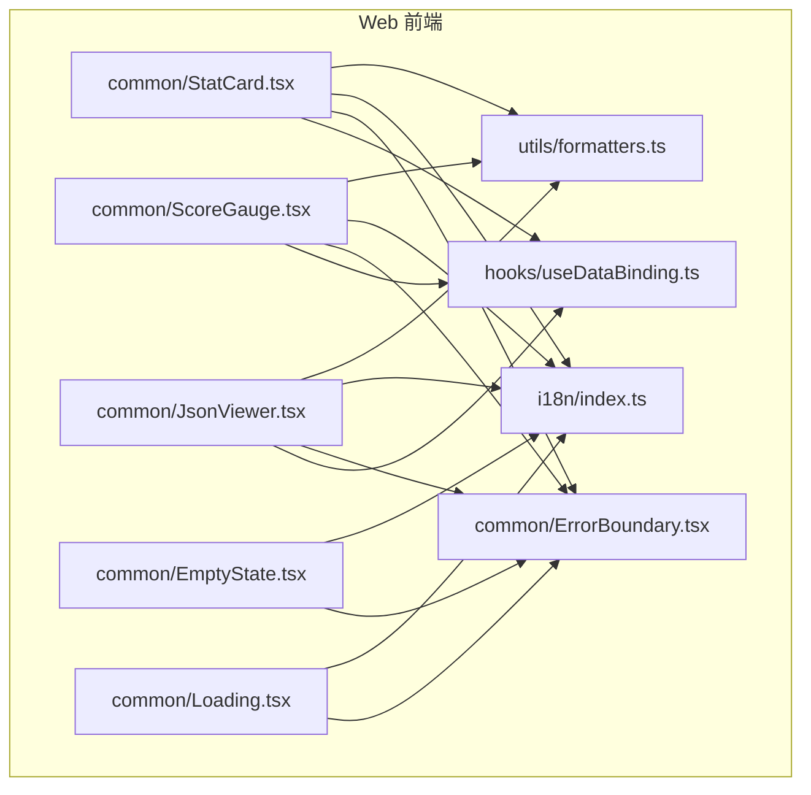
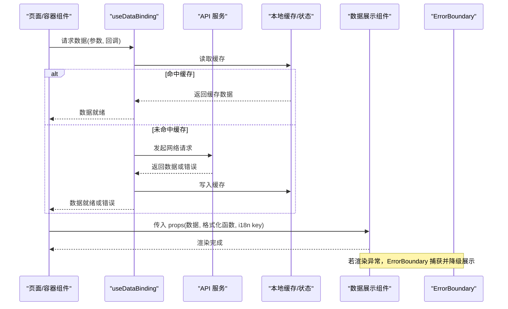
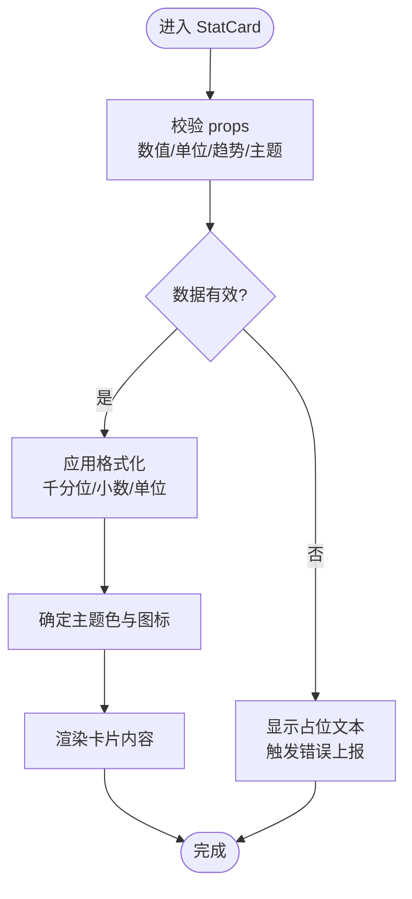
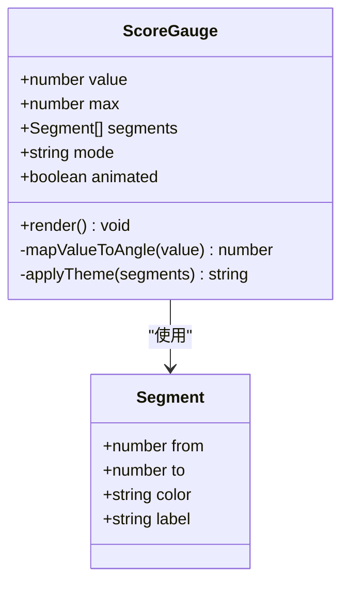
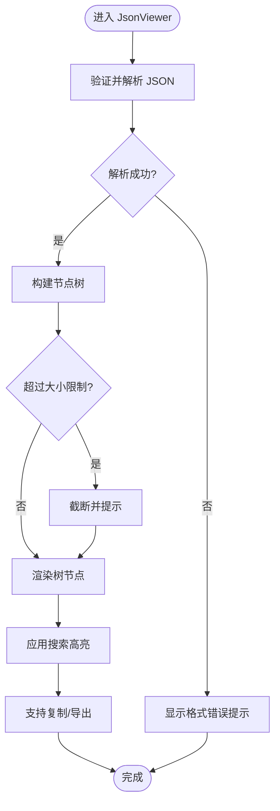
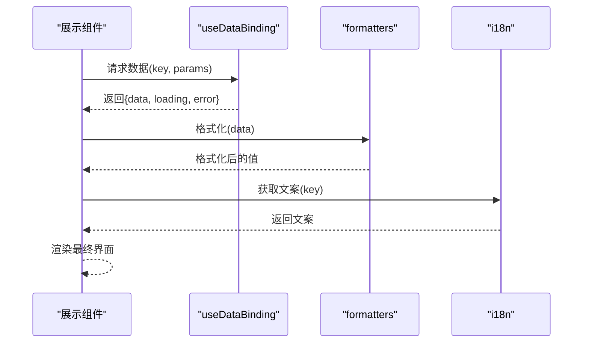
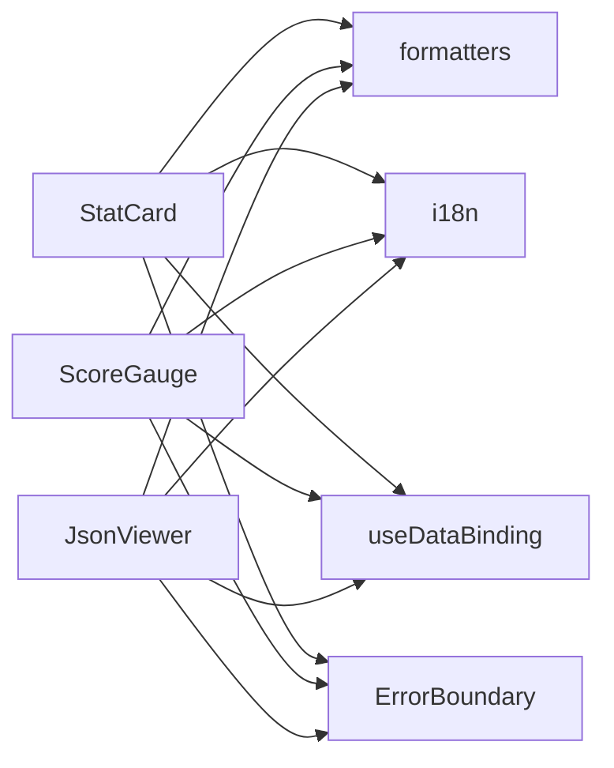

# 数据展示组件

<cite>
**本文引用的文件**   
- [apps/dsa-web/src/components/common/StatCard.tsx](file://apps/dsa-web/src/components/common/StatCard.tsx)
- [apps/dsa-web/src/components/common/ScoreGauge.tsx](file://apps/dsa-web/src/components/common/ScoreGauge.tsx)
- [apps/dsa-web/src/components/common/JsonViewer.tsx](file://apps/dsa-web/src/components/common/JsonViewer.tsx)
- [apps/dsa-web/src/components/common/EmptyState.tsx](file://apps/dsa-web/src/components/common/EmptyState.tsx)
- [apps/dsa-web/src/components/common/Loading.tsx](file://apps/dsa-web/src/components/common/Loading.tsx)
- [apps/dsa-web/src/utils/formatters.ts](file://apps/dsa-web/src/utils/formatters.ts)
- [apps/dsa-web/src/hooks/useDataBinding.ts](file://apps/dsa-web/src/hooks/useDataBinding.ts)
- [apps/dsa-web/src/i18n/index.ts](file://apps/dsa-web/src/i18n/index.ts)
- [apps/dsa-web/src/components/common/ErrorBoundary.tsx](file://apps/dsa-web/src/components/common/ErrorBoundary.tsx)
</cite>

## 目录
1. [简介](#简介)
2. [项目结构](#项目结构)
3. [核心组件](#核心组件)
4. [架构总览](#架构总览)
5. [详细组件分析](#详细组件分析)
6. [依赖关系分析](#依赖关系分析)
7. [性能考虑](#性能考虑)
8. [故障排查指南](#故障排查指南)
9. [结论](#结论)
10. [附录](#附录)

## 简介
本文件聚焦于数据展示类组件的实现与最佳实践，覆盖统计卡片 StatCard、分数仪表 ScoreGauge、JSON 查看器 JsonViewer，以及空状态 EmptyState 和加载状态 Loading 的设计模式。文档同时阐述数据格式化、错误处理与用户反馈机制，提供图表集成与数据绑定的实践建议，并说明可访问性与国际化配置要点，最后给出虚拟滚动与大数据处理的性能优化策略。

## 项目结构
数据展示相关组件集中在 Web 前端应用的 common 组件目录中，配合 utils 中的格式化工具、hooks 中的数据绑定能力、i18n 的国际化支持以及 ErrorBoundary 的错误边界，形成统一的数据呈现层。

**图示来源** 
- [apps/dsa-web/src/components/common/StatCard.tsx](file://apps/dsa-web/src/components/common/StatCard.tsx)
- [apps/dsa-web/src/components/common/ScoreGauge.tsx](file://apps/dsa-web/src/components/common/ScoreGauge.tsx)
- [apps/dsa-web/src/components/common/JsonViewer.tsx](file://apps/dsa-web/src/components/common/JsonViewer.tsx)
- [apps/dsa-web/src/components/common/EmptyState.tsx](file://apps/dsa-web/src/components/common/EmptyState.tsx)
- [apps/dsa-web/src/components/common/Loading.tsx](file://apps/dsa-web/src/components/common/Loading.tsx)
- [apps/dsa-web/src/utils/formatters.ts](file://apps/dsa-web/src/utils/formatters.ts)
- [apps/dsa-web/src/hooks/useDataBinding.ts](file://apps/dsa-web/src/hooks/useDataBinding.ts)
- [apps/dsa-web/src/i18n/index.ts](file://apps/dsa-web/src/i18n/index.ts)
- [apps/dsa-web/src/components/common/ErrorBoundary.tsx](file://apps/dsa-web/src/components/common/ErrorBoundary.tsx)

**章节来源**
- [apps/dsa-web/src/components/common/StatCard.tsx](file://apps/dsa-web/src/components/common/StatCard.tsx)
- [apps/dsa-web/src/components/common/ScoreGauge.tsx](file://apps/dsa-web/src/components/common/ScoreGauge.tsx)
- [apps/dsa-web/src/components/common/JsonViewer.tsx](file://apps/dsa-web/src/components/common/JsonViewer.tsx)
- [apps/dsa-web/src/components/common/EmptyState.tsx](file://apps/dsa-web/src/components/common/EmptyState.tsx)
- [apps/dsa-web/src/components/common/Loading.tsx](file://apps/dsa-web/src/components/common/Loading.tsx)
- [apps/dsa-web/src/utils/formatters.ts](file://apps/dsa-web/src/utils/formatters.ts)
- [apps/dsa-web/src/hooks/useDataBinding.ts](file://apps/dsa-web/src/hooks/useDataBinding.ts)
- [apps/dsa-web/src/i18n/index.ts](file://apps/dsa-web/src/i18n/index.ts)
- [apps/dsa-web/src/components/common/ErrorBoundary.tsx](file://apps/dsa-web/src/components/common/ErrorBoundary.tsx)

## 核心组件
- 统计卡片 StatCard：用于展示关键指标（如数值、趋势、单位、时间范围），支持标题、副标题、图标、颜色语义化与响应式布局。
- 分数仪表 ScoreGauge：以环形或线性进度形式展示评分/置信度，支持阈值分段、动画过渡与无障碍标签。
- JSON 查看器 JsonViewer：对原始 JSON 进行语法高亮、折叠展开、搜索过滤与复制导出，便于调试与审计。
- 空状态 EmptyState：在数据为空或查询无结果时提供友好提示与引导操作。
- 加载状态 Loading：在异步数据获取或计算过程中提供骨架屏或旋转指示，避免界面闪烁。

这些组件共同构成一致的数据展示体验，并通过统一的格式化与国际化能力保证多语言与一致性。

**章节来源**
- [apps/dsa-web/src/components/common/StatCard.tsx](file://apps/dsa-web/src/components/common/StatCard.tsx)
- [apps/dsa-web/src/components/common/ScoreGauge.tsx](file://apps/dsa-web/src/components/common/ScoreGauge.tsx)
- [apps/dsa-web/src/components/common/JsonViewer.tsx](file://apps/dsa-web/src/components/common/JsonViewer.tsx)
- [apps/dsa-web/src/components/common/EmptyState.tsx](file://apps/dsa-web/src/components/common/EmptyState.tsx)
- [apps/dsa-web/src/components/common/Loading.tsx](file://apps/dsa-web/src/components/common/Loading.tsx)

## 架构总览
数据展示层的调用链通常由页面或容器组件发起，通过 useDataBinding 拉取并缓存数据，再交由 StatCard/ScoreGauge/JsonViewer 渲染；当数据为空或异常时，EmptyState/Loading/ErrorBoundary 接管显示与兜底。

**图示来源** 
- [apps/dsa-web/src/hooks/useDataBinding.ts](file://apps/dsa-web/src/hooks/useDataBinding.ts)
- [apps/dsa-web/src/components/common/StatCard.tsx](file://apps/dsa-web/src/components/common/StatCard.tsx)
- [apps/dsa-web/src/components/common/ScoreGauge.tsx](file://apps/dsa-web/src/components/common/ScoreGauge.tsx)
- [apps/dsa-web/src/components/common/JsonViewer.tsx](file://apps/dsa-web/src/components/common/JsonViewer.tsx)
- [apps/dsa-web/src/components/common/ErrorBoundary.tsx](file://apps/dsa-web/src/components/common/ErrorBoundary.tsx)

## 详细组件分析

### 统计卡片 StatCard
- 职责：集中展示单一指标的关键信息，包括主值、单位、趋势方向、时间范围与辅助说明。
- 输入属性：标题、数值、单位、趋势（上升/下降/持平）、颜色主题、图标、时间范围、点击回调等。
- 行为逻辑：根据数值区间与趋势决定颜色与图标；支持点击跳转或弹窗详情；对数值进行千分位与小数点格式化。
- 可访问性：为数值区域设置 aria-label，趋势变化使用 aria-live 提示；键盘可达且焦点顺序合理。
- 国际化：标题、单位、趋势文案通过 i18n key 注入，支持动态切换语言。
- 错误处理：数值缺失或非法时回退到占位符；格式化失败时降级为原始字符串。
- 性能：避免不必要的重渲染，仅在 props 变化时更新；大数值采用懒解析。

**图示来源** 
- [apps/dsa-web/src/components/common/StatCard.tsx](file://apps/dsa-web/src/components/common/StatCard.tsx)
- [apps/dsa-web/src/utils/formatters.ts](file://apps/dsa-web/src/utils/formatters.ts)

**章节来源**
- [apps/dsa-web/src/components/common/StatCard.tsx](file://apps/dsa-web/src/components/common/StatCard.tsx)
- [apps/dsa-web/src/utils/formatters.ts](file://apps/dsa-web/src/utils/formatters.ts)

### 分数仪表 ScoreGauge
- 职责：可视化展示评分或置信度，支持环形/线性两种形态，具备阈值分段与动画过渡。
- 输入属性：分数值、最大值、刻度分段、颜色映射、动画时长、是否可交互、无障碍描述等。
- 行为逻辑：将分数映射到角度或长度；按阈值分段着色；动画缓动提升观感；点击可显示详情。
- 可访问性：提供 role="progressbar" 与 aria-valuenow/min/max；屏幕阅读器可读当前分数。
- 国际化：刻度标签、提示信息通过 i18n 管理。
- 错误处理：分数越界时裁剪至有效范围；无效类型时回退默认值。
- 性能：使用 requestAnimationFrame 或 CSS 动画减少重排；分数变化时使用增量更新。

**图示来源** 
- [apps/dsa-web/src/components/common/ScoreGauge.tsx](file://apps/dsa-web/src/components/common/ScoreGauge.tsx)

**章节来源**
- [apps/dsa-web/src/components/common/ScoreGauge.tsx](file://apps/dsa-web/src/components/common/ScoreGauge.tsx)

### JSON 查看器 JsonViewer
- 职责：对 JSON 数据进行语法高亮、层级折叠、关键字搜索、复制导出，便于调试与审计。
- 输入属性：原始 JSON、默认展开层级、搜索关键词、是否允许编辑、导出选项等。
- 行为逻辑：递归遍历对象生成树节点；按层级折叠；匹配关键词高亮；支持复制为文本/下载 JSON。
- 可访问性：节点支持键盘导航（上下移动、回车展开/折叠）；ARIA 角色与状态正确设置。
- 国际化：操作按钮文案（展开/折叠/复制/下载）通过 i18n 管理。
- 错误处理：非 JSON 输入时提示格式错误；超大对象限制最大深度与节点数，防止卡顿。
- 性能：虚拟列表渲染节点；按需展开；搜索使用防抖；导出采用流式写入。

**图示来源** 
- [apps/dsa-web/src/components/common/JsonViewer.tsx](file://apps/dsa-web/src/components/common/JsonViewer.tsx)

**章节来源**
- [apps/dsa-web/src/components/common/JsonViewer.tsx](file://apps/dsa-web/src/components/common/JsonViewer.tsx)

### 空状态 EmptyState
- 职责：在数据为空或查询无结果时提供友好提示与引导操作（如刷新、重新筛选）。
- 输入属性：标题、描述、图标、操作按钮、事件回调。
- 行为逻辑：根据业务场景选择不同文案与图标；支持多语言文案；按钮可触发重试或导航。
- 可访问性：使用 role="alert" 或 aria-live 告知状态变化；按钮可键盘操作。
- 国际化：标题与描述通过 i18n key 注入。
- 错误处理：缺少必要文案时回退默认占位；按钮点击失败时提示重试。

**章节来源**
- [apps/dsa-web/src/components/common/EmptyState.tsx](file://apps/dsa-web/src/components/common/EmptyState.tsx)
- [apps/dsa-web/src/i18n/index.ts](file://apps/dsa-web/src/i18n/index.ts)

### 加载状态 Loading
- 职责：在数据获取或计算过程中提供骨架屏或旋转指示，避免界面闪烁。
- 输入属性：类型（骨架屏/旋转）、尺寸、文案、是否阻塞父组件。
- 行为逻辑：根据父级状态切换显示；骨架屏模拟真实布局；旋转指示轻量不阻塞。
- 可访问性：aria-busy 与 aria-live 提示加载状态；屏幕阅读器播报“加载中”。
- 国际化：文案通过 i18n 管理。
- 错误处理：长时间加载超时后提示重试；异常时降级为错误提示。

**章节来源**
- [apps/dsa-web/src/components/common/Loading.tsx](file://apps/dsa-web/src/components/common/Loading.tsx)
- [apps/dsa-web/src/i18n/index.ts](file://apps/dsa-web/src/i18n/index.ts)

### 数据绑定与格式化
- useDataBinding：封装数据请求、缓存、错误与加载状态，提供稳定的数据源给展示组件。
- formatters：统一数值、日期、百分比、货币等格式化规则，确保跨组件一致性。
- i18n：集中管理文案键值，组件通过 key 获取对应语言文本。

**图示来源** 
- [apps/dsa-web/src/hooks/useDataBinding.ts](file://apps/dsa-web/src/hooks/useDataBinding.ts)
- [apps/dsa-web/src/utils/formatters.ts](file://apps/dsa-web/src/utils/formatters.ts)
- [apps/dsa-web/src/i18n/index.ts](file://apps/dsa-web/src/i18n/index.ts)

**章节来源**
- [apps/dsa-web/src/hooks/useDataBinding.ts](file://apps/dsa-web/src/hooks/useDataBinding.ts)
- [apps/dsa-web/src/utils/formatters.ts](file://apps/dsa-web/src/utils/formatters.ts)
- [apps/dsa-web/src/i18n/index.ts](file://apps/dsa-web/src/i18n/index.ts)

## 依赖关系分析
- 组件间耦合：StatCard/ScoreGauge/JsonViewer 均依赖 formatters 与 i18n，保持低耦合与高内聚。
- 状态管理：useDataBinding 作为数据入口，统一处理加载与错误，降低组件复杂度。
- 错误边界：ErrorBoundary 包裹展示组件，捕获渲染异常并降级展示，提升稳定性。

**图示来源** 
- [apps/dsa-web/src/components/common/StatCard.tsx](file://apps/dsa-web/src/components/common/StatCard.tsx)
- [apps/dsa-web/src/components/common/ScoreGauge.tsx](file://apps/dsa-web/src/components/common/ScoreGauge.tsx)
- [apps/dsa-web/src/components/common/JsonViewer.tsx](file://apps/dsa-web/src/components/common/JsonViewer.tsx)
- [apps/dsa-web/src/utils/formatters.ts](file://apps/dsa-web/src/utils/formatters.ts)
- [apps/dsa-web/src/i18n/index.ts](file://apps/dsa-web/src/i18n/index.ts)
- [apps/dsa-web/src/hooks/useDataBinding.ts](file://apps/dsa-web/src/hooks/useDataBinding.ts)
- [apps/dsa-web/src/components/common/ErrorBoundary.tsx](file://apps/dsa-web/src/components/common/ErrorBoundary.tsx)

**章节来源**
- [apps/dsa-web/src/components/common/StatCard.tsx](file://apps/dsa-web/src/components/common/StatCard.tsx)
- [apps/dsa-web/src/components/common/ScoreGauge.tsx](file://apps/dsa-web/src/components/common/ScoreGauge.tsx)
- [apps/dsa-web/src/components/common/JsonViewer.tsx](file://apps/dsa-web/src/components/common/JsonViewer.tsx)
- [apps/dsa-web/src/utils/formatters.ts](file://apps/dsa-web/src/utils/formatters.ts)
- [apps/dsa-web/src/i18n/index.ts](file://apps/dsa-web/src/i18n/index.ts)
- [apps/dsa-web/src/hooks/useDataBinding.ts](file://apps/dsa-web/src/hooks/useDataBinding.ts)
- [apps/dsa-web/src/components/common/ErrorBoundary.tsx](file://apps/dsa-web/src/components/common/ErrorBoundary.tsx)

## 性能考虑
- 虚拟滚动：对于长列表或深层 JSON 树，使用虚拟滚动按需渲染可见节点，显著降低内存占用与重绘开销。
- 大数据处理：对超大 JSON 进行分块解析与惰性求值；限制最大深度与节点数量；搜索使用防抖与索引。
- 渲染优化：避免不必要的重渲染，使用 memoization 与稳定引用；动画使用 CSS 而非 JS 驱动。
- 缓存策略：useDataBinding 结合本地缓存与失效策略，减少重复请求。
- 资源卸载：组件卸载时清理定时器与监听器，防止内存泄漏。

[本节为通用指导，无需特定文件来源]

## 故障排查指南
- 常见错误：
  - JSON 解析失败：检查输入是否为合法 JSON，必要时增加 try/catch 与降级提示。
  - 数值越界：对分数与比例进行裁剪，确保在有效范围内。
  - 加载超时：设置超时与重试机制，并提供用户可操作的“重试”按钮。
- 定位方法：
  - 使用 ErrorBoundary 捕获渲染异常并记录上下文。
  - 在 useDataBinding 中打印请求与缓存状态，确认数据流。
  - 借助 formatters 的单元测试验证格式化逻辑。
- 用户反馈：
  - 空状态与加载状态明确传达当前状态。
  - 错误提示简洁明了，并提供下一步操作建议。

**章节来源**
- [apps/dsa-web/src/components/common/ErrorBoundary.tsx](file://apps/dsa-web/src/components/common/ErrorBoundary.tsx)
- [apps/dsa-web/src/hooks/useDataBinding.ts](file://apps/dsa-web/src/hooks/useDataBinding.ts)
- [apps/dsa-web/src/utils/formatters.ts](file://apps/dsa-web/src/utils/formatters.ts)

## 结论
数据展示组件通过统一的格式化、国际化与错误边界，构建了稳定、可访问且易用的界面层。StatCard、ScoreGauge、JsonViewer 分别承担指标展示、评分可视化与调试工具的职责；EmptyState 与 Loading 完善了用户反馈闭环。结合 useDataBinding 的数据绑定与性能优化策略，可在复杂场景中保持流畅体验。

[本节为总结性内容，无需特定文件来源]

## 附录
- 图表集成建议：
  - 将 StatCard/ScoreGauge 与图表库（如折线图、柱状图）组合，实现指标与趋势的统一视图。
  - 使用 JsonViewer 输出中间态数据，辅助调试与回归测试。
- 数据绑定最佳实践：
  - 使用 useDataBinding 统一管理请求、缓存与错误，避免分散状态。
  - 对频繁更新的数值采用增量更新与节流策略。
- 可访问性与国际化：
  - 所有交互元素提供合适的 ARIA 属性与键盘支持。
  - 文案全部通过 i18n key 管理，避免硬编码。

[本节为补充建议，无需特定文件来源]