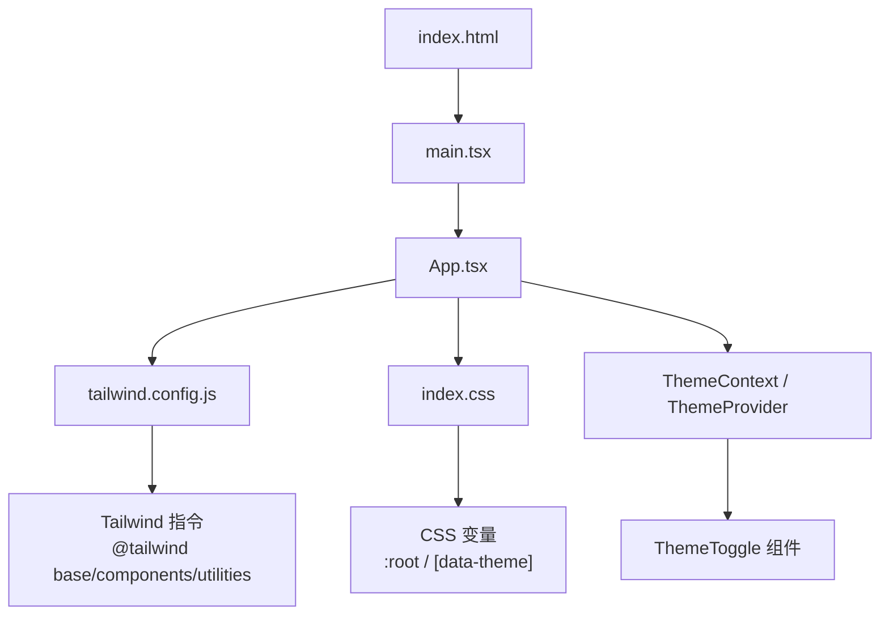
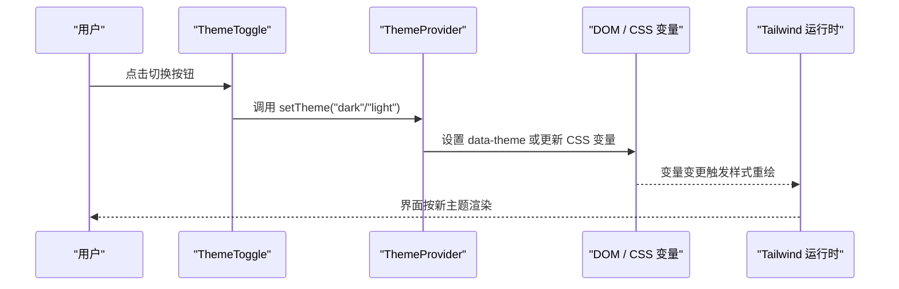
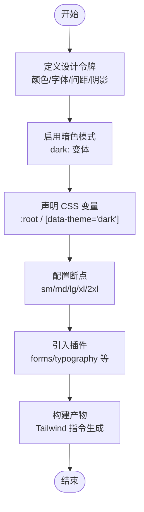
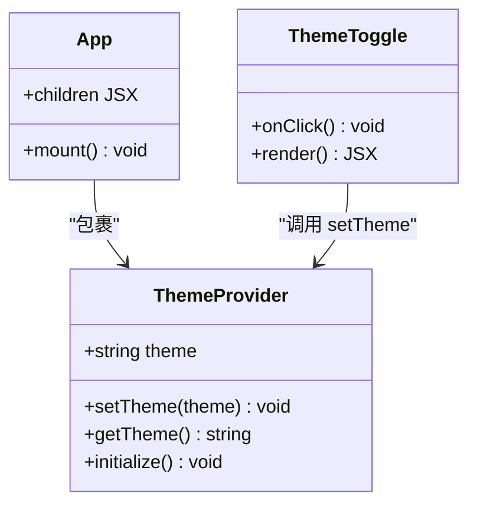
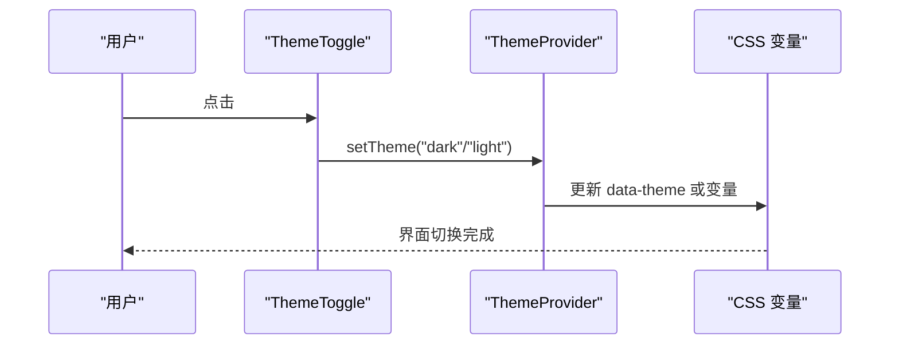
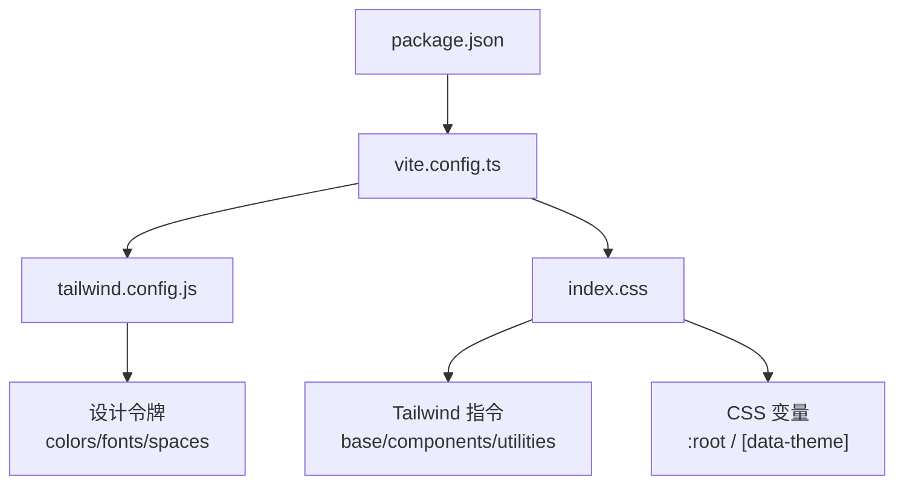

# 样式系统

<cite>
**本文引用的文件**   
- [apps/dsa-web/tailwind.config.js](file://apps/dsa-web/tailwind.config.js)
- [apps/dsa-web/src/index.css](file://apps/dsa-web/src/index.css)
- [apps/dsa-web/src/App.tsx](file://apps/dsa-web/src/App.tsx)
- [apps/dsa-web/src/main.tsx](file://apps/dsa-web/src/main.tsx)
- [apps/dsa-web/package.json](file://apps/dsa-web/package.json)
- [apps/dsa-web/vite.config.ts](file://apps/dsa-web/vite.config.ts)
</cite>

## 目录
1. [简介](#简介)
2. [项目结构](#项目结构)
3. [核心组件](#核心组件)
4. [架构总览](#架构总览)
5. [详细组件分析](#详细组件分析)
6. [依赖分析](#依赖分析)
7. [性能考虑](#性能考虑)
8. [故障排查指南](#故障排查指南)
9. [结论](#结论)
10. [附录](#附录)

## 简介
本文件面向前端样式系统的工程化实践，聚焦以下目标：
- 主题提供者 ThemeProvider 的设计与使用方式
- 暗色模式切换 ThemeToggle 的实现原理与交互流程
- Tailwind CSS 配置选项与自定义主题扩展
- CSS 变量的使用规范与样式组织最佳实践
- 响应式断点配置与移动端适配策略
- 样式组件封装模式与样式隔离方案
- 样式性能优化（CSS-in-JS、按需加载）
- 可访问性支持与浏览器兼容性处理

本项目采用 Vite + React + TypeScript 的前端技术栈，样式体系以 Tailwind CSS 为核心，结合 CSS 变量实现主题与暗色模式的统一治理。

## 项目结构
样式相关的关键位置与职责如下：
- apps/dsa-web/tailwind.config.js：Tailwind 配置入口，定义颜色、字体、间距、断点等设计令牌，并启用暗色模式
- apps/dsa-web/src/index.css：全局样式入口，声明 CSS 变量、基础重置、Tailwind 指令
- apps/dsa-web/src/App.tsx：应用根组件，通常包裹主题上下文并提供主题能力
- apps/dsa-web/src/main.tsx：应用启动入口，负责挂载根组件与初始化运行时环境
- apps/dsa-web/package.json：依赖与脚本，包含 Tailwind、PostCSS、Vite 插件等
- apps/dsa-web/vite.config.ts：构建配置，集成 Tailwind/PostCSS 与资源优化

**图表来源** 
- [apps/dsa-web/src/main.tsx](file://apps/dsa-web/src/main.tsx)
- [apps/dsa-web/src/App.tsx](file://apps/dsa-web/src/App.tsx)
- [apps/dsa-web/tailwind.config.js](file://apps/dsa-web/tailwind.config.js)
- [apps/dsa-web/src/index.css](file://apps/dsa-web/src/index.css)

**章节来源**
- [apps/dsa-web/tailwind.config.js](file://apps/dsa-web/tailwind.config.js)
- [apps/dsa-web/src/index.css](file://apps/dsa-web/src/index.css)
- [apps/dsa-web/src/App.tsx](file://apps/dsa-web/src/App.tsx)
- [apps/dsa-web/src/main.tsx](file://apps/dsa-web/src/main.tsx)
- [apps/dsa-web/package.json](file://apps/dsa-web/package.json)
- [apps/dsa-web/vite.config.ts](file://apps/dsa-web/vite.config.ts)

## 核心组件
- 主题提供者 ThemeProvider
  - 职责：提供当前主题状态（亮/暗）、主题切换方法、将主题信息注入到 DOM 或 Context
  - 典型实现要点：
    - 在根组件 App.tsx 中包裹应用，确保所有子组件可消费主题
    - 通过 data-theme 属性或 CSS 变量驱动 UI 变化
    - 持久化用户偏好（localStorage），并在首次渲染时同步
- 暗色模式切换 ThemeToggle
  - 职责：暴露切换按钮，触发主题切换逻辑，更新数据模型与 DOM
  - 典型实现要点：
    - 监听点击事件，调用 ThemeProvider 提供的切换函数
    - 根据当前主题动态切换图标与文案
    - 支持键盘可达性与无障碍标签

**章节来源**
- [apps/dsa-web/src/App.tsx](file://apps/dsa-web/src/App.tsx)
- [apps/dsa-web/src/index.css](file://apps/dsa-web/src/index.css)

## 架构总览
下图展示了主题系统与样式构建的整体关系：

**图表来源** 
- [apps/dsa-web/src/App.tsx](file://apps/dsa-web/src/App.tsx)
- [apps/dsa-web/src/index.css](file://apps/dsa-web/src/index.css)
- [apps/dsa-web/tailwind.config.js](file://apps/dsa-web/tailwind.config.js)

## 详细组件分析

### Tailwind CSS 配置与自定义主题扩展
- 设计令牌集中管理
  - 颜色：定义品牌主色、中性色、语义色（成功/警告/错误）
  - 字体：标题、正文、代码字体的族名与字号阶梯
  - 间距与圆角：统一的 spacing、radius 尺度
  - 阴影与动画：一致的 shadow、animate 集合
- 暗色模式
  - 启用 dark 变体，配合 data-theme 或 class 控制
  - 在 index.css 中为 :root 与 [data-theme="dark"] 分别声明变量
- 响应式断点
  - 基于 sm/md/lg/xl/2xl 的默认断点，可按需扩展
  - 在组件中使用 sm: md: lg: 前缀进行布局适配
- 插件与扩展
  - 可使用 @tailwindcss/forms、typography 等官方插件提升表单与内容排版体验
  - 自定义工具类通过 extend 注入，避免重复样式

**图表来源** 
- [apps/dsa-web/tailwind.config.js](file://apps/dsa-web/tailwind.config.js)
- [apps/dsa-web/src/index.css](file://apps/dsa-web/src/index.css)

**章节来源**
- [apps/dsa-web/tailwind.config.js](file://apps/dsa-web/tailwind.config.js)
- [apps/dsa-web/src/index.css](file://apps/dsa-web/src/index.css)

### 主题提供者 ThemeProvider 设计与使用
- 设计原则
  - 单一数据源：主题状态集中在 Provider 内
  - 最小作用域：仅在需要处消费主题，避免不必要的重渲染
  - 可持久化：保存用户偏好，保证刷新后一致
- 实现要点
  - 在 App.tsx 中包裹根节点，提供 getTheme/setTheme
  - 通过 data-theme 属性或 CSS 变量驱动全局样式
  - 初始值从 localStorage 读取，若不存在则回退到系统偏好
- 与 Tailwind 的结合
  - 使用 dark: 变体与 CSS 变量组合，减少条件类名的复杂度
  - 在 index.css 中集中维护变量映射，便于统一修改

**图表来源** 
- [apps/dsa-web/src/App.tsx](file://apps/dsa-web/src/App.tsx)

**章节来源**
- [apps/dsa-web/src/App.tsx](file://apps/dsa-web/src/App.tsx)

### 暗色模式切换 ThemeToggle 的实现原理
- 交互流程
  - 用户点击按钮 -> 调用 setTheme -> 更新 data-theme/CSS 变量 -> 触发 Tailwind 重排
- 可访问性
  - 提供 aria-label 与 role="switch"
  - 支持键盘操作（Enter/Space）
- 视觉反馈
  - 切换时提供过渡动画（transition-colors）
  - 图标与文案随主题变化

**图表来源** 
- [apps/dsa-web/src/App.tsx](file://apps/dsa-web/src/App.tsx)
- [apps/dsa-web/src/index.css](file://apps/dsa-web/src/index.css)

**章节来源**
- [apps/dsa-web/src/App.tsx](file://apps/dsa-web/src/App.tsx)
- [apps/dsa-web/src/index.css](file://apps/dsa-web/src/index.css)

### CSS 变量的使用规范与样式组织
- 命名约定
  - 使用语义化名称，如 --color-primary、--color-bg、--font-size-base
  - 按层级分组：全局变量放在 :root，组件级变量放在对应选择器
- 主题映射
  - 亮/暗主题通过 [data-theme="dark"] 覆盖变量
  - 避免在组件内硬编码颜色，统一走变量
- 样式组织
  - index.css 作为全局入口，集中声明变量与基础样式
  - 组件样式尽量使用 Tailwind 原子类，必要时补充少量自定义类

**章节来源**
- [apps/dsa-web/src/index.css](file://apps/dsa-web/src/index.css)

### 响应式设计的断点配置与移动端适配策略
- 断点策略
  - 默认 sm/md/lg/xl/2xl，针对业务可扩展 xs 或 xl+
  - 优先移动优先（mobile-first），在小屏上简化布局
- 布局建议
  - 导航栏在移动端折叠为抽屉或汉堡菜单
  - 表格在小屏下改为卡片列表或横向滚动
  - 图片与图表使用相对单位与自适应容器
- 交互优化
  - 触摸友好的按钮尺寸与间距
  - 避免 hover-only 的交互，提供 click/focus 替代

**章节来源**
- [apps/dsa-web/tailwind.config.js](file://apps/dsa-web/tailwind.config.js)

### 样式组件的封装模式与样式隔离方案
- 封装模式
  - 以业务语义命名组件（Button、Card、Modal），内部使用 Tailwind 原子类组合
  - 对外暴露 props 控制变体（size、variant、disabled）
- 样式隔离
  - 优先使用 Tailwind 原子类，避免全局类名冲突
  - 如需自定义样式，使用 CSS Modules 或 scoped 样式
  - 复杂主题差异通过 CSS 变量与 data-theme 控制

**章节来源**
- [apps/dsa-web/tailwind.config.js](file://apps/dsa-web/tailwind.config.js)
- [apps/dsa-web/src/index.css](file://apps/dsa-web/src/index.css)

### 样式性能优化技巧
- 构建期优化
  - 使用 Purge/Tailwind 扫描，移除未使用的类
  - 开启 CSS 压缩与 Tree Shaking
- 运行期优化
  - 按需加载主题与组件样式
  - 避免频繁读写样式属性，批量更新 DOM
- CSS-in-JS 取舍
  - 对于简单主题切换，优先使用 CSS 变量与 Tailwind
  - 对动态样式较多的场景，谨慎评估 CSS-in-JS 的开销

**章节来源**
- [apps/dsa-web/vite.config.ts](file://apps/dsa-web/vite.config.ts)
- [apps/dsa-web/package.json](file://apps/dsa-web/package.json)

### 可访问性支持与浏览器兼容性处理
- 可访问性
  - 为交互元素提供正确的语义标签与 ARIA 属性
  - 确保焦点可见、键盘可达、屏幕阅读器友好
- 兼容性
  - 使用现代浏览器特性时提供降级方案
  - 通过 PostCSS 自动添加必要前缀
  - 在 index.css 中做必要的浏览器兼容重置

**章节来源**
- [apps/dsa-web/src/index.css](file://apps/dsa-web/src/index.css)
- [apps/dsa-web/vite.config.ts](file://apps/dsa-web/vite.config.ts)

## 依赖分析
样式相关的依赖与构建链路如下：

**图表来源** 
- [apps/dsa-web/package.json](file://apps/dsa-web/package.json)
- [apps/dsa-web/vite.config.ts](file://apps/dsa-web/vite.config.ts)
- [apps/dsa-web/tailwind.config.js](file://apps/dsa-web/tailwind.config.js)
- [apps/dsa-web/src/index.css](file://apps/dsa-web/src/index.css)

**章节来源**
- [apps/dsa-web/package.json](file://apps/dsa-web/package.json)
- [apps/dsa-web/vite.config.ts](file://apps/dsa-web/vite.config.ts)
- [apps/dsa-web/tailwind.config.js](file://apps/dsa-web/tailwind.config.js)
- [apps/dsa-web/src/index.css](file://apps/dsa-web/src/index.css)

## 性能考虑
- 减少重排与重绘
  - 批量更新主题变量，避免逐条修改样式
  - 使用 transform/opacity 做动画，避免触发布局
- 构建产物体积
  - 启用 Tailwind 的 Purge，仅保留实际使用的类
  - 拆分主题与通用样式，按需加载
- 运行时开销
  - 避免在高频事件中直接操作 DOM 样式
  - 使用 requestAnimationFrame 或节流/防抖优化

[本节为通用指导，不直接分析具体文件]

## 故障排查指南
- 暗色模式无效
  - 检查 data-theme 是否正确设置
  - 确认 index.css 中变量覆盖是否生效
  - 验证 Tailwind 的 dark: 变体是否启用
- 样式未更新
  - 检查构建是否启用了 Purge，是否存在被清理的类
  - 确认 CSS 变量路径与作用域正确
- 移动端布局异常
  - 检查断点前缀是否正确使用
  - 验证容器宽度与 flex/grid 行为

**章节来源**
- [apps/dsa-web/src/index.css](file://apps/dsa-web/src/index.css)
- [apps/dsa-web/tailwind.config.js](file://apps/dsa-web/tailwind.config.js)

## 结论
本样式系统以 Tailwind CSS 为核心，结合 CSS 变量与 data-theme 机制，实现了统一的主题治理与暗色模式切换。通过集中化的设计令牌与响应式断点配置，保证了样式的一致性与可维护性。在实际工程中，应遵循组件封装与样式隔离的最佳实践，持续优化构建与运行性能，并确保可访问性与跨浏览器兼容性。

[本节为总结性内容，不直接分析具体文件]

## 附录
- 快速上手清单
  - 在 tailwind.config.js 中定义设计令牌与断点
  - 在 index.css 中声明 CSS 变量与基础样式
  - 在 App.tsx 中提供 ThemeProvider 并包裹应用
  - 使用 ThemeToggle 组件实现主题切换
  - 在组件中优先使用 Tailwind 原子类，必要时补充变量
- 参考路径
  - Tailwind 配置：[apps/dsa-web/tailwind.config.js](file://apps/dsa-web/tailwind.config.js)
  - 全局样式：[apps/dsa-web/src/index.css](file://apps/dsa-web/src/index.css)
  - 应用入口：[apps/dsa-web/src/App.tsx](file://apps/dsa-web/src/App.tsx)
  - 构建配置：[apps/dsa-web/vite.config.ts](file://apps/dsa-web/vite.config.ts)
  - 依赖与脚本：[apps/dsa-web/package.json](file://apps/dsa-web/package.json)