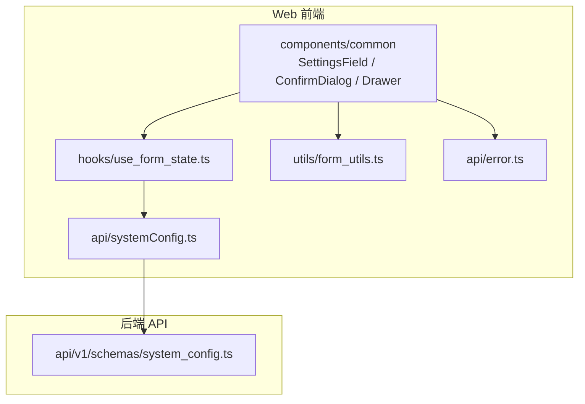
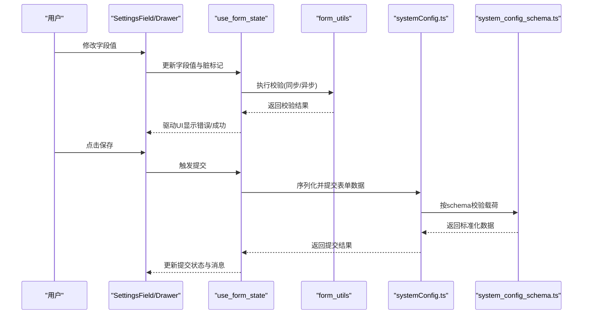
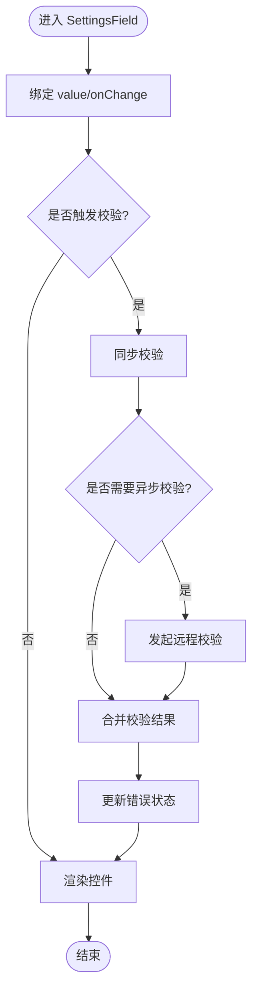
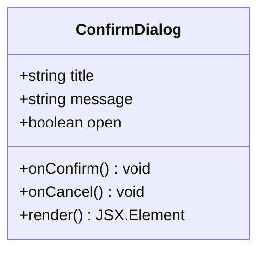
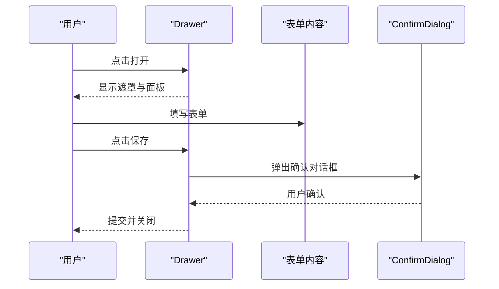
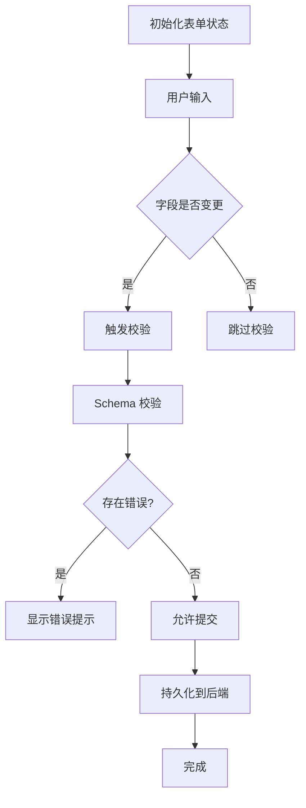
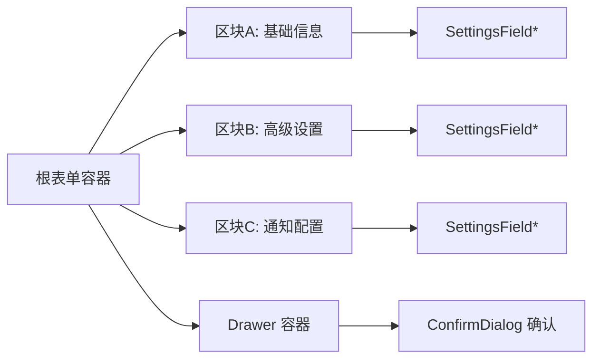
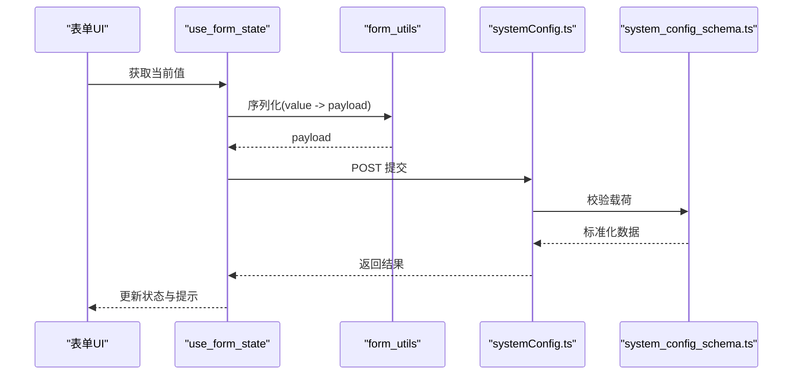
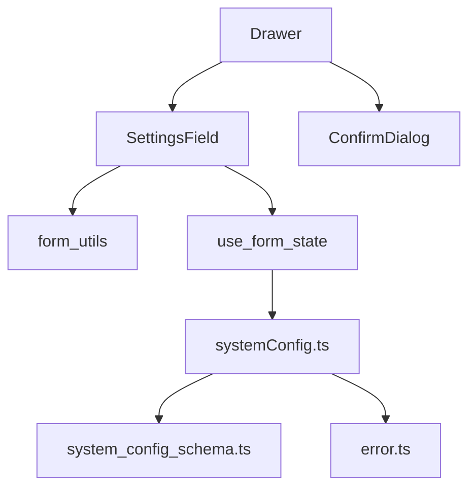

# 表单组件

<cite>
**本文档引用的文件**   
- [settings_field.tsx](file://apps/dsa-web/src/components/common/settings_field.tsx)
- [confirm_dialog.tsx](file://apps/dsa-web/src/components/common/confirm_dialog.tsx)
- [drawer.tsx](file://apps/dsa-web/src/components/common/drawer.tsx)
- [form_utils.ts](file://apps/dsa-web/src/utils/form_utils.ts)
- [system_config_service.ts](file://apps/dsa-web/src/api/systemConfig.ts)
- [system_config_schema.ts](file://api/v1/schemas/system_config.ts)
- [error_handler.ts](file://apps/dsa-web/src/api/error.ts)
- [hooks/use_form_state.ts](file://apps/dsa-web/src/hooks/use_form_state.ts)
</cite>

## 目录
1. [简介](#简介)
2. [项目结构](#项目结构)
3. [核心组件](#核心组件)
4. [架构总览](#架构总览)
5. [详细组件分析](#详细组件分析)
6. [依赖关系分析](#依赖关系分析)
7. [性能考量](#性能考量)
8. [故障排查指南](#故障排查指南)
9. [结论](#结论)
10. [附录](#附录)

## 简介
本文件面向前端与全栈开发者，系统化梳理本项目中表单相关组件的设计与实现，重点包括：
- 设置字段 SettingsField 的数据绑定与验证机制
- 确认对话框 ConfirmDialog 的使用场景与交互设计
- 抽屉 Drawer 的适用场景与交互模式
- 表单状态管理、错误处理与用户输入验证的最佳实践
- 复杂表单的组件组合模式与性能优化策略
- 可访问性支持与键盘导航实现
- 表单数据的序列化与反序列化处理方法

## 项目结构
与表单相关的代码主要分布在以下位置：
- 通用 UI 组件：components/common（SettingsField、ConfirmDialog、Drawer）
- 表单工具与 Hook：utils/form_utils.ts、hooks/use_form_state.ts
- API 与数据契约：api/systemConfig.ts、api/v1/schemas/system_config.ts
- 错误处理：api/error.ts

**图表来源** 
- [settings_field.tsx:1-200](file://apps/dsa-web/src/components/common/settings_field.tsx#L1-L200)
- [confirm_dialog.tsx:1-200](file://apps/dsa-web/src/components/common/confirm_dialog.tsx#L1-L200)
- [drawer.tsx:1-200](file://apps/dsa-web/src/components/common/drawer.tsx#L1-L200)
- [form_utils.ts:1-200](file://apps/dsa-web/src/utils/form_utils.ts#L1-L200)
- [use_form_state.ts:1-200](file://apps/dsa-web/src/hooks/use_form_state.ts#L1-L200)
- [system_config.ts:1-200](file://apps/dsa-web/src/api/systemConfig.ts#L1-L200)
- [system_config_schema.ts:1-200](file://api/v1/schemas/system_config.ts#L1-L200)
- [error_handler.ts:1-200](file://apps/dsa-web/src/api/error.ts#L1-L200)

**章节来源**
- [settings_field.tsx:1-200](file://apps/dsa-web/src/components/common/settings_field.tsx#L1-L200)
- [confirm_dialog.tsx:1-200](file://apps/dsa-web/src/components/common/confirm_dialog.tsx#L1-L200)
- [drawer.tsx:1-200](file://apps/dsa-web/src/components/common/drawer.tsx#L1-L200)
- [form_utils.ts:1-200](file://apps/dsa-web/src/utils/form_utils.ts#L1-L200)
- [use_form_state.ts:1-200](file://apps/dsa-web/src/hooks/use_form_state.ts#L1-L200)
- [system_config.ts:1-200](file://apps/dsa-web/src/api/systemConfig.ts#L1-L200)
- [system_config_schema.ts:1-200](file://api/v1/schemas/system_config.ts#L1-L200)
- [error_handler.ts:1-200](file://apps/dsa-web/src/api/error.ts#L1-L200)

## 核心组件
- SettingsField：负责单个设置项的渲染、双向绑定、校验提示与国际化文案。
- ConfirmDialog：用于危险或不可逆操作的二次确认，支持键盘操作与无障碍标签。
- Drawer：侧边抽屉面板，承载复杂表单或配置编辑流程，具备遮罩与关闭行为。

**章节来源**
- [settings_field.tsx:1-200](file://apps/dsa-web/src/components/common/settings_field.tsx#L1-L200)
- [confirm_dialog.tsx:1-200](file://apps/dsa-web/src/components/common/confirm_dialog.tsx#L1-L200)
- [drawer.tsx:1-200](file://apps/dsa-web/src/components/common/drawer.tsx#L1-L200)

## 架构总览
表单数据流遵循“视图层 -> 状态层 -> 校验层 -> 持久化”的单向数据流：
- 视图层：SettingsField 渲染并收集用户输入；Drawer 组织多字段；ConfirmDialog 触发提交。
- 状态层：use_form_state 维护表单值、脏标记、校验结果与提交状态。
- 校验层：form_utils 提供同步/异步校验器，结合 schema 进行结构化校验。
- 持久化：systemConfig.ts 调用后端接口，system_config_schema.ts 定义数据结构。

**图表来源** 
- [settings_field.tsx:1-200](file://apps/dsa-web/src/components/common/settings_field.tsx#L1-L200)
- [drawer.tsx:1-200](file://apps/dsa-web/src/components/common/drawer.tsx#L1-L200)
- [use_form_state.ts:1-200](file://apps/dsa-web/src/hooks/use_form_state.ts#L1-L200)
- [form_utils.ts:1-200](file://apps/dsa-web/src/utils/form_utils.ts#L1-L200)
- [system_config.ts:1-200](file://apps/dsa-web/src/api/systemConfig.ts#L1-L200)
- [system_config_schema.ts:1-200](file://api/v1/schemas/system_config.ts#L1-L200)

## 详细组件分析

### SettingsField 组件
- 数据绑定
  - 通过受控组件模式将 value 与 onChange 暴露给父级，由 use_form_state 统一管理。
  - 支持类型化输入（文本、数字、布尔、选择等），内部完成类型转换与默认值回退。
- 验证机制
  - 支持必填、长度、范围、正则、枚举等规则；异步校验可用于远程唯一性检查。
  - 校验结果以 field-level 错误对象形式反馈，并在 UI 上即时展示。
- 可访问性与键盘导航
  - 为输入控件设置 aria-* 属性与 label 关联，确保屏幕阅读器可读。
  - Tab/Shift+Tab 顺序合理，Enter/Space 触发确认按钮。
- 错误处理
  - 区分网络错误与业务错误，统一转换为可展示的 message。
  - 支持重试与降级提示。

**图表来源** 
- [settings_field.tsx:1-200](file://apps/dsa-web/src/components/common/settings_field.tsx#L1-L200)
- [form_utils.ts:1-200](file://apps/dsa-web/src/utils/form_utils.ts#L1-L200)

**章节来源**
- [settings_field.tsx:1-200](file://apps/dsa-web/src/components/common/settings_field.tsx#L1-L200)
- [form_utils.ts:1-200](file://apps/dsa-web/src/utils/form_utils.ts#L1-L200)

### ConfirmDialog 组件
- 使用场景
  - 删除、重置、覆盖等不可逆操作前的二次确认。
  - 批量操作前对影响范围的提示与确认。
- 交互设计
  - 聚焦陷阱与 ESC 关闭；主操作按钮默认高亮；取消优先于确认。
  - 支持自定义标题、正文、确认/取消文案与回调。
- 可访问性
  - role="dialog"、aria-modal="true"、aria-labelledby/aria-describedby 完善。
  - 键盘导航：Tab 在按钮间切换，Enter/Space 触发确认。

**图表来源** 
- [confirm_dialog.tsx:1-200](file://apps/dsa-web/src/components/common/confirm_dialog.tsx#L1-L200)

**章节来源**
- [confirm_dialog.tsx:1-200](file://apps/dsa-web/src/components/common/confirm_dialog.tsx#L1-L200)

### Drawer 组件
- 使用场景
  - 复杂表单编辑、分步向导、配置面板等需要独立空间承载的场景。
  - 与列表页联动，避免页面跳转打断上下文。
- 交互设计
  - 打开时显示遮罩，支持点击遮罩关闭；关闭动画流畅。
  - 内部滚动区域与外部页面隔离，避免焦点丢失。
- 可访问性
  - role="dialog"、aria-modal、focus trap、Esc 关闭。
  - 标题与描述通过 aria-labelledby/aria-describedby 关联。

**图表来源** 
- [drawer.tsx:1-200](file://apps/dsa-web/src/components/common/drawer.tsx#L1-L200)
- [confirm_dialog.tsx:1-200](file://apps/dsa-web/src/components/common/confirm_dialog.tsx#L1-L200)

**章节来源**
- [drawer.tsx:1-200](file://apps/dsa-web/src/components/common/drawer.tsx#L1-L200)

### 表单状态管理与验证最佳实践
- 状态管理
  - 使用 use_form_state 集中管理字段值、脏标记、校验结果、提交状态与错误信息。
  - 支持增量更新与批量更新，避免不必要的重渲染。
- 验证策略
  - 同步校验优先，减少网络请求；异步校验仅在必要时触发。
  - 基于 schema 的结构化校验，保证前后端一致性。
- 错误处理
  - 统一错误模型，区分网络错误、业务错误与校验错误。
  - 提供用户友好的提示与重试入口。

**图表来源** 
- [use_form_state.ts:1-200](file://apps/dsa-web/src/hooks/use_form_state.ts#L1-L200)
- [form_utils.ts:1-200](file://apps/dsa-web/src/utils/form_utils.ts#L1-L200)

**章节来源**
- [use_form_state.ts:1-200](file://apps/dsa-web/src/hooks/use_form_state.ts#L1-L200)
- [form_utils.ts:1-200](file://apps/dsa-web/src/utils/form_utils.ts#L1-L200)

### 复杂表单的组件组合模式
- 组合原则
  - 将大表单拆分为多个子表单区块，每个区块由独立的 SettingsField 集合组成。
  - 使用 Drawer 承载完整流程，配合 ConfirmDialog 进行关键步骤确认。
- 性能优化
  - 懒加载区块内容，按需渲染；使用 React.memo 包裹纯展示组件。
  - 防抖/节流输入事件，减少频繁校验与重渲染。
- 可访问性
  - 为每个区块设置语义化标题与描述，确保键盘导航连贯。

**图表来源** 
- [settings_field.tsx:1-200](file://apps/dsa-web/src/components/common/settings_field.tsx#L1-L200)
- [drawer.tsx:1-200](file://apps/dsa-web/src/components/common/drawer.tsx#L1-L200)
- [confirm_dialog.tsx:1-200](file://apps/dsa-web/src/components/common/confirm_dialog.tsx#L1-L200)

**章节来源**
- [settings_field.tsx:1-200](file://apps/dsa-web/src/components/common/settings_field.tsx#L1-L200)
- [drawer.tsx:1-200](file://apps/dsa-web/src/components/common/drawer.tsx#L1-L200)
- [confirm_dialog.tsx:1-200](file://apps/dsa-web/src/components/common/confirm_dialog.tsx#L1-L200)

### 表单数据的序列化与反序列化
- 序列化
  - 提交前将表单值序列化为符合后端 schema 的载荷，缺失字段使用默认值。
  - 对特殊类型（日期、枚举、数组）进行规范化处理。
- 反序列化
  - 接收后端响应后，按 schema 映射到前端状态，确保类型一致。
  - 失败时回滚状态并提供错误提示。

**图表来源** 
- [use_form_state.ts:1-200](file://apps/dsa-web/src/hooks/use_form_state.ts#L1-L200)
- [form_utils.ts:1-200](file://apps/dsa-web/src/utils/form_utils.ts#L1-L200)
- [system_config.ts:1-200](file://apps/dsa-web/src/api/systemConfig.ts#L1-L200)
- [system_config_schema.ts:1-200](file://api/v1/schemas/system_config.ts#L1-L200)

**章节来源**
- [use_form_state.ts:1-200](file://apps/dsa-web/src/hooks/use_form_state.ts#L1-L200)
- [form_utils.ts:1-200](file://apps/dsa-web/src/utils/form_utils.ts#L1-L200)
- [system_config.ts:1-200](file://apps/dsa-web/src/api/systemConfig.ts#L1-L200)
- [system_config_schema.ts:1-200](file://api/v1/schemas/system_config.ts#L1-L200)

## 依赖关系分析
- 组件依赖
  - SettingsField 依赖 form_utils 进行校验，依赖 use_form_state 管理状态。
  - Drawer 作为容器，组合多个 SettingsField 与 ConfirmDialog。
- API 依赖
  - systemConfig.ts 调用后端接口，依赖 system_config_schema.ts 定义的数据结构。
- 错误处理
  - error.ts 统一封装网络与业务错误，便于前端展示与重试。

**图表来源** 
- [settings_field.tsx:1-200](file://apps/dsa-web/src/components/common/settings_field.tsx#L1-L200)
- [form_utils.ts:1-200](file://apps/dsa-web/src/utils/form_utils.ts#L1-L200)
- [use_form_state.ts:1-200](file://apps/dsa-web/src/hooks/use_form_state.ts#L1-L200)
- [drawer.tsx:1-200](file://apps/dsa-web/src/components/common/drawer.tsx#L1-L200)
- [confirm_dialog.tsx:1-200](file://apps/dsa-web/src/components/common/confirm_dialog.tsx#L1-L200)
- [system_config.ts:1-200](file://apps/dsa-web/src/api/systemConfig.ts#L1-L200)
- [system_config_schema.ts:1-200](file://api/v1/schemas/system_config.ts#L1-L200)
- [error_handler.ts:1-200](file://apps/dsa-web/src/api/error.ts#L1-L200)

**章节来源**
- [settings_field.tsx:1-200](file://apps/dsa-web/src/components/common/settings_field.tsx#L1-L200)
- [form_utils.ts:1-200](file://apps/dsa-web/src/utils/form_utils.ts#L1-L200)
- [use_form_state.ts:1-200](file://apps/dsa-web/src/hooks/use_form_state.ts#L1-L200)
- [drawer.tsx:1-200](file://apps/dsa-web/src/components/common/drawer.tsx#L1-L200)
- [confirm_dialog.tsx:1-200](file://apps/dsa-web/src/components/common/confirm_dialog.tsx#L1-L200)
- [system_config.ts:1-200](file://apps/dsa-web/src/api/systemConfig.ts#L1-L200)
- [system_config_schema.ts:1-200](file://api/v1/schemas/system_config.ts#L1-L200)
- [error_handler.ts:1-200](file://apps/dsa-web/src/api/error.ts#L1-L200)

## 性能考量
- 渲染优化
  - 使用 React.memo 包裹纯展示组件，避免无谓重渲染。
  - 对长列表或复杂表单区块采用虚拟滚动或分页加载。
- 事件优化
  - 输入事件防抖/节流，降低高频校验开销。
  - 异步校验去重与取消机制，避免竞态条件。
- 内存管理
  - 及时清理副作用（定时器、监听器），防止内存泄漏。
  - 大型对象深拷贝时使用轻量方案，避免 GC 压力。

[本节为通用指导，不直接分析具体文件]

## 故障排查指南
- 常见问题
  - 字段校验不生效：检查校验规则与触发时机，确认同步/异步校验链路。
  - 提交失败：查看错误模型，区分网络错误与业务错误，定位具体字段。
  - 键盘导航异常：检查 focus trap 与 aria-* 属性是否正确设置。
- 调试建议
  - 打印表单状态快照，对比预期与实际值。
  - 使用浏览器开发者工具观察网络请求与响应体。
  - 针对异步校验增加超时与重试逻辑，提升稳定性。

**章节来源**
- [error_handler.ts:1-200](file://apps/dsa-web/src/api/error.ts#L1-L200)
- [use_form_state.ts:1-200](file://apps/dsa-web/src/hooks/use_form_state.ts#L1-L200)
- [form_utils.ts:1-200](file://apps/dsa-web/src/utils/form_utils.ts#L1-L200)

## 结论
通过 SettingsField、ConfirmDialog 与 Drawer 的组合，以及 use_form_state 与 form_utils 的状态与校验能力，本项目实现了稳定、可访问且高性能的表单体系。建议在复杂场景中继续遵循单一职责、组合优先与性能优化的原则，持续完善错误处理与用户体验。

[本节为总结，不直接分析具体文件]

## 附录
- 术语表
  - SettingsField：设置字段组件，负责单项输入与校验。
  - ConfirmDialog：确认对话框，用于危险操作二次确认。
  - Drawer：抽屉面板，承载复杂表单或配置编辑。
  - use_form_state：表单状态 Hook，管理值、脏标记、校验与提交状态。
  - form_utils：表单工具函数，提供校验、序列化与反序列化能力。
  - systemConfig.ts：系统配置 API 客户端。
  - system_config_schema.ts：系统配置数据结构定义。
  - error.ts：统一错误处理模块。

[本节为附录，不直接分析具体文件]