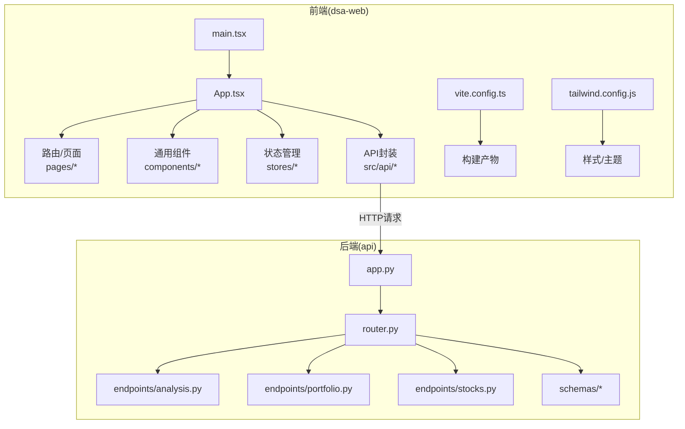
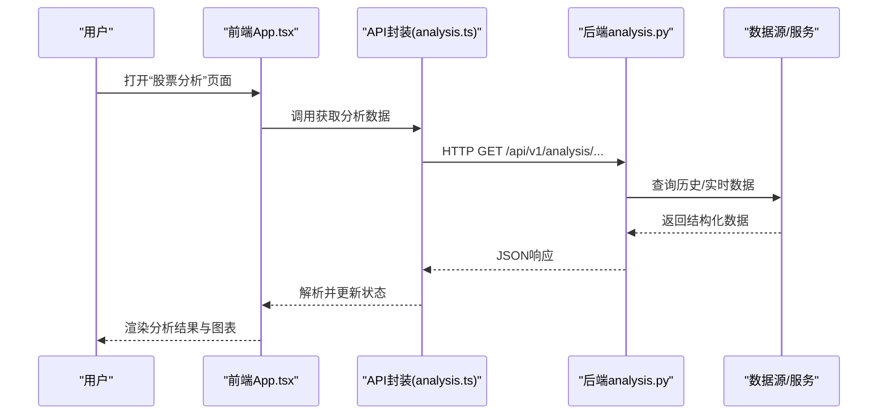
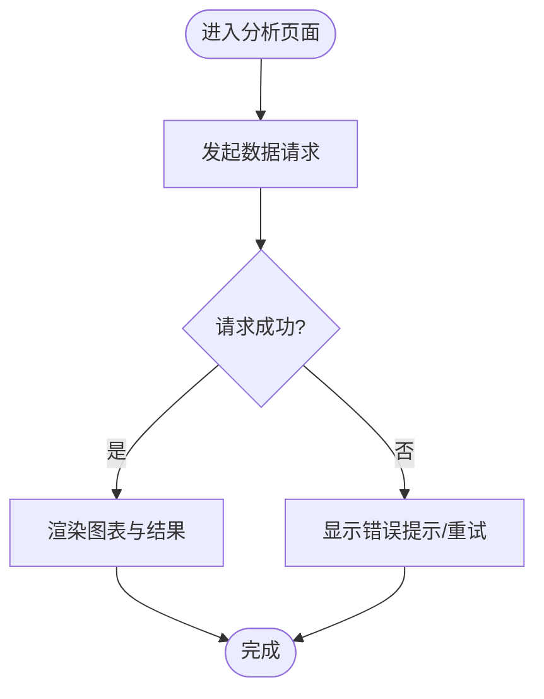
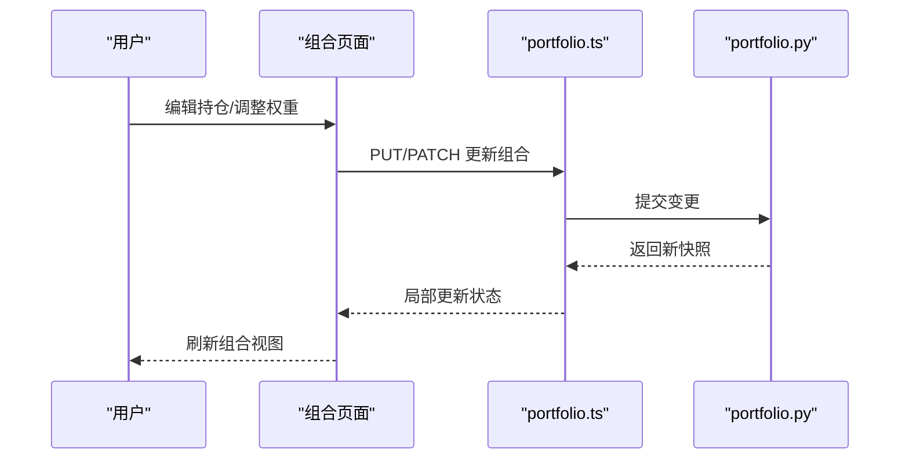
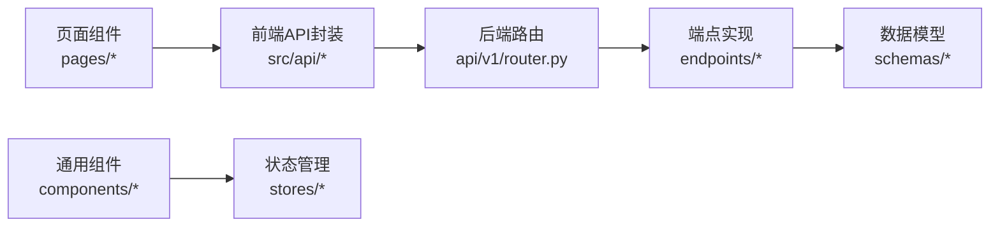

# Web应用

<cite>
**本文档引用的文件**   
- [apps/dsa-web/src/main.tsx](file://apps/dsa-web/src/main.tsx)
- [apps/dsa-web/src/App.tsx](file://apps/dsa-web/src/App.tsx)
- [apps/dsa-web/vite.config.ts](file://apps/dsa-web/vite.config.ts)
- [apps/dsa-web/tailwind.config.js](file://apps/dsa-web/tailwind.config.js)
- [apps/dsa-web/package.json](file://apps/dsa-web/package.json)
- [api/app.py](file://api/app.py)
- [api/v1/router.py](file://api/v1/router.py)
- [api/v1/endpoints/analysis.py](file://api/v1/endpoints/analysis.py)
- [api/v1/endpoints/portfolio.py](file://api/v1/endpoints/portfolio.py)
- [api/v1/endpoints/stocks.py](file://api/v1/endpoints/stocks.py)
- [api/v1/schemas/common.py](file://api/v1/schemas/common.py)
- [apps/dsa-web/src/api/index.ts](file://apps/dsa-web/src/api/index.ts)
- [apps/dsa-web/src/api/analysis.ts](file://apps/dsa-web/src/api/analysis.ts)
- [apps/dsa-web/src/api/portfolio.ts](file://apps/dsa-web/src/api/portfolio.ts)
- [apps/dsa-web/src/api/stocks.ts](file://apps/dsa-web/src/api/stocks.ts)
- [apps/dsa-web/src/pages/Dashboard.tsx](file://apps/dsa-web/src/pages/Dashboard.tsx)
- [apps/dsa-web/src/components/layout/Layout.tsx](file://apps/dsa-web/src/components/layout/Layout.tsx)
- [apps/dsa-web/src/stores/useStore.ts](file://apps/dsa-web/src/stores/useStore.ts)
</cite>

## 目录
1. [简介](#简介)
2. [项目结构](#项目结构)
3. [核心组件](#核心组件)
4. [架构总览](#架构总览)
5. [详细组件分析](#详细组件分析)
6. [依赖关系分析](#依赖关系分析)
7. [性能考虑](#性能考虑)
8. [故障排查指南](#故障排查指南)
9. [结论](#结论)
10. [附录](#附录)

## 简介
本文件面向Daily Stock Analysis Web应用的开发者与使用者，系统性阐述基于React+TypeScript的前端架构设计、组件层次结构、状态管理方案与路由配置；详解股票分析界面、投资组合管理、实时监控面板与报告展示等核心功能模块的实现思路；总结UI组件设计模式（可复用封装、主题定制、响应式布局）；说明前后端数据交互机制（API调用封装、错误处理、加载状态管理）；给出构建与部署流程（开发环境配置、生产优化、静态资源管理）；并提供自定义主题与样式定制方法（Tailwind CSS配置与CSS变量使用）、开发调试技巧与性能优化建议。

## 项目结构
Web前端位于 apps/dsa-web，采用Vite + React + TypeScript工程化方案，结合Tailwind CSS进行样式与主题管理。后端位于 api，提供REST API与Pydantic模型校验。关键入口与配置文件如下：
- 前端入口与根组件：main.tsx、App.tsx
- 构建与工具链：vite.config.ts、package.json、tailwind.config.js
- 后端主应用与路由：app.py、router.py
- API端点与数据模型：endpoints/*、schemas/*
- 前端API封装与页面：src/api/*、src/pages/*、src/components/*

图表来源 
- [apps/dsa-web/src/main.tsx](file://apps/dsa-web/src/main.tsx)
- [apps/dsa-web/src/App.tsx](file://apps/dsa-web/src/App.tsx)
- [apps/dsa-web/vite.config.ts](file://apps/dsa-web/vite.config.ts)
- [apps/dsa-web/tailwind.config.js](file://apps/dsa-web/tailwind.config.js)
- [api/app.py](file://api/app.py)
- [api/v1/router.py](file://api/v1/router.py)

章节来源
- [apps/dsa-web/src/main.tsx](file://apps/dsa-web/src/main.tsx)
- [apps/dsa-web/src/App.tsx](file://apps/dsa-web/src/App.tsx)
- [apps/dsa-web/vite.config.ts](file://apps/dsa-web/vite.config.ts)
- [apps/dsa-web/tailwind.config.js](file://apps/dsa-web/tailwind.config.js)
- [api/app.py](file://api/app.py)
- [api/v1/router.py](file://api/v1/router.py)

## 核心组件
- 应用启动与挂载：main.tsx负责初始化React应用、注入全局上下文与基础样式。
- 根组件与路由：App.tsx组织页面路由、全局状态与主题切换，承载Layout容器。
- 页面与视图：Dashboard等页面聚合业务组件，呈现股票分析、组合管理与监控面板。
- 通用组件：layout、common、report、history等目录下的可复用UI组件，统一交互与样式。
- 状态管理：stores目录集中管理跨页面状态（如用户信息、主题、系统配置）。
- API层：src/api下按领域划分（analysis、portfolio、stocks等），封装请求、错误与加载状态。

章节来源
- [apps/dsa-web/src/main.tsx](file://apps/dsa-web/src/main.tsx)
- [apps/dsa-web/src/App.tsx](file://apps/dsa-web/src/App.tsx)
- [apps/dsa-web/src/pages/Dashboard.tsx](file://apps/dsa-web/src/pages/Dashboard.tsx)
- [apps/dsa-web/src/components/layout/Layout.tsx](file://apps/dsa-web/src/components/layout/Layout.tsx)
- [apps/dsa-web/src/stores/useStore.ts](file://apps/dsa-web/src/stores/useStore.ts)
- [apps/dsa-web/src/api/index.ts](file://apps/dsa-web/src/api/index.ts)

## 架构总览
整体采用“前端单页应用 + 后端REST API”的分离架构。前端通过Vite构建，按需加载页面与组件；后端以FastAPI风格组织路由与Pydantic模型，提供统一的JSON接口。前后端通过HTTP通信，前端在API层统一处理请求、错误与加载态，并在UI层通过Hooks或状态库驱动渲染。

图表来源 
- [apps/dsa-web/src/App.tsx](file://apps/dsa-web/src/App.tsx)
- [apps/dsa-web/src/api/analysis.ts](file://apps/dsa-web/src/api/analysis.ts)
- [api/v1/endpoints/analysis.py](file://api/v1/endpoints/analysis.py)

章节来源
- [apps/dsa-web/src/App.tsx](file://apps/dsa-web/src/App.tsx)
- [apps/dsa-web/src/api/analysis.ts](file://apps/dsa-web/src/api/analysis.ts)
- [api/v1/endpoints/analysis.py](file://api/v1/endpoints/analysis.py)

## 详细组件分析

### 股票分析界面
- 职责：聚合行情、技术指标与AI分析结果，支持时间窗口选择与指标切换。
- 数据流：页面触发API调用 -> API层封装请求与错误 -> 后端分析服务计算 -> 返回结构化结果 -> UI渲染图表与文本。
- 关键点：加载态控制、错误边界、缓存策略（本地存储或内存缓存）。

图表来源 
- [apps/dsa-web/src/pages/Dashboard.tsx](file://apps/dsa-web/src/pages/Dashboard.tsx)
- [apps/dsa-web/src/api/analysis.ts](file://apps/dsa-web/src/api/analysis.ts)
- [api/v1/endpoints/analysis.py](file://api/v1/endpoints/analysis.py)

章节来源
- [apps/dsa-web/src/pages/Dashboard.tsx](file://apps/dsa-web/src/pages/Dashboard.tsx)
- [apps/dsa-web/src/api/analysis.ts](file://apps/dsa-web/src/api/analysis.ts)
- [api/v1/endpoints/analysis.py](file://api/v1/endpoints/analysis.py)

### 投资组合管理
- 职责：维护持仓列表、权重与风险指标，支持导入导出与回测联动。
- 数据流：CRUD操作通过portfolio.ts调用后端端口，持久化到数据库或服务层。
- 关键点：表单校验、批量操作、并发安全与乐观更新。

图表来源 
- [apps/dsa-web/src/api/portfolio.ts](file://apps/dsa-web/src/api/portfolio.ts)
- [api/v1/endpoints/portfolio.py](file://api/v1/endpoints/portfolio.py)

章节来源
- [apps/dsa-web/src/api/portfolio.ts](file://apps/dsa-web/src/api/portfolio.ts)
- [api/v1/endpoints/portfolio.py](file://api/v1/endpoints/portfolio.py)

### 实时监控面板
- 职责：订阅实时报价与信号，低延迟刷新，支持告警与过滤。
- 数据流：WebSocket或轮询拉取 -> 增量更新 -> 防抖/节流渲染。
- 关键点：连接重连、消息去重、内存占用控制。

章节来源
- [apps/dsa-web/src/api/stocks.ts](file://apps/dsa-web/src/api/stocks.ts)
- [api/v1/endpoints/stocks.py](file://api/v1/endpoints/stocks.py)

### 报告展示
- 职责：渲染Markdown/HTML报告，支持导出与多语言。
- 数据流：后端生成报告内容 -> 前端渲染器解析 -> 用户交互（下载/分享）。
- 关键点：安全渲染、样式隔离、国际化适配。

章节来源
- [apps/dsa-web/src/components/report/*](file://apps/dsa-web/src/components/report)

### 布局与导航
- 职责：侧边栏、顶部栏、面包屑与响应式适配。
- 关键点：移动端抽屉菜单、主题切换、权限可见性控制。

章节来源
- [apps/dsa-web/src/components/layout/Layout.tsx](file://apps/dsa-web/src/components/layout/Layout.tsx)

## 依赖关系分析
- 前端依赖：React、TypeScript、Vite、Tailwind CSS、状态管理库（如Zustand/Redux）、HTTP客户端（如Axios/Fetch封装）。
- 后端依赖：FastAPI/Starlette、Pydantic、数据库ORM、任务队列与缓存（可选）。
- 耦合度：前后端通过API契约解耦；前端内部按领域拆分API模块，降低页面与逻辑耦合。

图表来源 
- [apps/dsa-web/src/api/index.ts](file://apps/dsa-web/src/api/index.ts)
- [api/v1/router.py](file://api/v1/router.py)
- [api/v1/endpoints/analysis.py](file://api/v1/endpoints/analysis.py)
- [api/v1/schemas/common.py](file://api/v1/schemas/common.py)

章节来源
- [apps/dsa-web/src/api/index.ts](file://apps/dsa-web/src/api/index.ts)
- [api/v1/router.py](file://api/v1/router.py)
- [api/v1/endpoints/analysis.py](file://api/v1/endpoints/analysis.py)
- [api/v1/schemas/common.py](file://api/v1/schemas/common.py)

## 性能考虑
- 代码分割与懒加载：按路由与组件粒度拆分，减少首屏体积。
- 请求优化：合并请求、分页与增量更新、缓存策略（ETag/本地存储）。
- 渲染优化：虚拟列表、防抖/节流、避免不必要的重渲染。
- 构建优化：Tree-shaking、压缩与资源哈希、CDN缓存。
- 监控与诊断：错误上报、性能埋点与慢请求追踪。

[本节为通用指导，不直接分析具体文件]

## 故障排查指南
- 网络与鉴权：检查CORS、Token过期与签名校验；查看浏览器控制台与后端日志。
- 数据一致性：对比前后端Schema定义，确保字段类型与必填项一致。
- 状态同步：定位状态更新链路，确认副作用清理与竞态条件处理。
- 构建问题：清理缓存、锁定依赖版本、检查环境变量与路径别名。

章节来源
- [api/app.py](file://api/app.py)
- [api/v1/router.py](file://api/v1/router.py)
- [apps/dsa-web/src/api/index.ts](file://apps/dsa-web/src/api/index.ts)

## 结论
该Web应用采用清晰的分层架构与模块化设计，前后端通过稳定API契约协作。前端以React+TypeScript为核心，结合Tailwind CSS实现主题化与响应式；后端以FastAPI风格组织路由与模型，保障数据一致性与可扩展性。通过合理的状态管理与API封装，提升了可维护性与用户体验。后续可在性能监控、缓存策略与自动化测试方面持续优化。

[本节为总结性内容，不直接分析具体文件]

## 附录

### 构建与部署流程
- 开发环境：安装依赖、设置环境变量、启动Vite开发服务器与后端服务。
- 生产构建：执行构建命令，启用压缩与资源哈希，输出静态资源至CDN。
- 部署：将前端静态资源托管至对象存储或CDN，后端服务容器化部署。

章节来源
- [apps/dsa-web/package.json](file://apps/dsa-web/package.json)
- [apps/dsa-web/vite.config.ts](file://apps/dsa-web/vite.config.ts)

### 自定义主题与样式
- Tailwind配置：扩展颜色、字体与间距，定义暗色模式与品牌色板。
- CSS变量：通过全局变量统一管理主题令牌，便于运行时切换。
- 组件样式：优先使用Tailwind原子类，必要时补充CSS模块或样式隔离。

章节来源
- [apps/dsa-web/tailwind.config.js](file://apps/dsa-web/tailwind.config.js)

### 开发调试技巧
- 断点调试：浏览器DevTools与VS Code调试配置。
- Mock与拦截：使用代理或Mock服务验证接口契约。
- 日志与追踪：前端错误上报与后端结构化日志。

[本节为通用指导，不直接分析具体文件]