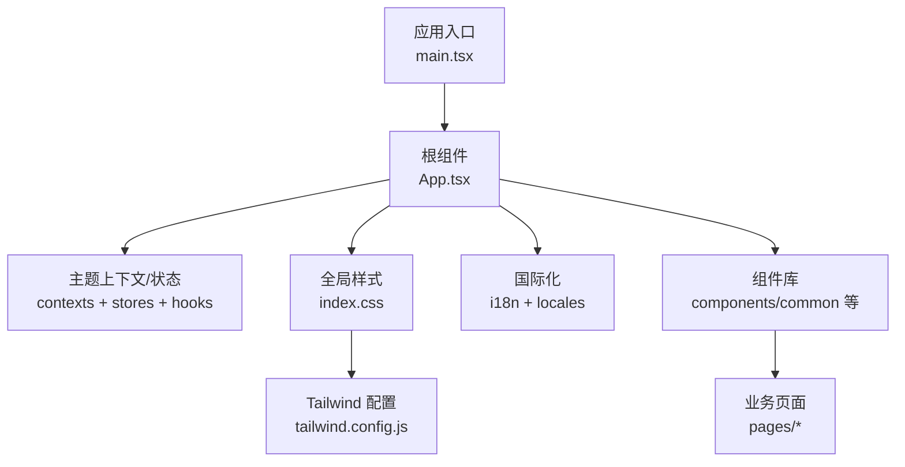
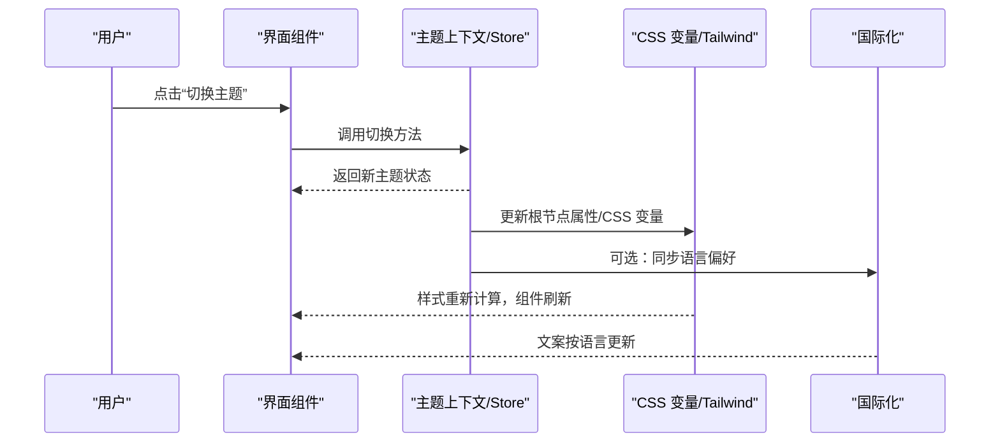
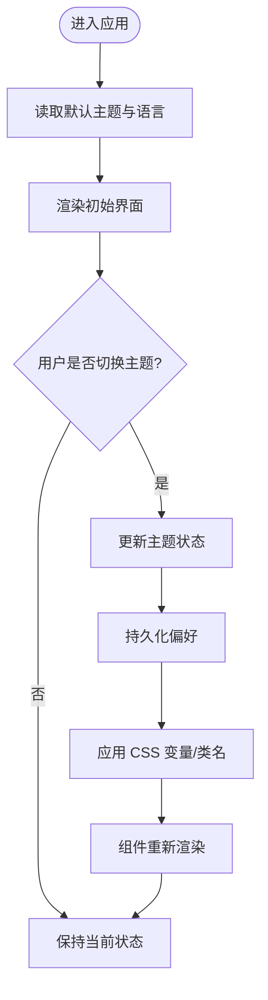
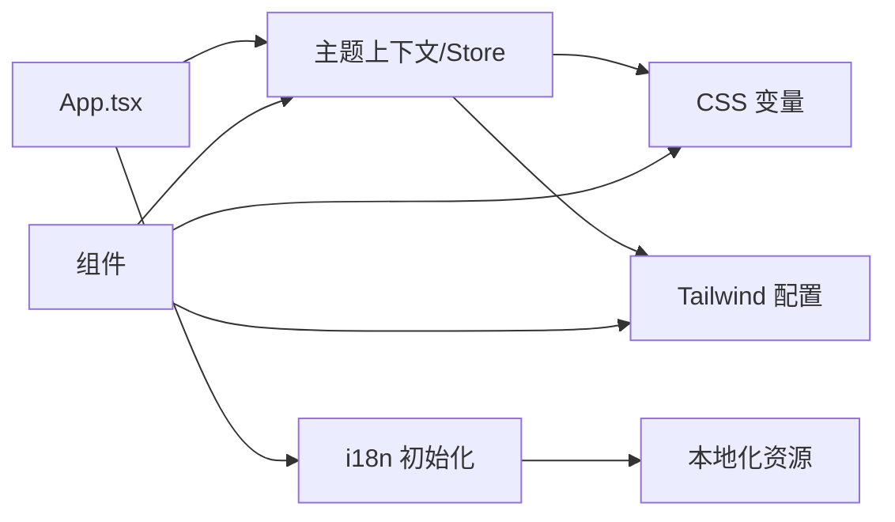

# 主题定制

<cite>
**本文档引用的文件**   
- [tailwind.config.js](file://apps/dsa-web/tailwind.config.js)
- [index.css](file://apps/dsa-web/src/index.css)
- [App.tsx](file://apps/dsa-web/src/App.tsx)
- [main.tsx](file://apps/dsa-web/src/main.tsx)
- [i18n配置](file://apps/dsa-web/src/i18n)
- [本地化资源](file://apps/dsa-web/src/locales)
- [组件示例](file://apps/dsa-web/src/components/common)
- [上下文与状态管理](file://apps/dsa-web/src/contexts)
- [hooks主题相关](file://apps/dsa-web/src/hooks)
- [stores主题相关](file://apps/dsa-web/src/stores)
- [类型定义](file://apps/dsa-web/src/types)
- [工具函数](file://apps/dsa-web/src/utils)
</cite>

## 目录
1. [简介](#简介)
2. [项目结构](#项目结构)
3. [核心组件](#核心组件)
4. [架构总览](#架构总览)
5. [详细组件分析](#详细组件分析)
6. [依赖关系分析](#依赖关系分析)
7. [性能考量](#性能考量)
8. [故障排查指南](#故障排查指南)
9. [结论](#结论)
10. [附录](#附录)

## 简介
本文件面向主题定制，系统性阐述该项目的主题系统设计与实现，包括：
- 深色模式与浅色模式的切换机制
- Tailwind CSS 的配置与使用（自定义颜色、字体、间距）
- CSS 变量的使用方法（动态主题切换与样式覆盖技巧）
- 组件主题化的最佳实践（样式隔离与主题继承）
- 国际化支持（多语言文本与本地化配置）
- 主题开发的工具与调试方法

目标读者既包括前端开发者，也包括需要扩展或定制主题的维护者。

## 项目结构
主题相关代码主要位于 Web 应用目录 apps/dsa-web，关键位置如下：
- 样式与主题配置：Tailwind 配置文件、全局样式入口
- 运行时主题状态：上下文、Hooks、Stores、类型定义
- 国际化：i18n 初始化与本地化资源
- 组件层：通用组件与页面级组件的主题使用方式

图表来源
- [main.tsx](file://apps/dsa-web/src/main.tsx)
- [App.tsx](file://apps/dsa-web/src/App.tsx)
- [index.css](file://apps/dsa-web/src/index.css)
- [tailwind.config.js](file://apps/dsa-web/tailwind.config.js)

章节来源
- [main.tsx](file://apps/dsa-web/src/main.tsx)
- [App.tsx](file://apps/dsa-web/src/App.tsx)
- [index.css](file://apps/dsa-web/src/index.css)
- [tailwind.config.js](file://apps/dsa-web/tailwind.config.js)

## 核心组件
- 主题状态与切换
  - 通过上下文/Store/Hook 提供当前主题（深色/浅色）及切换能力
  - 将主题值注入到 DOM 根节点或 CSS 变量中，驱动 UI 更新
- 样式系统
  - Tailwind 作为原子化样式框架，集中配置主题色板、字体族、间距尺度
  - 全局 CSS 变量承载可动态替换的颜色与尺寸，配合类名快速切换
- 国际化
  - i18n 初始化与语言包加载，为界面文案提供多语言支持
  - 与主题无关但常与主题设置并存于同一设置面板

章节来源
- [contexts](file://apps/dsa-web/src/contexts)
- [hooks](file://apps/dsa-web/src/hooks)
- [stores](file://apps/dsa-web/src/stores)
- [types](file://apps/dsa-web/src/types)
- [i18n配置](file://apps/dsa-web/src/i18n)
- [本地化资源](file://apps/dsa-web/src/locales)

## 架构总览
主题系统的整体数据流与控制流如下：
- 应用启动时加载默认主题与语言
- 用户触发主题切换后，更新主题状态并持久化偏好
- 主题变化通过 CSS 变量和 Tailwind 类名生效，组件按需响应
- 国际化文案随语言切换即时更新

图表来源
- [App.tsx](file://apps/dsa-web/src/App.tsx)
- [index.css](file://apps/dsa-web/src/index.css)
- [tailwind.config.js](file://apps/dsa-web/tailwind.config.js)
- [i18n配置](file://apps/dsa-web/src/i18n)

## 详细组件分析

### 主题切换机制（深色/浅色）
- 状态管理
  - 在上下文中维护主题键值（如“light”“dark”），并提供 setter
  - 结合 Store 进行跨组件共享与持久化（例如 localStorage）
- 渲染策略
  - 在根节点添加 data-theme 或 class，或使用 CSS 变量覆盖
  - Tailwind 的 dark 模式可通过类名或媒体查询驱动
- 交互流程
  - 用户操作 -> 更新状态 -> 写入存储 -> 触发样式重绘 -> 组件响应

章节来源
- [contexts](file://apps/dsa-web/src/contexts)
- [stores](file://apps/dsa-web/src/stores)
- [hooks](file://apps/dsa-web/src/hooks)
- [App.tsx](file://apps/dsa-web/src/App.tsx)

### Tailwind CSS 配置与使用
- 自定义颜色
  - 在配置文件中扩展色板，确保深浅色模式下均有对应语义色
  - 使用语义化命名（如 primary、surface、text、border）提升可维护性
- 字体与间距
  - 统一字体族与字号阶梯，保证可读性与一致性
  - 间距采用比例尺，避免硬编码像素值
- 暗色模式
  - 启用 dark 模式策略（class 或 media），并通过配置映射不同主题下的颜色
- 使用建议
  - 优先使用 Tailwind 类名；复杂场景再回退到 CSS 变量
  - 避免在组件内写死颜色，尽量引用主题色板

章节来源
- [tailwind.config.js](file://apps/dsa-web/tailwind.config.js)
- [index.css](file://apps/dsa-web/src/index.css)

### CSS 变量与样式覆盖
- 变量设计
  - 在 :root 或 [data-theme] 下声明变量，区分 light/dark
  - 变量命名遵循语义化（如 --color-bg、--color-text、--radius-md）
- 动态切换
  - 切换主题时仅更新变量值，无需重建样式表
  - 对第三方组件，通过覆盖变量或外层容器限定作用域
- 覆盖技巧
  - 使用更具体的选择器或 data-* 属性限定范围
  - 谨慎使用 !important，优先通过优先级与变量覆盖解决

章节来源
- [index.css](file://apps/dsa-web/src/index.css)

### 组件主题化最佳实践
- 样式隔离
  - 组件内部尽量使用 Tailwind 类名与局部变量，避免污染全局
  - 对外暴露主题开关时，通过 props 或 context 传递
- 主题继承
  - 基础组件提供默认主题，业务组件可叠加覆盖
  - 使用组合而非继承，减少耦合
- 可访问性
  - 确保对比度达标，提供高对比度模式
  - 键盘导航与焦点态清晰可见

章节来源
- [components/common](file://apps/dsa-web/src/components/common)
- [App.tsx](file://apps/dsa-web/src/App.tsx)

### 国际化支持
- 初始化与加载
  - 在应用入口初始化 i18n，按需加载语言包
  - 检测系统语言或用户偏好，设置默认语言
- 文案组织
  - 按模块拆分翻译文件，便于维护与增量更新
  - 使用占位符与复数规则处理动态内容
- 与主题的关系
  - 语言切换与主题切换相互独立，可在设置页并列呈现

章节来源
- [i18n配置](file://apps/dsa-web/src/i18n)
- [本地化资源](file://apps/dsa-web/src/locales)

## 依赖关系分析
主题系统与样式、状态、国际化之间的依赖关系如下：

图表来源
- [App.tsx](file://apps/dsa-web/src/App.tsx)
- [index.css](file://apps/dsa-web/src/index.css)
- [tailwind.config.js](file://apps/dsa-web/tailwind.config.js)
- [i18n配置](file://apps/dsa-web/src/i18n)
- [本地化资源](file://apps/dsa-web/src/locales)

章节来源
- [App.tsx](file://apps/dsa-web/src/App.tsx)
- [index.css](file://apps/dsa-web/src/index.css)
- [tailwind.config.js](file://apps/dsa-web/tailwind.config.js)
- [i18n配置](file://apps/dsa-web/src/i18n)
- [本地化资源](file://apps/dsa-web/src/locales)

## 性能考量
- 样式体积
  - 使用 Tailwind 按需生成，避免未用样式进入生产包
- 主题切换开销
  - 优先使用 CSS 变量与类名切换，避免频繁重建 DOM
- 渲染优化
  - 组件层面使用 React.memo/useMemo 减少不必要的重渲染
- 缓存策略
  - 主题与语言偏好持久化，避免重复读取与解析

[本节为通用指导，不直接分析具体文件]

## 故障排查指南
- 主题不生效
  - 检查根节点是否正确设置 data-theme/class
  - 确认 CSS 变量已正确声明且被覆盖
- 颜色不一致
  - 核对 Tailwind 配置中的色板映射
  - 检查组件是否使用了硬编码颜色
- 国际化文案缺失
  - 确认语言包已加载且 key 匹配
  - 检查 fallback 逻辑是否正常工作
- 第三方组件样式冲突
  - 使用容器限定作用域或变量覆盖
  - 避免滥用 !important

章节来源
- [index.css](file://apps/dsa-web/src/index.css)
- [tailwind.config.js](file://apps/dsa-web/tailwind.config.js)
- [i18n配置](file://apps/dsa-web/src/i18n)

## 结论
本项目通过 Tailwind CSS 与 CSS 变量相结合，构建了可扩展、易维护的主题系统。深色/浅色模式切换以状态为中心，配合语义化变量与原子化类名，实现了高效的样式更新。国际化与主题解耦，便于独立演进。遵循组件主题化最佳实践，可在保证样式隔离的同时实现主题继承与覆盖。

[本节为总结性内容，不直接分析具体文件]

## 附录
- 开发工具
  - 浏览器开发者工具：检查 CSS 变量与 computed styles
  - Tailwind 插件：辅助查看类名与主题映射
- 调试方法
  - 在控制台打印主题状态与语言偏好
  - 使用断点跟踪主题切换流程
- 扩展建议
  - 新增主题色板时，同时补充 dark 模式映射
  - 为常用组件提供主题预览与回归测试

[本节为补充信息，不直接分析具体文件]