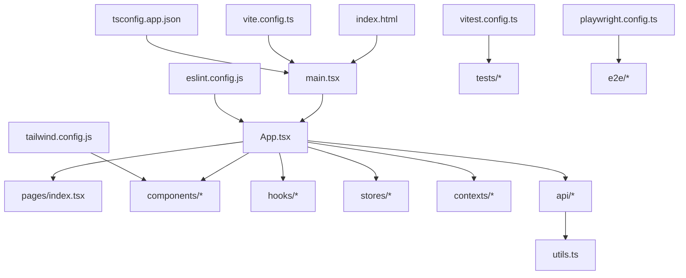
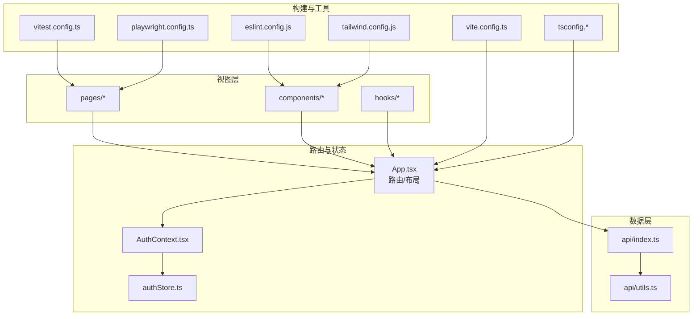
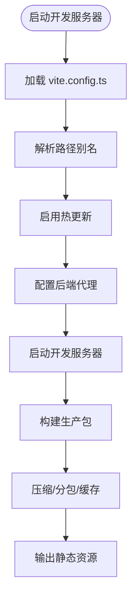
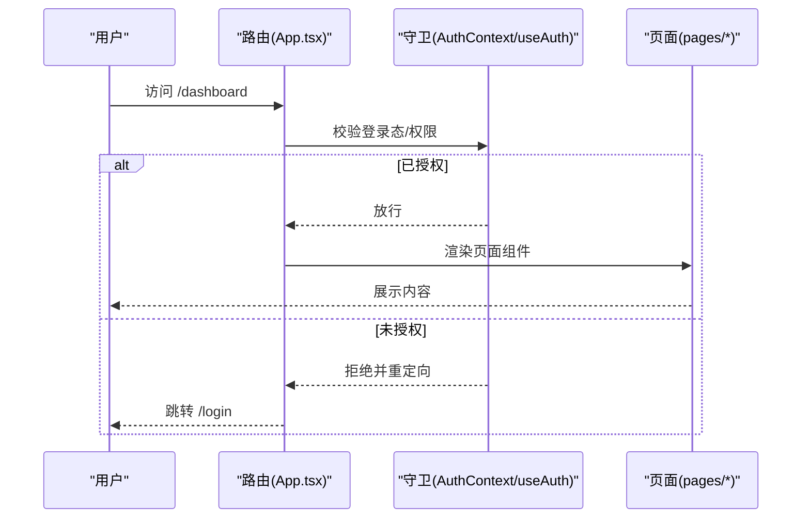
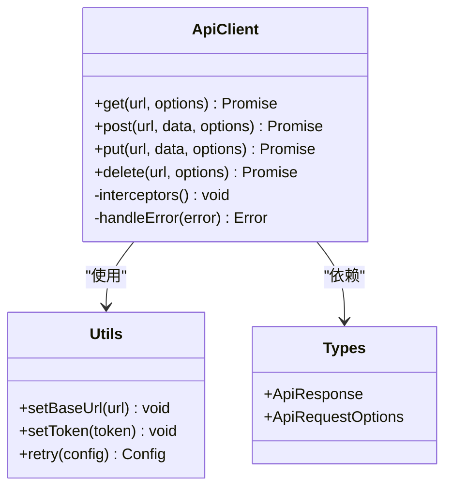
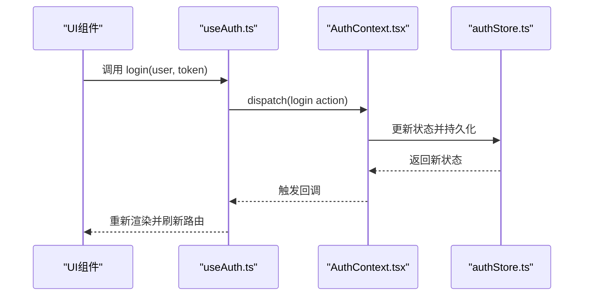
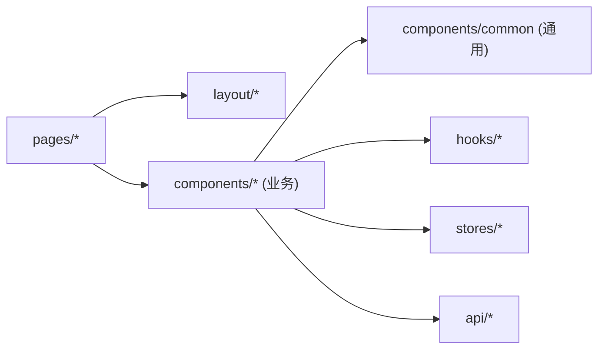
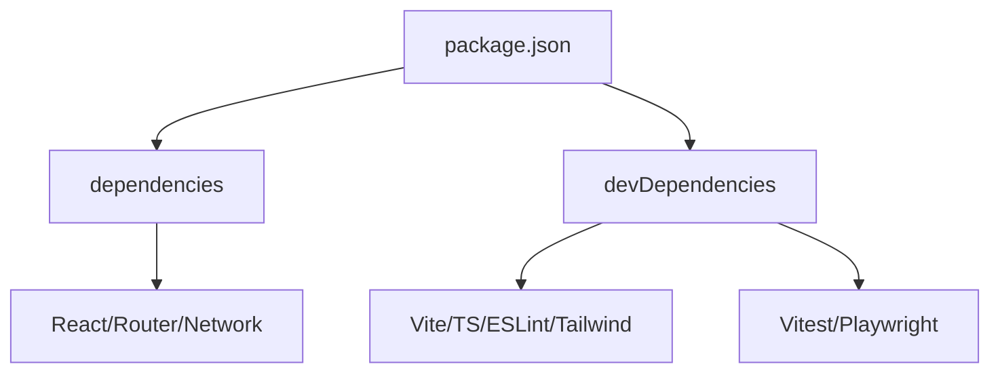

# 应用架构设计

<cite>
**本文引用的文件**   
- [apps/dsa-web/package.json](file://apps/dsa-web/package.json)
- [apps/dsa-web/vite.config.ts](file://apps/dsa-web/vite.config.ts)
- [apps/dsa-web/tsconfig.app.json](file://apps/dsa-web/tsconfig.app.json)
- [apps/dsa-web/tsconfig.node.json](file://apps/dsa-web/tsconfig.node.json)
- [apps/dsa-web/index.html](file://apps/dsa-web/index.html)
- [apps/dsa-web/src/main.tsx](file://apps/dsa-web/src/main.tsx)
- [apps/dsa-web/src/App.tsx](file://apps/dsa-web/src/App.tsx)
- [apps/dsa-web/src/pages/index.tsx](file://apps/dsa-web/src/pages/index.tsx)
- [apps/dsa-web/src/api/index.ts](file://apps/dsa-web/src/api/index.ts)
- [apps/dsa-web/src/api/utils.ts](file://apps/dsa-web/src/api/utils.ts)
- [apps/dsa-web/src/components/common/index.tsx](file://apps/dsa-web/src/components/common/index.tsx)
- [apps/dsa-web/src/hooks/useAuth.ts](file://apps/dsa-web/src/hooks/useAuth.ts)
- [apps/dsa-web/src/stores/authStore.ts](file://apps/dsa-web/src/stores/authStore.ts)
- [apps/dsa-web/src/contexts/AuthContext.tsx](file://apps/dsa-web/src/contexts/AuthContext.tsx)
- [apps/dsa-web/src/types/api.ts](file://apps/dsa-web/src/types/api.ts)
- [apps/dsa-web/eslint.config.js](file://apps/dsa-web/eslint.config.js)
- [apps/dsa-web/tailwind.config.js](file://apps/dsa-web/tailwind.config.js)
- [apps/dsa-web/vitest.config.ts](file://apps/dsa-web/vitest.config.ts)
- [apps/dsa-web/playwright.config.ts](file://apps/dsa-web/playwright.config.ts)
</cite>

## 目录
1. [简介](#简介)
2. [项目结构](#项目结构)
3. [核心组件](#核心组件)
4. [架构总览](#架构总览)
5. [详细组件分析](#详细组件分析)
6. [依赖分析](#依赖分析)
7. [性能考虑](#性能考虑)
8. [故障排查指南](#故障排查指南)
9. [结论](#结论)
10. [附录](#附录)

## 简介
本文件面向基于 React + TypeScript 的前端工程，系统化阐述其架构模式、模块划分原则与依赖管理策略；详解 Vite 构建配置（开发服务器、插件与生产优化）；说明路由系统设计与实现（页面路由、嵌套路由与守卫机制）；梳理组件层次结构与文件组织规范（页面组件、业务组件、通用组件分离）；并给出前后端通信架构（API 客户端封装、请求拦截器与响应处理）、开发环境搭建与常用工具配置。文档力求兼顾技术深度与可读性，帮助不同背景的读者快速理解与落地实践。

## 项目结构
前端位于 apps/dsa-web 子包，采用按功能域与职责分层组织：
- src/pages：页面级路由入口与容器组件
- src/components：可复用 UI 与业务组件，按领域进一步拆分（common、dashboard、report 等）
- src/api：HTTP API 客户端与类型定义
- src/hooks：自定义 Hook（如鉴权、数据获取）
- src/stores：状态管理（轻量 store）
- src/contexts：全局上下文（如 AuthContext）
- src/types：共享类型与接口
- src/utils：工具函数与常量
- 根配置：vite.config.ts、tsconfig.*、eslint.config.js、tailwind.config.js、vitest.config.ts、playwright.config.ts

图表来源
- [apps/dsa-web/index.html](file://apps/dsa-web/index.html)
- [apps/dsa-web/src/main.tsx](file://apps/dsa-web/src/main.tsx)
- [apps/dsa-web/src/App.tsx](file://apps/dsa-web/src/App.tsx)
- [apps/dsa-web/src/pages/index.tsx](file://apps/dsa-web/src/pages/index.tsx)
- [apps/dsa-web/vite.config.ts](file://apps/dsa-web/vite.config.ts)
- [apps/dsa-web/tsconfig.app.json](file://apps/dsa-web/tsconfig.app.json)
- [apps/dsa-web/eslint.config.js](file://apps/dsa-web/eslint.config.js)
- [apps/dsa-web/tailwind.config.js](file://apps/dsa-web/tailwind.config.js)
- [apps/dsa-web/vitest.config.ts](file://apps/dsa-web/vitest.config.ts)
- [apps/dsa-web/playwright.config.ts](file://apps/dsa-web/playwright.config.ts)

章节来源
- [apps/dsa-web/package.json](file://apps/dsa-web/package.json)
- [apps/dsa-web/vite.config.ts](file://apps/dsa-web/vite.config.ts)
- [apps/dsa-web/tsconfig.app.json](file://apps/dsa-web/tsconfig.app.json)
- [apps/dsa-web/tsconfig.node.json](file://apps/dsa-web/tsconfig.node.json)
- [apps/dsa-web/index.html](file://apps/dsa-web/index.html)
- [apps/dsa-web/src/main.tsx](file://apps/dsa-web/src/main.tsx)
- [apps/dsa-web/src/App.tsx](file://apps/dsa-web/src/App.tsx)
- [apps/dsa-web/src/pages/index.tsx](file://apps/dsa-web/src/pages/index.tsx)

## 核心组件
- 应用入口与挂载：main.tsx 负责初始化 React、渲染 App，并注入全局 Provider（如主题、国际化、鉴权）。
- 顶层路由与布局：App.tsx 集中声明路由、布局壳与全局错误边界。
- 页面路由表：pages/index.tsx 作为路由映射的集中地，便于权限控制与懒加载。
- API 客户端：api/index.ts 统一封装 fetch/axios 调用，提供强类型方法；utils.ts 包含请求拦截、错误处理与重试策略。
- 鉴权上下文与 Store：contexts/AuthContext.tsx 暴露鉴权状态与动作；stores/authStore.ts 维护本地状态与持久化。
- 通用组件：components/common 提供按钮、表单、表格等基础 UI，确保风格一致与复用。
- 自定义 Hook：hooks/useAuth.ts 封装鉴权逻辑，供页面与组件消费。

章节来源
- [apps/dsa-web/src/main.tsx](file://apps/dsa-web/src/main.tsx)
- [apps/dsa-web/src/App.tsx](file://apps/dsa-web/src/App.tsx)
- [apps/dsa-web/src/pages/index.tsx](file://apps/dsa-web/src/pages/index.tsx)
- [apps/dsa-web/src/api/index.ts](file://apps/dsa-web/src/api/index.ts)
- [apps/dsa-web/src/api/utils.ts](file://apps/dsa-web/src/api/utils.ts)
- [apps/dsa-web/src/contexts/AuthContext.tsx](file://apps/dsa-web/src/contexts/AuthContext.tsx)
- [apps/dsa-web/src/stores/authStore.ts](file://apps/dsa-web/src/stores/authStore.ts)
- [apps/dsa-web/src/hooks/useAuth.ts](file://apps/dsa-web/src/hooks/useAuth.ts)
- [apps/dsa-web/src/components/common/index.tsx](file://apps/dsa-web/src/components/common/index.tsx)

## 架构总览
整体采用“单页应用 + 模块化 API 层”的架构：
- 视图层：React + TypeScript，组件按页面/业务/通用分层
- 路由层：集中式路由表，支持嵌套路由与守卫
- 状态层：Context + Store（轻量），避免过度复杂的状态库
- 数据层：统一的 API 客户端，封装请求/响应拦截、错误处理与重试
- 构建层：Vite 驱动的开发与生产流程，TypeScript 编译与 Tailwind 样式集成

图表来源
- [apps/dsa-web/src/App.tsx](file://apps/dsa-web/src/App.tsx)
- [apps/dsa-web/src/contexts/AuthContext.tsx](file://apps/dsa-web/src/contexts/AuthContext.tsx)
- [apps/dsa-web/src/stores/authStore.ts](file://apps/dsa-web/src/stores/authStore.ts)
- [apps/dsa-web/src/api/index.ts](file://apps/dsa-web/src/api/index.ts)
- [apps/dsa-web/src/api/utils.ts](file://apps/dsa-web/src/api/utils.ts)
- [apps/dsa-web/vite.config.ts](file://apps/dsa-web/vite.config.ts)
- [apps/dsa-web/tsconfig.app.json](file://apps/dsa-web/tsconfig.app.json)
- [apps/dsa-web/eslint.config.js](file://apps/dsa-web/eslint.config.js)
- [apps/dsa-web/tailwind.config.js](file://apps/dsa-web/tailwind.config.js)
- [apps/dsa-web/vitest.config.ts](file://apps/dsa-web/vitest.config.ts)
- [apps/dsa-web/playwright.config.ts](file://apps/dsa-web/playwright.config.ts)

## 详细组件分析

### 构建与运行（Vite + TS）
- 开发服务器：通过 vite.config.ts 配置端口、代理、热更新与别名，提升开发体验。
- 插件生态：按需引入 React、TS、路径别名、Tailwind 等插件，保证编译与样式链完整。
- 生产优化：代码分割、Tree Shaking、资源压缩、缓存策略与 SourceMap 开关。
- TypeScript：tsconfig.app.json 与 tsconfig.node.json 分别约束应用与构建脚本类型检查。

图表来源
- [apps/dsa-web/vite.config.ts](file://apps/dsa-web/vite.config.ts)
- [apps/dsa-web/tsconfig.app.json](file://apps/dsa-web/tsconfig.app.json)
- [apps/dsa-web/tsconfig.node.json](file://apps/dsa-web/tsconfig.node.json)

章节来源
- [apps/dsa-web/vite.config.ts](file://apps/dsa-web/vite.config.ts)
- [apps/dsa-web/tsconfig.app.json](file://apps/dsa-web/tsconfig.app.json)
- [apps/dsa-web/tsconfig.node.json](file://apps/dsa-web/tsconfig.node.json)

### 路由系统（页面路由、嵌套路由与守卫）
- 页面路由：在 pages/index.tsx 中集中声明路由映射，便于权限控制与懒加载。
- 嵌套路由：通过布局组件包裹子路由，实现侧边栏/顶部导航与内容区组合。
- 路由守卫：结合 AuthContext 与 useAuth Hook，在未登录或无权限时重定向到登录页或空白页。

图表来源
- [apps/dsa-web/src/App.tsx](file://apps/dsa-web/src/App.tsx)
- [apps/dsa-web/src/pages/index.tsx](file://apps/dsa-web/src/pages/index.tsx)
- [apps/dsa-web/src/contexts/AuthContext.tsx](file://apps/dsa-web/src/contexts/AuthContext.tsx)
- [apps/dsa-web/src/hooks/useAuth.ts](file://apps/dsa-web/src/hooks/useAuth.ts)

章节来源
- [apps/dsa-web/src/App.tsx](file://apps/dsa-web/src/App.tsx)
- [apps/dsa-web/src/pages/index.tsx](file://apps/dsa-web/src/pages/index.tsx)
- [apps/dsa-web/src/contexts/AuthContext.tsx](file://apps/dsa-web/src/contexts/AuthContext.tsx)
- [apps/dsa-web/src/hooks/useAuth.ts](file://apps/dsa-web/src/hooks/useAuth.ts)

### API 客户端（封装、拦截器与响应处理）
- 统一封装：api/index.ts 导出各模块的 API 方法，保持调用一致性。
- 请求拦截：在 utils.ts 中设置 Base URL、认证头、超时与重试策略。
- 响应处理：统一解析成功/失败分支，抛出结构化错误，便于上层捕获与提示。
- 类型安全：通过 types/api.ts 定义请求/响应模型，确保端到端类型一致。

图表来源
- [apps/dsa-web/src/api/index.ts](file://apps/dsa-web/src/api/index.ts)
- [apps/dsa-web/src/api/utils.ts](file://apps/dsa-web/src/api/utils.ts)
- [apps/dsa-web/src/types/api.ts](file://apps/dsa-web/src/types/api.ts)

章节来源
- [apps/dsa-web/src/api/index.ts](file://apps/dsa-web/src/api/index.ts)
- [apps/dsa-web/src/api/utils.ts](file://apps/dsa-web/src/api/utils.ts)
- [apps/dsa-web/src/types/api.ts](file://apps/dsa-web/src/types/api.ts)

### 鉴权上下文与状态管理
- Context：AuthContext.tsx 暴露 isLogin、user、login/logout 等方法，供全树消费。
- Store：authStore.ts 维护本地状态与持久化（如 localStorage），并提供订阅更新。
- Hook：useAuth.ts 简化鉴权逻辑的使用，包括角色判断与权限校验。

图表来源
- [apps/dsa-web/src/hooks/useAuth.ts](file://apps/dsa-web/src/hooks/useAuth.ts)
- [apps/dsa-web/src/contexts/AuthContext.tsx](file://apps/dsa-web/src/contexts/AuthContext.tsx)
- [apps/dsa-web/src/stores/authStore.ts](file://apps/dsa-web/src/stores/authStore.ts)

章节来源
- [apps/dsa-web/src/hooks/useAuth.ts](file://apps/dsa-web/src/hooks/useAuth.ts)
- [apps/dsa-web/src/contexts/AuthContext.tsx](file://apps/dsa-web/src/contexts/AuthContext.tsx)
- [apps/dsa-web/src/stores/authStore.ts](file://apps/dsa-web/src/stores/authStore.ts)

### 组件层次与文件组织规范
- 页面组件（pages/*）：承载路由与业务编排，尽量薄，不包含复杂 UI 细节。
- 业务组件（components/*）：按领域拆分（dashboard、report、history 等），封装业务交互。
- 通用组件（components/common）：纯 UI 组件，无业务耦合，强调可复用与可测试。
- 命名与导入：统一 PascalCase 命名组件，按功能聚合 index.ts 导出，减少深层导入。

图表来源
- [apps/dsa-web/src/pages/index.tsx](file://apps/dsa-web/src/pages/index.tsx)
- [apps/dsa-web/src/components/common/index.tsx](file://apps/dsa-web/src/components/common/index.tsx)

章节来源
- [apps/dsa-web/src/pages/index.tsx](file://apps/dsa-web/src/pages/index.tsx)
- [apps/dsa-web/src/components/common/index.tsx](file://apps/dsa-web/src/components/common/index.tsx)

## 依赖分析
- 运行时依赖：React、React Router、状态管理与网络库（如 axios/fetch wrapper）。
- 构建依赖：Vite、TypeScript、ESLint、Tailwind CSS、Vitest、Playwright。
- 开发依赖：调试、格式化、类型检查与测试工具链。

图表来源
- [apps/dsa-web/package.json](file://apps/dsa-web/package.json)

章节来源
- [apps/dsa-web/package.json](file://apps/dsa-web/package.json)

## 性能考虑
- 代码分割：按路由与组件懒加载，减少首屏体积。
- Tree Shaking：移除未使用代码，配合严格 TS 配置提高摇树效果。
- 资源优化：图片/字体压缩、CDN 缓存与版本化文件名。
- 请求优化：合并请求、缓存策略、去抖/节流与错误重试。
- 渲染优化：React.memo、useMemo/useCallback、虚拟列表与大列表分页。

[本节为通用指导，不直接分析具体文件]

## 故障排查指南
- 构建失败：检查 TS 配置与 ESLint 规则冲突；确认 Vite 插件顺序与别名路径。
- 路由守卫异常：确认 AuthContext 初始化时机与异步登录完成后再渲染受保护路由。
- API 错误：查看拦截器日志与错误码映射；核对 Base URL、CORS 与 Token 刷新逻辑。
- 样式问题：Tailwind 类名冲突与优先级；确认 PostCSS 与 Tailwind 配置生效。
- 测试失败：Vitest 环境配置与 Mock 数据；Playwright 环境变量与浏览器安装。

章节来源
- [apps/dsa-web/vite.config.ts](file://apps/dsa-web/vite.config.ts)
- [apps/dsa-web/tsconfig.app.json](file://apps/dsa-web/tsconfig.app.json)
- [apps/dsa-web/eslint.config.js](file://apps/dsa-web/eslint.config.js)
- [apps/dsa-web/tailwind.config.js](file://apps/dsa-web/tailwind.config.js)
- [apps/dsa-web/vitest.config.ts](file://apps/dsa-web/vitest.config.ts)
- [apps/dsa-web/playwright.config.ts](file://apps/dsa-web/playwright.config.ts)

## 结论
本项目以 React + TypeScript 为核心，结合 Vite 的高效构建能力，形成清晰的分层架构与规范的模块组织。通过集中式路由与鉴权守卫保障访问安全，统一的 API 客户端提升前后端协作效率。借助 ESLint、Tailwind、Vitest 与 Playwright 的工具链，确保代码质量与交付稳定性。建议持续完善类型契约、错误处理与性能监控，进一步提升用户体验与可维护性。

## 附录
- 开发环境搭建
  - 安装 Node.js 与包管理器（npm/yarn/pnpm）
  - 进入 apps/dsa-web，执行依赖安装与开发服务器启动
  - 配置 .env 环境变量（后端地址、功能开关等）
- 常用命令
  - 开发：启动开发服务器与热更新
  - 构建：生成生产包与产物检查
  - 测试：单元测试与端到端测试
  - 代码质量：ESLint 检查与修复、类型检查
- 最佳实践
  - 组件职责单一、接口明确、可测试性强
  - API 调用统一封装，错误与状态集中处理
  - 路由与权限解耦，守卫逻辑可插拔
  - 构建与样式配置集中管理，避免分散修改

[本节为通用指导，不直接分析具体文件]