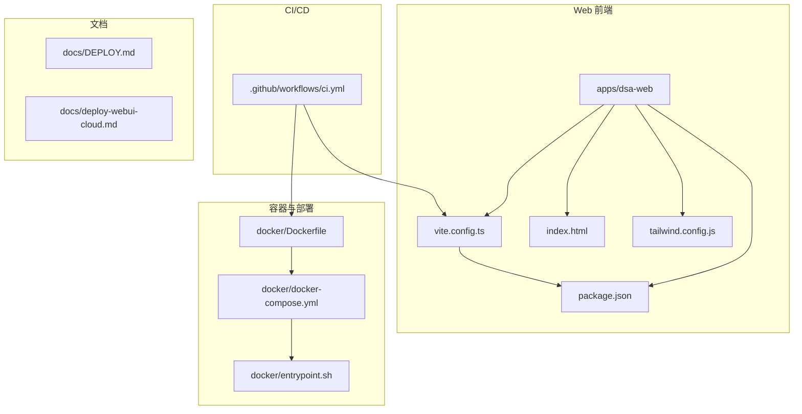
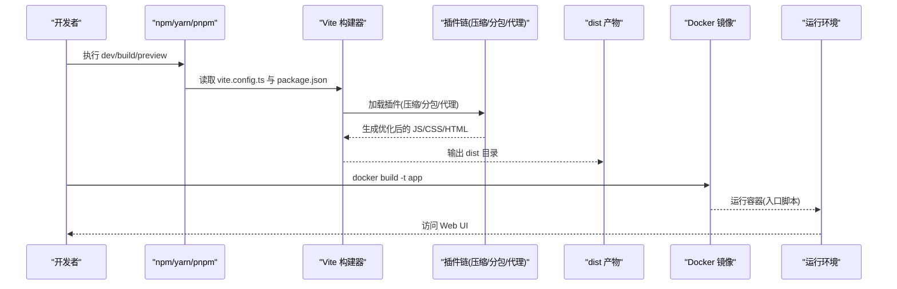
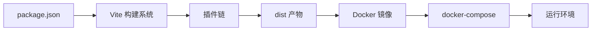

# 构建与部署

<cite>
**本文引用的文件**   
- [vite.config.ts](file://apps/dsa-web/vite.config.ts)
- [package.json](file://apps/dsa-web/package.json)
- [index.html](file://apps/dsa-web/index.html)
- [tailwind.config.js](file://apps/dsa-web/tailwind.config.js)
- [Dockerfile](file://docker/Dockerfile)
- [docker-compose.yml](file://docker/docker-compose.yml)
- [entrypoint.sh](file://docker/entrypoint.sh)
- [.github/workflows/ci.yml](file://.github/workflows/ci.yml)
- [DEPLOY.md](file://docs/DEPLOY.md)
- [deploy-webui-cloud.md](file://docs/deploy-webui-cloud.md)
</cite>

## 目录
1. [简介](#简介)
2. [项目结构](#项目结构)
3. [核心组件](#核心组件)
4. [架构总览](#架构总览)
5. [详细组件分析](#详细组件分析)
6. [依赖分析](#依赖分析)
7. [性能考虑](#性能考虑)
8. [故障排查指南](#故障排查指南)
9. [结论](#结论)
10. [附录](#附录)

## 简介
本文件面向开发与运维人员，系统化说明前端 Web 应用（基于 Vite）的构建与部署实践。内容覆盖开发/生产差异化配置、打包优化策略（代码分割、资源压缩、缓存）、环境变量管理、静态资源管理（图片、字体、CDN），以及容器化与云平台部署、CI/CD 流水线集成、性能监控与错误追踪接入方法。文档力求在技术深度与可读性之间取得平衡，帮助读者快速落地并持续优化。

## 项目结构
本项目的前端位于 apps/dsa-web，使用 Vite + TypeScript + Tailwind CSS 进行构建与样式工程化；后端与工具脚本位于根目录及 api/bot/src 等模块；容器化与部署相关配置集中在 docker 与 docs 目录；CI/CD 工作流位于 .github/workflows。

图表来源 
- [vite.config.ts](file://apps/dsa-web/vite.config.ts)
- [package.json](file://apps/dsa-web/package.json)
- [index.html](file://apps/dsa-web/index.html)
- [tailwind.config.js](file://apps/dsa-web/tailwind.config.js)
- [Dockerfile](file://docker/Dockerfile)
- [docker-compose.yml](file://docker/docker-compose.yml)
- [entrypoint.sh](file://docker/entrypoint.sh)
- [.github/workflows/ci.yml](file://.github/workflows/ci.yml)
- [DEPLOY.md](file://docs/DEPLOY.md)
- [deploy-webui-cloud.md](file://docs/deploy-webui-cloud.md)

章节来源
- [vite.config.ts](file://apps/dsa-web/vite.config.ts)
- [package.json](file://apps/dsa-web/package.json)
- [index.html](file://apps/dsa-web/index.html)
- [tailwind.config.js](file://apps/dsa-web/tailwind.config.js)
- [Dockerfile](file://docker/Dockerfile)
- [docker-compose.yml](file://docker/docker-compose.yml)
- [entrypoint.sh](file://docker/entrypoint.sh)
- [.github/workflows/ci.yml](file://.github/workflows/ci.yml)
- [DEPLOY.md](file://docs/DEPLOY.md)
- [deploy-webui-cloud.md](file://docs/deploy-webui-cloud.md)

## 核心组件
- Vite 构建配置：定义开发服务器、插件链、输出产物、代理与优化策略。
- 包管理与脚本：通过 package.json 暴露 dev/build/preview 等命令，统一入口。
- HTML 模板：作为 Vite 的入口页面，注入运行时变量与基础资源。
- 样式工程：Tailwind 配置控制主题、响应式与构建期扫描。
- 容器镜像：多阶段构建最小化镜像体积，分离构建与运行环境。
- 编排与启动：docker-compose 组合服务，entrypoint 负责初始化与进程管理。
- CI/CD：自动化构建、测试、镜像推送与发布流程。

章节来源
- [vite.config.ts](file://apps/dsa-web/vite.config.ts)
- [package.json](file://apps/dsa-web/package.json)
- [index.html](file://apps/dsa-web/index.html)
- [tailwind.config.js](file://apps/dsa-web/tailwind.config.js)
- [Dockerfile](file://docker/Dockerfile)
- [docker-compose.yml](file://docker/docker-compose.yml)
- [entrypoint.sh](file://docker/entrypoint.sh)
- [.github/workflows/ci.yml](file://.github/workflows/ci.yml)

## 架构总览
下图展示从源码到可部署产物的端到端流程，包括开发环境与生产环境的差异点。

图表来源 
- [vite.config.ts](file://apps/dsa-web/vite.config.ts)
- [package.json](file://apps/dsa-web/package.json)
- [Dockerfile](file://docker/Dockerfile)
- [entrypoint.sh](file://docker/entrypoint.sh)

## 详细组件分析

### Vite 构建配置（开发 vs 生产）
- 开发环境
  - 启用热更新与本地代理，便于联调后端 API。
  - 保留调试信息，提升定位效率。
  - 按需开启 SourceMap，加速迭代。
- 生产环境
  - 启用代码分割与懒加载，减少首屏体积。
  - 启用资源压缩（JS/CSS/HTML）与 Tree-shaking。
  - 设置输出目录与文件名哈希，利于缓存。
  - 可选 CDN 前缀与公共路径配置，适配不同部署域。

章节来源
- [vite.config.ts](file://apps/dsa-web/vite.config.ts)
- [package.json](file://apps/dsa-web/package.json)

### 打包优化策略
- 代码分割
  - 按路由或功能模块拆分 chunk，实现按需加载。
  - 第三方库独立分包，利用浏览器长期缓存。
- 资源压缩
  - JS/CSS/HTML 压缩，移除无用代码与注释。
  - 图片自动转换与压缩（如 webp），字体子集化。
- 缓存策略
  - 输出文件名带内容哈希，配合强缓存头。
  - index.html 不缓存或短缓存，确保版本更新及时生效。

章节来源
- [vite.config.ts](file://apps/dsa-web/vite.config.ts)

### 环境变量管理
- 环境变量来源
  - 开发：.env.development / .env.local
  - 生产：.env.production / .env.<env>
- 注入方式
  - Vite 默认注入以 VITE_ 为前缀的变量到客户端。
  - 服务端变量仅在后端可用，避免泄露。
- 安全建议
  - 不在客户端注入敏感密钥。
  - 使用运行时配置中心或后端接口下发非敏感配置。
  - 对域名、API 地址等做白名单校验。

章节来源
- [vite.config.ts](file://apps/dsa-web/vite.config.ts)
- [index.html](file://apps/dsa-web/index.html)

### 静态资源管理
- 图片优化
  - 自动格式转换与尺寸裁剪，按需引入。
  - 小图标内联为 SVG 或 base64，减少请求。
- 字体加载
  - 预加载关键字体，延迟加载次要字体。
  - 使用 font-display 策略提升渲染体验。
- CDN 配置
  - 通过公共路径与 CDN 前缀将静态资源指向远端。
  - 结合缓存头与版本号实现长效缓存。

章节来源
- [vite.config.ts](file://apps/dsa-web/vite.config.ts)
- [index.html](file://apps/dsa-web/index.html)

### 样式工程（Tailwind）
- 构建期扫描与 Purge，移除未使用样式。
- 自定义主题与响应式断点集中管理。
- 与 Vite 插件协作，保证样式按需生成与压缩。

章节来源
- [tailwind.config.js](file://apps/dsa-web/tailwind.config.js)

### 容器化与镜像构建
- 多阶段构建
  - 构建阶段：安装依赖、编译产物。
  - 运行阶段：仅包含静态资源与轻量 Web 服务器。
- 镜像优化
  - 精简基础镜像，关闭不必要组件。
  - 合并层与清理缓存，减小镜像体积。
- 健康检查与端口映射
  - 暴露标准端口，提供健康检查探针。

章节来源
- [Dockerfile](file://docker/Dockerfile)

### 编排与启动（docker-compose）
- 服务编排
  - 定义 Web 服务、反向代理与必要的依赖服务。
  - 环境变量与卷挂载统一管理。
- 启动脚本
  - 初始化配置、迁移数据、启动主进程。
  - 优雅退出与日志收集。

章节来源
- [docker-compose.yml](file://docker/docker-compose.yml)
- [entrypoint.sh](file://docker/entrypoint.sh)

### CI/CD 流水线
- 触发条件
  - 推送至主干或创建标签时触发。
- 步骤
  - 安装依赖、类型检查、单元测试、E2E 测试。
  - 构建产物与镜像，推送至仓库。
  - 部署到目标环境（云托管或集群）。
- 缓存与并行
  - 缓存 node_modules 与构建缓存，缩短流水线时间。
  - 并行任务提升吞吐。

章节来源
- [.github/workflows/ci.yml](file://.github/workflows/ci.yml)

### 部署流程（容器与云平台）
- 容器部署
  - 使用 docker-compose 一键拉起服务。
  - 通过反向代理（Nginx/Traefik）对外暴露。
- 云平台部署
  - 支持主流平台（如 Zeabur、Vercel、Cloudflare Pages 等）的静态站点托管。
  - 环境变量与域名绑定在平台侧配置。
- 回滚与灰度
  - 基于镜像标签或版本号的灰度发布与快速回滚。

章节来源
- [DEPLOY.md](file://docs/DEPLOY.md)
- [deploy-webui-cloud.md](file://docs/deploy-webui-cloud.md)

## 依赖分析
- 构建期依赖
  - Vite 及其生态插件（压缩、分包、代理等）。
  - TypeScript、ESLint、Vitest 等质量工具。
- 运行期依赖
  - 静态资源由 Web 服务器直接提供，无 Node 运行时。
- 外部依赖
  - CDN、对象存储、监控与错误上报服务。

图表来源 
- [package.json](file://apps/dsa-web/package.json)
- [vite.config.ts](file://apps/dsa-web/vite.config.ts)
- [Dockerfile](file://docker/Dockerfile)
- [docker-compose.yml](file://docker/docker-compose.yml)

章节来源
- [package.json](file://apps/dsa-web/package.json)
- [vite.config.ts](file://apps/dsa-web/vite.config.ts)
- [Dockerfile](file://docker/Dockerfile)
- [docker-compose.yml](file://docker/docker-compose.yml)

## 性能考虑
- 首屏优化
  - 路由级代码分割与关键资源预加载。
  - 字体与关键 CSS 优先加载，非关键延迟加载。
- 缓存策略
  - 静态资源强缓存（带哈希），HTML 短缓存。
  - 浏览器与服务端缓存协同。
- 网络优化
  - 启用 HTTP/2 与 Gzip/Brotli 压缩。
  - 使用 CDN 就近分发与边缘缓存。
- 监控指标
  - 采集 LCP、FID、CLS、TTFB 等核心指标。
  - 结合错误上报与用户行为分析定位瓶颈。

[本节为通用指导，不直接分析具体文件]

## 故障排查指南
- 构建失败
  - 检查 Node 版本与依赖安装是否完整。
  - 查看 Vite 插件报错与 TypeScript 类型错误。
- 运行时异常
  - 确认环境变量是否正确注入且未被泄露。
  - 检查静态资源路径与 CDN 前缀配置。
- 性能问题
  - 使用浏览器性能面板与 Lighthouse 分析。
  - 检查分包粒度与懒加载是否生效。
- 容器与部署
  - 验证镜像构建日志与健康检查状态。
  - 检查反向代理与域名解析配置。

章节来源
- [Dockerfile](file://docker/Dockerfile)
- [docker-compose.yml](file://docker/docker-compose.yml)
- [entrypoint.sh](file://docker/entrypoint.sh)
- [.github/workflows/ci.yml](file://.github/workflows/ci.yml)

## 结论
通过合理的 Vite 构建配置、完善的打包优化、严格的环境变量管理与静态资源策略，结合容器化与 CI/CD 自动化，可实现高效、稳定、可观测的前端交付体系。建议在持续实践中结合业务特性不断调优，建立完善的监控与告警机制，保障线上质量与用户体验。

[本节为总结性内容，不直接分析具体文件]

## 附录
- 常用命令
  - 开发：npm run dev
  - 构建：npm run build
  - 预览：npm run preview
- 参考文档
  - 部署指南与云平台部署说明详见 docs 目录。

章节来源
- [package.json](file://apps/dsa-web/package.json)
- [DEPLOY.md](file://docs/DEPLOY.md)
- [deploy-webui-cloud.md](file://docs/deploy-webui-cloud.md)