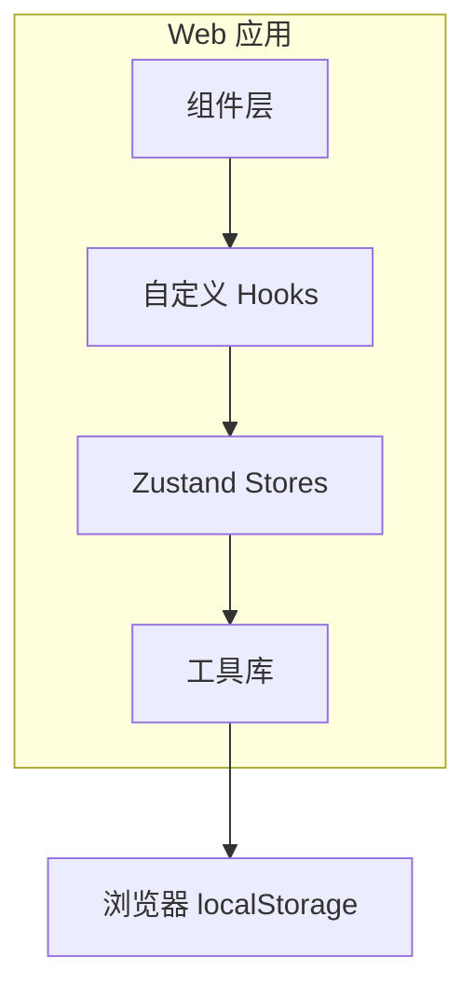
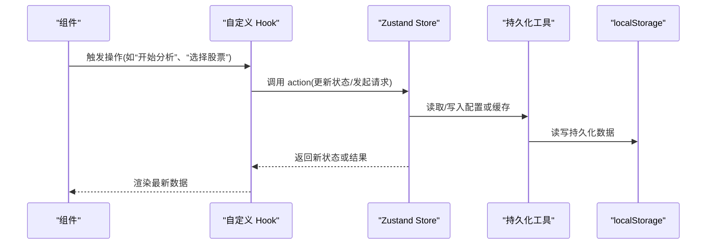
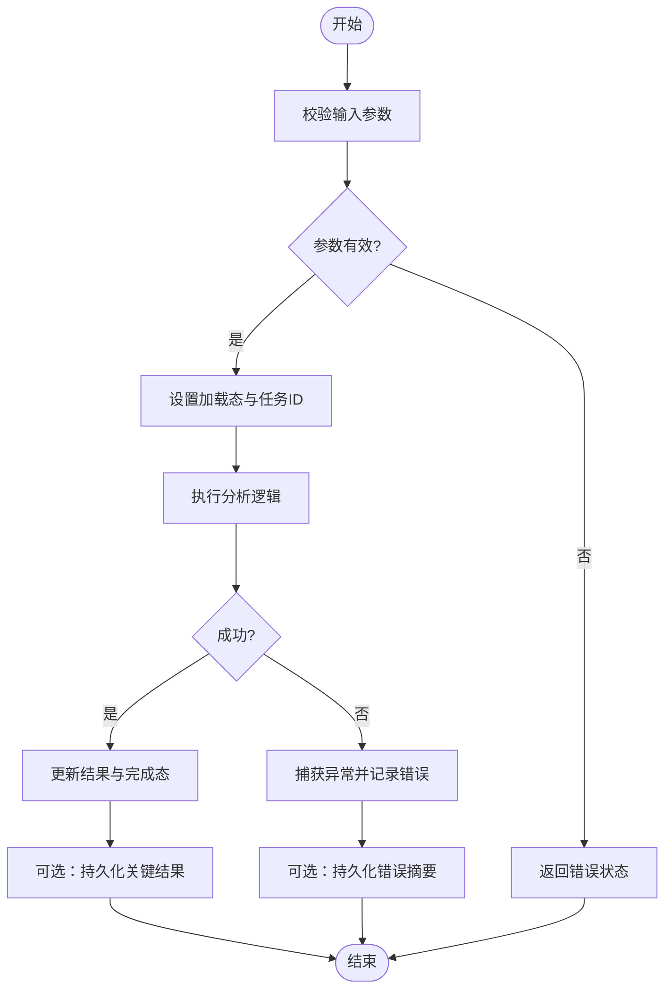
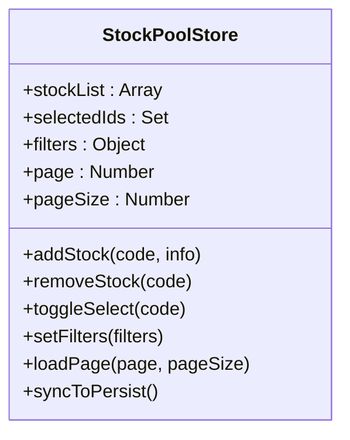
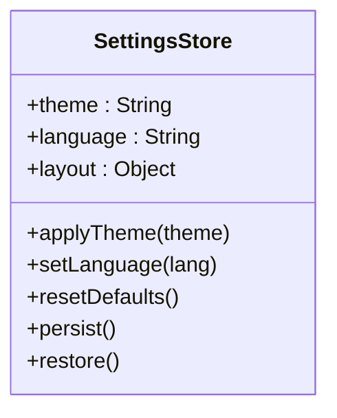
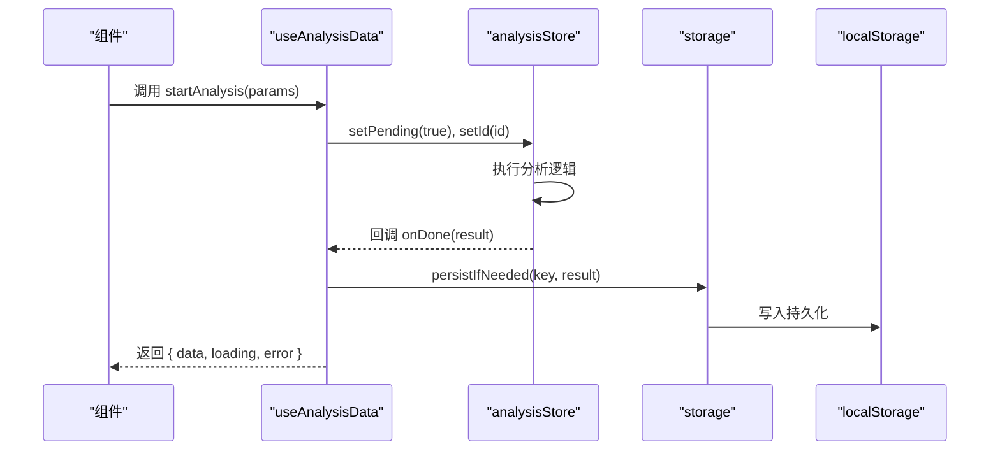
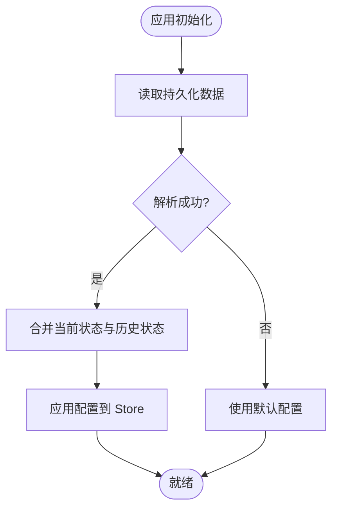
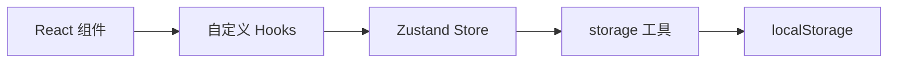

# 状态管理

<cite>
**本文引用的文件**   
- [apps/dsa-web/src/stores/index.ts](file://apps/dsa-web/src/stores/index.ts)
- [apps/dsa-web/src/stores/analysisStore.ts](file://apps/dsa-web/src/stores/analysisStore.ts)
- [apps/dsa-web/src/stocks/store.ts](file://apps/dsa-web/src/stocks/store.ts)
- [apps/dsa-web/src/hooks/useAnalysisData.ts](file://apps/dsa-web/src/hooks/useAnalysisData.ts)
- [apps/dsa-web/src/hooks/useStockList.ts](file://apps/dsa-web/src/hooks/useStockList.ts)
- [apps/dsa-web/src/utils/storage.ts](file://apps/dsa-web/src/utils/storage.ts)
- [apps/dsa-web/package.json](file://apps/dsa-web/package.json)
</cite>

## 目录
1. [简介](#简介)
2. [项目结构](#项目结构)
3. [核心组件](#核心组件)
4. [架构总览](#架构总览)
5. [详细组件分析](#详细组件分析)
6. [依赖分析](#依赖分析)
7. [性能考虑](#性能考虑)
8. [故障排查指南](#故障排查指南)
9. [结论](#结论)
10. [附录](#附录)

## 简介
本文件面向前端应用的状态管理，聚焦于 Zustand 的使用模式与最佳实践。内容涵盖：
- Store 设计与职责划分（分析状态、股票池状态、用户配置状态）
- 状态更新策略与副作用处理
- 自定义 Hook 设计模式（数据获取、状态同步、副作用）
- 持久化方案（localStorage 集成与状态恢复）
- 调试技巧（状态监控与性能分析）
- 设计原则与常见陷阱规避

## 项目结构
本项目的前端位于 apps/dsa-web，状态管理集中在 stores 目录，并通过 hooks 暴露给组件使用。关键路径如下：
- stores：Zustand store 定义与组合入口
- stocks：独立领域 store（如股票池）
- hooks：封装数据获取、状态订阅与副作用的自定义 Hook
- utils：通用工具（含存储与持久化）

[本节为概念性说明，不直接分析具体文件]

## 核心组件
- 分析状态 Store：负责分析任务生命周期、结果缓存、错误与加载态等
- 股票池 Store：维护选中的股票列表、搜索过滤、分页与本地偏好
- 用户配置 Store：保存主题、语言、显示设置等可持久化配置
- 自定义 Hooks：将 Store 能力封装为易用的 API，统一数据获取与副作用处理
- 持久化工具：提供读写 localStorage 的统一接口与序列化/反序列化逻辑

**章节来源**
- [apps/dsa-web/src/stores/index.ts](file://apps/dsa-web/src/stores/index.ts)
- [apps/dsa-web/src/stores/analysisStore.ts](file://apps/dsa-web/src/stores/analysisStore.ts)
- [apps/dsa-web/src/stocks/store.ts](file://apps/dsa-web/src/stocks/store.ts)
- [apps/dsa-web/src/hooks/useAnalysisData.ts](file://apps/dsa-web/src/hooks/useAnalysisData.ts)
- [apps/dsa-web/src/hooks/useStockList.ts](file://apps/dsa-web/src/hooks/useStockList.ts)
- [apps/dsa-web/src/utils/storage.ts](file://apps/dsa-web/src/utils/storage.ts)

## 架构总览
下图展示了从组件到 Store 再到持久化的调用链，以及自定义 Hook 在其中的协调作用。

**图示来源**
- [apps/dsa-web/src/stores/index.ts](file://apps/dsa-web/src/stores/index.ts)
- [apps/dsa-web/src/stores/analysisStore.ts](file://apps/dsa-web/src/stores/analysisStore.ts)
- [apps/dsa-web/src/stocks/store.ts](file://apps/dsa-web/src/stocks/store.ts)
- [apps/dsa-web/src/hooks/useAnalysisData.ts](file://apps/dsa-web/src/hooks/useAnalysisData.ts)
- [apps/dsa-web/src/hooks/useStockList.ts](file://apps/dsa-web/src/hooks/useStockList.ts)
- [apps/dsa-web/src/utils/storage.ts](file://apps/dsa-web/src/utils/storage.ts)

## 详细组件分析

### 分析状态 Store（analysisStore）
职责：
- 管理分析任务的生命周期（进行中、完成、失败）
- 缓存分析结果与中间状态
- 提供批量更新与撤销/重做扩展点

典型流程：
- 组件通过 Hook 调用“开始分析”
- Store 进入加载态并记录任务 ID
- 异步完成后更新结果与状态
- 可选地将关键指标写入持久化

**图示来源**
- [apps/dsa-web/src/stores/analysisStore.ts](file://apps/dsa-web/src/stores/analysisStore.ts)
- [apps/dsa-web/src/hooks/useAnalysisData.ts](file://apps/dsa-web/src/hooks/useAnalysisData.ts)

**章节来源**
- [apps/dsa-web/src/stores/analysisStore.ts](file://apps/dsa-web/src/stores/analysisStore.ts)
- [apps/dsa-web/src/hooks/useAnalysisData.ts](file://apps/dsa-web/src/hooks/useAnalysisData.ts)

### 股票池 Store（stocks/store）
职责：
- 维护股票列表、选中项、搜索过滤条件与分页
- 提供增删改查与批量操作
- 与本地偏好（如排序、列显隐）联动持久化

**图示来源**
- [apps/dsa-web/src/stocks/store.ts](file://apps/dsa-web/src/stocks/store.ts)

**章节来源**
- [apps/dsa-web/src/stocks/store.ts](file://apps/dsa-web/src/stocks/store.ts)
- [apps/dsa-web/src/hooks/useStockList.ts](file://apps/dsa-web/src/hooks/useStockList.ts)

### 用户配置 Store（示例：settingsStore）
职责：
- 管理主题、语言、界面布局等可持久化配置
- 提供默认值与迁移策略
- 支持热更新与即时生效

[本节为概念性说明，结合项目实际可在 stores 中新增对应模块]

### 自定义 Hook 设计模式
- useAnalysisData：封装分析数据的获取、缓存与重试；订阅 Store 变化并返回稳定引用
- useStockList：封装股票列表的增删改查、分页与过滤；合并本地偏好与远程数据

**图示来源**
- [apps/dsa-web/src/hooks/useAnalysisData.ts](file://apps/dsa-web/src/hooks/useAnalysisData.ts)
- [apps/dsa-web/src/stores/analysisStore.ts](file://apps/dsa-web/src/stores/analysisStore.ts)
- [apps/dsa-web/src/utils/storage.ts](file://apps/dsa-web/src/utils/storage.ts)

**章节来源**
- [apps/dsa-web/src/hooks/useAnalysisData.ts](file://apps/dsa-web/src/hooks/useAnalysisData.ts)
- [apps/dsa-web/src/hooks/useStockList.ts](file://apps/dsa-web/src/hooks/useStockList.ts)

### 持久化方案（localStorage 集成与状态恢复）
- storage 工具：统一 JSON 序列化/反序列化、错误边界与降级策略
- 恢复机制：应用启动时按 key 恢复必要状态（如主题、语言、最近分析摘要）
- 增量更新：仅持久化变更字段，避免全量覆盖

**图示来源**
- [apps/dsa-web/src/utils/storage.ts](file://apps/dsa-web/src/utils/storage.ts)

**章节来源**
- [apps/dsa-web/src/utils/storage.ts](file://apps/dsa-web/src/utils/storage.ts)

## 依赖分析
- 外部依赖：Zustand 作为轻量状态容器，配合 React 使用
- 内部耦合：Hook 对 Store 的访问采用最小订阅面，避免不必要的重渲染
- 持久化解耦：storage 工具屏蔽底层实现细节，便于替换为 IndexedDB 或后端同步

**图示来源**
- [apps/dsa-web/package.json](file://apps/dsa-web/package.json)
- [apps/dsa-web/src/stores/index.ts](file://apps/dsa-web/src/stores/index.ts)
- [apps/dsa-web/src/utils/storage.ts](file://apps/dsa-web/src/utils/storage.ts)

**章节来源**
- [apps/dsa-web/package.json](file://apps/dsa-web/package.json)
- [apps/dsa-web/src/stores/index.ts](file://apps/dsa-web/src/stores/index.ts)

## 性能考虑
- 细粒度订阅：仅在 Hook 中选择需要的字段，减少重渲染
- 批量更新：合并多次 setState 为一次更新，降低渲染次数
- 防抖与节流：对高频输入（搜索、滚动）进行节流/防抖
- 惰性加载：按需拉取数据，避免首屏过重
- 持久化限流：合并写入频率，避免频繁 I/O

[本节为通用指导，不直接分析具体文件]

## 故障排查指南
- 状态未更新
  - 检查是否选择了正确的子集字段进行订阅
  - 确认 action 是否被正确调用且无静默失败
- 持久化丢失
  - 验证 storage 工具的读写权限与序列化兼容性
  - 检查 key 命名冲突与版本迁移
- 性能回退
  - 使用 React DevTools Profiler 定位重渲染热点
  - 检查是否存在全局大对象订阅导致的全量更新

**章节来源**
- [apps/dsa-web/src/utils/storage.ts](file://apps/dsa-web/src/utils/storage.ts)
- [apps/dsa-web/src/stores/index.ts](file://apps/dsa-web/src/stores/index.ts)

## 结论
通过清晰的 Store 分层、稳定的 Hook 抽象与统一的持久化工具，本项目实现了可扩展、可维护且高性能的状态管理。建议持续遵循最小订阅面、批量更新与健壮的错误处理原则，并结合调试工具持续优化用户体验。

[本节为总结性内容，不直接分析具体文件]

## 附录
- 设计原则
  - 单一职责：每个 Store 只管理一个业务域
  - 不可变更新：以函数式思维更新状态，便于追踪与调试
  - 副作用外置：网络请求与 I/O 放在 Hook 或服务层
  - 可测试性：Store 与 Hook 均易于单元测试与集成测试
- 常见陷阱
  - 过度订阅：订阅整个 Store 导致不必要重渲染
  - 循环依赖：Store 之间互相引用造成初始化问题
  - 持久化不一致：不同键名或格式导致恢复失败
  - 忘记清理：异步任务未在卸载时取消，引发内存泄漏

[本节为通用指导，不直接分析具体文件]