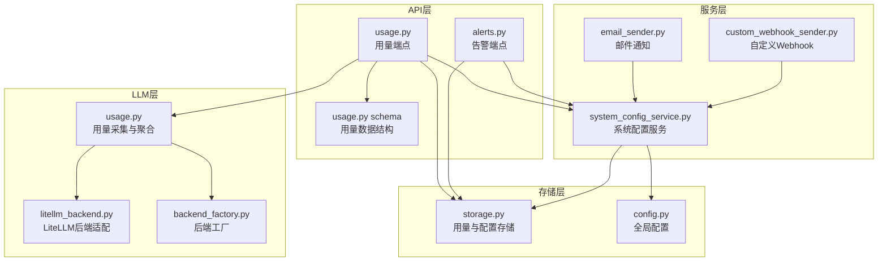
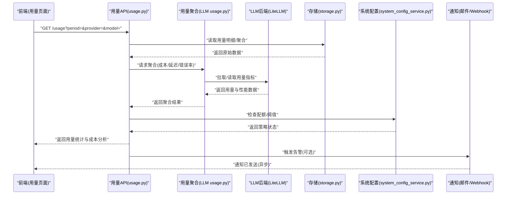
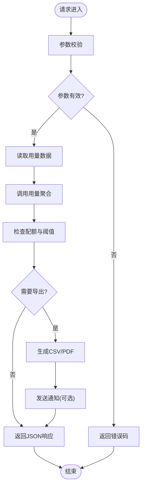
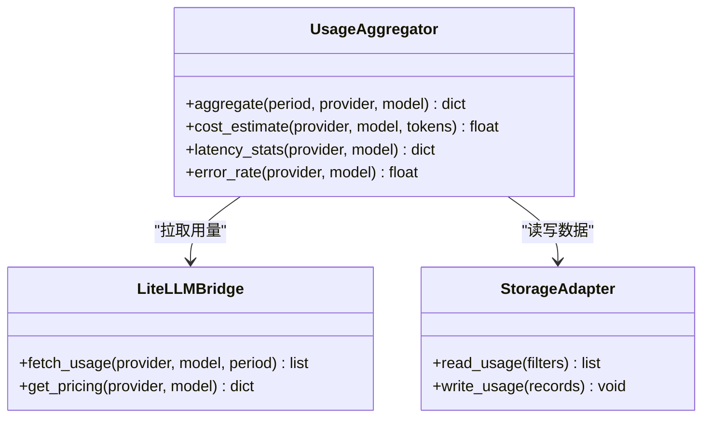
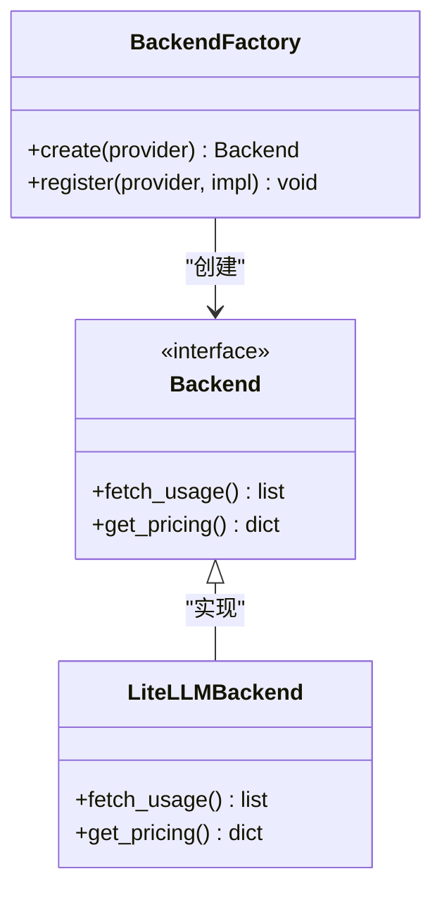
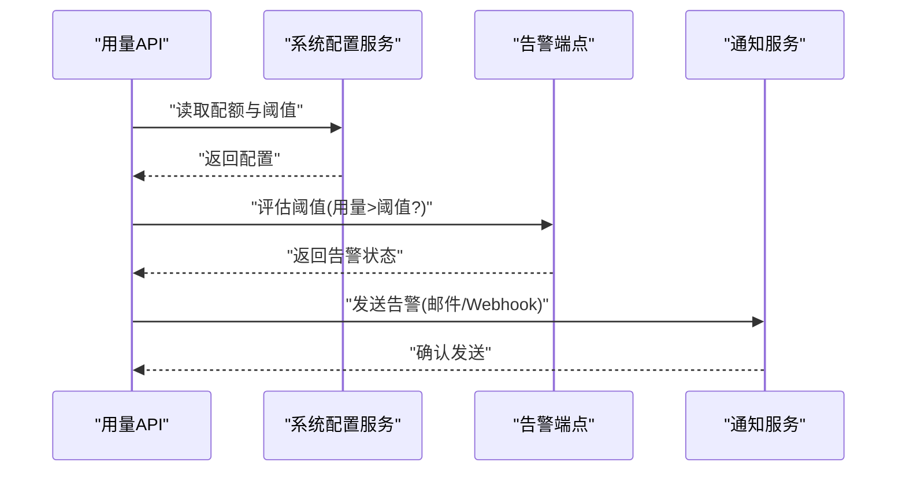
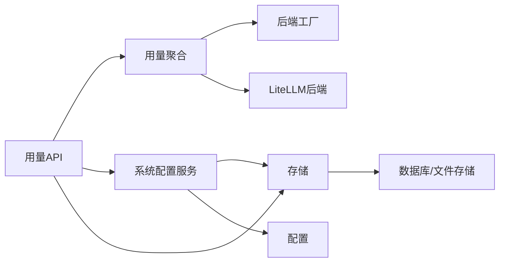

# Token使用页面

<cite>
**本文引用的文件**   
- [api/v1/endpoints/usage.py](file://api/v1/endpoints/usage.py)
- [api/v1/schemas/usage.py](file://api/v1/schemas/usage.py)
- [src/llm/usage.py](file://src/llm/usage.py)
- [src/llm/litellm_backend.py](file://src/llm/litellm_backend.py)
- [src/llm/backend_factory.py](file://src/llm/backend_factory.py)
- [src/services/system_config_service.py](file://src/services/system_config_service.py)
- [api/v1/endpoints/alerts.py](file://api/v1/endpoints/alerts.py)
- [src/notification_sender/email_sender.py](file://src/notification_sender/email_sender.py)
- [src/notification_sender/custom_webhook_sender.py](file://src/notification_sender/custom_webhook_sender.py)
- [src/storage.py](file://src/storage.py)
- [src/config.py](file://src/config.py)
- [tests/test_llm_usage.py](file://tests/test_llm_usage.py)
- [tests/test_usage_api.py](file://tests/test_usage_api.py)
</cite>

## 目录
1. [简介](#简介)
2. [项目结构](#项目结构)
3. [核心组件](#核心组件)
4. [架构总览](#架构总览)
5. [详细组件分析](#详细组件分析)
6. [依赖关系分析](#依赖关系分析)
7. [性能考量](#性能考量)
8. [故障排查指南](#故障排查指南)
9. [结论](#结论)
10. [附录](#附录)

## 简介
本文件面向“Token使用页面”的完整实现与使用，覆盖大语言模型Token消耗统计与监控、用量统计、成本分析与趋势预测、多提供商对比（价格、性能、质量）、用量限制管理（配额、告警阈值、自动暂停）、报告生成与导出（CSV、PDF、定时发送）、成本优化建议与使用模式分析，以及异常检测与故障排查工具。文档以代码级为依据，提供架构图、序列图、流程图和类图，帮助读者快速理解并落地使用。

## 项目结构
围绕Token使用页面的关键代码分布在以下模块：
- API层：暴露用量查询、配置与告警相关接口
- LLM层：采集与聚合各后端的Token用量、成本与性能指标
- 服务层：系统配置、告警策略、通知与报告导出
- 存储层：持久化用量数据与配置
- 测试层：对用量API与LLM用量采集进行验证

图表来源
- [api/v1/endpoints/usage.py](file://api/v1/endpoints/usage.py)
- [api/v1/schemas/usage.py](file://api/v1/schemas/usage.py)
- [api/v1/endpoints/alerts.py](file://api/v1/endpoints/alerts.py)
- [src/llm/usage.py](file://src/llm/usage.py)
- [src/llm/litellm_backend.py](file://src/llm/litellm_backend.py)
- [src/llm/backend_factory.py](file://src/llm/backend_factory.py)
- [src/services/system_config_service.py](file://src/services/system_config_service.py)
- [src/notification_sender/email_sender.py](file://src/notification_sender/email_sender.py)
- [src/notification_sender/custom_webhook_sender.py](file://src/notification_sender/custom_webhook_sender.py)
- [src/storage.py](file://src/storage.py)
- [src/config.py](file://src/config.py)

章节来源
- [api/v1/endpoints/usage.py](file://api/v1/endpoints/usage.py)
- [api/v1/schemas/usage.py](file://api/v1/schemas/usage.py)
- [src/llm/usage.py](file://src/llm/usage.py)
- [src/llm/litellm_backend.py](file://src/llm/litellm_backend.py)
- [src/llm/backend_factory.py](file://src/llm/backend_factory.py)
- [src/services/system_config_service.py](file://src/services/system_config_service.py)
- [src/notification_sender/email_sender.py](file://src/notification_sender/email_sender.py)
- [src/notification_sender/custom_webhook_sender.py](file://src/notification_sender/custom_webhook_sender.py)
- [src/storage.py](file://src/storage.py)
- [src/config.py](file://src/config.py)

## 核心组件
- 用量采集与聚合（LLM层）
  - 负责从各LLM后端（如LiteLLM）拉取或记录Token用量、延迟、错误率等指标，并进行聚合计算与成本估算。
- 用量API（API层）
  - 提供用量查询、过滤、汇总、导出等REST接口，供前端“Token使用页面”展示。
- 系统配置与告警（服务层）
  - 管理用量配额、告警阈值、自动暂停策略；支持通过邮件或自定义Webhook触发通知。
- 存储（存储层）
  - 持久化用量明细、聚合结果、配置项与告警事件。

章节来源
- [src/llm/usage.py](file://src/llm/usage.py)
- [api/v1/endpoints/usage.py](file://api/v1/endpoints/usage.py)
- [src/services/system_config_service.py](file://src/services/system_config_service.py)
- [src/storage.py](file://src/storage.py)

## 架构总览
下图展示了“Token使用页面”的数据流与控制流：前端通过用量API获取统计数据，后端调用LLM用量模块聚合各后端用量，结合系统配置进行配额校验与告警，最终将结果写入存储并通过通知渠道推送。

图表来源
- [api/v1/endpoints/usage.py](file://api/v1/endpoints/usage.py)
- [src/llm/usage.py](file://src/llm/usage.py)
- [src/llm/litellm_backend.py](file://src/llm/litellm_backend.py)
- [src/storage.py](file://src/storage.py)
- [src/services/system_config_service.py](file://src/services/system_config_service.py)
- [src/notification_sender/email_sender.py](file://src/notification_sender/email_sender.py)
- [src/notification_sender/custom_webhook_sender.py](file://src/notification_sender/custom_webhook_sender.py)

## 详细组件分析

### 用量API（usage.py）
- 功能要点
  - 提供按时间范围、提供商、模型维度查询用量与成本的接口
  - 支持导出CSV/PDF（通过服务层渲染与存储）
  - 支持定时任务触发报告生成与发送（通过通知服务）
- 关键流程
  - 参数校验与权限控制
  - 从存储层读取用量明细与聚合结果
  - 调用系统配置服务进行配额与阈值判断
  - 生成响应数据（含趋势、成本、质量指标）
  - 可选触发告警与通知

图表来源
- [api/v1/endpoints/usage.py](file://api/v1/endpoints/usage.py)
- [src/storage.py](file://src/storage.py)
- [src/services/system_config_service.py](file://src/services/system_config_service.py)

章节来源
- [api/v1/endpoints/usage.py](file://api/v1/endpoints/usage.py)
- [api/v1/schemas/usage.py](file://api/v1/schemas/usage.py)

### 用量聚合（LLM usage.py）
- 功能要点
  - 统一采集各LLM后端的Token用量、延迟、错误率等指标
  - 计算成本（基于模型定价与用量），输出趋势与对比
  - 支持提供商与模型维度的分组聚合
- 复杂度与优化
  - 聚合操作通常为O(n)扫描与分组，可通过缓存与增量更新优化
  - 批量读取存储与并行拉取后端数据以提升吞吐

图表来源
- [src/llm/usage.py](file://src/llm/usage.py)
- [src/llm/litellm_backend.py](file://src/llm/litellm_backend.py)
- [src/storage.py](file://src/storage.py)

章节来源
- [src/llm/usage.py](file://src/llm/usage.py)
- [src/llm/litellm_backend.py](file://src/llm/litellm_backend.py)

### 后端工厂与适配器（backend_factory.py, litellm_backend.py）
- 功能要点
  - 后端工厂根据配置动态选择LLM后端（如LiteLLM）
  - 适配器封装不同后端的用量接口与定价信息
- 设计模式
  - 工厂模式：统一创建与注册后端实例
  - 适配器模式：屏蔽不同后端差异，提供一致接口

图表来源
- [src/llm/backend_factory.py](file://src/llm/backend_factory.py)
- [src/llm/litellm_backend.py](file://src/llm/litellm_backend.py)

章节来源
- [src/llm/backend_factory.py](file://src/llm/backend_factory.py)
- [src/llm/litellm_backend.py](file://src/llm/litellm_backend.py)

### 系统配置与告警（system_config_service.py, alerts.py）
- 功能要点
  - 管理用量配额、告警阈值、自动暂停策略
  - 支持通过邮件或自定义Webhook发送告警通知
- 关键流程
  - 读取/更新配置
  - 评估当前用量是否超过阈值
  - 触发自动暂停或通知

图表来源
- [src/services/system_config_service.py](file://src/services/system_config_service.py)
- [api/v1/endpoints/alerts.py](file://api/v1/endpoints/alerts.py)
- [src/notification_sender/email_sender.py](file://src/notification_sender/email_sender.py)
- [src/notification_sender/custom_webhook_sender.py](file://src/notification_sender/custom_webhook_sender.py)

章节来源
- [src/services/system_config_service.py](file://src/services/system_config_service.py)
- [api/v1/endpoints/alerts.py](file://api/v1/endpoints/alerts.py)
- [src/notification_sender/email_sender.py](file://src/notification_sender/email_sender.py)
- [src/notification_sender/custom_webhook_sender.py](file://src/notification_sender/custom_webhook_sender.py)

### 存储与配置（storage.py, config.py）
- 功能要点
  - 用量明细、聚合结果、配置项与告警事件的持久化
  - 全局配置加载与热更新
- 关键点
  - 读写分离与事务保障（如需）
  - 配置项的默认值与校验

章节来源
- [src/storage.py](file://src/storage.py)
- [src/config.py](file://src/config.py)

## 依赖关系分析
用量页面涉及的模块耦合度较低，职责清晰：
- API层依赖LLM层与服务层，不直接访问存储细节
- LLM层通过后端工厂与适配器解耦具体后端实现
- 服务层集中管理配置与告警策略，便于扩展
- 存储层提供统一的读写接口

图表来源
- [api/v1/endpoints/usage.py](file://api/v1/endpoints/usage.py)
- [src/llm/usage.py](file://src/llm/usage.py)
- [src/llm/backend_factory.py](file://src/llm/backend_factory.py)
- [src/llm/litellm_backend.py](file://src/llm/litellm_backend.py)
- [src/services/system_config_service.py](file://src/services/system_config_service.py)
- [src/storage.py](file://src/storage.py)
- [src/config.py](file://src/config.py)

章节来源
- [api/v1/endpoints/usage.py](file://api/v1/endpoints/usage.py)
- [src/llm/usage.py](file://src/llm/usage.py)
- [src/llm/backend_factory.py](file://src/llm/backend_factory.py)
- [src/llm/litellm_backend.py](file://src/llm/litellm_backend.py)
- [src/services/system_config_service.py](file://src/services/system_config_service.py)
- [src/storage.py](file://src/storage.py)
- [src/config.py](file://src/config.py)

## 性能考量
- 聚合与查询
  - 对大量用量明细进行分组聚合时，建议使用索引与分页，避免全表扫描
  - 引入缓存层（内存或Redis）缓存热点聚合结果，降低重复计算
- 并发与批处理
  - 拉取多后端用量时采用并发请求，注意限流与重试
  - 批量写入存储，减少IO次数
- 成本估算
  - 模型定价变更需及时同步，避免成本偏差
  - 对高频调用模型进行用量采样与近似计算，平衡精度与性能

[本节为通用指导，无需引用具体文件]

## 故障排查指南
- 常见问题
  - 用量数据缺失：检查后端连接与拉取逻辑，确认存储写入成功
  - 成本计算异常：核对模型定价与用量单位换算
  - 告警未触发：检查阈值配置与评估逻辑
  - 通知失败：验证邮件/Webhook配置与网络连通性
- 诊断工具
  - 查看用量API日志与错误码
  - 检查系统配置服务的配置项与默认值
  - 使用测试用例定位问题（如用量API与LLM用量采集）

章节来源
- [tests/test_usage_api.py](file://tests/test_usage_api.py)
- [tests/test_llm_usage.py](file://tests/test_llm_usage.py)

## 结论
“Token使用页面”通过清晰的模块化设计与解耦的依赖关系，实现了用量统计、成本分析、趋势预测、多提供商对比、用量限制管理与报告导出等核心能力。配合告警与通知机制，能够有效管控成本与风险。建议在后续迭代中加强缓存与批处理能力，提升大规模场景下的性能与稳定性。

[本节为总结，无需引用具体文件]

## 附录
- 使用模式分析
  - 按提供商与模型维度分析用量峰值与低谷，识别优化空间
  - 对比不同提供商的价格与质量（延迟、错误率），制定切换策略
- 成本优化建议
  - 对高用量模型进行缓存与复用，减少重复调用
  - 合理设置配额与阈值，避免超额消费
  - 定期审查模型定价与用量结构，调整路由策略

[本节为概念性内容，无需引用具体文件]