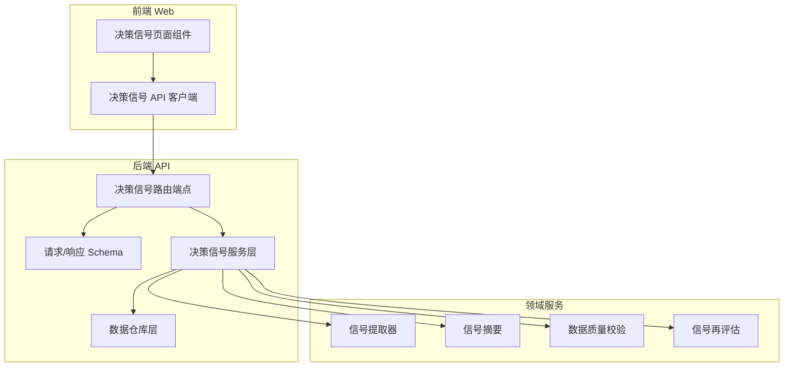
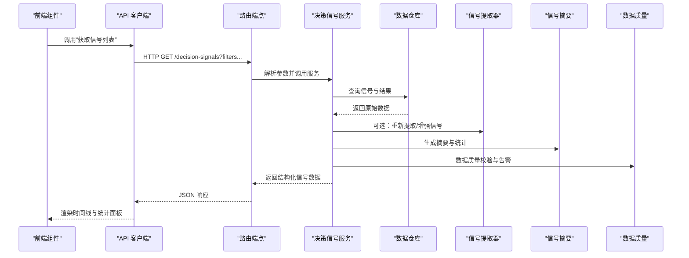
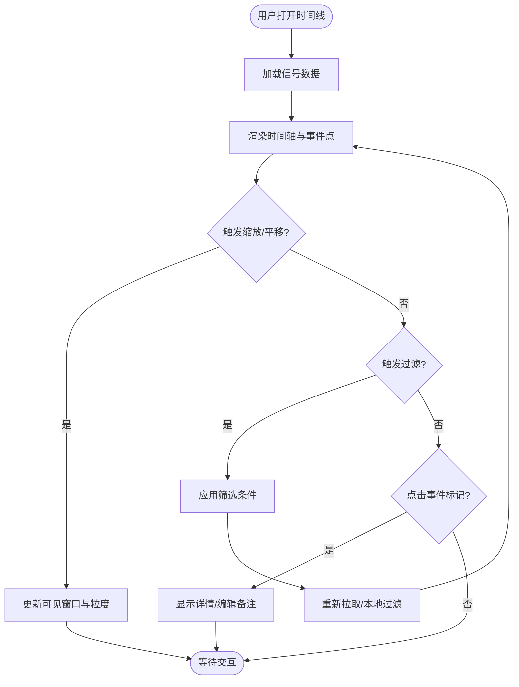
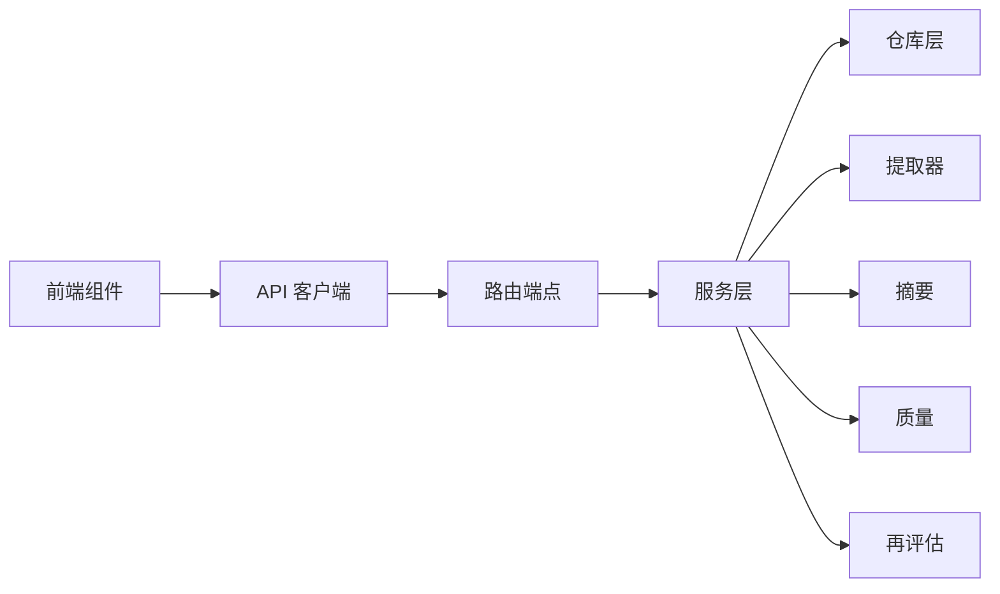

# 决策信号页面

<cite>
**本文引用的文件**   
- [api/v1/endpoints/decision_signals.py](file://api/v1/endpoints/decision_signals.py)
- [api/v1/schemas/decision_signals.py](file://api/v1/schemas/decision_signals.py)
- [src/services/decision_signal_service.py](file://src/services/decision_signal_service.py)
- [src/repositories/decision_signal_repo.py](file://src/repositories/decision_signal_repo.py)
- [src/repositories/decision_signal_outcome_repo.py](file://src/repositories/decision_signal_outcome_repo.py)
- [src/services/decision_signal_extractor.py](file://src/services/decision_signal_extractor.py)
- [src/services/decision_signal_summary.py](file://src/services/decision_signal_summary.py)
- [src/services/decision_signal_data_quality.py](file://src/services/decision_signal_data_quality.py)
- [src/services/decision_signal_reassess_service.py](file://src/services/decision_signal_reassess_service.py)
- [apps/dsa-web/src/api/decisionSignals.ts](file://apps/dsa-web/src/api/decisionSignals.ts)
- [apps/dsa-web/src/components/decision-signals/index.tsx](file://apps/dsa-web/src/components/decision-signals/index.tsx)
- [apps/dsa-web/src/components/decision-signals/SignalTimeline.tsx](file://apps/dsa-web/src/components/decision-signals/SignalTimeline.tsx)
- [apps/dsa-web/src/components/decision-signals/SignalFilters.tsx](file://apps/dsa-web/src/components/decision-signals/SignalFilters.tsx)
- [apps/dsa-web/src/components/decision-signals/SignalStats.tsx](file://apps/dsa-web/src/components/decision-signals/SignalStats.tsx)
- [apps/dsa-web/src/components/decision-signals/SignalExport.tsx](file://apps/dsa-web/src/components/decision-signals/SignalExport.tsx)
</cite>

## 目录
1. [简介](#简介)
2. [项目结构](#项目结构)
3. [核心组件](#核心组件)
4. [架构总览](#架构总览)
5. [详细组件分析](#详细组件分析)
6. [依赖关系分析](#依赖关系分析)
7. [性能考量](#性能考量)
8. [故障排查指南](#故障排查指南)
9. [结论](#结论)
10. [附录](#附录)

## 简介
本文件面向“决策信号页面”的完整实现，覆盖信号生成、分类与可视化展示；信号时间线的交互（缩放、过滤、事件标记）；信号评估机制（准确性统计、置信度评分、性能趋势）；信号校准（阈值调整、权重配置、自定义规则）；历史查询与回溯分析；以及导出与报告生成。文档以代码为依据，提供端到端的数据流、接口契约、前端交互与后端服务协作说明，帮助开发者与使用者快速理解并扩展该功能。

## 项目结构
决策信号相关能力横跨前后端：
- 前端（Web）：API 客户端封装、页面组件（概览、时间线、过滤器、统计、导出）。
- 后端（API）：路由端点、请求/响应 Schema、业务服务层、数据仓库层。
- 领域服务：信号提取、摘要、质量校验、再评估等。

图表来源
- [apps/dsa-web/src/components/decision-signals/index.tsx](file://apps/dsa-web/src/components/decision-signals/index.tsx)
- [apps/dsa-web/src/api/decisionSignals.ts](file://apps/dsa-web/src/api/decisionSignals.ts)
- [api/v1/endpoints/decision_signals.py](file://api/v1/endpoints/decision_signals.py)
- [api/v1/schemas/decision_signals.py](file://api/v1/schemas/decision_signals.py)
- [src/services/decision_signal_service.py](file://src/services/decision_signal_service.py)
- [src/repositories/decision_signal_repo.py](file://src/repositories/decision_signal_repo.py)
- [src/services/decision_signal_extractor.py](file://src/services/decision_signal_extractor.py)
- [src/services/decision_signal_summary.py](file://src/services/decision_signal_summary.py)
- [src/services/decision_signal_data_quality.py](file://src/services/decision_signal_data_quality.py)
- [src/services/decision_signal_reassess_service.py](file://src/services/decision_signal_reassess_service.py)

章节来源
- [api/v1/endpoints/decision_signals.py](file://api/v1/endpoints/decision_signals.py)
- [api/v1/schemas/decision_signals.py](file://api/v1/schemas/decision_signals.py)
- [apps/dsa-web/src/components/decision-signals/index.tsx](file://apps/dsa-web/src/components/decision-signals/index.tsx)
- [apps/dsa-web/src/api/decisionSignals.ts](file://apps/dsa-web/src/api/decisionSignals.ts)

## 核心组件
- 路由端点：暴露信号列表、详情、筛选、导出、评估与校准等接口。
- Schema：定义信号实体、筛选条件、评估结果、导出格式等数据结构。
- 服务层：聚合信号数据、计算统计指标、执行再评估、汇总摘要。
- 仓库层：持久化信号、信号结果、样本与权重等数据的读写。
- 领域服务：信号提取、质量校验、摘要生成、再评估策略。
- 前端组件：概览面板、时间线交互、过滤器、统计面板、导出工具。

章节来源
- [api/v1/endpoints/decision_signals.py](file://api/v1/endpoints/decision_signals.py)
- [api/v1/schemas/decision_signals.py](file://api/v1/schemas/decision_signals.py)
- [src/services/decision_signal_service.py](file://src/services/decision_signal_service.py)
- [src/repositories/decision_signal_repo.py](file://src/repositories/decision_signal_repo.py)
- [src/services/decision_signal_extractor.py](file://src/services/decision_signal_extractor.py)
- [src/services/decision_signal_summary.py](file://src/services/decision_signal_summary.py)
- [src/services/decision_signal_data_quality.py](file://src/services/decision_signal_data_quality.py)
- [src/services/decision_signal_reassess_service.py](file://src/services/decision_signal_reassess_service.py)
- [apps/dsa-web/src/components/decision-signals/index.tsx](file://apps/dsa-web/src/components/decision-signals/index.tsx)

## 架构总览
以下序列图展示了从前端发起“获取信号列表并渲染时间线”的典型流程，包括筛选、统计与导出入口。

图表来源
- [api/v1/endpoints/decision_signals.py](file://api/v1/endpoints/decision_signals.py)
- [src/services/decision_signal_service.py](file://src/services/decision_signal_service.py)
- [src/repositories/decision_signal_repo.py](file://src/repositories/decision_signal_repo.py)
- [src/services/decision_signal_extractor.py](file://src/services/decision_signal_extractor.py)
- [src/services/decision_signal_summary.py](file://src/services/decision_signal_summary.py)
- [src/services/decision_signal_data_quality.py](file://src/services/decision_signal_data_quality.py)
- [apps/dsa-web/src/api/decisionSignals.ts](file://apps/dsa-web/src/api/decisionSignals.ts)
- [apps/dsa-web/src/components/decision-signals/index.tsx](file://apps/dsa-web/src/components/decision-signals/index.tsx)

## 详细组件分析

### 路由端点与 Schema
- 路由端点负责接收前端请求，校验参数，调用服务层，返回统一响应。
- Schema 定义了信号实体字段、筛选条件、评估结果、导出选项等，确保前后端契约一致。

关键职责
- 参数校验与分页、排序、过滤。
- 错误码与异常处理。
- 导出接口（CSV/JSON/PDF）与权限控制。

章节来源
- [api/v1/endpoints/decision_signals.py](file://api/v1/endpoints/decision_signals.py)
- [api/v1/schemas/decision_signals.py](file://api/v1/schemas/decision_signals.py)

### 服务层：决策信号服务
- 聚合信号数据，组合仓库查询结果，计算准确性、置信度、趋势等指标。
- 协调提取器、摘要、质量校验与再评估服务，形成统一的信号视图。

典型流程
- 读取筛选条件（时间范围、标的、类型、状态）。
- 调用仓库获取基础数据。
- 调用摘要服务生成统计与趋势。
- 调用质量服务进行数据完整性检查。
- 输出标准化信号对象给端点。

章节来源
- [src/services/decision_signal_service.py](file://src/services/decision_signal_service.py)

### 仓库层：信号与结果存储
- 信号仓库：增删改查信号记录、标签、元数据。
- 结果仓库：关联信号的结果、评估、回测对比、样本标注。

设计要点
- 支持按时间、标的、类型、状态等多维查询。
- 批量写入与事务保障。
- 索引优化以提升时间线加载速度。

章节来源
- [src/repositories/decision_signal_repo.py](file://src/repositories/decision_signal_repo.py)
- [src/repositories/decision_signal_outcome_repo.py](file://src/repositories/decision_signal_outcome_repo.py)

### 领域服务：提取、摘要、质量、再评估
- 信号提取器：从市场数据、策略输出或外部源提取信号，并进行初步分类。
- 信号摘要：汇总统计（数量、分布、准确率、置信度、趋势）。
- 数据质量：缺失值、异常值、一致性检查，生成质量报告。
- 再评估服务：基于新数据或规则变更对历史信号进行重算与对比。

章节来源
- [src/services/decision_signal_extractor.py](file://src/services/decision_signal_extractor.py)
- [src/services/decision_signal_summary.py](file://src/services/decision_signal_summary.py)
- [src/services/decision_signal_data_quality.py](file://src/services/decision_signal_data_quality.py)
- [src/services/decision_signal_reassess_service.py](file://src/services/decision_signal_reassess_service.py)

### 前端组件：时间线、过滤器、统计、导出
- 概览页：聚合关键指标与快捷操作入口。
- 时间线：支持缩放、平移、过滤、事件标记与详情弹窗。
- 过滤器：按时间、标的、类型、状态、置信度区间等维度筛选。
- 统计面板：准确性、置信度、趋势图与对比。
- 导出工具：选择字段、格式、范围，生成下载文件。

交互流程（时间线）

章节来源
- [apps/dsa-web/src/components/decision-signals/index.tsx](file://apps/dsa-web/src/components/decision-signals/index.tsx)
- [apps/dsa-web/src/components/decision-signals/SignalTimeline.tsx](file://apps/dsa-web/src/components/decision-signals/SignalTimeline.tsx)
- [apps/dsa-web/src/components/decision-signals/SignalFilters.tsx](file://apps/dsa-web/src/components/decision-signals/SignalFilters.tsx)
- [apps/dsa-web/src/components/decision-signals/SignalStats.tsx](file://apps/dsa-web/src/components/decision-signals/SignalStats.tsx)
- [apps/dsa-web/src/components/decision-signals/SignalExport.tsx](file://apps/dsa-web/src/components/decision-signals/SignalExport.tsx)
- [apps/dsa-web/src/api/decisionSignals.ts](file://apps/dsa-web/src/api/decisionSignals.ts)

## 依赖关系分析
- 前端依赖 API 客户端，通过 TypeScript 函数封装请求与响应类型。
- 后端路由依赖服务层，服务层依赖仓库与领域服务。
- Schema 作为契约贯穿前后端，保证数据结构一致性。

图表来源
- [apps/dsa-web/src/components/decision-signals/index.tsx](file://apps/dsa-web/src/components/decision-signals/index.tsx)
- [apps/dsa-web/src/api/decisionSignals.ts](file://apps/dsa-web/src/api/decisionSignals.ts)
- [api/v1/endpoints/decision_signals.py](file://api/v1/endpoints/decision_signals.py)
- [src/services/decision_signal_service.py](file://src/services/decision_signal_service.py)
- [src/repositories/decision_signal_repo.py](file://src/repositories/decision_signal_repo.py)
- [src/services/decision_signal_extractor.py](file://src/services/decision_signal_extractor.py)
- [src/services/decision_signal_summary.py](file://src/services/decision_signal_summary.py)
- [src/services/decision_signal_data_quality.py](file://src/services/decision_signal_data_quality.py)
- [src/services/decision_signal_reassess_service.py](file://src/services/decision_signal_reassess_service.py)

章节来源
- [api/v1/endpoints/decision_signals.py](file://api/v1/endpoints/decision_signals.py)
- [apps/dsa-web/src/api/decisionSignals.ts](file://apps/dsa-web/src/api/decisionSignals.ts)

## 性能考量
- 时间线大数据量渲染：采用分页、虚拟滚动、按需加载与增量更新。
- 查询优化：为时间戳、标的、类型、状态建立复合索引；避免全表扫描。
- 缓存策略：对热点统计与摘要进行短期缓存，降低重复计算。
- 导出性能：异步任务与分块生成，避免阻塞主线程。
- 前端交互：节流/防抖缩放与过滤，减少频繁请求。

[本节为通用指导，不直接分析具体文件]

## 故障排查指南
常见问题与定位步骤
- 信号列表为空或延迟高
  - 检查仓库查询条件与索引是否命中。
  - 查看服务层日志与领域服务耗时。
- 时间线卡顿或渲染失败
  - 确认前端数据量与虚拟化配置。
  - 检查事件标记与详情弹窗逻辑。
- 导出失败或内容不完整
  - 验证导出参数与权限。
  - 检查异步任务队列与重试机制。
- 评估指标不准确
  - 核对质量校验结果与数据完整性。
  - 检查再评估规则与权重配置。

章节来源
- [src/services/decision_signal_data_quality.py](file://src/services/decision_signal_data_quality.py)
- [src/services/decision_signal_reassess_service.py](file://src/services/decision_signal_reassess_service.py)
- [apps/dsa-web/src/components/decision-signals/SignalTimeline.tsx](file://apps/dsa-web/src/components/decision-signals/SignalTimeline.tsx)
- [apps/dsa-web/src/components/decision-signals/SignalExport.tsx](file://apps/dsa-web/src/components/decision-signals/SignalExport.tsx)

## 结论
决策信号页面通过清晰的前后端分层与领域服务解耦，实现了信号的生成、分类、可视化、评估与校准的全链路能力。时间线交互、过滤器与统计面板提升了用户体验；导出与报告生成功能满足分析与归档需求。建议在后续迭代中持续优化查询性能、增强可观测性与完善错误恢复机制。

[本节为总结性内容，不直接分析具体文件]

## 附录
- 术语说明
  - 信号：由策略或模型输出的交易建议或市场观点。
  - 置信度：信号的可信程度评分，通常基于历史表现与数据质量。
  - 准确性：信号预测与实际结果的匹配度统计。
  - 趋势：信号表现随时间的变化趋势。
- 最佳实践
  - 使用一致的筛选条件与分页策略。
  - 在导出前进行数据预览与校验。
  - 定期校准阈值与权重，保持评估体系稳定。

[本节为概念性内容，不直接分析具体文件]