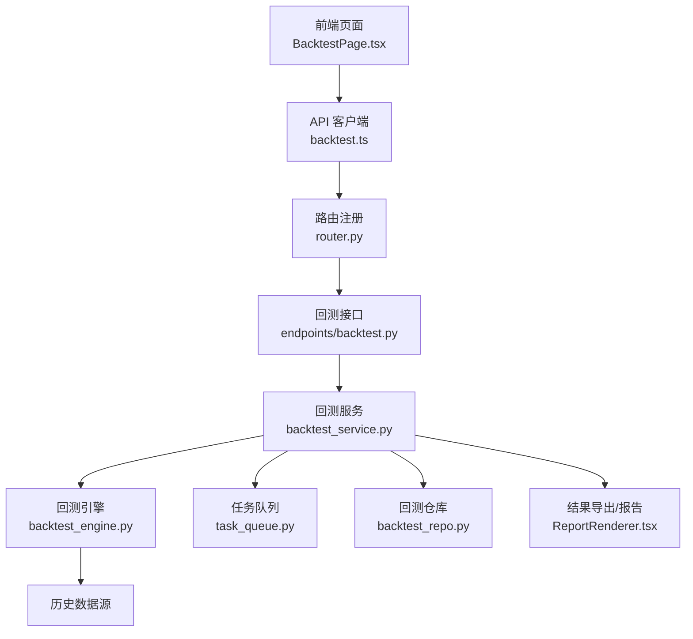
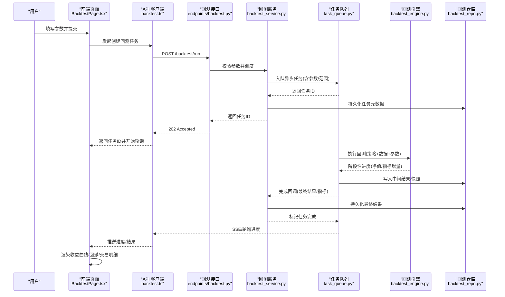
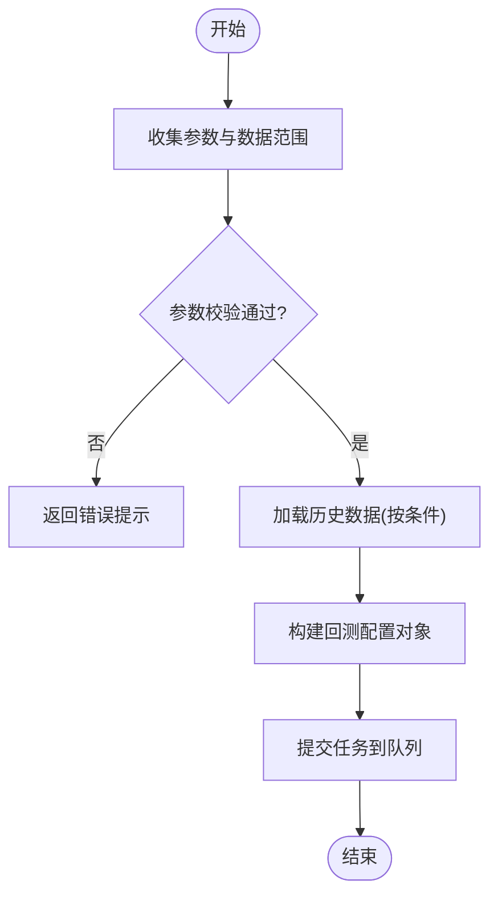
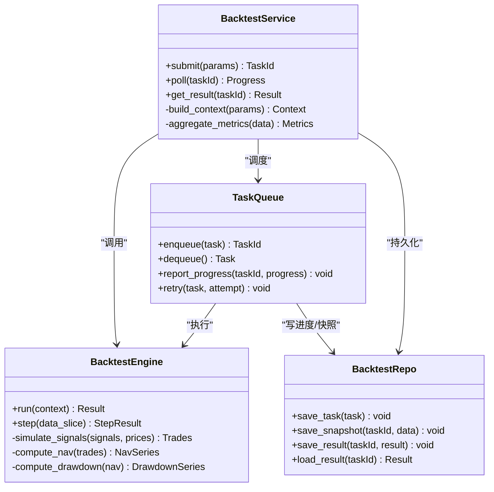
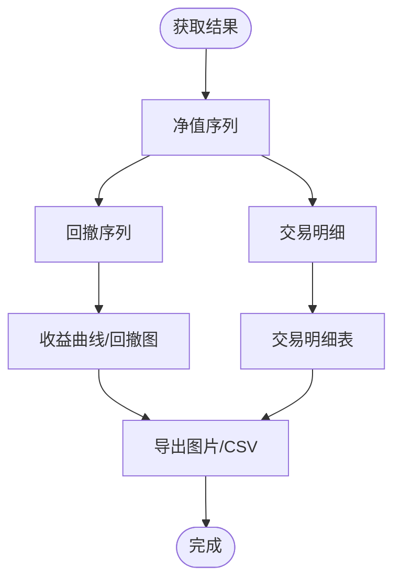
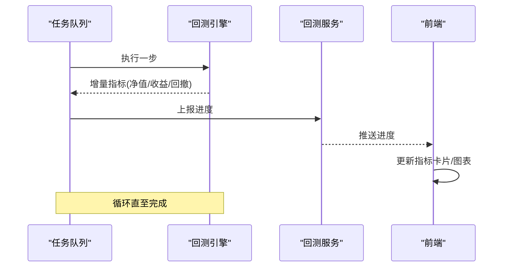
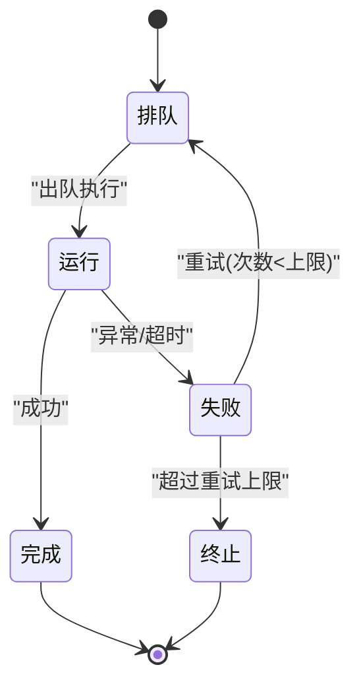
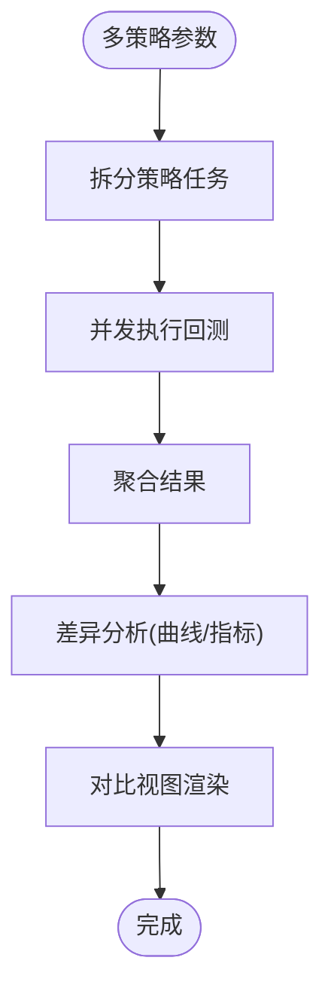
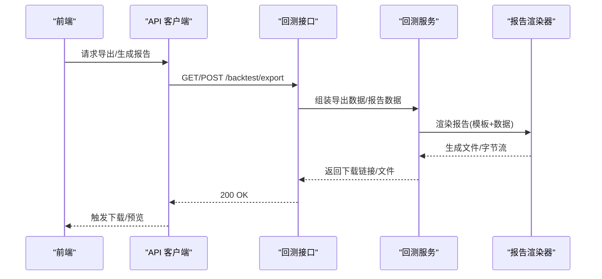
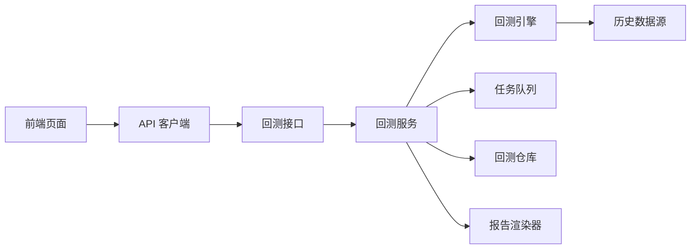

# 回测页面

<cite>
**本文引用的文件**   
- [api/v1/endpoints/backtest.py](file://api/v1/endpoints/backtest.py)
- [api/v1/schemas/backtest.py](file://api/v1/schemas/backtest.py)
- [src/core/backtest_engine.py](file://src/core/backtest_engine.py)
- [src/services/backtest_service.py](file://src/services/backtest_service.py)
- [src/services/task_queue.py](file://src/services/task_queue.py)
- [src/repositories/backtest_repo.py](file://src/repositories/backtest_repo.py)
- [api/v1/router.py](file://api/v1/router.py)
- [apps/dsa-web/src/api/backtest.ts](file://apps/dsa-web/src/api/backtest.ts)
- [apps/dsa-web/src/pages/BacktestPage.tsx](file://apps/dsa-web/src/pages/BacktestPage.tsx)
- [apps/dsa-web/src/components/report/ReportRenderer.tsx](file://apps/dsa-web/src/components/report/ReportRenderer.tsx)
</cite>

## 目录
1. [简介](#简介)
2. [项目结构](#项目结构)
3. [核心组件](#核心组件)
4. [架构总览](#架构总览)
5. [详细组件分析](#详细组件分析)
6. [依赖关系分析](#依赖关系分析)
7. [性能考量](#性能考量)
8. [故障排查指南](#故障排查指南)
9. [结论](#结论)
10. [附录](#附录)

## 简介
本文件面向“回测页面”的完整实现，覆盖策略回测的参数配置、历史数据选择、回测引擎调用、结果可视化（收益曲线、回撤分析、交易明细）、性能指标实时计算与更新（夏普比率、最大回撤、胜率统计）、异步任务处理（队列、进度跟踪、错误重试）、多策略并行回测与差异对比，以及回测数据的导出与报告生成。文档以代码级为依据，提供架构图、时序图与流程图，帮助读者快速理解端到端流程并高效排障。

## 项目结构
围绕回测功能的关键路径包括：
- 前端 API 客户端与页面：负责参数收集、任务提交、进度轮询、结果渲染与导出。
- 后端路由与接口：接收请求、校验参数、调度服务层。
- 服务层与引擎：封装回测执行逻辑、指标计算、持久化与任务编排。
- 存储层：回测任务与结果的持久化。
- 任务队列：异步执行、进度上报与重试机制。

**图表来源** 
- [api/v1/router.py](file://api/v1/router.py)
- [api/v1/endpoints/backtest.py](file://api/v1/endpoints/backtest.py)
- [src/services/backtest_service.py](file://src/services/backtest_service.py)
- [src/core/backtest_engine.py](file://src/core/backtest_engine.py)
- [src/services/task_queue.py](file://src/services/task_queue.py)
- [src/repositories/backtest_repo.py](file://src/repositories/backtest_repo.py)
- [apps/dsa-web/src/api/backtest.ts](file://apps/dsa-web/src/api/backtest.ts)
- [apps/dsa-web/src/pages/BacktestPage.tsx](file://apps/dsa-web/src/pages/BacktestPage.tsx)
- [apps/dsa-web/src/components/report/ReportRenderer.tsx](file://apps/dsa-web/src/components/report/ReportRenderer.tsx)

**章节来源**
- [api/v1/router.py](file://api/v1/router.py)
- [api/v1/endpoints/backtest.py](file://api/v1/endpoints/backtest.py)
- [src/services/backtest_service.py](file://src/services/backtest_service.py)
- [src/core/backtest_engine.py](file://src/core/backtest_engine.py)
- [src/services/task_queue.py](file://src/services/task_queue.py)
- [src/repositories/backtest_repo.py](file://src/repositories/backtest_repo.py)
- [apps/dsa-web/src/api/backtest.ts](file://apps/dsa-web/src/api/backtest.ts)
- [apps/dsa-web/src/pages/BacktestPage.tsx](file://apps/dsa-web/src/pages/BacktestPage.tsx)
- [apps/dsa-web/src/components/report/ReportRenderer.tsx](file://apps/dsa-web/src/components/report/ReportRenderer.tsx)

## 核心组件
- 回测接口层：定义请求/响应模型、参数校验、权限与错误处理。
- 回测服务层：编排回测任务、管理并发、聚合指标、持久化结果。
- 回测引擎：执行策略信号、撮合模拟、净值与回撤计算、交易明细生成。
- 任务队列：异步执行、进度推送、失败重试与超时控制。
- 存储仓库：回测任务元数据、结果快照、交易明细与指标摘要。
- 前端页面：表单配置、任务提交、进度跟踪、图表渲染、导出与对比。

**章节来源**
- [api/v1/schemas/backtest.py](file://api/v1/schemas/backtest.py)
- [api/v1/endpoints/backtest.py](file://api/v1/endpoints/backtest.py)
- [src/services/backtest_service.py](file://src/services/backtest_service.py)
- [src/core/backtest_engine.py](file://src/core/backtest_engine.py)
- [src/services/task_queue.py](file://src/services/task_queue.py)
- [src/repositories/backtest_repo.py](file://src/repositories/backtest_repo.py)
- [apps/dsa-web/src/api/backtest.ts](file://apps/dsa-web/src/api/backtest.ts)
- [apps/dsa-web/src/pages/BacktestPage.tsx](file://apps/dsa-web/src/pages/BacktestPage.tsx)

## 架构总览
下图展示从前端到后端的端到端调用链路与数据流。

**图表来源** 
- [api/v1/endpoints/backtest.py](file://api/v1/endpoints/backtest.py)
- [src/services/backtest_service.py](file://src/services/backtest_service.py)
- [src/services/task_queue.py](file://src/services/task_queue.py)
- [src/core/backtest_engine.py](file://src/core/backtest_engine.py)
- [src/repositories/backtest_repo.py](file://src/repositories/backtest_repo.py)
- [apps/dsa-web/src/api/backtest.ts](file://apps/dsa-web/src/api/backtest.ts)
- [apps/dsa-web/src/pages/BacktestPage.tsx](file://apps/dsa-web/src/pages/BacktestPage.tsx)

## 详细组件分析

### 参数配置与历史数据选择
- 参数模型：在 schemas 中定义回测所需字段，如策略标识、时间窗口、初始资金、手续费、滑点、仓位规则等。
- 历史数据选择：支持按股票代码、起止日期、复权方式、频率等维度筛选；服务层负责数据加载与缓存策略。
- 前端表单：提供下拉、日期区间、数值输入等控件，并在提交前进行本地校验。

**图表来源** 
- [api/v1/schemas/backtest.py](file://api/v1/schemas/backtest.py)
- [src/services/backtest_service.py](file://src/services/backtest_service.py)
- [apps/dsa-web/src/pages/BacktestPage.tsx](file://apps/dsa-web/src/pages/BacktestPage.tsx)

**章节来源**
- [api/v1/schemas/backtest.py](file://api/v1/schemas/backtest.py)
- [src/services/backtest_service.py](file://src/services/backtest_service.py)
- [apps/dsa-web/src/pages/BacktestPage.tsx](file://apps/dsa-web/src/pages/BacktestPage.tsx)

### 回测引擎调用与执行流程
- 引擎职责：根据策略信号与历史数据执行撮合，计算每日净值、累计收益、回撤、交易明细等。
- 服务编排：将参数转换为引擎可执行的上下文，分片或批处理数据，聚合阶段结果，最终落库。
- 进度上报：引擎在执行过程中定期上报进度，便于前端实时更新。

**图表来源** 
- [src/services/backtest_service.py](file://src/services/backtest_service.py)
- [src/core/backtest_engine.py](file://src/core/backtest_engine.py)
- [src/services/task_queue.py](file://src/services/task_queue.py)
- [src/repositories/backtest_repo.py](file://src/repositories/backtest_repo.py)

**章节来源**
- [src/services/backtest_service.py](file://src/services/backtest_service.py)
- [src/core/backtest_engine.py](file://src/core/backtest_engine.py)
- [src/services/task_queue.py](file://src/services/task_queue.py)
- [src/repositories/backtest_repo.py](file://src/repositories/backtest_repo.py)

### 结果可视化：收益曲线、回撤分析与交易明细
- 收益曲线：基于每日净值序列绘制累计收益与基准对比。
- 回撤分析：基于净值序列计算峰值回撤、最大回撤区间与恢复时间。
- 交易明细：逐笔记录入场/出场、盈亏、手续费与滑点影响。
- 前端渲染：使用图表组件渲染曲线与表格，支持缩放、筛选与导出。

**图表来源** 
- [src/core/backtest_engine.py](file://src/core/backtest_engine.py)
- [apps/dsa-web/src/pages/BacktestPage.tsx](file://apps/dsa-web/src/pages/BacktestPage.tsx)

**章节来源**
- [src/core/backtest_engine.py](file://src/core/backtest_engine.py)
- [apps/dsa-web/src/pages/BacktestPage.tsx](file://apps/dsa-web/src/pages/BacktestPage.tsx)

### 性能指标的实时计算与更新
- 指标项：年化收益、夏普比率、最大回撤、胜率、盈亏比、换手率、波动率等。
- 计算时机：引擎每步计算增量指标，队列阶段汇总；完成后输出最终指标。
- 实时更新：通过轮询或事件推送，前端逐步刷新指标卡片与图表。

**图表来源** 
- [src/services/task_queue.py](file://src/services/task_queue.py)
- [src/core/backtest_engine.py](file://src/core/backtest_engine.py)
- [src/services/backtest_service.py](file://src/services/backtest_service.py)
- [apps/dsa-web/src/api/backtest.ts](file://apps/dsa-web/src/api/backtest.ts)

**章节来源**
- [src/services/task_queue.py](file://src/services/task_queue.py)
- [src/core/backtest_engine.py](file://src/core/backtest_engine.py)
- [src/services/backtest_service.py](file://src/services/backtest_service.py)
- [apps/dsa-web/src/api/backtest.ts](file://apps/dsa-web/src/api/backtest.ts)

### 异步任务处理：队列、进度跟踪与错误重试
- 任务队列：支持并发执行、优先级、超时与限流。
- 进度跟踪：阶段状态（排队/运行/完成/失败）与百分比、当前步骤、错误信息。
- 错误重试：对网络异常、数据缺失等场景进行指数退避重试，记录日志与告警。

**图表来源** 
- [src/services/task_queue.py](file://src/services/task_queue.py)
- [src/services/backtest_service.py](file://src/services/backtest_service.py)

**章节来源**
- [src/services/task_queue.py](file://src/services/task_queue.py)
- [src/services/backtest_service.py](file://src/services/backtest_service.py)

### 多策略并行回测与差异对比
- 并行策略：同一请求支持传入多个策略配置，服务层并发调度，统一聚合结果。
- 差异分析：对比不同策略的收益曲线、回撤、指标差异，生成对比视图与报告。
- 前端展示：并列图表、差异热力图、排序与筛选。

**图表来源** 
- [src/services/backtest_service.py](file://src/services/backtest_service.py)
- [apps/dsa-web/src/pages/BacktestPage.tsx](file://apps/dsa-web/src/pages/BacktestPage.tsx)

**章节来源**
- [src/services/backtest_service.py](file://src/services/backtest_service.py)
- [apps/dsa-web/src/pages/BacktestPage.tsx](file://apps/dsa-web/src/pages/BacktestPage.tsx)

### 数据导出与报告生成
- 导出格式：CSV、Excel、PDF、Markdown 等。
- 报告内容：策略概述、关键指标、收益曲线、回撤图、交易明细、风险提示。
- 渲染器：模板化报告生成，支持主题与语言切换。

**图表来源** 
- [api/v1/endpoints/backtest.py](file://api/v1/endpoints/backtest.py)
- [src/services/backtest_service.py](file://src/services/backtest_service.py)
- [apps/dsa-web/src/components/report/ReportRenderer.tsx](file://apps/dsa-web/src/components/report/ReportRenderer.tsx)

**章节来源**
- [api/v1/endpoints/backtest.py](file://api/v1/endpoints/backtest.py)
- [src/services/backtest_service.py](file://src/services/backtest_service.py)
- [apps/dsa-web/src/components/report/ReportRenderer.tsx](file://apps/dsa-web/src/components/report/ReportRenderer.tsx)

## 依赖关系分析
- 前端依赖：API 客户端封装、图表库、表格组件、导出工具。
- 后端依赖：FastAPI 路由、Pydantic 模型、任务队列框架、数据库/文件系统、数据源适配器。
- 模块耦合：服务层作为中枢，解耦接口与引擎；队列与仓库抽象执行与持久化细节。

**图表来源** 
- [api/v1/router.py](file://api/v1/router.py)
- [api/v1/endpoints/backtest.py](file://api/v1/endpoints/backtest.py)
- [src/services/backtest_service.py](file://src/services/backtest_service.py)
- [src/core/backtest_engine.py](file://src/core/backtest_engine.py)
- [src/services/task_queue.py](file://src/services/task_queue.py)
- [src/repositories/backtest_repo.py](file://src/repositories/backtest_repo.py)
- [apps/dsa-web/src/api/backtest.ts](file://apps/dsa-web/src/api/backtest.ts)
- [apps/dsa-web/src/pages/BacktestPage.tsx](file://apps/dsa-web/src/pages/BacktestPage.tsx)
- [apps/dsa-web/src/components/report/ReportRenderer.tsx](file://apps/dsa-web/src/components/report/ReportRenderer.tsx)

**章节来源**
- [api/v1/router.py](file://api/v1/router.py)
- [api/v1/endpoints/backtest.py](file://api/v1/endpoints/backtest.py)
- [src/services/backtest_service.py](file://src/services/backtest_service.py)
- [src/core/backtest_engine.py](file://src/core/backtest_engine.py)
- [src/services/task_queue.py](file://src/services/task_queue.py)
- [src/repositories/backtest_repo.py](file://src/repositories/backtest_repo.py)
- [apps/dsa-web/src/api/backtest.ts](file://apps/dsa-web/src/api/backtest.ts)
- [apps/dsa-web/src/pages/BacktestPage.tsx](file://apps/dsa-web/src/pages/BacktestPage.tsx)
- [apps/dsa-web/src/components/report/ReportRenderer.tsx](file://apps/dsa-web/src/components/report/ReportRenderer.tsx)

## 性能考量
- 数据读取：批量拉取、分页与缓存，避免重复 IO。
- 引擎计算：向量化计算、增量更新、内存池复用。
- 并发控制：限制同时运行的回测任务数，防止资源争用。
- 指标计算：滑动窗口与近似算法降低复杂度。
- 前端渲染：虚拟列表、按需加载、图表采样降采样。

[本节为通用指导，不直接分析具体文件]

## 故障排查指南
- 常见错误：
  - 参数校验失败：检查必填字段、数据类型、取值范围。
  - 数据缺失：确认股票代码、时间范围、复权方式是否匹配。
  - 任务失败：查看队列日志、重试次数、超时设置。
  - 指标异常：核对计算公式、基准选择、手续费/滑点设置。
- 定位方法：
  - 查看任务状态与进度快照。
  - 检查引擎日志与中间结果。
  - 验证数据源连通性与质量。
  - 前端网络请求与响应体。

**章节来源**
- [src/services/task_queue.py](file://src/services/task_queue.py)
- [src/repositories/backtest_repo.py](file://src/repositories/backtest_repo.py)
- [apps/dsa-web/src/api/backtest.ts](file://apps/dsa-web/src/api/backtest.ts)

## 结论
回测页面实现了从参数配置、数据选择、引擎执行、指标计算、结果可视化到导出报告的完整闭环。通过服务层与任务队列的解耦设计，系统具备良好的可扩展性与稳定性。建议在生产环境中加强监控与告警，优化数据与计算性能，完善错误恢复与审计能力。

[本节为总结性内容，不直接分析具体文件]

## 附录
- 术语说明：夏普比率、最大回撤、胜率、盈亏比、净值、回撤区间等。
- 最佳实践：合理设置时间窗口与频率、谨慎选择基准、关注过拟合风险。
- 扩展方向：因子回测、组合回测、实盘仿真对接。

[本节为概念性内容，不直接分析具体文件]