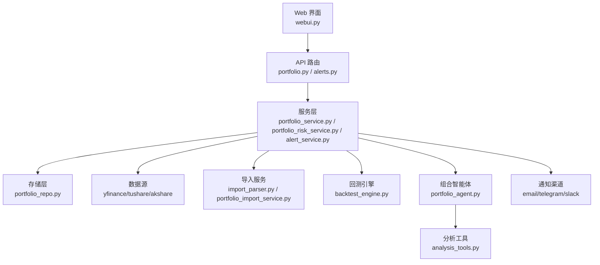
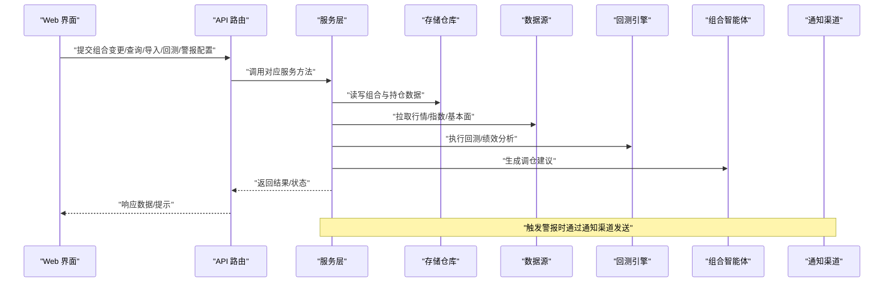
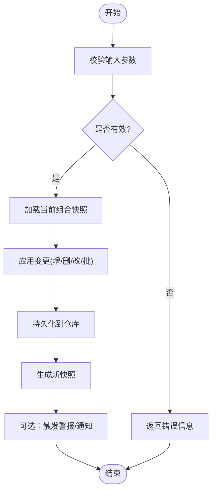
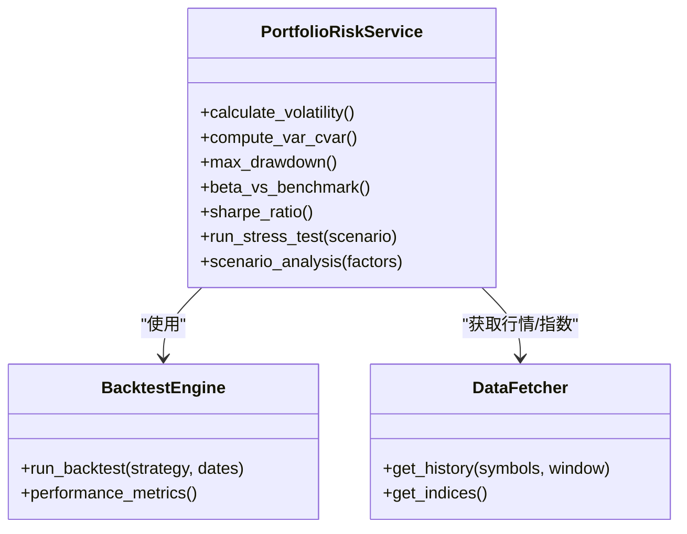
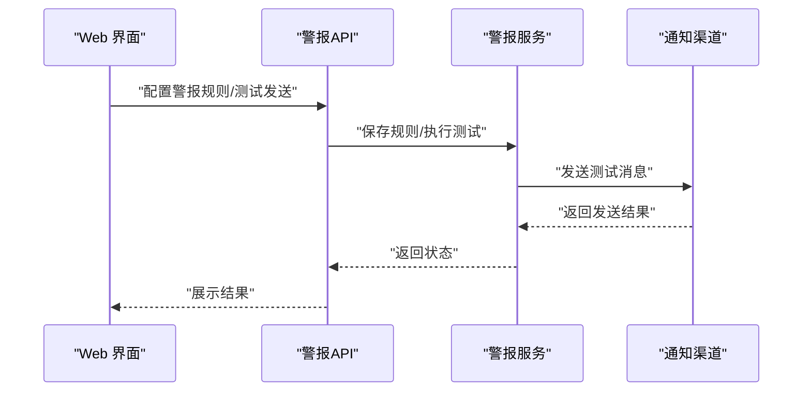
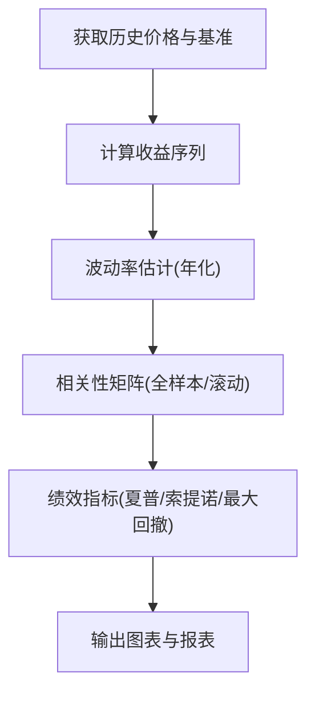
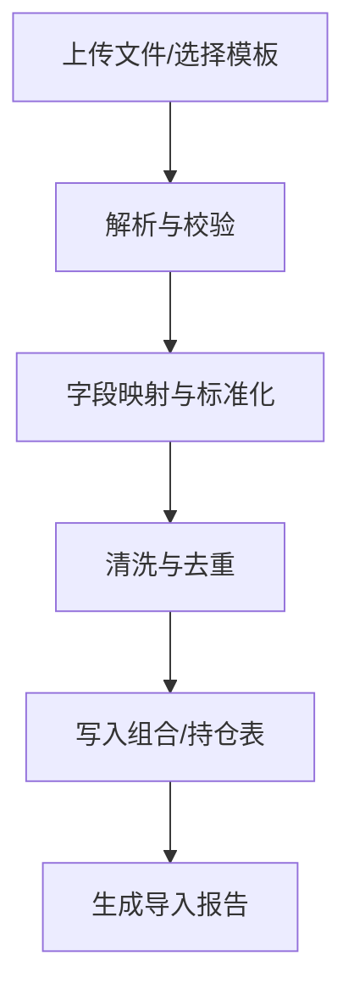
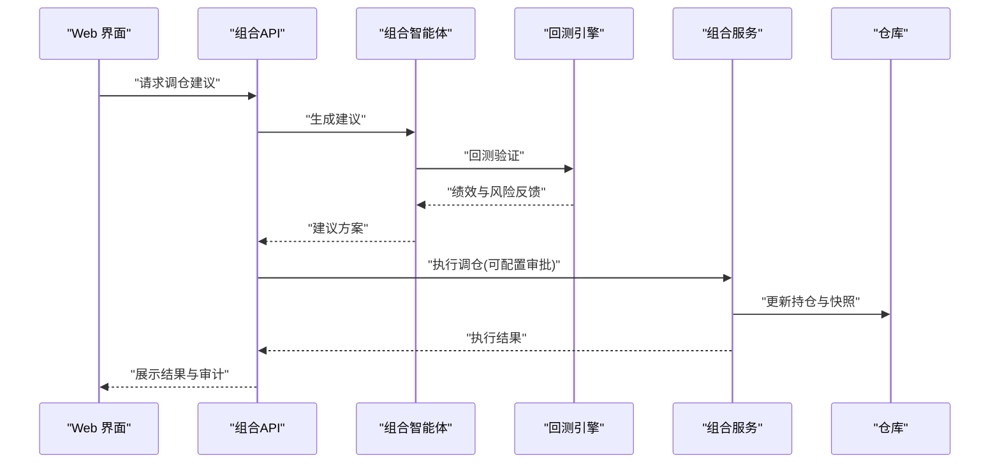
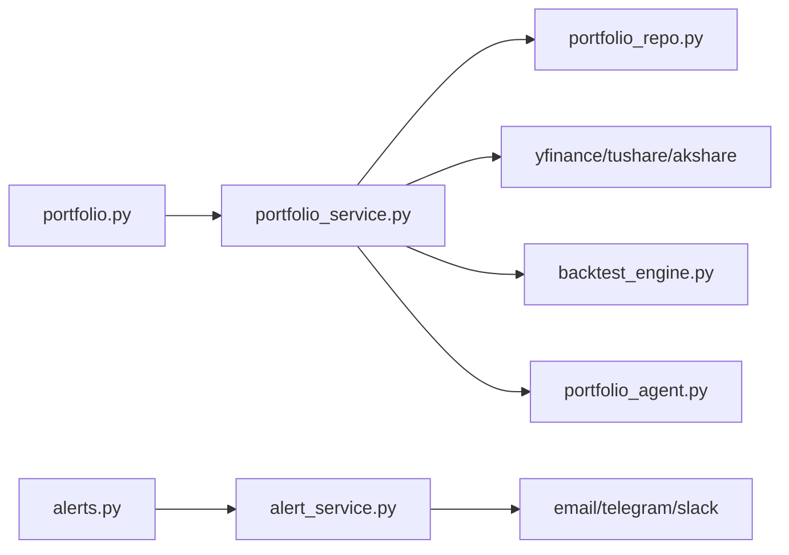

# 投资组合页面

<cite>
**本文引用的文件**   
- [api/v1/endpoints/portfolio.py](file://api/v1/endpoints/portfolio.py)
- [api/v1/schemas/portfolio.py](file://api/v1/schemas/portfolio.py)
- [src/services/portfolio_service.py](file://src/services/portfolio_service.py)
- [src/services/portfolio_risk_service.py](file://src/services/portfolio_risk_service.py)
- [src/services/portfolio_alerts.py](file://src/services/portfolio_alerts.py)
- [src/repositories/portfolio_repo.py](file://src/repositories/portfolio_repo.py)
- [api/v1/endpoints/alerts.py](file://api/v1/endpoints/alerts.py)
- [api/v1/schemas/alerts.py](file://api/v1/schemas/alerts.py)
- [src/services/alert_service.py](file://src/services/alert_service.py)
- [src/notification_sender/email_sender.py](file://src/notification_sender/email_sender.py)
- [src/notification_sender/telegram_sender.py](file://src/notification_sender/telegram_sender.py)
- [src/notification_sender/slack_sender.py](file://src/notification_sender/slack_sender.py)
- [src/services/import_parser.py](file://src/services/import_parser.py)
- [src/services/portfolio_import_service.py](file://src/services/portfolio_import_service.py)
- [src/agent/agents/portfolio_agent.py](file://src/agent/agents/portfolio_agent.py)
- [src/agent/tools/analysis_tools.py](file://src/agent/tools/analysis_tools.py)
- [src/core/backtest_engine.py](file://src/core/backtest_engine.py)
- [src/data/stock_index_loader.py](file://src/data/stock_index_loader.py)
- [data_provider/yfinance_fetcher.py](file://data_provider/yfinance_fetcher.py)
- [data_provider/tushare_fetcher.py](file://data_provider/tushare_fetcher.py)
- [data_provider/akshare_fetcher.py](file://data_provider/akshare_fetcher.py)
- [webui.py](file://webui.py)
</cite>

## 目录
1. [简介](#简介)
2. [项目结构](#项目结构)
3. [核心组件](#核心组件)
4. [架构总览](#架构总览)
5. [详细组件分析](#详细组件分析)
6. [依赖关系分析](#依赖关系分析)
7. [性能考量](#性能考量)
8. [故障排查指南](#故障排查指南)
9. [结论](#结论)
10. [附录](#附录)

## 简介
本文件面向“投资组合页面”的功能与实现，覆盖以下关键能力：
- 持仓管理：添加、删除、编辑与批量操作
- 风险评估：风险指标计算、压力测试与情景分析
- 警报系统：条件配置、通知渠道选择与测试发送
- 性能分析：收益统计、波动率分析与相关性矩阵
- 数据导入导出：多格式支持与第三方平台集成
- Rebalancing（调仓）建议与自动化调仓

该文档以代码为依据，提供从前端到后端、从服务到存储的端到端说明，并辅以架构图与时序图帮助理解。

## 项目结构
围绕投资组合页面的相关模块主要分布在如下位置：
- API 层：路由与请求校验
  - 组合接口：api/v1/endpoints/portfolio.py
  - 警报接口：api/v1/endpoints/alerts.py
  - 数据模型：api/v1/schemas/portfolio.py、api/v1/schemas/alerts.py
- 服务层：业务逻辑与编排
  - 组合服务：src/services/portfolio_service.py
  - 风险服务：src/services/portfolio_risk_service.py
  - 警报服务：src/services/alert_service.py、src/services/portfolio_alerts.py
  - 导入服务：src/services/import_parser.py、src/services/portfolio_import_service.py
  - 回测引擎：src/core/backtest_engine.py
- 存储层：持久化
  - 组合仓库：src/repositories/portfolio_repo.py
- 数据源与外部集成
  - 行情数据：data_provider/*fetcher.py
  - 指数映射：src/data/stock_index_loader.py
- Agent 与工具
  - 组合智能体：src/agent/agents/portfolio_agent.py
  - 分析工具：src/agent/tools/analysis_tools.py
- Web 入口
  - webui.py

图表来源
- [webui.py](file://webui.py)
- [api/v1/endpoints/portfolio.py](file://api/v1/endpoints/portfolio.py)
- [api/v1/endpoints/alerts.py](file://api/v1/endpoints/alerts.py)
- [src/services/portfolio_service.py](file://src/services/portfolio_service.py)
- [src/services/portfolio_risk_service.py](file://src/services/portfolio_risk_service.py)
- [src/services/alert_service.py](file://src/services/alert_service.py)
- [src/repositories/portfolio_repo.py](file://src/repositories/portfolio_repo.py)
- [data_provider/yfinance_fetcher.py](file://data_provider/yfinance_fetcher.py)
- [data_provider/tushare_fetcher.py](file://data_provider/tushare_fetcher.py)
- [data_provider/akshare_fetcher.py](file://data_provider/akshare_fetcher.py)
- [src/core/backtest_engine.py](file://src/core/backtest_engine.py)
- [src/agent/agents/portfolio_agent.py](file://src/agent/agents/portfolio_agent.py)
- [src/agent/tools/analysis_tools.py](file://src/agent/tools/analysis_tools.py)

章节来源
- [api/v1/endpoints/portfolio.py](file://api/v1/endpoints/portfolio.py)
- [api/v1/endpoints/alerts.py](file://api/v1/endpoints/alerts.py)
- [src/services/portfolio_service.py](file://src/services/portfolio_service.py)
- [src/services/portfolio_risk_service.py](file://src/services/portfolio_risk_service.py)
- [src/services/alert_service.py](file://src/services/alert_service.py)
- [src/repositories/portfolio_repo.py](file://src/repositories/portfolio_repo.py)
- [src/services/import_parser.py](file://src/services/import_parser.py)
- [src/services/portfolio_import_service.py](file://src/services/portfolio_import_service.py)
- [src/core/backtest_engine.py](file://src/core/backtest_engine.py)
- [src/agent/agents/portfolio_agent.py](file://src/agent/agents/portfolio_agent.py)
- [src/agent/tools/analysis_tools.py](file://src/agent/tools/analysis_tools.py)
- [data_provider/yfinance_fetcher.py](file://data_provider/yfinance_fetcher.py)
- [data_provider/tushare_fetcher.py](file://data_provider/tushare_fetcher.py)
- [data_provider/akshare_fetcher.py](file://data_provider/akshare_fetcher.py)
- [webui.py](file://webui.py)

## 核心组件
- 组合管理服务（Portfolio Service）
  - 职责：持仓增删改查、批量操作、快照生成、与风险/警报/导入/回测等服务的协作
  - 关键点：事务性更新、幂等性设计、并发安全
- 风险评估服务（Portfolio Risk Service）
  - 职责：计算 VaR、CVaR、最大回撤、波动率、Beta、夏普比率等；执行压力测试与情景分析
- 警报服务（Alert Service & Portfolio Alerts）
  - 职责：规则解析、阈值判断、事件触发、多渠道通知与测试发送
- 导入服务（Import Parser & Portfolio Import Service）
  - 职责：CSV/Excel/JSON 等多格式解析、字段映射、去重与校验
- 回测引擎（Backtest Engine）
  - 职责：历史数据回放、策略执行、绩效归因、对比基准
- 组合智能体（Portfolio Agent）
  - 职责：基于分析工具与外部数据生成调仓建议、解释与可执行计划
- 存储仓库（Portfolio Repo）
  - 职责：组合与持仓数据的持久化、查询与版本控制

章节来源
- [src/services/portfolio_service.py](file://src/services/portfolio_service.py)
- [src/services/portfolio_risk_service.py](file://src/services/portfolio_risk_service.py)
- [src/services/alert_service.py](file://src/services/alert_service.py)
- [src/services/portfolio_alerts.py](file://src/services/portfolio_alerts.py)
- [src/services/import_parser.py](file://src/services/import_parser.py)
- [src/services/portfolio_import_service.py](file://src/services/portfolio_import_service.py)
- [src/core/backtest_engine.py](file://src/core/backtest_engine.py)
- [src/agent/agents/portfolio_agent.py](file://src/agent/agents/portfolio_agent.py)
- [src/repositories/portfolio_repo.py](file://src/repositories/portfolio_repo.py)

## 架构总览
下图展示了从 Web 界面到 API、服务层、存储与外部数据源的调用链路，以及警报与回测的交互。

图表来源
- [api/v1/endpoints/portfolio.py](file://api/v1/endpoints/portfolio.py)
- [api/v1/endpoints/alerts.py](file://api/v1/endpoints/alerts.py)
- [src/services/portfolio_service.py](file://src/services/portfolio_service.py)
- [src/services/portfolio_risk_service.py](file://src/services/portfolio_risk_service.py)
- [src/services/alert_service.py](file://src/services/alert_service.py)
- [src/repositories/portfolio_repo.py](file://src/repositories/portfolio_repo.py)
- [src/core/backtest_engine.py](file://src/core/backtest_engine.py)
- [src/agent/agents/portfolio_agent.py](file://src/agent/agents/portfolio_agent.py)
- [data_provider/yfinance_fetcher.py](file://data_provider/yfinance_fetcher.py)
- [data_provider/tushare_fetcher.py](file://data_provider/tushare_fetcher.py)
- [data_provider/akshare_fetcher.py](file://data_provider/akshare_fetcher.py)

## 详细组件分析

### 组合管理（持仓增删改与批量操作）
- 功能要点
  - 新增持仓：支持单只或多只标的一次性添加，含权重或金额分配
  - 删除持仓：按标的或批次删除，支持软删除与审计日志
  - 编辑持仓：调整权重/金额、成本价、备注等元信息
  - 批量操作：批量导入、批量修改、批量删除
  - 快照与版本：每次变更生成快照，便于回溯与对比
- 数据流
  - 前端表单/批量上传 -> API 校验 -> 服务层组装 -> 仓库持久化 -> 返回结果
- 并发与一致性
  - 使用事务保证原子性；对重复添加进行幂等处理；冲突检测与合并策略

图表来源
- [api/v1/endpoints/portfolio.py](file://api/v1/endpoints/portfolio.py)
- [src/services/portfolio_service.py](file://src/services/portfolio_service.py)
- [src/repositories/portfolio_repo.py](file://src/repositories/portfolio_repo.py)

章节来源
- [api/v1/endpoints/portfolio.py](file://api/v1/endpoints/portfolio.py)
- [src/services/portfolio_service.py](file://src/services/portfolio_service.py)
- [src/repositories/portfolio_repo.py](file://src/repositories/portfolio_repo.py)

### 风险评估（指标、压力测试与情景分析）
- 指标计算
  - 波动率、VaR/CVaR、最大回撤、Beta、夏普/索提诺比率、行业/风格暴露
- 压力测试
  - 市场暴跌、利率上行、汇率冲击、流动性枯竭等场景模拟
- 情景分析
  - 自定义因子变动（如估值压缩、盈利下修）对组合的影响评估
- 数据依赖
  - 历史价格序列、无风险利率、指数基准、因子库

图表来源
- [src/services/portfolio_risk_service.py](file://src/services/portfolio_risk_service.py)
- [src/core/backtest_engine.py](file://src/core/backtest_engine.py)
- [data_provider/yfinance_fetcher.py](file://data_provider/yfinance_fetcher.py)
- [data_provider/tushare_fetcher.py](file://data_provider/tushare_fetcher.py)
- [data_provider/akshare_fetcher.py](file://data_provider/akshare_fetcher.py)

章节来源
- [src/services/portfolio_risk_service.py](file://src/services/portfolio_risk_service.py)
- [src/core/backtest_engine.py](file://src/core/backtest_engine.py)
- [data_provider/yfinance_fetcher.py](file://data_provider/yfinance_fetcher.py)
- [data_provider/tushare_fetcher.py](file://data_provider/tushare_fetcher.py)
- [data_provider/akshare_fetcher.py](file://data_provider/akshare_fetcher.py)

### 警报系统（条件设置、通知渠道与测试）
- 条件设置
  - 支持按标的、行业、组合整体维度设置阈值（价格、涨跌幅、波动率、VaR、回撤等）
  - 支持时间窗口与频率限制，避免告警风暴
- 通知渠道
  - 邮件、Telegram、Slack 等，支持模板与变量替换
- 测试功能
  - 一键发送测试消息，验证通道连通性与模板渲染
- 触发流程
  - 定时/事件驱动 -> 规则匹配 -> 聚合去重 -> 发送通知

图表来源
- [api/v1/endpoints/alerts.py](file://api/v1/endpoints/alerts.py)
- [api/v1/schemas/alerts.py](file://api/v1/schemas/alerts.py)
- [src/services/alert_service.py](file://src/services/alert_service.py)
- [src/notification_sender/email_sender.py](file://src/notification_sender/email_sender.py)
- [src/notification_sender/telegram_sender.py](file://src/notification_sender/telegram_sender.py)
- [src/notification_sender/slack_sender.py](file://src/notification_sender/slack_sender.py)

章节来源
- [api/v1/endpoints/alerts.py](file://api/v1/endpoints/alerts.py)
- [api/v1/schemas/alerts.py](file://api/v1/schemas/alerts.py)
- [src/services/alert_service.py](file://src/services/alert_service.py)
- [src/notification_sender/email_sender.py](file://src/notification_sender/email_sender.py)
- [src/notification_sender/telegram_sender.py](file://src/notification_sender/telegram_sender.py)
- [src/notification_sender/slack_sender.py](file://src/notification_sender/slack_sender.py)

### 性能分析（收益统计、波动率与相关性矩阵）
- 收益统计
  - 日/周/月/年收益率、累计收益、超额收益、跟踪误差
- 波动率分析
  - 历史波动率、隐含波动率（若可用）、波动率期限结构
- 相关性矩阵
  - 标的间相关系数、滚动相关性、聚类分析
- 可视化与导出
  - 图表渲染、CSV/Excel 导出、PDF 报告

图表来源
- [src/services/portfolio_risk_service.py](file://src/services/portfolio_risk_service.py)
- [src/core/backtest_engine.py](file://src/core/backtest_engine.py)
- [src/agent/tools/analysis_tools.py](file://src/agent/tools/analysis_tools.py)

章节来源
- [src/services/portfolio_risk_service.py](file://src/services/portfolio_risk_service.py)
- [src/core/backtest_engine.py](file://src/core/backtest_engine.py)
- [src/agent/tools/analysis_tools.py](file://src/agent/tools/analysis_tools.py)

### 数据导入导出（多格式与第三方集成）
- 导入
  - 支持 CSV、Excel、JSON；字段映射、去重、校验与错误定位
  - 第三方平台对接（如券商/经纪商导出格式适配）
- 导出
  - 组合快照、交易流水、风险报告、绩效报表
- 数据质量
  - 缺失值处理、异常值检测、单位与币种统一

图表来源
- [src/services/import_parser.py](file://src/services/import_parser.py)
- [src/services/portfolio_import_service.py](file://src/services/portfolio_import_service.py)

章节来源
- [src/services/import_parser.py](file://src/services/import_parser.py)
- [src/services/portfolio_import_service.py](file://src/services/portfolio_import_service.py)

### Rebalancing 建议与自动化调仓
- 建议生成
  - 基于风险目标、约束（行业/风格/个股权重上限）、交易成本与流动性
  - 结合智能体与回测引擎给出可执行方案
- 自动化调仓
  - 定时任务触发、审批工作流、执行回滚与审计
- 风险控制
  - 滑点与冲击成本估算、分批执行、熔断机制

图表来源
- [src/agent/agents/portfolio_agent.py](file://src/agent/agents/portfolio_agent.py)
- [src/core/backtest_engine.py](file://src/core/backtest_engine.py)
- [src/services/portfolio_service.py](file://src/services/portfolio_service.py)
- [src/repositories/portfolio_repo.py](file://src/repositories/portfolio_repo.py)

章节来源
- [src/agent/agents/portfolio_agent.py](file://src/agent/agents/portfolio_agent.py)
- [src/core/backtest_engine.py](file://src/core/backtest_engine.py)
- [src/services/portfolio_service.py](file://src/services/portfolio_service.py)
- [src/repositories/portfolio_repo.py](file://src/repositories/portfolio_repo.py)

## 依赖关系分析
- 组件耦合
  - API 层仅负责路由与校验，核心逻辑在服务层解耦
  - 服务层依赖仓库、数据源、回测引擎与通知渠道
- 外部依赖
  - 行情数据通过多个 fetcher 抽象，便于切换与扩展
  - 通知渠道通过统一接口接入，支持热插拔
- 潜在循环依赖
  - 服务层之间通过接口或事件解耦，避免直接互相引用

图表来源
- [api/v1/endpoints/portfolio.py](file://api/v1/endpoints/portfolio.py)
- [api/v1/endpoints/alerts.py](file://api/v1/endpoints/alerts.py)
- [src/services/portfolio_service.py](file://src/services/portfolio_service.py)
- [src/services/alert_service.py](file://src/services/alert_service.py)
- [src/repositories/portfolio_repo.py](file://src/repositories/portfolio_repo.py)
- [data_provider/yfinance_fetcher.py](file://data_provider/yfinance_fetcher.py)
- [data_provider/tushare_fetcher.py](file://data_provider/tushare_fetcher.py)
- [data_provider/akshare_fetcher.py](file://data_provider/akshare_fetcher.py)
- [src/core/backtest_engine.py](file://src/core/backtest_engine.py)
- [src/agent/agents/portfolio_agent.py](file://src/agent/agents/portfolio_agent.py)
- [src/notification_sender/email_sender.py](file://src/notification_sender/email_sender.py)
- [src/notification_sender/telegram_sender.py](file://src/notification_sender/telegram_sender.py)
- [src/notification_sender/slack_sender.py](file://src/notification_sender/slack_sender.py)

章节来源
- [api/v1/endpoints/portfolio.py](file://api/v1/endpoints/portfolio.py)
- [api/v1/endpoints/alerts.py](file://api/v1/endpoints/alerts.py)
- [src/services/portfolio_service.py](file://src/services/portfolio_service.py)
- [src/services/alert_service.py](file://src/services/alert_service.py)
- [src/repositories/portfolio_repo.py](file://src/repositories/portfolio_repo.py)
- [data_provider/yfinance_fetcher.py](file://data_provider/yfinance_fetcher.py)
- [data_provider/tushare_fetcher.py](file://data_provider/tushare_fetcher.py)
- [data_provider/akshare_fetcher.py](file://data_provider/akshare_fetcher.py)
- [src/core/backtest_engine.py](file://src/core/backtest_engine.py)
- [src/agent/agents/portfolio_agent.py](file://src/agent/agents/portfolio_agent.py)
- [src/notification_sender/email_sender.py](file://src/notification_sender/email_sender.py)
- [src/notification_sender/telegram_sender.py](file://src/notification_sender/telegram_sender.py)
- [src/notification_sender/slack_sender.py](file://src/notification_sender/slack_sender.py)

## 性能考量
- 数据获取
  - 批量拉取与缓存策略，减少网络往返与重复请求
  - 失败重试与降级（本地缓存/最近快照）
- 计算优化
  - 向量化计算波动率与相关性，避免逐标的循环
  - 增量更新与懒加载，按需计算高风险标的
- 并发与限流
  - 异步任务队列处理耗时操作（回测、导入、警报扫描）
  - 对外部数据源进行速率限制与超时控制
- 存储与索引
  - 合理索引与分区，提升查询与快照对比效率
  - 大对象（报表/图表）采用对象存储与 CDN

[本节为通用指导，不直接分析具体文件]

## 故障排查指南
- 常见错误
  - 数据源不可用：检查网络、凭证与配额；启用备用数据源
  - 导入失败：核对字段映射、数据类型与必填项；查看导入报告
  - 警报未触发：检查规则阈值、时间窗口与频率限制；使用测试发送验证通道
  - 回测异常：确认日期范围、停牌/除权处理与基准有效性
- 诊断步骤
  - 查看服务日志与错误堆栈
  - 使用健康检查接口确认各子系统状态
  - 逐步缩小问题范围（隔离数据源/通知渠道/回测引擎）

章节来源
- [src/services/import_parser.py](file://src/services/import_parser.py)
- [src/services/alert_service.py](file://src/services/alert_service.py)
- [src/core/backtest_engine.py](file://src/core/backtest_engine.py)

## 结论
投资组合页面以清晰的分层架构实现了完整的组合生命周期管理：从数据导入、持仓维护、风险分析、绩效评估到警报与调仓建议。通过模块化设计与可扩展的数据源/通知渠道，系统具备良好的可维护性与弹性。建议在后续迭代中加强：
- 更丰富的因子与另类数据接入
- 更细粒度的权限与审计
- 更强大的可视化与交互式分析

[本节为总结性内容，不直接分析具体文件]

## 附录
- 术语
  - VaR：在给定置信水平下的最大可能损失
  - CVaR：条件风险价值，尾部损失的期望
  - 夏普比率：超额收益与波动率的比值
  - Beta：组合相对基准的系统性风险
- 参考文件
  - 组合数据模型：api/v1/schemas/portfolio.py
  - 警报数据模型：api/v1/schemas/alerts.py
  - 指数映射：src/data/stock_index_loader.py

[本节为补充信息，不直接分析具体文件]