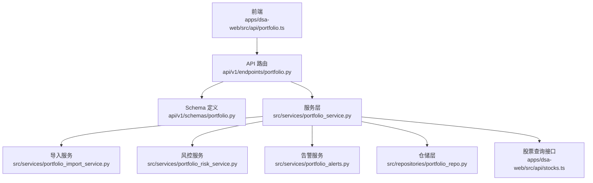
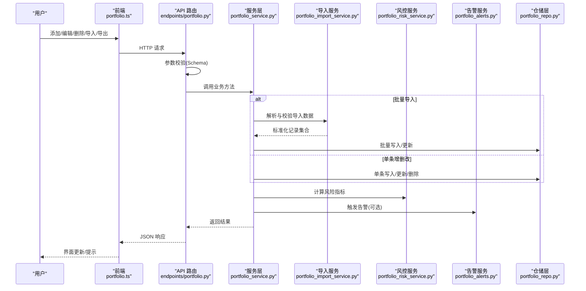
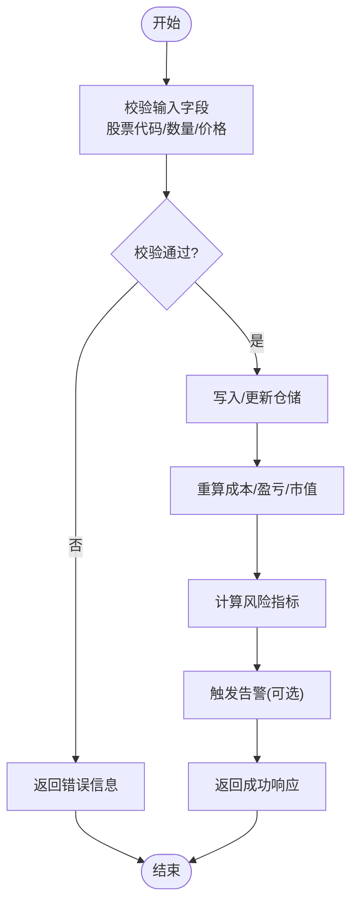
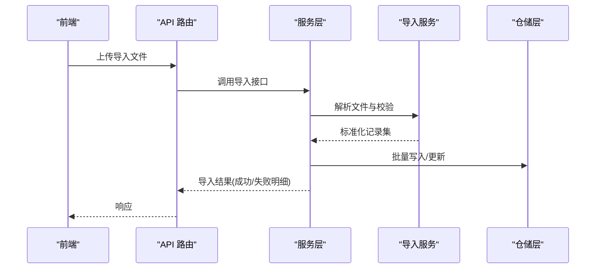
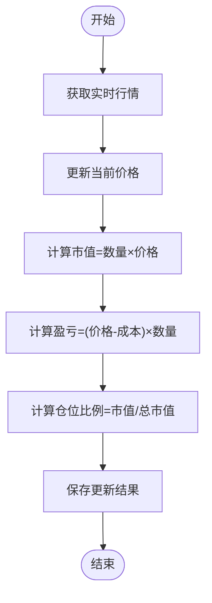
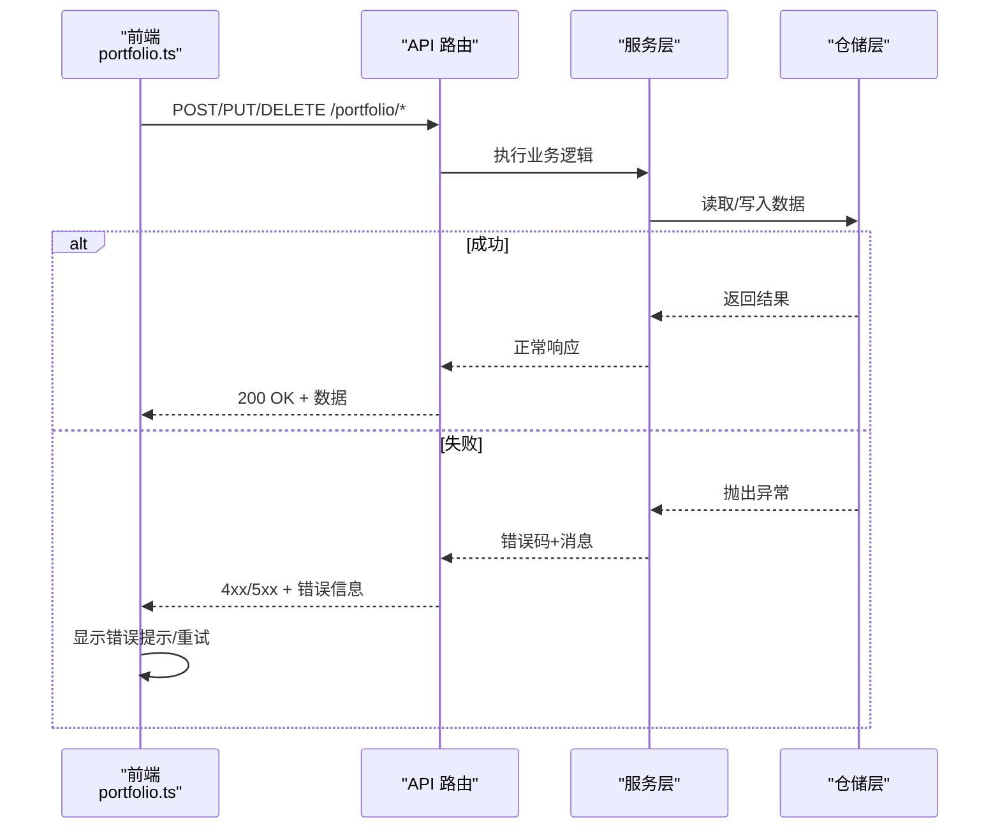
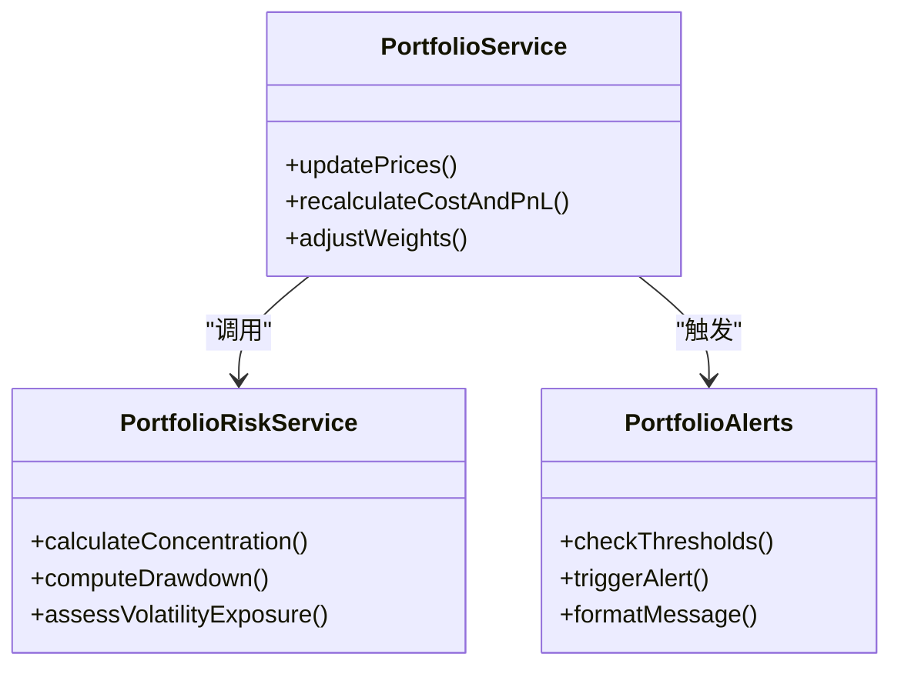
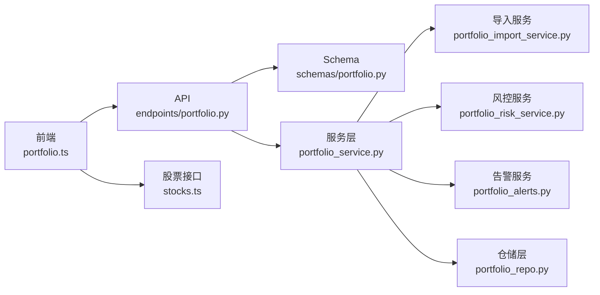

# 持仓管理

<cite>
**本文引用的文件**   
- [portfolio.py](file://api/v1/endpoints/portfolio.py)
- [portfolio.py](file://api/v1/schemas/portfolio.py)
- [portfolio_repo.py](file://src/repositories/portfolio_repo.py)
- [portfolio_service.py](file://src/services/portfolio_service.py)
- [portfolio_import_service.py](file://src/services/portfolio_import_service.py)
- [portfolio_risk_service.py](file://src/services/portfolio_risk_service.py)
- [portfolio_alerts.py](file://src/services/portfolio_alerts.py)
- [portfolio.ts](file://apps/dsa-web/src/api/portfolio.ts)
- [stocks.ts](file://apps/dsa-web/src/api/stocks.ts)
- [error.ts](file://apps/dsa-web/src/api/error.ts)
- [test_main_portfolio.py](file://tests/test_main_portfolio.py)
- [test_portfolio_api.py](file://tests/test_portfolio_api.py)
- [test_portfolio_service.py](file://tests/test_portfolio_service.py)
</cite>

## 目录
1. [简介](#简介)
2. [项目结构](#项目结构)
3. [核心组件](#核心组件)
4. [架构总览](#架构总览)
5. [详细组件分析](#详细组件分析)
6. [依赖关系分析](#依赖关系分析)
7. [性能考虑](#性能考虑)
8. [故障排查指南](#故障排查指南)
9. [结论](#结论)
10. [附录](#附录)

## 简介
本文件围绕“持仓管理”功能，系统性阐述以下方面：
- 持仓的增删改操作与批量导入导出流程
- 持仓数据结构设计（股票代码、买入价格、数量、成本计算等）
- 持仓状态管理（实时价格更新、盈亏计算、仓位比例调整）
- 数据验证规则与业务约束
- 前后端交互流程与错误处理机制

该功能贯穿前端页面、API 层、服务层与仓储层，并涉及行情数据获取、风险指标计算与告警触发。

## 项目结构
与持仓管理相关的代码主要分布在以下模块：
- API 层：路由与请求校验
- Schema 层：数据模型定义
- 服务层：业务逻辑（导入导出、风控、告警）
- 仓储层：持久化访问
- 前端：API 调用与错误处理

**图示来源** 
- [portfolio.py](file://api/v1/endpoints/portfolio.py)
- [portfolio.py](file://api/v1/schemas/portfolio.py)
- [portfolio_service.py](file://src/services/portfolio_service.py)
- [portfolio_import_service.py](file://src/services/portfolio_import_service.py)
- [portfolio_risk_service.py](file://src/services/portfolio_risk_service.py)
- [portfolio_alerts.py](file://src/services/portfolio_alerts.py)
- [portfolio_repo.py](file://src/repositories/portfolio_repo.py)
- [portfolio.ts](file://apps/dsa-web/src/api/portfolio.ts)
- [stocks.ts](file://apps/dsa-web/src/api/stocks.ts)

**章节来源**
- [portfolio.py](file://api/v1/endpoints/portfolio.py)
- [portfolio.py](file://api/v1/schemas/portfolio.py)
- [portfolio_service.py](file://src/services/portfolio_service.py)
- [portfolio_import_service.py](file://src/services/portfolio_import_service.py)
- [portfolio_risk_service.py](file://src/services/portfolio_risk_service.py)
- [portfolio_alerts.py](file://src/services/portfolio_alerts.py)
- [portfolio_repo.py](file://src/repositories/portfolio_repo.py)
- [portfolio.ts](file://apps/dsa-web/src/api/portfolio.ts)
- [stocks.ts](file://apps/dsa-web/src/api/stocks.ts)

## 核心组件
- 路由与校验：提供持仓 CRUD 与批量导入导出接口，统一使用 Pydantic Schema 进行入参校验。
- 服务层：封装持仓业务逻辑，包括合并重复标的、计算成本与盈亏、更新实时价格、计算仓位占比、触发风控与告警。
- 导入服务：解析批量导入数据，执行去重、校验与批量写入。
- 风控服务：基于持仓与实时行情计算风险指标（如集中度、回撤、波动率暴露等）。
- 告警服务：根据阈值与策略生成持仓相关告警。
- 仓储层：负责持仓数据的持久化读写。
- 前端：调用后端 API，处理成功与失败场景，展示持仓列表与详情。

**章节来源**
- [portfolio.py](file://api/v1/endpoints/portfolio.py)
- [portfolio.py](file://api/v1/schemas/portfolio.py)
- [portfolio_service.py](file://src/services/portfolio_service.py)
- [portfolio_import_service.py](file://src/services/portfolio_import_service.py)
- [portfolio_risk_service.py](file://src/services/portfolio_risk_service.py)
- [portfolio_alerts.py](file://src/services/portfolio_alerts.py)
- [portfolio_repo.py](file://src/repositories/portfolio_repo.py)
- [portfolio.ts](file://apps/dsa-web/src/api/portfolio.ts)

## 架构总览
下图展示了从前端到后端的完整调用链，以及服务层内部的关键协作。

**图示来源** 
- [portfolio.py](file://api/v1/endpoints/portfolio.py)
- [portfolio_service.py](file://src/services/portfolio_service.py)
- [portfolio_import_service.py](file://src/services/portfolio_import_service.py)
- [portfolio_risk_service.py](file://src/services/portfolio_risk_service.py)
- [portfolio_alerts.py](file://src/services/portfolio_alerts.py)
- [portfolio_repo.py](file://src/repositories/portfolio_repo.py)
- [portfolio.ts](file://apps/dsa-web/src/api/portfolio.ts)

## 详细组件分析

### 数据结构与字段设计
- 股票代码：唯一标识标的，需与交易所规范一致，支持多市场前缀。
- 买入价格：历史成交均价或手动录入价，用于成本计算。
- 数量：持仓股数，必须为正整数。
- 成本：按加权平均法计算，支持分批买入合并。
- 当前价格：来自行情源的最新价或收盘价，用于盈亏与市值计算。
- 市值：数量 × 当前价格。
- 盈亏：(当前价格 - 成本) × 数量，支持百分比显示。
- 仓位比例：个股市值占组合总市值的比例，用于集中度分析。
- 更新时间戳：记录最近一次价格更新与数据同步时间。

上述字段在 Schema 中通过类型与约束确保一致性，并在服务层进行二次校验与计算。

**章节来源**
- [portfolio.py](file://api/v1/schemas/portfolio.py)
- [portfolio_service.py](file://src/services/portfolio_service.py)

### 持仓增删改流程
- 新增：接收标的、数量、买入价等，校验通过后写入仓储，并触发成本重算与风险/告警评估。
- 编辑：支持修改数量、买入价等，系统自动重新计算成本与盈亏，并更新仓位比例。
- 删除：按标的或批次删除，删除后刷新组合汇总与风险指标。

**图示来源** 
- [portfolio.py](file://api/v1/endpoints/portfolio.py)
- [portfolio_service.py](file://src/services/portfolio_service.py)
- [portfolio_repo.py](file://src/repositories/portfolio_repo.py)

**章节来源**
- [portfolio.py](file://api/v1/endpoints/portfolio.py)
- [portfolio_service.py](file://src/services/portfolio_service.py)
- [portfolio_repo.py](file://src/repositories/portfolio_repo.py)

### 批量导入与导出
- 导入：支持 CSV/Excel 等格式，解析为标准化记录，执行去重与校验，批量写入；失败项可回滚或部分提交。
- 导出：将当前持仓序列化为标准格式，便于备份或迁移。

**图示来源** 
- [portfolio.py](file://api/v1/endpoints/portfolio.py)
- [portfolio_import_service.py](file://src/services/portfolio_import_service.py)
- [portfolio_service.py](file://src/services/portfolio_service.py)
- [portfolio_repo.py](file://src/repositories/portfolio_repo.py)

**章节来源**
- [portfolio_import_service.py](file://src/services/portfolio_import_service.py)
- [portfolio_service.py](file://src/services/portfolio_service.py)
- [portfolio.py](file://api/v1/endpoints/portfolio.py)

### 实时价格更新与盈亏计算
- 价格更新：定时或事件驱动拉取最新行情，更新持仓当前价格与市值。
- 盈亏计算：基于成本与当前价格计算绝对与相对盈亏。
- 仓位比例：以组合总市值为分母，计算各标的权重。

**图示来源** 
- [portfolio_service.py](file://src/services/portfolio_service.py)
- [portfolio_risk_service.py](file://src/services/portfolio_risk_service.py)

**章节来源**
- [portfolio_service.py](file://src/services/portfolio_service.py)
- [portfolio_risk_service.py](file://src/services/portfolio_risk_service.py)

### 数据验证规则与业务约束
- 必填字段：股票代码、数量、买入价格。
- 数值范围：数量为正整数，价格为正数。
- 唯一性：同一标的在同一组合内不可重复（导入时去重）。
- 一致性：成本与买入价、数量保持一致，变更时需联动重算。
- 合规性：禁止非法标的或不符合交易规则的代码。

**章节来源**
- [portfolio.py](file://api/v1/schemas/portfolio.py)
- [portfolio_import_service.py](file://src/services/portfolio_import_service.py)

### 与后端 API 的交互与错误处理
- 前端调用：通过 portfolio.ts 发起增删改查与导入导出请求。
- 错误处理：统一捕获网络异常、服务端校验错误与业务异常，给出友好提示。
- 重试机制：对幂等操作可进行有限重试，避免瞬时失败影响体验。

**图示来源** 
- [portfolio.ts](file://apps/dsa-web/src/api/portfolio.ts)
- [portfolio.py](file://api/v1/endpoints/portfolio.py)
- [portfolio_service.py](file://src/services/portfolio_service.py)
- [portfolio_repo.py](file://src/repositories/portfolio_repo.py)
- [error.ts](file://apps/dsa-web/src/api/error.ts)

**章节来源**
- [portfolio.ts](file://apps/dsa-web/src/api/portfolio.ts)
- [portfolio.py](file://api/v1/endpoints/portfolio.py)
- [portfolio_service.py](file://src/services/portfolio_service.py)
- [portfolio_repo.py](file://src/repositories/portfolio_repo.py)
- [error.ts](file://apps/dsa-web/src/api/error.ts)

### 风控与告警
- 风控：计算集中度、波动暴露、最大回撤等指标，辅助投资决策。
- 告警：当触及阈值（如单票占比过高、亏损超阈值）时生成告警通知。

**图示来源** 
- [portfolio_risk_service.py](file://src/services/portfolio_risk_service.py)
- [portfolio_alerts.py](file://src/services/portfolio_alerts.py)
- [portfolio_service.py](file://src/services/portfolio_service.py)

**章节来源**
- [portfolio_risk_service.py](file://src/services/portfolio_risk_service.py)
- [portfolio_alerts.py](file://src/services/portfolio_alerts.py)
- [portfolio_service.py](file://src/services/portfolio_service.py)

## 依赖关系分析
- API 路由依赖 Schema 进行参数校验，调用服务层完成业务逻辑。
- 服务层依赖导入服务、风控服务、告警服务与仓储层。
- 前端依赖 portfolio.ts 与 stocks.ts 进行数据交互与错误处理。

**图示来源** 
- [portfolio.ts](file://apps/dsa-web/src/api/portfolio.ts)
- [portfolio.py](file://api/v1/endpoints/portfolio.py)
- [portfolio.py](file://api/v1/schemas/portfolio.py)
- [portfolio_service.py](file://src/services/portfolio_service.py)
- [portfolio_import_service.py](file://src/services/portfolio_import_service.py)
- [portfolio_risk_service.py](file://src/services/portfolio_risk_service.py)
- [portfolio_alerts.py](file://src/services/portfolio_alerts.py)
- [portfolio_repo.py](file://src/repositories/portfolio_repo.py)
- [stocks.ts](file://apps/dsa-web/src/api/stocks.ts)

**章节来源**
- [portfolio.ts](file://apps/dsa-web/src/api/portfolio.ts)
- [portfolio.py](file://api/v1/endpoints/portfolio.py)
- [portfolio.py](file://api/v1/schemas/portfolio.py)
- [portfolio_service.py](file://src/services/portfolio_service.py)
- [portfolio_import_service.py](file://src/services/portfolio_import_service.py)
- [portfolio_risk_service.py](file://src/services/portfolio_risk_service.py)
- [portfolio_alerts.py](file://src/services/portfolio_alerts.py)
- [portfolio_repo.py](file://src/repositories/portfolio_repo.py)
- [stocks.ts](file://apps/dsa-web/src/api/stocks.ts)

## 性能考虑
- 批量导入采用流式解析与批量写入，减少数据库往返次数。
- 价格更新与盈亏计算可异步执行，避免阻塞主流程。
- 缓存热点数据（如标的名称、汇率），降低外部依赖延迟。
- 对高风险计算（如回撤、波动暴露）设置阈值与采样窗口，平衡精度与性能。

[本节为通用指导，不直接分析具体文件]

## 故障排查指南
- 常见错误：
  - 参数校验失败：检查股票代码格式、数量与价格是否为正数。
  - 导入失败：确认文件格式与字段映射，查看失败明细。
  - 价格更新失败：检查行情源可用性，必要时降级至收盘价。
  - 风控/告警未触发：核对阈值配置与数据新鲜度。
- 定位步骤：
  - 查看 API 响应码与错误消息。
  - 检查服务层日志与仓储层异常堆栈。
  - 复现实例并缩小范围（单标的 vs 批量）。
  - 使用测试用例验证关键路径。

**章节来源**
- [error.ts](file://apps/dsa-web/src/api/error.ts)
- [test_portfolio_api.py](file://tests/test_portfolio_api.py)
- [test_portfolio_service.py](file://tests/test_portfolio_service.py)
- [test_main_portfolio.py](file://tests/test_main_portfolio.py)

## 结论
持仓管理功能通过清晰的层次划分与严格的校验机制，实现了稳健的增删改、批量导入导出、实时价格更新与盈亏计算，并结合风控与告警提升决策质量。建议在生产环境中加强监控与限流，确保高可用与高性能。

[本节为总结性内容，不直接分析具体文件]

## 附录
- 术语说明：
  - 成本：加权平均买入成本
  - 盈亏：浮动盈亏，含绝对值与百分比
  - 仓位比例：个股市值占组合总市值的权重
- 参考测试：
  - 单元测试覆盖导入解析、价格更新、盈亏计算与风控告警路径

[本节为补充信息，不直接分析具体文件]