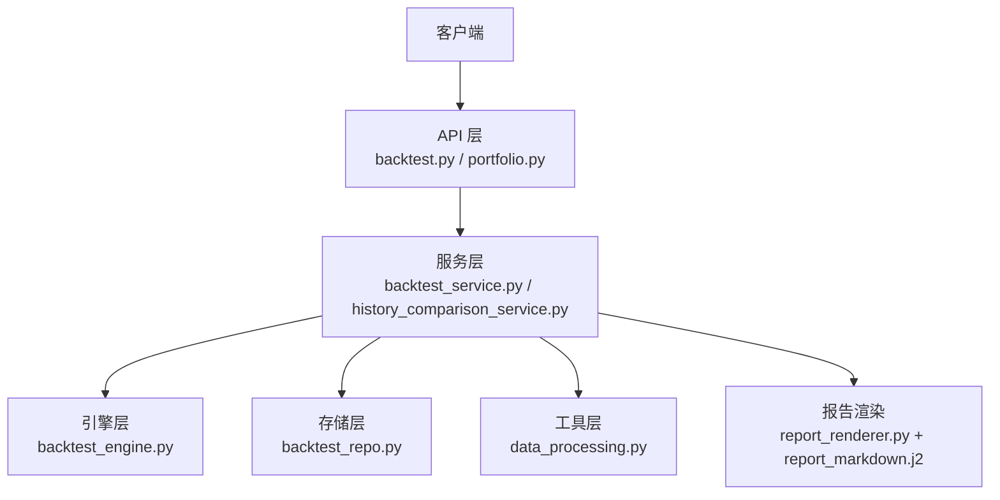
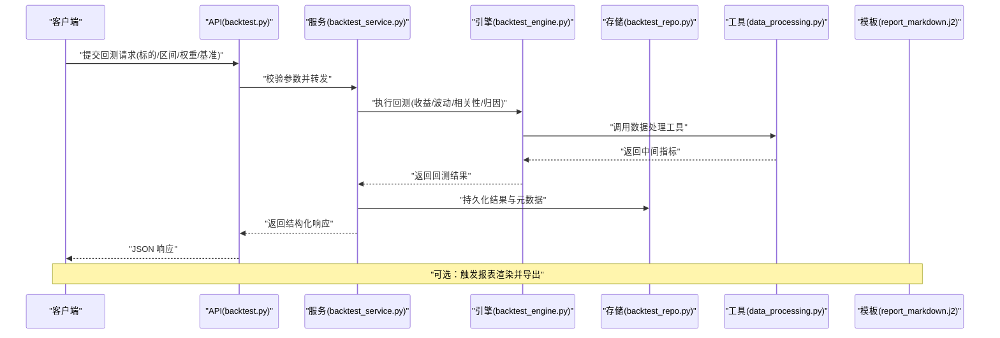
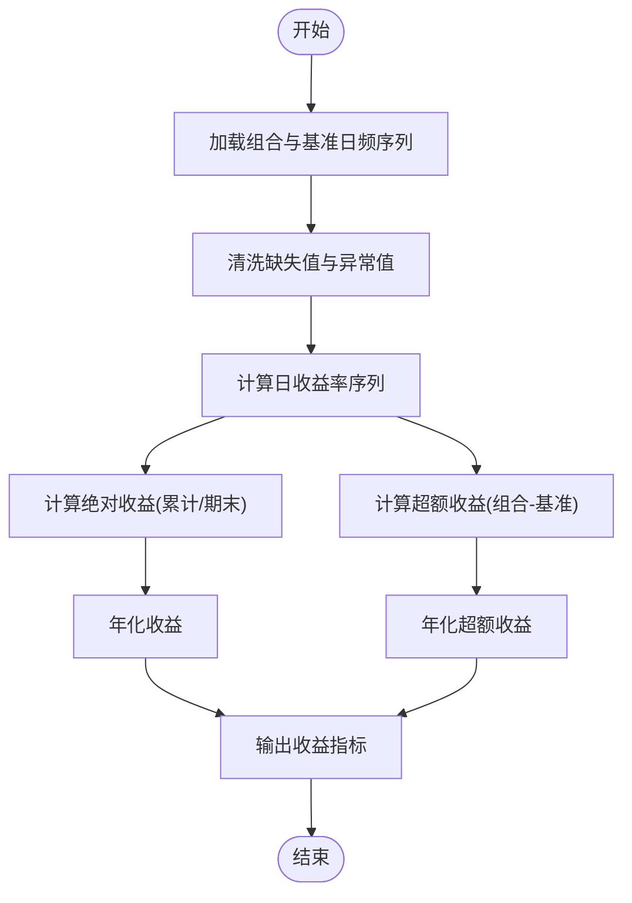
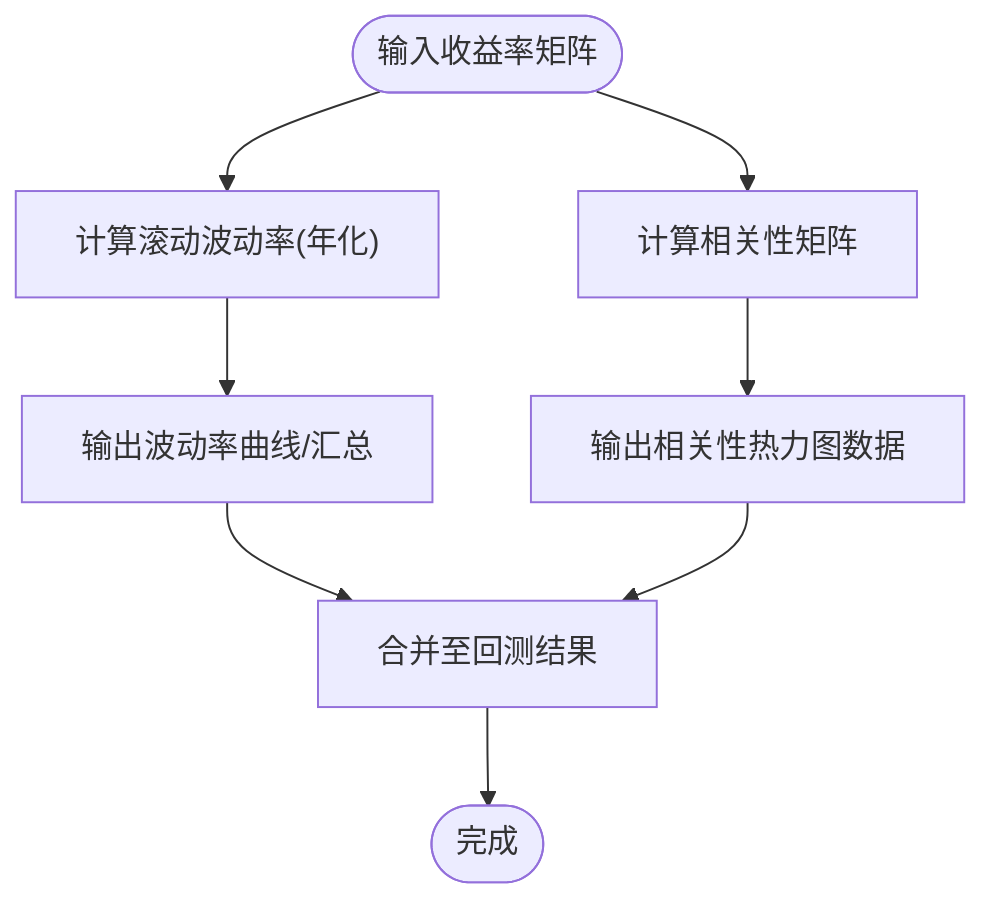
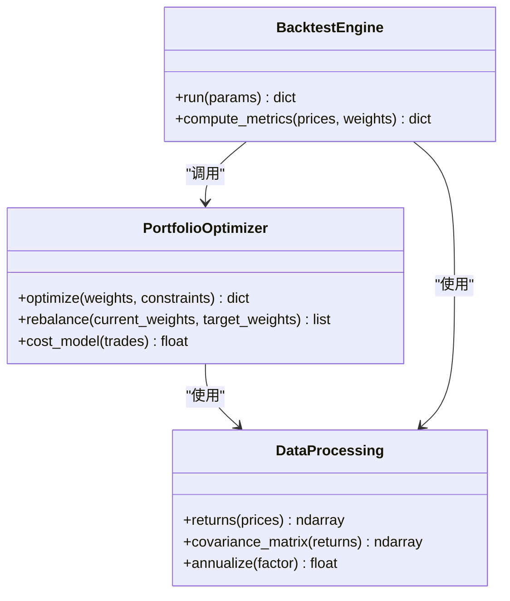
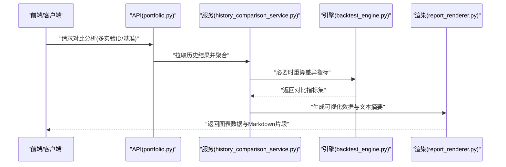
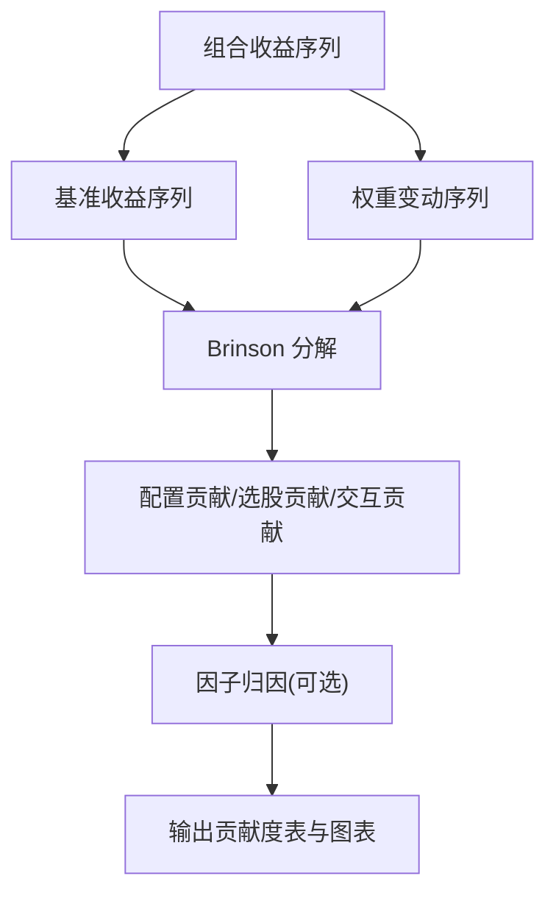
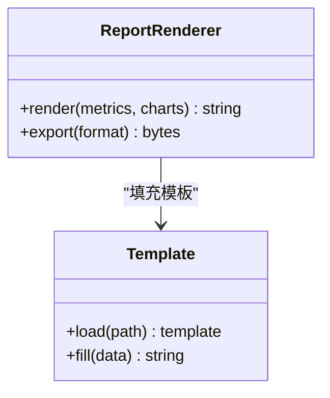
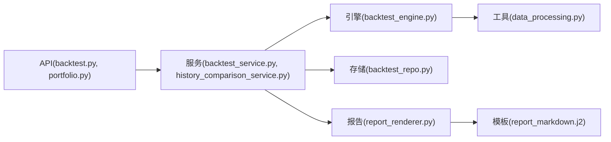

# 绩效分析

<cite>
**本文引用的文件**   
- [api/v1/endpoints/backtest.py](file://api/v1/endpoints/backtest.py)
- [api/v1/schemas/backtest.py](file://api/v1/schemas/backtest.py)
- [src/services/backtest_service.py](file://src/services/backtest_service.py)
- [src/core/backtest_engine.py](file://src/core/backtest_engine.py)
- [src/repositories/backtest_repo.py](file://src/repositories/backtest_repo.py)
- [api/v1/endpoints/portfolio.py](file://api/v1/endpoints/portfolio.py)
- [api/v1/schemas/portfolio.py](file://api/v1/schemas/portfolio.py)
- [src/services/portfolio_service.py](file://src/services/portfolio_service.py)
- [src/services/history_comparison_service.py](file://src/services/history_comparison_service.py)
- [src/services/report_renderer.py](file://src/services/report_renderer.py)
- [templates/report_markdown.j2](file://templates/report_markdown.j2)
- [src/utils/data_processing.py](file://src/utils/data_processing.py)
</cite>

## 目录
1. [简介](#简介)
2. [项目结构](#项目结构)
3. [核心组件](#核心组件)
4. [架构总览](#架构总览)
5. [详细组件分析](#详细组件分析)
6. [依赖关系分析](#依赖关系分析)
7. [性能考量](#性能考量)
8. [故障排查指南](#故障排查指南)
9. [结论](#结论)
10. [附录](#附录)

## 简介
本文件面向“绩效分析”功能，覆盖收益统计（绝对收益、年化收益、超额收益）、波动率分析与相关性矩阵计算、投资组合优化建议与再平衡策略、历史回测结果展示与对比分析、绩效归因与贡献度分解、自定义指标与报表导出等能力。文档以代码级为依据，结合接口定义与服务实现，提供从数据到指标的端到端说明，帮助读者快速理解并扩展系统能力。

## 项目结构
围绕绩效分析的关键路径包括：
- API 层：暴露回测与组合相关的接口，定义请求/响应结构
- 服务层：封装回测执行、历史对比、报告渲染等业务逻辑
- 引擎层：核心回测引擎，负责指标计算与流程编排
- 存储层：持久化回测结果与查询
- 工具层：数据处理与指标计算辅助函数
- 模板层：Markdown 报告模板用于导出

**图表来源** 
- [api/v1/endpoints/backtest.py](file://api/v1/endpoints/backtest.py)
- [api/v1/endpoints/portfolio.py](file://api/v1/endpoints/portfolio.py)
- [src/services/backtest_service.py](file://src/services/backtest_service.py)
- [src/core/backtest_engine.py](file://src/core/backtest_engine.py)
- [src/repositories/backtest_repo.py](file://src/repositories/backtest_repo.py)
- [src/utils/data_processing.py](file://src/utils/data_processing.py)
- [src/services/report_renderer.py](file://src/services/report_renderer.py)
- [templates/report_markdown.j2](file://templates/report_markdown.j2)

**章节来源**
- [api/v1/endpoints/backtest.py](file://api/v1/endpoints/backtest.py)
- [api/v1/endpoints/portfolio.py](file://api/v1/endpoints/portfolio.py)
- [src/services/backtest_service.py](file://src/services/backtest_service.py)
- [src/core/backtest_engine.py](file://src/core/backtest_engine.py)
- [src/repositories/backtest_repo.py](file://src/repositories/backtest_repo.py)
- [src/utils/data_processing.py](file://src/utils/data_processing.py)
- [src/services/report_renderer.py](file://src/services/report_renderer.py)
- [templates/report_markdown.j2](file://templates/report_markdown.j2)

## 核心组件
- 回测服务：接收回测参数，调度引擎计算指标，落库并返回结构化结果
- 回测引擎：实现收益、波动率、相关性、归因与优化的核心算法
- 历史对比服务：对多期或基准进行对比分析
- 报告渲染器：将指标与图表数据渲染为 Markdown 报表
- 数据存储：保存回测结果、对比快照与可复现实验元数据

**章节来源**
- [src/services/backtest_service.py](file://src/services/backtest_service.py)
- [src/core/backtest_engine.py](file://src/core/backtest_engine.py)
- [src/services/history_comparison_service.py](file://src/services/history_comparison_service.py)
- [src/services/report_renderer.py](file://src/services/report_renderer.py)
- [src/repositories/backtest_repo.py](file://src/repositories/backtest_repo.py)

## 架构总览
下图展示了从 API 调用到指标计算与报表导出的完整链路。

**图表来源** 
- [api/v1/endpoints/backtest.py](file://api/v1/endpoints/backtest.py)
- [src/services/backtest_service.py](file://src/services/backtest_service.py)
- [src/core/backtest_engine.py](file://src/core/backtest_engine.py)
- [src/repositories/backtest_repo.py](file://src/repositories/backtest_repo.py)
- [src/utils/data_processing.py](file://src/utils/data_processing.py)
- [templates/report_markdown.j2](file://templates/report_markdown.j2)

## 详细组件分析

### 收益统计计算方法
- 绝对收益：基于期初与期末净值或累计收益率计算，支持按日频序列聚合
- 年化收益：将持有期收益折算为年化，考虑交易日历与复利效应
- 超额收益：组合收益减去基准收益，可按日频滚动或区间累计；支持滑点与费用调整后的净超额

**图表来源** 
- [src/core/backtest_engine.py](file://src/core/backtest_engine.py)
- [src/utils/data_processing.py](file://src/utils/data_processing.py)

**章节来源**
- [src/core/backtest_engine.py](file://src/core/backtest_engine.py)
- [src/utils/data_processing.py](file://src/utils/data_processing.py)

### 波动率分析与相关性矩阵
- 波动率：采用日频收益率的滚动标准差，支持年化（乘以交易日平方根）
- 相关性矩阵：计算资产间收益率相关系数，可用于风险分散评估与优化约束
- 稳健性：可对极端值进行缩尾处理，或使用稳健估计量降低噪声影响

**图表来源** 
- [src/core/backtest_engine.py](file://src/core/backtest_engine.py)
- [src/utils/data_processing.py](file://src/utils/data_processing.py)

**章节来源**
- [src/core/backtest_engine.py](file://src/core/backtest_engine.py)
- [src/utils/data_processing.py](file://src/utils/data_processing.py)

### 投资组合优化建议与再平衡策略
- 优化目标：在给定风险预算下最大化预期收益，或最小化波动率/下行风险
- 约束条件：权重上下限、行业/因子暴露限制、换手成本惩罚
- 求解方法：均值-方差优化、风险平价、Black-Litterman（若集成）
- 再平衡策略：定期（月度/季度）或阈值触发（偏离度/波动率突破），含交易成本模型

**图表来源** 
- [src/core/backtest_engine.py](file://src/core/backtest_engine.py)
- [src/utils/data_processing.py](file://src/utils/data_processing.py)

**章节来源**
- [src/core/backtest_engine.py](file://src/core/backtest_engine.py)
- [src/utils/data_processing.py](file://src/utils/data_processing.py)

### 历史回测结果展示与对比分析
- 展示维度：净值曲线、回撤、月度收益分布、滚动波动率、相关性热力图
- 对比分析：多策略/多参数/不同基准的横向对比，统计显著性检验（如 t 检验、Mann-Whitney）
- 交互能力：时间窗口选择、分组过滤、排序与导出

**图表来源** 
- [api/v1/endpoints/portfolio.py](file://api/v1/endpoints/portfolio.py)
- [src/services/history_comparison_service.py](file://src/services/history_comparison_service.py)
- [src/core/backtest_engine.py](file://src/core/backtest_engine.py)
- [src/services/report_renderer.py](file://src/services/report_renderer.py)

**章节来源**
- [api/v1/endpoints/portfolio.py](file://api/v1/endpoints/portfolio.py)
- [src/services/history_comparison_service.py](file://src/services/history_comparison_service.py)
- [src/core/backtest_engine.py](file://src/core/backtest_engine.py)
- [src/services/report_renderer.py](file://src/services/report_renderer.py)

### 绩效归因分析与贡献度分解
- 归因框架：Brinson 归因（资产配置/选股/交互效应）或因子归因（风格/行业/动量等）
- 贡献度分解：按资产或因子对组合收益与风险的贡献占比
- 输出形式：表格与堆叠图，支持按时间段与子组合切片

**图表来源** 
- [src/core/backtest_engine.py](file://src/core/backtest_engine.py)
- [src/utils/data_processing.py](file://src/utils/data_processing.py)

**章节来源**
- [src/core/backtest_engine.py](file://src/core/backtest_engine.py)
- [src/utils/data_processing.py](file://src/utils/data_processing.py)

### 自定义分析指标与报表导出
- 自定义指标：允许用户通过表达式或插件方式扩展指标（如 Calmar、Sortino、最大回撤天数）
- 报表导出：Markdown 模板渲染，支持嵌入图表数据与统计摘要；可扩展 PDF/Excel 导出（若集成）

**图表来源** 
- [src/services/report_renderer.py](file://src/services/report_renderer.py)
- [templates/report_markdown.j2](file://templates/report_markdown.j2)

**章节来源**
- [src/services/report_renderer.py](file://src/services/report_renderer.py)
- [templates/report_markdown.j2](file://templates/report_markdown.j2)

## 依赖关系分析
- API 层依赖服务层进行参数校验与业务编排
- 服务层依赖引擎层执行核心计算，依赖存储层持久化结果
- 工具层被引擎与服务复用，提供统一的数值计算与数据清洗能力
- 报告渲染器依赖模板与图表数据源，统一输出格式

**图表来源** 
- [api/v1/endpoints/backtest.py](file://api/v1/endpoints/backtest.py)
- [api/v1/endpoints/portfolio.py](file://api/v1/endpoints/portfolio.py)
- [src/services/backtest_service.py](file://src/services/backtest_service.py)
- [src/services/history_comparison_service.py](file://src/services/history_comparison_service.py)
- [src/core/backtest_engine.py](file://src/core/backtest_engine.py)
- [src/repositories/backtest_repo.py](file://src/repositories/backtest_repo.py)
- [src/utils/data_processing.py](file://src/utils/data_processing.py)
- [src/services/report_renderer.py](file://src/services/report_renderer.py)
- [templates/report_markdown.j2](file://templates/report_markdown.j2)

**章节来源**
- [api/v1/endpoints/backtest.py](file://api/v1/endpoints/backtest.py)
- [api/v1/endpoints/portfolio.py](file://api/v1/endpoints/portfolio.py)
- [src/services/backtest_service.py](file://src/services/backtest_service.py)
- [src/services/history_comparison_service.py](file://src/services/history_comparison_service.py)
- [src/core/backtest_engine.py](file://src/core/backtest_engine.py)
- [src/repositories/backtest_repo.py](file://src/repositories/backtest_repo.py)
- [src/utils/data_processing.py](file://src/utils/data_processing.py)
- [src/services/report_renderer.py](file://src/services/report_renderer.py)
- [templates/report_markdown.j2](file://templates/report_markdown.j2)

## 性能考量
- 数据规模：日频长序列与多资产矩阵运算需关注内存占用与计算复杂度（O(n^2) 协方差/相关性）
- 并行化：对多策略/多参数的回测可进行任务级并行，注意 I/O 与锁竞争
- 缓存：中间指标（收益率、协方差）可缓存以减少重复计算
- 增量更新：权重或基准变化时仅重算受影响窗口
- 数值稳定性：避免除零与溢出，使用稳健估计与缩尾处理

[本节为通用指导，不直接分析具体文件]

## 故障排查指南
- 常见错误
  - 数据缺失：检查日期对齐与停牌处理，确保收益率序列连续
  - 基准不一致：确认基准代码与时间范围一致
  - 权重非法：检查权重和为 1、上下界约束满足
  - 计算发散：检查极端值与协方差矩阵正定性
- 定位步骤
  - 查看 API 响应结构与状态码
  - 检查服务日志中的关键断言与异常堆栈
  - 验证存储中是否成功写入回测结果
  - 使用工具层单元测试验证收益率与协方差计算

**章节来源**
- [api/v1/endpoints/backtest.py](file://api/v1/endpoints/backtest.py)
- [api/v1/endpoints/portfolio.py](file://api/v1/endpoints/portfolio.py)
- [src/services/backtest_service.py](file://src/services/backtest_service.py)
- [src/core/backtest_engine.py](file://src/core/backtest_engine.py)
- [src/repositories/backtest_repo.py](file://src/repositories/backtest_repo.py)
- [src/utils/data_processing.py](file://src/utils/data_processing.py)

## 结论
本绩效分析模块以清晰的层次化架构实现了从数据到指标的完整闭环：API 层对外暴露能力，服务层编排流程，引擎层承载核心算法，存储层保障可追溯，工具层统一计算口径，模板层支撑报表导出。通过收益统计、波动率与相关性、优化与再平衡、归因与对比分析，以及自定义指标与导出能力，形成一套可拓展、可审计、可复用的绩效分析体系。

[本节为总结性内容，不直接分析具体文件]

## 附录
- 指标定义速查
  - 绝对收益：期末净值/期初净值 - 1
  - 年化收益：(1+持有期收益)^(交易日数/年交易日数) - 1
  - 超额收益：组合收益 - 基准收益（可年化）
  - 波动率：日收益率标准差 × sqrt(年交易日数)
  - 相关性：资产间收益率皮尔逊相关系数
- 常用场景
  - 单策略回测与基准对比
  - 多策略参数扫描与优选
  - 组合优化与再平衡计划生成
  - 月度/季度绩效报告自动生成

[本节为补充信息，不直接分析具体文件]