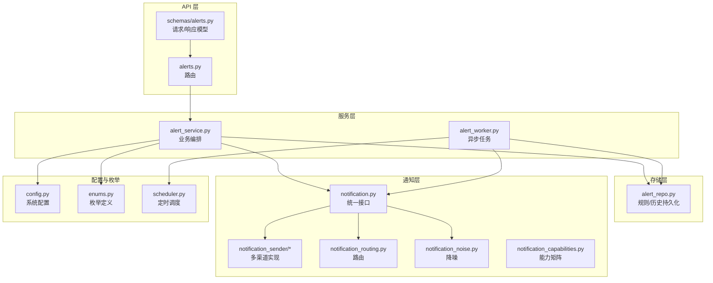
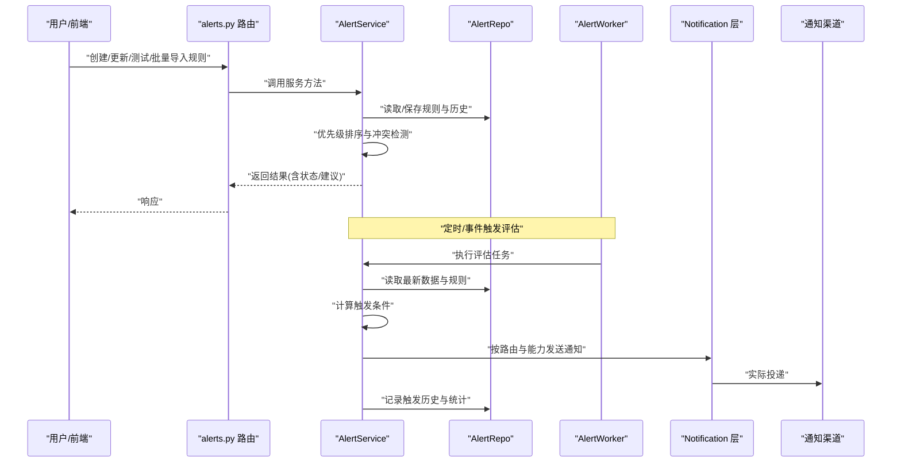
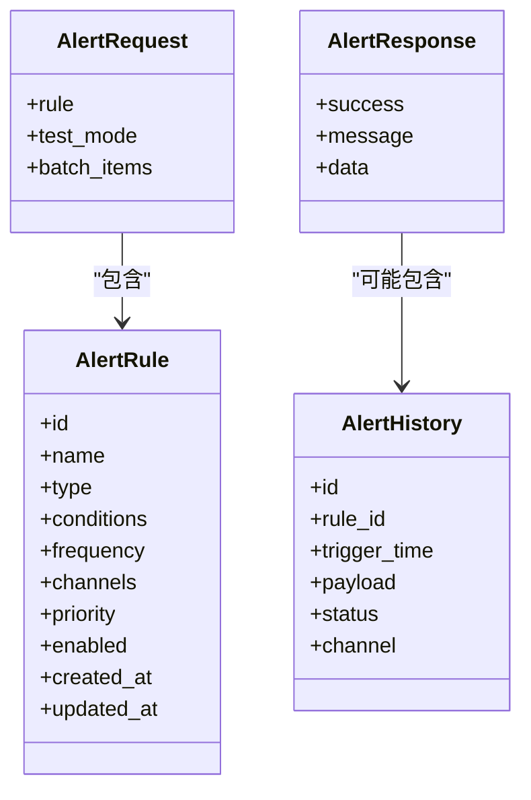
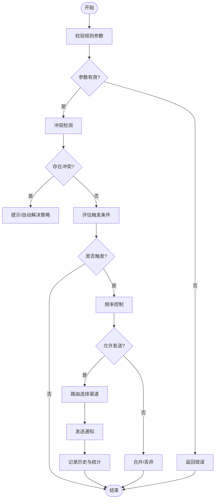
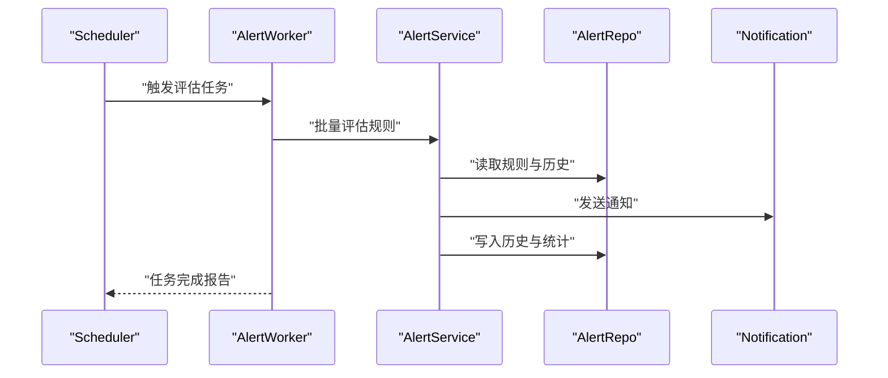
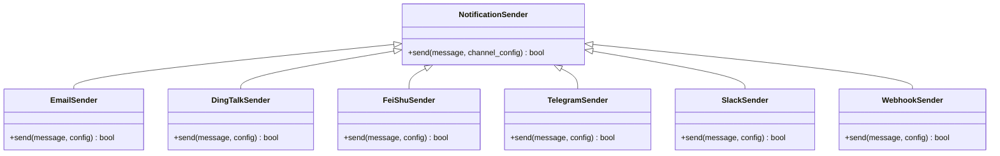
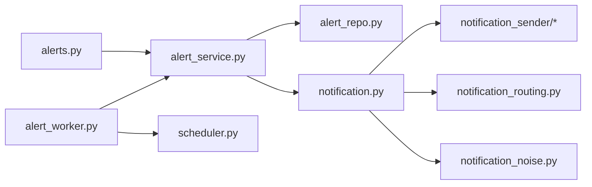

# 警报系统

<cite>
**本文引用的文件**   
- [api/v1/endpoints/alerts.py](file://api/v1/endpoints/alerts.py)
- [api/v1/schemas/alerts.py](file://api/v1/schemas/alerts.py)
- [src/services/alert_service.py](file://src/services/alert_service.py)
- [src/services/alert_worker.py](file://src/services/alert_worker.py)
- [src/repositories/alert_repo.py](file://src/repositories/alert_repo.py)
- [src/notification_sender/__init__.py](file://src/notification_sender/__init__.py)
- [src/notification.py](file://src/notification.py)
- [src/notification_capabilities.py](file://src/notification_capabilities.py)
- [src/notification_contracts.py](file://src/notification_contracts.py)
- [src/notification_routing.py](file://src/notification_routing.py)
- [src/notification_noise.py](file://src/notification_noise.py)
- [src/enums.py](file://src/enums.py)
- [src/config.py](file://src/config.py)
- [src/scheduler.py](file://src/scheduler.py)
- [tests/test_alert_api.py](file://tests/test_alert_api.py)
- [tests/test_alert_worker.py](file://tests/test_alert_worker.py)
- [tests/test_portfolio_alerts.py](file://tests/test_portfolio_alerts.py)
- [tests/test_market_light_alerts.py](file://tests/test_market_light_alerts.py)
- [tests/test_notification_diagnostics.py](file://tests/test_notification_diagnostics.py)
</cite>

## 目录
1. [简介](#简介)
2. [项目结构](#项目结构)
3. [核心组件](#核心组件)
4. [架构总览](#架构总览)
5. [详细组件分析](#详细组件分析)
6. [依赖关系分析](#依赖关系分析)
7. [性能考虑](#性能考虑)
8. [故障排查指南](#故障排查指南)
9. [结论](#结论)
10. [附录](#附录)

## 简介
本文件面向“警报系统”的完整文档，覆盖以下目标：
- 警报规则配置界面与后端契约（条件设置、触发频率、通知渠道选择）
- 警报类型（价格警报、技术指标警报、新闻情感警报等）
- 优先级管理与冲突解决机制
- 历史记录与统计功能
- 测试与调试工具
- 模板与批量配置能力

该系统采用前后端分离设计：前端通过 API 调用后端服务；后端由路由层、服务层、工作器、存储仓库与通知通道组成，支持多平台通知与降噪策略。

## 项目结构
与警报相关的代码主要分布在以下模块：
- API 层：路由与数据模型定义
- 服务层：业务逻辑编排
- 工作器：异步任务执行与调度
- 存储层：规则与历史记录的持久化
- 通知层：多渠道发送、路由与降噪
- 配置与枚举：系统开关、渠道能力、枚举值

图表来源
- [api/v1/endpoints/alerts.py](file://api/v1/endpoints/alerts.py)
- [api/v1/schemas/alerts.py](file://api/v1/schemas/alerts.py)
- [src/services/alert_service.py](file://src/services/alert_service.py)
- [src/services/alert_worker.py](file://src/services/alert_worker.py)
- [src/repositories/alert_repo.py](file://src/repositories/alert_repo.py)
- [src/notification.py](file://src/notification.py)
- [src/notification_sender/__init__.py](file://src/notification_sender/__init__.py)
- [src/notification_routing.py](file://src/notification_routing.py)
- [src/notification_noise.py](file://src/notification_noise.py)
- [src/notification_capabilities.py](file://src/notification_capabilities.py)
- [src/config.py](file://src/config.py)
- [src/enums.py](file://src/enums.py)
- [src/scheduler.py](file://src/scheduler.py)

章节来源
- [api/v1/endpoints/alerts.py](file://api/v1/endpoints/alerts.py)
- [api/v1/schemas/alerts.py](file://api/v1/schemas/alerts.py)
- [src/services/alert_service.py](file://src/services/alert_service.py)
- [src/services/alert_worker.py](file://src/services/alert_worker.py)
- [src/repositories/alert_repo.py](file://src/repositories/alert_repo.py)
- [src/notification.py](file://src/notification.py)
- [src/notification_sender/__init__.py](file://src/notification_sender/__init__.py)
- [src/notification_routing.py](file://src/notification_routing.py)
- [src/notification_noise.py](file://src/notification_noise.py)
- [src/notification_capabilities.py](file://src/notification_capabilities.py)
- [src/config.py](file://src/config.py)
- [src/enums.py](file://src/enums.py)
- [src/scheduler.py](file://src/scheduler.py)

## 核心组件
- 路由与模型（API 层）
  - 提供创建、查询、更新、删除、测试、批量导入导出等接口
  - 使用 Pydantic 模型约束请求/响应结构，确保字段校验与默认值
- 服务层（AlertService）
  - 负责规则校验、优先级排序、冲突检测、触发评估、通知编排
  - 与存储仓库交互读写规则与历史
  - 与通知层对接，按渠道能力与路由策略发送消息
- 工作器（AlertWorker）
  - 基于调度器周期性或事件驱动地执行评估任务
  - 支持批量处理、失败重试、限流与熔断
- 存储层（AlertRepo）
  - 规则与历史记录的增删改查
  - 支持分页、过滤、聚合统计
- 通知层
  - 统一发送接口，封装多渠道实现（邮件、钉钉、飞书、Telegram、Slack、Webhook 等）
  - 路由策略决定最终投递渠道
  - 降噪策略避免重复与风暴
  - 能力矩阵用于动态适配渠道特性

章节来源
- [api/v1/endpoints/alerts.py](file://api/v1/endpoints/alerts.py)
- [api/v1/schemas/alerts.py](file://api/v1/schemas/alerts.py)
- [src/services/alert_service.py](file://src/services/alert_service.py)
- [src/services/alert_worker.py](file://src/services/alert_worker.py)
- [src/repositories/alert_repo.py](file://src/repositories/alert_repo.py)
- [src/notification.py](file://src/notification.py)
- [src/notification_sender/__init__.py](file://src/notification_sender/__init__.py)
- [src/notification_routing.py](file://src/notification_routing.py)
- [src/notification_noise.py](file://src/notification_noise.py)
- [src/notification_capabilities.py](file://src/notification_capabilities.py)

## 架构总览
下图展示了从用户操作到通知触达的端到端流程，包括规则评估、优先级与冲突处理、历史记录写入与多渠道通知。

图表来源
- [api/v1/endpoints/alerts.py](file://api/v1/endpoints/alerts.py)
- [src/services/alert_service.py](file://src/services/alert_service.py)
- [src/services/alert_worker.py](file://src/services/alert_worker.py)
- [src/repositories/alert_repo.py](file://src/repositories/alert_repo.py)
- [src/notification.py](file://src/notification.py)
- [src/notification_routing.py](file://src/notification_routing.py)
- [src/notification_noise.py](file://src/notification_noise.py)

## 详细组件分析

### 路由与数据模型（API 层）
- 路由职责
  - 暴露 RESTful 接口：规则 CRUD、测试触发、批量导入/导出、历史查询、统计汇总
  - 鉴权与错误处理中间件集成
- 数据模型
  - 使用 Pydantic 模型对请求体进行强校验，包含必填字段、默认值、枚举限制
  - 响应模型包含统一的错误码与提示信息

图表来源
- [api/v1/schemas/alerts.py](file://api/v1/schemas/alerts.py)
- [api/v1/endpoints/alerts.py](file://api/v1/endpoints/alerts.py)

章节来源
- [api/v1/endpoints/alerts.py](file://api/v1/endpoints/alerts.py)
- [api/v1/schemas/alerts.py](file://api/v1/schemas/alerts.py)

### 服务层（AlertService）
- 规则管理
  - 创建/更新时进行字段校验、去重、优先级合法性检查
  - 冲突检测：同一标的+条件组合的唯一性、互斥规则提示
- 触发评估
  - 根据规则类型（价格、技术指标、新闻情感等）计算是否触发
  - 频率控制：冷却时间、窗口统计、防抖
- 通知编排
  - 依据渠道能力矩阵与路由策略选择合适渠道
  - 合并与降噪：同规则短时间内的重复触发合并
- 历史与统计
  - 记录每次触发详情与状态
  - 生成统计指标（触发次数、成功率、平均延迟等）

图表来源
- [src/services/alert_service.py](file://src/services/alert_service.py)
- [src/notification_routing.py](file://src/notification_routing.py)
- [src/notification_noise.py](file://src/notification_noise.py)

章节来源
- [src/services/alert_service.py](file://src/services/alert_service.py)

### 工作器（AlertWorker）
- 调度模式
  - 支持定时轮询与事件驱动两种模式
  - 可配置并发度、重试次数、退避策略
- 任务编排
  - 批量拉取标的与数据源
  - 分片执行评估任务，失败隔离与告警
- 监控与诊断
  - 输出关键指标（队列长度、处理耗时、错误率）
  - 与诊断工具集成，便于定位问题

图表来源
- [src/services/alert_worker.py](file://src/services/alert_worker.py)
- [src/scheduler.py](file://src/scheduler.py)
- [src/repositories/alert_repo.py](file://src/repositories/alert_repo.py)
- [src/notification.py](file://src/notification.py)

章节来源
- [src/services/alert_worker.py](file://src/services/alert_worker.py)
- [src/scheduler.py](file://src/scheduler.py)

### 存储层（AlertRepo）
- 规则存储
  - 支持唯一键约束（规则名+标的+条件）
  - 索引优化：按标的、类型、启用状态查询
- 历史存储
  - 触发记录包含时间戳、载荷、状态、渠道
  - 支持分页、过滤、聚合统计
- 事务与一致性
  - 在批量导入与更新时使用事务保证一致性

章节来源
- [src/repositories/alert_repo.py](file://src/repositories/alert_repo.py)

### 通知层（多渠道与路由）
- 统一接口
  - 定义标准发送接口，屏蔽渠道差异
- 渠道实现
  - 邮件、钉钉、飞书、Telegram、Slack、Webhook、Gotify、Pushover、PushPlus、ServerChan3、AstrBot 等
- 路由策略
  - 基于规则配置、渠道能力、负载与健康状态选择最优渠道
- 降噪策略
  - 去重、合并、限流、静默期
- 能力矩阵
  - 描述各渠道支持的媒体类型、附件、富文本等能力

图表来源
- [src/notification.py](file://src/notification.py)
- [src/notification_sender/__init__.py](file://src/notification_sender/__init__.py)
- [src/notification_capabilities.py](file://src/notification_capabilities.py)
- [src/notification_contracts.py](file://src/notification_contracts.py)

章节来源
- [src/notification.py](file://src/notification.py)
- [src/notification_sender/__init__.py](file://src/notification_sender/__init__.py)
- [src/notification_capabilities.py](file://src/notification_capabilities.py)
- [src/notification_contracts.py](file://src/notification_contracts.py)

### 配置与枚举
- 配置项
  - 渠道密钥、超时、重试、并发、静默期、降噪阈值等
- 枚举定义
  - 警报类型、频率单位、优先级等级、渠道类型、状态码等

章节来源
- [src/config.py](file://src/config.py)
- [src/enums.py](file://src/enums.py)

## 依赖关系分析
- 组件耦合
  - 路由层仅依赖服务层与模型，保持薄接口
  - 服务层依赖存储与通知层，解耦具体实现
  - 工作器依赖调度器与服务层，独立于 UI
- 外部依赖
  - 通知渠道 SDK/API
  - 数据存储（关系型/时序库）
  - 调度框架（如 APScheduler 或自定义）

图表来源
- [api/v1/endpoints/alerts.py](file://api/v1/endpoints/alerts.py)
- [src/services/alert_service.py](file://src/services/alert_service.py)
- [src/services/alert_worker.py](file://src/services/alert_worker.py)
- [src/repositories/alert_repo.py](file://src/repositories/alert_repo.py)
- [src/notification.py](file://src/notification.py)
- [src/notification_sender/__init__.py](file://src/notification_sender/__init__.py)
- [src/notification_routing.py](file://src/notification_routing.py)
- [src/notification_noise.py](file://src/notification_noise.py)
- [src/scheduler.py](file://src/scheduler.py)

章节来源
- [api/v1/endpoints/alerts.py](file://api/v1/endpoints/alerts.py)
- [src/services/alert_service.py](file://src/services/alert_service.py)
- [src/services/alert_worker.py](file://src/services/alert_worker.py)
- [src/repositories/alert_repo.py](file://src/repositories/alert_repo.py)
- [src/notification.py](file://src/notification.py)
- [src/notification_sender/__init__.py](file://src/notification_sender/__init__.py)
- [src/notification_routing.py](file://src/notification_routing.py)
- [src/notification_noise.py](file://src/notification_noise.py)
- [src/scheduler.py](file://src/scheduler.py)

## 性能考虑
- 评估任务批量化与分片，降低单次处理压力
- 缓存热点数据（标的列表、基础信息），减少 IO
- 频率控制与冷却窗口避免频繁触发
- 通知发送异步化与重试退避，提高稳定性
- 数据库索引优化查询路径（标的、类型、启用状态）
- 监控关键指标（队列长度、处理耗时、错误率、渠道健康）

[本节为通用指导，不直接分析具体文件]

## 故障排查指南
- 常见问题
  - 规则未触发：检查条件表达式、数据源可用性、频率控制
  - 通知失败：核对渠道配置、网络连通性、权限与签名
  - 重复通知：确认降噪策略与合并窗口
  - 性能瓶颈：查看队列堆积、慢查询、外部 API 延迟
- 诊断工具
  - 单元测试覆盖 API、工作器、通知与降噪逻辑
  - 诊断脚本输出渠道能力与健康状态
  - 日志级别与追踪 ID 辅助定位

章节来源
- [tests/test_alert_api.py](file://tests/test_alert_api.py)
- [tests/test_alert_worker.py](file://tests/test_alert_worker.py)
- [tests/test_notification_diagnostics.py](file://tests/test_notification_diagnostics.py)

## 结论
本警报系统以清晰的分层架构与模块化设计，实现了灵活的规则配置、可靠的触发评估、稳定的多渠道通知与完善的诊断能力。通过优先级与冲突管理、频率控制与降噪策略，系统在复杂场景下仍能保持高可用与低噪声。配合测试与诊断工具，便于持续迭代与维护。

[本节为总结，不直接分析具体文件]

## 附录

### 警报类型与配置要点
- 价格警报
  - 条件：价格区间、涨跌幅阈值、成交量异常
  - 频率：分钟级/小时级，结合冷却窗口
  - 渠道：即时通讯优先（钉钉、飞书、Telegram）
- 技术指标警报
  - 条件：均线交叉、RSI/KDJ 超买超卖、布林带突破
  - 频率：按 K 线周期（1m/5m/1h）
  - 渠道：即时通讯与邮件混合
- 新闻情感警报
  - 条件：关键词命中、情感分数阈值、突发新闻
  - 频率：事件驱动为主，辅以轮询
  - 渠道：即时通讯与 Webhook（接入内部系统）

[本节为概念说明，不直接分析具体文件]

### 优先级管理与冲突解决
- 优先级
  - 数值越小优先级越高，支持全局与规则级配置
- 冲突检测
  - 同一标的+条件组合的唯一性约束
  - 互斥规则提示与自动降级策略
- 解决策略
  - 高优优先、低优延后或合并
  - 动态调整优先级（基于历史表现）

章节来源
- [src/services/alert_service.py](file://src/services/alert_service.py)
- [src/enums.py](file://src/enums.py)

### 历史记录与统计
- 历史记录
  - 包含触发时间、规则标识、载荷、状态、渠道
  - 支持分页、过滤、导出
- 统计指标
  - 触发次数、成功率、平均延迟、渠道分布
  - 趋势分析与告警效果评估

章节来源
- [src/repositories/alert_repo.py](file://src/repositories/alert_repo.py)

### 测试与调试
- 测试用例
  - API 契约测试、工作器任务测试、通知发送测试、降噪策略测试
- 调试工具
  - 单条规则测试、批量模拟触发、渠道健康检查
  - 日志与追踪 ID 关联

章节来源
- [tests/test_alert_api.py](file://tests/test_alert_api.py)
- [tests/test_alert_worker.py](file://tests/test_alert_worker.py)
- [tests/test_notification_diagnostics.py](file://tests/test_notification_diagnostics.py)

### 模板与批量配置
- 模板
  - 消息模板支持变量替换与多语言
  - 渠道特定模板（富文本、卡片、图片）
- 批量配置
  - 导入/导出规则（CSV/JSON）
  - 批量启用/禁用、优先级批量调整

章节来源
- [api/v1/schemas/alerts.py](file://api/v1/schemas/alerts.py)
- [src/services/alert_service.py](file://src/services/alert_service.py)

### 相关测试与示例
- 组合警报与投资组合警报
  - 针对持仓组合的整体风险与收益警报
- 市场轻量警报
  - 指数与板块级别的轻量触发

章节来源
- [tests/test_portfolio_alerts.py](file://tests/test_portfolio_alerts.py)
- [tests/test_market_light_alerts.py](file://tests/test_market_light_alerts.py)