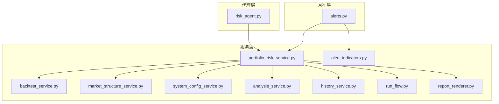
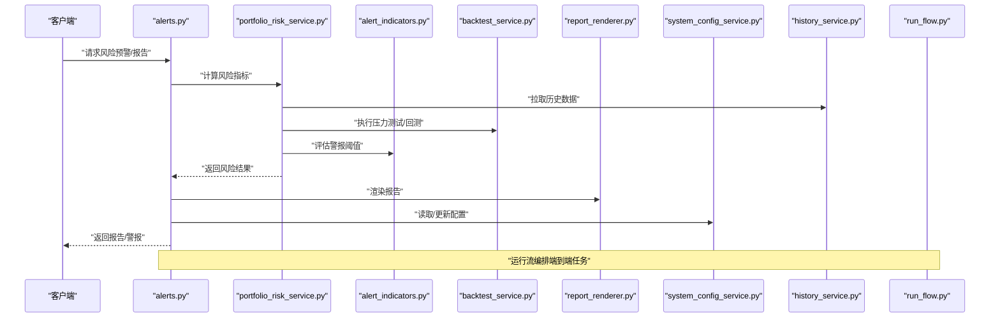
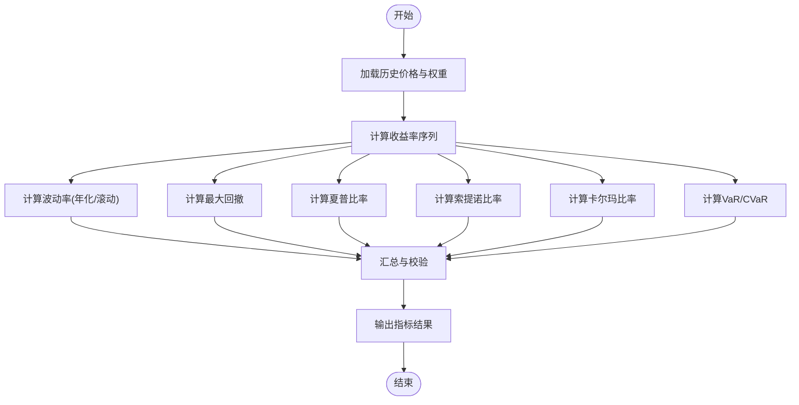
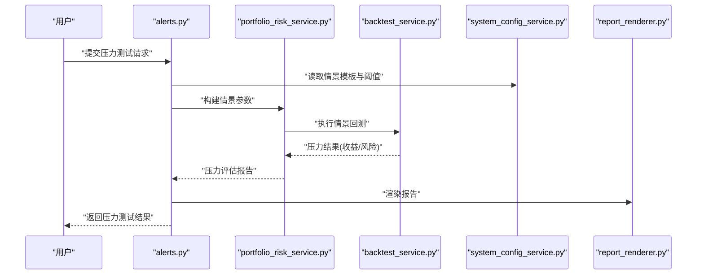
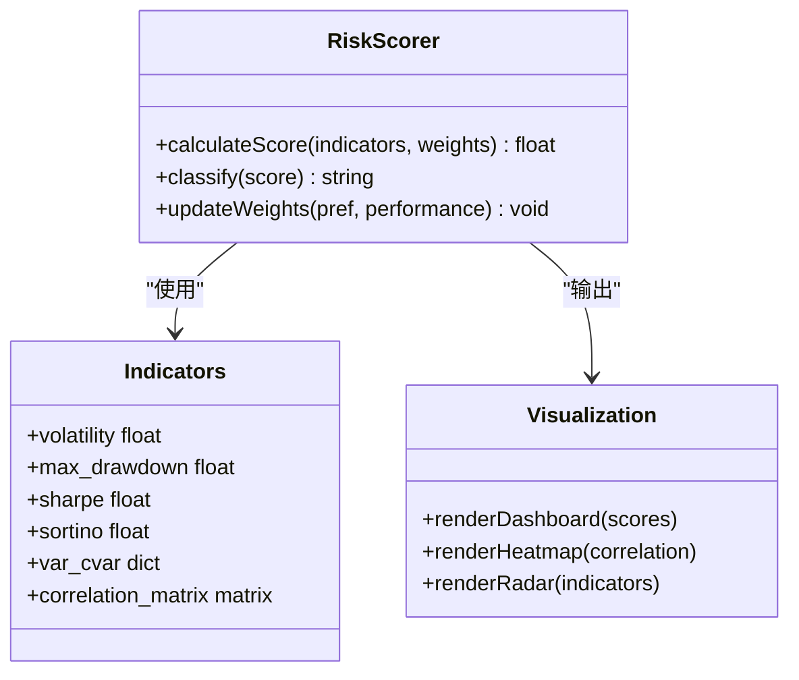
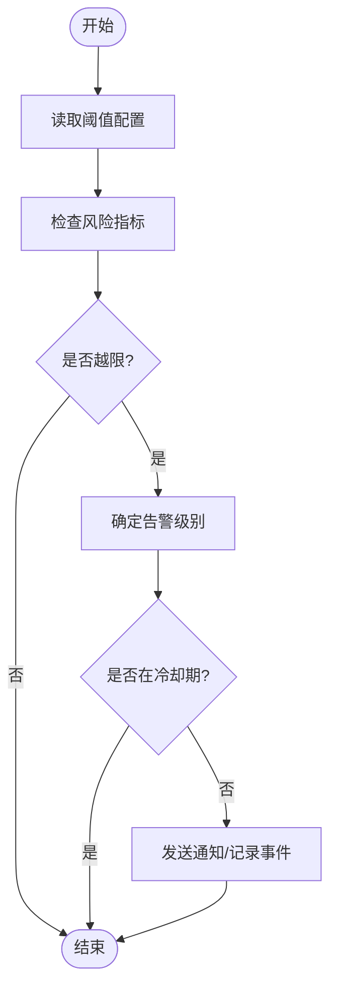
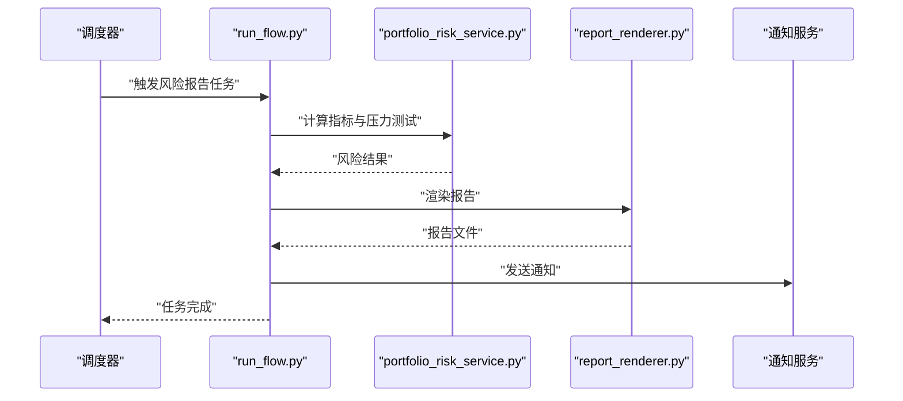
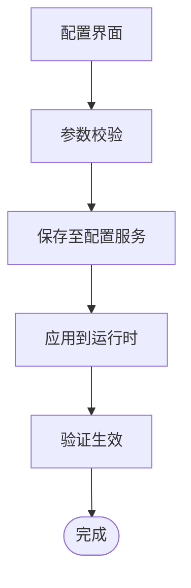
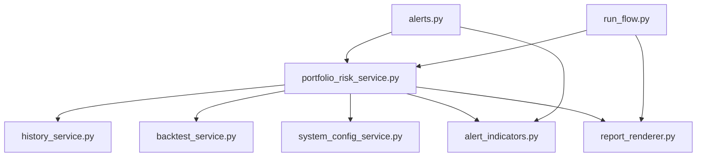

# 风险评估

<cite>
**本文引用的文件**   
- [portfolio_risk_service.py](file://src/services/portfolio_risk_service.py)
- [risk_agent.py](file://src/agent/agents/risk_agent.py)
- [alerts.py](file://api/v1/endpoints/alerts.py)
- [alert_indicators.py](file://src/services/alert_indicators.py)
- [backtest_service.py](file://src/services/backtest_service.py)
- [report_renderer.py](file://src/services/report_renderer.py)
- [system_config_service.py](file://src/services/system_config_service.py)
- [analysis_service.py](file://src/services/analysis_service.py)
- [history_service.py](file://src/services/history_service.py)
- [run_flow.py](file://src/services/run_flow.py)
- [market_structure_service.py](file://src/services/market_structure_service.py)
</cite>

## 目录
1. [简介](#简介)
2. [项目结构](#项目结构)
3. [核心组件](#核心组件)
4. [架构总览](#架构总览)
5. [详细组件分析](#详细组件分析)
6. [依赖关系分析](#依赖关系分析)
7. [性能考量](#性能考量)
8. [故障排查指南](#故障排查指南)
9. [结论](#结论)
10. [附录](#附录)

## 简介
本模块聚焦于投资组合与标的的风险评估能力，覆盖风险指标计算（波动率、最大回撤、夏普比率等）、压力测试（市场情景模拟与风险承受能力评估）、风险评分算法与可视化展示、风险预警机制与阈值配置、报告生成与历史风险分析，以及前端风险配置界面与自定义参数设置。文档旨在帮助开发者与使用者快速理解并正确使用该模块，同时提供可操作的排障建议与优化方向。

## 项目结构
风险评估相关代码主要分布在以下位置：
- 服务层：风险计算、回测、警报指标、报告渲染、系统配置、历史数据加载与分析编排等
- 代理层：风险智能体，负责策略化风险推理与决策辅助
- API 层：暴露风险相关的接口（如警报）
- 前端：Web 应用中的风险页面与配置界面（位于 apps/dsa-web/src）

图表来源
- [alerts.py:1-200](file://api/v1/endpoints/alerts.py#L1-L200)
- [portfolio_risk_service.py:1-300](file://src/services/portfolio_risk_service.py#L1-L300)
- [alert_indicators.py:1-200](file://src/services/alert_indicators.py#L1-L200)
- [backtest_service.py:1-300](file://src/services/backtest_service.py#L1-L300)
- [report_renderer.py:1-200](file://src/services/report_renderer.py#L1-L200)
- [system_config_service.py:1-200](file://src/services/system_config_service.py#L1-L200)
- [analysis_service.py:1-200](file://src/services/analysis_service.py#L1-L200)
- [history_service.py:1-200](file://src/services/history_service.py#L1-L200)
- [run_flow.py:1-200](file://src/services/run_flow.py#L1-L200)
- [market_structure_service.py:1-200](file://src/services/market_structure_service.py#L1-L200)
- [risk_agent.py:1-200](file://src/agent/agents/risk_agent.py#L1-L200)

章节来源
- [portfolio_risk_service.py:1-300](file://src/services/portfolio_risk_service.py#L1-L300)
- [risk_agent.py:1-200](file://src/agent/agents/risk_agent.py#L1-L200)
- [alerts.py:1-200](file://api/v1/endpoints/alerts.py#L1-L200)
- [alert_indicators.py:1-200](file://src/services/alert_indicators.py#L1-L200)
- [backtest_service.py:1-300](file://src/services/backtest_service.py#L1-L300)
- [report_renderer.py:1-200](file://src/services/report_renderer.py#L1-L200)
- [system_config_service.py:1-200](file://src/services/system_config_service.py#L1-L200)
- [analysis_service.py:1-200](file://src/services/analysis_service.py#L1-L200)
- [history_service.py:1-200](file://src/services/history_service.py#L1-L200)
- [run_flow.py:1-200](file://src/services/run_flow.py#L1-L200)
- [market_structure_service.py:1-200](file://src/services/market_structure_service.py#L1-L200)

## 核心组件
- 风险计算服务：聚合价格序列、组合权重与基准，计算波动率、最大回撤、夏普比率、索提诺比率、卡尔玛比率、VaR/CVaR 等关键指标，支持滚动窗口与多时间粒度。
- 警报指标服务：定义与实现风险阈值、触发条件、告警级别与冷却策略，支撑实时与批量预警。
- 回测服务：基于历史行情与策略规则进行回测，输出收益曲线、风险指标与归因分析，用于压力测试与情景模拟。
- 报告渲染服务：将风险指标、图表与文本整合为 Markdown/PDF/HTML 等多格式报告。
- 系统配置服务：管理风险阈值、压力情景模板、风险偏好与自定义参数，持久化到配置中心或环境变量。
- 分析与历史服务：提供历史数据加载、对比分析、趋势统计与回溯查询能力。
- 运行流编排：串联数据获取、指标计算、警报判定、报告生成与通知发送的端到端流程。
- 市场结构服务：识别市场阶段与结构特征，作为风险评分与压力情景的输入。
- 风险智能体：结合上下文与市场信号，给出风险评分、调整建议与干预策略。

章节来源
- [portfolio_risk_service.py:1-300](file://src/services/portfolio_risk_service.py#L1-L300)
- [alert_indicators.py:1-200](file://src/services/alert_indicators.py#L1-L200)
- [backtest_service.py:1-300](file://src/services/backtest_service.py#L1-L300)
- [report_renderer.py:1-200](file://src/services/report_renderer.py#L1-L200)
- [system_config_service.py:1-200](file://src/services/system_config_service.py#L1-L200)
- [analysis_service.py:1-200](file://src/services/analysis_service.py#L1-L200)
- [history_service.py:1-200](file://src/services/history_service.py#L1-L200)
- [run_flow.py:1-200](file://src/services/run_flow.py#L1-L200)
- [market_structure_service.py:1-200](file://src/services/market_structure_service.py#L1-L200)
- [risk_agent.py:1-200](file://src/agent/agents/risk_agent.py#L1-L200)

## 架构总览
风险评估模块采用“服务+代理+API”的分层架构：API 层暴露接口；服务层实现核心计算与编排；代理层提供智能推理与策略建议。数据流从历史与实时数据源进入，经指标计算与警报判定，最终输出报告与通知。

图表来源
- [alerts.py:1-200](file://api/v1/endpoints/alerts.py#L1-L200)
- [portfolio_risk_service.py:1-300](file://src/services/portfolio_risk_service.py#L1-L300)
- [alert_indicators.py:1-200](file://src/services/alert_indicators.py#L1-L200)
- [backtest_service.py:1-300](file://src/services/backtest_service.py#L1-L300)
- [report_renderer.py:1-200](file://src/services/report_renderer.py#L1-L200)
- [system_config_service.py:1-200](file://src/services/system_config_service.py#L1-L200)
- [history_service.py:1-200](file://src/services/history_service.py#L1-L200)
- [run_flow.py:1-200](file://src/services/run_flow.py#L1-L200)

## 详细组件分析

### 风险指标计算（波动率、最大回撤、夏普比率等）
- 波动率：基于收益率序列的标准差，支持年化与滚动窗口，考虑不同频率（日/周/月）。
- 最大回撤：累计净值曲线的峰值到谷值的最大跌幅，反映极端下行风险。
- 夏普比率：超额收益与波动率的比值，衡量单位风险下的收益效率。
- 索提诺比率：仅考虑下行波动率的夏普比率变体，更贴合投资者对下行风险的敏感度。
- 卡尔玛比率：收益与最大回撤的比值，强调回撤控制能力。
- VaR/CVaR：在给定置信水平下的潜在损失与尾部期望损失，用于量化极端风险。
- 相关性/协方差矩阵：资产间联动性分析，用于分散化与组合风险分解。

图表来源
- [portfolio_risk_service.py:1-300](file://src/services/portfolio_risk_service.py#L1-L300)
- [history_service.py:1-200](file://src/services/history_service.py#L1-L200)

章节来源
- [portfolio_risk_service.py:1-300](file://src/services/portfolio_risk_service.py#L1-L300)
- [history_service.py:1-200](file://src/services/history_service.py#L1-L200)

### 压力测试与情景模拟
- 市场情景：定义基准指数下跌、利率上行、信用利差扩大、流动性枯竭等情景参数。
- 组合冲击：按权重与相关性对组合进行损益模拟，输出压力下的风险指标变化。
- 风险承受能力：结合用户风险偏好与阈值，评估组合在压力情景下的可承受度。
- 回测驱动：使用历史回测引擎进行情景回放与稳健性检验。

图表来源
- [alerts.py:1-200](file://api/v1/endpoints/alerts.py#L1-L200)
- [portfolio_risk_service.py:1-300](file://src/services/portfolio_risk_service.py#L1-L300)
- [backtest_service.py:1-300](file://src/services/backtest_service.py#L1-L300)
- [system_config_service.py:1-200](file://src/services/system_config_service.py#L1-L200)
- [report_renderer.py:1-200](file://src/services/report_renderer.py#L1-L200)

章节来源
- [backtest_service.py:1-300](file://src/services/backtest_service.py#L1-L300)
- [portfolio_risk_service.py:1-300](file://src/services/portfolio_risk_service.py#L1-L300)
- [system_config_service.py:1-200](file://src/services/system_config_service.py#L1-L200)

### 风险评分算法与可视化
- 评分维度：波动率、最大回撤、VaR/CVaR、夏普/索提诺比率、相关性集中度、市场结构信号。
- 权重分配：根据用户风险偏好与历史表现动态调整各维度权重。
- 评分模型：加权线性或非线性映射，输出综合风险分数与等级（低/中/高）。
- 可视化：仪表盘、热力图、雷达图、时序曲线与对比柱状图，便于直观解读。

图表来源
- [portfolio_risk_service.py:1-300](file://src/services/portfolio_risk_service.py#L1-L300)
- [analysis_service.py:1-200](file://src/services/analysis_service.py#L1-L200)

章节来源
- [portfolio_risk_service.py:1-300](file://src/services/portfolio_risk_service.py#L1-L300)
- [analysis_service.py:1-200](file://src/services/analysis_service.py#L1-L200)

### 风险预警机制与阈值设置
- 阈值管理：支持全局与组合级阈值，包括波动率上限、回撤限制、VaR 限额、夏普下限等。
- 触发逻辑：单指标越限、复合条件（AND/OR）、持续时长与冷却期控制。
- 告警级别：信息、警告、严重，对应不同的处理流程与通知渠道。
- 集成方式：通过警报指标服务统一判定，API 层对外暴露查询与订阅接口。

图表来源
- [alert_indicators.py:1-200](file://src/services/alert_indicators.py#L1-L200)
- [system_config_service.py:1-200](file://src/services/system_config_service.py#L1-L200)
- [alerts.py:1-200](file://api/v1/endpoints/alerts.py#L1-L200)

章节来源
- [alert_indicators.py:1-200](file://src/services/alert_indicators.py#L1-L200)
- [system_config_service.py:1-200](file://src/services/system_config_service.py#L1-L200)
- [alerts.py:1-200](file://api/v1/endpoints/alerts.py#L1-L200)

### 风险报告生成与历史风险分析
- 报告内容：风险指标摘要、压力测试结果、评分与等级、警报事件、建议与行动项。
- 多格式输出：Markdown、PDF、HTML，适配不同阅读场景。
- 历史分析：时间序列对比、滚动指标趋势、跨组合比较与归因分析。
- 自动化：定时任务触发，结合运行流编排与通知推送。

图表来源
- [run_flow.py:1-200](file://src/services/run_flow.py#L1-L200)
- [portfolio_risk_service.py:1-300](file://src/services/portfolio_risk_service.py#L1-L300)
- [report_renderer.py:1-200](file://src/services/report_renderer.py#L1-L200)

章节来源
- [report_renderer.py:1-200](file://src/services/report_renderer.py#L1-L200)
- [run_flow.py:1-200](file://src/services/run_flow.py#L1-L200)
- [history_service.py:1-200](file://src/services/history_service.py#L1-L200)

### 风险配置界面与自定义参数设置
- 配置项：风险偏好、阈值、压力情景模板、评分权重、通知渠道。
- 界面交互：表单编辑、实时校验、版本管理与回滚。
- 持久化：配置服务统一管理，支持环境变量与数据库存储。
- 权限控制：角色与访问控制，确保配置安全。

图表来源
- [system_config_service.py:1-200](file://src/services/system_config_service.py#L1-L200)
- [analysis_service.py:1-200](file://src/services/analysis_service.py#L1-L200)

章节来源
- [system_config_service.py:1-200](file://src/services/system_config_service.py#L1-L200)
- [analysis_service.py:1-200](file://src/services/analysis_service.py#L1-L200)

## 依赖关系分析
- 内部依赖：风险计算依赖历史数据服务与回测服务；警报指标依赖配置服务；报告渲染依赖风险结果与模板。
- 外部依赖：数据源（行情/基本面）、通知渠道（邮件/IM/短信）、存储（配置/日志/报告文件）。
- 耦合与内聚：服务层职责清晰，通过接口解耦；代理层增强推理能力但不侵入核心计算。
- 循环依赖：通过分层与接口避免循环引用，确保模块稳定性。

图表来源
- [portfolio_risk_service.py:1-300](file://src/services/portfolio_risk_service.py#L1-L300)
- [history_service.py:1-200](file://src/services/history_service.py#L1-L200)
- [backtest_service.py:1-300](file://src/services/backtest_service.py#L1-L300)
- [system_config_service.py:1-200](file://src/services/system_config_service.py#L1-L200)
- [alert_indicators.py:1-200](file://src/services/alert_indicators.py#L1-L200)
- [report_renderer.py:1-200](file://src/services/report_renderer.py#L1-L200)
- [alerts.py:1-200](file://api/v1/endpoints/alerts.py#L1-L200)
- [run_flow.py:1-200](file://src/services/run_flow.py#L1-L200)

章节来源
- [portfolio_risk_service.py:1-300](file://src/services/portfolio_risk_service.py#L1-L300)
- [alerts.py:1-200](file://api/v1/endpoints/alerts.py#L1-L200)
- [run_flow.py:1-200](file://src/services/run_flow.py#L1-L200)

## 性能考量
- 数据加载：批量拉取与缓存策略，减少重复请求与网络开销。
- 指标计算：向量化运算与并行处理，提升大规模组合计算效率。
- 回测引擎：增量回测与快照恢复，缩短重算时间。
- 警报判定：滑动窗口与状态机，降低频繁触发与误报。
- 报告渲染：异步生成与分页输出，避免阻塞主流程。

[本节为通用指导，不直接分析具体文件]

## 故障排查指南
- 数据缺失：检查历史数据加载服务的可用性与完整性，确认时间窗口与标的映射。
- 指标异常：核对收益率计算与年化因子，检查权重与相关性矩阵的合法性。
- 警报误报：查看阈值配置与冷却期设置，确认触发条件与告警级别。
- 回测失败：检查情景参数与策略规则，验证数据源与回测引擎配置。
- 报告渲染错误：确认模板与依赖库，检查输出路径与权限。

章节来源
- [history_service.py:1-200](file://src/services/history_service.py#L1-L200)
- [alert_indicators.py:1-200](file://src/services/alert_indicators.py#L1-L200)
- [backtest_service.py:1-300](file://src/services/backtest_service.py#L1-L300)
- [report_renderer.py:1-200](file://src/services/report_renderer.py#L1-L200)

## 结论
风险评估模块以清晰的服务分层与灵活的配置体系，提供了完整的风险计算、压力测试、评分与预警能力。通过历史数据分析与报告生成，帮助用户全面把握组合风险状况并做出及时决策。建议在部署时关注数据质量与性能优化，并结合业务需求定制阈值与情景模板。

[本节为总结性内容，不直接分析具体文件]

## 附录
- 术语表：波动率、最大回撤、夏普比率、索提诺比率、卡尔玛比率、VaR/CVaR、压力测试、风险评分、警报阈值。
- 最佳实践：定期校准阈值、监控数据新鲜度、分阶段上线压力测试、建立回滚机制。
- 扩展方向：引入机器学习风险预测、动态权重调整、多因子风险模型。

[本节为补充信息，不直接分析具体文件]