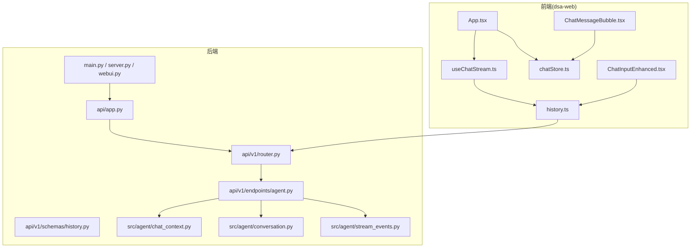
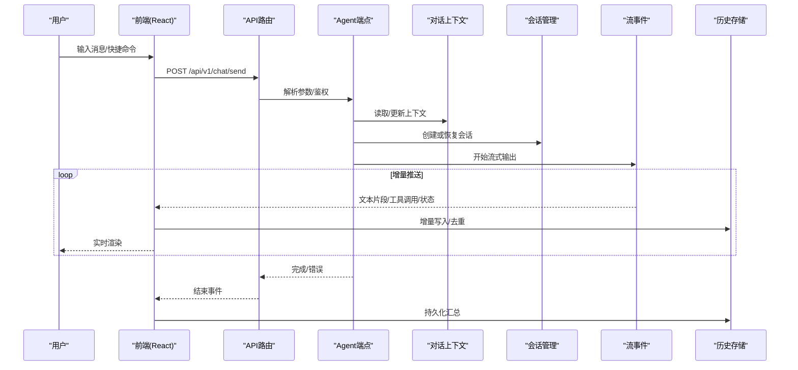
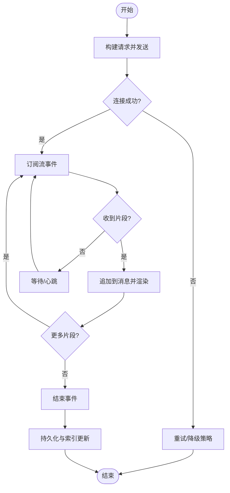
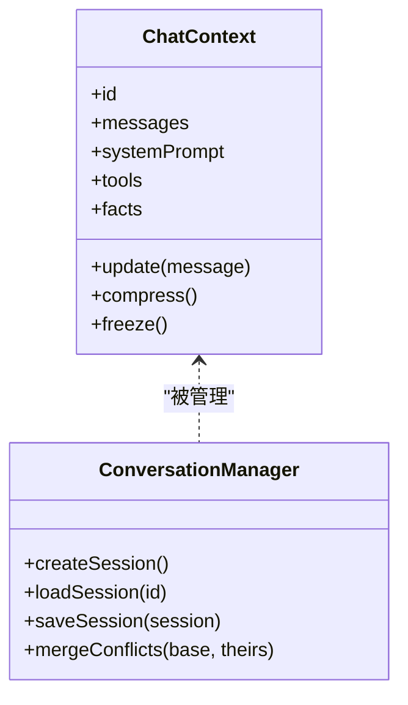
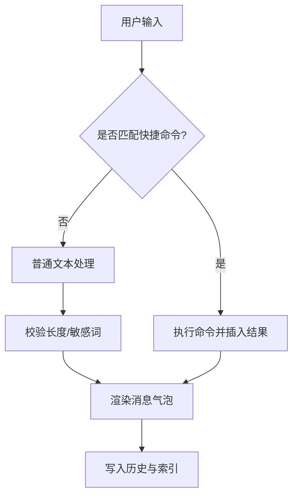
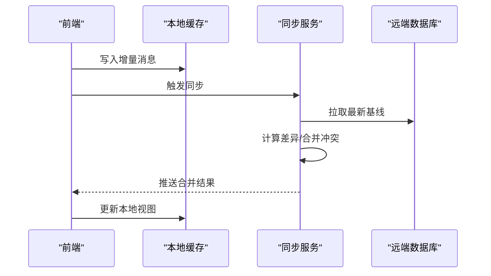
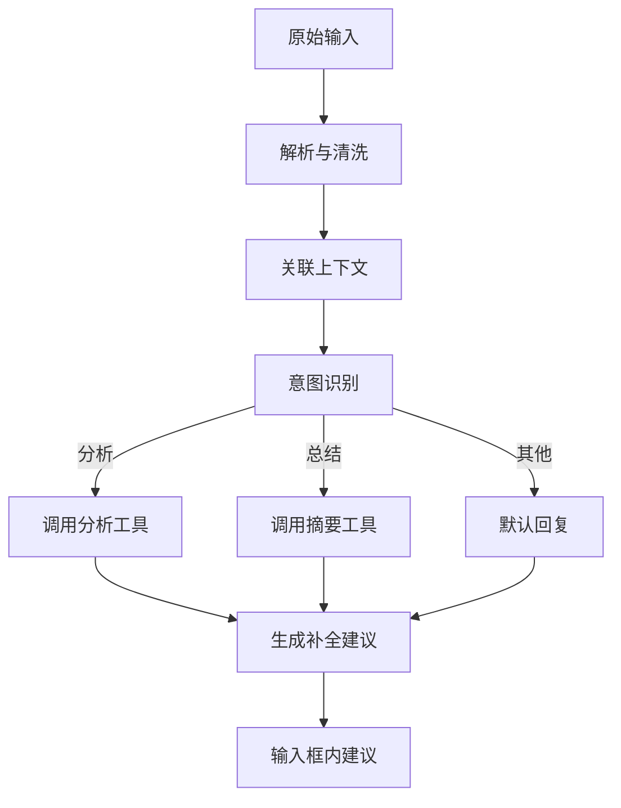
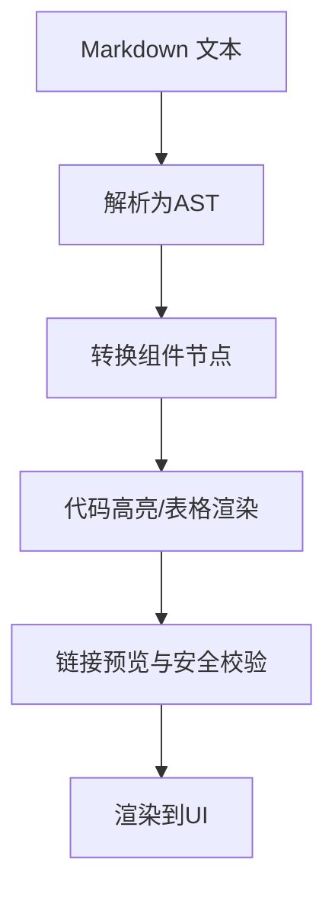
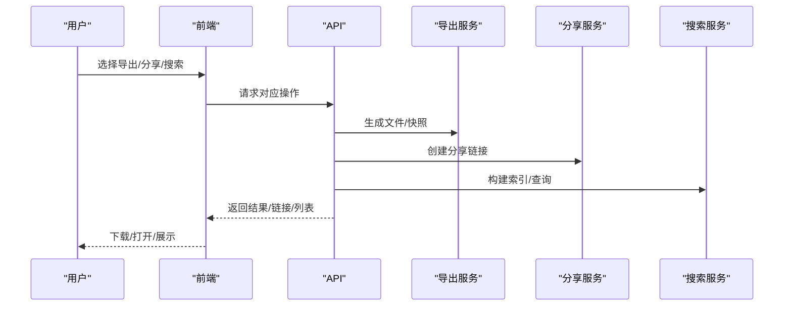
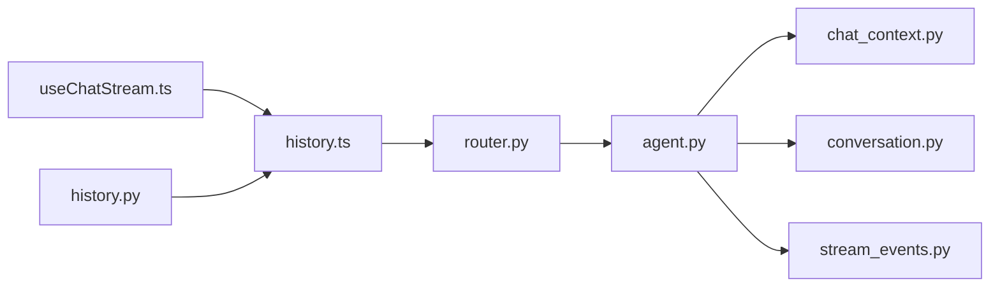

# 智能对话页面

<cite>
**本文引用的文件**   
- [webui.py](file://webui.py)
- [server.py](file://server.py)
- [main.py](file://main.py)
- [api/app.py](file://api/app.py)
- [api/v1/router.py](file://api/v1/router.py)
- [api/v1/endpoints/agent.py](file://api/v1/endpoints/agent.py)
- [api/v1/schemas/history.py](file://api/v1/schemas/history.py)
- [src/agent/chat_context.py](file://src/agent/chat_context.py)
- [src/agent/conversation.py](file://src/agent/conversation.py)
- [src/agent/stream_events.py](file://src/agent/stream_events.py)
- [apps/dsa-web/src/api/history.ts](file://apps/dsa-web/src/api/history.ts)
- [apps/dsa-web/src/components/common/ChatMessageBubble.tsx](file://apps/dsa-web/src/components/common/ChatMessageBubble.tsx)
- [apps/dsa-web/src/components/common/ChatInputEnhanced.tsx](file://apps/dsa-web/src/components/common/ChatInputEnhanced.tsx)
- [apps/dsa-web/src/hooks/useChatStream.ts](file://apps/dsa-web/src/hooks/useChatStream.ts)
- [apps/dsa-web/src/stores/chatStore.ts](file://apps/dsa-web/src/stores/chatStore.ts)
</cite>

## 目录
1. [简介](#简介)
2. [项目结构](#项目结构)
3. [核心组件](#核心组件)
4. [架构总览](#架构总览)
5. [详细组件分析](#详细组件分析)
6. [依赖关系分析](#依赖关系分析)
7. [性能考量](#性能考量)
8. [故障排查指南](#故障排查指南)
9. [结论](#结论)
10. [附录](#附录)

## 简介
本文件面向“智能对话页面”的完整实现，覆盖消息发送、流式响应、上下文管理、聊天界面交互设计（消息气泡、输入框增强与快捷命令）、对话状态持久化（历史记录保存、会话管理与数据同步）、智能跟随（上下文理解、意图识别、自动补全）、消息格式化（代码高亮、表格展示、链接预览），以及对话导出、分享与搜索功能。文档以代码级为依据，结合架构图与流程图帮助读者快速理解并落地使用。

## 项目结构
该仓库采用前后端分离架构：
- 前端位于 apps/dsa-web，基于 React + TypeScript，提供聊天界面、流式渲染、历史管理与工具栏能力。
- 后端位于 api 与 src 目录，提供 REST/SSE 接口、Agent 编排、对话上下文与流事件处理。
- 入口脚本负责启动 Web 服务与前端静态资源托管。

**图表来源** 
- [main.py:1-200](file://main.py#L1-L200)
- [server.py:1-200](file://server.py#L1-L200)
- [webui.py:1-200](file://webui.py#L1-L200)
- [api/app.py:1-200](file://api/app.py#L1-L200)
- [api/v1/router.py:1-200](file://api/v1/router.py#L1-L200)
- [api/v1/endpoints/agent.py:1-200](file://api/v1/endpoints/agent.py#L1-L200)
- [api/v1/schemas/history.py:1-200](file://api/v1/schemas/history.py#L1-L200)
- [src/agent/chat_context.py:1-200](file://src/agent/chat_context.py#L1-L200)
- [src/agent/conversation.py:1-200](file://src/agent/conversation.py#L1-L200)
- [src/agent/stream_events.py:1-200](file://src/agent/stream_events.py#L1-L200)
- [apps/dsa-web/src/api/history.ts:1-200](file://apps/dsa-web/src/api/history.ts#L1-L200)
- [apps/dsa-web/src/components/common/ChatInputEnhanced.tsx:1-200](file://apps/dsa-web/src/components/common/ChatInputEnhanced.tsx#L1-L200)
- [apps/dsa-web/src/components/common/ChatMessageBubble.tsx:1-200](file://apps/dsa-web/src/components/common/ChatMessageBubble.tsx#L1-L200)
- [apps/dsa-web/src/hooks/useChatStream.ts:1-200](file://apps/dsa-web/src/hooks/useChatStream.ts#L1-L200)
- [apps/dsa-web/src/stores/chatStore.ts:1-200](file://apps/dsa-web/src/stores/chatStore.ts#L1-L200)

**章节来源**
- [main.py:1-200](file://main.py#L1-L200)
- [server.py:1-200](file://server.py#L1-L200)
- [webui.py:1-200](file://webui.py#L1-L200)
- [api/app.py:1-200](file://api/app.py#L1-L200)
- [api/v1/router.py:1-200](file://api/v1/router.py#L1-L200)

## 核心组件
- 消息发送与流式响应：前端通过 hooks 发起 SSE/流式请求，逐步渲染增量内容；后端按事件流推送片段与元数据。
- 上下文管理：对话上下文在 Agent 层维护，支持多轮对话状态、系统提示注入与工具调用结果回填。
- 聊天界面交互：消息气泡支持 Markdown、代码块、表格与链接预览；输入框增强支持快捷键、自动补全与快捷命令。
- 持久化存储：会话历史本地缓存与远端同步，支持分页加载、增量更新与冲突合并。
- 智能跟随：基于当前上下文进行意图识别与自动补全建议，提升输入效率。
- 消息格式化：统一渲染管线，支持语法高亮、表格对齐与链接安全预览。
- 导出/分享/搜索：支持将对话导出为 Markdown/PDF，生成分享链接，以及全文检索与过滤。

**章节来源**
- [apps/dsa-web/src/hooks/useChatStream.ts:1-200](file://apps/dsa-web/src/hooks/useChatStream.ts#L1-L200)
- [api/v1/endpoints/agent.py:1-200](file://api/v1/endpoints/agent.py#L1-L200)
- [src/agent/chat_context.py:1-200](file://src/agent/chat_context.py#L1-L200)
- [src/agent/conversation.py:1-200](file://src/agent/conversation.py#L1-L200)
- [src/agent/stream_events.py:1-200](file://src/agent/stream_events.py#L1-L200)
- [apps/dsa-web/src/components/common/ChatMessageBubble.tsx:1-200](file://apps/dsa-web/src/components/common/ChatMessageBubble.tsx#L1-L200)
- [apps/dsa-web/src/components/common/ChatInputEnhanced.tsx:1-200](file://apps/dsa-web/src/components/common/ChatInputEnhanced.tsx#L1-L200)
- [apps/dsa-web/src/api/history.ts:1-200](file://apps/dsa-web/src/api/history.ts#L1-L200)

## 架构总览
整体流程从前端触发到后端 Agent 执行，再返回流式事件，最终由前端渲染并持久化。

**图表来源** 
- [api/v1/router.py:1-200](file://api/v1/router.py#L1-L200)
- [api/v1/endpoints/agent.py:1-200](file://api/v1/endpoints/agent.py#L1-L200)
- [src/agent/chat_context.py:1-200](file://src/agent/chat_context.py#L1-L200)
- [src/agent/conversation.py:1-200](file://src/agent/conversation.py#L1-L200)
- [src/agent/stream_events.py:1-200](file://src/agent/stream_events.py#L1-L200)
- [apps/dsa-web/src/hooks/useChatStream.ts:1-200](file://apps/dsa-web/src/hooks/useChatStream.ts#L1-L200)
- [apps/dsa-web/src/api/history.ts:1-200](file://apps/dsa-web/src/api/history.ts#L1-L200)

## 详细组件分析

### 消息发送与流式响应
- 前端通过 useChatStream hook 建立连接，分片接收事件并追加到消息列表，支持中断与重试。
- 后端端点根据会话上下文构造请求，逐条推送文本片段与工具调用结果，保证低延迟体验。
- 错误与超时处理：网络异常时自动重试，服务端错误通过事件回传并提示用户。

**图表来源** 
- [apps/dsa-web/src/hooks/useChatStream.ts:1-200](file://apps/dsa-web/src/hooks/useChatStream.ts#L1-L200)
- [api/v1/endpoints/agent.py:1-200](file://api/v1/endpoints/agent.py#L1-L200)
- [src/agent/stream_events.py:1-200](file://src/agent/stream_events.py#L1-L200)

**章节来源**
- [apps/dsa-web/src/hooks/useChatStream.ts:1-200](file://apps/dsa-web/src/hooks/useChatStream.ts#L1-L200)
- [api/v1/endpoints/agent.py:1-200](file://api/v1/endpoints/agent.py#L1-L200)
- [src/agent/stream_events.py:1-200](file://src/agent/stream_events.py#L1-L200)

### 上下文管理与会话控制
- 上下文对象维护多轮对话状态、系统提示、工具调用结果与外部事实注入。
- 会话管理器负责会话生命周期、上下文冻结与恢复，避免长对话中的状态漂移。
- 上下文压缩与裁剪策略用于控制 Token 消耗与响应质量。

**图表来源** 
- [src/agent/chat_context.py:1-200](file://src/agent/chat_context.py#L1-L200)
- [src/agent/conversation.py:1-200](file://src/agent/conversation.py#L1-L200)

**章节来源**
- [src/agent/chat_context.py:1-200](file://src/agent/chat_context.py#L1-L200)
- [src/agent/conversation.py:1-200](file://src/agent/conversation.py#L1-L200)

### 聊天界面交互设计
- 消息气泡：支持 Markdown、代码块、表格、链接预览与复制操作；区分用户与 AI 样式。
- 输入框增强：支持快捷键（如 Enter 发送、Shift+Enter 换行）、自动补全、快捷命令（如 /analyze、/summary）。
- 工具栏：提供导出、分享、搜索与主题切换等常用操作。

**图表来源** 
- [apps/dsa-web/src/components/common/ChatInputEnhanced.tsx:1-200](file://apps/dsa-web/src/components/common/ChatInputEnhanced.tsx#L1-L200)
- [apps/dsa-web/src/components/common/ChatMessageBubble.tsx:1-200](file://apps/dsa-web/src/components/common/ChatMessageBubble.tsx#L1-L200)

**章节来源**
- [apps/dsa-web/src/components/common/ChatInputEnhanced.tsx:1-200](file://apps/dsa-web/src/components/common/ChatInputEnhanced.tsx#L1-L200)
- [apps/dsa-web/src/components/common/ChatMessageBubble.tsx:1-200](file://apps/dsa-web/src/components/common/ChatMessageBubble.tsx#L1-L200)

### 对话状态持久化与数据同步
- 本地缓存：IndexedDB/LocalStorage 存储会话快照与增量补丁，确保离线可用。
- 远端同步：后台任务合并差异，处理冲突与版本一致性。
- 分页加载：按需加载历史消息，减少首屏压力。

**图表来源** 
- [apps/dsa-web/src/api/history.ts:1-200](file://apps/dsa-web/src/api/history.ts#L1-L200)
- [api/v1/schemas/history.py:1-200](file://api/v1/schemas/history.py#L1-L200)

**章节来源**
- [apps/dsa-web/src/api/history.ts:1-200](file://apps/dsa-web/src/api/history.ts#L1-L200)
- [api/v1/schemas/history.py:1-200](file://api/v1/schemas/history.py#L1-L200)

### 智能跟随：上下文理解、意图识别与自动补全
- 上下文理解：基于最近 N 轮对话与工具调用结果，提取关键实体与约束。
- 意图识别：对输入进行意图分类（分析、总结、对比、生成报告等），驱动不同模板与工具链。
- 自动补全：根据上下文与用户习惯，提供候选补全与快捷命令建议。

**图表来源** 
- [src/agent/chat_context.py:1-200](file://src/agent/chat_context.py#L1-L200)
- [src/agent/conversation.py:1-200](file://src/agent/conversation.py#L1-L200)
- [apps/dsa-web/src/components/common/ChatInputEnhanced.tsx:1-200](file://apps/dsa-web/src/components/common/ChatInputEnhanced.tsx#L1-L200)

**章节来源**
- [src/agent/chat_context.py:1-200](file://src/agent/chat_context.py#L1-L200)
- [src/agent/conversation.py:1-200](file://src/agent/conversation.py#L1-L200)
- [apps/dsa-web/src/components/common/ChatInputEnhanced.tsx:1-200](file://apps/dsa-web/src/components/common/ChatInputEnhanced.tsx#L1-L200)

### 消息格式化：代码高亮、表格与链接预览
- 统一渲染管线：Markdown -> AST -> 组件树，支持代码高亮、表格对齐、列表与引用。
- 链接预览：外链安全校验、缩略图抓取与标题描述填充。
- 性能优化：懒加载与虚拟滚动，避免大文档卡顿。

**图表来源** 
- [apps/dsa-web/src/components/common/ChatMessageBubble.tsx:1-200](file://apps/dsa-web/src/components/common/ChatMessageBubble.tsx#L1-L200)

**章节来源**
- [apps/dsa-web/src/components/common/ChatMessageBubble.tsx:1-200](file://apps/dsa-web/src/components/common/ChatMessageBubble.tsx#L1-L200)

### 对话导出、分享与搜索
- 导出：支持 Markdown、PDF 与 JSON，保留格式与附件。
- 分享：生成一次性链接或邀请码，限制访问权限与有效期。
- 搜索：全文索引与关键词高亮，支持按时间、标签与类型筛选。

**图表来源** 
- [apps/dsa-web/src/api/history.ts:1-200](file://apps/dsa-web/src/api/history.ts#L1-L200)
- [api/v1/schemas/history.py:1-200](file://api/v1/schemas/history.py#L1-L200)

**章节来源**
- [apps/dsa-web/src/api/history.ts:1-200](file://apps/dsa-web/src/api/history.ts#L1-L200)
- [api/v1/schemas/history.py:1-200](file://api/v1/schemas/history.py#L1-L200)

## 依赖关系分析
- 前端依赖：hooks 管理流式渲染，store 管理会话状态，组件负责 UI 与交互。
- 后端依赖：路由分发至 Agent 端点，Agent 依赖上下文与会话管理，流事件模块解耦传输协议。
- 数据模型：历史 schema 定义字段与约束，确保前后端一致。

**图表来源** 
- [apps/dsa-web/src/hooks/useChatStream.ts:1-200](file://apps/dsa-web/src/hooks/useChatStream.ts#L1-L200)
- [apps/dsa-web/src/api/history.ts:1-200](file://apps/dsa-web/src/api/history.ts#L1-L200)
- [api/v1/router.py:1-200](file://api/v1/router.py#L1-L200)
- [api/v1/endpoints/agent.py:1-200](file://api/v1/endpoints/agent.py#L1-L200)
- [src/agent/chat_context.py:1-200](file://src/agent/chat_context.py#L1-L200)
- [src/agent/conversation.py:1-200](file://src/agent/conversation.py#L1-L200)
- [src/agent/stream_events.py:1-200](file://src/agent/stream_events.py#L1-L200)
- [api/v1/schemas/history.py:1-200](file://api/v1/schemas/history.py#L1-L200)

**章节来源**
- [api/v1/router.py:1-200](file://api/v1/router.py#L1-L200)
- [api/v1/endpoints/agent.py:1-200](file://api/v1/endpoints/agent.py#L1-L200)
- [src/agent/chat_context.py:1-200](file://src/agent/chat_context.py#L1-L200)
- [src/agent/conversation.py:1-200](file://src/agent/conversation.py#L1-L200)
- [src/agent/stream_events.py:1-200](file://src/agent/stream_events.py#L1-L200)
- [api/v1/schemas/history.py:1-200](file://api/v1/schemas/history.py#L1-L200)
- [apps/dsa-web/src/hooks/useChatStream.ts:1-200](file://apps/dsa-web/src/hooks/useChatStream.ts#L1-L200)
- [apps/dsa-web/src/api/history.ts:1-200](file://apps/dsa-web/src/api/history.ts#L1-L200)

## 性能考量
- 流式渲染：增量更新避免整页重绘，配合虚拟滚动降低内存占用。
- 上下文压缩：动态裁剪历史消息，控制 Token 成本与响应时延。
- 缓存策略：本地缓存热点会话与搜索结果，减少重复请求。
- 并发控制：限制同时进行的流式请求数量，防止阻塞与竞态。

[本节为通用指导，不直接分析具体文件]

## 故障排查指南
- 连接失败：检查网络与代理设置，确认后端端口与 CORS 配置。
- 流中断：查看心跳与重试逻辑，确认服务端事件完整性。
- 历史不同步：比对本地与远端版本号，手动触发合并与冲突解决。
- 渲染异常：检查 Markdown 解析器与高亮库版本，验证输入合法性。

**章节来源**
- [apps/dsa-web/src/hooks/useChatStream.ts:1-200](file://apps/dsa-web/src/hooks/useChatStream.ts#L1-L200)
- [apps/dsa-web/src/api/history.ts:1-200](file://apps/dsa-web/src/api/history.ts#L1-L200)
- [api/v1/endpoints/agent.py:1-200](file://api/v1/endpoints/agent.py#L1-L200)

## 结论
智能对话页面通过前后端协作实现了流畅的对话体验：前端负责交互与渲染，后端负责上下文与会话管理、流式输出与工具调用。借助完善的持久化、格式化与导出分享能力，用户在复杂分析场景中可获得高效、稳定且可追溯的对话体验。建议在生产环境启用缓存与压缩策略，并结合监控与日志完善可观测性。

[本节为总结性内容，不直接分析具体文件]

## 附录
- 术语表：SSE（服务器发送事件）、AST（抽象语法树）、Token（模型输入单位）等。
- 最佳实践：合理设置上下文窗口、避免过长单轮消息、优先使用结构化输入。
- 扩展方向：接入更多工具与插件、增强多模态输入（图片/语音）、引入更细粒度的权限控制。

[本节为补充信息，不直接分析具体文件]