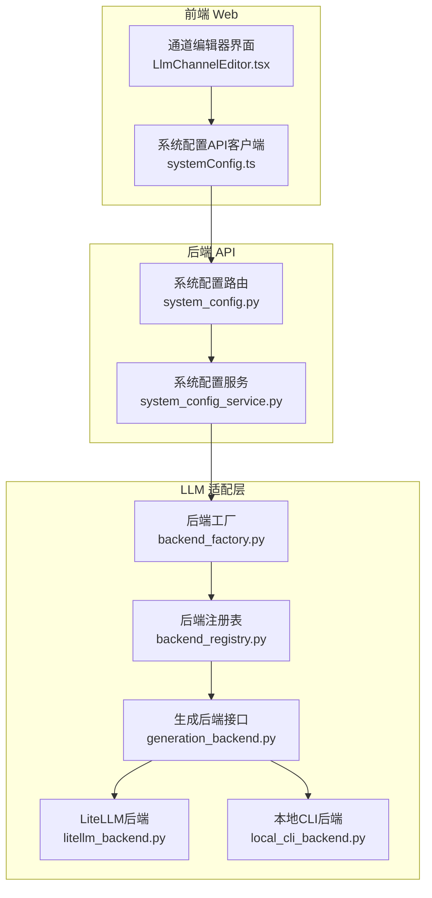
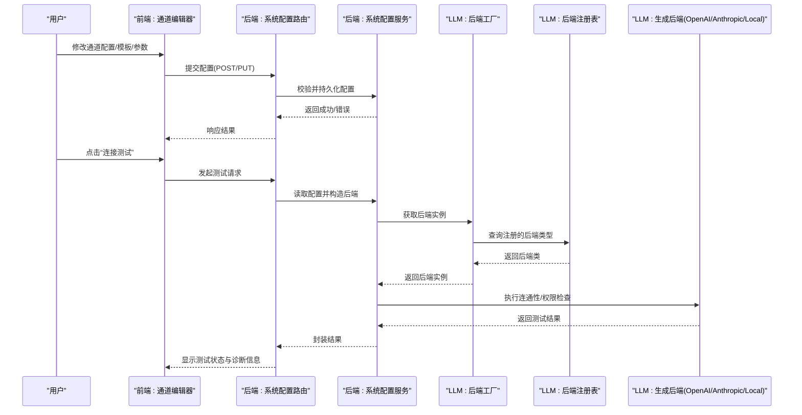
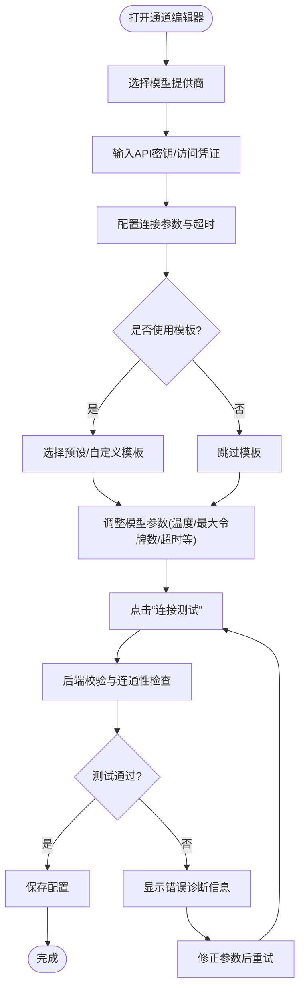
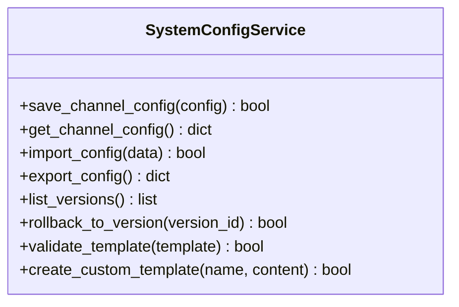
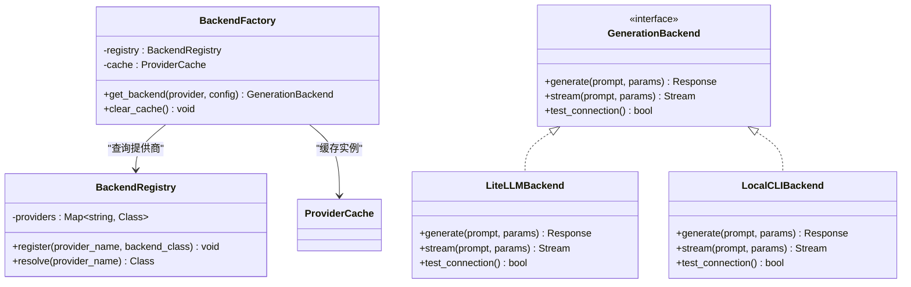
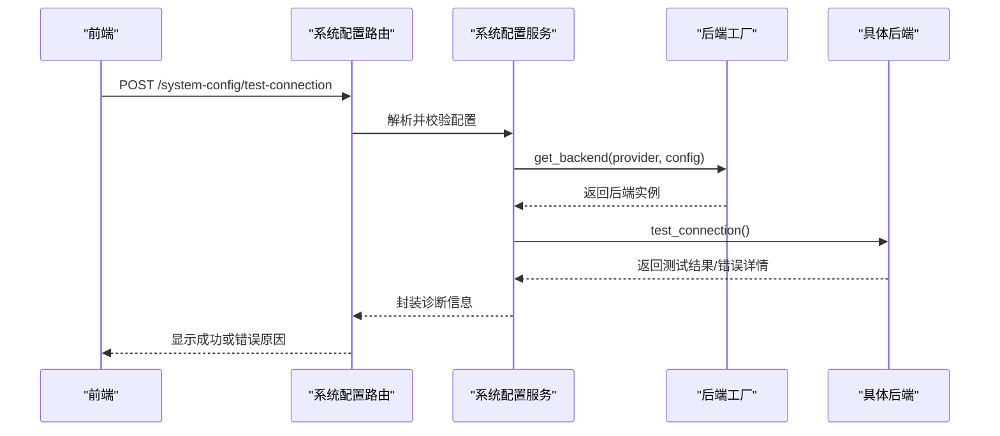
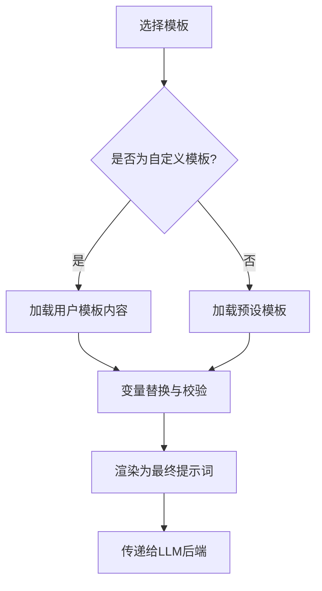
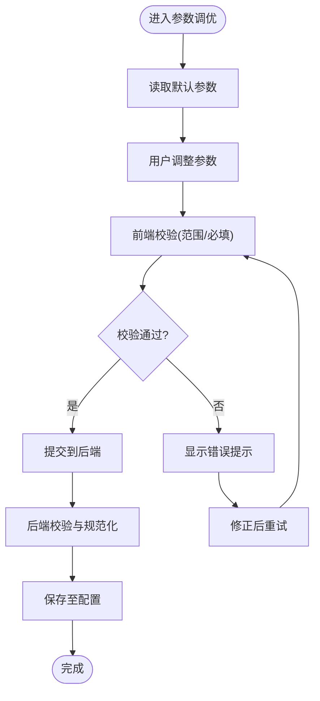
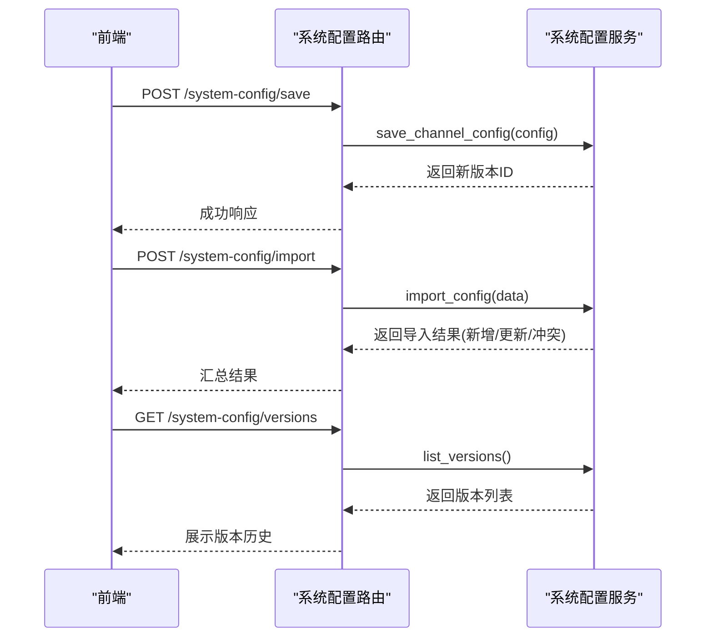
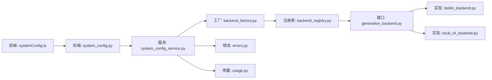

# LLM通道编辑器

<cite>
**本文引用的文件**   
- [src/llm/backend_factory.py](file://src/llm/backend_factory.py)
- [src/llm/backend_registry.py](file://src/llm/backend_registry.py)
- [src/llm/generation_backend.py](file://src/llm/generation_backend.py)
- [src/llm/litellm_backend.py](file://src/llm/litellm_backend.py)
- [src/llm/local_cli_backend.py](file://src/llm/local_cli_backend.py)
- [src/llm/errors.py](file://src/llm/errors.py)
- [src/llm/generation_params.py](file://src/llm/generation_params.py)
- [src/llm/provider_cache.py](file://src/llm/provider_cache.py)
- [src/llm/usage.py](file://src/llm/usage.py)
- [src/services/system_config_service.py](file://src/services/system_config_service.py)
- [api/v1/endpoints/system_config.py](file://api/v1/endpoints/system_config.py)
- [api/v1/schemas/system_config.py](file://api/v1/schemas/system_config.py)
- [apps/dsa-web/src/api/systemConfig.ts](file://apps/dsa-web/src/api/systemConfig.ts)
- [apps/dsa-web/src/components/common/LlmChannelEditor.tsx](file://apps/dsa-web/src/components/common/LlmChannelEditor.tsx)
- [docs/LLM_CONFIG_GUIDE_EN.md](file://docs/LLM_CONFIG_GUIDE_EN.md)
- [docs/llm-providers.md](file://docs/llm-providers.md)
</cite>

## 目录
1. [简介](#简介)
2. [项目结构](#项目结构)
3. [核心组件](#核心组件)
4. [架构总览](#架构总览)
5. [详细组件分析](#详细组件分析)
6. [依赖关系分析](#依赖关系分析)
7. [性能考量](#性能考量)
8. [故障排除指南](#故障排除指南)
9. [结论](#结论)
10. [附录](#附录)

## 简介
本文件面向“大语言模型通道编辑器”的使用者与开发者，系统性说明配置界面与后端能力：模型提供商选择（OpenAI、Anthropic、本地模型等）、API密钥管理与连接参数配置；模板系统（预设与自定义）；连接测试（实时验证连通性与权限检查）；模型参数调优（温度、最大令牌数、超时等）；配置的保存、导入导出与版本管理；以及错误诊断与排障。文档同时给出架构图、流程图与类图，帮助不同技术背景的读者快速上手与深入理解。

## 项目结构
本项目采用前后端分离架构：
- 前端（Web UI）提供通道编辑界面、模板管理、连接测试与参数调优交互。
- 后端（FastAPI）暴露系统配置与LLM通道相关API，负责校验、持久化、路由到具体LLM后端。
- LLM层通过统一抽象与注册机制，支持多种提供商与本地CLI后端。

**图表来源** 
- [apps/dsa-web/src/components/common/LlmChannelEditor.tsx](file://apps/dsa-web/src/components/common/LlmChannelEditor.tsx)
- [apps/dsa-web/src/api/systemConfig.ts](file://apps/dsa-web/src/api/systemConfig.ts)
- [api/v1/endpoints/system_config.py](file://api/v1/endpoints/system_config.py)
- [src/services/system_config_service.py](file://src/services/system_config_service.py)
- [src/llm/backend_factory.py](file://src/llm/backend_factory.py)
- [src/llm/backend_registry.py](file://src/llm/backend_registry.py)
- [src/llm/generation_backend.py](file://src/llm/generation_backend.py)
- [src/llm/litellm_backend.py](file://src/llm/litellm_backend.py)
- [src/llm/local_cli_backend.py](file://src/llm/local_cli_backend.py)

**章节来源**
- [apps/dsa-web/src/components/common/LlmChannelEditor.tsx](file://apps/dsa-web/src/components/common/LlmChannelEditor.tsx)
- [apps/dsa-web/src/api/systemConfig.ts](file://apps/dsa-web/src/api/systemConfig.ts)
- [api/v1/endpoints/system_config.py](file://api/v1/endpoints/system_config.py)
- [src/services/system_config_service.py](file://src/services/system_config_service.py)
- [src/llm/backend_factory.py](file://src/llm/backend_factory.py)
- [src/llm/backend_registry.py](file://src/llm/backend_registry.py)
- [src/llm/generation_backend.py](file://src/llm/generation_backend.py)
- [src/llm/litellm_backend.py](file://src/llm/litellm_backend.py)
- [src/llm/local_cli_backend.py](file://src/llm/local_cli_backend.py)

## 核心组件
- 通道编辑器UI：提供提供商选择、密钥输入、连接参数、模板选择与自定义、连接测试、参数调优、保存/导入导出/版本管理。
- 系统配置服务：负责配置的校验、持久化、版本管理、导入导出。
- LLM后端工厂与注册表：根据配置动态创建并缓存对应后端实例。
- 生成后端接口与实现：统一抽象调用流程，支持OpenAI、Anthropic、本地CLI等。
- 错误处理与使用统计：标准化异常与用量追踪。

**章节来源**
- [src/services/system_config_service.py](file://src/services/system_config_service.py)
- [src/llm/backend_factory.py](file://src/llm/backend_factory.py)
- [src/llm/backend_registry.py](file://src/llm/backend_registry.py)
- [src/llm/generation_backend.py](file://src/llm/generation_backend.py)
- [src/llm/litellm_backend.py](file://src/llm/litellm_backend.py)
- [src/llm/local_cli_backend.py](file://src/llm/local_cli_backend.py)
- [src/llm/errors.py](file://src/llm/errors.py)
- [src/llm/usage.py](file://src/llm/usage.py)

## 架构总览
下图展示了从前端通道编辑器到后端系统配置服务，再到LLM后端的完整调用链。

**图表来源** 
- [apps/dsa-web/src/components/common/LlmChannelEditor.tsx](file://apps/dsa-web/src/components/common/LlmChannelEditor.tsx)
- [apps/dsa-web/src/api/systemConfig.ts](file://apps/dsa-web/src/api/systemConfig.ts)
- [api/v1/endpoints/system_config.py](file://api/v1/endpoints/system_config.py)
- [src/services/system_config_service.py](file://src/services/system_config_service.py)
- [src/llm/backend_factory.py](file://src/llm/backend_factory.py)
- [src/llm/backend_registry.py](file://src/llm/backend_registry.py)
- [src/llm/generation_backend.py](file://src/llm/generation_backend.py)
- [src/llm/litellm_backend.py](file://src/llm/litellm_backend.py)
- [src/llm/local_cli_backend.py](file://src/llm/local_cli_backend.py)

## 详细组件分析

### 通道编辑器UI（提供商选择、密钥管理、连接参数、模板、参数调优）
- 提供商选择：下拉或卡片式选择OpenAI、Anthropic、本地模型等。
- 密钥管理：安全输入与掩码展示，支持环境变量注入提示。
- 连接参数：Base URL、超时、重试策略、代理设置等。
- 模板系统：内置预设模板（如报告摘要、Markdown、微信消息），支持自定义模板的创建、编辑与选择。
- 参数调优：温度、Top-P、最大令牌数、频率惩罚、存在惩罚、超时等。
- 操作：保存、测试连接、导入/导出、版本切换。

**图表来源** 
- [apps/dsa-web/src/components/common/LlmChannelEditor.tsx](file://apps/dsa-web/src/components/common/LlmChannelEditor.tsx)
- [apps/dsa-web/src/api/systemConfig.ts](file://apps/dsa-web/src/api/systemConfig.ts)
- [api/v1/endpoints/system_config.py](file://api/v1/endpoints/system_config.py)
- [src/services/system_config_service.py](file://src/services/system_config_service.py)

**章节来源**
- [apps/dsa-web/src/components/common/LlmChannelEditor.tsx](file://apps/dsa-web/src/components/common/LlmChannelEditor.tsx)
- [apps/dsa-web/src/api/systemConfig.ts](file://apps/dsa-web/src/api/systemConfig.ts)
- [api/v1/endpoints/system_config.py](file://api/v1/endpoints/system_config.py)
- [src/services/system_config_service.py](file://src/services/system_config_service.py)

### 系统配置服务（保存、导入导出、版本管理）
- 保存：对配置进行结构化校验，写入持久化存储。
- 导入导出：支持JSON/YAML格式导入导出，便于迁移与备份。
- 版本管理：记录配置变更历史，支持回滚与对比。
- 模板管理：维护预设模板与用户自定义模板，支持变量替换与语法校验。

**图表来源** 
- [src/services/system_config_service.py](file://src/services/system_config_service.py)

**章节来源**
- [src/services/system_config_service.py](file://src/services/system_config_service.py)
- [api/v1/schemas/system_config.py](file://api/v1/schemas/system_config.py)

### LLM后端工厂与注册表（提供商扩展点）
- 后端工厂：根据配置中的provider字段创建对应的后端实例，并进行缓存。
- 后端注册表：集中注册支持的提供商实现，便于扩展新提供商。
- 生成后端接口：定义统一的调用方法（如generate、stream、test_connection）。

**图表来源** 
- [src/llm/backend_factory.py](file://src/llm/backend_factory.py)
- [src/llm/backend_registry.py](file://src/llm/backend_registry.py)
- [src/llm/generation_backend.py](file://src/llm/generation_backend.py)
- [src/llm/litellm_backend.py](file://src/llm/litellm_backend.py)
- [src/llm/local_cli_backend.py](file://src/llm/local_cli_backend.py)
- [src/llm/provider_cache.py](file://src/llm/provider_cache.py)

**章节来源**
- [src/llm/backend_factory.py](file://src/llm/backend_factory.py)
- [src/llm/backend_registry.py](file://src/llm/backend_registry.py)
- [src/llm/generation_backend.py](file://src/llm/generation_backend.py)
- [src/llm/litellm_backend.py](file://src/llm/litellm_backend.py)
- [src/llm/local_cli_backend.py](file://src/llm/local_cli_backend.py)
- [src/llm/provider_cache.py](file://src/llm/provider_cache.py)

### 连接测试流程（实时验证与权限检查）
- 前端触发测试请求，携带当前编辑的配置。
- 后端读取配置，构建对应后端实例。
- 后端执行轻量级请求（如列出模型或发送最小化提示）以验证连通性与权限。
- 返回详细诊断信息（网络错误、认证失败、限流、模型不存在等）。

**图表来源** 
- [apps/dsa-web/src/api/systemConfig.ts](file://apps/dsa-web/src/api/systemConfig.ts)
- [api/v1/endpoints/system_config.py](file://api/v1/endpoints/system_config.py)
- [src/services/system_config_service.py](file://src/services/system_config_service.py)
- [src/llm/backend_factory.py](file://src/llm/backend_factory.py)
- [src/llm/litellm_backend.py](file://src/llm/litellm_backend.py)
- [src/llm/local_cli_backend.py](file://src/llm/local_cli_backend.py)

**章节来源**
- [apps/dsa-web/src/api/systemConfig.ts](file://apps/dsa-web/src/api/systemConfig.ts)
- [api/v1/endpoints/system_config.py](file://api/v1/endpoints/system_config.py)
- [src/services/system_config_service.py](file://src/services/system_config_service.py)
- [src/llm/backend_factory.py](file://src/llm/backend_factory.py)
- [src/llm/litellm_backend.py](file://src/llm/litellm_backend.py)
- [src/llm/local_cli_backend.py](file://src/llm/local_cli_backend.py)

### 模板系统（预设与自定义）
- 预设模板：内置常用报告模板（如Markdown、微信消息、简报）。
- 自定义模板：支持用户创建、编辑、变量替换与语法校验。
- 模板渲染：在生成内容前将上下文与变量注入模板，输出最终提示词。

**图表来源** 
- [src/services/system_config_service.py](file://src/services/system_config_service.py)
- [apps/dsa-web/src/components/common/LlmChannelEditor.tsx](file://apps/dsa-web/src/components/common/LlmChannelEditor.tsx)

**章节来源**
- [src/services/system_config_service.py](file://src/services/system_config_service.py)
- [apps/dsa-web/src/components/common/LlmChannelEditor.tsx](file://apps/dsa-web/src/components/common/LlmChannelEditor.tsx)

### 模型参数调优（温度、最大令牌数、超时等）
- 温度（temperature）：控制随机性，范围通常为0~2。
- Top-P：核采样概率阈值。
- 最大令牌数（max_tokens）：限制输出长度。
- 频率惩罚（frequency_penalty）与存在惩罚（presence_penalty）：降低重复与鼓励多样性。
- 超时（timeout）与重试（retries）：提升稳定性。
- 参数校验：前端与后端双重校验，避免非法值导致调用失败。

**图表来源** 
- [apps/dsa-web/src/components/common/LlmChannelEditor.tsx](file://apps/dsa-web/src/components/common/LlmChannelEditor.tsx)
- [api/v1/schemas/system_config.py](file://api/v1/schemas/system_config.py)
- [src/services/system_config_service.py](file://src/services/system_config_service.py)

**章节来源**
- [apps/dsa-web/src/components/common/LlmChannelEditor.tsx](file://apps/dsa-web/src/components/common/LlmChannelEditor.tsx)
- [api/v1/schemas/system_config.py](file://api/v1/schemas/system_config.py)
- [src/services/system_config_service.py](file://src/services/system_config_service.py)

### 配置保存、导入导出与版本管理
- 保存：结构化校验后持久化。
- 导入：支持批量导入，冲突检测与合并策略。
- 导出：按环境或用途导出配置快照。
- 版本：每次保存生成新版本，支持对比与回滚。

**图表来源** 
- [api/v1/endpoints/system_config.py](file://api/v1/endpoints/system_config.py)
- [src/services/system_config_service.py](file://src/services/system_config_service.py)

**章节来源**
- [api/v1/endpoints/system_config.py](file://api/v1/endpoints/system_config.py)
- [src/services/system_config_service.py](file://src/services/system_config_service.py)

## 依赖关系分析
- 前端依赖系统配置API，用于保存、导入导出、版本查询与连接测试。
- 后端系统配置服务依赖LLM后端工厂与注册表，动态创建与缓存后端实例。
- LLM后端实现（LiteLLM、本地CLI）遵循统一接口，便于扩展新提供商。
- 错误处理模块统一封装异常，便于前端展示与日志记录。

**图表来源** 
- [apps/dsa-web/src/api/systemConfig.ts](file://apps/dsa-web/src/api/systemConfig.ts)
- [api/v1/endpoints/system_config.py](file://api/v1/endpoints/system_config.py)
- [src/services/system_config_service.py](file://src/services/system_config_service.py)
- [src/llm/backend_factory.py](file://src/llm/backend_factory.py)
- [src/llm/backend_registry.py](file://src/llm/backend_registry.py)
- [src/llm/generation_backend.py](file://src/llm/generation_backend.py)
- [src/llm/litellm_backend.py](file://src/llm/litellm_backend.py)
- [src/llm/local_cli_backend.py](file://src/llm/local_cli_backend.py)
- [src/llm/errors.py](file://src/llm/errors.py)
- [src/llm/usage.py](file://src/llm/usage.py)

**章节来源**
- [apps/dsa-web/src/api/systemConfig.ts](file://apps/dsa-web/src/api/systemConfig.ts)
- [api/v1/endpoints/system_config.py](file://api/v1/endpoints/system_config.py)
- [src/services/system_config_service.py](file://src/services/system_config_service.py)
- [src/llm/backend_factory.py](file://src/llm/backend_factory.py)
- [src/llm/backend_registry.py](file://src/llm/backend_registry.py)
- [src/llm/generation_backend.py](file://src/llm/generation_backend.py)
- [src/llm/litellm_backend.py](file://src/llm/litellm_backend.py)
- [src/llm/local_cli_backend.py](file://src/llm/local_cli_backend.py)
- [src/llm/errors.py](file://src/llm/errors.py)
- [src/llm/usage.py](file://src/llm/usage.py)

## 性能考量
- 后端实例缓存：减少频繁创建与销毁带来的开销。
- 连接测试轻量化：仅执行最小必要请求，避免高延迟影响用户体验。
- 参数校验前置：在前端与后端均做校验，降低无效请求次数。
- 模板渲染优化：预编译与缓存常用模板，减少运行时成本。
- 超时与重试策略：合理设置超时与重试上限，平衡稳定性与资源占用。

[本节为通用指导，不直接分析具体文件]

## 故障排除指南
常见错误与排查步骤：
- 认证失败（401/403）：检查API密钥是否正确、权限是否足够、Base URL是否匹配提供商要求。
- 网络错误（超时/连接失败）：检查代理设置、防火墙、DNS解析、网络连通性。
- 限流（429）：降低请求频率或提高配额，查看提供商限流策略。
- 模型不存在：确认模型名称与提供商支持列表一致。
- 模板渲染错误：检查模板语法与变量占位符是否正确。
- 参数越界：确保温度、Top-P、最大令牌数等在有效范围内。

建议操作：
- 使用“连接测试”功能获取详细诊断信息。
- 查看后端日志定位错误堆栈。
- 逐步简化配置（关闭代理、降低并发）以隔离问题。
- 使用版本回滚恢复到已知可用配置。

**章节来源**
- [src/llm/errors.py](file://src/llm/errors.py)
- [api/v1/endpoints/system_config.py](file://api/v1/endpoints/system_config.py)
- [src/services/system_config_service.py](file://src/services/system_config_service.py)

## 结论
LLM通道编辑器通过清晰的UI与稳健的后端架构，提供了完整的模型通道配置能力：多提供商支持、模板系统、连接测试、参数调优、配置管理与版本控制。借助统一的后端抽象与注册机制，系统具备良好的可扩展性与可维护性。结合完善的错误诊断与排障指南，用户能够快速定位并解决问题，保障稳定运行。

[本节为总结性内容，不直接分析具体文件]

## 附录
- 提供商支持与配置示例参考：
  - [docs/LLM_CONFIG_GUIDE_EN.md](file://docs/LLM_CONFIG_GUIDE_EN.md)
  - [docs/llm-providers.md](file://docs/llm-providers.md)

[本节为参考资料，不直接分析具体文件]