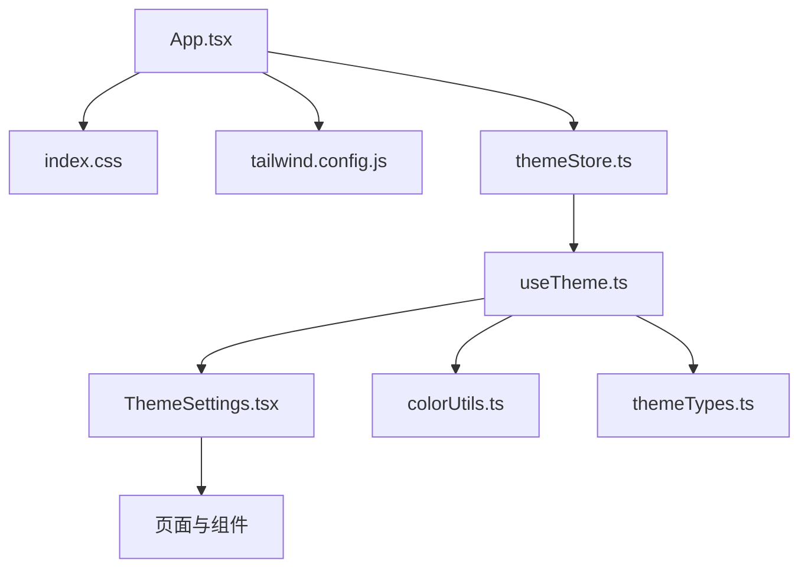
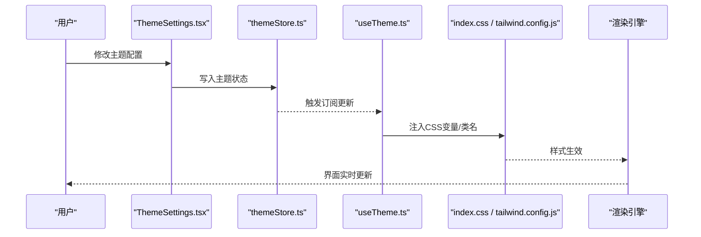
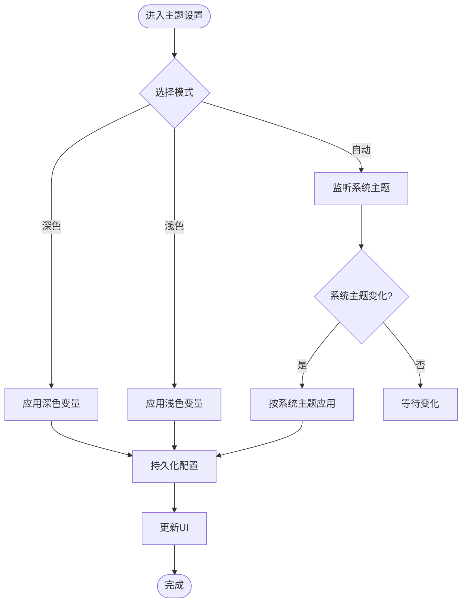
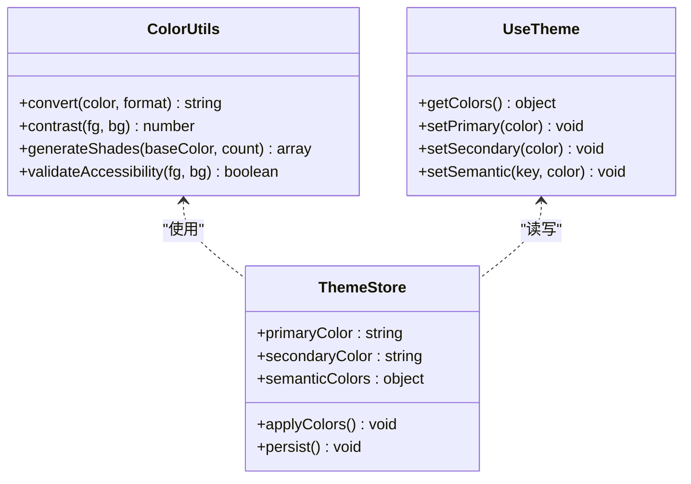
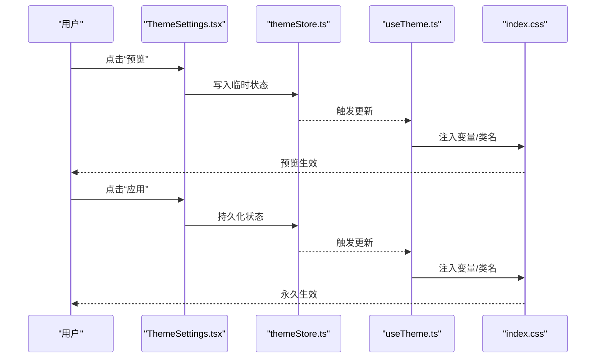
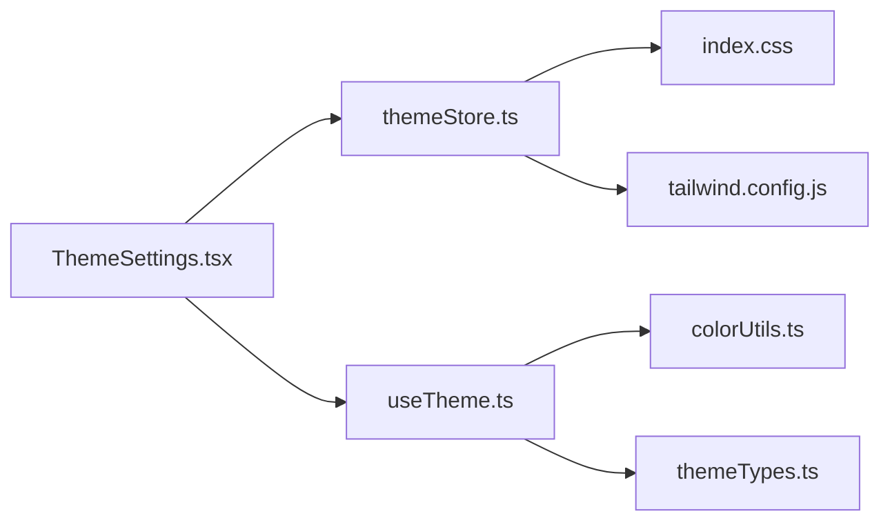

# 主题定制

<cite>
**本文引用的文件**   
- [apps/dsa-web/src/App.tsx](file://apps/dsa-web/src/App.tsx)
- [apps/dsa-web/src/index.css](file://apps/dsa-web/src/index.css)
- [apps/dsa-web/tailwind.config.js](file://apps/dsa-web/tailwind.config.js)
- [apps/dsa-web/src/stores/themeStore.ts](file://apps/dsa-web/src/stores/themeStore.ts)
- [apps/dsa-web/src/components/common/ThemeSettings.tsx](file://apps/dsa-web/src/components/common/ThemeSettings.tsx)
- [apps/dsa-web/src/hooks/useTheme.ts](file://apps/dsa-web/src/hooks/useTheme.ts)
- [apps/dsa-web/src/utils/colorUtils.ts](file://apps/dsa-web/src/utils/colorUtils.ts)
- [apps/dsa-web/src/types/themeTypes.ts](file://apps/dsa-web/src/types/themeTypes.ts)
</cite>

## 目录
1. [简介](#简介)
2. [项目结构](#项目结构)
3. [核心组件](#核心组件)
4. [架构总览](#架构总览)
5. [详细组件分析](#详细组件分析)
6. [依赖关系分析](#依赖关系分析)
7. [性能考虑](#性能考虑)
8. [故障排查指南](#故障排查指南)
9. [结论](#结论)
10. [附录](#附录)

## 简介
本文件面向“主题定制”能力，覆盖界面主题配置、颜色方案、字体与排版、布局偏好、预览与实时应用、响应式设计与无障碍访问。目标是帮助开发者与用户理解如何配置深色/浅色/自动切换模式，自定义主色、辅助色与语义色，调整字体族、字号与行距，设置侧边栏位置、面板大小与显示密度，并通过预览与实时应用功能快速验证效果。

## 项目结构
主题相关的前端实现集中在 Web 应用中，采用 React + Tailwind CSS 的技术栈，通过状态管理存储主题配置，使用工具函数处理颜色计算与变量注入，配合 hooks 提供便捷的主题 API。

图表来源
- [apps/dsa-web/src/App.tsx](file://apps/dsa-web/src/App.tsx)
- [apps/dsa-web/src/index.css](file://apps/dsa-web/src/index.css)
- [apps/dsa-web/tailwind.config.js](file://apps/dsa-web/tailwind.config.js)
- [apps/dsa-web/src/stores/themeStore.ts](file://apps/dsa-web/src/stores/themeStore.ts)
- [apps/dsa-web/src/hooks/useTheme.ts](file://apps/dsa-web/src/hooks/useTheme.ts)
- [apps/dsa-web/src/components/common/ThemeSettings.tsx](file://apps/dsa-web/src/components/common/ThemeSettings.tsx)
- [apps/dsa-web/src/utils/colorUtils.ts](file://apps/dsa-web/src/utils/colorUtils.ts)
- [apps/dsa-web/src/types/themeTypes.ts](file://apps/dsa-web/src/types/themeTypes.ts)

章节来源
- [apps/dsa-web/src/App.tsx](file://apps/dsa-web/src/App.tsx)
- [apps/dsa-web/src/index.css](file://apps/dsa-web/src/index.css)
- [apps/dsa-web/tailwind.config.js](file://apps/dsa-web/tailwind.config.js)
- [apps/dsa-web/src/stores/themeStore.ts](file://apps/dsa-web/src/stores/themeStore.ts)
- [apps/dsa-web/src/hooks/useTheme.ts](file://apps/dsa-web/src/hooks/useTheme.ts)
- [apps/dsa-web/src/components/common/ThemeSettings.tsx](file://apps/dsa-web/src/components/common/ThemeSettings.tsx)
- [apps/dsa-web/src/utils/colorUtils.ts](file://apps/dsa-web/src/utils/colorUtils.ts)
- [apps/dsa-web/src/types/themeTypes.ts](file://apps/dsa-web/src/types/themeTypes.ts)

## 核心组件
- 主题状态管理：集中维护主题模式（深色/浅色/自动）、颜色方案、字体与排版、布局偏好等配置，并提供持久化与订阅更新能力。
- 主题 Hook：封装获取当前主题、切换模式、应用颜色变量、监听系统主题变化等逻辑。
- 主题设置界面：提供可视化配置入口，支持即时预览与一键应用。
- 颜色工具：负责颜色转换、对比度校验、生成明暗变体等。
- 类型定义：统一主题相关的数据结构与枚举值。

章节来源
- [apps/dsa-web/src/stores/themeStore.ts](file://apps/dsa-web/src/stores/themeStore.ts)
- [apps/dsa-web/src/hooks/useTheme.ts](file://apps/dsa-web/src/hooks/useTheme.ts)
- [apps/dsa-web/src/components/common/ThemeSettings.tsx](file://apps/dsa-web/src/components/common/ThemeSettings.tsx)
- [apps/dsa-web/src/utils/colorUtils.ts](file://apps/dsa-web/src/utils/colorUtils.ts)
- [apps/dsa-web/src/types/themeTypes.ts](file://apps/dsa-web/src/types/themeTypes.ts)

## 架构总览
主题系统的运行流程如下：用户在“主题设置”中修改配置，状态管理层持久化并广播变更；Hook 订阅变更后将 CSS 变量注入到根节点，Tailwind 与样式文件读取这些变量完成渲染。自动模式会监听系统主题变化并同步切换。

图表来源
- [apps/dsa-web/src/components/common/ThemeSettings.tsx](file://apps/dsa-web/src/components/common/ThemeSettings.tsx)
- [apps/dsa-web/src/stores/themeStore.ts](file://apps/dsa-web/src/stores/themeStore.ts)
- [apps/dsa-web/src/hooks/useTheme.ts](file://apps/dsa-web/src/hooks/useTheme.ts)
- [apps/dsa-web/src/index.css](file://apps/dsa-web/src/index.css)
- [apps/dsa-web/tailwind.config.js](file://apps/dsa-web/tailwind.config.js)

## 详细组件分析

### 主题模式与自动切换
- 支持三种模式：深色、浅色、自动。
- 自动模式基于系统主题监听，在系统切换时同步应用。
- 切换过程包括：更新状态、持久化、注入变量、刷新 UI。

图表来源
- [apps/dsa-web/src/components/common/ThemeSettings.tsx](file://apps/dsa-web/src/components/common/ThemeSettings.tsx)
- [apps/dsa-web/src/stores/themeStore.ts](file://apps/dsa-web/src/stores/themeStore.ts)
- [apps/dsa-web/src/hooks/useTheme.ts](file://apps/dsa-web/src/hooks/useTheme.ts)

章节来源
- [apps/dsa-web/src/components/common/ThemeSettings.tsx](file://apps/dsa-web/src/components/common/ThemeSettings.tsx)
- [apps/dsa-web/src/stores/themeStore.ts](file://apps/dsa-web/src/stores/themeStore.ts)
- [apps/dsa-web/src/hooks/useTheme.ts](file://apps/dsa-web/src/hooks/useTheme.ts)

### 颜色方案定制（主色、辅助色、语义色）
- 主色调：用于按钮、链接、高亮等关键交互元素。
- 辅助色：用于次要信息、图标、边框等。
- 语义色：成功、警告、错误、信息等，确保可访问性与一致性。
- 颜色工具提供转换、对比度校验与明暗变体生成，保证在不同模式下可读性。

图表来源
- [apps/dsa-web/src/utils/colorUtils.ts](file://apps/dsa-web/src/utils/colorUtils.ts)
- [apps/dsa-web/src/stores/themeStore.ts](file://apps/dsa-web/src/stores/themeStore.ts)
- [apps/dsa-web/src/hooks/useTheme.ts](file://apps/dsa-web/src/hooks/useTheme.ts)

章节来源
- [apps/dsa-web/src/utils/colorUtils.ts](file://apps/dsa-web/src/utils/colorUtils.ts)
- [apps/dsa-web/src/stores/themeStore.ts](file://apps/dsa-web/src/stores/themeStore.ts)
- [apps/dsa-web/src/hooks/useTheme.ts](file://apps/dsa-web/src/hooks/useTheme.ts)

### 字体设置与排版选项
- 字体族：全局默认字体与特定组件字体（如代码块）。
- 字号：基础字号、标题层级字号、正文与注释字号。
- 行距：段落行高、列表行高、表格行高。
- 通过 CSS 变量或 Tailwind 配置项进行集中管理，便于主题切换时整体生效。

章节来源
- [apps/dsa-web/src/index.css](file://apps/dsa-web/src/index.css)
- [apps/dsa-web/tailwind.config.js](file://apps/dsa-web/tailwind.config.js)
- [apps/dsa-web/src/stores/themeStore.ts](file://apps/dsa-web/src/stores/themeStore.ts)

### 布局偏好配置（侧边栏、面板大小、显示密度）
- 侧边栏位置：左侧、右侧或隐藏。
- 面板大小：紧凑、标准、宽松。
- 显示密度：影响间距、卡片尺寸、表格行高。
- 配置变更后立即反映到布局容器与组件样式上。

章节来源
- [apps/dsa-web/src/stores/themeStore.ts](file://apps/dsa-web/src/stores/themeStore.ts)
- [apps/dsa-web/src/components/common/ThemeSettings.tsx](file://apps/dsa-web/src/components/common/ThemeSettings.tsx)
- [apps/dsa-web/src/index.css](file://apps/dsa-web/src/index.css)

### 主题预览与实时应用
- 预览：在不保存的情况下临时应用配置，供用户确认效果。
- 实时应用：保存后通过 CSS 变量注入与类名切换，界面即时更新。
- 回滚：提供撤销最近一次更改的能力。

图表来源
- [apps/dsa-web/src/components/common/ThemeSettings.tsx](file://apps/dsa-web/src/components/common/ThemeSettings.tsx)
- [apps/dsa-web/src/stores/themeStore.ts](file://apps/dsa-web/src/stores/themeStore.ts)
- [apps/dsa-web/src/hooks/useTheme.ts](file://apps/dsa-web/src/hooks/useTheme.ts)
- [apps/dsa-web/src/index.css](file://apps/dsa-web/src/index.css)

章节来源
- [apps/dsa-web/src/components/common/ThemeSettings.tsx](file://apps/dsa-web/src/components/common/ThemeSettings.tsx)
- [apps/dsa-web/src/stores/themeStore.ts](file://apps/dsa-web/src/stores/themeStore.ts)
- [apps/dsa-web/src/hooks/useTheme.ts](file://apps/dsa-web/src/hooks/useTheme.ts)

### 响应式设计支持
- 基于断点与容器查询适配不同屏幕尺寸。
- 侧边栏在小屏下自动折叠为抽屉或隐藏。
- 面板大小与显示密度随视口宽度动态调整。

章节来源
- [apps/dsa-web/tailwind.config.js](file://apps/dsa-web/tailwind.config.js)
- [apps/dsa-web/src/index.css](file://apps/dsa-web/src/index.css)
- [apps/dsa-web/src/stores/themeStore.ts](file://apps/dsa-web/src/stores/themeStore.ts)

### 无障碍访问支持
- 颜色对比度校验：确保文本与背景满足 WCAG 标准。
- 键盘导航：主题设置表单支持 Tab 顺序与快捷键。
- 语义化标签与 ARIA 属性：提升屏幕阅读器体验。
- 减少动画：尊重系统“减少动态效果”偏好。

章节来源
- [apps/dsa-web/src/utils/colorUtils.ts](file://apps/dsa-web/src/utils/colorUtils.ts)
- [apps/dsa-web/src/components/common/ThemeSettings.tsx](file://apps/dsa-web/src/components/common/ThemeSettings.tsx)

## 依赖关系分析
主题模块内部依赖清晰：设置界面依赖状态管理与 Hook，Hook 依赖颜色工具与类型定义，样式层通过 CSS 变量与 Tailwind 配置消费主题数据。

图表来源
- [apps/dsa-web/src/components/common/ThemeSettings.tsx](file://apps/dsa-web/src/components/common/ThemeSettings.tsx)
- [apps/dsa-web/src/stores/themeStore.ts](file://apps/dsa-web/src/stores/themeStore.ts)
- [apps/dsa-web/src/hooks/useTheme.ts](file://apps/dsa-web/src/hooks/useTheme.ts)
- [apps/dsa-web/src/utils/colorUtils.ts](file://apps/dsa-web/src/utils/colorUtils.ts)
- [apps/dsa-web/src/types/themeTypes.ts](file://apps/dsa-web/src/types/themeTypes.ts)
- [apps/dsa-web/src/index.css](file://apps/dsa-web/src/index.css)
- [apps/dsa-web/tailwind.config.js](file://apps/dsa-web/tailwind.config.js)

章节来源
- [apps/dsa-web/src/components/common/ThemeSettings.tsx](file://apps/dsa-web/src/components/common/ThemeSettings.tsx)
- [apps/dsa-web/src/stores/themeStore.ts](file://apps/dsa-web/src/stores/themeStore.ts)
- [apps/dsa-web/src/hooks/useTheme.ts](file://apps/dsa-web/src/hooks/useTheme.ts)
- [apps/dsa-web/src/utils/colorUtils.ts](file://apps/dsa-web/src/utils/colorUtils.ts)
- [apps/dsa-web/src/types/themeTypes.ts](file://apps/dsa-web/src/types/themeTypes.ts)
- [apps/dsa-web/src/index.css](file://apps/dsa-web/src/index.css)
- [apps/dsa-web/tailwind.config.js](file://apps/dsa-web/tailwind.config.js)

## 性能考虑
- 避免频繁重绘：批量更新主题变量，减少 DOM 操作次数。
- 懒加载：仅在需要时计算颜色变体与对比度。
- 缓存策略：对常用颜色组合与字体配置进行缓存。
- 最小化样式体积：按需启用 Tailwind 插件与变量。

[本节为通用指导，不直接分析具体文件]

## 故障排查指南
- 主题未生效：检查 CSS 变量是否注入到根节点，确认 Tailwind 配置是否正确引用变量。
- 颜色不可读：使用对比度工具校验前景与背景色，必要时调整主色或语义色。
- 自动模式异常：确认系统主题监听事件是否正常触发，检查权限与浏览器兼容性。
- 布局错乱：检查容器类名与断点配置，确保侧边栏与面板大小变量正确应用。
- 无障碍问题：验证 ARIA 属性与键盘导航路径，确保屏幕阅读器能正确朗读。

章节来源
- [apps/dsa-web/src/index.css](file://apps/dsa-web/src/index.css)
- [apps/dsa-web/tailwind.config.js](file://apps/dsa-web/tailwind.config.js)
- [apps/dsa-web/src/utils/colorUtils.ts](file://apps/dsa-web/src/utils/colorUtils.ts)
- [apps/dsa-web/src/hooks/useTheme.ts](file://apps/dsa-web/src/hooks/useTheme.ts)

## 结论
主题定制体系以状态管理为核心，结合 Hook 与颜色工具，实现了从配置到渲染的完整闭环。通过预览与实时应用机制，用户可以快速验证并应用个性化主题。同时，响应式设计与无障碍支持确保了跨设备与可访问性的良好体验。建议在生产环境中严格校验颜色对比度与键盘导航，保障用户体验与合规性。

[本节为总结性内容，不直接分析具体文件]

## 附录
- 术语说明：
  - 主色调：用于强调与交互的核心颜色。
  - 辅助色：用于次要信息与装饰的颜色。
  - 语义色：表达状态与含义的颜色集合。
  - 显示密度：控制界面元素的紧凑程度。
- 最佳实践：
  - 优先使用语义色表达状态，避免仅依赖颜色传达信息。
  - 保持字体族与字号的一致性，提升可读性。
  - 在自动模式下测试不同系统主题的显示效果。

[本节为补充说明，不直接分析具体文件]