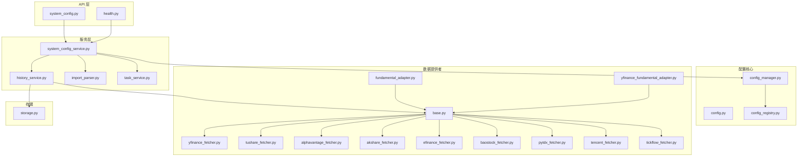
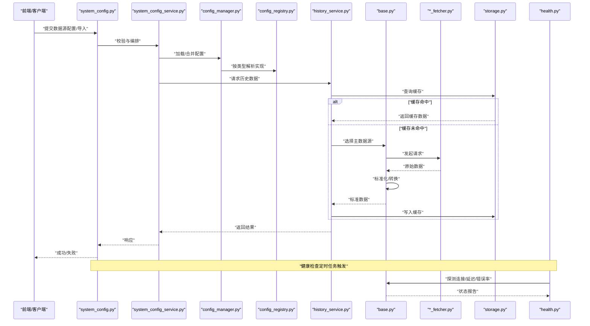
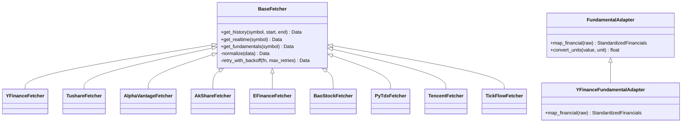
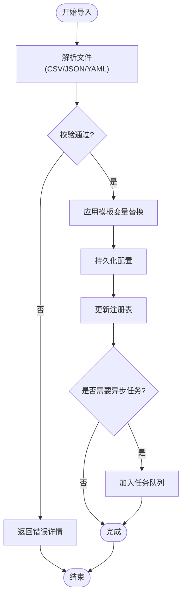
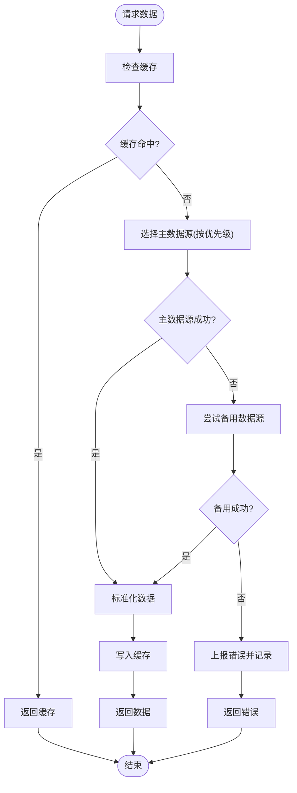
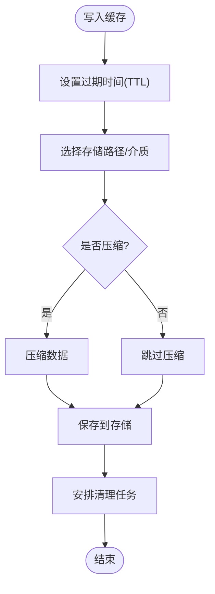
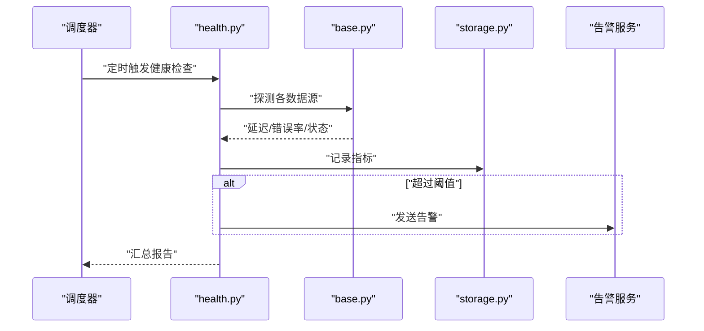
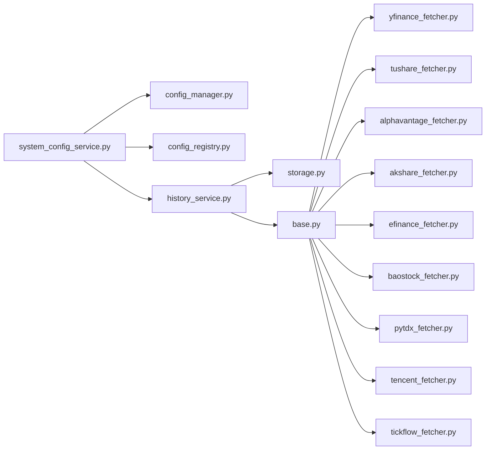

# 数据源配置

<cite>
**本文引用的文件**   
- [data_provider/base.py](file://data_provider/base.py)
- [data_provider/yfinance_fetcher.py](file://data_provider/yfinance_fetcher.py)
- [data_provider/tushare_fetcher.py](file://data_provider/tushare_fetcher.py)
- [data_provider/alphavantage_fetcher.py](file://data_provider/alphavantage_fetcher.py)
- [data_provider/akshare_fetcher.py](file://data_provider/akshare_fetcher.py)
- [data_provider/efinance_fetcher.py](file://data_provider/efinance_fetcher.py)
- [data_provider/baostock_fetcher.py](file://data_provider/baostock_fetcher.py)
- [data_provider/pytdx_fetcher.py](file://data_provider/pytdx_fetcher.py)
- [data_provider/tencent_fetcher.py](file://data_provider/tencent_fetcher.py)
- [data_provider/tickflow_fetcher.py](file://data_provider/tickflow_fetcher.py)
- [data_provider/fundamental_adapter.py](file://data_provider/fundamental_adapter.py)
- [data_provider/yfinance_fundamental_adapter.py](file://data_provider/yfinance_fundamental_adapter.py)
- [src/config.py](file://src/config.py)
- [src/core/config_manager.py](file://src/core/config_manager.py)
- [src/core/config_registry.py](file://src/core/config_registry.py)
- [api/v1/endpoints/system_config.py](file://api/v1/endpoints/system_config.py)
- [api/v1/schemas/system_config.py](file://api/v1/schemas/system_config.py)
- [src/services/system_config_service.py](file://src/services/system_config_service.py)
- [src/storage.py](file://src/storage.py)
- [src/services/history_service.py](file://src/services/history_service.py)
- [src/services/import_parser.py](file://src/services/import_parser.py)
- [src/services/task_service.py](file://src/services/task_service.py)
- [api/v1/endpoints/health.py](file://api/v1/endpoints/health.py)
</cite>

## 目录
1. [简介](#简介)
2. [项目结构](#项目结构)
3. [核心组件](#核心组件)
4. [架构总览](#架构总览)
5. [详细组件分析](#详细组件分析)
6. [依赖关系分析](#依赖关系分析)
7. [性能考虑](#性能考虑)
8. [故障排查指南](#故障排查指南)
9. [结论](#结论)
10. [附录](#附录)

## 简介
本文件面向“数据源配置”主题，系统性说明项目中各类数据提供商（YFinance、Tushare、AlphaVantage、东方财富等）的配置界面与参数设置；阐述智能导入功能（批量配置导入与模板）；解释数据源优先级与故障转移机制；描述缓存策略（时长、存储位置、清理策略）；提供健康检查与性能监控能力；并给出数据格式转换与标准化配置选项。文档力求在技术细节与可操作指导之间取得平衡，帮助不同背景的读者快速上手与排障。

## 项目结构
围绕数据源配置的相关代码主要分布在以下模块：
- 数据提供者实现：data_provider/*_fetcher.py 与 fundamental_adapter.py
- 配置管理：src/config.py、src/core/config_manager.py、src/core/config_registry.py
- API 与前端交互：api/v1/endpoints/system_config.py、api/v1/schemas/system_config.py
- 服务层：src/services/system_config_service.py、src/services/history_service.py、src/services/import_parser.py、src/services/task_service.py
- 存储与缓存：src/storage.py
- 健康检查：api/v1/endpoints/health.py

图表来源
- [api/v1/endpoints/system_config.py](file://api/v1/endpoints/system_config.py)
- [api/v1/endpoints/health.py](file://api/v1/endpoints/health.py)
- [src/services/system_config_service.py](file://src/services/system_config_service.py)
- [src/core/config_manager.py](file://src/core/config_manager.py)
- [src/core/config_registry.py](file://src/core/config_registry.py)
- [src/services/history_service.py](file://src/services/history_service.py)
- [src/services/import_parser.py](file://src/services/import_parser.py)
- [src/services/task_service.py](file://src/services/task_service.py)
- [src/storage.py](file://src/storage.py)
- [data_provider/base.py](file://data_provider/base.py)
- [data_provider/yfinance_fetcher.py](file://data_provider/yfinance_fetcher.py)
- [data_provider/tushare_fetcher.py](file://data_provider/tushare_fetcher.py)
- [data_provider/alphavantage_fetcher.py](file://data_provider/alphavantage_fetcher.py)
- [data_provider/akshare_fetcher.py](file://data_provider/akshare_fetcher.py)
- [data_provider/efinance_fetcher.py](file://data_provider/efinance_fetcher.py)
- [data_provider/baostock_fetcher.py](file://data_provider/baostock_fetcher.py)
- [data_provider/pytdx_fetcher.py](file://data_provider/pytdx_fetcher.py)
- [data_provider/tencent_fetcher.py](file://data_provider/tencent_fetcher.py)
- [data_provider/tickflow_fetcher.py](file://data_provider/tickflow_fetcher.py)
- [data_provider/fundamental_adapter.py](file://data_provider/fundamental_adapter.py)
- [data_provider/yfinance_fundamental_adapter.py](file://data_provider/yfinance_fundamental_adapter.py)

章节来源
- [src/config.py](file://src/config.py)
- [src/core/config_manager.py](file://src/core/config_manager.py)
- [src/core/config_registry.py](file://src/core/config_registry.py)
- [api/v1/endpoints/system_config.py](file://api/v1/endpoints/system_config.py)
- [api/v1/schemas/system_config.py](file://api/v1/schemas/system_config.py)
- [src/services/system_config_service.py](file://src/services/system_config_service.py)
- [src/storage.py](file://src/storage.py)
- [src/services/history_service.py](file://src/services/history_service.py)
- [src/services/import_parser.py](file://src/services/import_parser.py)
- [src/services/task_service.py](file://src/services/task_service.py)
- [api/v1/endpoints/health.py](file://api/v1/endpoints/health.py)

## 核心组件
- 数据提供者基类与适配器
  - base.py：定义统一的数据获取接口、错误模型、重试与超时控制、结果标准化契约。
  - fundamental_adapter.py / yfinance_fundamental_adapter.py：将各提供商的财务指标统一为标准字段集，屏蔽差异。
- 具体数据提供商实现
  - yfinance_fetcher.py、tushare_fetcher.py、alphavantage_fetcher.py、akshare_fetcher.py、efinance_fetcher.py、baostock_fetcher.py、pytdx_fetcher.py、tencent_fetcher.py、tickflow_fetcher.py：各自封装网络请求、鉴权、限流、分页与异常处理，并输出标准数据结构。
- 配置管理与注册
  - config.py：集中式配置入口，环境变量与默认值解析。
  - config_manager.py：运行时配置加载、合并、热更新与校验。
  - config_registry.py：数据源类型到实现的注册表，支持动态发现与扩展。
- API 与服务层
  - system_config.py：系统配置的增删改查、验证、权限控制。
  - system_config_service.py：业务编排（如批量导入、模板应用、优先级与故障转移策略）。
  - history_service.py：历史数据拉取、缓存命中、回退策略。
  - import_parser.py：批量配置导入解析（CSV/JSON/YAML），模板变量替换与校验。
  - task_service.py：异步任务调度（批量导入、健康检查、缓存清理）。
- 存储与缓存
  - storage.py：本地缓存、磁盘路径、过期策略、清理任务。
- 健康检查
  - health.py：数据源连通性检测、延迟统计、错误率上报。

章节来源
- [data_provider/base.py](file://data_provider/base.py)
- [data_provider/fundamental_adapter.py](file://data_provider/fundamental_adapter.py)
- [data_provider/yfinance_fundamental_adapter.py](file://data_provider/yfinance_fundamental_adapter.py)
- [data_provider/yfinance_fetcher.py](file://data_provider/yfinance_fetcher.py)
- [data_provider/tushare_fetcher.py](file://data_provider/tushare_fetcher.py)
- [data_provider/alphavantage_fetcher.py](file://data_provider/alphavantage_fetcher.py)
- [data_provider/akshare_fetcher.py](file://data_provider/akshare_fetcher.py)
- [data_provider/efinance_fetcher.py](file://data_provider/efinance_fetcher.py)
- [data_provider/baostock_fetcher.py](file://data_provider/baostock_fetcher.py)
- [data_provider/pytdx_fetcher.py](file://data_provider/pytdx_fetcher.py)
- [data_provider/tencent_fetcher.py](file://data_provider/tencent_fetcher.py)
- [data_provider/tickflow_fetcher.py](file://data_provider/tickflow_fetcher.py)
- [src/config.py](file://src/config.py)
- [src/core/config_manager.py](file://src/core/config_manager.py)
- [src/core/config_registry.py](file://src/core/config_registry.py)
- [api/v1/endpoints/system_config.py](file://api/v1/endpoints/system_config.py)
- [api/v1/schemas/system_config.py](file://api/v1/schemas/system_config.py)
- [src/services/system_config_service.py](file://src/services/system_config_service.py)
- [src/services/history_service.py](file://src/services/history_service.py)
- [src/services/import_parser.py](file://src/services/import_parser.py)
- [src/services/task_service.py](file://src/services/task_service.py)
- [src/storage.py](file://src/storage.py)
- [api/v1/endpoints/health.py](file://api/v1/endpoints/health.py)

## 架构总览
下图展示了从 API 调用到数据源获取、缓存与标准化的整体流程，以及健康检查与任务调度的集成点。

图表来源
- [api/v1/endpoints/system_config.py](file://api/v1/endpoints/system_config.py)
- [src/services/system_config_service.py](file://src/services/system_config_service.py)
- [src/core/config_manager.py](file://src/core/config_manager.py)
- [src/core/config_registry.py](file://src/core/config_registry.py)
- [src/services/history_service.py](file://src/services/history_service.py)
- [src/storage.py](file://src/storage.py)
- [data_provider/base.py](file://data_provider/base.py)
- [api/v1/endpoints/health.py](file://api/v1/endpoints/health.py)

## 详细组件分析

### 数据提供者基类与适配器
- 基类职责
  - 统一接口：定义获取历史行情、实时报价、财务指标等方法签名。
  - 错误与重试：封装网络异常、限流、超时与指数退避重试。
  - 标准化：将各提供商字段映射为统一结构，便于上层消费。
- 财务适配器
  - fundamental_adapter.py：抽象财务数据的字段映射与单位换算。
  - yfinance_fundamental_adapter.py：针对 Yahoo Finance 的财务字段进行适配。

图表来源
- [data_provider/base.py](file://data_provider/base.py)
- [data_provider/fundamental_adapter.py](file://data_provider/fundamental_adapter.py)
- [data_provider/yfinance_fundamental_adapter.py](file://data_provider/yfinance_fundamental_adapter.py)
- [data_provider/yfinance_fetcher.py](file://data_provider/yfinance_fetcher.py)
- [data_provider/tushare_fetcher.py](file://data_provider/tushare_fetcher.py)
- [data_provider/alphavantage_fetcher.py](file://data_provider/alphavantage_fetcher.py)
- [data_provider/akshare_fetcher.py](file://data_provider/akshare_fetcher.py)
- [data_provider/efinance_fetcher.py](file://data_provider/efinance_fetcher.py)
- [data_provider/baostock_fetcher.py](file://data_provider/baostock_fetcher.py)
- [data_provider/pytdx_fetcher.py](file://data_provider/pytdx_fetcher.py)
- [data_provider/tencent_fetcher.py](file://data_provider/tencent_fetcher.py)
- [data_provider/tickflow_fetcher.py](file://data_provider/tickflow_fetcher.py)

章节来源
- [data_provider/base.py](file://data_provider/base.py)
- [data_provider/fundamental_adapter.py](file://data_provider/fundamental_adapter.py)
- [data_provider/yfinance_fundamental_adapter.py](file://data_provider/yfinance_fundamental_adapter.py)

### 数据提供商配置项与界面要点
- 通用参数
  - API 密钥/令牌：用于鉴权的字符串或对象。
  - 基础 URL/端点：部分提供商需要自定义域名或代理。
  - 超时与重试：请求超时秒数、最大重试次数、退避策略。
  - 速率限制：每分钟请求上限、并发度。
- 各提供商特有参数
  - YFinance：地区、代理、是否启用实验特性。
  - Tushare：Token、频率限制、数据版本。
  - AlphaVantage：API Key、请求间隔、数据类型开关。
  - 东方财富/同花顺/腾讯等：市场标识、编码规则、交易时段。
- 配置界面建议
  - 分组展示：按提供商分区块，显示必填项与可选项。
  - 校验提示：实时校验密钥格式、连通性测试按钮。
  - 安全存储：敏感信息加密保存，避免明文日志。

章节来源
- [data_provider/yfinance_fetcher.py](file://data_provider/yfinance_fetcher.py)
- [data_provider/tushare_fetcher.py](file://data_provider/tushare_fetcher.py)
- [data_provider/alphavantage_fetcher.py](file://data_provider/alphavantage_fetcher.py)
- [data_provider/akshare_fetcher.py](file://data_provider/akshare_fetcher.py)
- [data_provider/efinance_fetcher.py](file://data_provider/efinance_fetcher.py)
- [data_provider/baostock_fetcher.py](file://data_provider/baostock_fetcher.py)
- [data_provider/pytdx_fetcher.py](file://data_provider/pytdx_fetcher.py)
- [data_provider/tencent_fetcher.py](file://data_provider/tencent_fetcher.py)
- [data_provider/tickflow_fetcher.py](file://data_provider/tickflow_fetcher.py)

### 智能导入与配置文件模板
- 支持的导入格式
  - CSV/JSON/YAML：批量配置条目，包含提供商、密钥、参数、优先级。
- 模板变量
  - 支持占位符替换（如 {{API_KEY}}、{{REGION}}），便于多环境复用。
- 导入流程
  - 解析与校验：字段完整性、类型校验、唯一性约束。
  - 应用模板：变量替换、默认值填充。
  - 持久化：写入配置存储，触发注册表更新。
  - 异步任务：大文件或复杂导入通过任务队列执行，避免阻塞。

图表来源
- [src/services/import_parser.py](file://src/services/import_parser.py)
- [src/services/task_service.py](file://src/services/task_service.py)
- [src/core/config_manager.py](file://src/core/config_manager.py)
- [src/core/config_registry.py](file://src/core/config_registry.py)

章节来源
- [src/services/import_parser.py](file://src/services/import_parser.py)
- [src/services/task_service.py](file://src/services/task_service.py)
- [src/core/config_manager.py](file://src/core/config_manager.py)
- [src/core/config_registry.py](file://src/core/config_registry.py)

### 数据源优先级与故障转移机制
- 优先级策略
  - 按配置顺序或权重排序，优先尝试高优先级数据源。
  - 支持按市场/品种路由到特定数据源（例如 A 股优先东方财富，美股优先 YFinance）。
- 故障转移
  - 当主数据源失败（超时、限流、认证失败）时，自动切换到下一个可用数据源。
  - 记录切换原因与耗时，便于监控与优化。
- 健康检查联动
  - 健康检查失败的数据源会被暂时降级，直到恢复。

图表来源
- [src/services/history_service.py](file://src/services/history_service.py)
- [src/storage.py](file://src/storage.py)
- [data_provider/base.py](file://data_provider/base.py)

章节来源
- [src/services/history_service.py](file://src/services/history_service.py)
- [src/storage.py](file://src/storage.py)
- [data_provider/base.py](file://data_provider/base.py)

### 缓存策略配置
- 缓存时长
  - 按数据源与数据类型设置 TTL（分钟/小时/天）。
  - 支持热点数据短 TTL、低频数据长 TTL。
- 存储位置
  - 本地磁盘或内存缓存，路径可配置。
  - 支持压缩与分片，提升 I/O 效率。
- 清理策略
  - 基于时间的过期清理、基于容量的 LRU 淘汰。
  - 定时任务定期扫描并释放空间。

图表来源
- [src/storage.py](file://src/storage.py)
- [src/services/history_service.py](file://src/services/history_service.py)

章节来源
- [src/storage.py](file://src/storage.py)
- [src/services/history_service.py](file://src/services/history_service.py)

### 数据格式转换与标准化配置
- 字段映射
  - 统一日期、时间戳、价格、成交量等字段的命名与单位。
  - 支持时区与货币换算。
- 缺失值处理
  - 插值、前向填充、标记为 NaN。
- 质量校验
  - 范围校验、重复行去重、异常值过滤。
- 配置项
  - 开启/关闭标准化、严格模式、日志级别。

章节来源
- [data_provider/base.py](file://data_provider/base.py)
- [data_provider/fundamental_adapter.py](file://data_provider/fundamental_adapter.py)
- [data_provider/yfinance_fundamental_adapter.py](file://data_provider/yfinance_fundamental_adapter.py)

### 健康检查与性能监控
- 健康检查
  - 连通性测试、延迟采样、错误率统计。
  - 失败阈值与自动降级。
- 监控指标
  - 请求成功率、平均延迟、P95/P99 延迟、缓存命中率。
  - 数据源切换次数与原因分类。
- 告警与报表
  - 阈值告警、趋势报表、导出 CSV/JSON。

图表来源
- [api/v1/endpoints/health.py](file://api/v1/endpoints/health.py)
- [data_provider/base.py](file://data_provider/base.py)
- [src/storage.py](file://src/storage.py)

章节来源
- [api/v1/endpoints/health.py](file://api/v1/endpoints/health.py)
- [data_provider/base.py](file://data_provider/base.py)
- [src/storage.py](file://src/storage.py)

## 依赖关系分析
- 组件耦合
  - system_config_service.py 依赖 config_manager.py 与 config_registry.py，解耦数据源实现。
  - history_service.py 依赖 storage.py 与各 *_fetcher.py，通过 base.py 统一接口。
- 外部依赖
  - 各数据提供商 SDK/API（如 yfinance、tushare、alpha_vantage、akshare、efinance、baostock、pytdx、tencent、tickflow）。
- 潜在循环依赖
  - 通过接口抽象与注册表避免直接耦合，降低循环风险。

图表来源
- [src/services/system_config_service.py](file://src/services/system_config_service.py)
- [src/core/config_manager.py](file://src/core/config_manager.py)
- [src/core/config_registry.py](file://src/core/config_registry.py)
- [src/services/history_service.py](file://src/services/history_service.py)
- [src/storage.py](file://src/storage.py)
- [data_provider/base.py](file://data_provider/base.py)
- [data_provider/yfinance_fetcher.py](file://data_provider/yfinance_fetcher.py)
- [data_provider/tushare_fetcher.py](file://data_provider/tushare_fetcher.py)
- [data_provider/alphavantage_fetcher.py](file://data_provider/alphavantage_fetcher.py)
- [data_provider/akshare_fetcher.py](file://data_provider/akshare_fetcher.py)
- [data_provider/efinance_fetcher.py](file://data_provider/efinance_fetcher.py)
- [data_provider/baostock_fetcher.py](file://data_provider/baostock_fetcher.py)
- [data_provider/pytdx_fetcher.py](file://data_provider/pytdx_fetcher.py)
- [data_provider/tencent_fetcher.py](file://data_provider/tencent_fetcher.py)
- [data_provider/tickflow_fetcher.py](file://data_provider/tickflow_fetcher.py)

章节来源
- [src/services/system_config_service.py](file://src/services/system_config_service.py)
- [src/core/config_manager.py](file://src/core/config_manager.py)
- [src/core/config_registry.py](file://src/core/config_registry.py)
- [src/services/history_service.py](file://src/services/history_service.py)
- [src/storage.py](file://src/storage.py)
- [data_provider/base.py](file://data_provider/base.py)

## 性能考虑
- 并发与限流
  - 合理设置并发度与速率限制，避免被提供商限流。
  - 使用连接池与 HTTP 复用减少握手开销。
- 缓存命中率
  - 调整 TTL 与热点数据策略，提高命中率。
  - 预取与懒加载结合，平衡内存与延迟。
- 标准化成本
  - 批量转换与并行处理，减少 CPU 占用。
  - 选择性字段映射，避免不必要的计算。
- 监控与优化
  - 采集关键指标，定位瓶颈（网络、I/O、CPU）。
  - 定期评估数据源稳定性与延迟，动态调整优先级。

[本节为通用指导，不直接分析具体文件]

## 故障排查指南
- 常见问题
  - 认证失败：检查 API 密钥、权限、有效期。
  - 限流/超时：降低并发、增加重试、调整超时。
  - 数据缺失：确认市场覆盖、交易时段、字段映射。
  - 缓存异常：清理缓存、检查磁盘空间、修复损坏文件。
- 诊断步骤
  - 查看健康检查报告与错误日志。
  - 使用连通性测试与延迟采样工具。
  - 逐步禁用数据源，定位问题来源。
- 恢复措施
  - 临时切换备用数据源，保障业务连续性。
  - 更新配置后重启相关服务或触发热更新。

章节来源
- [api/v1/endpoints/health.py](file://api/v1/endpoints/health.py)
- [data_provider/base.py](file://data_provider/base.py)
- [src/storage.py](file://src/storage.py)

## 结论
本项目通过统一的基类与适配器抽象，实现了多数据源的灵活接入与标准化；借助配置管理与注册表，支持动态扩展与热更新；通过优先级与故障转移机制，提升了数据获取的可靠性；配合缓存与健康检查，保障了性能与稳定性。建议在部署中结合实际业务需求，合理配置各数据源参数、缓存策略与监控告警，以获得最佳体验。

[本节为总结，不直接分析具体文件]

## 附录
- 配置示例与模板
  - 参考导入解析器与模板变量说明，构建多环境配置。
- 常用命令与脚本
  - 健康检查、缓存清理、批量导入等任务可通过任务服务调度。

[本节为补充信息，不直接分析具体文件]