# 系统设置页面

<cite>
**本文引用的文件**   
- [api/v1/endpoints/system_config.py](file://api/v1/endpoints/system_config.py)
- [api/v1/schemas/system_config.py](file://api/v1/schemas/system_config.py)
- [src/services/system_config_service.py](file://src/services/system_config_service.py)
- [src/core/config_manager.py](file://src/core/config_manager.py)
- [src/core/config_registry.py](file://src/core/config_registry.py)
- [src/auth.py](file://src/auth.py)
- [api/middlewares/auth.py](file://api/middlewares/auth.py)
- [apps/dsa-web/src/api/systemConfig.ts](file://apps/dsa-web/src/api/systemConfig.ts)
- [apps/dsa-web/src/pages/SettingsPage.tsx](file://apps/dsa-web/src/pages/SettingsPage.tsx)
- [apps/dsa-web/src/components/common/SystemConfigEditor.tsx](file://apps/dsa-web/src/components/common/SystemConfigEditor.tsx)
- [apps/dsa-web/src/stores/settingsStore.ts](file://apps/dsa-web/src/stores/settingsStore.ts)
- [src/notification_sender/__init__.py](file://src/notification_sender/__init__.py)
- [src/llm/backend_factory.py](file://src/llm/backend_factory.py)
- [src/llm/litellm_backend.py](file://src/llm/litellm_backend.py)
- [src/llm/generation_params.py](file://src/llm/generation_params.py)
</cite>

## 目录
1. [简介](#简介)
2. [项目结构](#项目结构)
3. [核心组件](#核心组件)
4. [架构总览](#架构总览)
5. [详细组件分析](#详细组件分析)
6. [依赖关系分析](#依赖关系分析)
7. [性能考虑](#性能考虑)
8. [故障排查指南](#故障排查指南)
9. [结论](#结论)
10. [附录](#附录)

## 简介
本文件面向“系统设置页面”的完整实现与使用，覆盖以下能力：
- API 密钥管理、数据源配置、通知渠道设置
- LLM 通道编辑器（模型选择、参数配置、连接测试）
- 认证设置（用户权限、会话控制、安全策略）
- 主题与界面定制（颜色方案、字体、布局偏好）
- 配置导入导出（备份恢复、团队协作同步）
- 设置验证机制与错误提示

该页面通过前端 UI 与后端 API 协同工作，将用户配置持久化到系统配置中心，并在运行时注入到各子系统（LLM、通知、数据源等）。

## 项目结构
系统设置相关代码分布在前后端多个模块中：
- 前端：API 调用封装、设置页路由与表单、统一配置编辑器、状态管理
- 后端：REST 接口、Pydantic 校验模式、服务层、配置管理与注册表、认证中间件

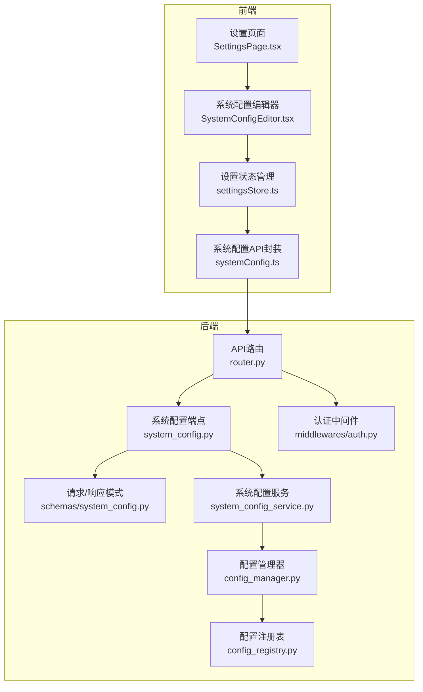

**图表来源** 
- [apps/dsa-web/src/pages/SettingsPage.tsx](file://apps/dsa-web/src/pages/SettingsPage.tsx)
- [apps/dsa-web/src/components/common/SystemConfigEditor.tsx](file://apps/dsa-web/src/components/common/SystemConfigEditor.tsx)
- [apps/dsa-web/src/stores/settingsStore.ts](file://apps/dsa-web/src/stores/settingsStore.ts)
- [apps/dsa-web/src/api/systemConfig.ts](file://apps/dsa-web/src/api/systemConfig.ts)
- [api/v1/endpoints/system_config.py](file://api/v1/endpoints/system_config.py)
- [api/v1/schemas/system_config.py](file://api/v1/schemas/system_config.py)
- [src/services/system_config_service.py](file://src/services/system_config_service.py)
- [src/core/config_manager.py](file://src/core/config_manager.py)
- [src/core/config_registry.py](file://src/core/config_registry.py)
- [api/middlewares/auth.py](file://api/middlewares/auth.py)

**章节来源**
- [api/v1/endpoints/system_config.py](file://api/v1/endpoints/system_config.py)
- [api/v1/schemas/system_config.py](file://api/v1/schemas/system_config.py)
- [src/services/system_config_service.py](file://src/services/system_config_service.py)
- [src/core/config_manager.py](file://src/core/config_manager.py)
- [src/core/config_registry.py](file://src/core/config_registry.py)
- [apps/dsa-web/src/api/systemConfig.ts](file://apps/dsa-web/src/api/systemConfig.ts)
- [apps/dsa-web/src/pages/SettingsPage.tsx](file://apps/dsa-web/src/pages/SettingsPage.tsx)
- [apps/dsa-web/src/components/common/SystemConfigEditor.tsx](file://apps/dsa-web/src/components/common/SystemConfigEditor.tsx)
- [apps/dsa-web/src/stores/settingsStore.ts](file://apps/dsa-web/src/stores/settingsStore.ts)
- [api/middlewares/auth.py](file://api/middlewares/auth.py)

## 核心组件
- 系统配置端点：提供配置的查询、更新、导入导出、测试连接等 REST 接口
- 配置模式：定义所有可编辑字段、类型、默认值与校验规则
- 系统配置服务：聚合业务逻辑，协调配置读写、校验、导入导出、测试连接
- 配置管理器：负责配置的持久化、热加载、版本兼容与回滚
- 配置注册表：按命名空间组织配置项，支持动态发现与分组展示
- 认证中间件：保护敏感操作，基于角色与权限控制访问
- 前端设置页与编辑器：统一的可视化配置界面，支持实时预览与错误提示
- 状态管理：本地缓存、变更追踪、撤销/重做、批量提交

**章节来源**
- [api/v1/endpoints/system_config.py](file://api/v1/endpoints/system_config.py)
- [api/v1/schemas/system_config.py](file://api/v1/schemas/system_config.py)
- [src/services/system_config_service.py](file://src/services/system_config_service.py)
- [src/core/config_manager.py](file://src/core/config_manager.py)
- [src/core/config_registry.py](file://src/core/config_registry.py)
- [api/middlewares/auth.py](file://api/middlewares/auth.py)
- [apps/dsa-web/src/pages/SettingsPage.tsx](file://apps/dsa-web/src/pages/SettingsPage.tsx)
- [apps/dsa-web/src/components/common/SystemConfigEditor.tsx](file://apps/dsa-web/src/components/common/SystemConfigEditor.tsx)
- [apps/dsa-web/src/stores/settingsStore.ts](file://apps/dsa-web/src/stores/settingsStore.ts)

## 架构总览
系统设置页面采用前后端分离架构。前端通过 API 封装与后端交互，后端通过 Pydantic 模式进行输入校验，服务层处理业务逻辑，配置管理器负责持久化与热加载，认证中间件保障安全。

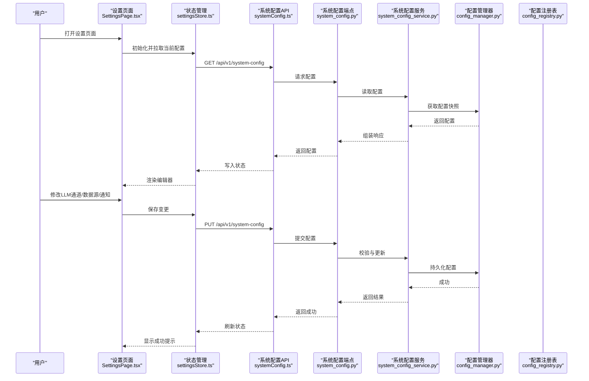

**图表来源** 
- [apps/dsa-web/src/pages/SettingsPage.tsx](file://apps/dsa-web/src/pages/SettingsPage.tsx)
- [apps/dsa-web/src/stores/settingsStore.ts](file://apps/dsa-web/src/stores/settingsStore.ts)
- [apps/dsa-web/src/api/systemConfig.ts](file://apps/dsa-web/src/api/systemConfig.ts)
- [api/v1/endpoints/system_config.py](file://api/v1/endpoints/system_config.py)
- [src/services/system_config_service.py](file://src/services/system_config_service.py)
- [src/core/config_manager.py](file://src/core/config_manager.py)

## 详细组件分析

### 系统配置端点与模式
- 端点职责：提供配置的查询、更新、导入导出、测试连接等接口；统一鉴权与错误处理
- 模式定义：对每个配置段（如 LLM、数据源、通知、认证、主题）定义必填字段、类型约束、默认值与校验规则
- 典型流程：接收请求 -> 模式校验 -> 服务层处理 -> 配置管理器持久化 -> 返回结果

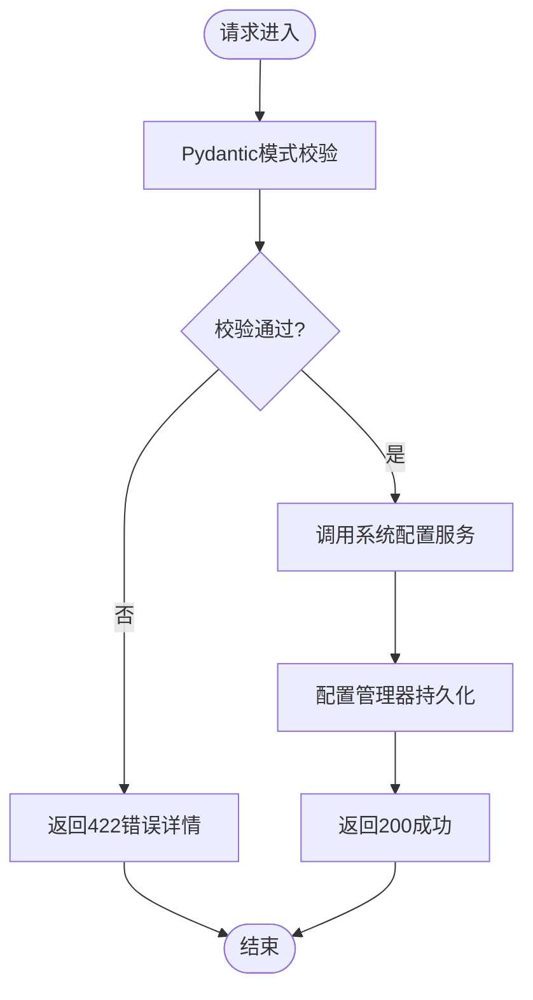

**图表来源** 
- [api/v1/endpoints/system_config.py](file://api/v1/endpoints/system_config.py)
- [api/v1/schemas/system_config.py](file://api/v1/schemas/system_config.py)
- [src/services/system_config_service.py](file://src/services/system_config_service.py)
- [src/core/config_manager.py](file://src/core/config_manager.py)

**章节来源**
- [api/v1/endpoints/system_config.py](file://api/v1/endpoints/system_config.py)
- [api/v1/schemas/system_config.py](file://api/v1/schemas/system_config.py)

### LLM 通道编辑器
- 功能要点：模型选择、参数配置（温度、最大令牌数、重试策略）、连接测试、失败回退
- 后端集成：通过后端工厂与 LiteLLM 后端进行连接测试与参数校验
- 前端体验：实时预览、参数范围提示、连接测试结果反馈

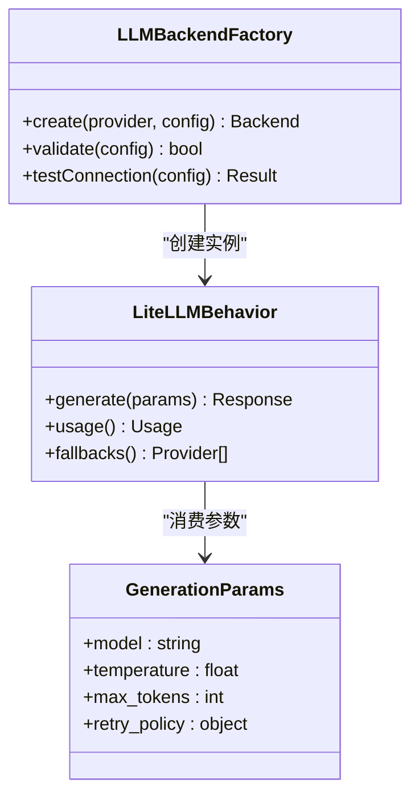

**图表来源** 
- [src/llm/backend_factory.py](file://src/llm/backend_factory.py)
- [src/llm/litellm_backend.py](file://src/llm/litellm_backend.py)
- [src/llm/generation_params.py](file://src/llm/generation_params.py)

**章节来源**
- [src/llm/backend_factory.py](file://src/llm/backend_factory.py)
- [src/llm/litellm_backend.py](file://src/llm/litellm_backend.py)
- [src/llm/generation_params.py](file://src/llm/generation_params.py)

### 数据源配置
- 支持的数据源：多种市场数据提供者（如 A股、港股、美股指数、基本面数据）
- 配置项：API Key、基础 URL、超时、重试、代理、限流策略
- 校验与测试：连接测试、可用性检查、错误码映射

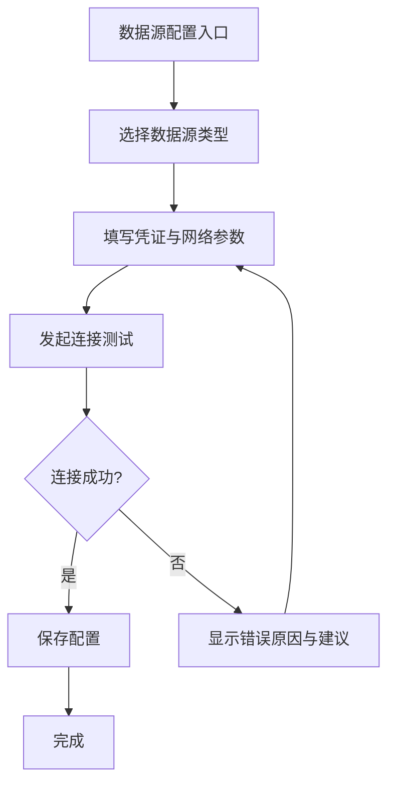

**图表来源** 
- [api/v1/schemas/system_config.py](file://api/v1/schemas/system_config.py)
- [src/services/system_config_service.py](file://src/services/system_config_service.py)

**章节来源**
- [api/v1/schemas/system_config.py](file://api/v1/schemas/system_config.py)
- [src/services/system_config_service.py](file://src/services/system_config_service.py)

### 通知渠道设置
- 支持的渠道：邮件、钉钉、飞书、Discord、Slack、Telegram、企业微信等
- 配置项：渠道类型、认证信息、消息模板、过滤规则、重试与退避
- 发送能力：统一抽象接口，支持能力探测与诊断

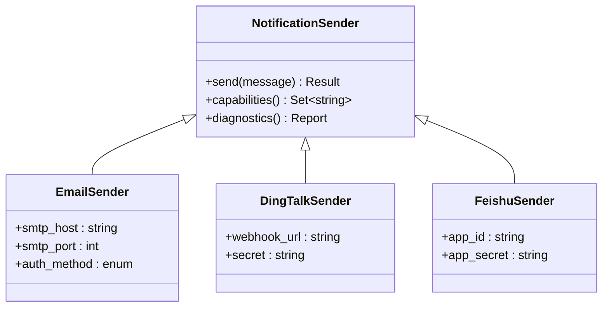

**图表来源** 
- [src/notification_sender/__init__.py](file://src/notification_sender/__init__.py)

**章节来源**
- [src/notification_sender/__init__.py](file://src/notification_sender/__init__.py)

### 认证设置（权限、会话、安全策略）
- 用户权限：基于角色的访问控制（RBAC），限制敏感配置项的编辑与导出
- 会话控制：登录态、过期时间、刷新令牌、并发会话限制
- 安全策略：密码复杂度、登录失败锁定、审计日志、IP 白名单

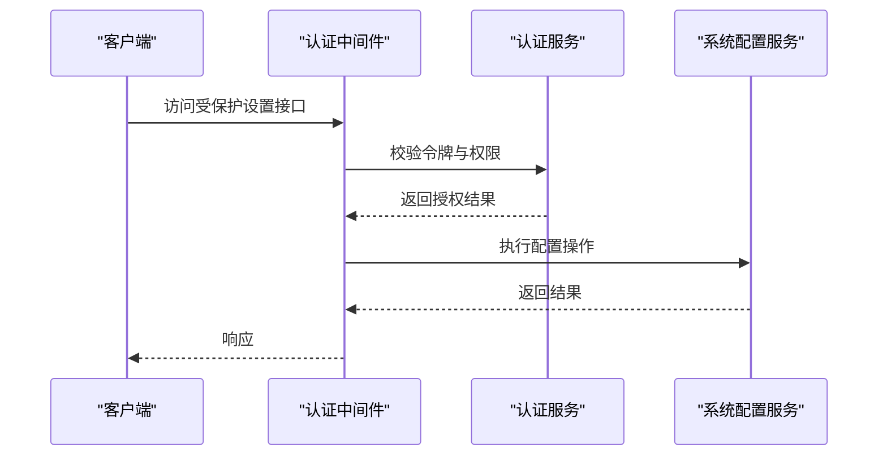

**图表来源** 
- [api/middlewares/auth.py](file://api/middlewares/auth.py)
- [src/auth.py](file://src/auth.py)
- [src/services/system_config_service.py](file://src/services/system_config_service.py)

**章节来源**
- [api/middlewares/auth.py](file://api/middlewares/auth.py)
- [src/auth.py](file://src/auth.py)

### 主题与界面定制
- 颜色方案：浅色/深色主题、自定义主色、对比度增强
- 字体设置：字体族、字号、行高、国际化字体回退
- 布局偏好：侧栏宽度、卡片密度、表格分页、快捷键绑定

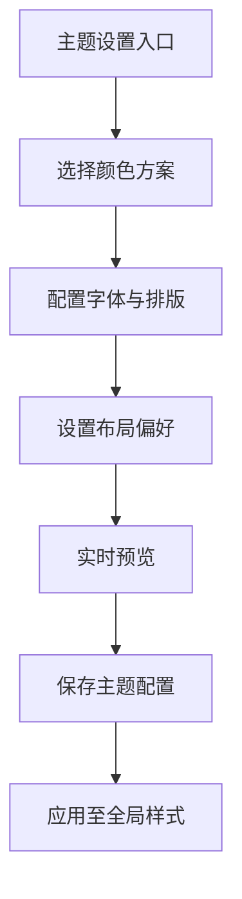

**图表来源** 
- [api/v1/schemas/system_config.py](file://api/v1/schemas/system_config.py)
- [apps/dsa-web/src/components/common/SystemConfigEditor.tsx](file://apps/dsa-web/src/components/common/SystemConfigEditor.tsx)

**章节来源**
- [api/v1/schemas/system_config.py](file://api/v1/schemas/system_config.py)
- [apps/dsa-web/src/components/common/SystemConfigEditor.tsx](file://apps/dsa-web/src/components/common/SystemConfigEditor.tsx)

### 配置导入导出（备份恢复、团队协作同步）
- 导出：生成结构化配置文件（JSON/YAML），包含注释与版本信息
- 导入：校验结构、合并策略（覆盖/增量）、冲突解决
- 协作：团队共享配置模板、差异对比、审批发布流程

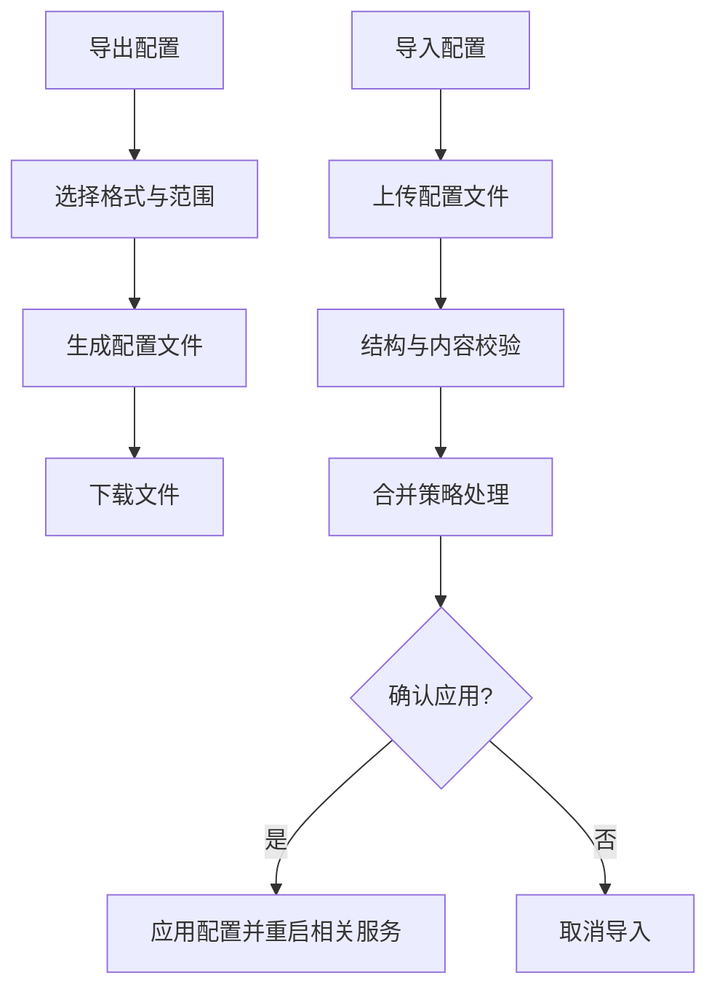

**图表来源** 
- [api/v1/endpoints/system_config.py](file://api/v1/endpoints/system_config.py)
- [src/services/system_config_service.py](file://src/services/system_config_service.py)
- [src/core/config_manager.py](file://src/core/config_manager.py)

**章节来源**
- [api/v1/endpoints/system_config.py](file://api/v1/endpoints/system_config.py)
- [src/services/system_config_service.py](file://src/services/system_config_service.py)
- [src/core/config_manager.py](file://src/core/config_manager.py)

### 设置验证机制与错误提示
- 前端验证：即时校验、字段级错误提示、批量校验汇总
- 后端验证：Pydantic 模式校验、业务规则校验、跨字段一致性检查
- 错误处理：统一错误码、可读性错误消息、建议修复步骤

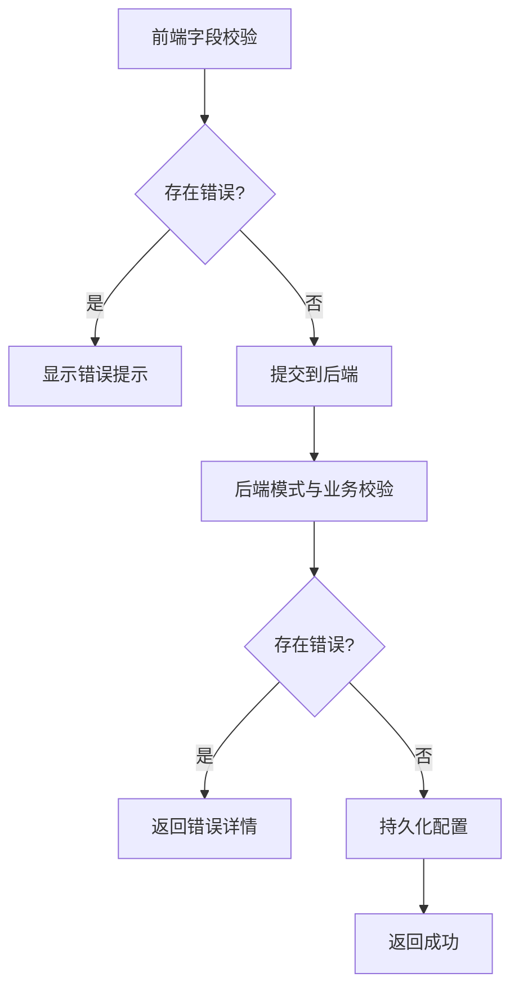

**图表来源** 
- [api/v1/schemas/system_config.py](file://api/v1/schemas/system_config.py)
- [apps/dsa-web/src/components/common/SystemConfigEditor.tsx](file://apps/dsa-web/src/components/common/SystemConfigEditor.tsx)
- [src/services/system_config_service.py](file://src/services/system_config_service.py)

**章节来源**
- [api/v1/schemas/system_config.py](file://api/v1/schemas/system_config.py)
- [apps/dsa-web/src/components/common/SystemConfigEditor.tsx](file://apps/dsa-web/src/components/common/SystemConfigEditor.tsx)
- [src/services/system_config_service.py](file://src/services/system_config_service.py)

## 依赖关系分析
- 前端依赖：React 组件、状态管理库、HTTP 客户端、i18n 与主题系统
- 后端依赖：FastAPI/路由、Pydantic 模式、认证中间件、配置管理器与注册表、LLM 后端工厂、通知发送器抽象
- 外部依赖：第三方 LLM 提供商、数据源 API、通知平台 API

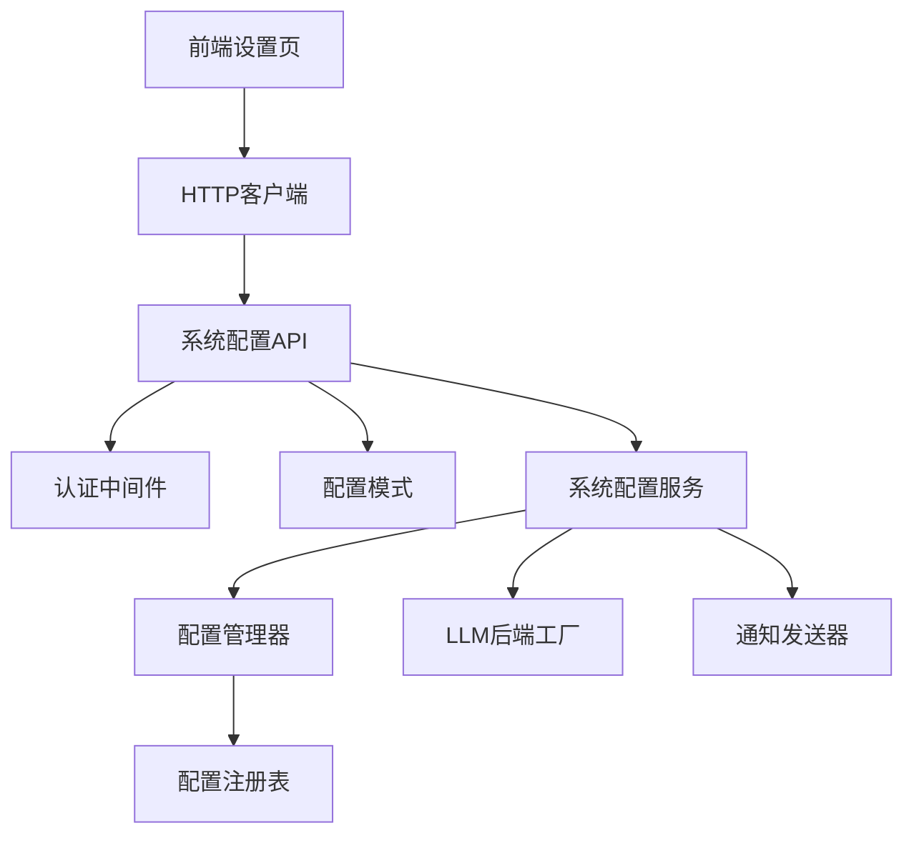

**图表来源** 
- [apps/dsa-web/src/pages/SettingsPage.tsx](file://apps/dsa-web/src/pages/SettingsPage.tsx)
- [apps/dsa-web/src/api/systemConfig.ts](file://apps/dsa-web/src/api/systemConfig.ts)
- [api/v1/endpoints/system_config.py](file://api/v1/endpoints/system_config.py)
- [api/v1/schemas/system_config.py](file://api/v1/schemas/system_config.py)
- [src/services/system_config_service.py](file://src/services/system_config_service.py)
- [src/core/config_manager.py](file://src/core/config_manager.py)
- [src/core/config_registry.py](file://src/core/config_registry.py)
- [src/llm/backend_factory.py](file://src/llm/backend_factory.py)
- [src/notification_sender/__init__.py](file://src/notification_sender/__init__.py)

**章节来源**
- [api/v1/endpoints/system_config.py](file://api/v1/endpoints/system_config.py)
- [api/v1/schemas/system_config.py](file://api/v1/schemas/system_config.py)
- [src/services/system_config_service.py](file://src/services/system_config_service.py)
- [src/core/config_manager.py](file://src/core/config_manager.py)
- [src/core/config_registry.py](file://src/core/config_registry.py)
- [src/llm/backend_factory.py](file://src/llm/backend_factory.py)
- [src/notification_sender/__init__.py](file://src/notification_sender/__init__.py)

## 性能考虑
- 配置热加载：避免频繁重启服务，支持增量更新与灰度生效
- 连接测试异步化：后台任务执行耗时测试，前端轮询或事件回调
- 缓存策略：只读配置缓存、失效策略与版本校验
- 批量操作：合并多次变更为一次提交，减少网络与序列化开销
- 资源限制：对大文件导入与复杂配置进行大小与深度限制

[本节为通用指导，不直接分析具体文件]

## 故障排查指南
- 常见错误
  - 422 校验失败：检查字段类型、必填项、取值范围
  - 401/403 认证失败：确认令牌有效性与角色权限
  - 连接测试失败：核对凭据、网络连通性、代理与超时设置
  - 导入失败：检查文件格式、版本兼容性、冲突字段
- 定位方法
  - 查看服务端日志与错误堆栈
  - 使用诊断工具输出配置快照与差异
  - 逐步禁用第三方依赖以隔离问题
- 恢复策略
  - 从备份恢复最近稳定配置
  - 回滚到上一个版本
  - 启用降级模式（关闭非关键功能）

**章节来源**
- [api/v1/endpoints/system_config.py](file://api/v1/endpoints/system_config.py)
- [api/v1/schemas/system_config.py](file://api/v1/schemas/system_config.py)
- [src/services/system_config_service.py](file://src/services/system_config_service.py)
- [src/core/config_manager.py](file://src/core/config_manager.py)

## 结论
系统设置页面提供了完整的配置管理能力，涵盖 API 密钥、数据源、通知渠道、LLM 通道、认证与安全、主题与界面定制，以及配置导入导出与验证机制。通过清晰的前后端分层与严格的模式校验，确保配置的安全性与可靠性。建议在生产环境启用审计与备份策略，并结合团队协作流程进行配置治理。

[本节为总结性内容，不直接分析具体文件]

## 附录
- 最佳实践
  - 最小权限原则：仅开放必要配置项的编辑权限
  - 变更留痕：记录每次配置变更的用户、时间与内容差异
  - 灰度发布：先小范围验证再全量生效
  - 定期审计：清理无效凭据与废弃配置
- 参考路径
  - 前端设置页：[apps/dsa-web/src/pages/SettingsPage.tsx](file://apps/dsa-web/src/pages/SettingsPage.tsx)
  - 统一配置编辑器：[apps/dsa-web/src/components/common/SystemConfigEditor.tsx](file://apps/dsa-web/src/components/common/SystemConfigEditor.tsx)
  - 状态管理：[apps/dsa-web/src/stores/settingsStore.ts](file://apps/dsa-web/src/stores/settingsStore.ts)
  - API 封装：[apps/dsa-web/src/api/systemConfig.ts](file://apps/dsa-web/src/api/systemConfig.ts)
  - 后端端点：[api/v1/endpoints/system_config.py](file://api/v1/endpoints/system_config.py)
  - 配置模式：[api/v1/schemas/system_config.py](file://api/v1/schemas/system_config.py)
  - 服务层：[src/services/system_config_service.py](file://src/services/system_config_service.py)
  - 配置管理：[src/core/config_manager.py](file://src/core/config_manager.py)、[src/core/config_registry.py](file://src/core/config_registry.py)
  - 认证中间件：[api/middlewares/auth.py](file://api/middlewares/auth.py)、[src/auth.py](file://src/auth.py)
  - LLM 后端：[src/llm/backend_factory.py](file://src/llm/backend_factory.py)、[src/llm/litellm_backend.py](file://src/llm/litellm_backend.py)、[src/llm/generation_params.py](file://src/llm/generation_params.py)
  - 通知发送器：[src/notification_sender/__init__.py](file://src/notification_sender/__init__.py)