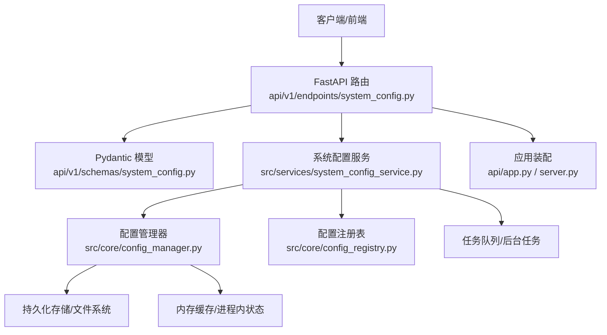
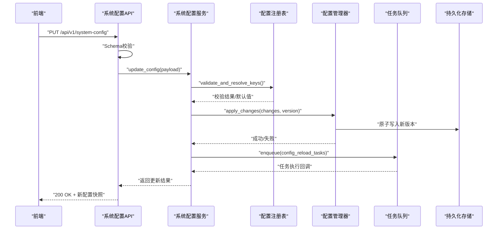
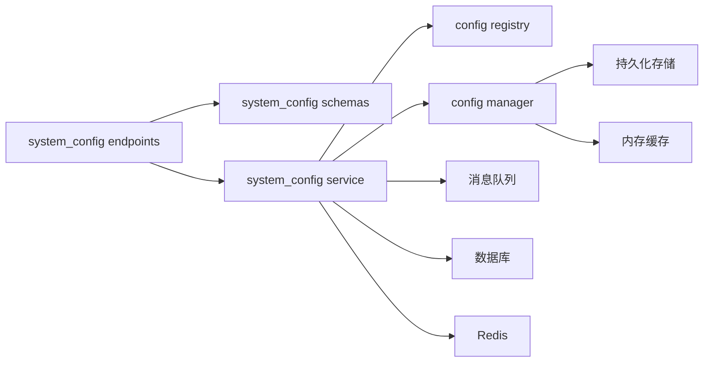
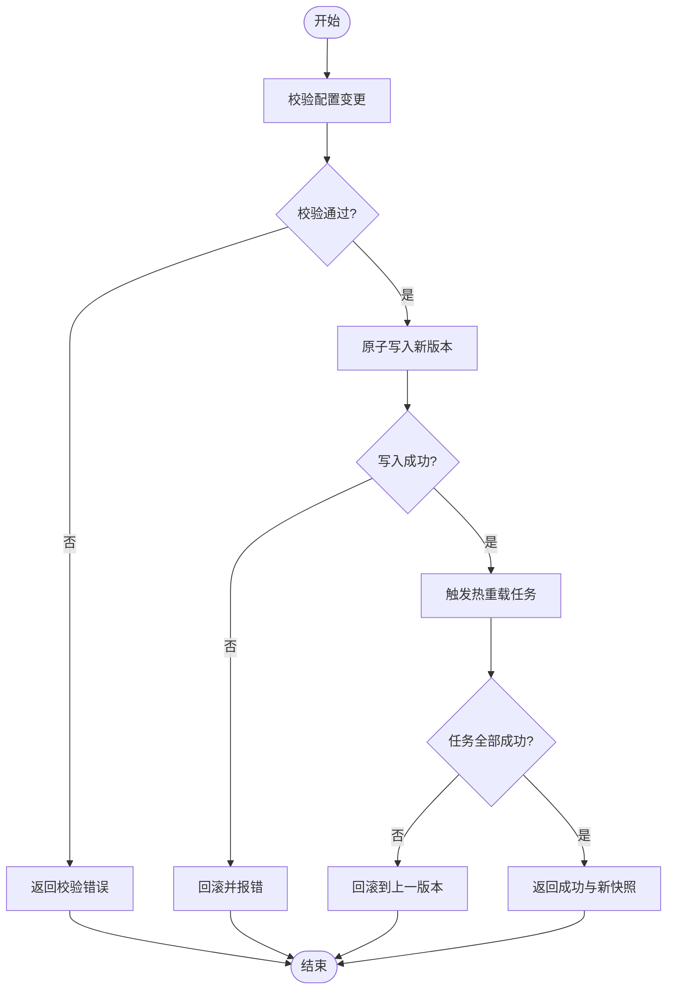

# 系统配置管理

<cite>
**本文引用的文件**   
- [api/v1/endpoints/system_config.py](file://api/v1/endpoints/system_config.py)
- [api/v1/schemas/system_config.py](file://api/v1/schemas/system_config.py)
- [src/core/config_manager.py](file://src/core/config_manager.py)
- [src/core/config_registry.py](file://src/core/config_registry.py)
- [src/services/system_config_service.py](file://src/services/system_config_service.py)
- [src/config.py](file://src/config.py)
- [api/app.py](file://api/app.py)
- [server.py](file://server.py)
- [tests/test_system_config_api.py](file://tests/test_system_config_api.py)
- [tests/test_system_config_service.py](file://tests/test_system_config_service.py)
- [tests/test_config_manager.py](file://tests/test_config_manager.py)
- [tests/test_config_registry.py](file://tests/test_config_registry.py)
- [tests/test_config_validate_structured.py](file://tests/test_config_validate_structured.py)
- [tests/test_task_queue_config_sync.py](file://tests/test_task_queue_config_sync.py)
</cite>

## 目录
1. [简介](#简介)
2. [项目结构](#项目结构)
3. [核心组件](#核心组件)
4. [架构总览](#架构总览)
5. [详细组件分析](#详细组件分析)
6. [依赖关系分析](#依赖关系分析)
7. [性能考虑](#性能考虑)
8. [故障排查指南](#故障排查指南)
9. [结论](#结论)
10. [附录](#附录)

## 简介
本文件面向“系统配置管理”模块，覆盖全局系统参数的配置界面与后端实现，包括数据库连接、Redis缓存、消息队列等基础设施配置。文档重点说明：
- 配置项的注册、校验、持久化与热重载机制
- 运行时修改配置而不重启服务的工作流程
- 配置验证规则与数据类型检查
- 配置版本控制与变更历史记录
- 配置备份恢复与团队协作同步
- 配置迁移脚本与环境差异处理

## 项目结构
系统配置管理涉及API层、Schema定义、服务层、核心配置管理与注册表，以及前端接口调用。关键路径如下：
- API端点：api/v1/endpoints/system_config.py
- Schema定义：api/v1/schemas/system_config.py
- 服务层：src/services/system_config_service.py
- 核心配置管理：src/core/config_manager.py、src/core/config_registry.py
- 应用装配：api/app.py、server.py
- 测试用例：tests/*_system_config*.py、tests/test_config*.py

图表来源
- [api/v1/endpoints/system_config.py](file://api/v1/endpoints/system_config.py)
- [api/v1/schemas/system_config.py](file://api/v1/schemas/system_config.py)
- [src/services/system_config_service.py](file://src/services/system_config_service.py)
- [src/core/config_manager.py](file://src/core/config_manager.py)
- [src/core/config_registry.py](file://src/core/config_registry.py)
- [api/app.py](file://api/app.py)
- [server.py](file://server.py)

章节来源
- [api/v1/endpoints/system_config.py](file://api/v1/endpoints/system_config.py)
- [api/v1/schemas/system_config.py](file://api/v1/schemas/system_config.py)
- [src/services/system_config_service.py](file://src/services/system_config_service.py)
- [src/core/config_manager.py](file://src/core/config_manager.py)
- [src/core/config_registry.py](file://src/core/config_registry.py)
- [api/app.py](file://api/app.py)
- [server.py](file://server.py)

## 核心组件
- 配置注册表（ConfigRegistry）
  - 职责：集中声明所有可配置项的元数据（名称、类型、默认值、范围、是否敏感、分组等），提供按组查询与批量更新能力。
  - 关键点：支持结构化字段、枚举约束、必填校验、默认值回退。
- 配置管理器（ConfigManager）
  - 职责：加载、合并、校验、持久化、热重载；维护当前生效配置快照；提供增量更新与全量替换接口。
  - 关键点：原子写入、版本记录、变更日志、并发安全。
- 系统配置服务（SystemConfigService）
  - 职责：对外暴露配置读/写/校验/热重载/备份/恢复/迁移等能力；协调任务队列进行配置变更后的资源重建。
  - 关键点：事务性更新、错误回滚、事件通知。
- API端点（system_config endpoints）
  - 职责：REST接口，接收请求、绑定Schema、调用服务层、返回统一响应。
  - 关键点：输入校验、权限控制、限流、审计日志。
- Schema定义（system_config schemas）
  - 职责：定义配置项的结构、类型、约束与示例，确保前后端契约一致。
  - 关键点：Pydantic v2模型、自定义验证器、错误信息本地化。

章节来源
- [src/core/config_registry.py](file://src/core/config_registry.py)
- [src/core/config_manager.py](file://src/core/config_manager.py)
- [src/services/system_config_service.py](file://src/services/system_config_service.py)
- [api/v1/endpoints/system_config.py](file://api/v1/endpoints/system_config.py)
- [api/v1/schemas/system_config.py](file://api/v1/schemas/system_config.py)

## 架构总览
下图展示从前端到后端的完整配置管理链路，包括热重载与任务队列联动。

图表来源
- [api/v1/endpoints/system_config.py](file://api/v1/endpoints/system_config.py)
- [src/services/system_config_service.py](file://src/services/system_config_service.py)
- [src/core/config_registry.py](file://src/core/config_registry.py)
- [src/core/config_manager.py](file://src/core/config_manager.py)

## 详细组件分析

### 配置注册表（ConfigRegistry）
- 设计要点
  - 以键空间组织配置项，支持分组（如 database、redis、mq）。
  - 每个配置项包含：类型、默认值、取值范围、是否敏感、描述、是否允许热重载。
  - 提供批量读取、按组过滤、默认值填充、类型转换与校验。
- 复杂度与并发
  - 注册表为只读型数据结构，适合多线程共享；更新通过原子替换或锁保护。
- 优化建议
  - 对热点配置项建立内存索引；对大型配置集采用懒加载。

章节来源
- [src/core/config_registry.py](file://src/core/config_registry.py)

### 配置管理器（ConfigManager）
- 功能概览
  - 加载：从配置文件/环境变量/远程源加载并合并。
  - 校验：基于注册表的约束进行强类型校验。
  - 持久化：原子写入新版本，保留历史版本。
  - 热重载：监听变更事件，触发重新加载与资源重建。
- 数据结构
  - 当前配置快照、版本元数据、变更日志、锁与信号量。
- 错误处理
  - 校验失败不落地；写入失败回滚；热重载失败降级到上一版本。

章节来源
- [src/core/config_manager.py](file://src/core/config_manager.py)

### 系统配置服务（SystemConfigService）
- 能力清单
  - 获取当前配置、按组查询、批量更新、单键更新、校验预览、热重载触发、备份/恢复、迁移执行。
- 与任务队列集成
  - 配置变更后，派发重建连接池、重连Redis、重新订阅MQ等任务。
- 事务性与一致性
  - 更新过程保证“先校验、再落盘、再广播”，失败时回滚。

章节来源
- [src/services/system_config_service.py](file://src/services/system_config_service.py)

### API端点（system_config endpoints）
- 接口设计
  - GET /api/v1/system-config：获取当前配置快照
  - PUT /api/v1/system-config：批量更新配置
  - PATCH /api/v1/system-config/{key}：单键更新
  - POST /api/v1/system-config/reload：触发热重载
  - POST /api/v1/system-config/backup：导出备份
  - POST /api/v1/system-config/restore：导入恢复
  - POST /api/v1/system-config/migrate：执行迁移
- 校验与鉴权
  - 使用Pydantic模型进行严格校验；鉴权中间件控制访问；审计日志记录操作人。

章节来源
- [api/v1/endpoints/system_config.py](file://api/v1/endpoints/system_config.py)
- [api/v1/schemas/system_config.py](file://api/v1/schemas/system_config.py)

### Schema定义（system_config schemas）
- 模型要点
  - 统一的配置请求体、响应体、错误体；字段级校验（必填、格式、范围）。
  - 敏感字段掩码输出；国际化错误消息。
- 扩展性
  - 新增配置项只需在Schema与注册表中声明，无需改动业务逻辑。

章节来源
- [api/v1/schemas/system_config.py](file://api/v1/schemas/system_config.py)

### 应用装配与入口
- FastAPI应用挂载路由、中间件、生命周期钩子。
- 启动时初始化配置注册表与配置管理器，加载初始配置。

章节来源
- [api/app.py](file://api/app.py)
- [server.py](file://server.py)

## 依赖关系分析
- 组件耦合
  - API依赖Schema与服务；服务依赖注册表与管理器；管理器依赖持久化与缓存。
- 外部依赖
  - 数据库驱动、Redis客户端、消息队列SDK；这些依赖在热重载时需要重建连接。
- 循环依赖
  - 通过服务层解耦，避免直接循环引用。

图表来源
- [api/v1/endpoints/system_config.py](file://api/v1/endpoints/system_config.py)
- [api/v1/schemas/system_config.py](file://api/v1/schemas/system_config.py)
- [src/services/system_config_service.py](file://src/services/system_config_service.py)
- [src/core/config_registry.py](file://src/core/config_registry.py)
- [src/core/config_manager.py](file://src/core/config_manager.py)

章节来源
- [api/v1/endpoints/system_config.py](file://api/v1/endpoints/system_config.py)
- [src/services/system_config_service.py](file://src/services/system_config_service.py)
- [src/core/config_manager.py](file://src/core/config_manager.py)
- [src/core/config_registry.py](file://src/core/config_registry.py)

## 性能考虑
- 配置读取
  - 高频读取走内存快照，避免每次I/O；定期异步刷新。
- 配置更新
  - 批量更新减少锁竞争；原子写入避免部分更新。
- 热重载
  - 增量重建资源，避免全量重启；失败快速回滚。
- 并发安全
  - 读写分离、不可变快照、细粒度锁。

[本节为通用指导，不直接分析具体文件]

## 故障排查指南
- 常见错误
  - 校验失败：检查Schema约束与注册表定义；查看错误详情定位字段。
  - 热重载失败：检查依赖服务连通性（DB/Redis/MQ）；查看任务队列日志。
  - 版本冲突：确认并发更新顺序；必要时强制锁定。
- 诊断步骤
  - 获取当前配置快照对比差异；查看变更历史与审计日志；回放迁移脚本。
- 恢复策略
  - 使用备份恢复至稳定版本；回滚到上一版本快照。

章节来源
- [tests/test_system_config_api.py](file://tests/test_system_config_api.py)
- [tests/test_system_config_service.py](file://tests/test_system_config_service.py)
- [tests/test_config_manager.py](file://tests/test_config_manager.py)
- [tests/test_config_registry.py](file://tests/test_config_registry.py)
- [tests/test_config_validate_structured.py](file://tests/test_config_validate_structured.py)
- [tests/test_task_queue_config_sync.py](file://tests/test_task_queue_config_sync.py)

## 结论
本系统配置管理模块通过“注册表+管理器+服务+API”的分层设计，实现了高可用、可扩展、可观测的配置管理能力。配合热重载、版本控制、备份恢复与迁移脚本，满足生产环境对配置治理的要求。建议在团队中推行配置即代码（Configuration as Code）实践，结合CI/CD进行变更审查与自动化部署。

[本节为总结，不直接分析具体文件]

## 附录

### 配置项分类与示例
- 数据库连接
  - 主机、端口、用户名、密码、数据库名、连接池大小、超时、SSL开关
- Redis缓存
  - 主机、端口、密码、库号、连接池、序列化方式、过期策略
- 消息队列
  - 协议、地址、认证、主题/队列名、重试次数、消费者并发度
- 其他基础设施
  - 日志级别、监控上报、代理设置、特征开关

[本节为概念性内容，不直接分析具体文件]

### 热重载流程图

[本图为概念流程，不映射具体源码文件]

### 配置版本控制与变更记录
- 版本号策略：语义化版本或递增整数
- 变更记录：操作人、时间戳、变更摘要、影响范围
- 审计与合规：不可篡改日志、导出与归档

[本节为概念性内容，不直接分析具体文件]

### 备份与恢复
- 备份：全量导出、增量导出、加密存储
- 恢复：幂等恢复、冲突检测、回滚策略
- 协作：分支化管理、合并冲突解决、审批流程

[本节为概念性内容，不直接分析具体文件]

### 迁移脚本与环境差异
- 迁移脚本：幂等、可回滚、跨环境兼容
- 环境差异：环境变量注入、模板渲染、条件启用
- 验证：预检查、沙箱演练、灰度发布

[本节为概念性内容，不直接分析具体文件]