# 认证设置卡片

<cite>
**本文档引用的文件**   
- [api/v1/endpoints/auth.py](file://api/v1/endpoints/auth.py)
- [api/middlewares/auth.py](file://api/middlewares/auth.py)
- [src/auth.py](file://src/auth.py)
- [src/config.py](file://src/config.py)
- [api/v1/schemas/system_config.py](file://api/v1/schemas/system_config.py)
- [apps/dsa-web/src/api/auth.ts](file://apps/dsa-web/src/api/auth.ts)
- [apps/dsa-web/src/pages/LoginPage.tsx](file://apps/dsa-web/src/pages/LoginPage.tsx)
- [tests/test_auth.py](file://tests/test_auth.py)
- [tests/test_auth_api.py](file://tests/test_auth_api.py)
</cite>

## 目录
1. [简介](#简介)
2. [项目结构](#项目结构)
3. [核心组件](#核心组件)
4. [架构总览](#架构总览)
5. [详细组件分析](#详细组件分析)
6. [依赖关系分析](#依赖关系分析)
7. [性能考量](#性能考量)
8. [故障排查指南](#故障排查指南)
9. [结论](#结论)
10. [附录](#附录)

## 简介
本文件围绕“认证设置卡片”展开，系统性说明用户认证与授权配置界面及其后端实现。内容覆盖：
- JWT令牌管理、会话超时与安全策略配置
- 多角色权限管理（管理员、普通用户、只读用户）
- 密码策略（复杂度、过期与重置流程）
- OAuth集成（第三方登录提供商）
- 审计日志查看与用户活动监控
- 安全最佳实践与常见问题解决方案

该文档旨在帮助开发者与运维人员快速理解并正确配置认证相关能力，确保系统安全与可用性。

## 项目结构
认证设置功能涉及前端页面、API路由、中间件、服务层与配置模块。关键位置如下：
- 前端认证API封装与登录页：apps/dsa-web/src/api/auth.ts、apps/dsa-web/src/pages/LoginPage.tsx
- 后端认证路由与鉴权中间件：api/v1/endpoints/auth.py、api/middlewares/auth.py
- 认证核心逻辑与配置：src/auth.py、src/config.py
- 系统配置Schema定义：api/v1/schemas/system_config.py
- 测试用例：tests/test_auth.py、tests/test_auth_api.py

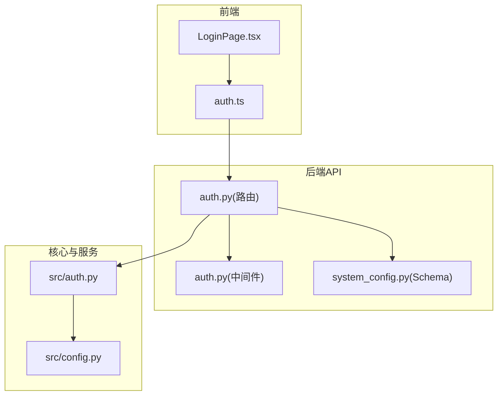

图表来源
- [apps/dsa-web/src/api/auth.ts](file://apps/dsa-web/src/api/auth.ts)
- [apps/dsa-web/src/pages/LoginPage.tsx](file://apps/dsa-web/src/pages/LoginPage.tsx)
- [api/v1/endpoints/auth.py](file://api/v1/endpoints/auth.py)
- [api/middlewares/auth.py](file://api/middlewares/auth.py)
- [api/v1/schemas/system_config.py](file://api/v1/schemas/system_config.py)
- [src/auth.py](file://src/auth.py)
- [src/config.py](file://src/config.py)

章节来源
- [api/v1/endpoints/auth.py](file://api/v1/endpoints/auth.py)
- [api/middlewares/auth.py](file://api/middlewares/auth.py)
- [src/auth.py](file://src/auth.py)
- [src/config.py](file://src/config.py)
- [api/v1/schemas/system_config.py](file://api/v1/schemas/system_config.py)
- [apps/dsa-web/src/api/auth.ts](file://apps/dsa-web/src/api/auth.ts)
- [apps/dsa-web/src/pages/LoginPage.tsx](file://apps/dsa-web/src/pages/LoginPage.tsx)

## 核心组件
- 认证路由端点：提供登录、登出、刷新令牌、获取当前用户信息、OAuth回调等接口
- 鉴权中间件：校验JWT、解析用户上下文、注入权限信息到请求上下文
- 认证核心服务：负责令牌签发/验证、密码校验、会话管理、权限判定
- 配置中心：集中管理JWT密钥、过期时间、密码策略、OAuth参数等
- 前端认证API封装：统一调用后端认证接口，处理令牌存储与刷新
- 系统配置Schema：定义认证相关配置的字段与校验规则

章节来源
- [api/v1/endpoints/auth.py](file://api/v1/endpoints/auth.py)
- [api/middlewares/auth.py](file://api/middlewares/auth.py)
- [src/auth.py](file://src/auth.py)
- [src/config.py](file://src/config.py)
- [api/v1/schemas/system_config.py](file://api/v1/schemas/system_config.py)
- [apps/dsa-web/src/api/auth.ts](file://apps/dsa-web/src/api/auth.ts)

## 架构总览
下图展示认证设置卡片的端到端交互流程：前端发起认证请求，后端路由进入鉴权中间件，核心服务完成令牌签发或校验，配置模块提供策略参数，最终返回结果给前端。

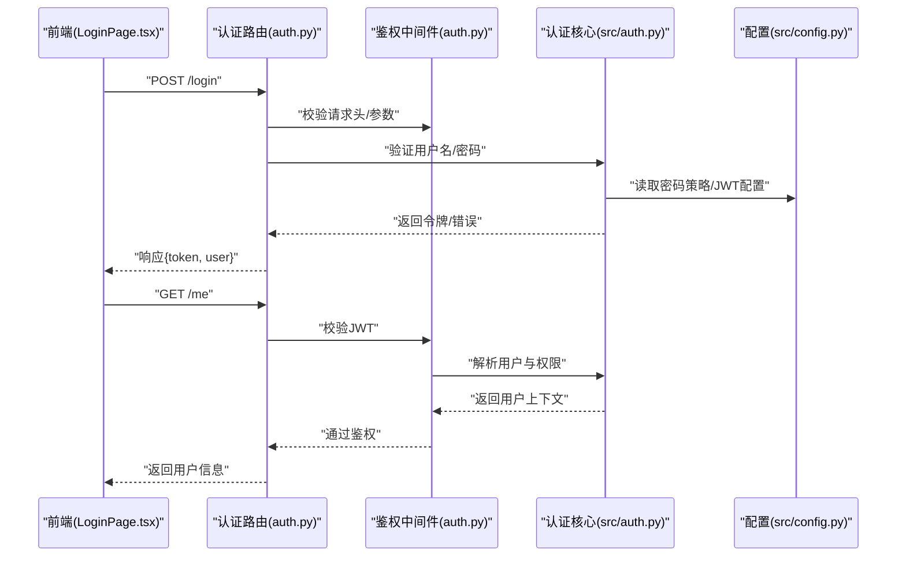

图表来源
- [apps/dsa-web/src/pages/LoginPage.tsx](file://apps/dsa-web/src/pages/LoginPage.tsx)
- [apps/dsa-web/src/api/auth.ts](file://apps/dsa-web/src/api/auth.ts)
- [api/v1/endpoints/auth.py](file://api/v1/endpoints/auth.py)
- [api/middlewares/auth.py](file://api/middlewares/auth.py)
- [src/auth.py](file://src/auth.py)
- [src/config.py](file://src/config.py)

## 详细组件分析

### 认证路由端点（登录、登出、刷新、用户信息）
- 登录：接收用户名/密码，校验后签发JWT，返回访问令牌与用户基本信息
- 登出：使令牌失效或清理本地状态
- 刷新令牌：基于刷新令牌换取新的访问令牌
- 获取当前用户：返回已认证用户的角色与权限集合
- OAuth回调：对接第三方提供商，完成授权码交换与用户信息拉取

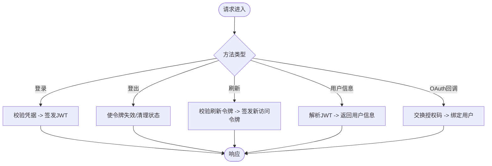

章节来源
- [api/v1/endpoints/auth.py](file://api/v1/endpoints/auth.py)

### 鉴权中间件（JWT校验与权限注入）
- 从请求头提取JWT并校验签名与有效期
- 解析用户ID、角色与权限集合并注入到请求上下文
- 对受保护路由进行访问控制，未认证或无权限返回错误

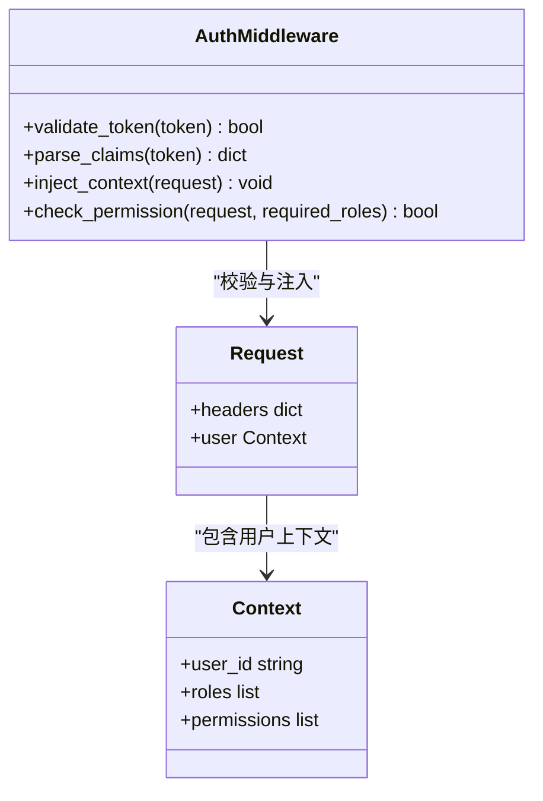

图表来源
- [api/middlewares/auth.py](file://api/middlewares/auth.py)

章节来源
- [api/middlewares/auth.py](file://api/middlewares/auth.py)

### 认证核心服务（令牌签发/验证、密码校验、权限判定）
- 令牌管理：生成JWT、刷新令牌、黑名单机制（可选）
- 密码校验：支持哈希比对、复杂度检查、过期策略
- 权限判定：基于角色的访问控制（RBAC），支持细粒度权限
- 会话管理：会话超时、并发限制、设备指纹（可选）

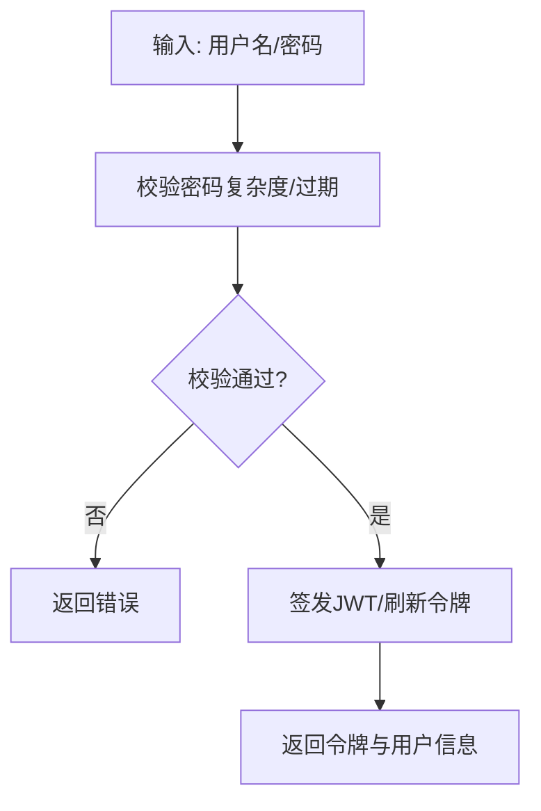

章节来源
- [src/auth.py](file://src/auth.py)

### 配置中心（JWT、会话超时、密码策略、OAuth）
- JWT配置：密钥、算法、过期时间、刷新令牌策略
- 会话超时：空闲超时、绝对超时、自动续期开关
- 密码策略：最小长度、字符集要求、历史密码限制、过期天数
- OAuth配置：提供商列表、客户端ID/密钥、回调地址、作用域

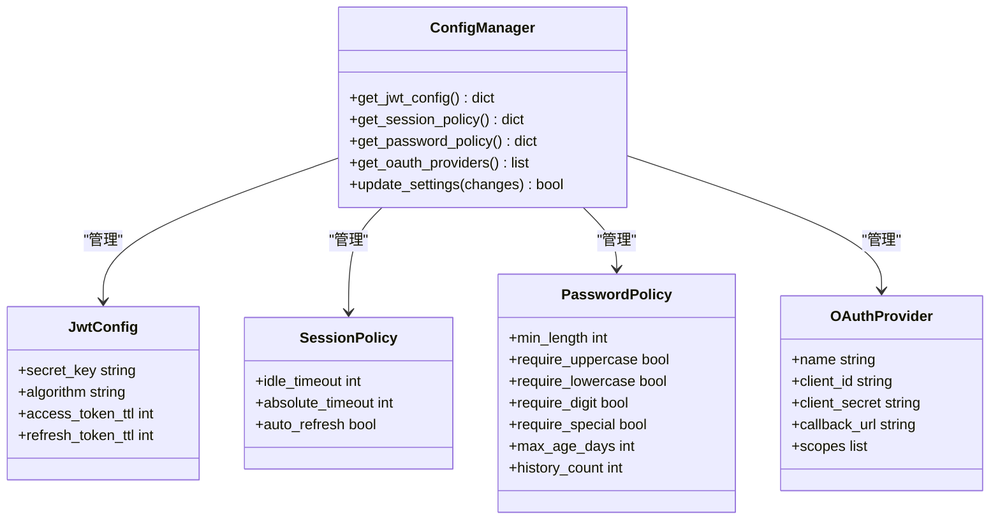

图表来源
- [src/config.py](file://src/config.py)
- [api/v1/schemas/system_config.py](file://api/v1/schemas/system_config.py)

章节来源
- [src/config.py](file://src/config.py)
- [api/v1/schemas/system_config.py](file://api/v1/schemas/system_config.py)

### 前端认证API封装与登录页
- auth.ts：封装登录、登出、刷新、获取用户信息等API调用，处理令牌存储与自动刷新
- LoginPage.tsx：用户输入凭据，调用认证API，成功后跳转或渲染主界面

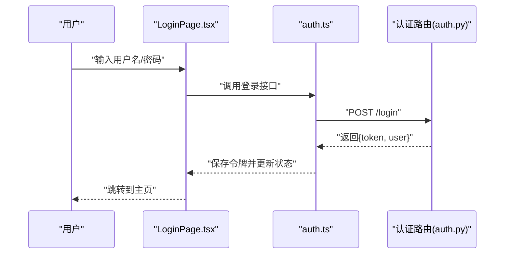

图表来源
- [apps/dsa-web/src/pages/LoginPage.tsx](file://apps/dsa-web/src/pages/LoginPage.tsx)
- [apps/dsa-web/src/api/auth.ts](file://apps/dsa-web/src/api/auth.ts)
- [api/v1/endpoints/auth.py](file://api/v1/endpoints/auth.py)

章节来源
- [apps/dsa-web/src/api/auth.ts](file://apps/dsa-web/src/api/auth.ts)
- [apps/dsa-web/src/pages/LoginPage.tsx](file://apps/dsa-web/src/pages/LoginPage.tsx)

### 多角色权限管理系统（管理员、普通用户、只读用户）
- 角色模型：管理员（全量权限）、普通用户（读写权限）、只读用户（仅读权限）
- 权限分配：基于角色的访问控制（RBAC），支持资源级与操作级权限
- 权限校验：在中间件或服务层根据用户角色判断是否允许访问

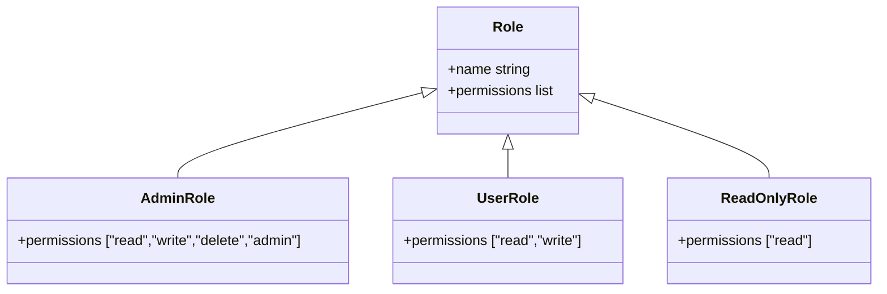

图表来源
- [api/middlewares/auth.py](file://api/middlewares/auth.py)
- [src/auth.py](file://src/auth.py)

章节来源
- [api/middlewares/auth.py](file://api/middlewares/auth.py)
- [src/auth.py](file://src/auth.py)

### 密码策略配置（复杂度、过期、重置流程）
- 复杂度要求：最小长度、大小写、数字、特殊字符
- 过期策略：最大使用天数、到期前提醒、强制修改
- 重置流程：发送重置链接/验证码、临时令牌、密码更新

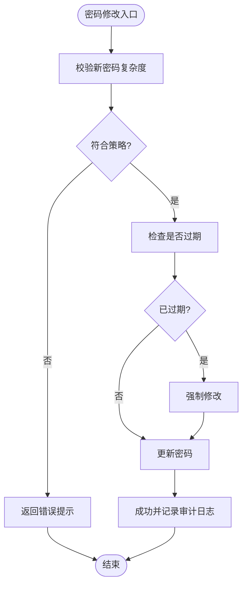

章节来源
- [src/auth.py](file://src/auth.py)
- [src/config.py](file://src/config.py)

### OAuth集成配置（第三方登录提供商）
- 支持的提供商：GitHub、Google、企业微信等（可配置扩展）
- 配置项：客户端ID/密钥、回调地址、作用域映射
- 流程：重定向至提供商、接收授权码、交换令牌、绑定本地用户

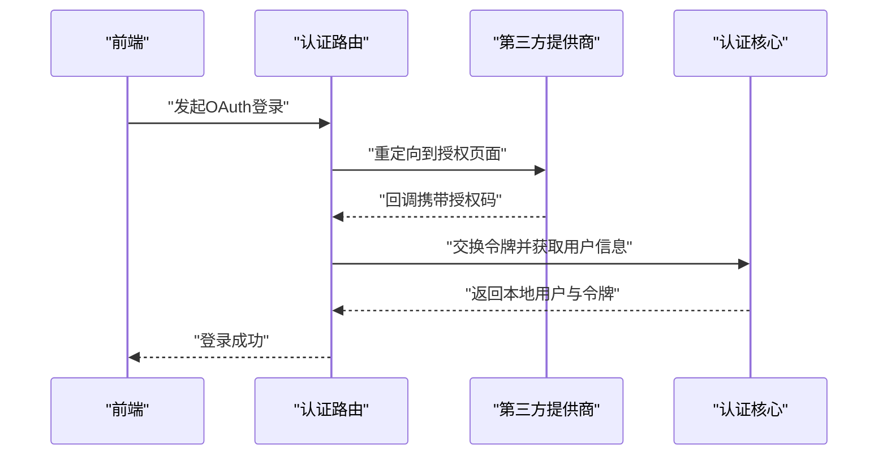

章节来源
- [api/v1/endpoints/auth.py](file://api/v1/endpoints/auth.py)
- [src/auth.py](file://src/auth.py)
- [src/config.py](file://src/config.py)

### 审计日志查看与用户活动监控
- 审计事件：登录成功/失败、权限变更、密码修改、OAuth绑定
- 查询接口：按用户、时间范围、事件类型筛选
- 监控面板：实时显示活跃用户、失败尝试、异常行为

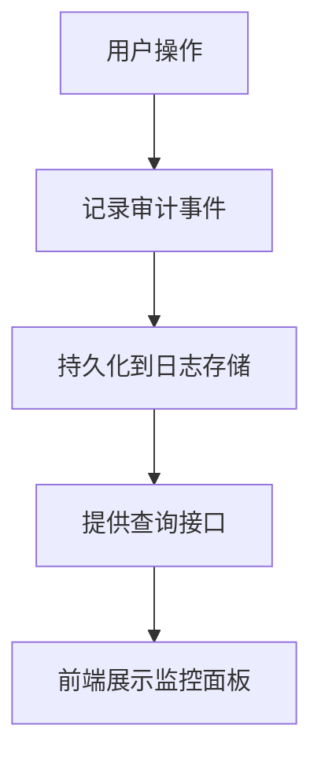

章节来源
- [api/v1/endpoints/auth.py](file://api/v1/endpoints/auth.py)
- [src/auth.py](file://src/auth.py)

## 依赖关系分析
认证设置功能的核心依赖关系如下：
- 前端依赖后端认证API
- 后端路由依赖鉴权中间件与认证核心服务
- 认证核心服务依赖配置中心获取策略参数
- 系统配置Schema用于前后端数据契约

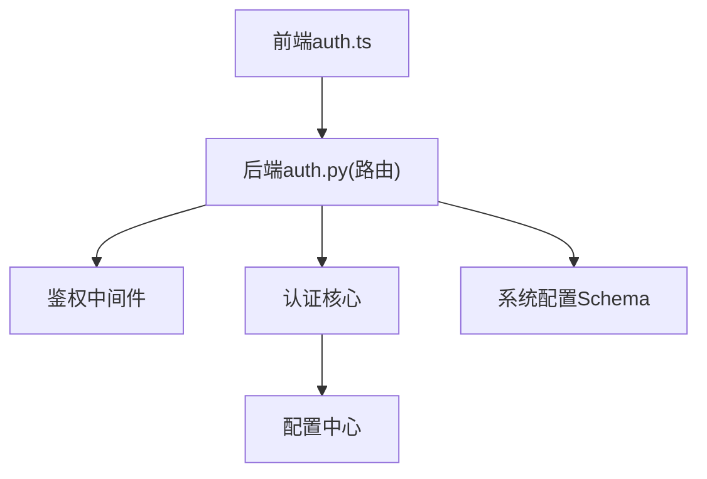

图表来源
- [apps/dsa-web/src/api/auth.ts](file://apps/dsa-web/src/api/auth.ts)
- [api/v1/endpoints/auth.py](file://api/v1/endpoints/auth.py)
- [api/middlewares/auth.py](file://api/middlewares/auth.py)
- [src/auth.py](file://src/auth.py)
- [src/config.py](file://src/config.py)
- [api/v1/schemas/system_config.py](file://api/v1/schemas/system_config.py)

章节来源
- [api/v1/endpoints/auth.py](file://api/v1/endpoints/auth.py)
- [api/middlewares/auth.py](file://api/middlewares/auth.py)
- [src/auth.py](file://src/auth.py)
- [src/config.py](file://src/config.py)
- [api/v1/schemas/system_config.py](file://api/v1/schemas/system_config.py)
- [apps/dsa-web/src/api/auth.ts](file://apps/dsa-web/src/api/auth.ts)

## 性能考量
- JWT校验开销：建议启用缓存与短生命周期令牌，减少重复计算
- 会话管理：合理设置超时时间，避免内存泄漏
- 密码校验：使用高效哈希算法（如bcrypt/argon2），避免阻塞请求
- 并发控制：限制同一用户并发会话数，防止资源滥用
- 前端优化：令牌刷新策略应防抖与重试，减少无效请求

## 故障排查指南
- 登录失败：检查用户名/密码是否正确、密码策略是否满足、账户是否被锁定
- 令牌无效：确认JWT密钥一致、服务器时间同步、令牌是否过期或被撤销
- 权限不足：核对用户角色与所需权限是否匹配，检查中间件配置
- OAuth回调失败：验证客户端ID/密钥、回调地址与作用域配置
- 审计日志缺失：确认日志写入权限与存储路径配置正确

章节来源
- [tests/test_auth.py](file://tests/test_auth.py)
- [tests/test_auth_api.py](file://tests/test_auth_api.py)

## 结论
认证设置卡片是系统安全的核心入口，涵盖JWT管理、会话策略、密码策略、OAuth集成与审计监控。通过合理的配置与最佳实践，可有效提升系统安全性与用户体验。建议定期审查权限分配与密码策略，及时更新安全配置以应对潜在威胁。

## 附录
- 安全最佳实践：
  - 使用强随机JWT密钥并定期轮换
  - 启用HTTPS与HTTP严格传输安全（HSTS）
  - 实施最小权限原则与定期权限审计
  - 启用登录失败锁定与验证码机制
  - 记录并监控敏感操作审计日志
- 常见问题解决方案：
  - 跨域问题：配置CORS白名单与凭证传递
  - 令牌泄露：避免在URL中传递令牌，使用HttpOnly Cookie
  - 会话劫持：启用SameSite与Secure标志
  - 暴力破解：实施速率限制与IP封禁策略