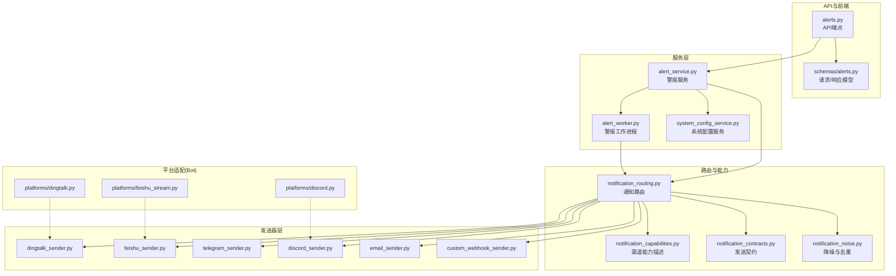
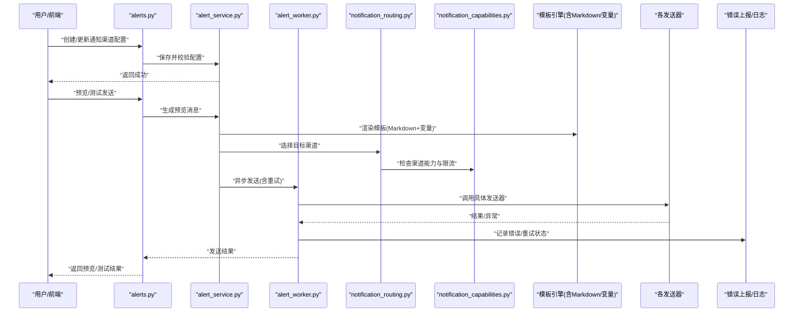
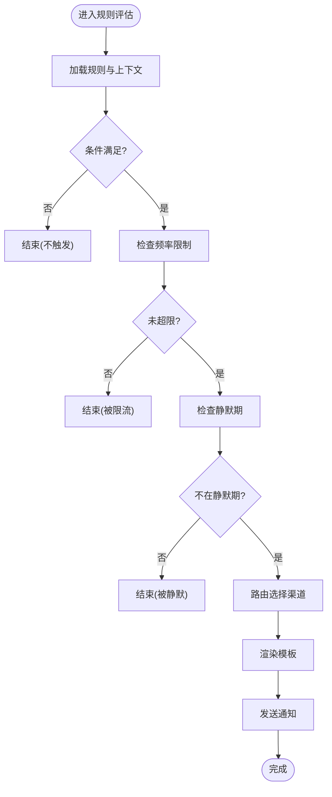
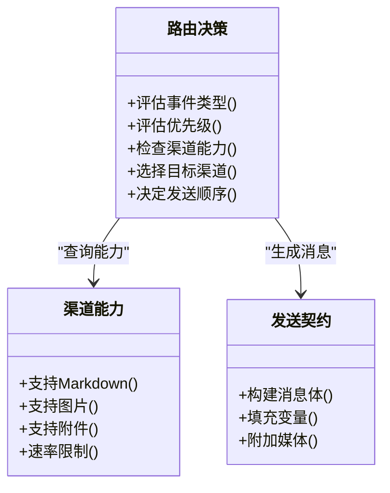
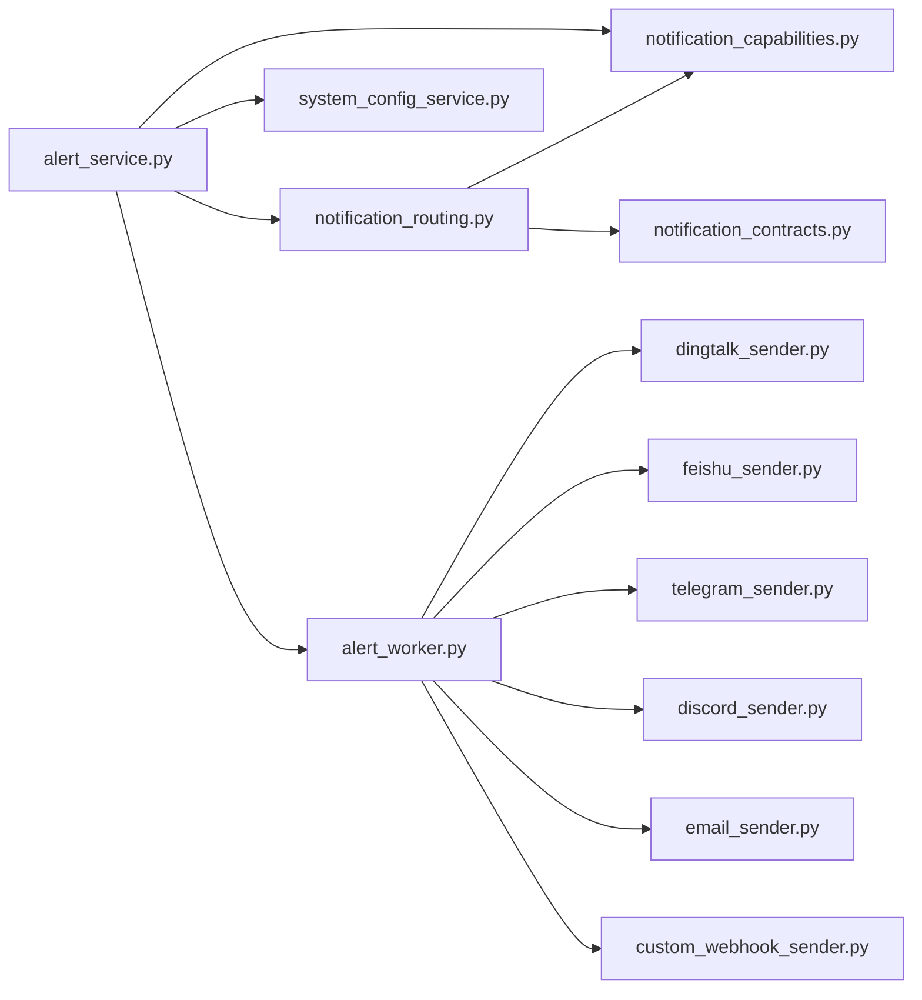

# 通知渠道设置

<cite>
**本文引用的文件**   
- [notification.py](file://src/notification.py)
- [notification_capabilities.py](file://src/notification_capabilities.py)
- [notification_contracts.py](file://src/notification_contracts.py)
- [notification_noise.py](file://src/notification_noise.py)
- [notification_routing.py](file://src/notification_routing.py)
- [services/alert_service.py](file://src/services/alert_service.py)
- [services/alert_worker.py](file://src/services/alert_worker.py)
- [services/system_config_service.py](file://src/services/system_config_service.py)
- [api/v1/endpoints/alerts.py](file://api/v1/endpoints/alerts.py)
- [api/v1/schemas/alerts.py](file://api/v1/schemas/alerts.py)
- [src/notification_sender/dingtalk_sender.py](file://src/notification_sender/dingtalk_sender.py)
- [src/notification_sender/feishu_sender.py](file://src/notification_sender/feishu_sender.py)
- [src/notification_sender/telegram_sender.py](file://src/notification_sender/telegram_sender.py)
- [src/notification_sender/discord_sender.py](file://src/notification_sender/discord_sender.py)
- [src/notification_sender/email_sender.py](file://src/notification_sender/email_sender.py)
- [src/notification_sender/custom_webhook_sender.py](file://src/notification_sender/custom_webhook_sender.py)
- [bot/platforms/dingtalk.py](file://bot/platforms/dingtalk.py)
- [bot/platforms/feishu_stream.py](file://bot/platforms/feishu_stream.py)
- [bot/platforms/discord.py](file://bot/platforms/discord.py)
- [scripts/generate_notification_actions_env_table.py](file://scripts/generate_notification_actions_env_table.py)
- [tests/test_notification.py](file://tests/test_notification.py)
- [tests/test_notification_routing.py](file://tests/test_notification_routing.py)
- [tests/test_alert_worker.py](file://tests/test_alert_worker.py)
</cite>

## 目录
1. [简介](#简介)
2. [项目结构](#项目结构)
3. [核心组件](#核心组件)
4. [架构总览](#架构总览)
5. [详细组件分析](#详细组件分析)
6. [依赖关系分析](#依赖关系分析)
7. [性能考虑](#性能考虑)
8. [故障排查指南](#故障排查指南)
9. [结论](#结论)
10. [附录](#附录)

## 简介
本文件面向“多渠道通知配置”与“警报规则”的使用与实现说明，覆盖钉钉、飞书、Telegram、Discord、邮件等平台的集成设置；消息模板的Markdown定制与动态变量替换；警报规则的条件触发、频率限制与静默期；通知路由（按事件类型与优先级自动选择渠道）；消息预览与测试发送；以及失败重试与错误报告机制。文档同时提供架构图、流程图与调用序列图，帮助非技术读者快速上手，并为开发者提供深入的技术细节。

## 项目结构
通知系统由“服务层 + 路由层 + 发送器层 + API/前端交互 + 平台适配”组成：
- 服务层：负责警报生命周期管理、任务调度、配置读取与校验。
- 路由层：根据事件类型、优先级、渠道能力与用户偏好选择目标渠道。
- 发送器层：各平台的具体发送实现（钉钉、飞书、Telegram、Discord、邮件、Webhook等）。
- API/前端：暴露配置、预览、测试发送等接口。
- 平台适配：Bot侧对部分平台的双向交互支持（如钉钉、飞书、Discord）。

图表来源
- [api/v1/endpoints/alerts.py](file://api/v1/endpoints/alerts.py)
- [api/v1/schemas/alerts.py](file://api/v1/schemas/alerts.py)
- [services/alert_service.py](file://services/alert_service.py)
- [services/alert_worker.py](file://services/alert_worker.py)
- [services/system_config_service.py](file://services/system_config_service.py)
- [notification_routing.py](file://notification_routing.py)
- [notification_capabilities.py](file://notification_capabilities.py)
- [notification_contracts.py](file://notification_contracts.py)
- [notification_noise.py](file://notification_noise.py)
- [notification_sender/dingtalk_sender.py](file://notification_sender/dingtalk_sender.py)
- [notification_sender/feishu_sender.py](file://notification_sender/feishu_sender.py)
- [notification_sender/telegram_sender.py](file://notification_sender/telegram_sender.py)
- [notification_sender/discord_sender.py](file://notification_sender/discord_sender.py)
- [notification_sender/email_sender.py](file://notification_sender/email_sender.py)
- [notification_sender/custom_webhook_sender.py](file://notification_sender/custom_webhook_sender.py)
- [bot/platforms/dingtalk.py](file://bot/platforms/dingtalk.py)
- [bot/platforms/feishu_stream.py](file://bot/platforms/feishu_stream.py)
- [bot/platforms/discord.py](file://bot/platforms/discord.py)

章节来源
- [api/v1/endpoints/alerts.py](file://api/v1/endpoints/alerts.py)
- [api/v1/schemas/alerts.py](file://api/v1/schemas/alerts.py)
- [services/alert_service.py](file://services/alert_service.py)
- [services/alert_worker.py](file://services/alert_worker.py)
- [services/system_config_service.py](file://services/system_config_service.py)
- [notification_routing.py](file://notification_routing.py)
- [notification_capabilities.py](file://notification_capabilities.py)
- [notification_contracts.py](file://notification_contracts.py)
- [notification_noise.py](file://notification_noise.py)
- [notification_sender/dingtalk_sender.py](file://notification_sender/dingtalk_sender.py)
- [notification_sender/feishu_sender.py](file://notification_sender/feishu_sender.py)
- [notification_sender/telegram_sender.py](file://notification_sender/telegram_sender.py)
- [notification_sender/discord_sender.py](file://notification_sender/discord_sender.py)
- [notification_sender/email_sender.py](file://notification_sender/email_sender.py)
- [notification_sender/custom_webhook_sender.py](file://notification_sender/custom_webhook_sender.py)
- [bot/platforms/dingtalk.py](file://bot/platforms/dingtalk.py)
- [bot/platforms/feishu_stream.py](file://bot/platforms/feishu_stream.py)
- [bot/platforms/discord.py](file://bot/platforms/discord.py)

## 核心组件
- 通知契约与能力
  - 统一发送契约定义消息体、字段约束与扩展点，确保多通道一致体验。
  - 渠道能力描述声明各平台支持的格式（文本、富文本、图片、附件）、速率限制与特性开关。
- 通知路由
  - 基于事件类型、优先级、渠道可用性与用户偏好进行决策，输出目标渠道列表及发送策略。
- 降噪与去重
  - 针对同一事件在短时间内重复触发时进行合并或抑制，避免告警风暴。
- 发送器实现
  - 各平台具体发送逻辑封装为独立模块，便于扩展与维护。
- 警报服务与工作进程
  - 服务层负责规则匹配、模板渲染、路由与发送编排；工作进程负责异步执行、重试与错误上报。
- 系统配置服务
  - 集中管理渠道密钥、URL、模板变量、频率限制与静默期等配置项。

章节来源
- [notification_contracts.py](file://notification_contracts.py)
- [notification_capabilities.py](file://notification_capabilities.py)
- [notification_routing.py](file://notification_routing.py)
- [notification_noise.py](file://notification_noise.py)
- [notification_sender/dingtalk_sender.py](file://notification_sender/dingtalk_sender.py)
- [notification_sender/feishu_sender.py](file://notification_sender/feishu_sender.py)
- [notification_sender/telegram_sender.py](file://notification_sender/telegram_sender.py)
- [notification_sender/discord_sender.py](file://notification_sender/discord_sender.py)
- [notification_sender/email_sender.py](file://notification_sender/email_sender.py)
- [notification_sender/custom_webhook_sender.py](file://notification_sender/custom_webhook_sender.py)
- [services/alert_service.py](file://services/alert_service.py)
- [services/alert_worker.py](file://services/alert_worker.py)
- [services/system_config_service.py](file://services/system_config_service.py)

## 架构总览
下图展示从API到发送器的完整调用链，包括路由、能力检查、模板渲染、重试与错误上报。

图表来源
- [api/v1/endpoints/alerts.py](file://api/v1/endpoints/alerts.py)
- [services/alert_service.py](file://services/alert_service.py)
- [services/alert_worker.py](file://services/alert_worker.py)
- [notification_routing.py](file://notification_routing.py)
- [notification_capabilities.py](file://notification_capabilities.py)
- [notification_sender/dingtalk_sender.py](file://notification_sender/dingtalk_sender.py)
- [notification_sender/feishu_sender.py](file://notification_sender/feishu_sender.py)
- [notification_sender/telegram_sender.py](file://notification_sender/telegram_sender.py)
- [notification_sender/discord_sender.py](file://notification_sender/discord_sender.py)
- [notification_sender/email_sender.py](file://notification_sender/email_sender.py)
- [notification_sender/custom_webhook_sender.py](file://notification_sender/custom_webhook_sender.py)

## 详细组件分析

### 多渠道通知配置界面（钉钉、飞书、Telegram、Discord、邮件）
- 配置项要点
  - 认证信息：Token、Secret、AppID、Webhook URL、邮箱账号/密码或SMTP服务器参数。
  - 发送目标：群聊ID、频道ID、收件人列表、标签或主题。
  - 行为选项：是否启用富文本/图片、是否允许附件、是否开启Markdown渲染。
  - 安全与审计：敏感字段加密存储、访问日志与操作审计。
- 配置验证
  - 必填字段校验、格式校验、连通性探测（可选）。
  - 与系统配置服务联动，持久化至后端存储。
- 前端交互
  - 表单校验、实时提示、保存/取消、导入导出配置。

章节来源
- [api/v1/endpoints/alerts.py](file://api/v1/endpoints/alerts.py)
- [api/v1/schemas/alerts.py](file://api/v1/schemas/alerts.py)
- [services/system_config_service.py](file://services/system_config_service.py)
- [notification_sender/dingtalk_sender.py](file://notification_sender/dingtalk_sender.py)
- [notification_sender/feishu_sender.py](file://notification_sender/feishu_sender.py)
- [notification_sender/telegram_sender.py](file://notification_sender/telegram_sender.py)
- [notification_sender/discord_sender.py](file://notification_sender/discord_sender.py)
- [notification_sender/email_sender.py](file://notification_sender/email_sender.py)

### 消息模板定制（Markdown与动态变量）
- 模板语言
  - 支持Markdown语法，用于标题、正文、表格、链接与图片。
  - 动态变量通过占位符注入，如股票名称、价格、涨跌幅、指标值、时间戳等。
- 变量解析
  - 在渲染前进行变量存在性检查与默认值回退，避免空内容。
  - 支持条件片段（例如仅当某指标超过阈值时显示）。
- 预览与测试
  - 预览模式不实际发送，仅渲染最终内容供确认。
  - 测试发送可指定单条渠道，快速验证模板与变量映射。

章节来源
- [services/alert_service.py](file://services/alert_service.py)
- [services/alert_worker.py](file://services/alert_worker.py)
- [api/v1/endpoints/alerts.py](file://api/v1/endpoints/alerts.py)
- [api/v1/schemas/alerts.py](file://api/v1/schemas/alerts.py)

### 警报规则配置（条件触发、频率限制、静默期）
- 条件触发
  - 支持数值阈值、区间判断、组合条件（与/或/非）。
  - 支持时间窗口（如N分钟内连续触发）与数据源过滤（标的、板块、指数）。
- 频率限制
  - 全局与渠道级限流，防止短时间内重复通知。
  - 支持滑动窗口与固定周期两种策略。
- 静默期
  - 同一事件在静默期内不再重复发送，降低噪音。
  - 可按事件维度（标的+指标+条件）隔离静默状态。

图表来源
- [services/alert_service.py](file://services/alert_service.py)
- [services/alert_worker.py](file://services/alert_worker.py)
- [notification_noise.py](file://notification_noise.py)
- [notification_routing.py](file://notification_routing.py)

章节来源
- [services/alert_service.py](file://services/alert_service.py)
- [services/alert_worker.py](file://services/alert_worker.py)
- [notification_noise.py](file://notification_noise.py)
- [notification_routing.py](file://notification_routing.py)

### 通知路由逻辑（按事件类型与优先级自动选择渠道）
- 决策依据
  - 事件类型（如价格突破、技术指标异常、组合风险信号）。
  - 优先级（高/中/低），影响渠道选择与发送顺序。
  - 渠道能力（是否支持富文本、图片、附件）。
  - 用户偏好与渠道可用性（在线状态、配额限制）。
- 路由策略
  - 首选渠道：高优先级优先IM类（钉钉、飞书、Telegram、Discord）。
  - 备选渠道：邮件作为兜底，适用于长文与附件。
  - 并行/串行：关键事件可并行发送到多个渠道，普通事件串行以节省资源。
- 能力检查
  - 发送前校验渠道能力与限流，必要时降级或跳过。

图表来源
- [notification_routing.py](file://notification_routing.py)
- [notification_capabilities.py](file://notification_capabilities.py)
- [notification_contracts.py](file://notification_contracts.py)

章节来源
- [notification_routing.py](file://notification_routing.py)
- [notification_capabilities.py](file://notification_capabilities.py)
- [notification_contracts.py](file://notification_contracts.py)

### 消息预览与测试发送
- 预览
  - 输入事件上下文与模板变量，渲染最终内容，不实际发送。
  - 支持切换不同渠道预览差异（如Markdown vs 富文本）。
- 测试发送
  - 选择目标渠道与消息内容，立即发送一次以验证配置与模板。
  - 返回发送结果与错误详情，便于定位问题。

章节来源
- [api/v1/endpoints/alerts.py](file://api/v1/endpoints/alerts.py)
- [api/v1/schemas/alerts.py](file://api/v1/schemas/alerts.py)
- [services/alert_service.py](file://services/alert_service.py)
- [services/alert_worker.py](file://services/alert_worker.py)

### 失败重试与错误报告
- 重试策略
  - 指数退避与最大重试次数，避免雪崩。
  - 区分网络错误与业务错误，后者可能直接失败。
- 错误上报
  - 记录错误码、错误信息与上下文（事件ID、渠道、模板变量摘要）。
  - 支持聚合统计与告警，便于运维监控。
- 幂等与去重
  - 发送请求具备唯一标识，避免重复投递。
  - 结合降噪模块抑制重复通知。

章节来源
- [services/alert_worker.py](file://services/alert_worker.py)
- [notification_noise.py](file://notification_noise.py)
- [notification_sender/dingtalk_sender.py](file://notification_sender/dingtalk_sender.py)
- [notification_sender/feishu_sender.py](file://notification_sender/feishu_sender.py)
- [notification_sender/telegram_sender.py](file://notification_sender/telegram_sender.py)
- [notification_sender/discord_sender.py](file://notification_sender/discord_sender.py)
- [notification_sender/email_sender.py](file://notification_sender/email_sender.py)
- [notification_sender/custom_webhook_sender.py](file://notification_sender/custom_webhook_sender.py)

## 依赖关系分析
- 组件耦合
  - 服务层依赖路由与能力模块，发送器之间相互独立，降低耦合度。
  - 配置服务为所有组件提供统一的配置读取与校验。
- 外部依赖
  - 各发送器对接第三方平台API，需处理鉴权、限流与错误码映射。
  - Bot平台适配与通知发送器解耦，前者侧重双向交互，后者侧重单向推送。
- 潜在循环依赖
  - 路由与能力模块无循环依赖；发送器不反向依赖路由，保证单向调用。

图表来源
- [services/alert_service.py](file://services/alert_service.py)
- [services/alert_worker.py](file://services/alert_worker.py)
- [services/system_config_service.py](file://services/system_config_service.py)
- [notification_routing.py](file://notification_routing.py)
- [notification_capabilities.py](file://notification_capabilities.py)
- [notification_contracts.py](file://notification_contracts.py)
- [notification_sender/dingtalk_sender.py](file://notification_sender/dingtalk_sender.py)
- [notification_sender/feishu_sender.py](file://notification_sender/feishu_sender.py)
- [notification_sender/telegram_sender.py](file://notification_sender/telegram_sender.py)
- [notification_sender/discord_sender.py](file://notification_sender/discord_sender.py)
- [notification_sender/email_sender.py](file://notification_sender/email_sender.py)
- [notification_sender/custom_webhook_sender.py](file://notification_sender/custom_webhook_sender.py)

章节来源
- [services/alert_service.py](file://services/alert_service.py)
- [services/alert_worker.py](file://services/alert_worker.py)
- [services/system_config_service.py](file://services/system_config_service.py)
- [notification_routing.py](file://notification_routing.py)
- [notification_capabilities.py](file://notification_capabilities.py)
- [notification_contracts.py](file://notification_contracts.py)
- [notification_sender/dingtalk_sender.py](file://notification_sender/dingtalk_sender.py)
- [notification_sender/feishu_sender.py](file://notification_sender/feishu_sender.py)
- [notification_sender/telegram_sender.py](file://notification_sender/telegram_sender.py)
- [notification_sender/discord_sender.py](file://notification_sender/discord_sender.py)
- [notification_sender/email_sender.py](file://notification_sender/email_sender.py)
- [notification_sender/custom_webhook_sender.py](file://notification_sender/custom_webhook_sender.py)

## 性能考虑
- 异步发送
  - 使用工作进程异步执行发送任务，避免阻塞主流程。
- 批量与合并
  - 对相同事件的多次触发进行合并，减少冗余发送。
- 缓存与预热
  - 渠道能力与配置缓存，减少重复计算与IO。
- 限流与背压
  - 渠道级限流与队列长度控制，防止过载。
- 资源隔离
  - 不同渠道发送器独立线程/进程，避免互相影响。

[本节为通用指导，无需引用具体文件]

## 故障排查指南
- 常见问题
  - 渠道配置错误：检查Token、Secret、URL与权限。
  - 模板变量缺失：确认变量名与上下文一致，设置默认值。
  - 频率限制触发：调整限流策略或扩大窗口。
  - 静默期过长：检查事件维度与静默期设置。
- 诊断工具
  - 预览与测试发送：快速验证模板与渠道连通性。
  - 错误日志与上报：查看错误码、堆栈与上下文。
  - 能力检查：确认渠道支持的功能与限制。
- 修复建议
  - 逐步缩小范围（先单渠道、后多渠道；先简单模板、后复杂模板）。
  - 启用调试日志，捕获关键路径数据。
  - 参考脚本生成环境变量表，核对配置一致性。

章节来源
- [api/v1/endpoints/alerts.py](file://api/v1/endpoints/alerts.py)
- [services/alert_service.py](file://services/alert_service.py)
- [services/alert_worker.py](file://services/alert_worker.py)
- [notification_noise.py](file://notification_noise.py)
- [scripts/generate_notification_actions_env_table.py](file://scripts/generate_notification_actions_env_table.py)

## 结论
本通知系统通过清晰的职责分层与模块化设计，实现了多渠道通知的统一接入与灵活路由。借助Markdown模板与动态变量，用户可高度定制消息内容；通过条件触发、频率限制与静默期，有效降低噪音与误报。预览与测试发送功能提升了配置效率，而重试与错误报告机制保障了可靠性与可观测性。建议在生产环境中结合监控与告警，持续优化路由策略与模板质量。

[本节为总结性内容，无需引用具体文件]

## 附录
- 环境变量与动作表生成
  - 使用脚本生成通知动作与环境变量对照表，便于配置管理与审计。
- 测试用例参考
  - 通知基础功能、路由策略、工作进程行为等测试用例，可作为集成测试参考。

章节来源
- [scripts/generate_notification_actions_env_table.py](file://scripts/generate_notification_actions_env_table.py)
- [tests/test_notification.py](file://tests/test_notification.py)
- [tests/test_notification_routing.py](file://tests/test_notification_routing.py)
- [tests/test_alert_worker.py](file://tests/test_alert_worker.py)