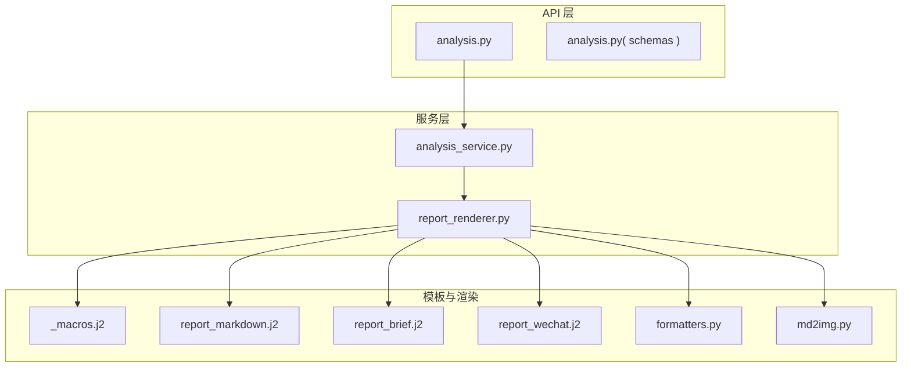
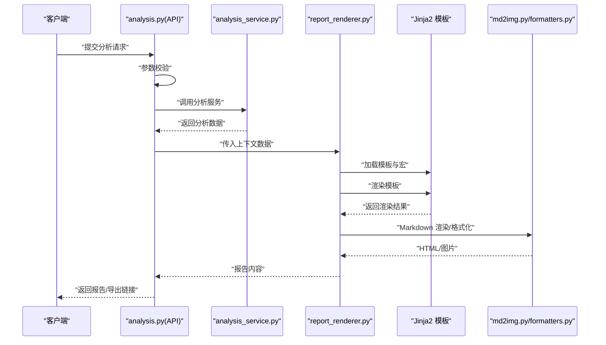
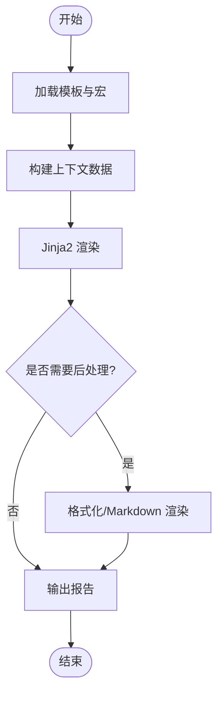
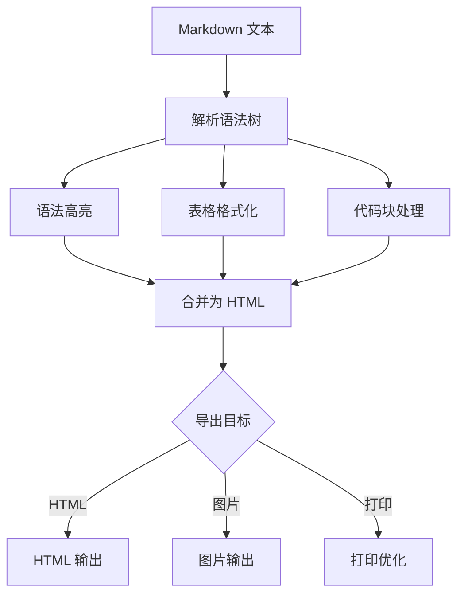
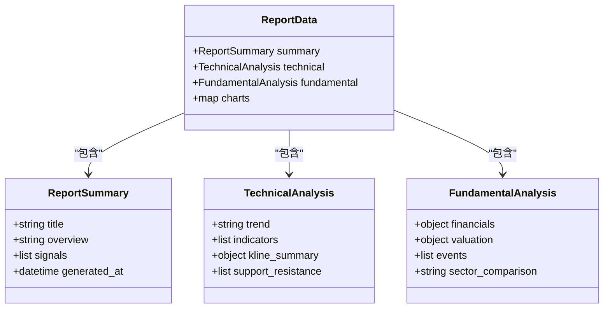
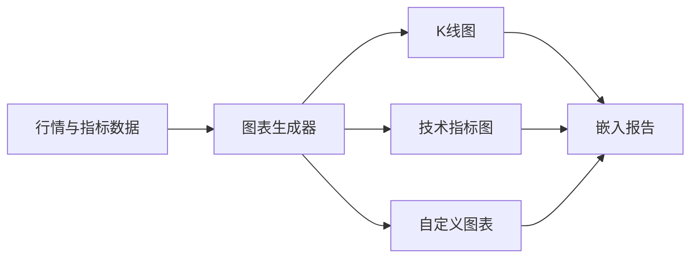
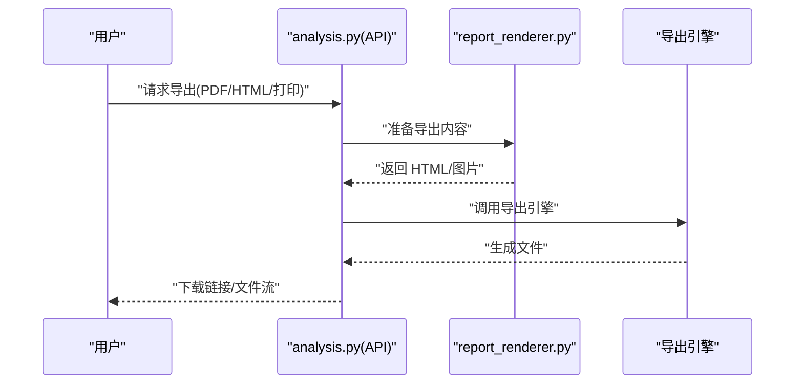
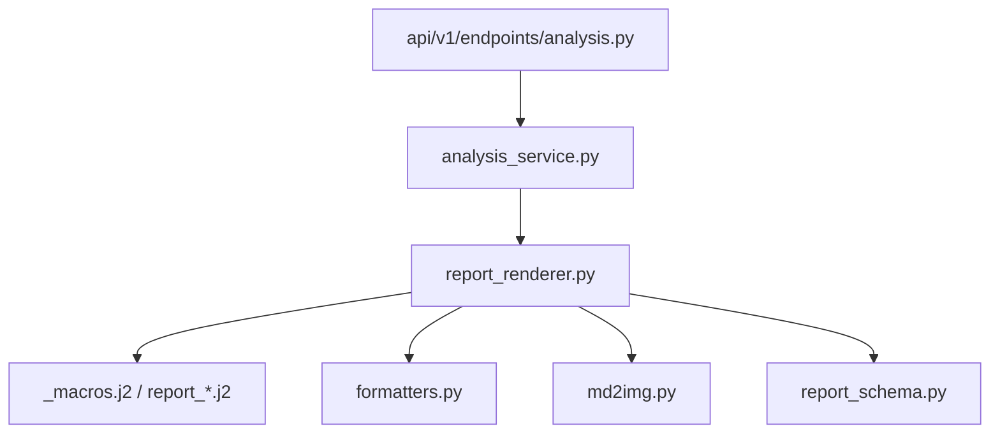

# 分析报告生成

<cite>
**本文引用的文件**   
- [report_renderer.py](file://src/services/report_renderer.py)
- [report_schema.py](file://src/schemas/report_schema.py)
- [formatters.py](file://src/formatters.py)
- [md2img.py](file://src/md2img.py)
- [templates/_macros.j2](file://templates/_macros.j2)
- [templates/report_markdown.j2](file://templates/report_markdown.j2)
- [templates/report_brief.j2](file://templates/report_brief.j2)
- [templates/report_wechat.j2](file://templates/report_wechat.j2)
- [analysis_service.py](file://src/services/analysis_service.py)
- [api/v1/endpoints/analysis.py](file://api/v1/endpoints/analysis.py)
- [api/v1/schemas/analysis.py](file://api/v1/schemas/analysis.py)
- [tests/test_report_renderer.py](file://tests/test_report_renderer.py)
</cite>

## 目录
1. [简介](#简介)
2. [项目结构](#项目结构)
3. [核心组件](#核心组件)
4. [架构总览](#架构总览)
5. [详细组件分析](#详细组件分析)
6. [依赖关系分析](#依赖关系分析)
7. [性能考量](#性能考量)
8. [故障排查指南](#故障排查指南)
9. [结论](#结论)
10. [附录](#附录)

## 简介
本报告聚焦“分析报告生成功能”，覆盖模板系统与渲染机制、Markdown 渲染能力（语法高亮、代码块与表格）、结构化内容组织（摘要、技术分析、基本面分析）、图表可视化（K线图、技术指标图、自定义图表）以及导出能力（PDF、HTML、打印优化）。文档面向不同技术背景的读者，提供从高层架构到实现细节的完整说明。

## 项目结构
报告生成相关代码主要分布在以下位置：
- 服务层：报告渲染服务、分析服务等
- 模板引擎：Jinja2 模板与宏
- Markdown 渲染：Markdown 转图片、格式化工具
- API 层：对外暴露的分析与报告接口
- 测试：针对报告渲染与格式的单元测试

**图示来源** 
- [api/v1/endpoints/analysis.py](file://api/v1/endpoints/analysis.py)
- [api/v1/schemas/analysis.py](file://api/v1/schemas/analysis.py)
- [analysis_service.py](file://src/services/analysis_service.py)
- [report_renderer.py](file://src/services/report_renderer.py)
- [templates/_macros.j2](file://templates/_macros.j2)
- [templates/report_markdown.j2](file://templates/report_markdown.j2)
- [templates/report_brief.j2](file://templates/report_brief.j2)
- [templates/report_wechat.j2](file://templates/report_wechat.j2)
- [formatters.py](file://src/formatters.py)
- [md2img.py](file://src/md2img.py)

**章节来源**
- [report_renderer.py](file://src/services/report_renderer.py)
- [report_schema.py](file://src/schemas/report_schema.py)
- [formatters.py](file://src/formatters.py)
- [md2img.py](file://src/md2img.py)
- [templates/_macros.j2](file://templates/_macros.j2)
- [templates/report_markdown.j2](file://templates/report_markdown.j2)
- [templates/report_brief.j2](file://templates/report_brief.j2)
- [templates/report_wechat.j2](file://templates/report_wechat.j2)
- [analysis_service.py](file://src/services/analysis_service.py)
- [api/v1/endpoints/analysis.py](file://api/v1/endpoints/analysis.py)
- [api/v1/schemas/analysis.py](file://api/v1/schemas/analysis.py)

## 核心组件
- 报告渲染服务：负责加载模板、组装上下文数据、执行 Jinja2 渲染、调用格式化与 Markdown 渲染工具，并输出多种格式。
- 模板系统：使用 Jinja2 模板与宏，支持多语言、多渠道（Markdown、简报、微信等）输出。
- Markdown 渲染：将 Markdown 文本转换为 HTML/图片，支持代码块、表格、列表等常见语法。
- 数据结构与校验：通过 Pydantic Schema 定义报告结构与字段约束，确保输入输出一致性。
- API 集成：对外暴露分析请求与报告获取接口，串联分析服务与渲染服务。

**章节来源**
- [report_renderer.py](file://src/services/report_renderer.py)
- [report_schema.py](file://src/schemas/report_schema.py)
- [formatters.py](file://src/formatters.py)
- [md2img.py](file://src/md2img.py)
- [analysis_service.py](file://src/services/analysis_service.py)
- [api/v1/endpoints/analysis.py](file://api/v1/endpoints/analysis.py)
- [api/v1/schemas/analysis.py](file://api/v1/schemas/analysis.py)

## 架构总览
报告生成的端到端流程如下：
- 客户端发起分析请求（包含标的、时间窗口、分析维度等）
- API 层接收请求并进行参数校验
- 分析服务聚合数据（行情、基本面、技术指标等）
- 报告渲染服务根据模板与上下文数据生成报告
- 可选地通过 Markdown 渲染器生成 HTML/图片
- 返回结果或触发导出（PDF/HTML/打印优化）

**图示来源** 
- [api/v1/endpoints/analysis.py](file://api/v1/endpoints/analysis.py)
- [analysis_service.py](file://src/services/analysis_service.py)
- [report_renderer.py](file://src/services/report_renderer.py)
- [templates/_macros.j2](file://templates/_macros.j2)
- [templates/report_markdown.j2](file://templates/report_markdown.j2)
- [formatters.py](file://src/formatters.py)
- [md2img.py](file://src/md2img.py)

## 详细组件分析

### 模板系统与渲染机制（Jinja2）
- 模板文件：
  - report_markdown.j2：主 Markdown 报告模板
  - report_brief.j2：简报模板
  - report_wechat.j2：微信渠道模板
  - _macros.j2：可复用的宏（如指标卡片、段落样式、图表占位符等）
- 渲染流程：
  - 渲染服务加载模板与宏，构建上下文数据（标的信息、技术指标、基本面数据、策略信号等）
  - 通过 Jinja2 引擎进行变量替换与条件渲染
  - 支持多语言切换与渠道差异化布局
- 动态内容替换：
  - 模板中通过变量与循环插入动态数据（如 K 线数据点、指标序列、新闻摘要）
  - 使用宏封装重复片段，提升模板复用性与可读性

**图示来源** 
- [report_renderer.py](file://src/services/report_renderer.py)
- [templates/_macros.j2](file://templates/_macros.j2)
- [templates/report_markdown.j2](file://templates/report_markdown.j2)
- [templates/report_brief.j2](file://templates/report_brief.j2)
- [templates/report_wechat.j2](file://templates/report_wechat.j2)

**章节来源**
- [report_renderer.py](file://src/services/report_renderer.py)
- [templates/_macros.j2](file://templates/_macros.j2)
- [templates/report_markdown.j2](file://templates/report_markdown.j2)
- [templates/report_brief.j2](file://templates/report_brief.j2)
- [templates/report_wechat.j2](file://templates/report_wechat.j2)

### Markdown 渲染功能（语法高亮、代码块、表格）
- 语法高亮：对代码块进行语言识别与高亮显示
- 代码块显示：保留缩进与行号，支持复制与折叠
- 表格格式化：自动对齐列宽、表头加粗、响应式适配
- 渲染路径：
  - 将 Markdown 文本转换为 HTML
  - 可选地将 HTML 转为图片用于消息推送或预览
  - 支持在报告中嵌入图表占位符与外部资源引用

**图示来源** 
- [formatters.py](file://src/formatters.py)
- [md2img.py](file://src/md2img.py)

**章节来源**
- [formatters.py](file://src/formatters.py)
- [md2img.py](file://src/md2img.py)

### 报告内容的结构化组织（摘要、技术分析、基本面分析）
- 摘要模块：概述市场阶段、关键信号与操作建议
- 技术分析模块：K 线形态、趋势线、支撑阻力、成交量、技术指标（RSI/MACD/布林带等）
- 基本面分析模块：财务指标、估值、行业对比、事件驱动
- 模块化设计：
  - 各模块以独立的数据结构表示，便于模板渲染与扩展
  - 通过统一 Schema 校验字段完整性与类型正确性

**图示来源** 
- [report_schema.py](file://src/schemas/report_schema.py)

**章节来源**
- [report_schema.py](file://src/schemas/report_schema.py)

### 图表可视化（K线图、技术指标图、自定义图表）
- K线图：展示开盘、收盘、最高、最低与成交量，支持时间轴缩放与标注
- 技术指标图：叠加均线、MACD、RSI、布林带等指标曲线与信号标记
- 自定义图表：支持热力图、散点图、雷达图等，用于多维度对比与归因分析
- 渲染方式：
  - 前端组件渲染（交互式）
  - 后端生成静态图片或 SVG，用于离线查看与导出

[本图为概念性流程图，不直接映射具体源码文件]

### 报告导出（PDF、HTML、打印优化）
- HTML 导出：基于渲染后的 HTML 模板，注入样式与脚本，支持主题切换与交互
- PDF 生成：通过 HTML/PDF 转换工具链生成高质量 PDF，适合归档与分享
- 打印优化：调整分页、页眉页脚、字体与边距，确保打印效果清晰
- 导出流程：
  - 选择导出格式与选项
  - 渲染 HTML 或生成图片
  - 调用导出引擎生成最终文件

**图示来源** 
- [api/v1/endpoints/analysis.py](file://api/v1/endpoints/analysis.py)
- [report_renderer.py](file://src/services/report_renderer.py)

**章节来源**
- [api/v1/endpoints/analysis.py](file://api/v1/endpoints/analysis.py)
- [report_renderer.py](file://src/services/report_renderer.py)

## 依赖关系分析
- API 层依赖分析服务与报告渲染服务
- 报告渲染服务依赖模板引擎、格式化与 Markdown 渲染工具
- 模板依赖宏与共享片段
- 数据结构由 Schema 定义，贯穿 API、服务与模板

**图示来源** 
- [api/v1/endpoints/analysis.py](file://api/v1/endpoints/analysis.py)
- [analysis_service.py](file://src/services/analysis_service.py)
- [report_renderer.py](file://src/services/report_renderer.py)
- [templates/_macros.j2](file://templates/_macros.j2)
- [templates/report_markdown.j2](file://templates/report_markdown.j2)
- [templates/report_brief.j2](file://templates/report_brief.j2)
- [templates/report_wechat.j2](file://templates/report_wechat.j2)
- [formatters.py](file://src/formatters.py)
- [md2img.py](file://src/md2img.py)
- [report_schema.py](file://src/schemas/report_schema.py)

**章节来源**
- [api/v1/endpoints/analysis.py](file://api/v1/endpoints/analysis.py)
- [analysis_service.py](file://src/services/analysis_service.py)
- [report_renderer.py](file://src/services/report_renderer.py)
- [templates/_macros.j2](file://templates/_macros.j2)
- [templates/report_markdown.j2](file://templates/report_markdown.j2)
- [templates/report_brief.j2](file://templates/report_brief.j2)
- [templates/report_wechat.j2](file://templates/report_wechat.j2)
- [formatters.py](file://src/formatters.py)
- [md2img.py](file://src/md2img.py)
- [report_schema.py](file://src/schemas/report_schema.py)

## 性能考量
- 模板渲染缓存：对常用模板与宏进行缓存，减少重复加载开销
- 数据预取与批处理：批量拉取行情与基本面数据，降低网络延迟
- 异步渲染：对耗时任务（如图片生成、PDF 导出）采用异步队列
- 增量更新：仅重新渲染变更模块，避免全量重建
- 资源限制：控制并发与内存占用，防止大报告导致 OOM

[本节为通用指导，不直接分析具体文件]

## 故障排查指南
- 模板渲染失败：检查模板语法与变量名是否匹配，确认宏导入路径
- Markdown 渲染异常：验证输入文本合法性，检查高亮与表格解析配置
- 导出失败：确认导出引擎可用性与依赖库版本，检查权限与磁盘空间
- 数据缺失：核对上游数据源可用性，增加重试与降级逻辑
- 日志定位：启用详细日志，记录渲染步骤与错误堆栈

**章节来源**
- [tests/test_report_renderer.py](file://tests/test_report_renderer.py)

## 结论
本报告生成体系以 Jinja2 模板为核心，结合 Markdown 渲染与结构化数据模型，实现了多格式、多渠道的报告输出。通过模块化设计与清晰的依赖关系，系统在可扩展性与可维护性方面具备良好基础。未来可在性能优化、图表交互与导出质量上持续改进。

[本节为总结性内容，不直接分析具体文件]

## 附录
- 使用示例：参考测试用例与 API 文档，了解如何构造分析请求与获取报告
- 扩展模板：在模板目录新增渠道模板，并在渲染服务中注册
- 自定义图表：扩展图表生成器，支持新的可视化类型

[本节为补充信息，不直接分析具体文件]