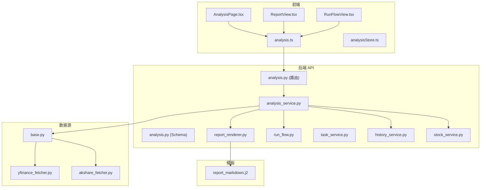
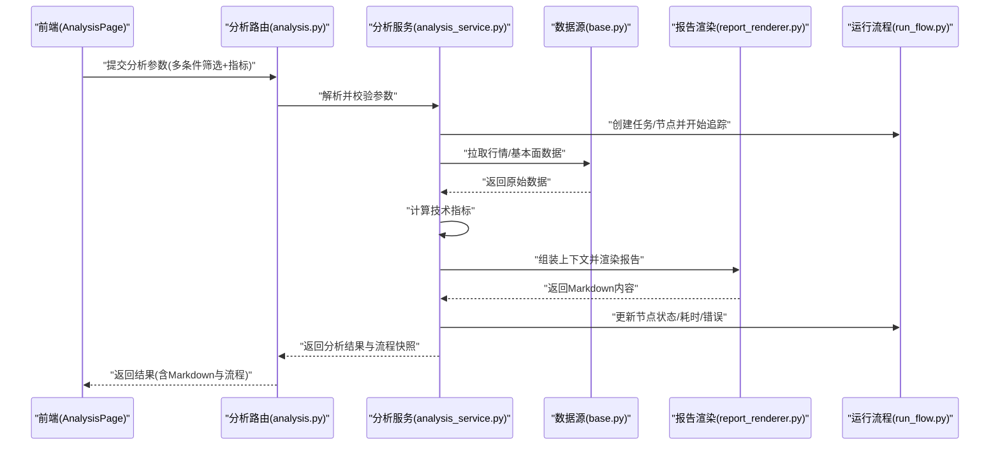
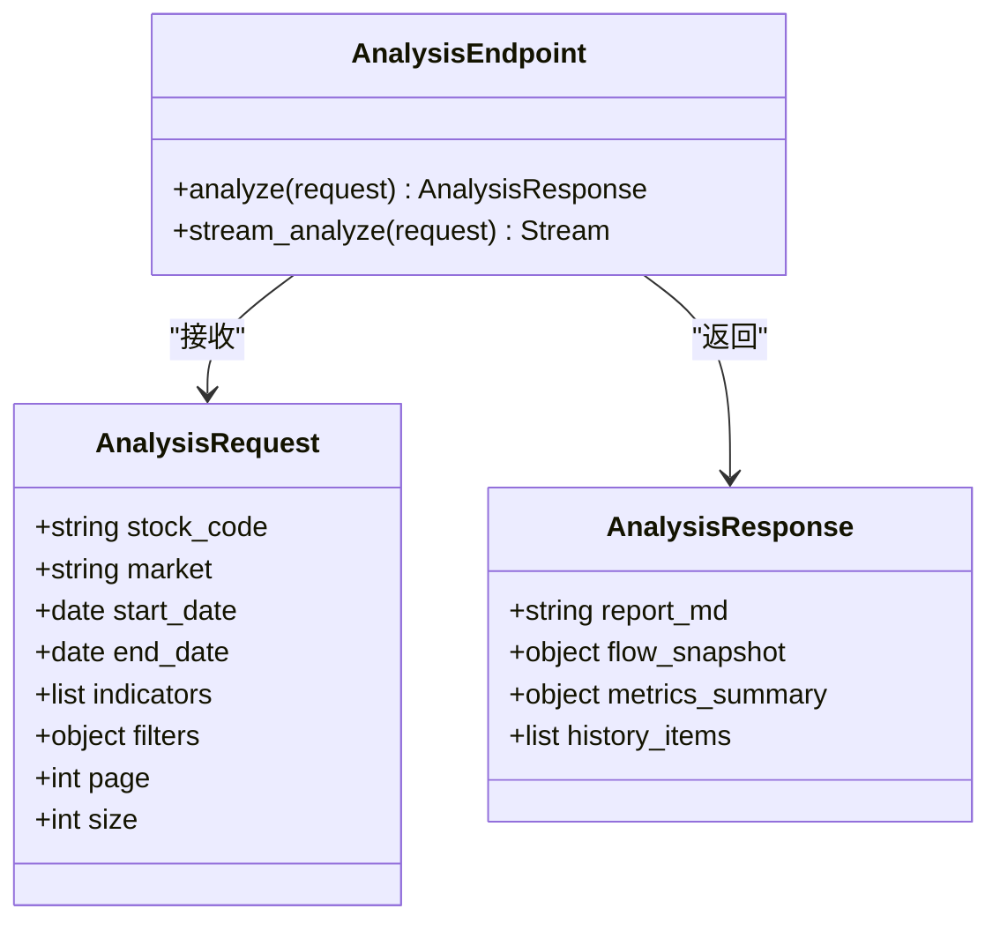
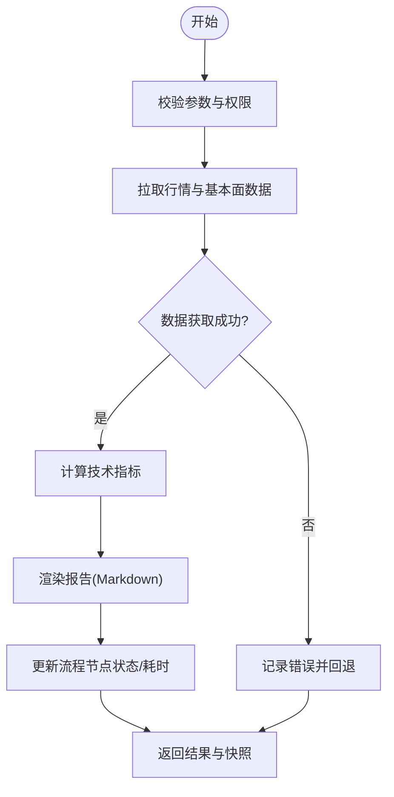
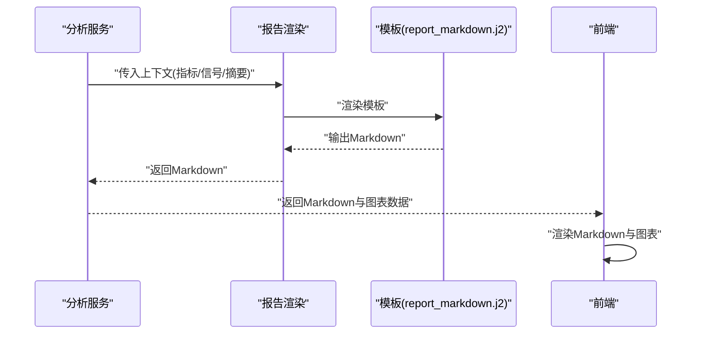
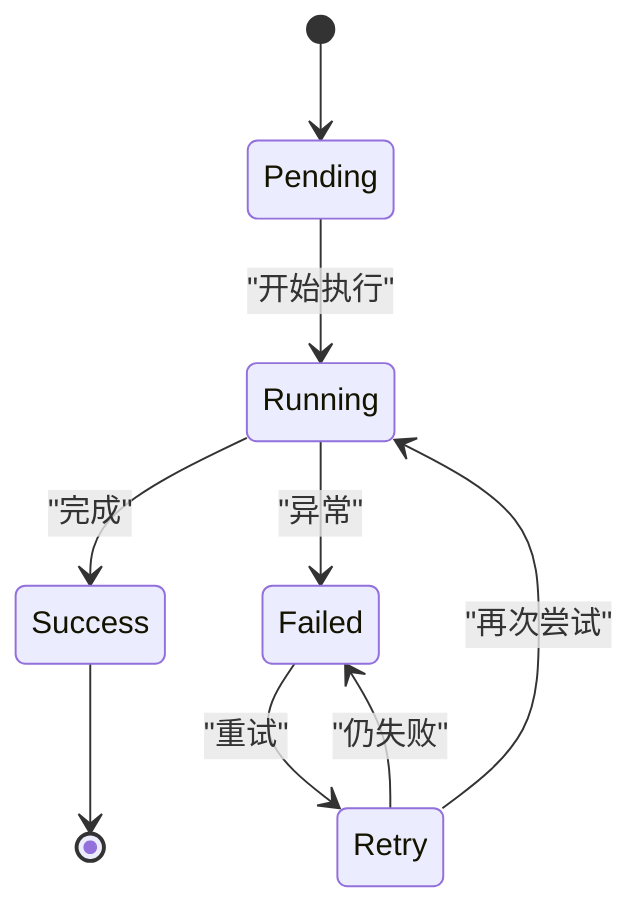
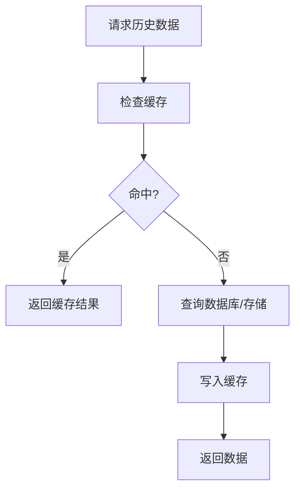
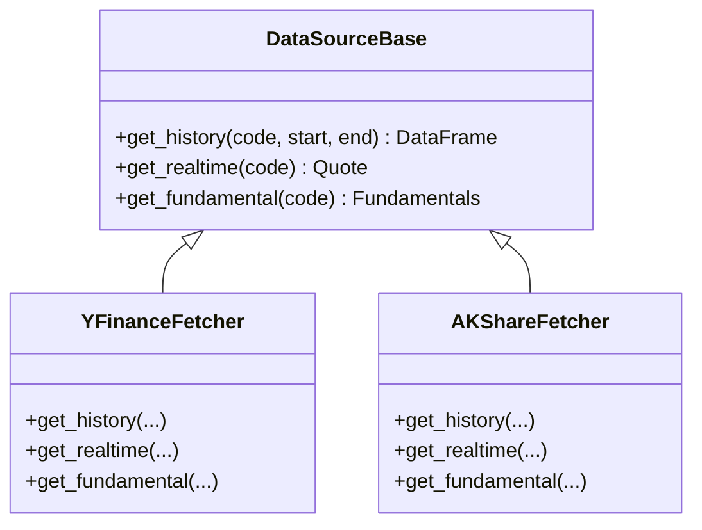
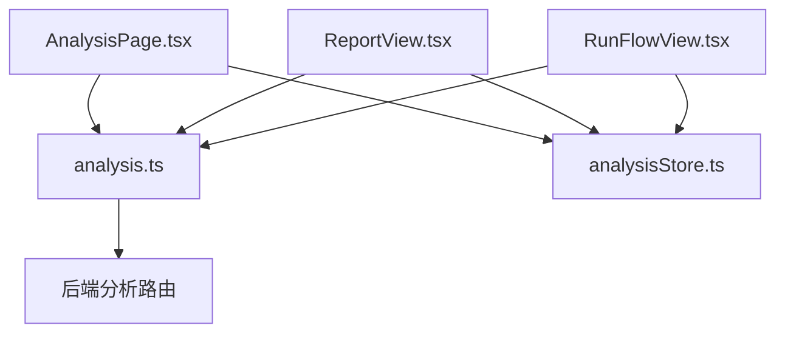
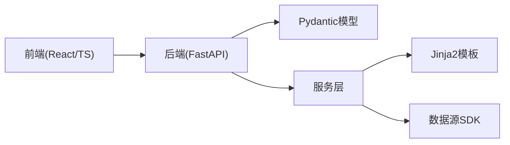

# 股票分析页面

<cite>
**本文引用的文件**   
- [api/v1/endpoints/analysis.py](file://api/v1/endpoints/analysis.py)
- [api/v1/schemas/analysis.py](file://api/v1/schemas/analysis.py)
- [src/services/analysis_service.py](file://src/services/analysis_service.py)
- [src/services/report_renderer.py](file://src/services/report_renderer.py)
- [src/services/run_flow.py](file://src/services/run_flow.py)
- [src/services/task_service.py](file://src/services/task_service.py)
- [src/services/history_service.py](file://src/services/history_service.py)
- [src/services/stock_service.py](file://src/services/stock_service.py)
- [src/data/stock_index_loader.py](file://src/data/stock_index_loader.py)
- [data_provider/base.py](file://data_provider/base.py)
- [data_provider/yfinance_fetcher.py](file://data_provider/yfinance_fetcher.py)
- [data_provider/akshare_fetcher.py](file://data_provider/akshare_fetcher.py)
- [templates/report_markdown.j2](file://templates/report_markdown.j2)
- [apps/dsa-web/src/api/analysis.ts](file://apps/dsa-web/src/api/analysis.ts)
- [apps/dsa-web/src/components/report/ReportView.tsx](file://apps/dsa-web/src/components/report/ReportView.tsx)
- [apps/dsa-web/src/components/run-flow/RunFlowView.tsx](file://apps/dsa-web/src/components/run-flow/RunFlowView.tsx)
- [apps/dsa-web/src/pages/AnalysisPage.tsx](file://apps/dsa-web/src/pages/AnalysisPage.tsx)
- [apps/dsa-web/src/stores/analysisStore.ts](file://apps/dsa-web/src/stores/analysisStore.ts)
</cite>

## 目录
1. [简介](#简介)
2. [项目结构](#项目结构)
3. [核心组件](#核心组件)
4. [架构总览](#架构总览)
5. [详细组件分析](#详细组件分析)
6. [依赖分析](#依赖分析)
7. [性能考虑](#性能考虑)
8. [故障排查指南](#故障排查指南)
9. [结论](#结论)
10. [附录](#附录)

## 简介
本文件面向“股票分析页面”的完整实现，覆盖多条件筛选与实时搜索、技术指标计算、分析报告生成与展示（Markdown渲染、图表可视化、交互式结果）、运行流程可视化（节点状态跟踪、执行时间分析与错误诊断）、动态配置界面（滑块、选择器、校验规则）、大数据量优化（分页加载、异步计算、缓存）以及导出与分享机制。文档以代码为依据，提供端到端的数据流与调用链说明，并给出可操作的排障建议与性能优化方案。

## 项目结构
- 前端（Web）：React + TypeScript，包含分析页、报告视图、运行流程视图、API 客户端与状态管理。
- 后端（API）：FastAPI 路由与 Pydantic 模型，服务层编排分析任务、渲染报告、调度历史与数据源。
- 数据源：统一抽象 base 接口，具体实现包括 yfinance、akshare 等。
- 模板：Jinja2 模板用于 Markdown 报告生成。

**图示来源** 
- [apps/dsa-web/src/pages/AnalysisPage.tsx](file://apps/dsa-web/src/pages/AnalysisPage.tsx)
- [apps/dsa-web/src/components/report/ReportView.tsx](file://apps/dsa-web/src/components/report/ReportView.tsx)
- [apps/dsa-web/src/components/run-flow/RunFlowView.tsx](file://apps/dsa-web/src/components/run-flow/RunFlowView.tsx)
- [apps/dsa-web/src/api/analysis.ts](file://apps/dsa-web/src/api/analysis.ts)
- [apps/dsa-web/src/stores/analysisStore.ts](file://apps/dsa-web/src/stores/analysisStore.ts)
- [api/v1/endpoints/analysis.py](file://api/v1/endpoints/analysis.py)
- [api/v1/schemas/analysis.py](file://api/v1/schemas/analysis.py)
- [src/services/analysis_service.py](file://src/services/analysis_service.py)
- [src/services/report_renderer.py](file://src/services/report_renderer.py)
- [src/services/run_flow.py](file://src/services/run_flow.py)
- [src/services/task_service.py](file://src/services/task_service.py)
- [src/services/history_service.py](file://src/services/history_service.py)
- [src/services/stock_service.py](file://src/services/stock_service.py)
- [data_provider/base.py](file://data_provider/base.py)
- [data_provider/yfinance_fetcher.py](file://data_provider/yfinance_fetcher.py)
- [data_provider/akshare_fetcher.py](file://data_provider/akshare_fetcher.py)
- [templates/report_markdown.j2](file://templates/report_markdown.j2)

**章节来源**
- [api/v1/endpoints/analysis.py](file://api/v1/endpoints/analysis.py)
- [api/v1/schemas/analysis.py](file://api/v1/schemas/analysis.py)
- [src/services/analysis_service.py](file://src/services/analysis_service.py)
- [src/services/report_renderer.py](file://src/services/report_renderer.py)
- [src/services/run_flow.py](file://src/services/run_flow.py)
- [src/services/task_service.py](file://src/services/task_service.py)
- [src/services/history_service.py](file://src/services/history_service.py)
- [src/services/stock_service.py](file://src/services/stock_service.py)
- [data_provider/base.py](file://data_provider/base.py)
- [data_provider/yfinance_fetcher.py](file://data_provider/yfinance_fetcher.py)
- [data_provider/akshare_fetcher.py](file://data_provider/akshare_fetcher.py)
- [templates/report_markdown.j2](file://templates/report_markdown.j2)
- [apps/dsa-web/src/pages/AnalysisPage.tsx](file://apps/dsa-web/src/pages/AnalysisPage.tsx)
- [apps/dsa-web/src/components/report/ReportView.tsx](file://apps/dsa-web/src/components/report/ReportView.tsx)
- [apps/dsa-web/src/components/run-flow/RunFlowView.tsx](file://apps/dsa-web/src/components/run-flow/RunFlowView.tsx)
- [apps/dsa-web/src/api/analysis.ts](file://apps/dsa-web/src/api/analysis.ts)
- [apps/dsa-web/src/stores/analysisStore.ts](file://apps/dsa-web/src/stores/analysisStore.ts)

## 核心组件
- 分析路由与模型：定义请求参数、响应结构与校验规则，支撑多条件筛选与指标计算。
- 分析服务：编排数据获取、指标计算、报告渲染与运行流程追踪。
- 报告渲染：基于模板引擎将结构化数据转换为 Markdown，供前端渲染与导出。
- 运行流程：记录节点状态、耗时与错误信息，支持可视化回放与诊断。
- 历史与库存服务：提供分页查询、缓存与批量拉取能力。
- 数据源抽象：统一接口适配多个行情与基本面数据提供方。

**章节来源**
- [api/v1/endpoints/analysis.py](file://api/v1/endpoints/analysis.py)
- [api/v1/schemas/analysis.py](file://api/v1/schemas/analysis.py)
- [src/services/analysis_service.py](file://src/services/analysis_service.py)
- [src/services/report_renderer.py](file://src/services/report_renderer.py)
- [src/services/run_flow.py](file://src/services/run_flow.py)
- [src/services/history_service.py](file://src/services/history_service.py)
- [src/services/stock_service.py](file://src/services/stock_service.py)
- [data_provider/base.py](file://data_provider/base.py)

## 架构总览
前端通过统一的 API 客户端发起分析请求，后端路由接收并校验参数后交由分析服务编排。分析服务根据策略组合调用数据源获取行情与基本面数据，计算技术指标，生成报告内容，并通过运行流程服务记录执行轨迹。报告由模板渲染为 Markdown，前端进行渲染、交互与导出。

**图示来源** 
- [api/v1/endpoints/analysis.py](file://api/v1/endpoints/analysis.py)
- [src/services/analysis_service.py](file://src/services/analysis_service.py)
- [data_provider/base.py](file://data_provider/base.py)
- [src/services/report_renderer.py](file://src/services/report_renderer.py)
- [src/services/run_flow.py](file://src/services/run_flow.py)

## 详细组件分析

### 分析路由与模型（API）
- 路由职责：接收前端分析请求，校验输入，转发至服务层，返回标准化响应。
- 模型约束：使用 Pydantic 定义筛选条件、时间窗口、指标开关与分页参数，确保前后端契约一致。
- 错误处理：对非法参数、缺失字段与类型错误进行明确提示，便于前端表单校验与用户反馈。

**图示来源** 
- [api/v1/endpoints/analysis.py](file://api/v1/endpoints/analysis.py)
- [api/v1/schemas/analysis.py](file://api/v1/schemas/analysis.py)

**章节来源**
- [api/v1/endpoints/analysis.py](file://api/v1/endpoints/analysis.py)
- [api/v1/schemas/analysis.py](file://api/v1/schemas/analysis.py)

### 分析服务（编排与计算）
- 数据获取：按市场与代码路由到对应数据源，支持失败回退与重试。
- 指标计算：在内存中计算常用技术指标（如均线、RSI、MACD等），并对异常值进行平滑或过滤。
- 报告生成：将指标与上下文注入模板，生成 Markdown；同时产出摘要与关键信号。
- 流程追踪：为每个步骤创建节点，记录开始/结束时间、状态与错误堆栈。

**图示来源** 
- [src/services/analysis_service.py](file://src/services/analysis_service.py)
- [src/services/report_renderer.py](file://src/services/report_renderer.py)
- [src/services/run_flow.py](file://src/services/run_flow.py)
- [data_provider/base.py](file://data_provider/base.py)

**章节来源**
- [src/services/analysis_service.py](file://src/services/analysis_service.py)
- [src/services/report_renderer.py](file://src/services/report_renderer.py)
- [src/services/run_flow.py](file://src/services/run_flow.py)

### 报告渲染（Markdown 与可视化）
- 模板驱动：使用 Jinja2 模板组织报告结构，支持标题、段落、表格与图表占位符。
- 数据绑定：将指标序列、信号列表与摘要注入模板，生成可读性强的 Markdown。
- 前端渲染：前端将 Markdown 渲染为富文本，并嵌入图表库进行可视化展示。

**图示来源** 
- [src/services/report_renderer.py](file://src/services/report_renderer.py)
- [templates/report_markdown.j2](file://templates/report_markdown.j2)

**章节来源**
- [src/services/report_renderer.py](file://src/services/report_renderer.py)
- [templates/report_markdown.j2](file://templates/report_markdown.j2)

### 运行流程可视化（节点状态、耗时与错误）
- 节点模型：每个步骤作为节点，包含名称、状态、开始/结束时间、错误信息与子节点。
- 实时更新：通过 SSE 或轮询推送节点状态变化，前端即时刷新。
- 诊断能力：聚合耗时统计、错误分布与失败路径，辅助定位瓶颈与问题。

**图示来源** 
- [src/services/run_flow.py](file://src/services/run_flow.py)

**章节来源**
- [src/services/run_flow.py](file://src/services/run_flow.py)

### 历史与库存服务（分页与缓存）
- 分页查询：支持按时间范围与页码拉取历史分析结果，减少单次负载。
- 缓存策略：对热点查询结果进行短期缓存，降低重复计算与数据源压力。
- 批量拉取：对多只股票的历史数据进行批处理，提升吞吐。

**图示来源** 
- [src/services/history_service.py](file://src/services/history_service.py)
- [src/services/stock_service.py](file://src/services/stock_service.py)

**章节来源**
- [src/services/history_service.py](file://src/services/history_service.py)
- [src/services/stock_service.py](file://src/services/stock_service.py)

### 数据源抽象与实现
- 抽象接口：统一数据获取方法（历史、实时、基本面），屏蔽不同提供商差异。
- 具体实现：yfinance、akshare 等实现各自协议与限流策略。
- 容错与回退：当某源不可用时自动切换备用源，保证可用性。

**图示来源** 
- [data_provider/base.py](file://data_provider/base.py)
- [data_provider/yfinance_fetcher.py](file://data_provider/yfinance_fetcher.py)
- [data_provider/akshare_fetcher.py](file://data_provider/akshare_fetcher.py)

**章节来源**
- [data_provider/base.py](file://data_provider/base.py)
- [data_provider/yfinance_fetcher.py](file://data_provider/yfinance_fetcher.py)
- [data_provider/akshare_fetcher.py](file://data_provider/akshare_fetcher.py)

### 前端：分析页、报告视图与运行流程视图
- 分析页：提供多条件筛选表单（滑块、选择器、日期范围）、实时搜索与一键分析。
- 报告视图：渲染 Markdown，展示图表与关键信号，支持导出与分享。
- 运行流程视图：可视化节点状态、耗时与错误，支持回放与诊断。

**图示来源** 
- [apps/dsa-web/src/pages/AnalysisPage.tsx](file://apps/dsa-web/src/pages/AnalysisPage.tsx)
- [apps/dsa-web/src/components/report/ReportView.tsx](file://apps/dsa-web/src/components/report/ReportView.tsx)
- [apps/dsa-web/src/components/run-flow/RunFlowView.tsx](file://apps/dsa-web/src/components/run-flow/RunFlowView.tsx)
- [apps/dsa-web/src/api/analysis.ts](file://apps/dsa-web/src/api/analysis.ts)
- [apps/dsa-web/src/stores/analysisStore.ts](file://apps/dsa-web/src/stores/analysisStore.ts)

**章节来源**
- [apps/dsa-web/src/pages/AnalysisPage.tsx](file://apps/dsa-web/src/pages/AnalysisPage.tsx)
- [apps/dsa-web/src/components/report/ReportView.tsx](file://apps/dsa-web/src/components/report/ReportView.tsx)
- [apps/dsa-web/src/components/run-flow/RunFlowView.tsx](file://apps/dsa-web/src/components/run-flow/RunFlowView.tsx)
- [apps/dsa-web/src/api/analysis.ts](file://apps/dsa-web/src/api/analysis.ts)
- [apps/dsa-web/src/stores/analysisStore.ts](file://apps/dsa-web/src/stores/analysisStore.ts)

## 依赖分析
- 前端依赖：React 生态、Markdown 渲染库、图表库与状态管理。
- 后端依赖：FastAPI、Pydantic、Jinja2、数据源 SDK。
- 外部依赖：行情与基本面数据提供商（yfinance、akshare 等）。

**图示来源** 
- [api/v1/endpoints/analysis.py](file://api/v1/endpoints/analysis.py)
- [api/v1/schemas/analysis.py](file://api/v1/schemas/analysis.py)
- [src/services/analysis_service.py](file://src/services/analysis_service.py)
- [src/services/report_renderer.py](file://src/services/report_renderer.py)
- [data_provider/base.py](file://data_provider/base.py)

**章节来源**
- [api/v1/endpoints/analysis.py](file://api/v1/endpoints/analysis.py)
- [api/v1/schemas/analysis.py](file://api/v1/schemas/analysis.py)
- [src/services/analysis_service.py](file://src/services/analysis_service.py)
- [src/services/report_renderer.py](file://src/services/report_renderer.py)
- [data_provider/base.py](file://data_provider/base.py)

## 性能考虑
- 分页加载：历史与分析结果采用分页，避免一次性加载大量数据。
- 异步计算：长耗时指标计算与数据拉取采用异步任务队列，前端通过轮询或 SSE 获取进度。
- 结果缓存：热点查询结果短期缓存，减少重复计算与数据源压力。
- 数据源优化：并发拉取与失败回退，限制请求频率以避免被限流。
- 前端优化：虚拟滚动与懒加载图表，按需渲染大列表与复杂图表。

[本节为通用指导，不直接分析具体文件]

## 故障排查指南
- 参数校验失败：检查前端表单校验与后端 Pydantic 模型约束是否一致。
- 数据源异常：查看运行流程节点的错误信息，确认网络与凭据配置。
- 指标计算异常：检查数据质量（缺失值、异常值）与计算窗口设置。
- 报告渲染失败：核对模板变量与数据结构是否匹配。
- 前端渲染问题：确认 Markdown 与图表数据格式正确，浏览器控制台无报错。

**章节来源**
- [src/services/run_flow.py](file://src/services/run_flow.py)
- [src/services/report_renderer.py](file://src/services/report_renderer.py)
- [api/v1/schemas/analysis.py](file://api/v1/schemas/analysis.py)

## 结论
股票分析页面通过清晰的前后端分层与模块化设计，实现了从多条件筛选、实时搜索、指标计算到报告渲染与运行流程可视化的完整闭环。借助数据源抽象与模板化报告，系统具备良好的扩展性与可维护性。结合分页、异步与缓存策略，能够有效应对大数据量场景。导出与分享机制提升了结果的可传播性与协作效率。

[本节为总结性内容，不直接分析具体文件]

## 附录
- 动态配置界面要点：
  - 滑块：用于调整时间窗口、阈值与权重，需绑定最小/最大值与步长。
  - 选择器：用于选择指标、市场与数据源，需提供默认值与禁用逻辑。
  - 校验规则：必填、范围、格式与依赖关系校验，实时反馈错误信息。
- 导出与分享：
  - 导出：支持 Markdown、PDF 与 CSV 下载，保留图表与表格。
  - 分享：生成短链接或二维码，附带必要权限控制与有效期。

[本节为补充说明，不直接分析具体文件]