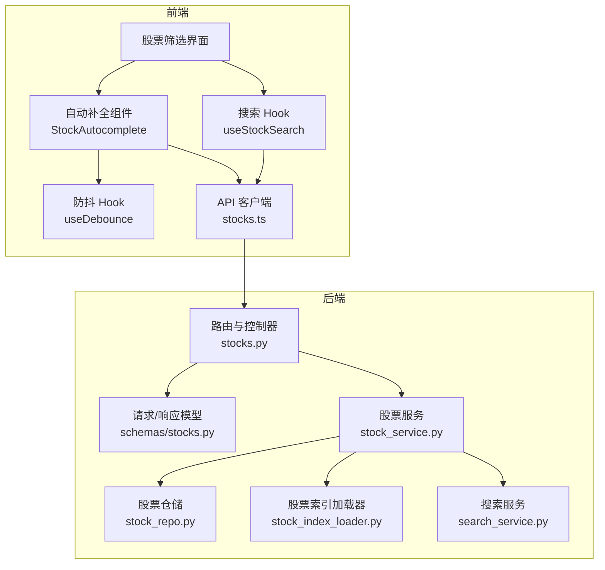
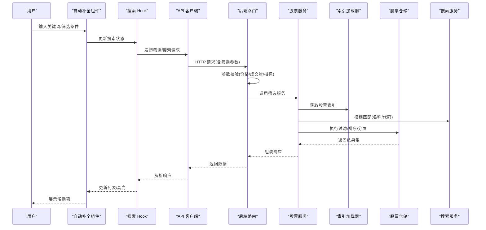
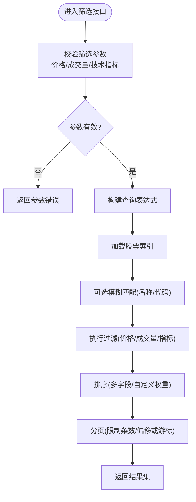
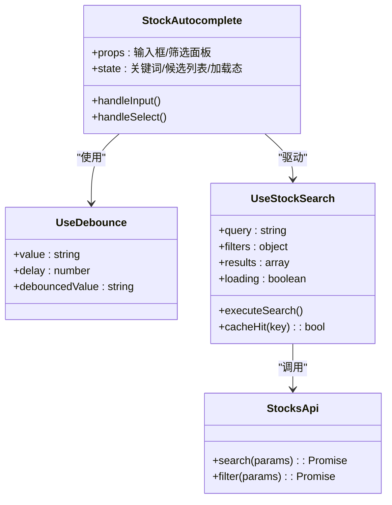
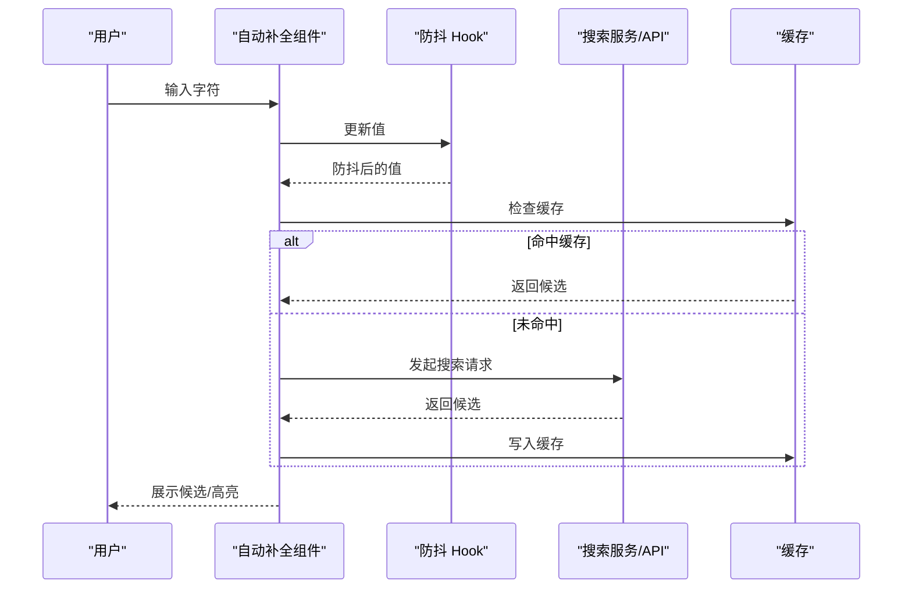
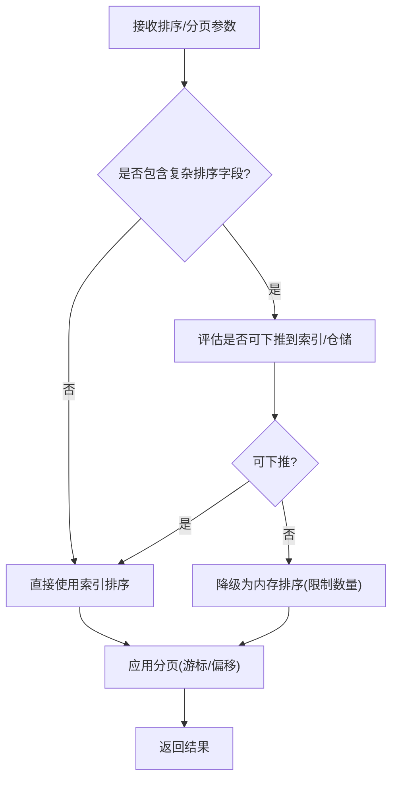
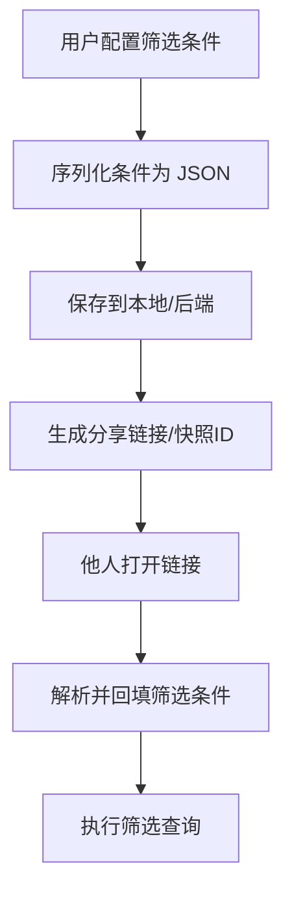
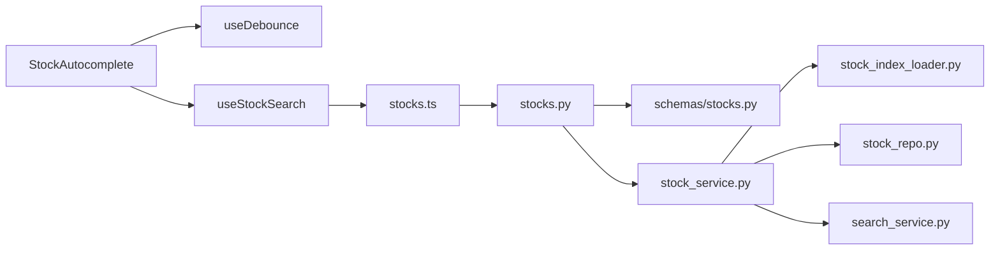

# 股票筛选功能

<cite>
**本文引用的文件**   
- [api/v1/endpoints/stocks.py](file://api/v1/endpoints/stocks.py)
- [api/v1/schemas/stocks.py](file://api/v1/schemas/stocks.py)
- [apps/dsa-web/src/api/stocks.ts](file://apps/dsa-web/src/api/stocks.ts)
- [apps/dsa-web/src/components/StockAutocomplete/index.tsx](file://apps/dsa-web/src/components/StockAutocomplete/index.tsx)
- [apps/dsa-web/src/components/StockAutocomplete/useDebounce.ts](file://apps/dsa-web/src/components/StockAutocomplete/useDebounce.ts)
- [apps/dsa-web/src/hooks/useStockSearch.ts](file://apps/dsa-web/src/hooks/useStockSearch.ts)
- [src/services/stock_service.py](file://src/services/stock_service.py)
- [src/data/stock_index_loader.py](file://src/data/stock_index_loader.py)
- [src/repositories/stock_repo.py](file://src/repositories/stock_repo.py)
- [src/search_service.py](file://src/search_service.py)
</cite>

## 目录
1. [简介](#简介)
2. [项目结构](#项目结构)
3. [核心组件](#核心组件)
4. [架构总览](#架构总览)
5. [详细组件分析](#详细组件分析)
6. [依赖关系分析](#依赖关系分析)
7. [性能考量](#性能考量)
8. [故障排查指南](#故障排查指南)
9. [结论](#结论)
10. [附录](#附录)

## 简介
本文件面向“股票筛选”功能的实现与使用，覆盖多条件筛选（价格区间、成交量、技术指标）、实时搜索（防抖、模糊匹配、缓存）、自动补全（数据源集成、异步加载、交互优化）、排序分页（大数据量处理与性能优化），以及筛选条件的保存与分享方案。文档以代码为依据，结合前后端接口与组件，提供从架构到落地的完整说明。

## 项目结构
围绕股票筛选的前后端关键路径如下：
- 前端 API 层：封装对后端的筛选与搜索请求
- 前端组件层：自动补全、搜索 Hook、防抖等
- 后端路由与校验：REST 接口定义、参数校验与响应模型
- 服务与仓储：业务逻辑、索引加载、持久化查询
- 搜索服务：通用搜索能力（可用于名称/代码模糊匹配）

**图表来源** 
- [api/v1/endpoints/stocks.py](file://api/v1/endpoints/stocks.py)
- [api/v1/schemas/stocks.py](file://api/v1/schemas/stocks.py)
- [apps/dsa-web/src/api/stocks.ts](file://apps/dsa-web/src/api/stocks.ts)
- [apps/dsa-web/src/components/StockAutocomplete/index.tsx](file://apps/dsa-web/src/components/StockAutocomplete/index.tsx)
- [apps/dsa-web/src/components/StockAutocomplete/useDebounce.ts](file://apps/dsa-web/src/components/StockAutocomplete/useDebounce.ts)
- [apps/dsa-web/src/hooks/useStockSearch.ts](file://apps/dsa-web/src/hooks/useStockSearch.ts)
- [src/services/stock_service.py](file://src/services/stock_service.py)
- [src/data/stock_index_loader.py](file://src/data/stock_index_loader.py)
- [src/repositories/stock_repo.py](file://src/repositories/stock_repo.py)
- [src/search_service.py](file://src/search_service.py)

**章节来源**
- [api/v1/endpoints/stocks.py](file://api/v1/endpoints/stocks.py)
- [api/v1/schemas/stocks.py](file://api/v1/schemas/stocks.py)
- [apps/dsa-web/src/api/stocks.ts](file://apps/dsa-web/src/api/stocks.ts)
- [apps/dsa-web/src/components/StockAutocomplete/index.tsx](file://apps/dsa-web/src/components/StockAutocomplete/index.tsx)
- [apps/dsa-web/src/components/StockAutocomplete/useDebounce.ts](file://apps/dsa-web/src/components/StockAutocomplete/useDebounce.ts)
- [apps/dsa-web/src/hooks/useStockSearch.ts](file://apps/dsa-web/src/hooks/useStockSearch.ts)
- [src/services/stock_service.py](file://src/services/stock_service.py)
- [src/data/stock_index_loader.py](file://src/data/stock_index_loader.py)
- [src/repositories/stock_repo.py](file://src/repositories/stock_repo.py)
- [src/search_service.py](file://src/search_service.py)

## 核心组件
- 后端筛选接口：接收多条件筛选参数，进行参数校验与业务处理，返回分页结果
- 前端筛选与搜索：通过 API 客户端发起请求；自动补全组件负责输入联想与选择；搜索 Hook 管理状态与去重
- 数据与索引：股票索引加载器维护本地/远程索引，仓储层执行过滤与排序，搜索服务提供模糊匹配

**章节来源**
- [api/v1/endpoints/stocks.py](file://api/v1/endpoints/stocks.py)
- [api/v1/schemas/stocks.py](file://api/v1/schemas/stocks.py)
- [apps/dsa-web/src/api/stocks.ts](file://apps/dsa-web/src/api/stocks.ts)
- [apps/dsa-web/src/components/StockAutocomplete/index.tsx](file://apps/dsa-web/src/components/StockAutocomplete/index.tsx)
- [apps/dsa-web/src/hooks/useStockSearch.ts](file://apps/dsa-web/src/hooks/useStockSearch.ts)
- [src/services/stock_service.py](file://src/services/stock_service.py)
- [src/data/stock_index_loader.py](file://src/data/stock_index_loader.py)
- [src/repositories/stock_repo.py](file://src/repositories/stock_repo.py)
- [src/search_service.py](file://src/search_service.py)

## 架构总览
下图展示一次“多条件筛选 + 实时搜索 + 自动补全”的端到端流程：用户输入触发防抖，组件调用 API，后端校验并组合筛选条件，服务层调用索引与仓储完成过滤、排序与分页，最终返回结果。

**图表来源** 
- [apps/dsa-web/src/components/StockAutocomplete/index.tsx](file://apps/dsa-web/src/components/StockAutocomplete/index.tsx)
- [apps/dsa-web/src/hooks/useStockSearch.ts](file://apps/dsa-web/src/hooks/useStockSearch.ts)
- [apps/dsa-web/src/api/stocks.ts](file://apps/dsa-web/src/api/stocks.ts)
- [api/v1/endpoints/stocks.py](file://api/v1/endpoints/stocks.py)
- [api/v1/schemas/stocks.py](file://api/v1/schemas/stocks.py)
- [src/services/stock_service.py](file://src/services/stock_service.py)
- [src/data/stock_index_loader.py](file://src/data/stock_index_loader.py)
- [src/repositories/stock_repo.py](file://src/repositories/stock_repo.py)
- [src/search_service.py](file://src/search_service.py)

## 详细组件分析

### 多条件筛选机制（价格区间、成交量、技术指标）
- 参数模型：通过 Pydantic 模型定义筛选字段，包括价格上下限、成交量阈值、技术指标范围等，并进行类型与范围校验
- 路由层：接收请求体，校验通过后转交服务层；失败时返回统一错误格式
- 服务层：将筛选条件映射为查询表达式，优先利用索引快速定位候选集合，再在仓储层执行精确过滤与排序
- 排序与分页：支持按价格、涨跌幅、成交量等多字段排序；分页采用游标或偏移策略，避免深翻页性能问题

**图表来源** 
- [api/v1/schemas/stocks.py](file://api/v1/schemas/stocks.py)
- [api/v1/endpoints/stocks.py](file://api/v1/endpoints/stocks.py)
- [src/services/stock_service.py](file://src/services/stock_service.py)
- [src/data/stock_index_loader.py](file://src/data/stock_index_loader.py)
- [src/repositories/stock_repo.py](file://src/repositories/stock_repo.py)

**章节来源**
- [api/v1/schemas/stocks.py](file://api/v1/schemas/stocks.py)
- [api/v1/endpoints/stocks.py](file://api/v1/endpoints/stocks.py)
- [src/services/stock_service.py](file://src/services/stock_service.py)
- [src/repositories/stock_repo.py](file://src/repositories/stock_repo.py)

### 实时搜索（防抖、模糊匹配、缓存）
- 防抖处理：输入事件触发后延迟一定时间再发起请求，减少无效网络调用
- 模糊匹配：基于名称/代码的相似度算法（如前缀匹配、编辑距离或倒排索引），提升用户体验
- 搜索结果缓存：对相同查询键（关键词+筛选条件）的结果进行短期缓存，命中则直接返回

**图表来源** 
- [apps/dsa-web/src/components/StockAutocomplete/index.tsx](file://apps/dsa-web/src/components/StockAutocomplete/index.tsx)
- [apps/dsa-web/src/components/StockAutocomplete/useDebounce.ts](file://apps/dsa-web/src/components/StockAutocomplete/useDebounce.ts)
- [apps/dsa-web/src/hooks/useStockSearch.ts](file://apps/dsa-web/src/hooks/useStockSearch.ts)
- [apps/dsa-web/src/api/stocks.ts](file://apps/dsa-web/src/api/stocks.ts)

**章节来源**
- [apps/dsa-web/src/components/StockAutocomplete/index.tsx](file://apps/dsa-web/src/components/StockAutocomplete/index.tsx)
- [apps/dsa-web/src/components/StockAutocomplete/useDebounce.ts](file://apps/dsa-web/src/components/StockAutocomplete/useDebounce.ts)
- [apps/dsa-web/src/hooks/useStockSearch.ts](file://apps/dsa-web/src/hooks/useStockSearch.ts)
- [apps/dsa-web/src/api/stocks.ts](file://apps/dsa-web/src/api/stocks.ts)
- [src/search_service.py](file://src/search_service.py)

### 股票自动补全组件（数据源、异步加载、交互优化）
- 数据源集成：优先使用本地索引或预取列表，必要时回退到远端搜索接口
- 异步加载：输入变化时触发防抖，按需拉取候选；支持增量加载与虚拟滚动
- 交互优化：键盘导航、高亮匹配片段、选中即填充、去重与节流

**图表来源** 
- [apps/dsa-web/src/components/StockAutocomplete/index.tsx](file://apps/dsa-web/src/components/StockAutocomplete/index.tsx)
- [apps/dsa-web/src/components/StockAutocomplete/useDebounce.ts](file://apps/dsa-web/src/components/StockAutocomplete/useDebounce.ts)
- [apps/dsa-web/src/api/stocks.ts](file://apps/dsa-web/src/api/stocks.ts)
- [src/search_service.py](file://src/search_service.py)

**章节来源**
- [apps/dsa-web/src/components/StockAutocomplete/index.tsx](file://apps/dsa-web/src/components/StockAutocomplete/index.tsx)
- [apps/dsa-web/src/components/StockAutocomplete/useDebounce.ts](file://apps/dsa-web/src/components/StockAutocomplete/useDebounce.ts)
- [apps/dsa-web/src/api/stocks.ts](file://apps/dsa-web/src/api/stocks.ts)
- [src/search_service.py](file://src/search_service.py)

### 排序与分页（大数据量与性能优化）
- 排序策略：支持多字段排序与权重配置，避免复杂计算字段导致的全表扫描
- 分页策略：优先使用游标分页或基于索引的偏移分页，限制最大页大小
- 性能优化：索引预加载、查询下推、结果裁剪、并发控制与超时保护

**图表来源** 
- [src/repositories/stock_repo.py](file://src/repositories/stock_repo.py)
- [src/data/stock_index_loader.py](file://src/data/stock_index_loader.py)

**章节来源**
- [src/repositories/stock_repo.py](file://src/repositories/stock_repo.py)
- [src/data/stock_index_loader.py](file://src/data/stock_index_loader.py)

### 筛选条件的保存与分享
- 保存：将筛选条件序列化为结构化对象，存储于本地存储或后端用户配置中
- 分享：生成唯一链接或快照 ID，包含筛选参数与视图设置，便于他人复现
- 恢复：打开链接或读取配置后，自动回填筛选表单并执行查询

[该图为概念性流程图，不直接对应具体源码文件]

## 依赖关系分析
- 前端依赖：自动补全组件依赖防抖 Hook 与搜索 Hook；搜索 Hook 依赖 API 客户端
- 后端依赖：路由依赖参数模型与服务层；服务层依赖索引加载器、仓储与搜索服务
- 外部依赖：搜索服务可能对接搜索引擎或本地倒排索引；仓储层对接数据库或内存索引

**图表来源** 
- [apps/dsa-web/src/components/StockAutocomplete/index.tsx](file://apps/dsa-web/src/components/StockAutocomplete/index.tsx)
- [apps/dsa-web/src/components/StockAutocomplete/useDebounce.ts](file://apps/dsa-web/src/components/StockAutocomplete/useDebounce.ts)
- [apps/dsa-web/src/hooks/useStockSearch.ts](file://apps/dsa-web/src/hooks/useStockSearch.ts)
- [apps/dsa-web/src/api/stocks.ts](file://apps/dsa-web/src/api/stocks.ts)
- [api/v1/endpoints/stocks.py](file://api/v1/endpoints/stocks.py)
- [api/v1/schemas/stocks.py](file://api/v1/schemas/stocks.py)
- [src/services/stock_service.py](file://src/services/stock_service.py)
- [src/data/stock_index_loader.py](file://src/data/stock_index_loader.py)
- [src/repositories/stock_repo.py](file://src/repositories/stock_repo.py)
- [src/search_service.py](file://src/search_service.py)

**章节来源**
- [apps/dsa-web/src/components/StockAutocomplete/index.tsx](file://apps/dsa-web/src/components/StockAutocomplete/index.tsx)
- [apps/dsa-web/src/components/StockAutocomplete/useDebounce.ts](file://apps/dsa-web/src/components/StockAutocomplete/useDebounce.ts)
- [apps/dsa-web/src/hooks/useStockSearch.ts](file://apps/dsa-web/src/hooks/useStockSearch.ts)
- [apps/dsa-web/src/api/stocks.ts](file://apps/dsa-web/src/api/stocks.ts)
- [api/v1/endpoints/stocks.py](file://api/v1/endpoints/stocks.py)
- [api/v1/schemas/stocks.py](file://api/v1/schemas/stocks.py)
- [src/services/stock_service.py](file://src/services/stock_service.py)
- [src/data/stock_index_loader.py](file://src/data/stock_index_loader.py)
- [src/repositories/stock_repo.py](file://src/repositories/stock_repo.py)
- [src/search_service.py](file://src/search_service.py)

## 性能考量
- 前端
  - 防抖与节流：降低高频输入导致的重复请求
  - 结果缓存：按查询键缓存，命中即返回
  - 虚拟列表：大数据量渲染时使用虚拟滚动
- 后端
  - 索引优先：先通过索引缩小候选集，再进行细粒度过滤
  - 查询下推：尽可能将过滤与排序下推到仓储层
  - 分页限制：限制最大页大小，避免深翻页
  - 并发与超时：对外部搜索服务设置超时与重试策略

[本节为通用指导，不直接分析具体文件]

## 故障排查指南
- 参数校验失败：检查筛选参数的类型与范围是否符合模型定义
- 搜索无结果：确认关键词与索引是否一致，检查模糊匹配策略
- 性能问题：查看是否命中缓存、是否触发深翻页、是否存在全表扫描
- 自动补全卡顿：检查防抖延迟、网络超时与列表渲染方式

**章节来源**
- [api/v1/schemas/stocks.py](file://api/v1/schemas/stocks.py)
- [api/v1/endpoints/stocks.py](file://api/v1/endpoints/stocks.py)
- [src/search_service.py](file://src/search_service.py)
- [src/repositories/stock_repo.py](file://src/repositories/stock_repo.py)

## 结论
本方案通过前后端协同实现了高效、可扩展的股票筛选与搜索能力：前端以自动补全与防抖为核心提升交互体验，后端以参数校验、索引优先与查询下推保障性能。配合缓存、分页与排序优化，能够稳定支撑大数据量场景。保存与分享功能进一步提升了可复用性与协作效率。

[本节为总结，不直接分析具体文件]

## 附录
- 建议的筛选字段示例（仅用于理解）：价格上限/下限、成交量阈值、RSI/MACD 等指标范围
- 分享链接参数建议：关键词、筛选条件、排序字段、页码、每页条数
- 缓存键设计：hash(关键词 + 筛选条件 + 排序 + 分页)

[本节为补充信息，不直接分析具体文件]