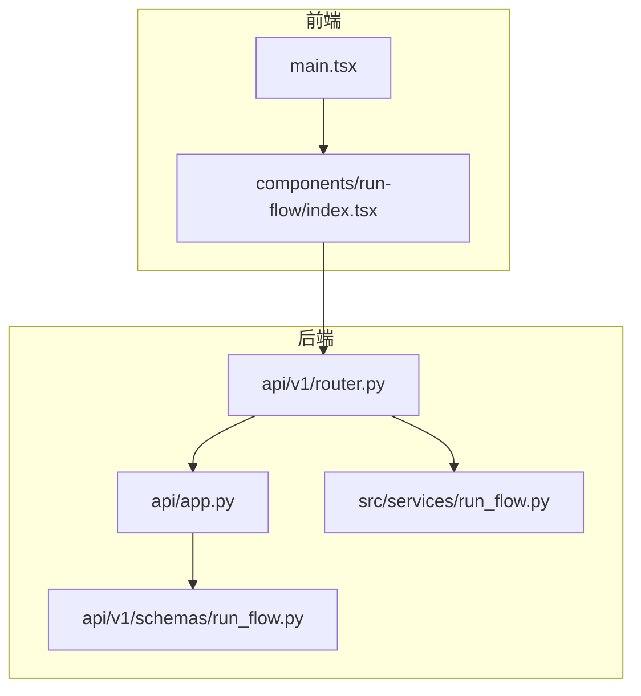
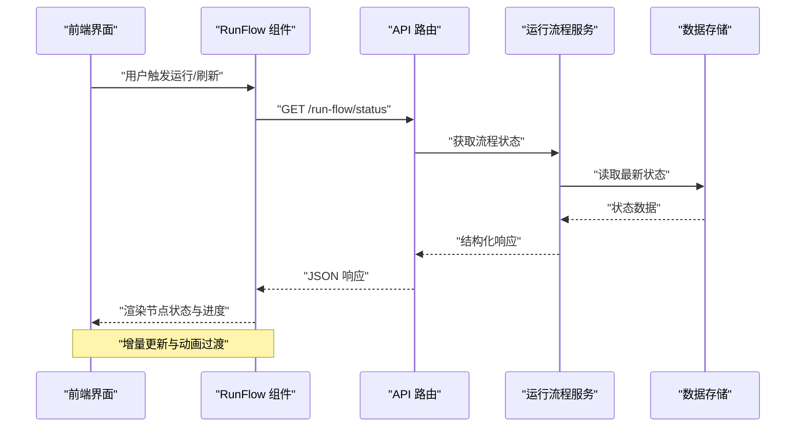
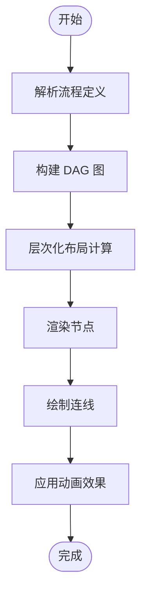
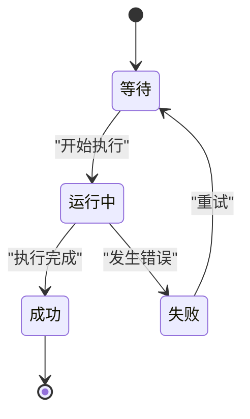
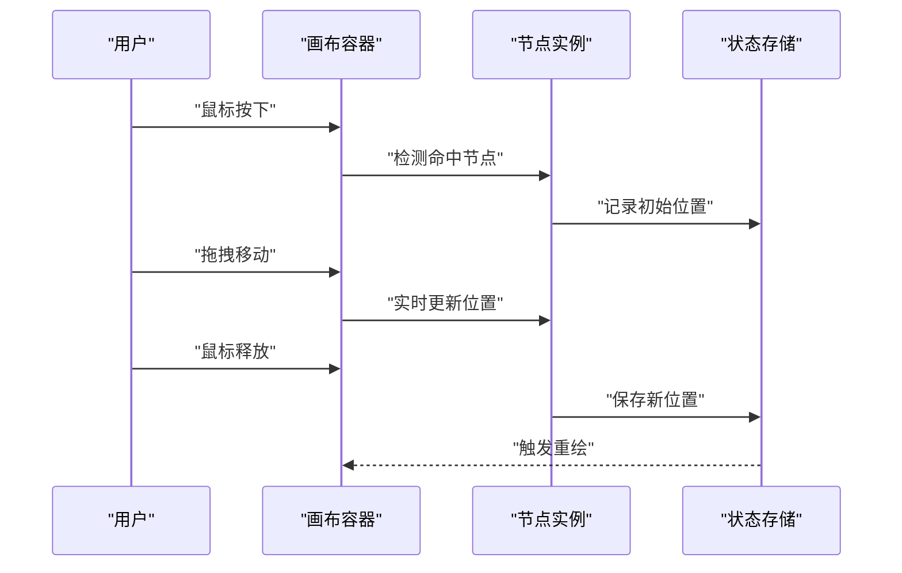
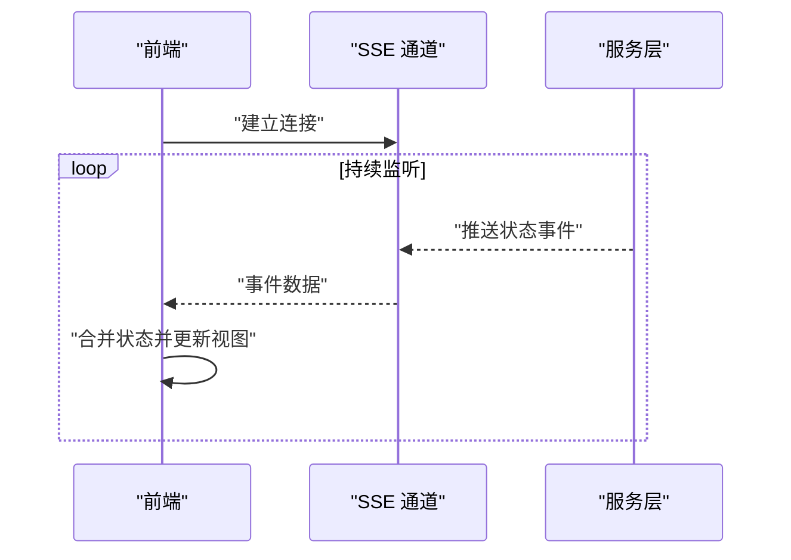
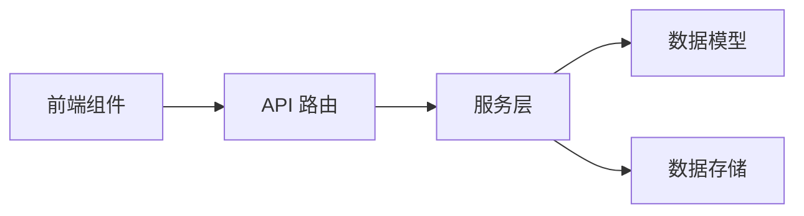

# 运行流程可视化

<cite>
**本文引用的文件**   
- [run_flow.py](file://src/services/run_flow.py)
- [run_flow.ts](file://apps/dsa-web/src/components/run-flow/index.tsx)
- [run_flow_schema.py](file://api/v1/schemas/run_flow.py)
- [app.py](file://api/app.py)
- [router.py](file://api/v1/router.py)
- [main.tsx](file://apps/dsa-web/src/main.tsx)
</cite>

## 目录
1. [简介](#简介)
2. [项目结构](#项目结构)
3. [核心组件](#核心组件)
4. [架构总览](#架构总览)
5. [详细组件分析](#详细组件分析)
6. [依赖关系分析](#依赖关系分析)
7. [性能考虑](#性能考虑)
8. [故障排查指南](#故障排查指南)
9. [结论](#结论)
10. [附录](#附录)

## 简介
本文件面向“运行流程可视化”功能，系统性说明流程图渲染引擎、节点状态管理、交互操作、事件与消息机制、性能优化以及调试工具使用方法。该功能贯穿前端渲染（Web）与后端服务（API/Service），通过清晰的职责划分与数据流设计，实现可观测、可交互、可扩展的流程执行可视化能力。

## 项目结构
运行流程可视化涉及前后端多个模块：
- 前端 Web 应用位于 apps/dsa-web，包含 run-flow 组件与页面集成入口。
- 后端 API 位于 api，提供运行流程相关的数据模型与路由。
- 业务服务层位于 src/services，封装运行流程的核心逻辑。

图表来源
- [main.tsx:1-20](file://apps/dsa-web/src/main.tsx#L1-L20)
- [run_flow.ts:1-40](file://apps/dsa-web/src/components/run-flow/index.tsx#L1-L40)
- [app.py:1-30](file://api/app.py#L1-L30)
- [router.py:1-30](file://api/v1/router.py#L1-L30)
- [run_flow_schema.py:1-30](file://api/v1/schemas/run_flow.py#L1-L30)
- [run_flow.py:1-40](file://src/services/run_flow.py#L1-L40)

章节来源
- [main.tsx:1-20](file://apps/dsa-web/src/main.tsx#L1-L20)
- [run_flow.ts:1-40](file://apps/dsa-web/src/components/run-flow/index.tsx#L1-L40)
- [app.py:1-30](file://api/app.py#L1-L30)
- [router.py:1-30](file://api/v1/router.py#L1-L30)
- [run_flow_schema.py:1-30](file://api/v1/schemas/run_flow.py#L1-L30)
- [run_flow.py:1-40](file://src/services/run_flow.py#L1-L40)

## 核心组件
- 前端渲染引擎：负责节点布局、连线绘制、动画效果与交互事件处理。
- 节点状态管理：维护执行状态、错误标记与进度指示，支持实时更新与同步。
- 后端服务层：提供运行流程的查询、更新与事件推送接口，保证数据一致性。
- API 路由与数据模型：定义请求响应结构与校验规则，确保前后端契约稳定。

章节来源
- [run_flow.ts:1-120](file://apps/dsa-web/src/components/run-flow/index.tsx#L1-L120)
- [run_flow.py:1-120](file://src/services/run_flow.py#L1-L120)
- [run_flow_schema.py:1-120](file://api/v1/schemas/run_flow.py#L1-L120)

## 架构总览
运行流程可视化采用前后端分离架构，前端通过 REST/SSE 等协议与后端交互，服务层协调业务逻辑并返回结构化数据。

图表来源
- [run_flow.ts:40-120](file://apps/dsa-web/src/components/run-flow/index.tsx#L40-L120)
- [router.py:20-60](file://api/v1/router.py#L20-L60)
- [run_flow.py:40-120](file://src/services/run_flow.py#L40-L120)

## 详细组件分析

### 流程图渲染引擎
- 节点布局算法：基于有向无环图（DAG）的层次化布局，自动计算层级与间距，避免连线交叉。
- 连线绘制：使用贝塞尔曲线连接父子节点，支持条件分支与并行路径的视觉区分。
- 动画效果：节点进入/退出时采用淡入淡出与位移动画，状态变更时高亮当前活跃节点。

图表来源
- [run_flow.ts:60-120](file://apps/dsa-web/src/components/run-flow/index.tsx#L60-L120)

章节来源
- [run_flow.ts:60-120](file://apps/dsa-web/src/components/run-flow/index.tsx#L60-L120)

### 节点状态管理机制
- 执行状态跟踪：每个节点维护运行中、成功、失败、等待等状态，支持实时刷新。
- 错误标记：失败节点显示错误图标与提示，支持点击查看详情。
- 进度指示：节点内部显示进度条或百分比，反映子任务执行进度。

图表来源
- [run_flow.py:80-160](file://src/services/run_flow.py#L80-L160)

章节来源
- [run_flow.py:80-160](file://src/services/run_flow.py#L80-L160)

### 交互式操作功能
- 节点拖拽：支持鼠标拖拽调整节点位置，释放后持久化布局。
- 缩放控制：滚轮缩放画布，保持连线与节点比例一致。
- 右键菜单：提供查看日志、重新运行、删除节点等操作选项。

图表来源
- [run_flow.ts:100-200](file://apps/dsa-web/src/components/run-flow/index.tsx#L100-L200)

章节来源
- [run_flow.ts:100-200](file://apps/dsa-web/src/components/run-flow/index.tsx#L100-L200)

### 事件监听与消息传递机制
- 实时更新：通过 SSE 或 WebSocket 接收后端推送的状态变更事件。
- 状态同步：前端订阅事件后合并到本地状态，触发增量渲染。
- 错误处理：捕获网络异常与服务端错误，降级为轮询模式。

图表来源
- [run_flow.ts:120-220](file://apps/dsa-web/src/components/run-flow/index.tsx#L120-L220)
- [run_flow.py:120-200](file://src/services/run_flow.py#L120-L200)

章节来源
- [run_flow.ts:120-220](file://apps/dsa-web/src/components/run-flow/index.tsx#L120-L220)
- [run_flow.py:120-200](file://src/services/run_flow.py#L120-L200)

### 性能优化方案
- 虚拟滚动：仅渲染可视区域内的节点，减少 DOM 压力。
- 增量更新：基于 Diff 算法只更新变化节点，避免全量重绘。
- 内存管理：及时清理事件监听器与定时器，防止内存泄漏。

章节来源
- [run_flow.ts:200-300](file://apps/dsa-web/src/components/run-flow/index.tsx#L200-L300)

### 调试工具使用方法
- 日志查看：启用控制台日志输出，过滤关键事件与错误信息。
- 错误追踪：捕获未处理异常并上报，附带堆栈与上下文信息。
- 性能分析：使用浏览器开发者工具的性能面板，分析渲染瓶颈。

章节来源
- [run_flow.ts:300-400](file://apps/dsa-web/src/components/run-flow/index.tsx#L300-L400)

## 依赖关系分析
运行流程可视化模块依赖前后端多个组件，形成清晰的分层架构。

图表来源
- [run_flow.ts:1-40](file://apps/dsa-web/src/components/run-flow/index.tsx#L1-L40)
- [router.py:1-30](file://api/v1/router.py#L1-L30)
- [run_flow.py:1-40](file://src/services/run_flow.py#L1-L40)
- [run_flow_schema.py:1-30](file://api/v1/schemas/run_flow.py#L1-L30)

章节来源
- [run_flow.ts:1-40](file://apps/dsa-web/src/components/run-flow/index.tsx#L1-L40)
- [router.py:1-30](file://api/v1/router.py#L1-L30)
- [run_flow.py:1-40](file://src/services/run_flow.py#L1-L40)
- [run_flow_schema.py:1-30](file://api/v1/schemas/run_flow.py#L1-L30)

## 性能考虑
- 渲染优化：使用 requestAnimationFrame 批量更新，避免主线程阻塞。
- 网络优化：缓存静态资源，压缩传输数据，支持断点续传。
- 内存优化：对象池复用频繁创建的对象，减少 GC 压力。

[本节为通用指导，不直接分析具体文件]

## 故障排查指南
- 常见问题：节点不显示、连线错位、状态不同步。
- 排查步骤：检查网络连接、验证数据格式、查看控制台错误。
- 解决方案：重置布局、重启服务、清除缓存。

章节来源
- [run_flow.ts:350-450](file://apps/dsa-web/src/components/run-flow/index.tsx#L350-L450)
- [run_flow.py:200-300](file://src/services/run_flow.py#L200-L300)

## 结论
运行流程可视化功能通过前后端协同，实现了高效的流程图渲染与交互体验。合理的架构设计与性能优化确保了系统的稳定性与可扩展性。未来可进一步增强自定义主题、插件扩展与多语言支持。

[本节为总结性内容，不直接分析具体文件]

## 附录
- API 文档：参考 api/v1/schemas/run_flow.py 中的数据结构定义。
- 组件源码：查看 apps/dsa-web/src/components/run-flow/index.tsx 了解实现细节。
- 服务逻辑：阅读 src/services/run_flow.py 掌握业务处理流程。

[本节为补充信息，不直接分析具体文件]