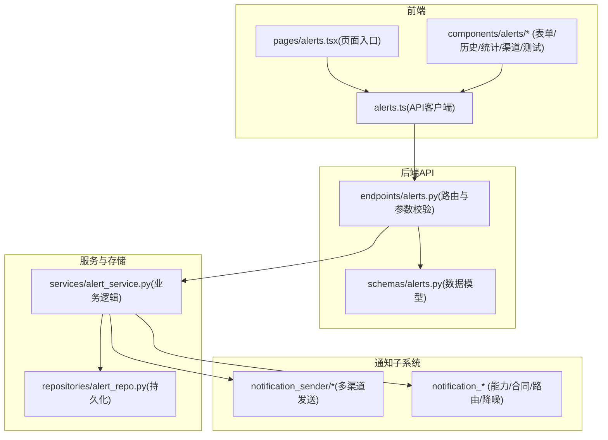
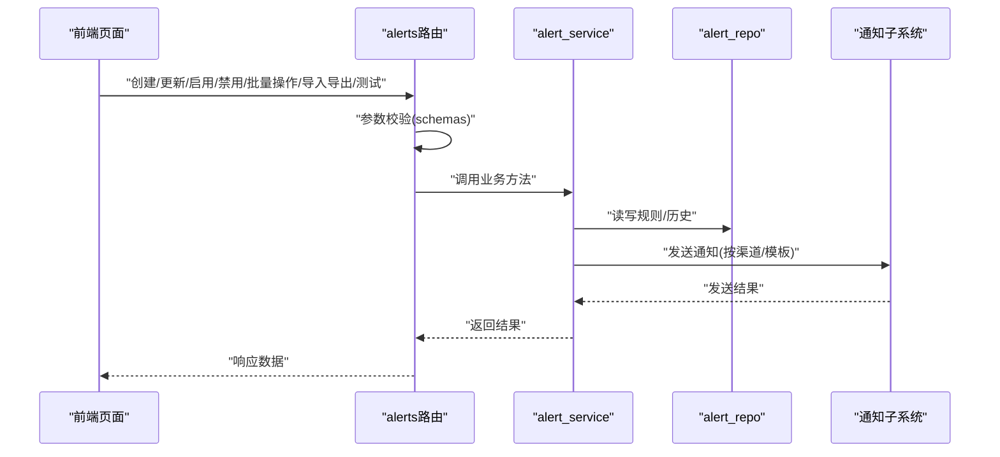
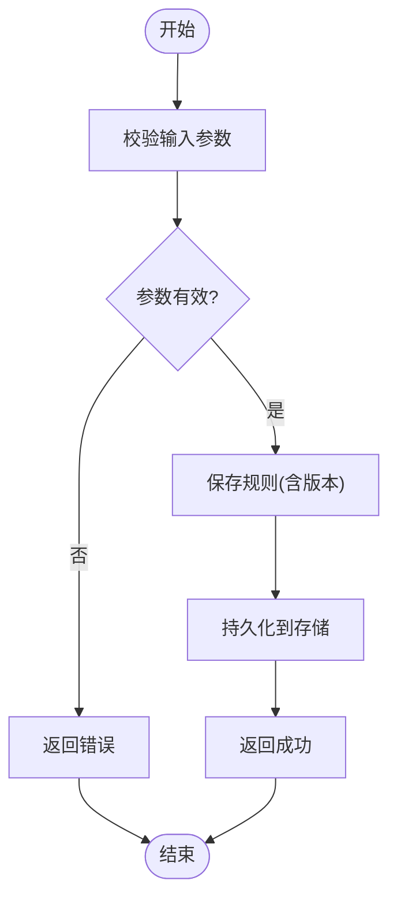
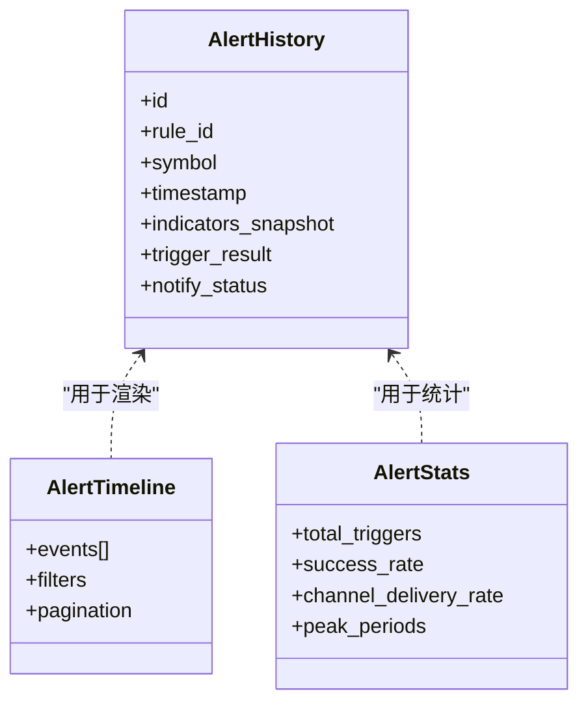
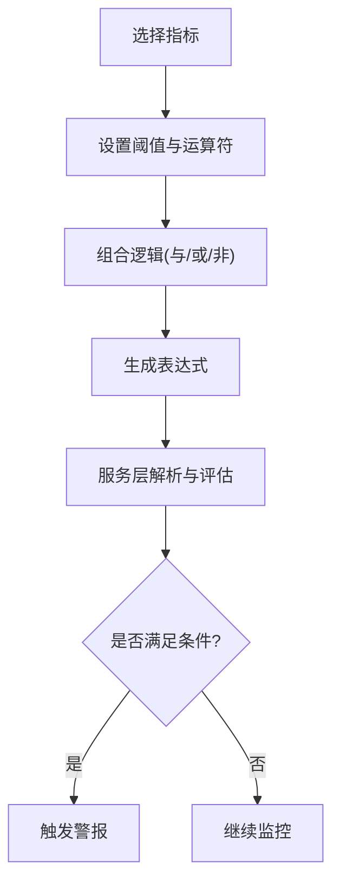
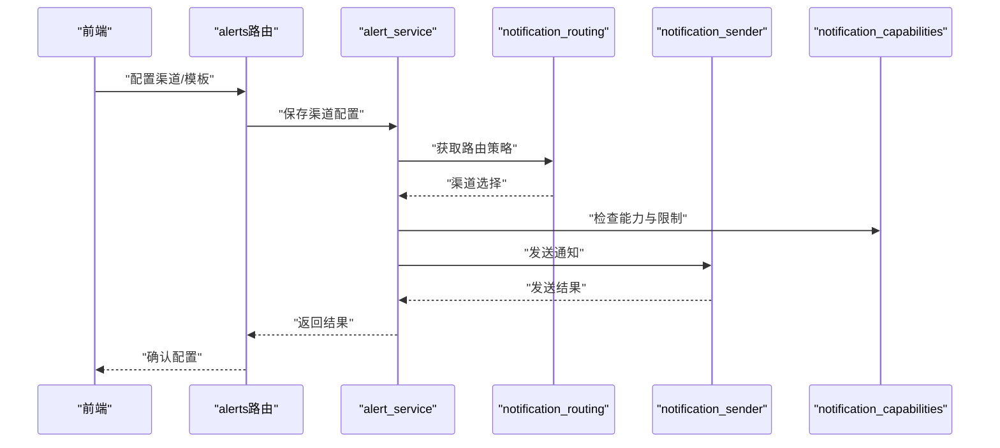
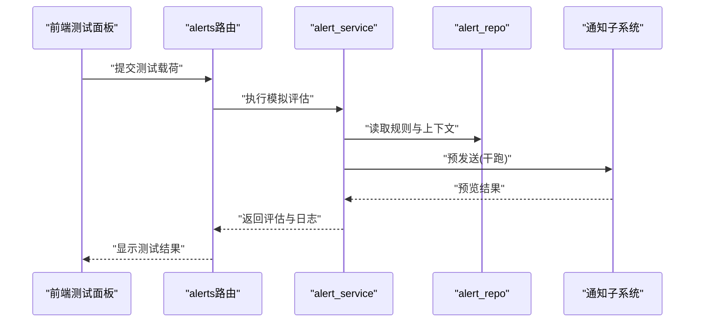
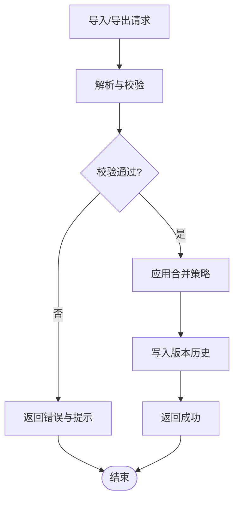
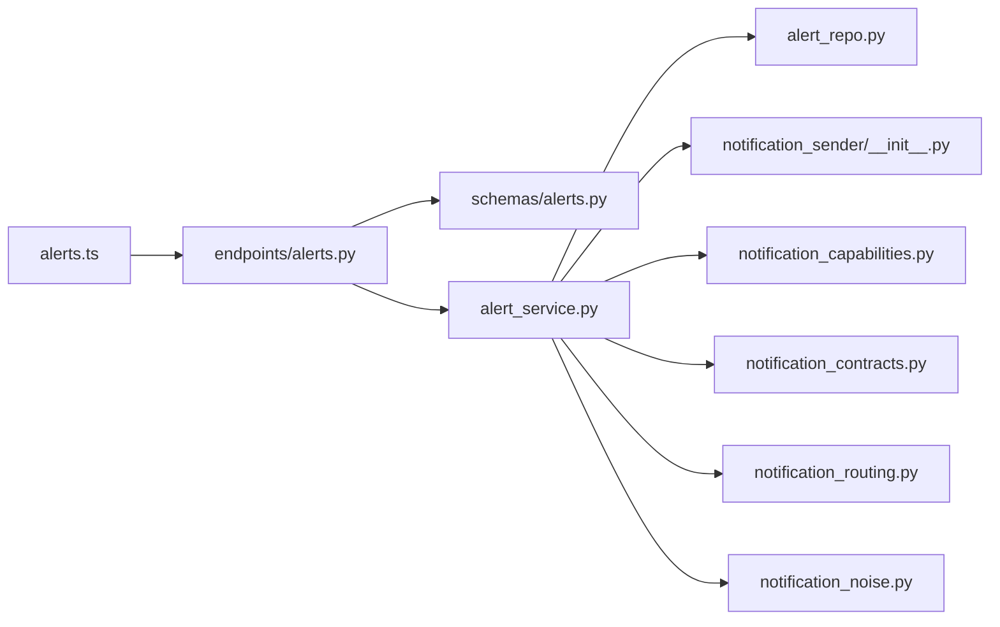

# 警报管理页面

<cite>
**本文引用的文件**   
- [api/v1/endpoints/alerts.py](file://api/v1/endpoints/alerts.py)
- [api/v1/schemas/alerts.py](file://api/v1/schemas/alerts.py)
- [src/services/alert_service.py](file://src/services/alert_service.py)
- [src/repositories/alert_repo.py](file://src/repositories/alert_repo.py)
- [src/notification_sender/__init__.py](file://src/notification_sender/__init__.py)
- [src/notification_capabilities.py](file://src/notification_capabilities.py)
- [src/notification_contracts.py](file://src/notification_contracts.py)
- [src/notification_routing.py](file://src/notification_routing.py)
- [src/notification_noise.py](file://src/notification_noise.py)
- [src/notification.py](file://src/notification.py)
- [apps/dsa-web/src/api/alerts.ts](file://apps/dsa-web/src/api/alerts.ts)
- [apps/dsa-web/src/components/alerts/index.tsx](file://apps/dsa-web/src/components/alerts/index.tsx)
- [apps/dsa-web/src/components/alerts/AlertForm.tsx](file://apps/dsa-web/src/components/alerts/AlertForm.tsx)
- [apps/dsa-web/src/components/alerts/AlertHistory.tsx](file://apps/dsa-web/src/components/alerts/AlertHistory.tsx)
- [apps/dsa-web/src/components/alerts/AlertTimeline.tsx](file://apps/dsa-web/src/components/alerts/AlertTimeline.tsx)
- [apps/dsa-web/src/components/alerts/AlertStats.tsx](file://apps/dsa-web/src/components/alerts/AlertStats.tsx)
- [apps/dsa-web/src/components/alerts/ChannelConfig.tsx](file://apps/dsa-web/src/components/alerts/ChannelConfig.tsx)
- [apps/dsa-web/src/components/alerts/AlertTest.tsx](file://apps/dsa-web/src/components/alerts/AlertTest.tsx)
- [apps/dsa-web/src/pages/alerts.tsx](file://apps/dsa-web/src/pages/alerts.tsx)
</cite>

## 目录
1. [简介](#简介)
2. [项目结构](#项目结构)
3. [核心组件](#核心组件)
4. [架构总览](#架构总览)
5. [详细组件分析](#详细组件分析)
6. [依赖关系分析](#依赖关系分析)
7. [性能考虑](#性能考虑)
8. [故障排查指南](#故障排查指南)
9. [结论](#结论)
10. [附录](#附录)

## 简介
本文件面向“警报管理页面”的完整功能说明，覆盖以下目标：
- 规则全生命周期管理：创建、编辑、启用/禁用、批量操作（启用/禁用/删除）
- 触发历史查看与分析：时间线展示、统计报表、趋势分析
- 条件可视化配置：技术指标选择、数值范围设置、逻辑组合（与/或/非）
- 通知渠道配置与管理：多渠道支持、模板定制、路由与降噪
- 测试与调试：模拟触发、日志查看
- 导入导出与版本管理：规则批量导入/导出、版本对比与回滚

该文档将结合后端 API、服务层、存储层以及前端页面组件，给出端到端的实现概览与使用指引。

## 项目结构
警报管理相关代码分布在前后端多个模块中：
- 后端 API：定义 REST 接口与数据模型校验
- 服务层：封装业务逻辑（规则计算、触发判定、通知发送、导入导出、版本管理）
- 存储层：规则与历史记录的持久化
- 通知子系统：多渠道发送、模板渲染、路由与降噪
- 前端页面：规则列表、表单、历史时间线、统计图表、渠道配置、测试面板

**图示来源**
- [api/v1/endpoints/alerts.py](file://api/v1/endpoints/alerts.py)
- [api/v1/schemas/alerts.py](file://api/v1/schemas/alerts.py)
- [src/services/alert_service.py](file://src/services/alert_service.py)
- [src/repositories/alert_repo.py](file://src/repositories/alert_repo.py)
- [src/notification_sender/__init__.py](file://src/notification_sender/__init__.py)
- [src/notification_capabilities.py](file://src/notification_capabilities.py)
- [src/notification_contracts.py](file://src/notification_contracts.py)
- [src/notification_routing.py](file://src/notification_routing.py)
- [src/notification_noise.py](file://src/notification_noise.py)
- [apps/dsa-web/src/api/alerts.ts](file://apps/dsa-web/src/api/alerts.ts)
- [apps/dsa-web/src/pages/alerts.tsx](file://apps/dsa-web/src/pages/alerts.tsx)
- [apps/dsa-web/src/components/alerts/index.tsx](file://apps/dsa-web/src/components/alerts/index.tsx)

**章节来源**
- [api/v1/endpoints/alerts.py](file://api/v1/endpoints/alerts.py)
- [api/v1/schemas/alerts.py](file://api/v1/schemas/alerts.py)
- [src/services/alert_service.py](file://src/services/alert_service.py)
- [src/repositories/alert_repo.py](file://src/repositories/alert_repo.py)
- [apps/dsa-web/src/api/alerts.ts](file://apps/dsa-web/src/api/alerts.ts)
- [apps/dsa-web/src/pages/alerts.tsx](file://apps/dsa-web/src/pages/alerts.tsx)

## 核心组件
- 规则管理：提供规则的增删改查、启用/禁用、批量操作、导入导出、版本管理
- 触发引擎：基于指标与阈值进行条件判定，生成触发事件
- 历史记录：记录每次触发的时间、标的、指标快照、结果与通知状态
- 通知通道：支持多种渠道（如邮件、IM、Webhook 等），可配置模板与路由策略
- 前端交互：可视化配置界面、时间线视图、统计报表、测试与调试面板

**章节来源**
- [api/v1/endpoints/alerts.py](file://api/v1/endpoints/alerts.py)
- [src/services/alert_service.py](file://src/services/alert_service.py)
- [src/repositories/alert_repo.py](file://src/repositories/alert_repo.py)
- [apps/dsa-web/src/components/alerts/index.tsx](file://apps/dsa-web/src/components/alerts/index.tsx)

## 架构总览
从前端到后端的调用链路如下：
- 前端通过 alerts.ts 调用后端 alerts 路由
- 路由层解析请求体并校验（schemas/alerts.py）
- 服务层执行规则计算、历史写入、通知发送
- 存储层负责规则与历史数据的持久化
- 通知子系统根据渠道配置与模板渲染消息并发送

**图示来源**
- [api/v1/endpoints/alerts.py](file://api/v1/endpoints/alerts.py)
- [api/v1/schemas/alerts.py](file://api/v1/schemas/alerts.py)
- [src/services/alert_service.py](file://src/services/alert_service.py)
- [src/repositories/alert_repo.py](file://src/repositories/alert_repo.py)
- [src/notification_sender/__init__.py](file://src/notification_sender/__init__.py)

## 详细组件分析

### 规则管理（CRUD、启用/禁用、批量操作）
- 功能要点
  - 创建/编辑：支持选择标的、指标、阈值、逻辑组合、通知渠道与模板
  - 启用/禁用：控制规则是否参与实时判定
  - 批量操作：对多条规则统一启用/禁用/删除
  - 导入/导出：支持批量导入规则与导出当前规则集
  - 版本管理：保存规则变更历史，支持对比与回滚
- 关键流程
  - 前端 AlertForm 提交表单数据
  - 后端路由校验并调用服务层保存
  - 服务层写入存储层并记录版本信息
  - 批量操作通过事务保证一致性

**图示来源**
- [api/v1/endpoints/alerts.py](file://api/v1/endpoints/alerts.py)
- [api/v1/schemas/alerts.py](file://api/v1/schemas/alerts.py)
- [src/services/alert_service.py](file://src/services/alert_service.py)
- [src/repositories/alert_repo.py](file://src/repositories/alert_repo.py)

**章节来源**
- [api/v1/endpoints/alerts.py](file://api/v1/endpoints/alerts.py)
- [api/v1/schemas/alerts.py](file://api/v1/schemas/alerts.py)
- [src/services/alert_service.py](file://src/services/alert_service.py)
- [src/repositories/alert_repo.py](file://src/repositories/alert_repo.py)
- [apps/dsa-web/src/components/alerts/AlertForm.tsx](file://apps/dsa-web/src/components/alerts/AlertForm.tsx)

### 触发历史查看与分析（时间线、统计、趋势）
- 功能要点
  - 时间线：按时间顺序展示触发事件，支持筛选与分页
  - 统计报表：统计触发次数、成功率、渠道送达率、告警密度等
  - 趋势分析：按日/周/月维度展示触发趋势与峰值
- 关键流程
  - 前端 AlertHistory/AlertTimeline/AlertStats 发起查询
  - 后端聚合历史数据并返回结构化结果
  - 前端渲染图表与表格

**图示来源**
- [src/repositories/alert_repo.py](file://src/repositories/alert_repo.py)
- [apps/dsa-web/src/components/alerts/AlertHistory.tsx](file://apps/dsa-web/src/components/alerts/AlertHistory.tsx)
- [apps/dsa-web/src/components/alerts/AlertTimeline.tsx](file://apps/dsa-web/src/components/alerts/AlertTimeline.tsx)
- [apps/dsa-web/src/components/alerts/AlertStats.tsx](file://apps/dsa-web/src/components/alerts/AlertStats.tsx)

**章节来源**
- [src/repositories/alert_repo.py](file://src/repositories/alert_repo.py)
- [apps/dsa-web/src/components/alerts/AlertHistory.tsx](file://apps/dsa-web/src/components/alerts/AlertHistory.tsx)
- [apps/dsa-web/src/components/alerts/AlertTimeline.tsx](file://apps/dsa-web/src/components/alerts/AlertTimeline.tsx)
- [apps/dsa-web/src/components/alerts/AlertStats.tsx](file://apps/dsa-web/src/components/alerts/AlertStats.tsx)

### 条件可视化配置（指标、阈值、逻辑组合）
- 功能要点
  - 指标选择：支持多类技术指标（如均线、RSI、成交量等）
  - 阈值设置：数值范围、区间、比较运算符（大于/小于/等于/区间）
  - 逻辑组合：与/或/非组合多个条件，支持嵌套表达式
- 关键流程
  - 前端以可视化方式构建条件树
  - 转换为后端可执行的表达式结构
  - 服务层解析并评估条件，判定是否触发

**图示来源**
- [apps/dsa-web/src/components/alerts/AlertForm.tsx](file://apps/dsa-web/src/components/alerts/AlertForm.tsx)
- [src/services/alert_service.py](file://src/services/alert_service.py)

**章节来源**
- [apps/dsa-web/src/components/alerts/AlertForm.tsx](file://apps/dsa-web/src/components/alerts/AlertForm.tsx)
- [src/services/alert_service.py](file://src/services/alert_service.py)

### 通知渠道配置与管理（多渠道、模板、路由、降噪）
- 功能要点
  - 多渠道支持：邮件、即时通讯、Webhook 等
  - 模板定制：支持变量替换与富文本格式
  - 路由策略：按规则/标的/级别选择渠道
  - 降噪机制：去重、限流、静默期
- 关键流程
  - 前端 ChannelConfig 配置渠道与模板
  - 服务层根据路由策略选择渠道并渲染模板
  - 发送失败时重试与降级

**图示来源**
- [apps/dsa-web/src/components/alerts/ChannelConfig.tsx](file://apps/dsa-web/src/components/alerts/ChannelConfig.tsx)
- [src/services/alert_service.py](file://src/services/alert_service.py)
- [src/notification_routing.py](file://src/notification_routing.py)
- [src/notification_sender/__init__.py](file://src/notification_sender/__init__.py)
- [src/notification_capabilities.py](file://src/notification_capabilities.py)

**章节来源**
- [apps/dsa-web/src/components/alerts/ChannelConfig.tsx](file://apps/dsa-web/src/components/alerts/ChannelConfig.tsx)
- [src/services/alert_service.py](file://src/services/alert_service.py)
- [src/notification_routing.py](file://src/notification_routing.py)
- [src/notification_sender/__init__.py](file://src/notification_sender/__init__.py)
- [src/notification_capabilities.py](file://src/notification_capabilities.py)
- [src/notification_contracts.py](file://src/notification_contracts.py)
- [src/notification_noise.py](file://src/notification_noise.py)

### 测试与调试（模拟触发、日志查看）
- 功能要点
  - 模拟触发：传入测试数据或回放历史片段，验证规则与通知
  - 日志查看：输出解析、评估、发送过程的详细日志
- 关键流程
  - 前端 AlertTest 提交测试载荷
  - 后端服务层执行评估与发送（不持久化真实触发）
  - 返回评估结果与日志摘要

**图示来源**
- [apps/dsa-web/src/components/alerts/AlertTest.tsx](file://apps/dsa-web/src/components/alerts/AlertTest.tsx)
- [src/services/alert_service.py](file://src/services/alert_service.py)
- [src/repositories/alert_repo.py](file://src/repositories/alert_repo.py)
- [src/notification_sender/__init__.py](file://src/notification_sender/__init__.py)

**章节来源**
- [apps/dsa-web/src/components/alerts/AlertTest.tsx](file://apps/dsa-web/src/components/alerts/AlertTest.tsx)
- [src/services/alert_service.py](file://src/services/alert_service.py)
- [src/repositories/alert_repo.py](file://src/repositories/alert_repo.py)

### 导入导出与版本管理
- 功能要点
  - 导入：批量导入规则（JSON/YAML），支持冲突检测与合并策略
  - 导出：导出当前规则集与版本元数据
  - 版本管理：保存每次变更的版本号、差异与回滚点
- 关键流程
  - 前端上传/下载文件
  - 后端解析与校验，应用合并策略
  - 存储层记录版本历史

**图示来源**
- [src/services/alert_service.py](file://src/services/alert_service.py)
- [src/repositories/alert_repo.py](file://src/repositories/alert_repo.py)

**章节来源**
- [src/services/alert_service.py](file://src/services/alert_service.py)
- [src/repositories/alert_repo.py](file://src/repositories/alert_repo.py)

## 依赖关系分析
- 前端依赖
  - alerts.ts 调用后端 alerts 路由
  - 页面与组件依赖 API 返回的数据结构与分页参数
- 后端依赖
  - endpoints/alerts.py 依赖 schemas/alerts.py 进行参数校验
  - services/alert_service.py 依赖 repositories/alert_repo.py 进行数据存取
  - notification_* 模块提供渠道能力、合同定义、路由与降噪
- 外部集成
  - 通知渠道可能依赖第三方服务（邮件服务器、IM平台、Webhook 接收方）

**图示来源**
- [apps/dsa-web/src/api/alerts.ts](file://apps/dsa-web/src/api/alerts.ts)
- [api/v1/endpoints/alerts.py](file://api/v1/endpoints/alerts.py)
- [api/v1/schemas/alerts.py](file://api/v1/schemas/alerts.py)
- [src/services/alert_service.py](file://src/services/alert_service.py)
- [src/repositories/alert_repo.py](file://src/repositories/alert_repo.py)
- [src/notification_sender/__init__.py](file://src/notification_sender/__init__.py)
- [src/notification_capabilities.py](file://src/notification_capabilities.py)
- [src/notification_contracts.py](file://src/notification_contracts.py)
- [src/notification_routing.py](file://src/notification_routing.py)
- [src/notification_noise.py](file://src/notification_noise.py)

**章节来源**
- [apps/dsa-web/src/api/alerts.ts](file://apps/dsa-web/src/api/alerts.ts)
- [api/v1/endpoints/alerts.py](file://api/v1/endpoints/alerts.py)
- [api/v1/schemas/alerts.py](file://api/v1/schemas/alerts.py)
- [src/services/alert_service.py](file://src/services/alert_service.py)
- [src/repositories/alert_repo.py](file://src/repositories/alert_repo.py)
- [src/notification_sender/__init__.py](file://src/notification_sender/__init__.py)
- [src/notification_capabilities.py](file://src/notification_capabilities.py)
- [src/notification_contracts.py](file://src/notification_contracts.py)
- [src/notification_routing.py](file://src/notification_routing.py)
- [src/notification_noise.py](file://src/notification_noise.py)

## 性能考虑
- 规则评估
  - 指标计算缓存：避免重复计算相同窗口指标
  - 条件表达式优化：短路求值与索引加速
- 历史查询
  - 分页与过滤：减少一次性返回数据量
  - 聚合查询：在数据库层完成统计，降低内存压力
- 通知发送
  - 并发控制：限制并发发送数，避免阻塞
  - 重试与退避：指数退避与最大重试次数
  - 降噪：去重与静默期减少重复通知

[本节为通用指导，无需特定文件引用]

## 故障排查指南
- 常见问题
  - 参数校验失败：检查前端表单字段与后端 schema 定义的一致性
  - 规则未触发：确认指标数据源可用、阈值设置正确、逻辑组合符合预期
  - 通知发送失败：检查渠道配置、认证信息、网络连通性与限流策略
  - 导入失败：检查文件格式、必填字段、冲突处理策略
- 定位方法
  - 查看测试面板输出与日志摘要
  - 检查历史记录的 notify_status 与错误码
  - 使用路由与能力检查工具验证渠道可用性

**章节来源**
- [src/notification_noise.py](file://src/notification_noise.py)
- [src/notification_capabilities.py](file://src/notification_capabilities.py)
- [src/notification_contracts.py](file://src/notification_contracts.py)
- [src/notification_routing.py](file://src/notification_routing.py)
- [src/notification.py](file://src/notification.py)

## 结论
警报管理页面提供了完整的规则管理与触发分析能力，结合可视化配置与多渠道通知，能够满足复杂场景下的实时监控需求。通过导入导出与版本管理，便于团队协作与审计追溯。建议在部署后持续优化指标计算与通知发送的性能，并结合降噪策略提升用户体验。

[本节为总结性内容，无需特定文件引用]

## 附录
- 术语表
  - 规则：包含标的、指标、阈值与逻辑组合的监控条件
  - 触发：当指标满足规则条件时产生的一次警报事件
  - 渠道：通知发送的目标系统（邮件、IM、Webhook 等）
  - 模板：通知内容的格式化描述，支持变量替换
  - 路由：根据规则属性选择合适渠道的策略
  - 降噪：减少重复与无效通知的机制

[本节为概念性内容，无需特定文件引用]