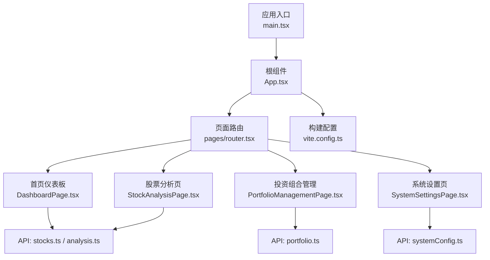
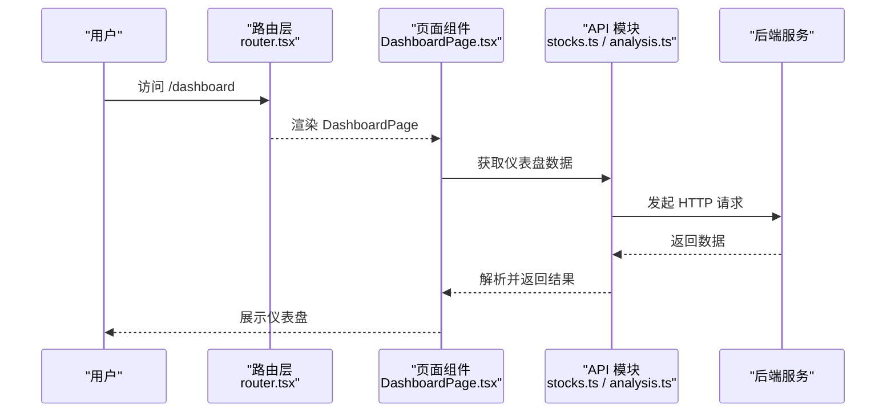
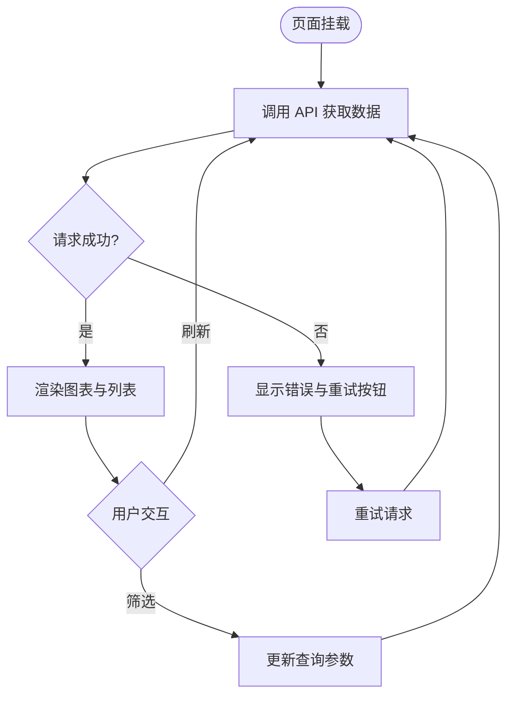
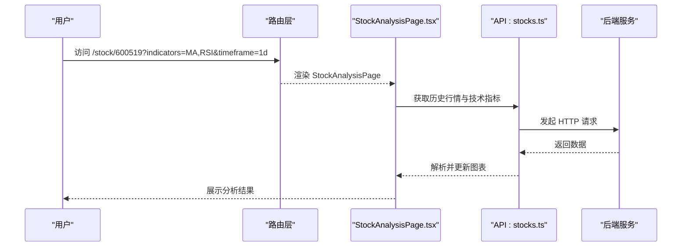
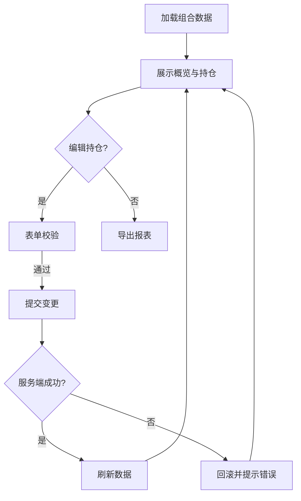
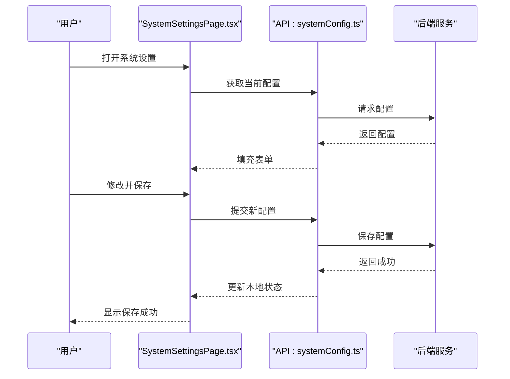
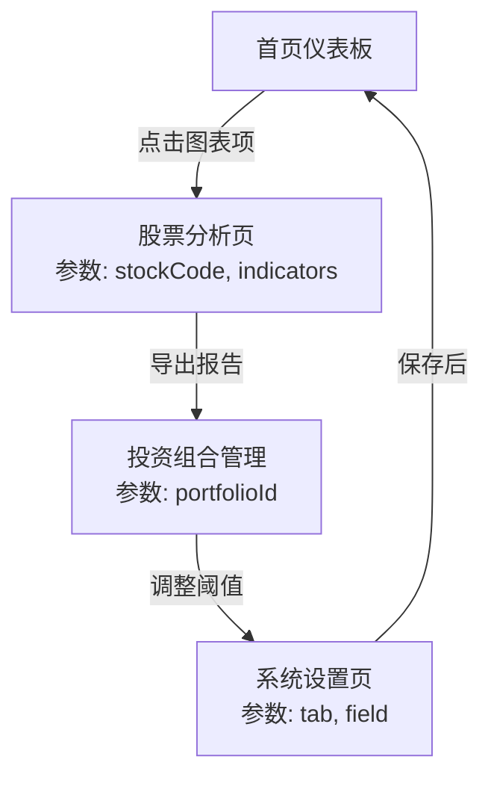
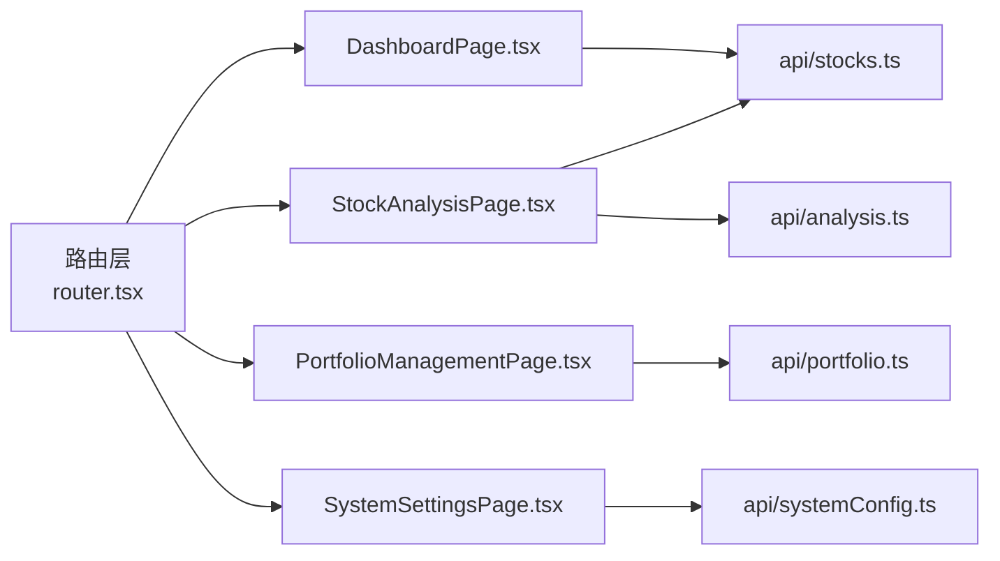

# 页面组件

<cite>
**本文引用的文件**   
- [main.tsx](file://apps/dsa-web/src/main.tsx)
- [App.tsx](file://apps/dsa-web/src/App.tsx)
- [vite.config.ts](file://apps/dsa-web/vite.config.ts)
- [router.tsx](file://apps/dsa-web/src/pages/router.tsx)
- [DashboardPage.tsx](file://apps/dsa-web/src/pages/DashboardPage.tsx)
- [StockAnalysisPage.tsx](file://apps/dsa-web/src/pages/StockAnalysisPage.tsx)
- [PortfolioManagementPage.tsx](file://apps/dsa-web/src/pages/PortfolioManagementPage.tsx)
- [SystemSettingsPage.tsx](file://apps/dsa-web/src/pages/SystemSettingsPage.tsx)
- [stocks.ts](file://apps/dsa-web/src/api/stocks.ts)
- [portfolio.ts](file://apps/dsa-web/src/api/portfolio.ts)
- [systemConfig.ts](file://apps/dsa-web/src/api/systemConfig.ts)
- [analysis.ts](file://apps/dsa-web/src/api/analysis.ts)
- [useAsyncData.ts](file://apps/dsa-web/src/hooks/useAsyncData.ts)
- [store.ts](file://apps/dsa-web/src/stores/store.ts)
</cite>

## 目录
1. [简介](#简介)
2. [项目结构](#项目结构)
3. [核心组件](#核心组件)
4. [架构总览](#架构总览)
5. [详细组件分析](#详细组件分析)
6. [依赖分析](#依赖分析)
7. [性能考虑](#性能考虑)
8. [故障排查指南](#故障排查指南)
9. [结论](#结论)
10. [附录](#附录)

## 简介
本文件面向“页面组件”的文档，聚焦以下四大功能页面：首页仪表板、股票分析页面、投资组合管理、系统设置。内容涵盖页面布局结构、交互逻辑与数据流、页面间导航与参数传递（路由参数与查询字符串）、页面级状态管理与生命周期、以及性能优化策略（代码分割、懒加载、缓存）。同时提供开发最佳实践与常见问题解决方案，帮助开发者快速理解并高效扩展这些页面。

## 项目结构
前端应用位于 apps/dsa-web 目录，采用 React + TypeScript + Vite 技术栈。页面组织在 src/pages 下，API 封装在 src/api，通用 Hook 在 src/hooks，全局状态在 src/stores，路由入口由 App 与页面级路由共同构成。构建配置在 vite.config.ts，用于实现按需加载与代码分割。

图表来源
- [main.tsx](file://apps/dsa-web/src/main.tsx)
- [App.tsx](file://apps/dsa-web/src/App.tsx)
- [router.tsx](file://apps/dsa-web/src/pages/router.tsx)
- [DashboardPage.tsx](file://apps/dsa-web/src/pages/DashboardPage.tsx)
- [StockAnalysisPage.tsx](file://apps/dsa-web/src/pages/StockAnalysisPage.tsx)
- [PortfolioManagementPage.tsx](file://apps/dsa-web/src/pages/PortfolioManagementPage.tsx)
- [SystemSettingsPage.tsx](file://apps/dsa-web/src/pages/SystemSettingsPage.tsx)
- [stocks.ts](file://apps/dsa-web/src/api/stocks.ts)
- [portfolio.ts](file://apps/dsa-web/src/api/portfolio.ts)
- [systemConfig.ts](file://apps/dsa-web/src/api/systemConfig.ts)
- [analysis.ts](file://apps/dsa-web/src/api/analysis.ts)
- [vite.config.ts](file://apps/dsa-web/vite.config.ts)

章节来源
- [main.tsx](file://apps/dsa-web/src/main.tsx)
- [App.tsx](file://apps/dsa-web/src/App.tsx)
- [vite.config.ts](file://apps/dsa-web/vite.config.ts)

## 核心组件
- 应用入口与根组件：负责初始化渲染、主题与环境配置、全局错误边界与国际化等。
- 路由层：集中定义页面路由与嵌套路由，支持动态参数与查询字符串解析。
- 页面组件：每个功能页面独立维护自身状态与生命周期，通过 API 模块获取数据。
- API 模块：统一封装后端接口调用，包含请求拦截、错误处理与重试策略。
- 状态管理：页面级状态优先，必要时使用轻量全局 store 共享跨页面数据。

章节来源
- [App.tsx](file://apps/dsa-web/src/App.tsx)
- [router.tsx](file://apps/dsa-web/src/pages/router.tsx)
- [stocks.ts](file://apps/dsa-web/src/api/stocks.ts)
- [portfolio.ts](file://apps/dsa-web/src/api/portfolio.ts)
- [systemConfig.ts](file://apps/dsa-web/src/api/systemConfig.ts)
- [analysis.ts](file://apps/dsa-web/src/api/analysis.ts)

## 架构总览
页面组件遵循“路由驱动 + 页面自治”的架构模式。路由层根据 URL 匹配加载对应页面；页面内部通过 Hook 或 Store 管理本地状态，调用 API 模块进行数据获取与更新。Vite 的按需导入与动态 import() 实现代码分割与懒加载，减少首屏体积。

图表来源
- [router.tsx](file://apps/dsa-web/src/pages/router.tsx)
- [DashboardPage.tsx](file://apps/dsa-web/src/pages/DashboardPage.tsx)
- [stocks.ts](file://apps/dsa-web/src/api/stocks.ts)
- [analysis.ts](file://apps/dsa-web/src/api/analysis.ts)

## 详细组件分析

### 首页仪表板（Dashboard）
- 布局结构：顶部概览卡片（关键指标）、中部图表区域（趋势图、分布图）、底部列表（热点事件或推荐标的）。
- 交互逻辑：支持时间范围选择、刷新按钮、点击图表项跳转至股票分析页。
- 数据流：页面挂载时触发数据拉取，使用 useAsyncData 管理异步状态；失败时显示错误提示，支持重试。
- 路由与参数：从查询字符串读取时间窗口与筛选条件，如 ?period=7d&market=us。
- 状态管理：页面级状态存储指标数据、图表配置与加载状态；必要时将关键指标同步到全局 store。

图表来源
- [DashboardPage.tsx](file://apps/dsa-web/src/pages/DashboardPage.tsx)
- [useAsyncData.ts](file://apps/dsa-web/src/hooks/useAsyncData.ts)
- [stocks.ts](file://apps/dsa-web/src/api/stocks.ts)
- [analysis.ts](file://apps/dsa-web/src/api/analysis.ts)

章节来源
- [DashboardPage.tsx](file://apps/dsa-web/src/pages/DashboardPage.tsx)
- [useAsyncData.ts](file://apps/dsa-web/src/hooks/useAsyncData.ts)
- [stocks.ts](file://apps/dsa-web/src/api/stocks.ts)
- [analysis.ts](file://apps/dsa-web/src/api/analysis.ts)

### 股票分析页面（Stock Analysis）
- 布局结构：左侧搜索与自选列表、中部主图表（K线、技术指标）、右侧详情面板（基本面、新闻、信号）。
- 交互逻辑：支持股票代码搜索、指标切换、区间缩放、信号标记与导出报告。
- 数据流：根据路由参数 stockCode 与查询参数 indicators、timeframe 拉取历史行情与技术指标；增量更新实时报价。
- 路由与参数：动态路由 /stock/:stockCode，查询字符串控制指标与时间窗口。
- 状态管理：页面级状态保存当前股票、指标集合、图表视图与选中信号；对频繁更新的实时数据采用局部状态与防抖。

图表来源
- [StockAnalysisPage.tsx](file://apps/dsa-web/src/pages/StockAnalysisPage.tsx)
- [stocks.ts](file://apps/dsa-web/src/api/stocks.ts)

章节来源
- [StockAnalysisPage.tsx](file://apps/dsa-web/src/pages/StockAnalysisPage.tsx)
- [stocks.ts](file://apps/dsa-web/src/api/stocks.ts)

### 投资组合管理（Portfolio Management）
- 布局结构：组合概览（总资产、收益曲线）、持仓明细表、交易记录与风险指标。
- 交互逻辑：支持新增/编辑持仓、批量导入、导出报表、风险预警与回测对比。
- 数据流：页面挂载时拉取组合快照与持仓明细；提交变更时调用组合服务接口；失败时回滚并提示。
- 路由与参数：路由 /portfolio 支持组合 ID 参数 ?id=default，便于多组合切换。
- 状态管理：页面级状态管理组合数据、表单校验与操作反馈；对敏感操作启用确认对话框与撤销机制。

图表来源
- [PortfolioManagementPage.tsx](file://apps/dsa-web/src/pages/PortfolioManagementPage.tsx)
- [portfolio.ts](file://apps/dsa-web/src/api/portfolio.ts)

章节来源
- [PortfolioManagementPage.tsx](file://apps/dsa-web/src/pages/PortfolioManagementPage.tsx)
- [portfolio.ts](file://apps/dsa-web/src/api/portfolio.ts)

### 系统设置页面（System Settings）
- 布局结构：分类设置项（网络、LLM 提供商、通知渠道、任务调度）、字段描述与验证提示。
- 交互逻辑：支持逐项修改、批量导入配置、测试连接与保存；变更即时生效或重启后生效。
- 数据流：页面启动时拉取当前配置；保存时合并并提交；失败时保留旧值并提示。
- 路由与参数：路由 /settings 支持 tab 参数 ?tab=llm 以定位具体设置分组。
- 状态管理：页面级状态管理表单值、校验结果与保存状态；对长耗时操作使用进度条与取消机制。

图表来源
- [SystemSettingsPage.tsx](file://apps/dsa-web/src/pages/SystemSettingsPage.tsx)
- [systemConfig.ts](file://apps/dsa-web/src/api/systemConfig.ts)

章节来源
- [SystemSettingsPage.tsx](file://apps/dsa-web/src/pages/SystemSettingsPage.tsx)
- [systemConfig.ts](file://apps/dsa-web/src/api/systemConfig.ts)

### 概念性总览
以下为不绑定具体源码的概念流程图，展示页面间导航与参数传递的一般模式：

[此图为概念流程，不映射具体源码，故无图表来源]

## 依赖分析
页面组件之间的耦合度较低，主要通过路由与 API 模块进行通信。页面级状态避免不必要的跨组件传播，提升可维护性与性能。

图表来源
- [router.tsx](file://apps/dsa-web/src/pages/router.tsx)
- [DashboardPage.tsx](file://apps/dsa-web/src/pages/DashboardPage.tsx)
- [StockAnalysisPage.tsx](file://apps/dsa-web/src/pages/StockAnalysisPage.tsx)
- [PortfolioManagementPage.tsx](file://apps/dsa-web/src/pages/PortfolioManagementPage.tsx)
- [SystemSettingsPage.tsx](file://apps/dsa-web/src/pages/SystemSettingsPage.tsx)
- [stocks.ts](file://apps/dsa-web/src/api/stocks.ts)
- [analysis.ts](file://apps/dsa-web/src/api/analysis.ts)
- [portfolio.ts](file://apps/dsa-web/src/api/portfolio.ts)
- [systemConfig.ts](file://apps/dsa-web/src/api/systemConfig.ts)

章节来源
- [router.tsx](file://apps/dsa-web/src/pages/router.tsx)
- [stocks.ts](file://apps/dsa-web/src/api/stocks.ts)
- [analysis.ts](file://apps/dsa-web/src/api/analysis.ts)
- [portfolio.ts](file://apps/dsa-web/src/api/portfolio.ts)
- [systemConfig.ts](file://apps/dsa-web/src/api/systemConfig.ts)

## 性能考虑
- 代码分割与懒加载：通过 Vite 的动态 import() 与路由级拆分，确保页面按需加载，降低首屏体积。
- 数据缓存：对静态或低频变化数据（如系统配置、指数映射）实施内存缓存与持久化缓存，减少重复请求。
- 请求去重与并发控制：对相同参数的请求进行去重，限制并发数避免阻塞 UI。
- 虚拟滚动与分页：大数据列表采用虚拟滚动与分页加载，提升渲染性能。
- 图表优化：对高频更新场景使用增量更新与节流，避免频繁重绘。
- 资源预取：在用户交互前预取可能需要的数据（如进入分析页前预取常用指标）。

[本节为通用指导，不直接分析具体文件，故无章节来源]

## 故障排查指南
- 页面空白或白屏：检查路由是否正确匹配、组件是否被正确懒加载、是否存在未捕获异常。
- 数据不更新：确认 API 模块的请求参数与后端契约一致，检查 useAsyncData 的重试与错误处理逻辑。
- 路由参数丢失：验证查询字符串编码与解码逻辑，确保页面内参数解析与默认值处理正确。
- 状态不同步：检查页面级状态与全局 store 的同步时机，避免竞态条件导致的数据不一致。
- 性能卡顿：使用浏览器性能面板定位瓶颈，关注大列表渲染、图表重绘与网络请求频率。

章节来源
- [useAsyncData.ts](file://apps/dsa-web/src/hooks/useAsyncData.ts)
- [stocks.ts](file://apps/dsa-web/src/api/stocks.ts)
- [portfolio.ts](file://apps/dsa-web/src/api/portfolio.ts)
- [systemConfig.ts](file://apps/dsa-web/src/api/systemConfig.ts)

## 结论
页面组件采用清晰的分层与职责划分，路由驱动页面渲染，页面自治状态与数据流，API 模块统一封装接口调用。通过代码分割、懒加载与缓存策略，系统在可用性与性能之间取得平衡。建议在新页面开发中遵循现有模式，保持低耦合与高内聚，确保可维护性与可扩展性。

[本节为总结性内容，不直接分析具体文件，故无章节来源]

## 附录
- 开发最佳实践
  - 页面级状态优先，仅在必要时引入全局状态。
  - 使用统一的 API 模块与错误处理策略，保证一致性。
  - 路由参数与查询字符串保持一致的命名规范与类型约束。
  - 对复杂交互拆分为子组件，提升可读性与复用性。
- 常见问题解决方案
  - 数据加载失败：增加重试与降级策略，提供用户友好的错误提示。
  - 路由跳转异常：确保路径与参数格式正确，添加必要的守卫与校验。
  - 性能问题：识别热点路径，优化渲染与请求策略。

[本节为通用指导，不直接分析具体文件，故无章节来源]