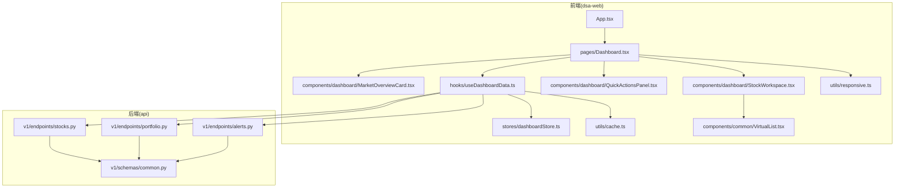
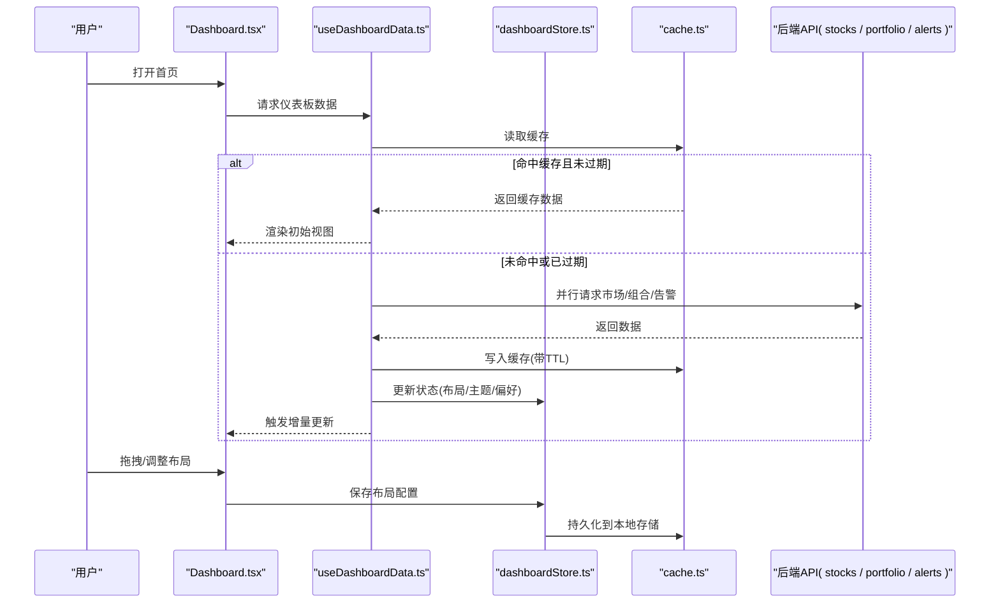
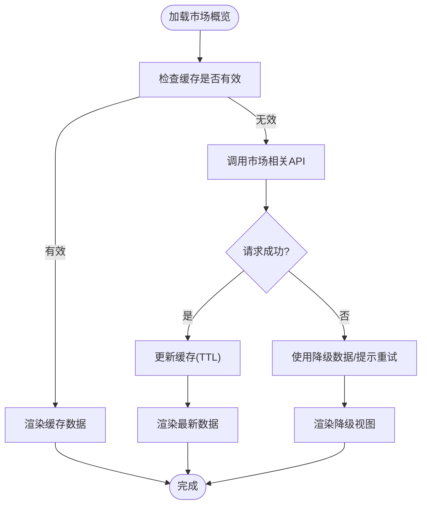
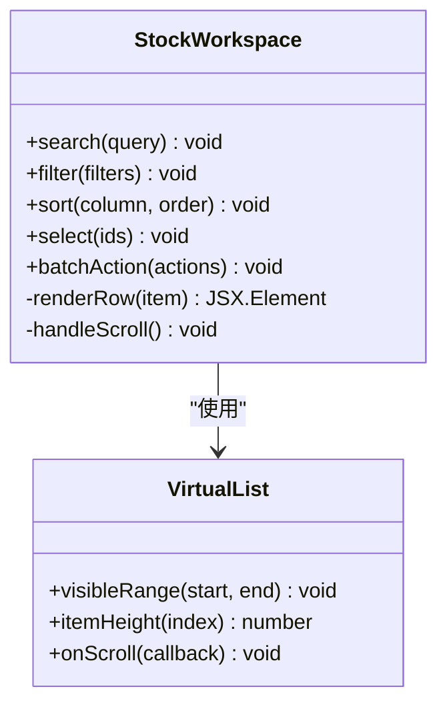
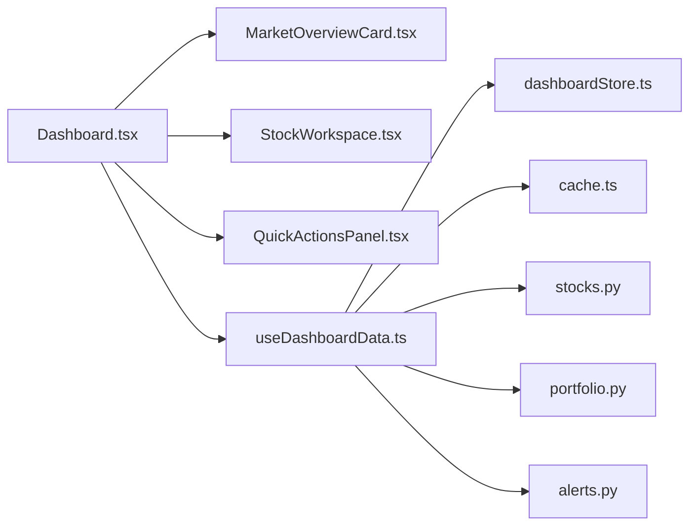

# 首页仪表板

<cite>
**本文引用的文件**   
- [apps/dsa-web/src/pages/Dashboard.tsx](file://apps/dsa-web/src/pages/Dashboard.tsx)
- [apps/dsa-web/src/components/dashboard/MarketOverviewCard.tsx](file://apps/dsa-web/src/components/dashboard/MarketOverviewCard.tsx)
- [apps/dsa-web/src/components/dashboard/StockWorkspace.tsx](file://apps/dsa-web/src/components/dashboard/StockWorkspace.tsx)
- [apps/dsa-web/src/components/dashboard/QuickActionsPanel.tsx](file://apps/dsa-web/src/components/dashboard/QuickActionsPanel.tsx)
- [apps/dsa-web/src/hooks/useDashboardData.ts](file://apps/dsa-web/src/hooks/useDashboardData.ts)
- [apps/dsa-web/src/stores/dashboardStore.ts](file://apps/dsa-web/src/stores/dashboardStore.ts)
- [api/v1/endpoints/stocks.py](file://api/v1/endpoints/stocks.py)
- [api/v1/endpoints/portfolio.py](file://api/v1/endpoints/portfolio.py)
- [api/v1/endpoints/alerts.py](file://api/v1/endpoints/alerts.py)
- [api/v1/schemas/common.py](file://api/v1/schemas/common.py)
- [apps/dsa-web/src/utils/cache.ts](file://apps/dsa-web/src/utils/cache.ts)
- [apps/dsa-web/src/utils/responsive.ts](file://apps/dsa-web/src/utils/responsive.ts)
- [apps/dsa-web/src/components/common/VirtualList.tsx](file://apps/dsa-web/src/components/common/VirtualList.tsx)
- [apps/dsa-web/src/App.tsx](file://apps/dsa-web/src/App.tsx)
</cite>

## 目录
1. [简介](#简介)
2. [项目结构](#项目结构)
3. [核心组件](#核心组件)
4. [架构总览](#架构总览)
5. [详细组件分析](#详细组件分析)
6. [依赖关系分析](#依赖关系分析)
7. [性能考虑](#性能考虑)
8. [故障排查指南](#故障排查指南)
9. [结论](#结论)
10. [附录](#附录)

## 简介
本文件面向“首页仪表板”的实现与使用，覆盖以下目标：
- 作为应用入口的核心功能：市场概览、股票工作区、快速操作面板等模块的职责与交互。
- 数据获取机制：实时数据更新策略、缓存策略与增量更新。
- 用户自定义布局：组件拖拽、尺寸调整与个性化配置持久化。
- 响应式设计：多设备适配与断点策略。
- 性能优化：虚拟滚动、增量更新、内存管理与渲染优化。
- 常见问题调试方法与性能监控指标。

## 项目结构
首页仪表板位于前端 Web 应用中，采用 React + TypeScript 技术栈，配合状态管理、API 客户端与工具库组织代码。后端提供 REST API 用于获取行情、组合与告警等数据。

图表来源
- [apps/dsa-web/src/App.tsx](file://apps/dsa-web/src/App.tsx)
- [apps/dsa-web/src/pages/Dashboard.tsx](file://apps/dsa-web/src/pages/Dashboard.tsx)
- [apps/dsa-web/src/components/dashboard/MarketOverviewCard.tsx](file://apps/dsa-web/src/components/dashboard/MarketOverviewCard.tsx)
- [apps/dsa-web/src/components/dashboard/StockWorkspace.tsx](file://apps/dsa-web/src/components/dashboard/StockWorkspace.tsx)
- [apps/dsa-web/src/components/dashboard/QuickActionsPanel.tsx](file://apps/dsa-web/src/components/dashboard/QuickActionsPanel.tsx)
- [apps/dsa-web/src/hooks/useDashboardData.ts](file://apps/dsa-web/src/hooks/useDashboardData.ts)
- [apps/dsa-web/src/stores/dashboardStore.ts](file://apps/dsa-web/src/stores/dashboardStore.ts)
- [api/v1/endpoints/stocks.py](file://api/v1/endpoints/stocks.py)
- [api/v1/endpoints/portfolio.py](file://api/v1/endpoints/portfolio.py)
- [api/v1/endpoints/alerts.py](file://api/v1/endpoints/alerts.py)
- [api/v1/schemas/common.py](file://api/v1/schemas/common.py)

章节来源
- [apps/dsa-web/src/App.tsx](file://apps/dsa-web/src/App.tsx)
- [apps/dsa-web/src/pages/Dashboard.tsx](file://apps/dsa-web/src/pages/Dashboard.tsx)

## 核心组件
- 市场概览卡片（MarketOverviewCard）：展示大盘指数、涨跌分布、关键指标摘要；支持刷新与时间范围切换。
- 股票工作区（StockWorkspace）：自选股列表、搜索与筛选、排序、分页/虚拟滚动；点击进入详情或交易流程。
- 快速操作面板（QuickActionsPanel）：常用动作入口（如新建分析、查看组合、打开告警中心），支持快捷键与键盘导航。
- 数据钩子（useDashboardData）：统一的数据拉取、缓存、重试与错误处理；聚合多个接口并合并为仪表板视图模型。
- 仪表板状态（dashboardStore）：布局配置、主题、用户偏好与本地缓存读写。
- 虚拟列表（VirtualList）：长列表高性能渲染，按需挂载节点，减少内存占用。

章节来源
- [apps/dsa-web/src/components/dashboard/MarketOverviewCard.tsx](file://apps/dsa-web/src/components/dashboard/MarketOverviewCard.tsx)
- [apps/dsa-web/src/components/dashboard/StockWorkspace.tsx](file://apps/dsa-web/src/components/dashboard/StockWorkspace.tsx)
- [apps/dsa-web/src/components/dashboard/QuickActionsPanel.tsx](file://apps/dsa-web/src/components/dashboard/QuickActionsPanel.tsx)
- [apps/dsa-web/src/hooks/useDashboardData.ts](file://apps/dsa-web/src/hooks/useDashboardData.ts)
- [apps/dsa-web/src/stores/dashboardStore.ts](file://apps/dsa-web/src/stores/dashboardStore.ts)
- [apps/dsa-web/src/components/common/VirtualList.tsx](file://apps/dsa-web/src/components/common/VirtualList.tsx)

## 架构总览
仪表板通过数据钩子聚合后端接口，结合本地缓存与状态管理，驱动 UI 渲染。布局由用户配置驱动，支持拖拽与尺寸调整。响应式工具根据视口变化动态调整栅格与组件可见性。

图表来源
- [apps/dsa-web/src/pages/Dashboard.tsx](file://apps/dsa-web/src/pages/Dashboard.tsx)
- [apps/dsa-web/src/hooks/useDashboardData.ts](file://apps/dsa-web/src/hooks/useDashboardData.ts)
- [apps/dsa-web/src/stores/dashboardStore.ts](file://apps/dsa-web/src/stores/dashboardStore.ts)
- [apps/dsa-web/src/utils/cache.ts](file://apps/dsa-web/src/utils/cache.ts)
- [api/v1/endpoints/stocks.py](file://api/v1/endpoints/stocks.py)
- [api/v1/endpoints/portfolio.py](file://api/v1/endpoints/portfolio.py)
- [api/v1/endpoints/alerts.py](file://api/v1/endpoints/alerts.py)

## 详细组件分析

### 市场概览卡片（MarketOverviewCard）
- 职责：聚合指数涨跌幅、涨跌家数、板块热度、资金流向摘要等。
- 数据流：通过 useDashboardData 拉取市场数据，优先读缓存，失败时降级显示最近可用数据。
- 交互：时间范围切换、手动刷新、错误重试。
- 性能：局部更新、防抖刷新、骨架屏占位。

图表来源
- [apps/dsa-web/src/components/dashboard/MarketOverviewCard.tsx](file://apps/dsa-web/src/components/dashboard/MarketOverviewCard.tsx)
- [apps/dsa-web/src/hooks/useDashboardData.ts](file://apps/dsa-web/src/hooks/useDashboardData.ts)
- [apps/dsa-web/src/utils/cache.ts](file://apps/dsa-web/src/utils/cache.ts)

章节来源
- [apps/dsa-web/src/components/dashboard/MarketOverviewCard.tsx](file://apps/dsa-web/src/components/dashboard/MarketOverviewCard.tsx)
- [apps/dsa-web/src/hooks/useDashboardData.ts](file://apps/dsa-web/src/hooks/useDashboardData.ts)

### 股票工作区（StockWorkspace）
- 职责：自选股列表、搜索过滤、排序、分页/虚拟滚动、批量操作。
- 数据流：按条件分页请求，增量更新行级数据；支持 WebSocket/SSE 推送（若启用）。
- 交互：列头排序、多选、右键菜单、快捷键。
- 性能：虚拟滚动、行级 diff、去抖搜索、分页预取。

图表来源
- [apps/dsa-web/src/components/dashboard/StockWorkspace.tsx](file://apps/dsa-web/src/components/dashboard/StockWorkspace.tsx)
- [apps/dsa-web/src/components/common/VirtualList.tsx](file://apps/dsa-web/src/components/common/VirtualList.tsx)

章节来源
- [apps/dsa-web/src/components/dashboard/StockWorkspace.tsx](file://apps/dsa-web/src/components/dashboard/StockWorkspace.tsx)
- [apps/dsa-web/src/components/common/VirtualList.tsx](file://apps/dsa-web/src/components/common/VirtualList.tsx)

### 快速操作面板（QuickActionsPanel）
- 职责：提供高频操作的快捷入口，支持自定义图标、分组与快捷键映射。
- 数据流：从 dashboardStore 读取用户配置，必要时懒加载图标资源。
- 交互：点击跳转、拖拽重排、长按编辑。
- 性能：图标懒加载、事件委托、最小化重渲染。

章节来源
- [apps/dsa-web/src/components/dashboard/QuickActionsPanel.tsx](file://apps/dsa-web/src/components/dashboard/QuickActionsPanel.tsx)
- [apps/dsa-web/src/stores/dashboardStore.ts](file://apps/dsa-web/src/stores/dashboardStore.ts)

### 数据钩子（useDashboardData）
- 职责：统一封装数据获取、缓存、重试、错误边界与增量更新。
- 策略：
  - 缓存：基于键的 TTL 缓存，区分市场快照与明细数据。
  - 并发：并行请求市场、组合、告警，失败隔离与降级。
  - 增量：对列表类数据采用补丁更新，避免全量替换。
  - 错误：网络异常重试、超时控制、用户可感知的错误提示。
- 输出：为各组件提供稳定数据结构，屏蔽底层差异。

章节来源
- [apps/dsa-web/src/hooks/useDashboardData.ts](file://apps/dsa-web/src/hooks/useDashboardData.ts)
- [apps/dsa-web/src/utils/cache.ts](file://apps/dsa-web/src/utils/cache.ts)

### 仪表板状态（dashboardStore）
- 职责：管理布局配置、主题、语言、用户偏好与本地持久化。
- 能力：
  - 布局序列化/反序列化，支持版本迁移。
  - 变更订阅与增量派发，避免全局重渲染。
  - 离线优先：无网状态下仍可使用本地配置与缓存。

章节来源
- [apps/dsa-web/src/stores/dashboardStore.ts](file://apps/dsa-web/src/stores/dashboardStore.ts)

### 后端接口（stocks / portfolio / alerts）
- stocks：提供股票列表、搜索、行情快照、历史数据窗口。
- portfolio：提供组合持仓、收益曲线、风险指标。
- alerts：提供告警规则、触发记录、通知渠道状态。
- 共同契约：统一错误码、分页参数、时间戳格式与字段命名规范。

章节来源
- [api/v1/endpoints/stocks.py](file://api/v1/endpoints/stocks.py)
- [api/v1/endpoints/portfolio.py](file://api/v1/endpoints/portfolio.py)
- [api/v1/endpoints/alerts.py](file://api/v1/endpoints/alerts.py)
- [api/v1/schemas/common.py](file://api/v1/schemas/common.py)

## 依赖关系分析
- 组件耦合：Dashboard 聚合三个核心模块，低耦合高内聚；数据层通过 hooks 解耦 UI 与业务逻辑。
- 外部依赖：浏览器缓存、本地存储、网络请求库、UI 框架。
- 潜在循环：避免在 hooks 中直接引用组件，确保单向数据流。
- 接口契约：前后端通过 schema 约束，保证字段一致性。

图表来源
- [apps/dsa-web/src/pages/Dashboard.tsx](file://apps/dsa-web/src/pages/Dashboard.tsx)
- [apps/dsa-web/src/hooks/useDashboardData.ts](file://apps/dsa-web/src/hooks/useDashboardData.ts)
- [api/v1/endpoints/stocks.py](file://api/v1/endpoints/stocks.py)
- [api/v1/endpoints/portfolio.py](file://api/v1/endpoints/portfolio.py)
- [api/v1/endpoints/alerts.py](file://api/v1/endpoints/alerts.py)

章节来源
- [apps/dsa-web/src/pages/Dashboard.tsx](file://apps/dsa-web/src/pages/Dashboard.tsx)
- [apps/dsa-web/src/hooks/useDashboardData.ts](file://apps/dsa-web/src/hooks/useDashboardData.ts)

## 性能考虑
- 虚拟滚动：长列表仅渲染可视区域，降低 DOM 节点数量与内存占用。
- 增量更新：对列表项进行细粒度 diff，避免整表重绘。
- 缓存策略：合理设置 TTL，热点数据常驻内存，冷数据落盘。
- 防抖与节流：搜索输入、滚动事件、窗口 resize 等高频事件优化。
- 懒加载：非首屏组件与图标按需加载，缩短首屏时间。
- 内存管理：及时释放监听器、取消未完成的请求、清理定时器。
- 渲染优化：React.memo、useMemo、useCallback 合理使用，减少不必要重渲染。

[本节为通用指导，不直接分析具体文件]

## 故障排查指南
- 数据加载失败
  - 检查网络与 CORS、鉴权头、后端健康状态。
  - 查看缓存是否过期或被污染，尝试清除后重试。
  - 观察错误码与消息，定位具体接口问题。
- 列表卡顿
  - 确认虚拟列表高度计算是否正确，是否存在超大单元格。
  - 检查是否有同步阻塞操作（如大量字符串拼接）。
- 布局错乱
  - 校验布局 JSON 版本与字段完整性，回滚到上一版本。
  - 检查响应式断点与容器尺寸测量。
- 性能监控指标
  - 首屏时间、FCP/LCP、FID/INP、内存峰值、GC 频率。
  - 接口耗时 P95/P99、失败率、重试次数。
  - 渲染帧率、重绘次数、DOM 节点数量。

章节来源
- [apps/dsa-web/src/utils/cache.ts](file://apps/dsa-web/src/utils/cache.ts)
- [apps/dsa-web/src/components/common/VirtualList.tsx](file://apps/dsa-web/src/components/common/VirtualList.tsx)
- [apps/dsa-web/src/stores/dashboardStore.ts](file://apps/dsa-web/src/stores/dashboardStore.ts)

## 结论
首页仪表板以清晰的分层架构与模块化设计，实现了市场概览、股票工作区与快速操作三大核心能力。通过统一的数据钩子与缓存策略，兼顾实时性与性能；借助状态管理与本地持久化，支持用户自定义布局与个性化配置。响应式工具与虚拟滚动保障多设备体验与流畅度。建议在生产环境持续监控关键性能指标，完善错误上报与降级策略，持续提升稳定性与用户体验。

[本节为总结性内容，不直接分析具体文件]

## 附录
- 常见布局配置项说明（示例）
  - 网格列数、间距、边距、组件宽高比、折叠阈值。
- 快捷键约定
  - R：刷新、/：聚焦搜索、Esc：退出全屏/弹窗。
- 兼容性要求
  - 现代浏览器、移动端触控手势、无障碍基础支持。

[本节为补充信息，不直接分析具体文件]