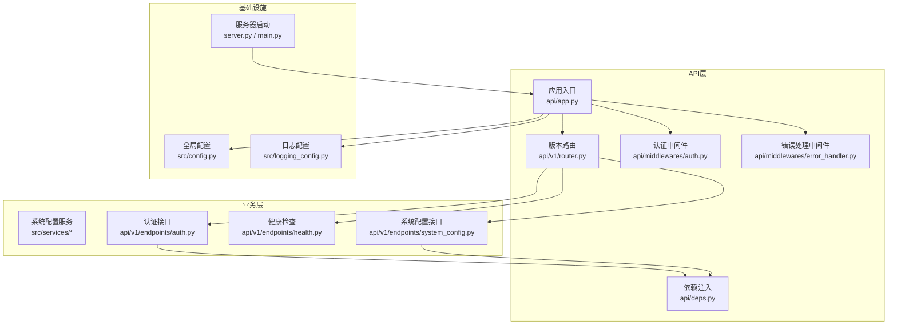
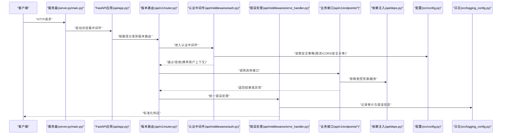
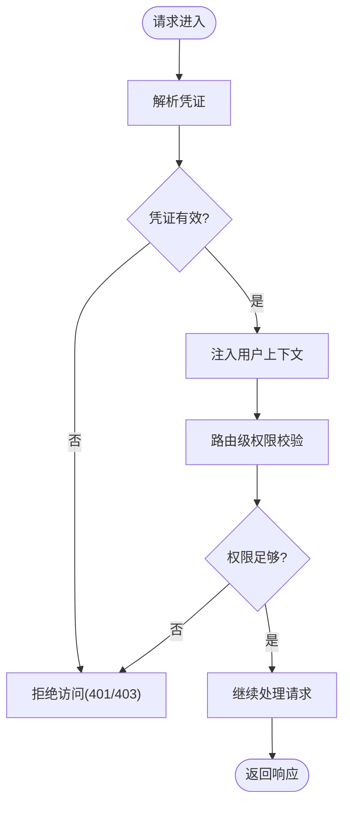
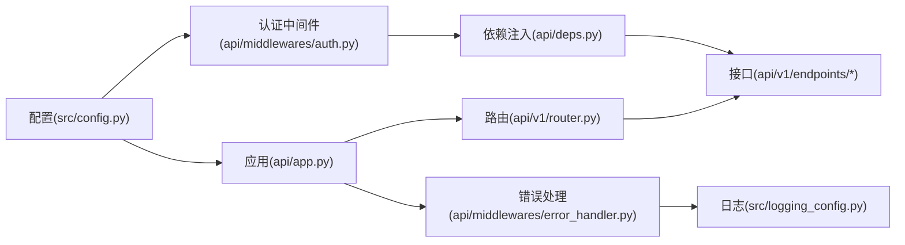

# API安全防护

<cite>
**本文引用的文件**   
- [api/app.py](file://api/app.py)
- [api/deps.py](file://api/deps.py)
- [api/middlewares/auth.py](file://api/middlewares/auth.py)
- [api/middlewares/error_handler.py](file://api/middlewares/error_handler.py)
- [api/v1/router.py](file://api/v1/router.py)
- [api/v1/endpoints/health.py](file://api/v1/endpoints/health.py)
- [api/v1/endpoints/auth.py](file://api/v1/endpoints/auth.py)
- [api/v1/endpoints/system_config.py](file://api/v1/endpoints/system_config.py)
- [src/config.py](file://src/config.py)
- [src/logging_config.py](file://src/logging_config.py)
- [server.py](file://server.py)
- [main.py](file://main.py)
</cite>

## 目录
1. [简介](#简介)
2. [项目结构](#项目结构)
3. [核心组件](#核心组件)
4. [架构总览](#架构总览)
5. [详细组件分析](#详细组件分析)
6. [依赖关系分析](#依赖关系分析)
7. [性能考量](#性能考量)
8. [故障排查指南](#故障排查指南)
9. [结论](#结论)
10. [附录](#附录)

## 简介
本文件面向Daily Stock Analysis项目的API安全防护，围绕访问控制、审计与日志、速率限制、IP白名单/黑名单（含动态管理与地理限制）、敏感操作保护、API版本控制与兼容性管理，以及安全配置（CORS、HTTPS强制、安全头）进行系统化说明。文档以代码级分析为基础，辅以架构图与流程图，帮助读者快速理解并落地实施。

## 项目结构
本项目采用分层与模块化组织：
- API层：FastAPI应用入口、路由注册、中间件、依赖注入
- 业务服务层：领域服务、仓储、工具库
- 配置与基础设施：全局配置、日志、服务器启动脚本
- Web前端与桌面端：与API交互的客户端实现

图表来源
- [api/app.py](file://api/app.py)
- [api/v1/router.py](file://api/v1/router.py)
- [api/middlewares/auth.py](file://api/middlewares/auth.py)
- [api/middlewares/error_handler.py](file://api/middlewares/error_handler.py)
- [api/deps.py](file://api/deps.py)
- [api/v1/endpoints/auth.py](file://api/v1/endpoints/auth.py)
- [api/v1/endpoints/health.py](file://api/v1/endpoints/health.py)
- [api/v1/endpoints/system_config.py](file://api/v1/endpoints/system_config.py)
- [src/config.py](file://src/config.py)
- [src/logging_config.py](file://src/logging_config.py)
- [server.py](file://server.py)
- [main.py](file://main.py)

章节来源
- [api/app.py](file://api/app.py)
- [api/v1/router.py](file://api/v1/router.py)
- [api/middlewares/auth.py](file://api/middlewares/auth.py)
- [api/middlewares/error_handler.py](file://api/middlewares/error_handler.py)
- [api/deps.py](file://api/deps.py)
- [api/v1/endpoints/auth.py](file://api/v1/endpoints/auth.py)
- [api/v1/endpoints/health.py](file://api/v1/endpoints/health.py)
- [api/v1/endpoints/system_config.py](file://api/v1/endpoints/system_config.py)
- [src/config.py](file://src/config.py)
- [src/logging_config.py](file://src/logging_config.py)
- [server.py](file://server.py)
- [main.py](file://main.py)

## 核心组件
- 应用入口与中间件：统一挂载认证、错误处理、请求/响应拦截点
- 版本路由：按v1等前缀隔离接口，便于版本演进与兼容
- 认证与鉴权：基于令牌或会话的访问控制，结合依赖注入在路由层校验权限
- 系统配置：集中管理安全策略（如限流阈值、CORS、安全头等）
- 日志与审计：结构化日志记录关键事件，支撑审计与排障

章节来源
- [api/app.py](file://api/app.py)
- [api/v1/router.py](file://api/v1/router.py)
- [api/middlewares/auth.py](file://api/middlewares/auth.py)
- [api/middlewares/error_handler.py](file://api/middlewares/error_handler.py)
- [api/deps.py](file://api/deps.py)
- [src/config.py](file://src/config.py)
- [src/logging_config.py](file://src/logging_config.py)

## 架构总览
下图展示从请求进入至返回的整体流程，涵盖认证、鉴权、限流、审计与安全头设置的关键节点。

图表来源
- [server.py](file://server.py)
- [main.py](file://main.py)
- [api/app.py](file://api/app.py)
- [api/v1/router.py](file://api/v1/router.py)
- [api/middlewares/auth.py](file://api/middlewares/auth.py)
- [api/middlewares/error_handler.py](file://api/middlewares/error_handler.py)
- [api/deps.py](file://api/deps.py)
- [src/config.py](file://src/config.py)
- [src/logging_config.py](file://src/logging_config.py)

## 详细组件分析

### 访问控制与权限验证
- 认证中间件负责解析凭证（如令牌/会话），校验有效性并注入用户上下文
- 依赖注入在路由层按需校验角色/权限，确保最小权限原则
- 健康检查等公开接口可绕过认证，其他接口默认需鉴权

图表来源
- [api/middlewares/auth.py](file://api/middlewares/auth.py)
- [api/deps.py](file://api/deps.py)
- [api/v1/router.py](file://api/v1/router.py)

章节来源
- [api/middlewares/auth.py](file://api/middlewares/auth.py)
- [api/deps.py](file://api/deps.py)
- [api/v1/router.py](file://api/v1/router.py)

### 操作审计与访问日志记录
- 通过中间件与错误处理器统一捕获请求/响应、异常与审计事件
- 日志配置支持结构化输出，便于接入SIEM或日志平台
- 建议对敏感操作（配置变更、数据导出）进行额外审计标记

章节来源
- [api/middlewares/error_handler.py](file://api/middlewares/error_handler.py)
- [src/logging_config.py](file://src/logging_config.py)

### 速率限制机制
- 全局限流：针对整体QPS/并发进行限制，防止资源耗尽
- 用户级限流：基于用户标识（如令牌子ID）限制请求频率
- 接口级限流：对高成本接口单独限速，保障稳定性
- 推荐策略：滑动窗口或令牌桶；超限返回标准错误码并记录审计

章节来源
- [src/config.py](file://src/config.py)
- [api/middlewares/auth.py](file://api/middlewares/auth.py)

### IP白名单与黑名单
- 白名单：允许特定IP段直接访问（如内网管理面）
- 黑名单：阻断已知恶意IP或高频异常来源
- 动态管理：支持运行时更新列表，结合威胁情报与行为分析
- 地理限制：依据IP地理位置策略放行或拒绝

章节来源
- [api/middlewares/auth.py](file://api/middlewares/auth.py)
- [src/config.py](file://src/config.py)

### 敏感操作保护
- 二次验证：对高危操作要求重新认证（如密码/OTP）
- 操作确认：前端二次确认+后端幂等键防重放
- 审批流程：关键变更需审批链路与审计留痕

章节来源
- [api/v1/endpoints/system_config.py](file://api/v1/endpoints/system_config.py)
- [api/deps.py](file://api/deps.py)

### API版本控制与兼容性管理
- 版本路由：使用/api/v1等前缀隔离不同版本
- 废弃接口：保留过渡期并返回弃用提示，提供迁移指引
- 兼容性矩阵：明确字段增删规则与向后兼容策略

章节来源
- [api/v1/router.py](file://api/v1/router.py)

### 安全配置指南
- CORS：仅允许可信域名与方法，严格限定头部
- HTTPS强制：生产环境启用TLS，禁用不安全协议
- 安全头：启用HSTS、X-Frame-Options、Content-Security-Policy等

章节来源
- [src/config.py](file://src/config.py)
- [api/app.py](file://api/app.py)

## 依赖关系分析
- 中间件依赖配置模块获取安全策略
- 路由依赖依赖注入模块获取受控资源
- 错误处理与日志配置贯穿全链路

图表来源
- [src/config.py](file://src/config.py)
- [api/app.py](file://api/app.py)
- [api/middlewares/auth.py](file://api/middlewares/auth.py)
- [api/middlewares/error_handler.py](file://api/middlewares/error_handler.py)
- [api/deps.py](file://api/deps.py)
- [api/v1/router.py](file://api/v1/router.py)
- [src/logging_config.py](file://src/logging_config.py)

章节来源
- [src/config.py](file://src/config.py)
- [api/app.py](file://api/app.py)
- [api/middlewares/auth.py](file://api/middlewares/auth.py)
- [api/middlewares/error_handler.py](file://api/middlewares/error_handler.py)
- [api/deps.py](file://api/deps.py)
- [api/v1/router.py](file://api/v1/router.py)
- [src/logging_config.py](file://src/logging_config.py)

## 性能考量
- 限流算法选择：滑动窗口内存占用低但精度略逊，令牌桶更平滑
- 缓存热点：对只读接口引入缓存，降低数据库压力
- 异步化：I/O密集型任务异步执行，提升吞吐
- 连接池：外部数据源连接复用，避免频繁握手

[本节为通用指导，不直接分析具体文件]

## 故障排查指南
- 认证失败：检查令牌格式、有效期、签名与密钥配置
- 限流触发：查看限流计数与阈值，确认是否被误判
- 跨域问题：核对CORS白名单与方法/头部设置
- 日志定位：通过结构化日志关键字检索请求轨迹与异常堆栈

章节来源
- [api/middlewares/error_handler.py](file://api/middlewares/error_handler.py)
- [src/logging_config.py](file://src/logging_config.py)

## 结论
通过统一的认证鉴权、严格的限流策略、完善的IP治理与审计日志，以及规范的版本管理与安全配置，Daily Stock Analysis API能够在保证可用性的同时显著提升安全性与可运维性。建议在生产环境持续监控与演练，确保策略随威胁态势演进。

[本节为总结性内容，不直接分析具体文件]

## 附录
- 健康检查接口示例：用于探针与负载均衡健康探测
- 系统配置接口示例：用于动态调整安全策略与功能开关

章节来源
- [api/v1/endpoints/health.py](file://api/v1/endpoints/health.py)
- [api/v1/endpoints/system_config.py](file://api/v1/endpoints/system_config.py)