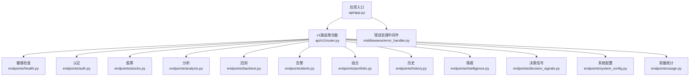
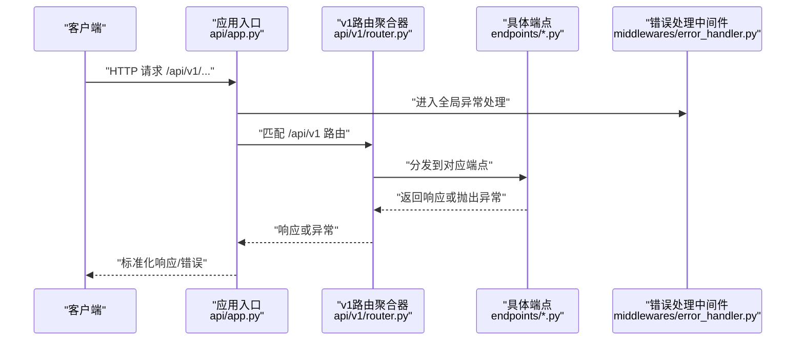
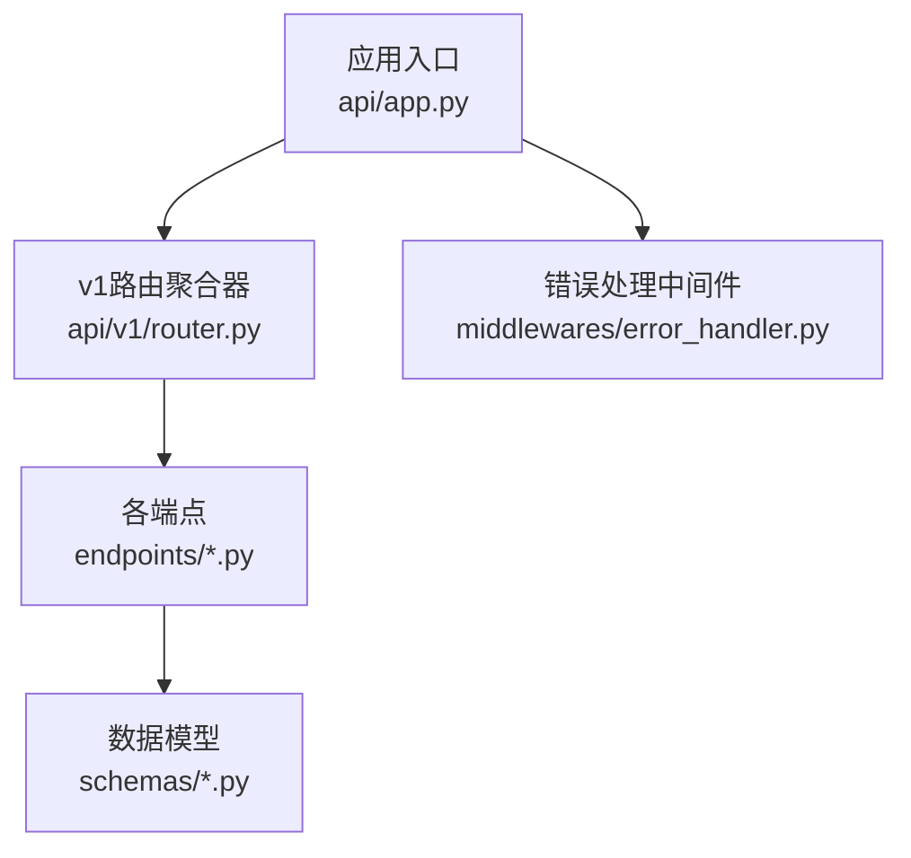

# API版本控制

<cite>
**本文引用的文件**   
- [api/app.py](file://api/app.py)
- [api/v1/router.py](file://api/v1/router.py)
- [api/middlewares/error_handler.py](file://api/middlewares/error_handler.py)
- [api/v1/endpoints/health.py](file://api/v1/endpoints/health.py)
- [api/v1/endpoints/auth.py](file://api/v1/endpoints/auth.py)
- [api/v1/endpoints/stocks.py](file://api/v1/endpoints/stocks.py)
- [api/v1/endpoints/analysis.py](file://api/v1/endpoints/analysis.py)
- [api/v1/endpoints/backtest.py](file://api/v1/endpoints/backtest.py)
- [api/v1/endpoints/alerts.py](file://api/v1/endpoints/alerts.py)
- [api/v1/endpoints/portfolio.py](file://api/v1/endpoints/portfolio.py)
- [api/v1/endpoints/history.py](file://api/v1/endpoints/history.py)
- [api/v1/endpoints/intelligence.py](file://api/v1/endpoints/intelligence.py)
- [api/v1/endpoints/decision_signals.py](file://api/v1/endpoints/decision_signals.py)
- [api/v1/endpoints/system_config.py](file://api/v1/endpoints/system_config.py)
- [api/v1/endpoints/usage.py](file://api/v1/endpoints/usage.py)
- [api/v1/schemas/common.py](file://api/v1/schemas/common.py)
- [tests/test_api_health.py](file://tests/test_api_health.py)
- [tests/test_auth_api.py](file://tests/test_auth_api.py)
- [tests/test_analysis_api_contract.py](file://tests/test_analysis_api_contract.py)
- [tests/test_alert_api.py](file://tests/test_alert_api.py)
- [tests/test_portfolio_api.py](file://tests/test_portfolio_api.py)
- [tests/test_system_config_api.py](file://tests/test_system_config_api.py)
- [tests/test_usage_api.py](file://tests/test_usage_api.py)
</cite>

## 目录
1. [简介](#简介)
2. [项目结构](#项目结构)
3. [核心组件](#核心组件)
4. [架构总览](#架构总览)
5. [详细组件分析](#详细组件分析)
6. [依赖分析](#依赖分析)
7. [性能考虑](#性能考虑)
8. [故障排查指南](#故障排查指南)
9. [结论](#结论)
10. [附录](#附录)

## 简介
本文件面向Daily Stock Analysis项目的API版本控制，重点说明：
- URL路径版本控制策略（如/api/v1/、/api/v2/）
- 请求头版本协商机制（Accept-Version）与向后兼容处理
- 废弃接口的处理策略（弃用警告、迁移提示、最终移除计划）
- 版本间变更管理（破坏性变更评估与影响分析）
- 版本迁移最佳实践与工具支持
- 版本兼容性测试策略与自动化检查

当前仓库已实现v1版本的URL路由与基础中间件。v2尚未在代码中暴露，但本文提供可落地的演进方案与实施建议，确保从v1平滑过渡到v2。

## 项目结构
API相关代码集中在api目录下，采用“按版本+端点”的模块化组织方式：
- api/app.py：应用入口与全局配置（含CORS、异常处理等）
- api/v1/router.py：v1版本的路由聚合器
- api/v1/endpoints/*：各业务域端点（健康检查、认证、股票、分析、回测、告警、组合、历史、情报、决策信号、系统配置、用量统计等）
- api/v1/schemas/*：Pydantic数据模型定义
- api/middlewares/*：通用中间件（鉴权、错误处理等）

图表来源
- [api/app.py:1-200](file://api/app.py#L1-L200)
- [api/v1/router.py:1-200](file://api/v1/router.py#L1-L200)
- [api/middlewares/error_handler.py:1-200](file://api/middlewares/error_handler.py#L1-L200)

章节来源
- [api/app.py:1-200](file://api/app.py#L1-L200)
- [api/v1/router.py:1-200](file://api/v1/router.py#L1-L200)

## 核心组件
- 应用入口（api/app.py）
  - 负责创建FastAPI应用实例、注册全局中间件、挂载版本路由、设置CORS与异常处理器
  - 作为所有HTTP请求的统一入口，统一错误响应格式与跨域策略
- v1路由聚合器（api/v1/router.py）
  - 聚合v1各业务端点，形成/api/v1/*命名空间
  - 便于后续新增v2路由并并行运行
- 错误处理中间件（api/middlewares/error_handler.py）
  - 统一捕获异常、标准化错误响应体、记录日志
  - 为版本协商与弃用提示提供扩展点

章节来源
- [api/app.py:1-200](file://api/app.py#L1-L200)
- [api/v1/router.py:1-200](file://api/v1/router.py#L1-L200)
- [api/middlewares/error_handler.py:1-200](file://api/middlewares/error_handler.py#L1-L200)

## 架构总览
下图展示请求从入口到版本路由再到具体端点的调用链，以及错误处理的介入点。

图表来源
- [api/app.py:1-200](file://api/app.py#L1-L200)
- [api/v1/router.py:1-200](file://api/v1/router.py#L1-L200)
- [api/middlewares/error_handler.py:1-200](file://api/middlewares/error_handler.py#L1-L200)

## 详细组件分析

### URL路径版本控制策略（/api/v1/、/api/v2/）
- 现状
  - 当前仅暴露/api/v1/*路由，通过v1路由聚合器集中挂载
  - 每个业务域以独立模块划分，便于扩展与维护
- 建议
  - 新增/api/v2/*路由时，保持与v1一致的端点结构与命名规范
  - 使用独立的router聚合器（如api/v2/router.py），避免与v1耦合
  - 在应用入口同时挂载v1与v2路由，实现双版本并行

章节来源
- [api/v1/router.py:1-200](file://api/v1/router.py#L1-L200)
- [api/app.py:1-200](file://api/app.py#L1-L200)

### 请求头版本协商机制（Accept-Version）与向后兼容
- 目标
  - 在不改变URL的前提下，通过Accept-Version头部进行版本协商
  - 对不兼容的请求返回明确错误，对兼容请求返回期望版本响应
- 建议实现要点
  - 在错误处理中间件中解析Accept-Version，若缺失则默认v1
  - 当请求指定v2而服务端未实现时，返回406 Not Acceptable，并在响应体中包含可用版本列表
  - 对v1请求保持向后兼容，即使新增字段也不破坏现有客户端

章节来源
- [api/middlewares/error_handler.py:1-200](file://api/middlewares/error_handler.py#L1-L200)
- [api/app.py:1-200](file://api/app.py#L1-L200)

### 废弃接口处理策略（弃用警告、迁移提示、最终移除）
- 目标
  - 对即将废弃的端点发出清晰警告，引导客户端迁移至新版本
  - 提供明确的弃用时间表与迁移指引
- 建议实现要点
  - 在端点层添加弃用标记（如注释或装饰器），在响应头中加入Deprecation与Sunset
  - 在错误处理中间件中统一注入弃用信息，包含迁移文档链接与替代端点
  - 定期扫描被弃用端点的调用量，达到阈值后通知相关团队推进迁移

章节来源
- [api/middlewares/error_handler.py:1-200](file://api/middlewares/error_handler.py#L1-L200)
- [api/v1/endpoints/*.py:1-200](file://api/v1/endpoints/health.py#L1-L200)

### 版本间变更管理（破坏性变更评估与影响分析）
- 目标
  - 识别破坏性变更（如字段重命名、类型变更、必填项调整）
  - 评估对下游客户端的影响范围，制定灰度发布与回滚策略
- 建议流程
  - 在PR模板中增加“API变更影响分析”章节，要求提交者填写受影响端点、变更类型、兼容策略
  - 使用OpenAPI/Swagger生成契约文档，对比v1与v2的差异，自动检测破坏性变更
  - 在CI中集成契约校验，阻止破坏性变更合并

章节来源
- [api/v1/schemas/common.py:1-200](file://api/v1/schemas/common.py#L1-L200)
- [api/app.py:1-200](file://api/app.py#L1-L200)

### 版本迁移最佳实践与工具支持
- 最佳实践
  - 优先采用非破坏性变更（新增可选字段、新增端点）
  - 对破坏性变更提供至少两个大版本的过渡期
  - 在客户端侧实现版本探测与降级逻辑
- 工具支持
  - 使用OpenAPI生成客户端SDK，辅助多语言适配
  - 使用契约测试框架（如Pact）验证v1与v2的兼容性
  - 使用API网关进行流量染色与灰度发布

章节来源
- [api/v1/schemas/common.py:1-200](file://api/v1/schemas/common.py#L1-L200)

### 版本兼容性测试策略与自动化检查
- 测试策略
  - 单元测试：覆盖各端点的输入输出契约
  - 集成测试：模拟真实HTTP请求，验证路由与中间件行为
  - 契约测试：确保v1与v2的响应结构一致或兼容
- 自动化检查
  - CI流水线中执行API契约校验与兼容性测试
  - 对弃用端点进行监控与告警

章节来源
- [tests/test_api_health.py:1-200](file://tests/test_api_health.py#L1-L200)
- [tests/test_auth_api.py:1-200](file://tests/test_auth_api.py#L1-L200)
- [tests/test_analysis_api_contract.py:1-200](file://tests/test_analysis_api_contract.py#L1-L200)
- [tests/test_alert_api.py:1-200](file://tests/test_alert_api.py#L1-L200)
- [tests/test_portfolio_api.py:1-200](file://tests/test_portfolio_api.py#L1-L200)
- [tests/test_system_config_api.py:1-200](file://tests/test_system_config_api.py#L1-L200)
- [tests/test_usage_api.py:1-200](file://tests/test_usage_api.py#L1-L200)

## 依赖分析
- 组件内聚与耦合
  - v1路由聚合器与各端点低耦合，便于独立演进
  - 错误处理中间件与所有端点高内聚，统一异常处理
- 外部依赖
  - FastAPI框架用于路由与中间件
  - Pydantic用于数据模型校验
- 潜在循环依赖
  - 当前结构清晰，未发现循环导入风险

图表来源
- [api/app.py:1-200](file://api/app.py#L1-L200)
- [api/v1/router.py:1-200](file://api/v1/router.py#L1-L200)
- [api/middlewares/error_handler.py:1-200](file://api/middlewares/error_handler.py#L1-L200)
- [api/v1/schemas/common.py:1-200](file://api/v1/schemas/common.py#L1-L200)

章节来源
- [api/app.py:1-200](file://api/app.py#L1-L200)
- [api/v1/router.py:1-200](file://api/v1/router.py#L1-L200)
- [api/middlewares/error_handler.py:1-200](file://api/middlewares/error_handler.py#L1-L200)
- [api/v1/schemas/common.py:1-200](file://api/v1/schemas/common.py#L1-L200)

## 性能考虑
- 路由匹配开销：v1与v2并行时，路由数量增加可能带来轻微匹配开销，可通过路由分组优化
- 中间件链长度：错误处理与鉴权中间件应尽可能轻量，避免阻塞主链路
- 响应序列化：Pydantic模型校验与序列化需关注大数据集场景下的性能

[本节为通用指导，无需特定文件引用]

## 故障排查指南
- 常见问题
  - 404 Not Found：检查路由是否正确挂载，v1/v2路径是否匹配
  - 406 Not Acceptable：检查Accept-Version头部是否支持
  - 500 Internal Server Error：查看错误处理中间件的日志与堆栈
- 排查步骤
  - 启用调试模式，打印请求与响应详情
  - 检查中间件顺序，确认异常未被提前捕获
  - 使用API文档工具验证端点契约

章节来源
- [api/middlewares/error_handler.py:1-200](file://api/middlewares/error_handler.py#L1-L200)
- [api/app.py:1-200](file://api/app.py#L1-L200)

## 结论
本项目已具备清晰的v1版本化架构基础，建议逐步引入Accept-Version协商、弃用标识与契约测试，为v2的平滑演进奠定基础。通过严格的变更管理与自动化检查，可有效降低破坏性变更带来的风险。

[本节为总结性内容，无需特定文件引用]

## 附录
- 示例端点参考
  - 健康检查：[api/v1/endpoints/health.py:1-200](file://api/v1/endpoints/health.py#L1-L200)
  - 认证：[api/v1/endpoints/auth.py:1-200](file://api/v1/endpoints/auth.py#L1-L200)
  - 股票：[api/v1/endpoints/stocks.py:1-200](file://api/v1/endpoints/stocks.py#L1-L200)
  - 分析：[api/v1/endpoints/analysis.py:1-200](file://api/v1/endpoints/analysis.py#L1-L200)
  - 回测：[api/v1/endpoints/backtest.py:1-200](file://api/v1/endpoints/backtest.py#L1-L200)
  - 告警：[api/v1/endpoints/alerts.py:1-200](file://api/v1/endpoints/alerts.py#L1-L200)
  - 组合：[api/v1/endpoints/portfolio.py:1-200](file://api/v1/endpoints/portfolio.py#L1-L200)
  - 历史：[api/v1/endpoints/history.py:1-200](file://api/v1/endpoints/history.py#L1-L200)
  - 情报：[api/v1/endpoints/intelligence.py:1-200](file://api/v1/endpoints/intelligence.py#L1-L200)
  - 决策信号：[api/v1/endpoints/decision_signals.py:1-200](file://api/v1/endpoints/decision_signals.py#L1-L200)
  - 系统配置：[api/v1/endpoints/system_config.py:1-200](file://api/v1/endpoints/system_config.py#L1-L200)
  - 用量统计：[api/v1/endpoints/usage.py:1-200](file://api/v1/endpoints/usage.py#L1-L200)

章节来源
- [api/v1/endpoints/health.py:1-200](file://api/v1/endpoints/health.py#L1-L200)
- [api/v1/endpoints/auth.py:1-200](file://api/v1/endpoints/auth.py#L1-L200)
- [api/v1/endpoints/stocks.py:1-200](file://api/v1/endpoints/stocks.py#L1-L200)
- [api/v1/endpoints/analysis.py:1-200](file://api/v1/endpoints/analysis.py#L1-L200)
- [api/v1/endpoints/backtest.py:1-200](file://api/v1/endpoints/backtest.py#L1-L200)
- [api/v1/endpoints/alerts.py:1-200](file://api/v1/endpoints/alerts.py#L1-L200)
- [api/v1/endpoints/portfolio.py:1-200](file://api/v1/endpoints/portfolio.py#L1-L200)
- [api/v1/endpoints/history.py:1-200](file://api/v1/endpoints/history.py#L1-L200)
- [api/v1/endpoints/intelligence.py:1-200](file://api/v1/endpoints/intelligence.py#L1-L200)
- [api/v1/endpoints/decision_signals.py:1-200](file://api/v1/endpoints/decision_signals.py#L1-L200)
- [api/v1/endpoints/system_config.py:1-200](file://api/v1/endpoints/system_config.py#L1-L200)
- [api/v1/endpoints/usage.py:1-200](file://api/v1/endpoints/usage.py#L1-L200)