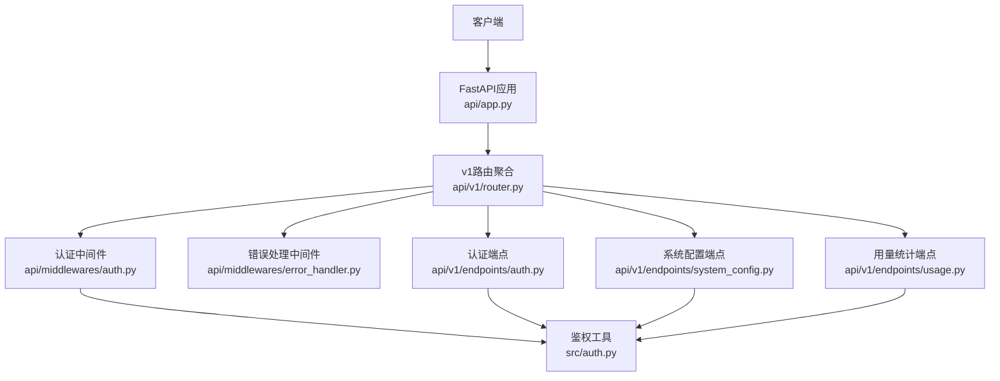
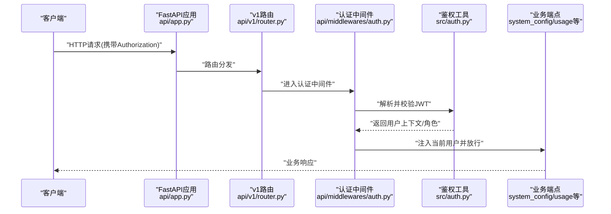
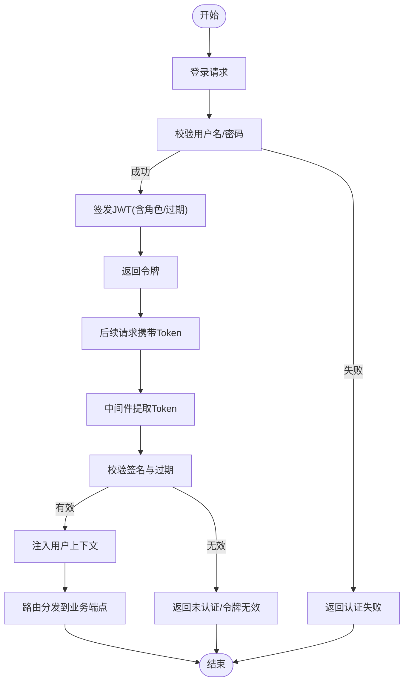
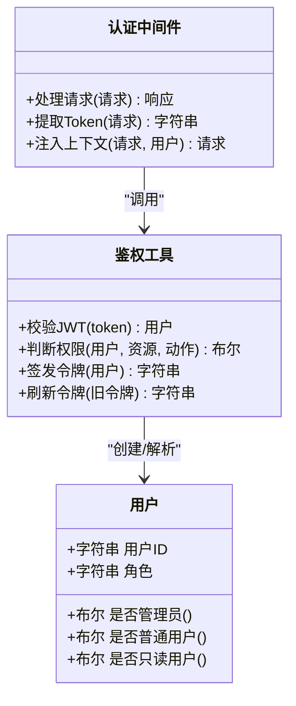
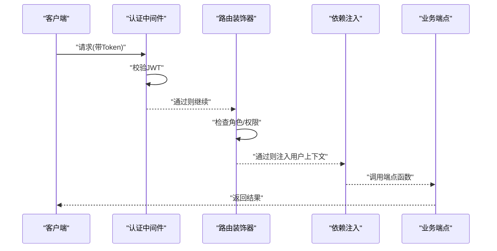
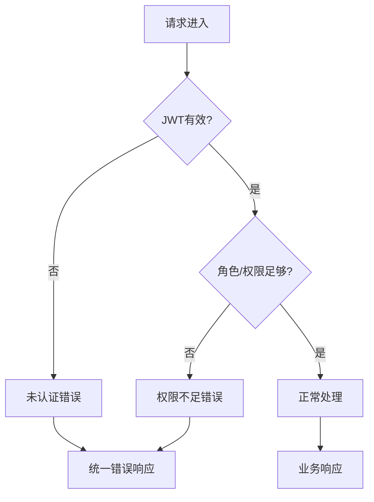
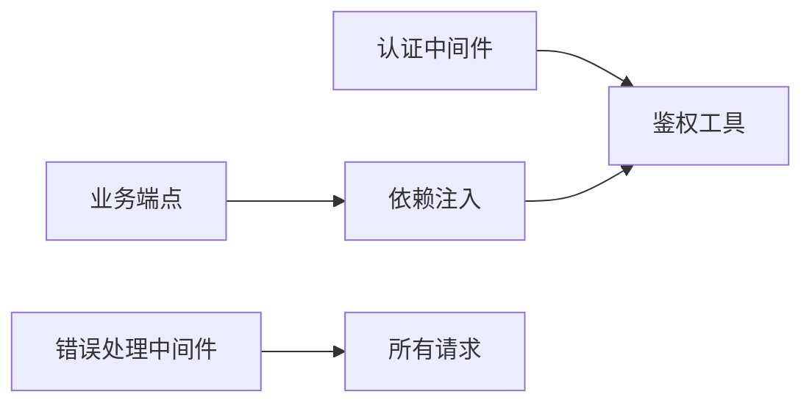

# API访问控制

<cite>
**本文引用的文件**
- [api/app.py](file://api/app.py)
- [api/v1/router.py](file://api/v1/router.py)
- [api/middlewares/auth.py](file://api/middlewares/auth.py)
- [api/middlewares/error_handler.py](file://api/middlewares/error_handler.py)
- [api/v1/endpoints/auth.py](file://api/v1/endpoints/auth.py)
- [src/auth.py](file://src/auth.py)
- [api/deps.py](file://api/deps.py)
- [api/v1/endpoints/system_config.py](file://api/v1/endpoints/system_config.py)
- [api/v1/endpoints/usage.py](file://api/v1/endpoints/usage.py)
</cite>

## 目录
1. [简介](#简介)
2. [项目结构](#项目结构)
3. [核心组件](#核心组件)
4. [架构总览](#架构总览)
5. [详细组件分析](#详细组件分析)
6. [依赖关系分析](#依赖关系分析)
7. [性能考虑](#性能考虑)
8. [故障排查指南](#故障排查指南)
9. [结论](#结论)
10. [附录](#附录)

## 简介
本文件面向Daily Stock Analysis API的访问控制，聚焦以下目标：
- JWT令牌验证机制：生成、校验与刷新流程
- 用户角色与权限系统：管理员、普通用户、只读用户的差异
- 接口级访问控制：路由装饰器与中间件实现
- 会话管理与状态保持
- 认证失败的错误处理与响应格式
- 自定义权限检查逻辑的实现示例

## 项目结构
API访问控制相关代码主要分布在以下位置：
- 应用入口与路由注册：api/app.py、api/v1/router.py
- 认证中间件与错误处理：api/middlewares/auth.py、api/middlewares/error_handler.py
- 认证端点（登录、登出、刷新等）：api/v1/endpoints/auth.py
- 通用鉴权工具与配置：src/auth.py
- FastAPI依赖注入：api/deps.py
- 受保护的业务端点示例：api/v1/endpoints/system_config.py、api/v1/endpoints/usage.py

图表来源
- [api/app.py](file://api/app.py)
- [api/v1/router.py](file://api/v1/router.py)
- [api/middlewares/auth.py](file://api/middlewares/auth.py)
- [api/middlewares/error_handler.py](file://api/middlewares/error_handler.py)
- [api/v1/endpoints/auth.py](file://api/v1/endpoints/auth.py)
- [src/auth.py](file://src/auth.py)
- [api/v1/endpoints/system_config.py](file://api/v1/endpoints/system_config.py)
- [api/v1/endpoints/usage.py](file://api/v1/endpoints/usage.py)

章节来源
- [api/app.py](file://api/app.py)
- [api/v1/router.py](file://api/v1/router.py)

## 核心组件
- 认证中间件：负责从请求中提取JWT、校验签名与过期时间、解析用户上下文并注入到请求中。
- 鉴权工具：提供JWT签发、解码、刷新策略以及角色/权限判断能力。
- 认证端点：提供登录、获取当前用户信息、刷新令牌等接口。
- 错误处理中间件：统一捕获认证失败、授权失败等异常，返回标准错误响应。
- 依赖注入：在业务端点中通过依赖注入获取已认证的当前用户及权限上下文。

章节来源
- [api/middlewares/auth.py](file://api/middlewares/auth.py)
- [src/auth.py](file://src/auth.py)
- [api/v1/endpoints/auth.py](file://api/v1/endpoints/auth.py)
- [api/middlewares/error_handler.py](file://api/middlewares/error_handler.py)
- [api/deps.py](file://api/deps.py)

## 架构总览
下图展示了从客户端发起请求到鉴权、授权再到业务处理的完整流程。

图表来源
- [api/app.py](file://api/app.py)
- [api/v1/router.py](file://api/v1/router.py)
- [api/middlewares/auth.py](file://api/middlewares/auth.py)
- [src/auth.py](file://src/auth.py)
- [api/v1/endpoints/system_config.py](file://api/v1/endpoints/system_config.py)
- [api/v1/endpoints/usage.py](file://api/v1/endpoints/usage.py)

## 详细组件分析

### JWT令牌生命周期（生成、校验、刷新）
- 生成：认证端点在成功登录后调用鉴权工具签发JWT，包含用户标识、角色、过期时间等信息。
- 校验：认证中间件拦截请求，提取Authorization头中的Bearer Token，交由鉴权工具进行签名与有效期校验，并将用户上下文注入到请求。
- 刷新：提供刷新接口，使用旧令牌换取新令牌，支持短效访问令牌与长效刷新令牌的组合策略。

图表来源
- [api/v1/endpoints/auth.py](file://api/v1/endpoints/auth.py)
- [api/middlewares/auth.py](file://api/middlewares/auth.py)
- [src/auth.py](file://src/auth.py)

章节来源
- [api/v1/endpoints/auth.py](file://api/v1/endpoints/auth.py)
- [api/middlewares/auth.py](file://api/middlewares/auth.py)
- [src/auth.py](file://src/auth.py)

### 用户角色与权限系统
- 角色定义：管理员、普通用户、只读用户。不同角色具备不同的资源访问范围与操作权限。
- 权限判断：在鉴权工具中基于用户角色进行细粒度判断，例如是否允许修改系统配置、查看用量详情等。
- 接口级控制：在路由层或端点内通过装饰器/依赖注入对特定接口施加角色限制。

图表来源
- [src/auth.py](file://src/auth.py)
- [api/middlewares/auth.py](file://api/middlewares/auth.py)

章节来源
- [src/auth.py](file://src/auth.py)
- [api/middlewares/auth.py](file://api/middlewares/auth.py)

### 接口级访问控制（路由装饰器与中间件）
- 中间件：全局拦截所有请求，完成JWT校验与用户上下文注入。
- 路由装饰器：针对敏感接口（如系统配置、用量统计）增加角色白名单或黑名单。
- 依赖注入：在端点函数参数中声明需要当前用户或权限上下文，由框架自动注入。

图表来源
- [api/middlewares/auth.py](file://api/middlewares/auth.py)
- [api/v1/router.py](file://api/v1/router.py)
- [api/deps.py](file://api/deps.py)

章节来源
- [api/middlewares/auth.py](file://api/middlewares/auth.py)
- [api/v1/router.py](file://api/v1/router.py)
- [api/deps.py](file://api/deps.py)

### 会话管理与状态保持
- 无状态设计：采用JWT作为身份凭证，服务端不保存会话状态，提升可扩展性。
- 令牌存储：客户端应在安全存储中保存访问令牌与刷新令牌，并在请求头中携带。
- 刷新策略：支持短效访问令牌+长效刷新令牌，减少频繁登录与安全风险。

章节来源
- [src/auth.py](file://src/auth.py)
- [api/v1/endpoints/auth.py](file://api/v1/endpoints/auth.py)

### 认证失败的错误处理与响应格式
- 统一错误处理：错误处理中间件捕获认证失败、令牌无效、权限不足等异常，返回标准化JSON响应。
- 常见错误码：未认证、令牌过期、权限不足、内部错误等。
- 响应体：包含错误类型、消息、可选的错误码与追踪ID。

图表来源
- [api/middlewares/error_handler.py](file://api/middlewares/error_handler.py)
- [api/middlewares/auth.py](file://api/middlewares/auth.py)

章节来源
- [api/middlewares/error_handler.py](file://api/middlewares/error_handler.py)
- [api/middlewares/auth.py](file://api/middlewares/auth.py)

### 自定义权限检查逻辑示例
- 在端点内通过依赖注入获取当前用户与角色，然后执行自定义判断逻辑。
- 可结合资源ID、操作类型、数据归属等进行细粒度授权。
- 若权限不足，抛出统一异常以便错误处理中间件返回标准响应。

章节来源
- [api/deps.py](file://api/deps.py)
- [src/auth.py](file://src/auth.py)
- [api/v1/endpoints/system_config.py](file://api/v1/endpoints/system_config.py)
- [api/v1/endpoints/usage.py](file://api/v1/endpoints/usage.py)

## 依赖关系分析
- 认证中间件依赖鉴权工具进行JWT校验与用户上下文构建。
- 业务端点依赖依赖注入模块获取当前用户与权限上下文。
- 错误处理中间件为全局拦截器，确保一致的异常响应格式。

图表来源
- [api/middlewares/auth.py](file://api/middlewares/auth.py)
- [src/auth.py](file://src/auth.py)
- [api/deps.py](file://api/deps.py)
- [api/middlewares/error_handler.py](file://api/middlewares/error_handler.py)

章节来源
- [api/middlewares/auth.py](file://api/middlewares/auth.py)
- [src/auth.py](file://src/auth.py)
- [api/deps.py](file://api/deps.py)
- [api/middlewares/error_handler.py](file://api/middlewares/error_handler.py)

## 性能考虑
- JWT校验开销低，适合高并发场景；建议启用缓存避免重复计算。
- 刷新令牌应设置合理过期时间，平衡安全性与用户体验。
- 错误处理中间件应避免阻塞关键路径，尽量异步化日志记录。

[本节为通用指导，无需引用具体文件]

## 故障排查指南
- 常见问题：
  - 未携带或携带错误的Authorization头导致未认证。
  - 令牌过期或签名不一致导致令牌无效。
  - 角色不足导致权限不足。
- 排查步骤：
  - 检查客户端是否正确设置请求头。
  - 确认服务端JWT密钥与算法配置一致。
  - 查看错误处理中间件的响应体，定位错误类型。
  - 在认证中间件中打印用户上下文，确认解析结果。

章节来源
- [api/middlewares/error_handler.py](file://api/middlewares/error_handler.py)
- [api/middlewares/auth.py](file://api/middlewares/auth.py)

## 结论
Daily Stock Analysis API通过JWT无状态认证与中间件+装饰器的组合实现了灵活的接口级访问控制。配合统一的错误处理与依赖注入，既保证了安全性，也提升了可维护性与扩展性。建议在新增敏感接口时遵循角色白名单与最小权限原则，并完善测试用例覆盖认证与授权路径。

[本节为总结，无需引用具体文件]

## 附录
- 最佳实践：
  - 使用HTTPS传输，避免令牌泄露。
  - 将访问令牌设置为短时效，刷新令牌设置为长时效。
  - 对敏感操作增加二次确认或审计日志。
  - 定期轮换JWT密钥并监控异常登录行为。

[本节为通用指导，无需引用具体文件]