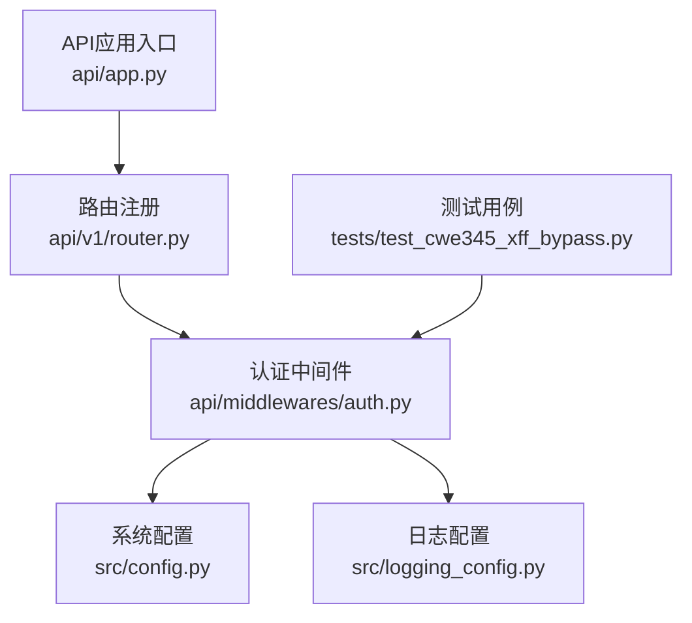
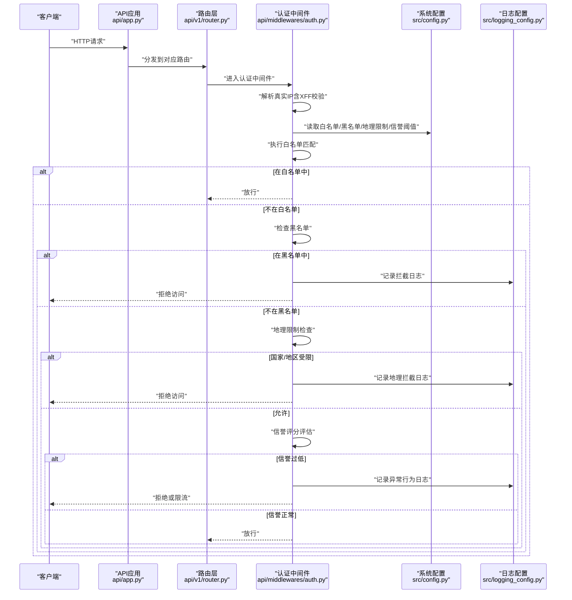
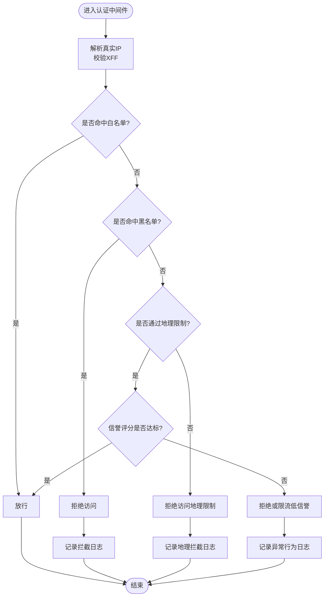
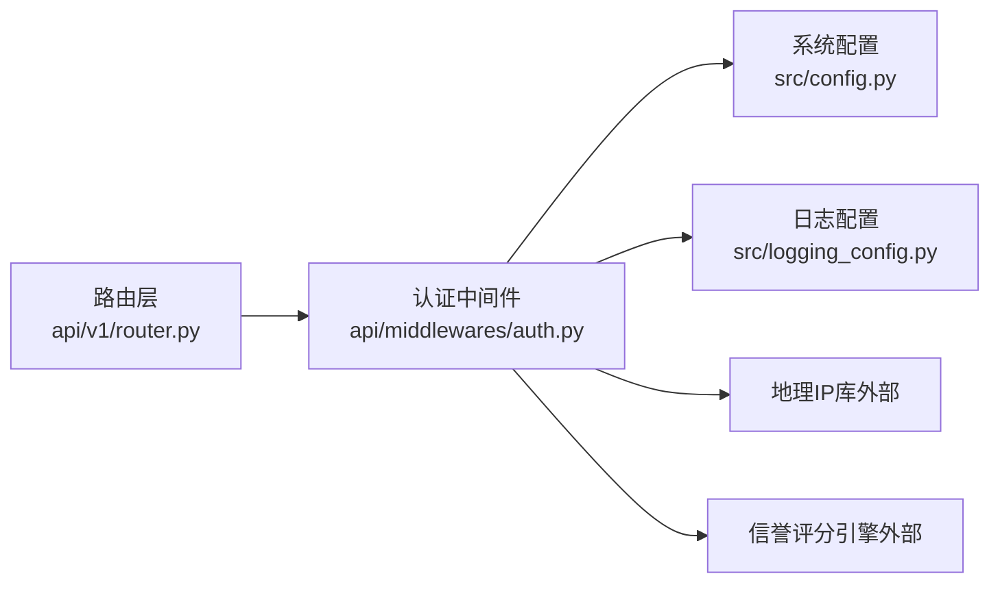

# IP地址管理

<cite>
**本文档引用的文件**   
- [api/app.py](file://api/app.py)
- [api/middlewares/auth.py](file://api/middlewares/auth.py)
- [api/v1/router.py](file://api/v1/router.py)
- [src/config.py](file://src/config.py)
- [src/logging_config.py](file://src/logging_config.py)
- [tests/test_cwe345_xff_bypass.py](file://tests/test_cwe345_xff_bypass.py)
</cite>

## 目录
1. [简介](#简介)
2. [项目结构](#项目结构)
3. [核心组件](#核心组件)
4. [架构总览](#架构总览)
5. [详细组件分析](#详细组件分析)
6. [依赖关系分析](#依赖关系分析)
7. [性能考虑](#性能考虑)
8. [故障排查指南](#故障排查指南)
9. [结论](#结论)
10. [附录](#附录)

## 简介
本文件面向Daily Stock Analysis API的IP地址管理能力，提供从白名单、黑名单、地理限制到信誉评分与审计日志的完整说明。文档涵盖静态配置、动态增删、恶意识别、自动防护、API接口与使用示例，以及日志记录与审计方法，帮助开发者快速集成并安全运维。

## 项目结构
与IP地址管理相关的代码主要分布在以下位置：
- API应用入口与路由注册
- 认证中间件（用于请求鉴权与访问控制）
- 系统配置模块（集中管理开关与策略参数）
- 日志配置（统一输出审计与访问日志）
- 测试用例（覆盖X-Forwarded-For绕过等边界场景）

**图表来源** 
- [api/app.py](file://api/app.py)
- [api/v1/router.py](file://api/v1/router.py)
- [api/middlewares/auth.py](file://api/middlewares/auth.py)
- [src/config.py](file://src/config.py)
- [src/logging_config.py](file://src/logging_config.py)
- [tests/test_cwe345_xff_bypass.py](file://tests/test_cwe345_xff_bypass.py)

**章节来源**
- [api/app.py](file://api/app.py)
- [api/v1/router.py](file://api/v1/router.py)
- [api/middlewares/auth.py](file://api/middlewares/auth.py)
- [src/config.py](file://src/config.py)
- [src/logging_config.py](file://src/logging_config.py)
- [tests/test_cwe345_xff_bypass.py](file://tests/test_cwe345_xff_bypass.py)

## 核心组件
- 认证中间件：负责提取客户端真实IP、校验白名单/黑名单、执行地理限制与信誉评分策略，并在必要时拦截请求。
- 系统配置：集中定义IP白名单、黑名单、地理限制、信誉阈值、审计开关等参数。
- 日志配置：统一输出访问与审计日志，便于追踪与合规审计。
- 路由层：将受保护的端点挂载至认证中间件链，确保所有敏感操作均经过IP检查。

**章节来源**
- [api/middlewares/auth.py](file://api/middlewares/auth.py)
- [src/config.py](file://src/config.py)
- [src/logging_config.py](file://src/logging_config.py)
- [api/v1/router.py](file://api/v1/router.py)

## 架构总览
下图展示了请求进入API后，IP地址管理的处理流程与关键组件交互。

**图表来源** 
- [api/app.py](file://api/app.py)
- [api/v1/router.py](file://api/v1/router.py)
- [api/middlewares/auth.py](file://api/middlewares/auth.py)
- [src/config.py](file://src/config.py)
- [src/logging_config.py](file://src/logging_config.py)

## 详细组件分析

### 认证中间件（IP地址管理核心）
- 功能要点
  - 真实IP解析：优先从可信代理头获取，并进行X-Forwarded-For（XFF）注入检测与清洗，防止伪造IP绕过。
  - 白名单机制：支持静态配置与动态增删；命中即放行。
  - 黑名单机制：命中即拒绝；支持自动识别与手动封禁。
  - 地理限制：基于国家/地区进行访问控制，可配置允许或拒绝列表。
  - 信誉评分：根据异常行为（如高频失败、扫描探测）计算分数，低于阈值时触发限流或拒绝。
  - 审计日志：对放行、拒绝、异常行为进行结构化记录，便于审计与告警。

- 数据流与决策顺序
  - 解析IP → 白名单匹配 → 黑名单匹配 → 地理限制 → 信誉评分 → 放行/拒绝

**图表来源** 
- [api/middlewares/auth.py](file://api/middlewares/auth.py)
- [src/config.py](file://src/config.py)
- [src/logging_config.py](file://src/logging_config.py)

**章节来源**
- [api/middlewares/auth.py](file://api/middlewares/auth.py)
- [src/config.py](file://src/config.py)
- [src/logging_config.py](file://src/logging_config.py)

### 系统配置（IP管理策略中心）
- 配置项建议
  - 白名单：静态IP/CIDR列表、动态添加开关、持久化存储路径。
  - 黑名单：静态IP/CIDR列表、自动识别阈值、手动封禁接口开关。
  - 地理限制：允许/拒绝的国家/地区列表、映射库版本。
  - 信誉评分：评分维度权重、阈值、冷却时间、限流策略。
  - 审计日志：输出目标（文件/外部系统）、保留周期、脱敏规则。

- 配置加载与热更新
  - 启动时加载默认配置，运行时支持热更新以即时生效。
  - 变更需触发缓存刷新与日志记录。

**章节来源**
- [src/config.py](file://src/config.py)

### 日志配置（审计与可观测性）
- 日志内容
  - 访问日志：请求时间、源IP、路由、状态码、耗时。
  - 审计日志：白名单/黑名单命中、地理限制结果、信誉评分变化、拦截原因。
- 输出方式
  - 本地文件、结构化JSON、外部日志平台（可选）。
- 安全与合规
  - 敏感字段脱敏、按策略轮转、最小化留存。

**章节来源**
- [src/logging_config.py](file://src/logging_config.py)

### 路由层（受保护端点挂载）
- 将需要IP控制的端点注册到认证中间件链，确保所有敏感操作均经过IP检查。
- 路由分组可按业务域划分，便于精细化权限与审计。

**章节来源**
- [api/v1/router.py](file://api/v1/router.py)

## 依赖关系分析
- 组件耦合
  - 认证中间件依赖系统配置与日志配置，不直接依赖具体存储实现（可通过接口抽象）。
  - 路由层仅负责分发，逻辑集中在中间件。
- 外部依赖
  - 地理IP库（国家/地区映射）、信誉评分引擎（可插件化）、日志后端（文件/外部系统）。
- 潜在风险
  - XFF注入绕过：需在中间件中严格校验与清洗。
  - 配置不一致：确保配置热更新与缓存一致性。

**图表来源** 
- [api/v1/router.py](file://api/v1/router.py)
- [api/middlewares/auth.py](file://api/middlewares/auth.py)
- [src/config.py](file://src/config.py)
- [src/logging_config.py](file://src/logging_config.py)

**章节来源**
- [api/v1/router.py](file://api/v1/router.py)
- [api/middlewares/auth.py](file://api/middlewares/auth.py)
- [src/config.py](file://src/config.py)
- [src/logging_config.py](file://src/logging_config.py)

## 性能考虑
- 缓存策略
  - 白名单/黑名单采用内存缓存，定期同步持久化存储。
  - 地理IP映射按国家/地区缓存，减少查询开销。
- 异步处理
  - 信誉评分与日志写入采用异步队列，避免阻塞主链路。
- 资源限制
  - 对低信誉IP实施限流，降低系统压力。
- 监控指标
  - 拦截率、平均延迟、缓存命中率、信誉评分分布。

[本节为通用指导，无需特定文件引用]

## 故障排查指南
- 常见问题
  - XFF绕过：确认中间件已启用XFF校验与清洗逻辑。
  - 配置未生效：检查热更新是否触发缓存刷新。
  - 地理限制误判：核对地理IP库版本与映射准确性。
  - 信誉评分误伤：调整阈值与权重，查看异常行为日志。
- 诊断步骤
  - 开启详细审计日志，定位拦截原因。
  - 验证白名单/黑名单命中情况。
  - 检查信誉评分输入特征与阈值。
- 参考测试用例
  - 针对XFF绕过的边界场景进行测试与回归。

**章节来源**
- [tests/test_cwe345_xff_bypass.py](file://tests/test_cwe345_xff_bypass.py)

## 结论
通过认证中间件、系统配置与日志配置的协同，Daily Stock Analysis API实现了完整的IP地址管理能力。静态与动态白名单、黑名单自动识别与手动封禁、地理限制与信誉评分共同构成纵深防御体系。配合完善的审计日志与监控指标，可有效保障API的安全性与可观测性。

[本节为总结性内容，无需特定文件引用]

## 附录

### API接口与使用示例（概念性说明）
- 白名单管理
  - 新增IP/CIDR：POST /api/v1/ip/whitelist
  - 删除IP/CIDR：DELETE /api/v1/ip/whitelist/{ip_or_cidr}
  - 查询白名单：GET /api/v1/ip/whitelist
- 黑名单管理
  - 新增IP/CIDR：POST /api/v1/ip/blacklist
  - 删除IP/CIDR：DELETE /api/v1/ip/blacklist/{ip_or_cidr}
  - 查询黑名单：GET /api/v1/ip/blacklist
- 地理限制
  - 设置允许/拒绝国家/地区：PUT /api/v1/ip/geoblock
  - 查询当前地理策略：GET /api/v1/ip/geoblock
- 信誉评分
  - 查看评分阈值与权重：GET /api/v1/ip/reputation/settings
  - 重置指定IP评分：POST /api/v1/ip/reputation/reset
- 审计日志
  - 查询拦截日志：GET /api/v1/ip/audit?filters=...
  - 导出日志：GET /api/v1/ip/audit/export

[本节为概念性说明，无需特定文件引用]