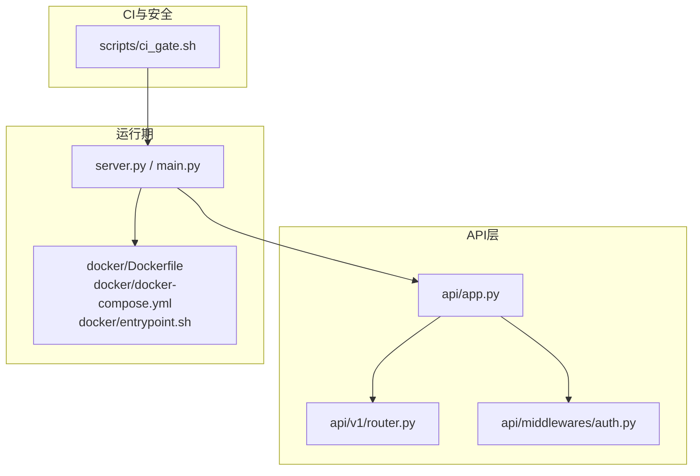
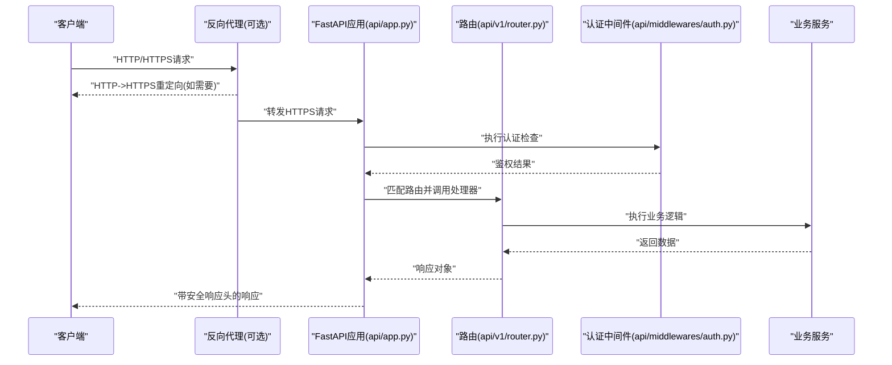
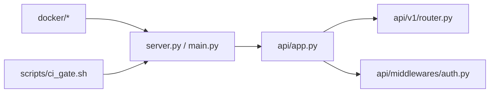

# 安全配置

<cite>
**本文档引用的文件**   
- [api/app.py](file://api/app.py)
- [api/middlewares/auth.py](file://api/middlewares/auth.py)
- [api/v1/router.py](file://api/v1/router.py)
- [docker/Dockerfile](file://docker/Dockerfile)
- [docker/docker-compose.yml](file://docker/docker-compose.yml)
- [docker/entrypoint.sh](file://docker/entrypoint.sh)
- [server.py](file://server.py)
- [main.py](file://main.py)
- [scripts/ci_gate.sh](file://scripts/ci_gate.sh)
</cite>

## 目录
1. [简介](#简介)
2. [项目结构](#项目结构)
3. [核心组件](#核心组件)
4. [架构总览](#架构总览)
5. [详细组件分析](#详细组件分析)
6. [依赖关系分析](#依赖关系分析)
7. [性能考虑](#性能考虑)
8. [故障排查指南](#故障排查指南)
9. [结论](#结论)
10. [附录](#附录)

## 简介
本文件面向Daily Stock Analysis API的安全配置，聚焦以下关键主题：
- CORS跨域策略（允许的源、方法、头部）
- HTTPS强制启用与SSL证书配置、HTTP到HTTPS重定向
- 安全响应头（Content-Security-Policy、X-Frame-Options等）
- 环境变量安全管理（敏感信息加密存储、密钥轮换）
- Docker环境下的安全配置模板与最佳实践
- 安全检查清单与自动化验证脚本

## 项目结构
API应用由FastAPI构建，入口位于api/app.py；路由组织在api/v1/router.py；认证中间件位于api/middlewares/auth.py。Docker相关配置集中在docker目录，包含镜像构建、编排与启动脚本。服务器进程可通过server.py或main.py启动。CI门禁脚本scripts/ci_gate.sh用于流水线中的安全检查。

图表来源
- [api/app.py](file://api/app.py)
- [api/v1/router.py](file://api/v1/router.py)
- [api/middlewares/auth.py](file://api/middlewares/auth.py)
- [server.py](file://server.py)
- [main.py](file://main.py)
- [docker/Dockerfile](file://docker/Dockerfile)
- [docker/docker-compose.yml](file://docker/docker-compose.yml)
- [docker/entrypoint.sh](file://docker/entrypoint.sh)
- [scripts/ci_gate.sh](file://scripts/ci_gate.sh)

章节来源
- [api/app.py](file://api/app.py)
- [api/v1/router.py](file://api/v1/router.py)
- [api/middlewares/auth.py](file://api/middlewares/auth.py)
- [server.py](file://server.py)
- [main.py](file://main.py)
- [docker/Dockerfile](file://docker/Dockerfile)
- [docker/docker-compose.yml](file://docker/docker-compose.yml)
- [docker/entrypoint.sh](file://docker/entrypoint.sh)
- [scripts/ci_gate.sh](file://scripts/ci_gate.sh)

## 核心组件
- 应用初始化与全局中间件注册：负责CORS、安全响应头等全局策略的装配。
- 路由与端点：按模块划分，便于对敏感接口实施更严格的访问控制。
- 认证中间件：统一鉴权逻辑，保护受保护资源。
- 容器化与运行时：通过Docker镜像、Compose编排与入口脚本实现可重复、安全的部署。
- CI门禁：在流水线中执行安全检查，确保发布前满足安全基线。

章节来源
- [api/app.py](file://api/app.py)
- [api/v1/router.py](file://api/v1/router.py)
- [api/middlewares/auth.py](file://api/middlewares/auth.py)
- [docker/Dockerfile](file://docker/Dockerfile)
- [docker/docker-compose.yml](file://docker/docker-compose.yml)
- [docker/entrypoint.sh](file://docker/entrypoint.sh)
- [scripts/ci_gate.sh](file://scripts/ci_gate.sh)

## 架构总览
下图展示了请求从客户端进入，经过反向代理（可选）、应用服务、认证中间件与路由处理，最终返回响应并附加安全头的整体流程。

图表来源
- [api/app.py](file://api/app.py)
- [api/v1/router.py](file://api/v1/router.py)
- [api/middlewares/auth.py](file://api/middlewares/auth.py)

## 详细组件分析

### CORS跨域配置
- 目标：限制允许的来源、方法与头部，避免不必要的跨域暴露。
- 建议策略：
  - 仅允许可信前端域名作为Access-Control-Allow-Origin。
  - 明确限定允许的HTTP方法（如GET、POST、OPTIONS）。
  - 精确声明允许的请求头（如Authorization、Content-Type）。
  - 谨慎开启Allow-Credentials，仅在必要时启用并确保白名单严格。
- 实现位置参考：应用初始化处注册CORS中间件与策略。

章节来源
- [api/app.py](file://api/app.py)

### HTTPS强制启用与SSL证书配置
- 目标：所有通信必须使用TLS，禁止明文HTTP。
- 建议策略：
  - 在反向代理（如Nginx/Traefik）上终止TLS，并将HTTP请求301重定向至HTTPS。
  - 若应用直接监听HTTPS，需加载有效的证书与私钥，禁用弱密码套件与过时协议版本。
  - 启用HSTS（Strict-Transport-Security）以增强浏览器安全行为。
- 实现位置参考：
  - 反向代理配置（外部），用于重定向与TLS终止。
  - 应用启动参数或配置文件指定证书路径与端口。

章节来源
- [docker/Dockerfile](file://docker/Dockerfile)
- [docker/docker-compose.yml](file://docker/docker-compose.yml)
- [docker/entrypoint.sh](file://docker/entrypoint.sh)
- [server.py](file://server.py)
- [main.py](file://main.py)

### 安全响应头设置
- 目标：通过响应头加固浏览器与客户端行为，降低常见Web攻击面。
- 关键头部建议：
  - Content-Security-Policy：限制资源加载与脚本执行范围。
  - X-Frame-Options：防止点击劫持。
  - X-Content-Type-Options：禁止MIME嗅探。
  - Referrer-Policy：控制Referer泄露。
  - Permissions-Policy：限制浏览器功能权限。
  - Strict-Transport-Security：强制HTTPS。
- 实现位置参考：应用中间件或框架级配置统一注入。

章节来源
- [api/app.py](file://api/app.py)

### 环境变量安全管理
- 目标：集中管理敏感配置（密钥、令牌、连接串），支持加密存储与轮换。
- 建议策略：
  - 使用环境变量或密钥管理服务注入敏感值，避免硬编码。
  - 对静态敏感文件进行最小权限访问控制。
  - 建立密钥轮换流程，支持灰度切换与回滚。
  - 在日志与错误信息中脱敏输出。
- 实现位置参考：应用启动时读取环境变量并进行校验。

章节来源
- [docker/entrypoint.sh](file://docker/entrypoint.sh)
- [docker/docker-compose.yml](file://docker/docker-compose.yml)
- [server.py](file://server.py)
- [main.py](file://main.py)

### Docker环境安全配置模板与最佳实践
- 镜像构建：
  - 使用多阶段构建减小镜像体积。
  - 固定基础镜像版本，定期更新依赖。
  - 非root用户运行应用。
- 编排与运行时：
  - 通过Compose挂载只读卷、限制能力集。
  - 使用Secrets管理敏感信息。
  - 网络隔离，仅开放必要端口。
- 启动脚本：
  - 校验必需环境变量与证书存在性。
  - 健康检查与优雅退出。
- 实现位置参考：Dockerfile、docker-compose.yml、entrypoint.sh。

章节来源
- [docker/Dockerfile](file://docker/Dockerfile)
- [docker/docker-compose.yml](file://docker/docker-compose.yml)
- [docker/entrypoint.sh](file://docker/entrypoint.sh)

### 认证与授权中间件
- 目标：统一鉴权逻辑，保护敏感端点。
- 建议策略：
  - 基于Token或会话的认证机制。
  - 细粒度权限控制（角色/资源）。
  - 失败重试与限流防护。
- 实现位置参考：认证中间件与路由装饰器。

章节来源
- [api/middlewares/auth.py](file://api/middlewares/auth.py)
- [api/v1/router.py](file://api/v1/router.py)

## 依赖关系分析
- 应用层依赖：
  - api/app.py依赖路由与中间件，统一装配CORS与安全头。
  - api/v1/router.py定义端点与权限策略。
  - api/middlewares/auth.py提供鉴权能力。
- 运行期依赖：
  - server.py/main.py负责进程启动与配置加载。
  - docker/*提供可重复部署与运行时约束。
- CI依赖：
  - scripts/ci_gate.sh在流水线中执行安全检查。

图表来源
- [api/app.py](file://api/app.py)
- [api/v1/router.py](file://api/v1/router.py)
- [api/middlewares/auth.py](file://api/middlewares/auth.py)
- [server.py](file://server.py)
- [main.py](file://main.py)
- [docker/Dockerfile](file://docker/Dockerfile)
- [docker/docker-compose.yml](file://docker/docker-compose.yml)
- [docker/entrypoint.sh](file://docker/entrypoint.sh)
- [scripts/ci_gate.sh](file://scripts/ci_gate.sh)

章节来源
- [api/app.py](file://api/app.py)
- [api/v1/router.py](file://api/v1/router.py)
- [api/middlewares/auth.py](file://api/middlewares/auth.py)
- [server.py](file://server.py)
- [main.py](file://main.py)
- [docker/Dockerfile](file://docker/Dockerfile)
- [docker/docker-compose.yml](file://docker/docker-compose.yml)
- [docker/entrypoint.sh](file://docker/entrypoint.sh)
- [scripts/ci_gate.sh](file://scripts/ci_gate.sh)

## 性能考虑
- CORS预检请求优化：合理缓存预检结果，减少OPTIONS开销。
- TLS握手成本：启用会话复用与OCSP Stapling（在反向代理层）。
- 安全头生成：尽量在中间件层一次性计算，避免重复处理。
- 容器资源限制：为应用设置CPU与内存上限，避免资源争用。

[本节为通用指导，不直接分析具体文件]

## 故障排查指南
- 常见问题：
  - CORS被拒绝：检查Allowed Origins、Methods、Headers是否匹配。
  - HTTPS未生效：确认反向代理重定向规则与证书有效性。
  - 安全头缺失：检查中间件顺序与响应拦截点。
  - 环境变量未注入：核对Compose Secrets与环境变量映射。
- 定位步骤：
  - 查看应用日志与反向代理日志。
  - 使用curl或浏览器开发者工具检查响应头。
  - 在CI门禁脚本中增加断言，快速发现回归。

章节来源
- [scripts/ci_gate.sh](file://scripts/ci_gate.sh)
- [docker/entrypoint.sh](file://docker/entrypoint.sh)
- [api/app.py](file://api/app.py)

## 结论
通过统一的CORS策略、强制HTTPS、安全响应头、环境变量管理与容器化最佳实践，Daily Stock Analysis API可在生产环境中获得稳健的安全基线。建议在CI中集成自动化验证，持续保障配置合规。

[本节为总结，不直接分析具体文件]

## 附录

### 安全检查清单
- CORS
  - 仅允许可信源与方法
  - 最小化允许的请求头
  - 谨慎启用凭据
- HTTPS
  - 强制重定向HTTP到HTTPS
  - 有效证书与强密码套件
  - 启用HSTS
- 安全响应头
  - CSP、X-Frame-Options、X-Content-Type-Options、Referrer-Policy、Permissions-Policy、HSTS
- 环境变量
  - 敏感信息通过环境变量或Secrets注入
  - 日志脱敏
  - 密钥轮换流程完备
- Docker
  - 非root运行
  - 最小化镜像
  - 网络与卷权限最小化
  - 健康检查与优雅退出

[本节为清单，不直接分析具体文件]

### 自动化验证脚本（概念）
- 校验CORS响应头是否符合预期
- 检测HTTP请求是否被重定向到HTTPS
- 扫描响应头是否包含必需的安全头
- 检查环境变量是否存在且非空
- 报告不符合项并退出码指示失败

[本节为概念脚本说明，不直接分析具体文件]