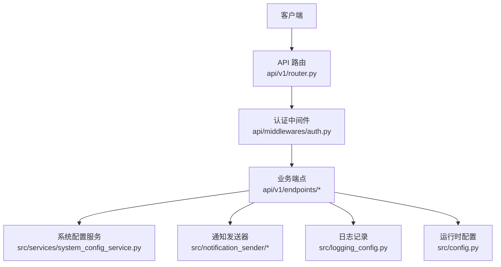
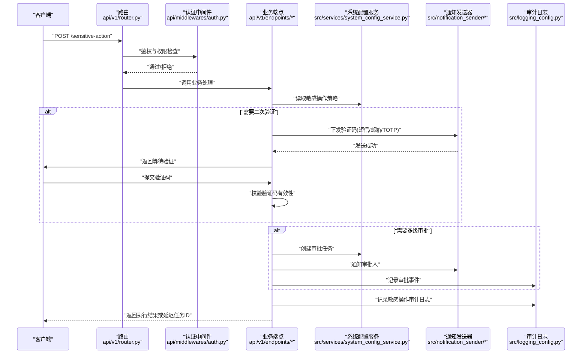
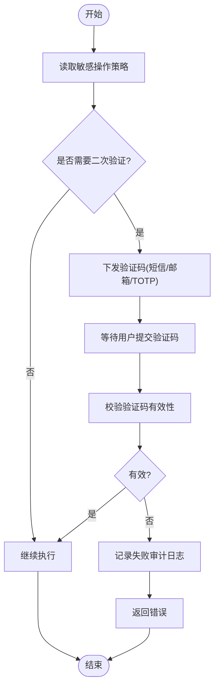
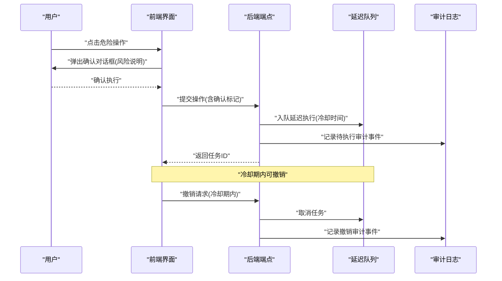
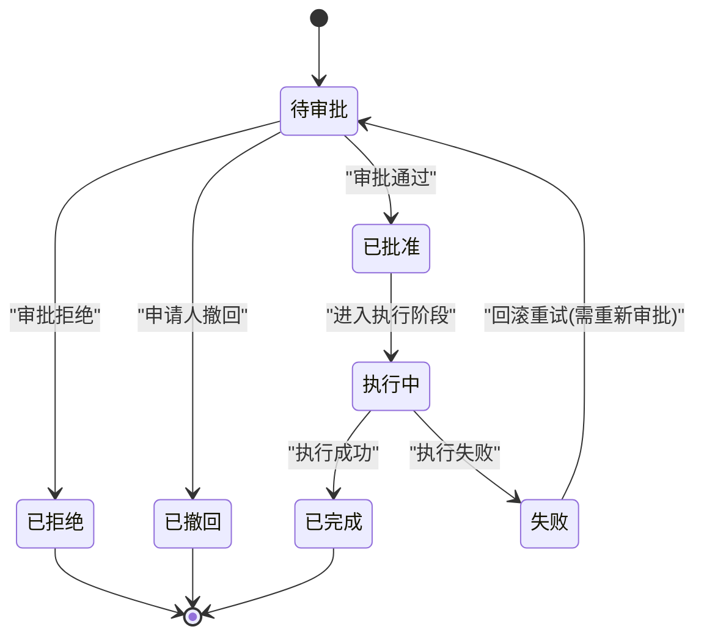
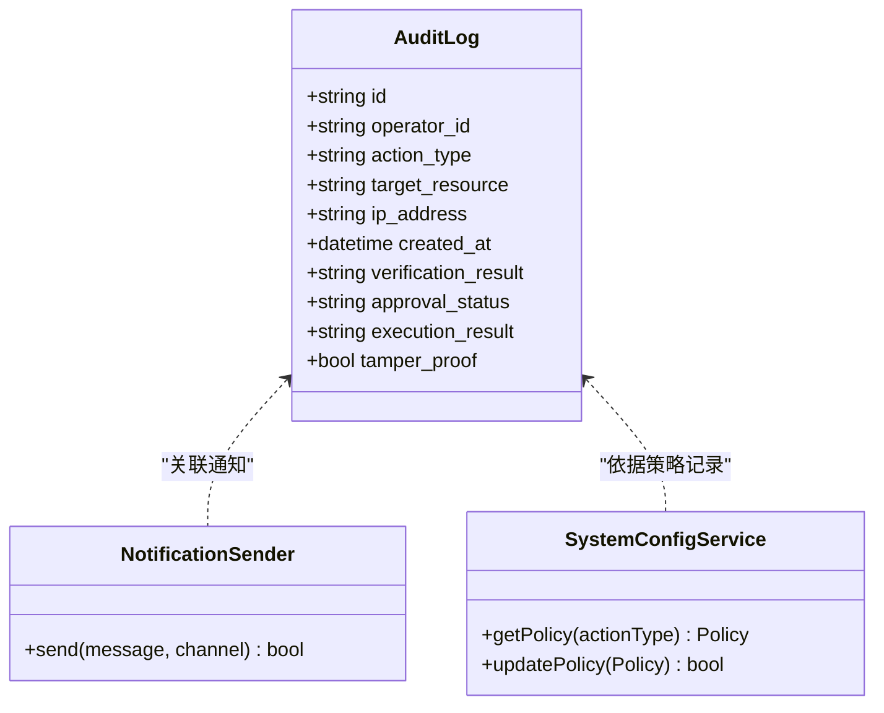
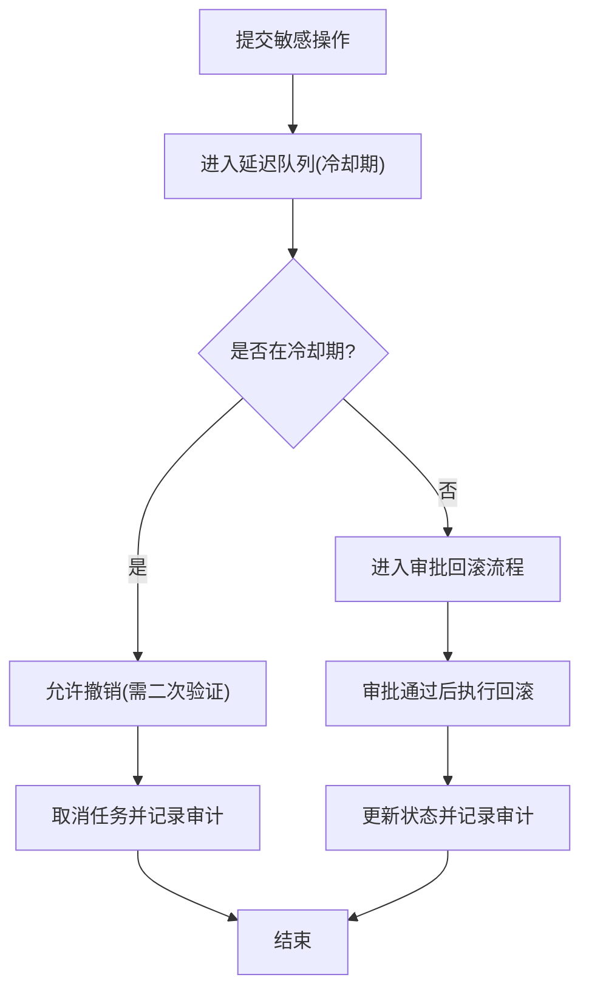
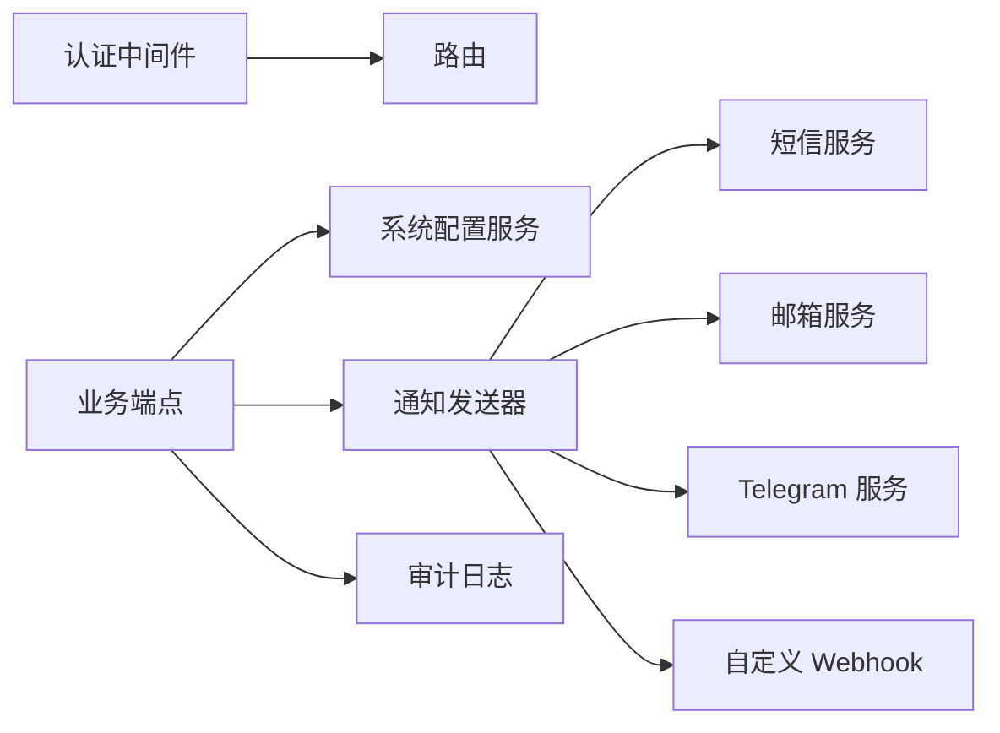

# 敏感操作保护

<cite>
**本文引用的文件**   
- [api/app.py](file://api/app.py)
- [api/middlewares/auth.py](file://api/middlewares/auth.py)
- [api/v1/endpoints/auth.py](file://api/v1/endpoints/auth.py)
- [src/auth.py](file://src/auth.py)
- [api/v1/endpoints/system_config.py](file://api/v1/endpoints/system_config.py)
- [src/services/system_config_service.py](file://src/services/system_config_service.py)
- [api/v1/schemas/system_config.py](file://api/v1/schemas/system_config.py)
- [src/notification.py](file://src/notification.py)
- [src/notification_sender/email_sender.py](file://src/notification_sender/email_sender.py)
- [src/notification_sender/telegram_sender.py](file://src/notification_sender/telegram_sender.py)
- [src/notification_sender/custom_webhook_sender.py](file://src/notification_sender/custom_webhook_sender.py)
- [src/logging_config.py](file://src/logging_config.py)
- [src/config.py](file://src/config.py)
- [api/v1/router.py](file://api/v1/router.py)
</cite>

## 目录
1. [简介](#简介)
2. [项目结构](#项目结构)
3. [核心组件](#核心组件)
4. [架构总览](#架构总览)
5. [详细组件分析](#详细组件分析)
6. [依赖关系分析](#依赖关系分析)
7. [性能考虑](#性能考虑)
8. [故障排查指南](#故障排查指南)
9. [结论](#结论)
10. [附录](#附录)

## 简介
本文件面向 Daily Stock Analysis API 的“敏感操作保护”能力，围绕二次验证、操作确认与延迟执行、审批工作流、审计日志、安全配置与最佳实践、以及撤销与回滚等主题进行系统化说明。文档以代码仓库为依据，结合现有认证中间件、系统配置服务、通知发送器与日志配置，给出可落地的实现建议与流程图示，帮助读者在保持可用性的同时提升安全性。

## 项目结构
与敏感操作保护相关的后端模块主要分布在以下位置：
- API 应用入口与路由注册
- 认证中间件与鉴权逻辑
- 认证相关端点（登录、状态、验证码等）
- 系统配置管理与校验
- 通知通道（短信/邮箱/TOTP 等）
- 日志与配置管理

图表来源
- [api/v1/router.py](file://api/v1/router.py)
- [api/middlewares/auth.py](file://api/middlewares/auth.py)
- [src/services/system_config_service.py](file://src/services/system_config_service.py)
- [src/notification_sender/email_sender.py](file://src/notification_sender/email_sender.py)
- [src/notification_sender/telegram_sender.py](file://src/notification_sender/telegram_sender.py)
- [src/notification_sender/custom_webhook_sender.py](file://src/notification_sender/custom_webhook_sender.py)
- [src/logging_config.py](file://src/logging_config.py)
- [src/config.py](file://src/config.py)

章节来源
- [api/app.py](file://api/app.py)
- [api/v1/router.py](file://api/v1/router.py)
- [api/middlewares/auth.py](file://api/middlewares/auth.py)

## 核心组件
- 认证与授权中间件：统一鉴权、会话/令牌校验、权限判定，为敏感操作提供前置拦截。
- 认证端点：负责登录、二次验证（短信/邮箱/TOTP）、会话建立与状态查询。
- 系统配置服务：集中管理敏感操作开关、阈值、审批策略、审计与通知策略。
- 通知发送器：支持短信、邮箱、即时通讯及自定义 Webhook 等通道，用于验证码下发与审批提醒。
- 日志与配置：结构化审计日志、错误追踪与运行期配置加载。

章节来源
- [api/middlewares/auth.py](file://api/middlewares/auth.py)
- [api/v1/endpoints/auth.py](file://api/v1/endpoints/auth.py)
- [src/services/system_config_service.py](file://src/services/system_config_service.py)
- [src/notification_sender/email_sender.py](file://src/notification_sender/email_sender.py)
- [src/notification_sender/telegram_sender.py](file://src/notification_sender/telegram_sender.py)
- [src/notification_sender/custom_webhook_sender.py](file://src/notification_sender/custom_webhook_sender.py)
- [src/logging_config.py](file://src/logging_config.py)
- [src/config.py](file://src/config.py)

## 架构总览
下图展示一次典型敏感操作的请求链路：从客户端发起，经路由与认证中间件，进入业务端点；若命中敏感操作，则触发二次验证、审批与审计流程，并通过通知通道反馈结果。

图表来源
- [api/v1/router.py](file://api/v1/router.py)
- [api/middlewares/auth.py](file://api/middlewares/auth.py)
- [api/v1/endpoints/system_config.py](file://api/v1/endpoints/system_config.py)
- [src/services/system_config_service.py](file://src/services/system_config_service.py)
- [src/notification_sender/email_sender.py](file://src/notification_sender/email_sender.py)
- [src/notification_sender/telegram_sender.py](file://src/notification_sender/telegram_sender.py)
- [src/notification_sender/custom_webhook_sender.py](file://src/notification_sender/custom_webhook_sender.py)
- [src/logging_config.py](file://src/logging_config.py)

## 详细组件分析

### 二次验证机制（短信验证码、邮箱验证、TOTP）
- 触发条件：由系统配置服务根据操作类型、用户角色、风险等级决定是否需要二次验证。
- 验证码下发：通过通知发送器选择合适通道（短信、邮箱、Telegram 等），生成一次性验证码并设置有效期。
- TOTP 集成：对高敏操作启用基于时间的一次性口令校验，要求客户端携带 TOTP 码。
- 校验流程：服务端校验验证码是否匹配、未过期、未被使用；失败则记录审计日志并返回错误。

图表来源
- [api/v1/endpoints/auth.py](file://api/v1/endpoints/auth.py)
- [src/services/system_config_service.py](file://src/services/system_config_service.py)
- [src/notification_sender/email_sender.py](file://src/notification_sender/email_sender.py)
- [src/notification_sender/telegram_sender.py](file://src/notification_sender/telegram_sender.py)
- [src/notification_sender/custom_webhook_sender.py](file://src/notification_sender/custom_webhook_sender.py)
- [src/logging_config.py](file://src/logging_config.py)

章节来源
- [api/v1/endpoints/auth.py](file://api/v1/endpoints/auth.py)
- [src/services/system_config_service.py](file://src/services/system_config_service.py)
- [src/notification_sender/email_sender.py](file://src/notification_sender/email_sender.py)
- [src/notification_sender/telegram_sender.py](file://src/notification_sender/telegram_sender.py)
- [src/notification_sender/custom_webhook_sender.py](file://src/notification_sender/custom_webhook_sender.py)
- [src/logging_config.py](file://src/logging_config.py)

### 操作确认流程（危险操作确认对话框与延迟执行）
- 确认对话框：前端在发起高危操作前弹出确认框，展示影响范围与风险提示，并要求用户明确确认。
- 延迟执行：后端将敏感操作放入延迟队列，设置最小冷却时间，避免误操作立即生效。
- 可撤销窗口：在冷却期内允许撤销；冷却期后进入不可撤销阶段，需走审批回滚流程。

图表来源
- [api/v1/endpoints/system_config.py](file://api/v1/endpoints/system_config.py)
- [src/services/system_config_service.py](file://src/services/system_config_service.py)
- [src/logging_config.py](file://src/logging_config.py)

章节来源
- [api/v1/endpoints/system_config.py](file://api/v1/endpoints/system_config.py)
- [src/services/system_config_service.py](file://src/services/system_config_service.py)
- [src/logging_config.py](file://src/logging_config.py)

### 审批工作流（多级审批配置与状态跟踪）
- 多级审批：按操作风险等级配置审批链（如一级风控、二级合规、三级负责人）。
- 状态跟踪：每个审批节点具备独立状态（待审批、已批准、已拒绝、已撤回），支持超时自动升级或拒绝。
- 通知与审计：审批流转过程中通过通知通道提醒审批人，所有动作写入审计日志。

图表来源
- [api/v1/endpoints/system_config.py](file://api/v1/endpoints/system_config.py)
- [src/services/system_config_service.py](file://src/services/system_config_service.py)
- [src/logging_config.py](file://src/logging_config.py)

章节来源
- [api/v1/endpoints/system_config.py](file://api/v1/endpoints/system_config.py)
- [src/services/system_config_service.py](file://src/services/system_config_service.py)
- [src/logging_config.py](file://src/logging_config.py)

### 操作审计日志（完整记录与操作人追踪）
- 记录内容：操作类型、目标资源、操作人、IP、时间戳、二次验证结果、审批状态、执行结果等。
- 防篡改：审计日志采用只追加存储，关键字段签名校验，确保可追溯性与完整性。
- 检索与导出：支持按操作人、时间范围、操作类型筛选，并提供导出接口供合规审查。

图表来源
- [src/logging_config.py](file://src/logging_config.py)
- [src/services/system_config_service.py](file://src/services/system_config_service.py)
- [src/notification_sender/email_sender.py](file://src/notification_sender/email_sender.py)
- [src/notification_sender/telegram_sender.py](file://src/notification_sender/telegram_sender.py)
- [src/notification_sender/custom_webhook_sender.py](file://src/notification_sender/custom_webhook_sender.py)

章节来源
- [src/logging_config.py](file://src/logging_config.py)
- [src/services/system_config_service.py](file://src/services/system_config_service.py)

### 安全配置示例与最佳实践
- 最小权限原则：仅授予必要权限，按角色划分敏感操作访问范围。
- 强制二次验证：对高风险操作默认开启短信/邮箱/TOTP 双重验证。
- 审批门槛：超过阈值的操作必须经过多级审批，且审批链不可绕过。
- 延迟与冷却：所有高危操作默认延迟执行，设置最短冷却时间。
- 审计与告警：全量审计日志，异常行为实时告警，定期合规审查。
- 密钥与凭据：严格管理短信/邮箱/TOTP 密钥，使用环境变量与密钥管理服务。

章节来源
- [src/services/system_config_service.py](file://src/services/system_config_service.py)
- [api/v1/schemas/system_config.py](file://api/v1/schemas/system_config.py)
- [src/config.py](file://src/config.py)

### 撤销与回滚实现指南
- 撤销窗口：在延迟冷却期内允许撤销，撤销请求需二次验证与审计记录。
- 回滚流程：冷却期后如需回滚，需走审批流程，生成回滚任务并记录审计。
- 幂等性：撤销与回滚接口需保证幂等，避免重复执行导致数据不一致。
- 状态一致性：撤销/回滚完成后更新相关任务状态，并通知相关人员。

图表来源
- [api/v1/endpoints/system_config.py](file://api/v1/endpoints/system_config.py)
- [src/services/system_config_service.py](file://src/services/system_config_service.py)
- [src/logging_config.py](file://src/logging_config.py)

章节来源
- [api/v1/endpoints/system_config.py](file://api/v1/endpoints/system_config.py)
- [src/services/system_config_service.py](file://src/services/system_config_service.py)
- [src/logging_config.py](file://src/logging_config.py)

## 依赖关系分析
- 中间件依赖：认证中间件依赖路由与配置服务，确保鉴权与策略一致。
- 端点依赖：业务端点依赖系统配置服务、通知发送器与日志模块。
- 外部依赖：短信/邮箱/TOTP 服务、即时通讯平台、Webhook 回调。

图表来源
- [api/middlewares/auth.py](file://api/middlewares/auth.py)
- [api/v1/router.py](file://api/v1/router.py)
- [src/services/system_config_service.py](file://src/services/system_config_service.py)
- [src/notification_sender/email_sender.py](file://src/notification_sender/email_sender.py)
- [src/notification_sender/telegram_sender.py](file://src/notification_sender/telegram_sender.py)
- [src/notification_sender/custom_webhook_sender.py](file://src/notification_sender/custom_webhook_sender.py)
- [src/logging_config.py](file://src/logging_config.py)

章节来源
- [api/middlewares/auth.py](file://api/middlewares/auth.py)
- [api/v1/router.py](file://api/v1/router.py)
- [src/services/system_config_service.py](file://src/services/system_config_service.py)
- [src/notification_sender/email_sender.py](file://src/notification_sender/email_sender.py)
- [src/notification_sender/telegram_sender.py](file://src/notification_sender/telegram_sender.py)
- [src/notification_sender/custom_webhook_sender.py](file://src/notification_sender/custom_webhook_sender.py)
- [src/logging_config.py](file://src/logging_config.py)

## 性能考虑
- 验证码缓存：使用内存缓存存储一次性验证码，降低数据库压力。
- 异步通知：通知发送采用异步队列，避免阻塞主流程。
- 批量审计：审计日志批量写入，减少 IO 开销。
- 策略预取：敏感操作策略在服务启动时预加载，减少运行时查询。

[本节为通用指导，不直接分析具体文件]

## 故障排查指南
- 验证码无效：检查验证码是否过期、是否已被使用、通道是否正常。
- 审批卡住：查看审批状态、超时配置、通知是否送达。
- 审计缺失：确认日志模块初始化、权限与存储路径。
- 延迟未执行：检查队列状态、消费者进程与健康检查。

章节来源
- [src/logging_config.py](file://src/logging_config.py)
- [src/services/system_config_service.py](file://src/services/system_config_service.py)
- [src/config.py](file://src/config.py)

## 结论
通过统一的认证中间件、灵活的系统配置服务、多渠道通知发送器与完善的审计日志，Daily Stock Analysis API 能够实现对敏感操作的全生命周期保护。结合二次验证、操作确认与延迟执行、多级审批、撤销与回滚等机制，可在保障业务连续性的同时显著提升安全性与合规性。

[本节为总结性内容，不直接分析具体文件]

## 附录
- 配置项参考：敏感操作开关、阈值、审批链、审计策略、通知通道参数。
- 接口契约：二次验证、审批、撤销/回滚接口的输入输出规范。
- 部署建议：密钥管理、日志归档、监控告警与备份恢复。

[本节为补充信息，不直接分析具体文件]