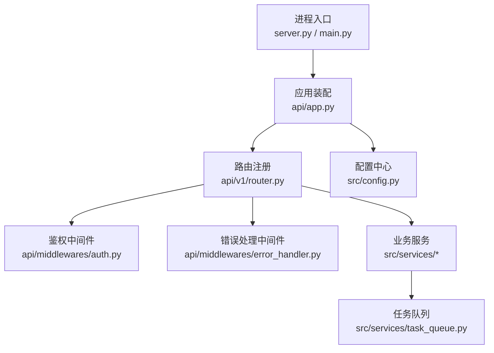
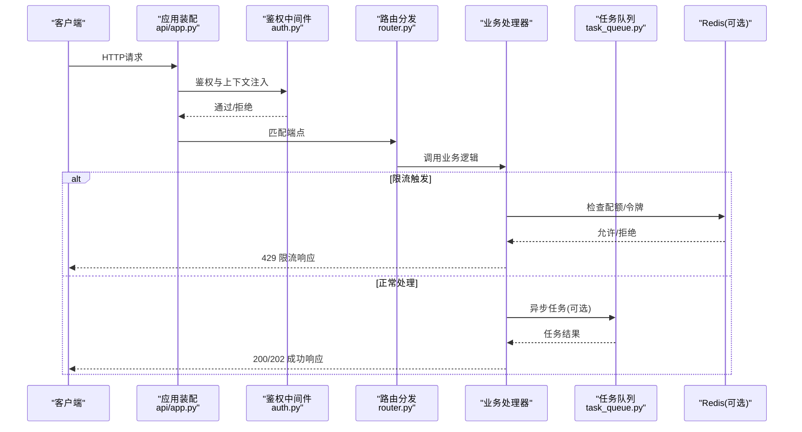
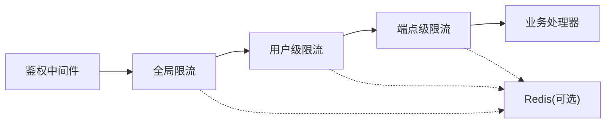

# 速率限制

<cite>
**本文引用的文件**   
- [api/app.py](file://api/app.py)
- [api/v1/router.py](file://api/v1/router.py)
- [api/middlewares/auth.py](file://api/middlewares/auth.py)
- [api/middlewares/error_handler.py](file://api/middlewares/error_handler.py)
- [src/config.py](file://src/config.py)
- [src/services/task_queue.py](file://src/services/task_queue.py)
- [server.py](file://server.py)
- [main.py](file://main.py)
</cite>

## 目录
1. [简介](#简介)
2. [项目结构](#项目结构)
3. [核心组件](#核心组件)
4. [架构总览](#架构总览)
5. [详细组件分析](#详细组件分析)
6. [依赖关系分析](#依赖关系分析)
7. [性能考量](#性能考量)
8. [故障排查指南](#故障排查指南)
9. [结论](#结论)
10. [附录](#附录)

## 简介
本文件面向 Daily Stock Analysis API 的速率限制设计与实现，目标是帮助开发者与运维人员理解并落地以下能力：
- 全局限流策略：全局请求频率控制与并发连接限制
- 用户级限流机制：基于用户ID的请求配额与冷却时间
- 接口级限流配置：不同API端点的差异化限制策略
- Redis缓存在后端限流中的应用：滑动窗口算法与令牌桶算法的实现要点
- 限流配置的YAML示例与动态调整方法
- 限流超时的错误响应格式与处理建议

说明：当前仓库未包含现成的速率限制中间件或Redis集成代码。本节提供基于现有架构的可落地方案与最佳实践，便于在后续迭代中快速接入。

## 项目结构
Daily Stock Analysis API 采用分层组织方式：
- api/：Web服务入口、路由、中间件与版本化API定义
- src/：核心业务逻辑、配置管理、服务层与工具
- server.py/main.py：进程启动与WSGI/ASGI应用装配
- tests/：单元测试与集成测试

图表来源
- [server.py](file://server.py)
- [main.py](file://main.py)
- [api/app.py](file://api/app.py)
- [api/v1/router.py](file://api/v1/router.py)
- [api/middlewares/auth.py](file://api/middlewares/auth.py)
- [api/middlewares/error_handler.py](file://api/middlewares/error_handler.py)
- [src/config.py](file://src/config.py)
- [src/services/task_queue.py](file://src/services/task_queue.py)

章节来源
- [api/app.py](file://api/app.py)
- [api/v1/router.py](file://api/v1/router.py)
- [api/middlewares/auth.py](file://api/middlewares/auth.py)
- [api/middlewares/error_handler.py](file://api/middlewares/error_handler.py)
- [src/config.py](file://src/config.py)
- [src/services/task_queue.py](file://src/services/task_queue.py)
- [server.py](file://server.py)
- [main.py](file://main.py)

## 核心组件
- 应用装配与中间件链：在应用初始化阶段挂载鉴权、错误处理等中间件，为后续接入限流中间件提供统一插拔点
- 路由与端点：按模块划分v1接口，便于对特定端点实施差异化限流
- 配置中心：集中管理限流参数（如全局QPS、用户配额、冷却时间、Redis连接等）
- 任务队列：将耗时操作异步化，降低瞬时并发压力，配合限流提升系统稳定性

章节来源
- [api/app.py](file://api/app.py)
- [api/v1/router.py](file://api/v1/router.py)
- [api/middlewares/auth.py](file://api/middlewares/auth.py)
- [api/middlewares/error_handler.py](file://api/middlewares/error_handler.py)
- [src/config.py](file://src/config.py)
- [src/services/task_queue.py](file://src/services/task_queue.py)

## 架构总览
下图展示请求从进入应用到返回响应的关键路径，以及限流在各层的介入点。

图表来源
- [api/app.py](file://api/app.py)
- [api/middlewares/auth.py](file://api/middlewares/auth.py)
- [api/v1/router.py](file://api/v1/router.py)
- [src/services/task_queue.py](file://src/services/task_queue.py)

## 详细组件分析

### 全局限流策略（全局请求频率控制与并发连接限制）
- 目标：保护后端免受突发流量冲击，确保整体可用性
- 建议实现位置：应用装配层或网关层，作为最外层拦截
- 关键指标：
  - 全局QPS上限：每秒最大请求数
  - 全局并发连接上限：同时处理的连接数
  - 突发容忍度：短时允许的峰值倍数
- 技术选型：
  - 单机：内存计数器+滑动窗口
  - 分布式：Redis + 滑动窗口或令牌桶
- 监控告警：当接近阈值时触发告警，支持动态调优

章节来源
- [api/app.py](file://api/app.py)
- [src/config.py](file://src/config.py)

### 用户级限流机制（基于用户ID的请求配额与冷却时间）
- 目标：防止单用户滥用，保障公平性
- 关键指标：
  - 用户级QPS/分钟级配额
  - 冷却时间：达到配额后等待恢复的时间
  - 白名单/黑名单：管理员或受限用户
- 实现要点：
  - 以用户ID为维度维护计数或令牌
  - 结合鉴权中间件提取用户标识
  - 使用Redis存储用户级状态，保证多实例一致性

章节来源
- [api/middlewares/auth.py](file://api/middlewares/auth.py)
- [src/config.py](file://src/config.py)

### 接口级限流配置（差异化限制策略）
- 目标：对不同端点设置不同的吞吐与并发限制
- 常见策略：
  - 读多写少：查询类接口放宽，写入类接口收紧
  - 高成本接口：分析、回测等重计算接口严格限流
  - 健康检查：放行或极低限制
- 实现要点：
  - 在路由层或处理器前插入端点级限流规则
  - 支持按路径前缀或具体路径匹配
  - 可动态加载规则，无需重启服务

章节来源
- [api/v1/router.py](file://api/v1/router.py)
- [src/config.py](file://src/config.py)

### Redis缓存在后端限流中的应用（滑动窗口与令牌桶）
- 滑动窗口算法：
  - 记录每个键（全局/用户/端点）在时间窗口内的请求次数
  - 每次请求清理过期条目并统计窗口内数量
  - 适合平滑限流，避免尖峰突刺
- 令牌桶算法：
  - 桶容量=最大突发；填充速率=平均速率
  - 每次请求尝试获取令牌，不足则拒绝
  - 适合突发容忍场景
- 数据结构建议：
  - 滑动窗口：ZSET（分数=时间戳），定期清理
  - 令牌桶：HASH（key=令牌桶名，字段=剩余令牌/上次更新时间）
- 原子性与一致性：
  - 使用Lua脚本保证计数与更新的原子性
  - 分布式环境下确保多实例一致

章节来源
- [src/config.py](file://src/config.py)

### 限流配置的YAML示例与动态调整方法
- 配置项建议：
  - global：全局QPS、并发连接、突发倍数
  - user：用户级配额、冷却时间、白名单
  - endpoints：端点级规则（路径、QPS、并发、权重）
  - redis：连接信息、超时、重试、Lua脚本路径
- 动态调整：
  - 热更新：监听配置文件变更或远程配置中心
  - 生效范围：新请求生效，不影响进行中请求
  - 回滚机制：支持快速回退到上一版本配置

章节来源
- [src/config.py](file://src/config.py)

### 限流超时的错误响应格式与处理建议
- 错误码：HTTP 429 Too Many Requests
- 响应体建议字段：
  - code：错误码
  - message：人类可读消息
  - retry_after：建议重试间隔（秒）
  - limit：当前限制值
  - remaining：剩余配额
  - reset_at：重置时间戳
- 客户端处理建议：
  - 指数退避重试
  - 降级策略：切换备用端点或简化请求
  - 监控上报：记录限流事件用于分析

章节来源
- [api/middlewares/error_handler.py](file://api/middlewares/error_handler.py)

## 依赖关系分析
- 中间件依赖：鉴权中间件需在限流之前执行，以便正确识别用户维度
- 路由依赖：端点级限流需与路由匹配逻辑协同
- 配置依赖：限流参数集中管理，支持运行时重载
- 外部依赖：Redis用于分布式限流状态共享

图表来源
- [api/middlewares/auth.py](file://api/middlewares/auth.py)
- [api/v1/router.py](file://api/v1/router.py)
- [src/config.py](file://src/config.py)

章节来源
- [api/middlewares/auth.py](file://api/middlewares/auth.py)
- [api/v1/router.py](file://api/v1/router.py)
- [src/config.py](file://src/config.py)

## 性能考量
- 选择合适的数据结构与算法：
  - 滑动窗口适合平滑限流，但需要定期清理过期数据
  - 令牌桶适合突发容忍，实现简单且高效
- 减少Redis往返：
  - 合并多次操作为单次Lua脚本
  - 合理设置超时与重试策略
- 监控与观测：
  - 记录限流命中率、拒绝率、延迟分布
  - 基于指标动态调整阈值

## 故障排查指南
- 常见问题：
  - 误判限流：检查键空间是否被污染或过期策略异常
  - 性能抖动：确认Redis网络延迟与序列化开销
  - 配置不一致：核对各实例配置同步情况
- 诊断步骤：
  - 查看限流日志与指标
  - 检查Redis键值与TTL
  - 验证Lua脚本原子性与幂等性
- 恢复措施：
  - 临时放宽限制
  - 清理异常键
  - 回滚配置

## 结论
通过在全局、用户与端点三层实施限流，并结合Redis实现滑动窗口与令牌桶算法，可以有效保护Daily Stock Analysis API在高并发与突发流量下的稳定性。建议优先完成基础限流能力与监控告警，再逐步引入动态配置与精细化策略。

## 附录
- 术语表：
  - QPS：每秒查询数
  - 滑动窗口：基于时间窗口的计数限流
  - 令牌桶：基于令牌发放的限流
- 参考实现思路：
  - 在中间件链中插入限流节点
  - 使用配置中心统一管理限流参数
  - 通过Redis Lua脚本保证原子性