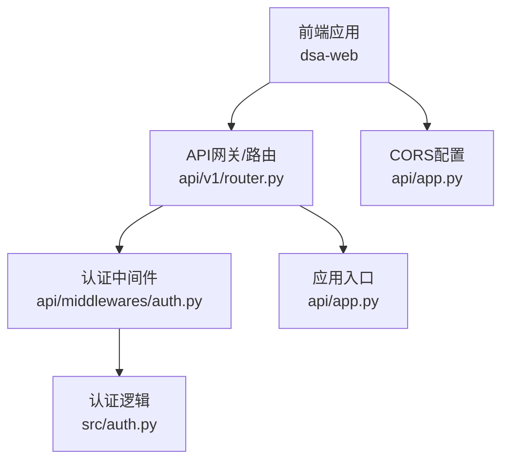
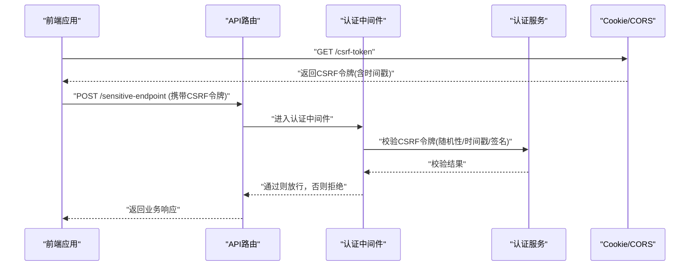
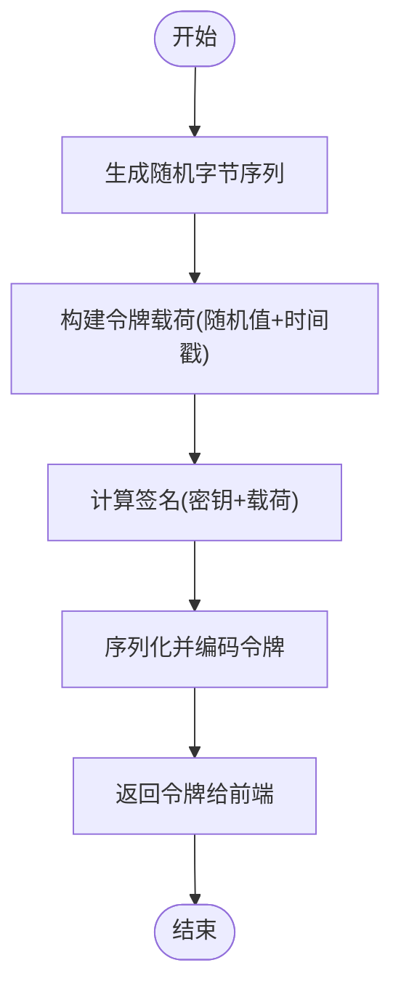
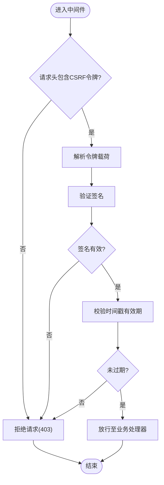
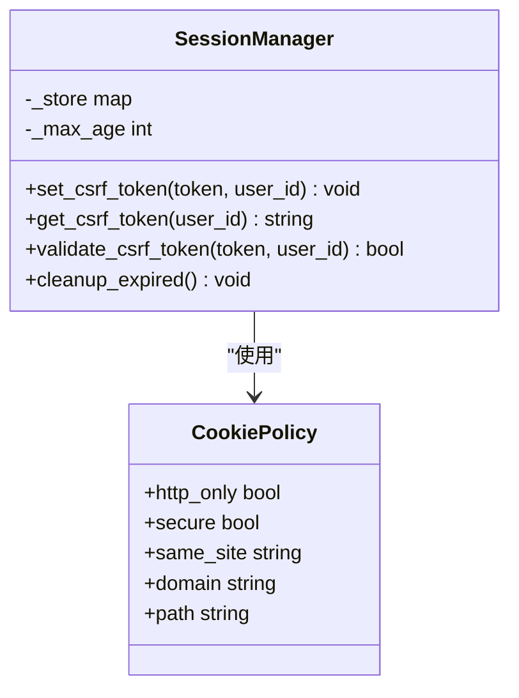
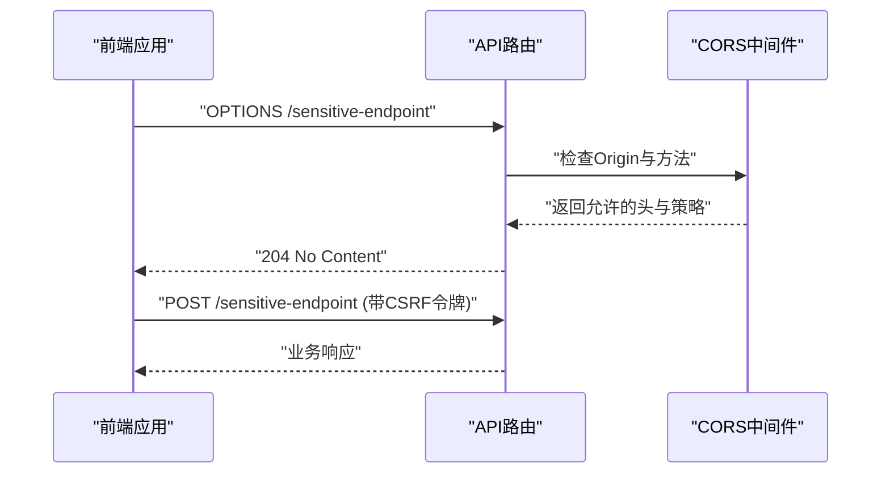
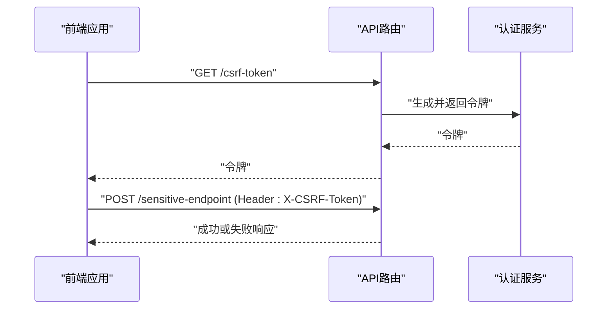
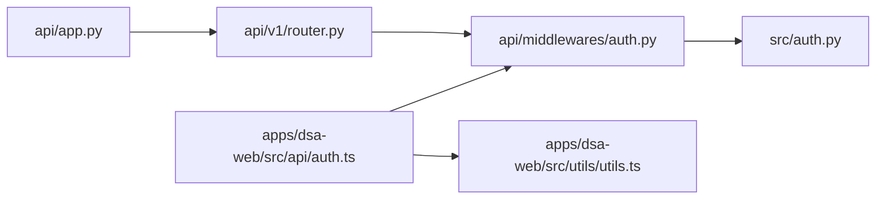

# CSRF保护实现

<cite>
**本文档引用的文件**   
- [api/app.py](file://api/app.py)
- [api/middlewares/auth.py](file://api/middlewares/auth.py)
- [api/v1/router.py](file://api/v1/router.py)
- [src/auth.py](file://src/auth.py)
- [apps/dsa-web/src/api/auth.ts](file://apps/dsa-web/src/api/auth.ts)
- [apps/dsa-web/src/utils/utils.ts](file://apps/dsa-web/src/utils/utils.ts)
- [tests/test_api_app_cors.py](file://tests/test_api_app_cors.py)
</cite>

## 目录
1. [简介](#简介)
2. [项目结构](#项目结构)
3. [核心组件](#核心组件)
4. [架构总览](#架构总览)
5. [详细组件分析](#详细组件分析)
6. [依赖关系分析](#依赖关系分析)
7. [性能考虑](#性能考虑)
8. [故障排查指南](#故障排查指南)
9. [结论](#结论)
10. [附录](#附录)

## 简介
本文件面向Daily Stock Analysis项目的CSRF（跨站请求伪造）保护实现，聚焦以下目标：
- 令牌生成机制：随机令牌创建、时间戳嵌入与签名验证。
- 令牌验证流程：请求头检查、表单数据验证与跨域请求处理。
- 会话管理机制：Cookie安全设置、令牌存储策略与过期处理。
- 跨域请求处理：CORS配置、预检请求处理与同源策略绕过。
- 防护配置与集成：前端集成方法与移动端适配方案。

## 项目结构
本项目采用前后端分离架构：
- 后端API基于Python框架，提供认证、中间件、路由与CORS配置。
- 前端Web应用通过HTTP客户端调用后端接口，负责携带CSRF令牌并处理响应。
- 测试用例覆盖CORS行为与认证流程。

图表来源
- [api/app.py](file://api/app.py)
- [api/v1/router.py](file://api/v1/router.py)
- [api/middlewares/auth.py](file://api/middlewares/auth.py)
- [src/auth.py](file://src/auth.py)

章节来源
- [api/app.py](file://api/app.py)
- [api/v1/router.py](file://api/v1/router.py)
- [api/middlewares/auth.py](file://api/middlewares/auth.py)
- [src/auth.py](file://src/auth.py)

## 核心组件
- 应用入口与CORS配置：在应用初始化阶段注册CORS策略，限定允许的源、方法、头部与凭据模式。
- 认证中间件：统一拦截需要保护的请求，校验CSRF令牌、鉴权状态与请求上下文。
- 认证服务：封装令牌生成、验证、会话管理与Cookie设置等核心逻辑。
- 前端API客户端：在发起写操作前获取CSRF令牌，并在请求头或表单中携带令牌。

章节来源
- [api/app.py](file://api/app.py)
- [api/middlewares/auth.py](file://api/middlewares/auth.py)
- [src/auth.py](file://src/auth.py)
- [apps/dsa-web/src/api/auth.ts](file://apps/dsa-web/src/api/auth.ts)

## 架构总览
下图展示CSRF保护的整体交互流程：前端先获取令牌，随后在敏感操作中携带令牌；后端中间件校验令牌有效性，结合CORS策略控制跨域访问。

图表来源
- [api/app.py](file://api/app.py)
- [api/v1/router.py](file://api/v1/router.py)
- [api/middlewares/auth.py](file://api/middlewares/auth.py)
- [src/auth.py](file://src/auth.py)

## 详细组件分析

### 令牌生成机制
- 随机令牌创建：使用安全的随机数生成器创建不可预测的令牌值，避免可猜测性。
- 时间戳嵌入：将当前时间戳编码进令牌载荷，用于限制令牌有效期与重放攻击防护。
- 签名验证：对令牌载荷进行签名计算，确保令牌未被篡改；服务端验证签名一致性。

图表来源
- [src/auth.py](file://src/auth.py)

章节来源
- [src/auth.py](file://src/auth.py)

### 令牌验证流程
- 请求头检查：从请求头中提取CSRF令牌字段，缺失则直接拒绝。
- 表单数据验证：若为表单提交，需同时校验表单中的CSRF字段与请求头的一致性。
- 跨域请求处理：根据CORS策略判断是否允许跨域；预检请求需快速返回允许信息。
- 签名与时间戳校验：验证签名一致性与时间戳是否在有效期内，防止重放与篡改。

图表来源
- [api/middlewares/auth.py](file://api/middlewares/auth.py)
- [src/auth.py](file://src/auth.py)

章节来源
- [api/middlewares/auth.py](file://api/middlewares/auth.py)
- [src/auth.py](file://src/auth.py)

### 会话管理机制
- Cookie安全设置：启用HttpOnly、Secure与SameSite属性，降低XSS与跨站读取风险。
- 令牌存储策略：优先使用内存或短期缓存存储令牌映射，避免持久化泄露。
- 过期处理：基于时间戳与最大存活期自动清理过期令牌，减少内存占用。

图表来源
- [src/auth.py](file://src/auth.py)

章节来源
- [src/auth.py](file://src/auth.py)

### 跨域请求处理
- CORS配置：明确允许的源、方法、头部与凭据模式，避免宽泛开放。
- 预检请求处理：对OPTIONS请求快速返回允许信息，提升用户体验。
- 同源策略绕过：仅在白名单域名下允许携带凭据，其他情况禁止。

图表来源
- [api/app.py](file://api/app.py)
- [api/v1/router.py](file://api/v1/router.py)

章节来源
- [api/app.py](file://api/app.py)
- [api/v1/router.py](file://api/v1/router.py)
- [tests/test_api_app_cors.py](file://tests/test_api_app_cors.py)

### 前端集成方法
- 获取CSRF令牌：在页面加载或首次请求时获取令牌并缓存。
- 携带令牌：在每次写请求的请求头或表单中附加CSRF令牌。
- 错误处理：当收到403或令牌无效时，重新获取令牌并重试。

图表来源
- [apps/dsa-web/src/api/auth.ts](file://apps/dsa-web/src/api/auth.ts)
- [apps/dsa-web/src/utils/utils.ts](file://apps/dsa-web/src/utils/utils.ts)

章节来源
- [apps/dsa-web/src/api/auth.ts](file://apps/dsa-web/src/api/auth.ts)
- [apps/dsa-web/src/utils/utils.ts](file://apps/dsa-web/src/utils/utils.ts)

### 移动端适配方案
- 使用WebView或原生网络库时，确保支持自定义请求头与Cookie策略。
- 对于混合应用，保持与Web一致的CSRF令牌获取与携带逻辑。
- 注意平台差异：iOS/Android对Cookie与CORS的处理可能不同，需针对性配置。

[本节为通用指导，不直接分析具体文件]

## 依赖关系分析
- 应用入口依赖CORS配置与路由注册。
- 认证中间件依赖认证服务进行令牌校验与会话管理。
- 前端API客户端依赖工具函数进行令牌获取与请求封装。

图表来源
- [api/app.py](file://api/app.py)
- [api/v1/router.py](file://api/v1/router.py)
- [api/middlewares/auth.py](file://api/middlewares/auth.py)
- [src/auth.py](file://src/auth.py)
- [apps/dsa-web/src/api/auth.ts](file://apps/dsa-web/src/api/auth.ts)
- [apps/dsa-web/src/utils/utils.ts](file://apps/dsa-web/src/utils/utils.ts)

章节来源
- [api/app.py](file://api/app.py)
- [api/v1/router.py](file://api/v1/router.py)
- [api/middlewares/auth.py](file://api/middlewares/auth.py)
- [src/auth.py](file://src/auth.py)
- [apps/dsa-web/src/api/auth.ts](file://apps/dsa-web/src/api/auth.ts)
- [apps/dsa-web/src/utils/utils.ts](file://apps/dsa-web/src/utils/utils.ts)

## 性能考虑
- 令牌生成应避免阻塞主线程，必要时异步化。
- 令牌校验尽量轻量，优先使用内存查找与快速签名验证。
- 定期清理过期令牌，控制内存增长。
- CORS预检请求应快速返回，避免影响首屏体验。

[本节为通用指导，不直接分析具体文件]

## 故障排查指南
- 常见错误：
  - 403 Forbidden：CSRF令牌缺失或无效，检查请求头与表单字段。
  - CORS错误：Origin不在白名单或方法不被允许，检查CORS配置。
  - 令牌过期：时间戳超出有效期，刷新令牌并重试。
- 调试建议：
  - 启用详细日志记录令牌生成与校验过程。
  - 使用浏览器开发者工具检查请求头与响应头。
  - 运行CORS相关测试用例验证配置正确性。

章节来源
- [tests/test_api_app_cors.py](file://tests/test_api_app_cors.py)

## 结论
本实现通过严格的令牌生成、校验与会话管理，结合CORS策略，有效防护CSRF攻击。前端集成简单清晰，移动端适配灵活。建议在生产环境中严格配置CORS白名单、启用安全Cookie属性，并定期审计令牌生命周期与日志。

[本节为总结性内容，不直接分析具体文件]

## 附录
- 最佳实践清单：
  - 使用强随机源生成令牌。
  - 嵌入时间戳并设置合理有效期。
  - 对所有写操作强制校验CSRF令牌。
  - 仅允许可信源进行跨域请求。
  - 启用HttpOnly、Secure与SameSite Cookie属性。
  - 定期清理过期令牌与会话数据。

[本节为通用指导，不直接分析具体文件]