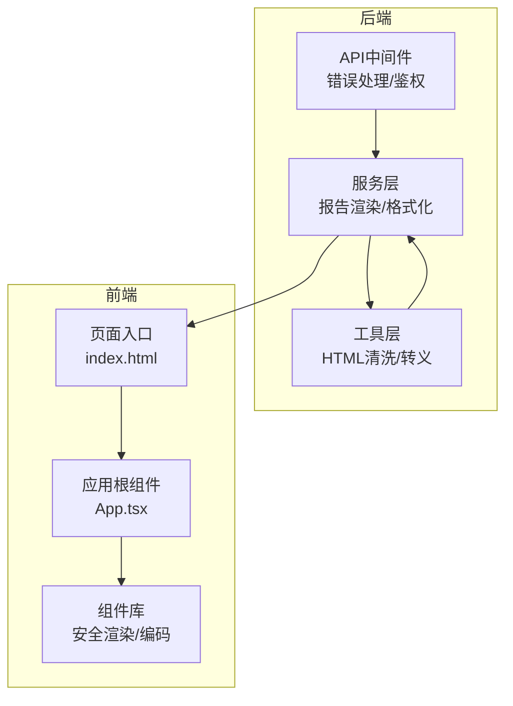
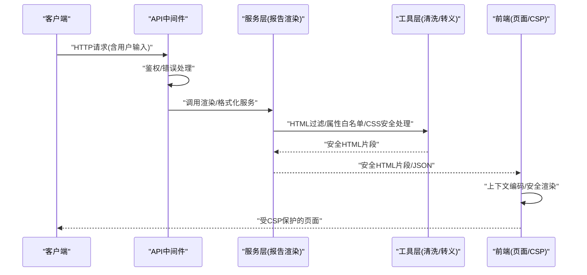
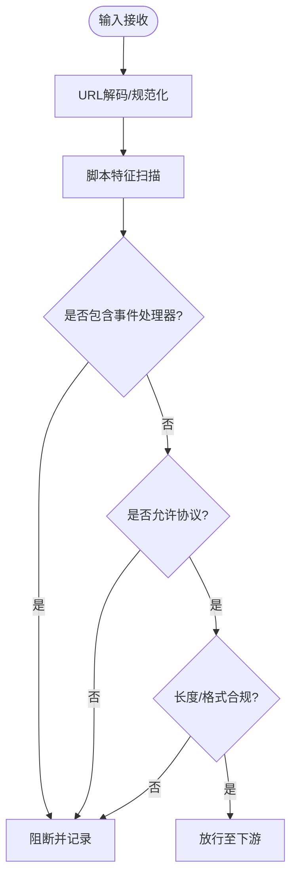
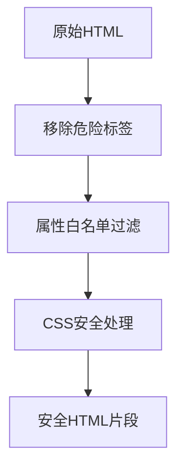
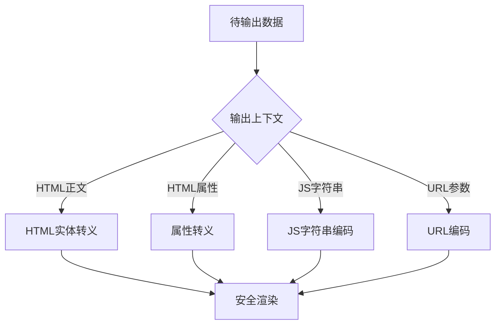
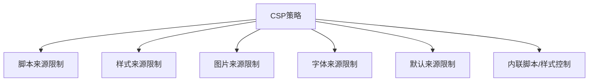
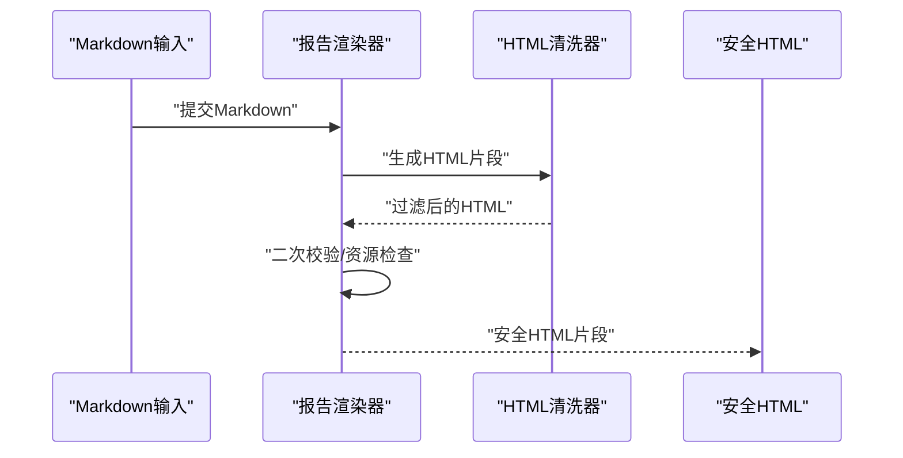
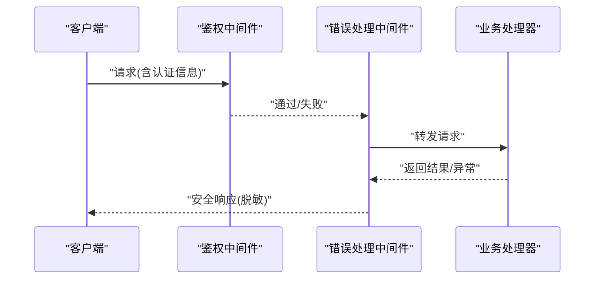
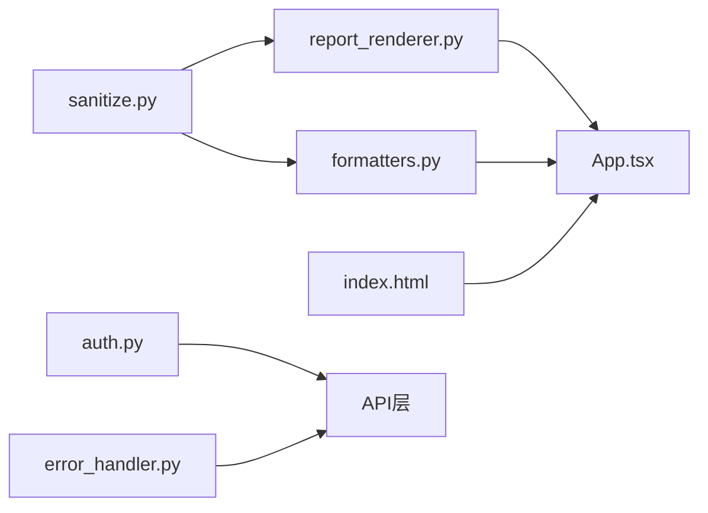

# XSS防护机制

<cite>
**本文档引用的文件**   
- [sanitize.py](file://src/utils/sanitize.py)
- [error_handler.py](file://api/middlewares/error_handler.py)
- [auth.py](file://api/middlewares/auth.py)
- [App.tsx](file://apps/dsa-web/src/App.tsx)
- [index.html](file://apps/dsa-web/index.html)
- [report_renderer.py](file://src/services/report_renderer.py)
- [formatters.py](file://src/formatters.py)
- [md2img.py](file://src/md2img.py)
- [test_cwe345_xff_bypass.py](file://tests/test_cwe345_xff_bypass.py)
</cite>

## 目录
1. [简介](#简介)
2. [项目结构](#项目结构)
3. [核心组件](#核心组件)
4. [架构总览](#架构总览)
5. [详细组件分析](#详细组件分析)
6. [依赖关系分析](#依赖关系分析)
7. [性能考虑](#性能考虑)
8. [故障排查指南](#故障排查指南)
9. [结论](#结论)
10. [附录](#附录)

## 简介
本文件面向Daily Stock Analysis项目的XSS（跨站脚本）防护机制，系统性梳理输入检测、HTML过滤、输出编码与CSP配置等关键安全能力。文档覆盖：
- 脚本注入检测：JavaScript代码识别、事件处理器检测、URL编码攻击防护
- HTML过滤实现：危险标签移除、属性白名单过滤、CSS样式安全处理
- 输出编码机制：上下文相关编码策略、特殊字符转义与安全渲染
- CSP（内容安全策略）配置：脚本来源限制、内联脚本禁用、资源加载控制
- 最佳实践与测试方法：常见攻击向量演示与防御效果验证

## 项目结构
本项目在前后端均具备与XSS防护相关的实现点：
- 后端Python侧提供通用清洗/格式化能力与错误处理中间件
- 前端Web应用通过模板与页面入口进行安全渲染与CSP设置
- 报告渲染与Markdown转换模块承担富文本到安全输出的转换职责

图表来源
- [error_handler.py](file://api/middlewares/error_handler.py)
- [auth.py](file://api/middlewares/auth.py)
- [report_renderer.py](file://src/services/report_renderer.py)
- [formatters.py](file://src/formatters.py)
- [sanitize.py](file://src/utils/sanitize.py)
- [index.html](file://apps/dsa-web/index.html)
- [App.tsx](file://apps/dsa-web/src/App.tsx)

章节来源
- [error_handler.py](file://api/middlewares/error_handler.py)
- [auth.py](file://api/middlewares/auth.py)
- [report_renderer.py](file://src/services/report_renderer.py)
- [formatters.py](file://src/formatters.py)
- [sanitize.py](file://src/utils/sanitize.py)
- [index.html](file://apps/dsa-web/index.html)
- [App.tsx](file://apps/dsa-web/src/App.tsx)

## 核心组件
- 输入清洗与HTML过滤：集中式工具函数负责危险标签移除、属性白名单校验、CSS样式安全处理
- 输出编码与上下文转义：根据数据落点（HTML正文、属性、JS字符串、URL参数）选择对应编码策略
- 报告渲染与Markdown转换：将用户或系统生成的富文本转换为安全的HTML片段，避免直接拼接
- API中间件：统一错误处理与鉴权，拦截异常请求并返回安全响应体
- 前端安全渲染：在页面入口与应用根组件中启用安全默认值与CSP头

章节来源
- [sanitize.py](file://src/utils/sanitize.py)
- [report_renderer.py](file://src/services/report_renderer.py)
- [formatters.py](file://src/formatters.py)
- [error_handler.py](file://api/middlewares/error_handler.py)
- [auth.py](file://api/middlewares/auth.py)
- [index.html](file://apps/dsa-web/index.html)
- [App.tsx](file://apps/dsa-web/src/App.tsx)

## 架构总览
下图展示从请求进入、输入清洗、富文本渲染到最终安全输出的整体流程，以及CSP在前端的生效位置。

图表来源
- [error_handler.py](file://api/middlewares/error_handler.py)
- [auth.py](file://api/middlewares/auth.py)
- [report_renderer.py](file://src/services/report_renderer.py)
- [formatters.py](file://src/formatters.py)
- [sanitize.py](file://src/utils/sanitize.py)
- [index.html](file://apps/dsa-web/index.html)
- [App.tsx](file://apps/dsa-web/src/App.tsx)

## 详细组件分析

### 输入检测与脚本注入防护
- JavaScript代码识别：对输入进行模式匹配与关键字扫描，识别常见的脚本注入特征（如事件处理器、内联脚本、协议滥用等）
- 事件处理器检测：针对on*事件属性进行白名单校验，拒绝非预期事件
- URL编码攻击防护：对URL参数进行解码后再检测，防止二次编码绕过；必要时使用严格白名单与长度限制

图表来源
- [sanitize.py](file://src/utils/sanitize.py)
- [error_handler.py](file://api/middlewares/error_handler.py)

章节来源
- [sanitize.py](file://src/utils/sanitize.py)
- [error_handler.py](file://api/middlewares/error_handler.py)

### HTML过滤实现
- 危险标签移除：移除script、iframe、object、embed等高风险标签及其嵌套内容
- 属性白名单过滤：仅允许安全属性（如class、id、style中的受限子集），拒绝on*事件与javascript:协议
- CSS样式安全处理：剥离危险CSS（如expression、behavior、@import），限制url()取值范围，避免样式注入

图表来源
- [sanitize.py](file://src/utils/sanitize.py)
- [formatters.py](file://src/formatters.py)

章节来源
- [sanitize.py](file://src/utils/sanitize.py)
- [formatters.py](file://src/formatters.py)

### 输出编码机制
- 上下文相关编码策略：
  - HTML正文：实体转义（< > & " '）
  - HTML属性：按属性类型选择合适转义，禁止未经验证的数据直接拼接
  - JS字符串：使用JSON序列化或专用编码器，避免单双引号逃逸
  - URL参数：百分号编码与白名单校验
- 安全渲染：优先使用框架提供的安全API，避免innerHTML等不安全写入

图表来源
- [report_renderer.py](file://src/services/report_renderer.py)
- [formatters.py](file://src/formatters.py)
- [md2img.py](file://src/md2img.py)

章节来源
- [report_renderer.py](file://src/services/report_renderer.py)
- [formatters.py](file://src/formatters.py)
- [md2img.py](file://src/md2img.py)

### CSP（内容安全策略）配置
- 脚本来源限制：仅允许来自可信CDN与同源脚本，禁止任意外部脚本执行
- 内联脚本禁用：通过nonce或哈希白名单严格控制内联脚本
- 资源加载控制：限制图片、样式、字体等资源的来源，避免恶意资源加载

图表来源
- [index.html](file://apps/dsa-web/index.html)
- [App.tsx](file://apps/dsa-web/src/App.tsx)

章节来源
- [index.html](file://apps/dsa-web/index.html)
- [App.tsx](file://apps/dsa-web/src/App.tsx)

### 报告渲染与Markdown转换
- Markdown到HTML的转换需启用严格的HTML过滤器，确保生成的HTML片段符合白名单
- 图片与媒体资源需校验来源与尺寸，避免注入恶意资源
- 渲染结果应进行二次校验，确保无残留危险标签或属性

图表来源
- [report_renderer.py](file://src/services/report_renderer.py)
- [md2img.py](file://src/md2img.py)
- [sanitize.py](file://src/utils/sanitize.py)

章节来源
- [report_renderer.py](file://src/services/report_renderer.py)
- [md2img.py](file://src/md2img.py)
- [sanitize.py](file://src/utils/sanitize.py)

### API中间件与错误处理
- 统一错误处理：捕获异常并返回标准化错误响应，避免泄露敏感信息
- 鉴权中间件：校验请求身份与权限，阻止未授权访问
- 输入校验：对关键接口进行参数校验与长度限制，减少注入面

图表来源
- [auth.py](file://api/middlewares/auth.py)
- [error_handler.py](file://api/middlewares/error_handler.py)

章节来源
- [auth.py](file://api/middlewares/auth.py)
- [error_handler.py](file://api/middlewares/error_handler.py)

## 依赖关系分析
- 工具层（sanitize.py）被服务层（report_renderer.py、formatters.py）复用，形成统一的HTML过滤与转义能力
- 前端（index.html、App.tsx）通过CSP与框架安全API保障渲染安全
- 中间件（auth.py、error_handler.py）为所有API请求提供统一的安全基线

图表来源
- [sanitize.py](file://src/utils/sanitize.py)
- [report_renderer.py](file://src/services/report_renderer.py)
- [formatters.py](file://src/formatters.py)
- [index.html](file://apps/dsa-web/index.html)
- [App.tsx](file://apps/dsa-web/src/App.tsx)
- [auth.py](file://api/middlewares/auth.py)
- [error_handler.py](file://api/middlewares/error_handler.py)

章节来源
- [sanitize.py](file://src/utils/sanitize.py)
- [report_renderer.py](file://src/services/report_renderer.py)
- [formatters.py](file://src/formatters.py)
- [index.html](file://apps/dsa-web/index.html)
- [App.tsx](file://apps/dsa-web/src/App.tsx)
- [auth.py](file://api/middlewares/auth.py)
- [error_handler.py](file://api/middlewares/error_handler.py)

## 性能考虑
- 输入清洗与HTML过滤应在靠近输入边界处尽早执行，避免后续链路重复处理
- 缓存常用白名单与正则表达式，降低CPU开销
- 对大段Markdown渲染进行分块处理与异步化，避免阻塞主线程
- 前端CSP校验由浏览器完成，无需额外运行时开销

[本节为通用指导，不直接分析具体文件]

## 故障排查指南
- 常见症状：页面出现弹窗、控制台报错、资源加载失败
- 排查步骤：
  - 检查CSP日志与浏览器开发者工具的“安全”面板
  - 审查输入清洗规则是否过于宽松或过严
  - 确认输出编码是否正确应用于各上下文
  - 验证中间件是否拦截了异常请求并返回安全响应
- 参考测试用例：可结合现有测试文件复现与验证修复效果

章节来源
- [test_cwe345_xff_bypass.py](file://tests/test_cwe345_xff_bypass.py)

## 结论
通过输入检测、HTML过滤、输出编码与CSP的多层防护，Daily Stock Analysis项目在前后端构建了较为完整的XSS防御体系。建议持续完善白名单策略、加强测试覆盖，并在CI中集成自动化安全扫描与渗透测试。

[本节为总结性内容，不直接分析具体文件]

## 附录
- 最佳实践清单：
  - 始终对用户输入进行最小权限假设与白名单校验
  - 使用框架提供的安全API进行渲染，避免手动拼接HTML/JS
  - 定期更新CSP策略与依赖库，关注安全公告
  - 建立XSS测试用例库，覆盖常见攻击向量
- 测试方法建议：
  - 使用模糊测试与语义化测试结合，覆盖边界条件
  - 引入静态分析与动态扫描工具，纳入CI流水线
  - 定期进行红蓝对抗演练，验证防护有效性

[本节为补充说明，不直接分析具体文件]