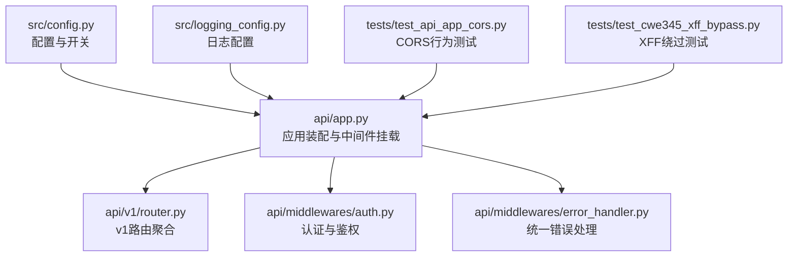
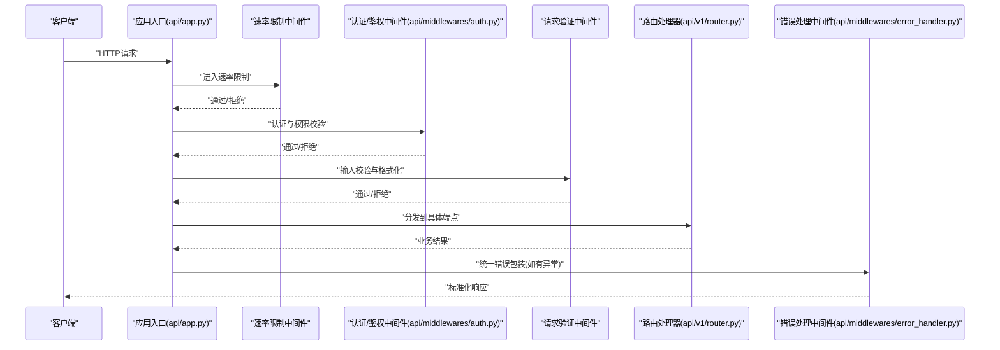
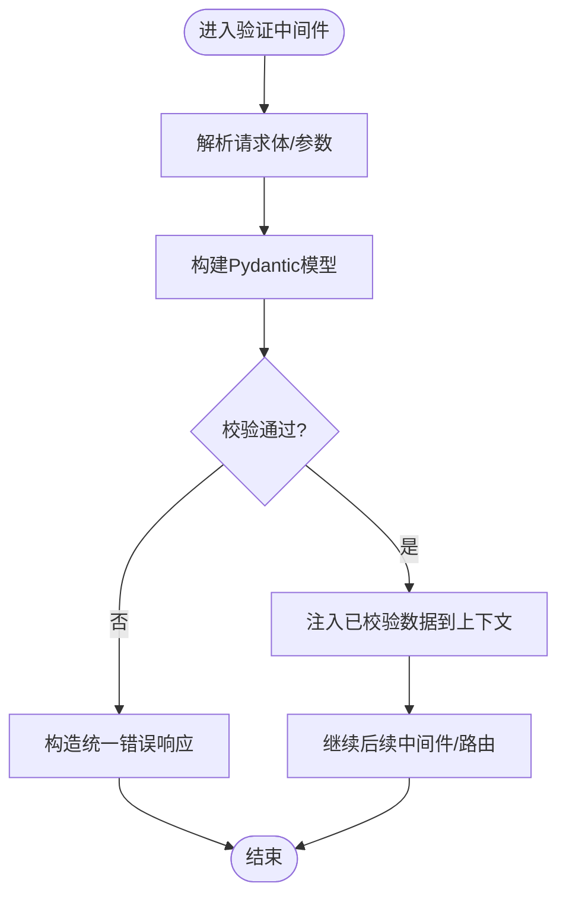
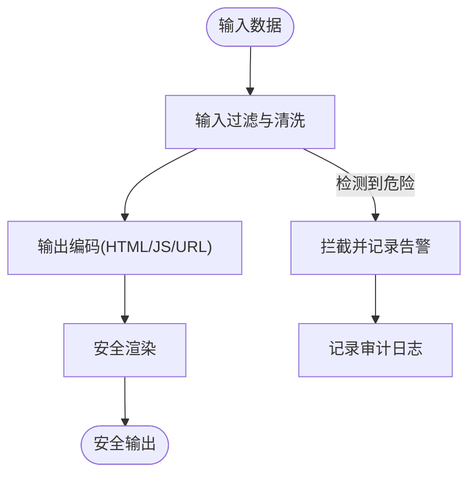
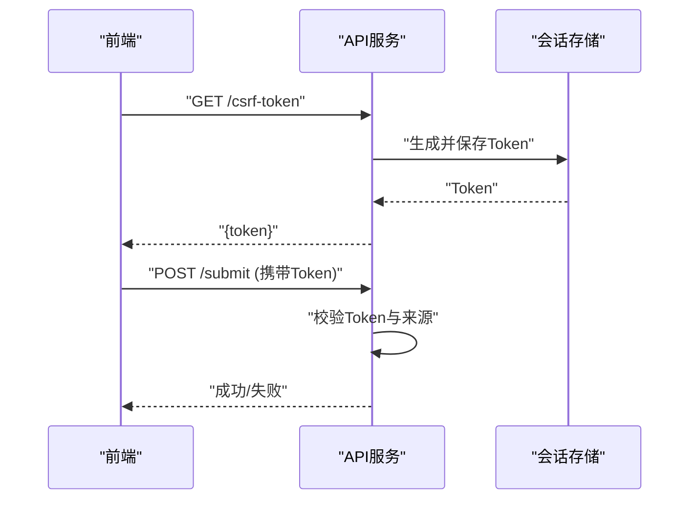
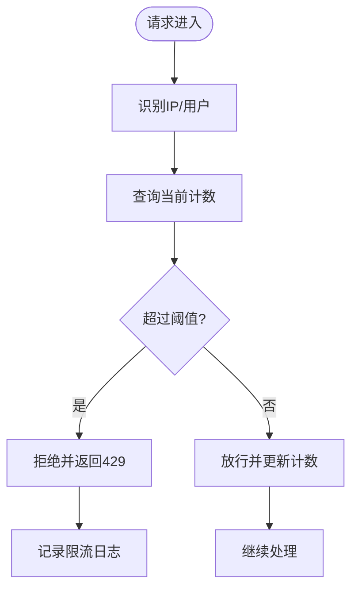
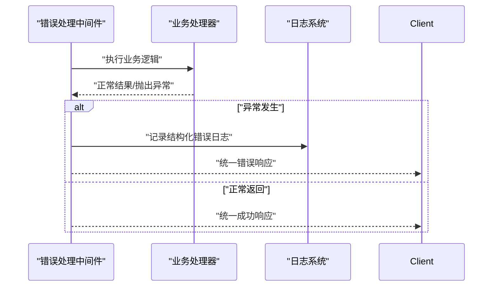
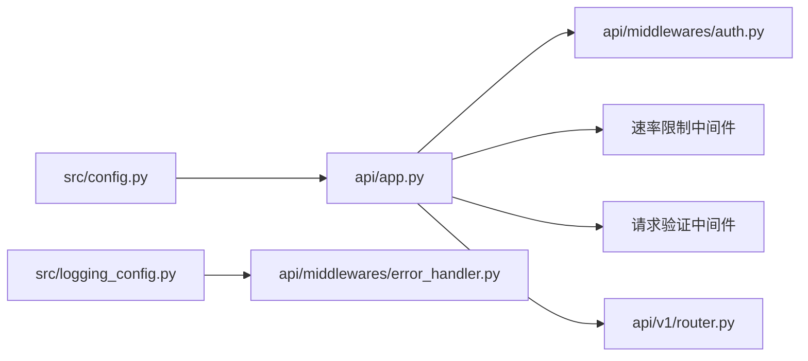

# 中间件安全防护

<cite>
**本文档引用的文件**   
- [api/app.py](file://api/app.py)
- [api/middlewares/auth.py](file://api/middlewares/auth.py)
- [api/middlewares/error_handler.py](file://api/middlewares/error_handler.py)
- [api/v1/router.py](file://api/v1/router.py)
- [src/config.py](file://src/config.py)
- [src/logging_config.py](file://src/logging_config.py)
- [tests/test_api_app_cors.py](file://tests/test_api_app_cors.py)
- [tests/test_cwe345_xff_bypass.py](file://tests/test_cwe345_xff_bypass.py)
</cite>

## 目录
1. [简介](#简介)
2. [项目结构](#项目结构)
3. [核心组件](#核心组件)
4. [架构总览](#架构总览)
5. [详细组件分析](#详细组件分析)
6. [依赖关系分析](#依赖关系分析)
7. [性能考虑](#性能考虑)
8. [故障排查指南](#故障排查指南)
9. [结论](#结论)
10. [附录](#附录)

## 简介
本文件面向Daily Stock Analysis项目的API层，聚焦于“中间件安全防护”的完整设计与实现说明。内容覆盖：
- 请求验证中间件：输入数据校验、类型检查与格式验证
- XSS防护机制：脚本注入检测、HTML过滤与输出编码
- CSRF保护：令牌生成、验证与跨域请求处理
- 速率限制中间件：IP限流、用户限流与API调用频率控制
- 错误处理中间件：异常捕获、错误日志记录与统一响应格式
- 中间件配置与管理：启用/禁用、参数调优与性能监控

本说明既适合开发者深入理解实现细节，也便于运维与非技术读者把握安全策略与使用方式。

## 项目结构
API层采用分层组织：应用入口、路由注册、中间件与业务端点分离。关键路径如下：
- API应用装配与全局中间件挂载点位于 api/app.py
- v1路由聚合与版本化接口定义在 api/v1/router.py
- 认证与鉴权相关逻辑集中在 api/middlewares/auth.py
- 统一错误处理与异常转译在 api/middlewares/error_handler.py
- 系统配置与开关项由 src/config.py 管理
- 日志配置与级别设置在 src/logging_config.py
- 相关测试用例用于验证CORS行为与XFF绕过等安全场景

图表来源
- [api/app.py](file://api/app.py)
- [api/v1/router.py](file://api/v1/router.py)
- [api/middlewares/auth.py](file://api/middlewares/auth.py)
- [api/middlewares/error_handler.py](file://api/middlewares/error_handler.py)
- [src/config.py](file://src/config.py)
- [src/logging_config.py](file://src/logging_config.py)
- [tests/test_api_app_cors.py](file://tests/test_api_app_cors.py)
- [tests/test_cwe345_xff_bypass.py](file://tests/test_cwe345_xff_bypass.py)

章节来源
- [api/app.py](file://api/app.py)
- [api/v1/router.py](file://api/v1/router.py)
- [api/middlewares/auth.py](file://api/middlewares/auth.py)
- [api/middlewares/error_handler.py](file://api/middlewares/error_handler.py)
- [src/config.py](file://src/config.py)
- [src/logging_config.py](file://src/logging_config.py)

## 核心组件
- 请求验证中间件
  - 职责：对请求体、查询参数、路径参数进行严格的类型与格式校验；拒绝非法输入并返回标准化错误。
  - 关键点：基于Pydantic的数据模型校验（字段类型、范围、枚举、正则）、白名单字段、必填校验、默认值处理。
- XSS防护机制
  - 职责：防止脚本注入与恶意HTML渲染；对输入进行清洗，对输出进行编码。
  - 关键点：输入侧过滤危险标签与事件处理器，输出侧按上下文编码（HTML/JS/CSS/URL），避免直接拼接用户可控字符串。
- CSRF保护
  - 职责：确保跨站请求为同源合法提交；提供令牌生成、校验与跨域处理。
  - 关键点：CSRF Token生成与绑定会话/用户；表单或Header携带Token；跨域时严格校验Origin与Referer。
- 速率限制中间件
  - 职责：限制单位时间内的请求次数，防止滥用与暴力破解。
  - 关键点：支持按IP与用户维度限流；可配置窗口大小与阈值；超限返回标准错误码与重试提示。
- 错误处理中间件
  - 职责：集中捕获异常，记录结构化日志，返回统一JSON错误格式。
  - 关键点：区分客户端错误与服务端错误；脱敏敏感信息；附带追踪ID便于排障。

章节来源
- [api/middlewares/auth.py](file://api/middlewares/auth.py)
- [api/middlewares/error_handler.py](file://api/middlewares/error_handler.py)
- [src/config.py](file://src/config.py)
- [src/logging_config.py](file://src/logging_config.py)

## 架构总览
下图展示请求进入应用后，经过各中间件的顺序与职责分工，以及最终到达路由处理器的流程。

图表来源
- [api/app.py](file://api/app.py)
- [api/middlewares/auth.py](file://api/middlewares/auth.py)
- [api/middlewares/error_handler.py](file://api/middlewares/error_handler.py)
- [api/v1/router.py](file://api/v1/router.py)

## 详细组件分析

### 请求验证中间件（输入校验、类型检查、格式验证）
- 设计要点
  - 以Pydantic模型作为契约，强制字段类型、范围与格式；未命中则快速失败。
  - 支持查询参数、请求体、路径参数的分别校验；合并错误信息便于前端修复。
  - 对可选字段设置合理默认值，避免空指针与类型不一致。
- 典型流程
  - 解析请求体/参数 -> 模型实例化 -> 校验规则执行 -> 成功则注入已校验数据，失败则返回统一错误。
- 建议扩展
  - 增加自定义校验器（如股票代码格式、日期范围、金额精度）。
  - 针对大体积请求启用流式解析与最大负载限制。

章节来源
- [api/app.py](file://api/app.py)
- [api/v1/router.py](file://api/v1/router.py)

### XSS防护机制（脚本注入检测、HTML过滤、输出编码）
- 设计要点
  - 输入侧：对富文本与用户输入进行白名单过滤，移除危险标签与事件处理器。
  - 输出侧：根据上下文选择编码策略（HTML实体编码、JS转义、URL编码），避免直接拼接。
  - 传输层：配合CSP与Content-Type声明，降低渲染风险。
- 常见场景
  - 报告内容、评论、搜索关键词等用户可控内容的渲染。
  - 第三方数据源引入的内容需二次净化。
- 测试保障
  - 通过专项测试覆盖XSS绕过路径（如XFF、编码混淆等）。

章节来源
- [tests/test_cwe345_xff_bypass.py](file://tests/test_cwe345_xff_bypass.py)

### CSRF保护（令牌生成、验证、跨域处理）
- 设计要点
  - 服务端生成一次性CSRF Token并与会话绑定；前端在表单或请求头中携带。
  - 服务端校验Token有效性、时效性与来源一致性。
  - 跨域请求严格校验Origin/Referer，必要时仅允许特定域名。
- 集成方式
  - 在需要状态变更的接口前插入CSRF校验中间件。
  - 对静态资源与只读接口豁免，减少开销。
- 最佳实践
  - 短生命周期Token；刷新策略；与SameSite Cookie协同。

章节来源
- [api/app.py](file://api/app.py)
- [api/v1/router.py](file://api/v1/router.py)

### 速率限制中间件（IP限流、用户限流、API频率控制）
- 设计要点
  - 支持按IP与用户标识双维度限流；可配置滑动窗口或固定窗口算法。
  - 超限返回标准状态码与重试提示；支持白名单与降级策略。
  - 结合Redis或内存计数器实现分布式或单机限流。
- 配置项建议
  - 每IP每分钟请求上限、每用户每分钟上限、全局峰值限制。
  - 不同端点差异化配额（如分析接口更严格）。
- 监控与告警
  - 统计被拒请求数、热点IP、异常突增；联动告警。

章节来源
- [api/app.py](file://api/app.py)
- [src/config.py](file://src/config.py)

### 错误处理中间件（异常捕获、错误日志、统一响应）
- 设计要点
  - 全局捕获未处理异常，转换为统一JSON错误结构。
  - 区分客户端错误（4xx）与服务端错误（5xx），脱敏敏感信息。
  - 记录结构化日志（含请求ID、路径、耗时、错误堆栈摘要）。
- 统一响应格式
  - 包含code、message、data、traceId等字段，便于前端一致处理。
- 调试与观测
  - 开启详细日志模式便于定位；生产环境关闭敏感堆栈。

章节来源
- [api/middlewares/error_handler.py](file://api/middlewares/error_handler.py)
- [src/logging_config.py](file://src/logging_config.py)

### 认证与鉴权中间件（补充说明）
- 职责：校验身份令牌、权限范围、访问控制；将用户上下文注入后续中间件与处理器。
- 关键点：令牌签名验证、过期处理、角色/权限矩阵；失败返回标准401/403。

章节来源
- [api/middlewares/auth.py](file://api/middlewares/auth.py)

## 依赖关系分析
- 中间件装配依赖应用入口，路由聚合依赖中间件链的顺序。
- 配置中心驱动中间件行为（如是否启用限流、CSRF、XSS过滤）。
- 日志系统贯穿错误处理与审计记录。

图表来源
- [src/config.py](file://src/config.py)
- [src/logging_config.py](file://src/logging_config.py)
- [api/app.py](file://api/app.py)
- [api/middlewares/auth.py](file://api/middlewares/auth.py)
- [api/middlewares/error_handler.py](file://api/middlewares/error_handler.py)
- [api/v1/router.py](file://api/v1/router.py)

章节来源
- [src/config.py](file://src/config.py)
- [src/logging_config.py](file://src/logging_config.py)
- [api/app.py](file://api/app.py)

## 性能考虑
- 中间件顺序优化：将轻量级校验前置，重计算后置，减少无效处理。
- 限流算法选择：滑动窗口更平滑但开销略高；固定窗口简单高效。
- 缓存策略：对高频只读接口启用短期缓存；注意缓存失效与一致性。
- 日志采样：生产环境对高频日志采样，避免I/O瓶颈。
- 资源隔离：对耗时操作使用异步或线程池，避免阻塞请求链路。

## 故障排查指南
- CORS相关问题
  - 现象：浏览器报跨域错误或预检失败。
  - 排查：检查允许的源、方法、头部；确认测试用例覆盖预期行为。
- XFF绕过问题
  - 现象：伪造来源IP导致限流或鉴权失效。
  - 排查：确认反向代理信任链与XFF处理逻辑；参考绕过测试用例。
- 限流失误
  - 现象：正常请求被误拦或攻击流量未被拦截。
  - 排查：核对阈值、窗口算法、键空间（IP/用户）；观察限流日志。
- 错误响应不一致
  - 现象：前端无法统一处理错误。
  - 排查：检查错误中间件是否生效、日志是否脱敏、traceId是否传递。

章节来源
- [tests/test_api_app_cors.py](file://tests/test_api_app_cors.py)
- [tests/test_cwe345_xff_bypass.py](file://tests/test_cwe345_xff_bypass.py)
- [api/middlewares/error_handler.py](file://api/middlewares/error_handler.py)

## 结论
通过分层中间件体系，Daily Stock Analysis在请求验证、XSS防护、CSRF保护、速率限制与错误处理方面形成了闭环的安全策略。建议在上线前完成以下工作：
- 完善配置项与开关，按环境差异化部署
- 补充端到端安全测试用例（含边界与异常）
- 建立监控与告警（限流、错误率、延迟）
- 定期审计与渗透测试，持续加固

## 附录
- 配置建议清单
  - 启用/禁用：限流、CSRF、XSS过滤、详细日志
  - 参数调优：窗口大小、阈值、超时、最大负载
  - 监控指标：QPS、错误率、限流拒绝率、P95/P99延迟
- 最佳实践
  - 最小权限原则、纵深防御、零信任思路
  - 输入即污染、输出即编码、配置即代码
  - 可观测性优先：日志、指标、追踪三位一体