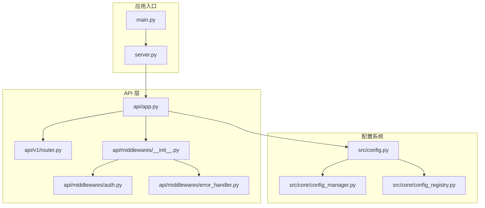
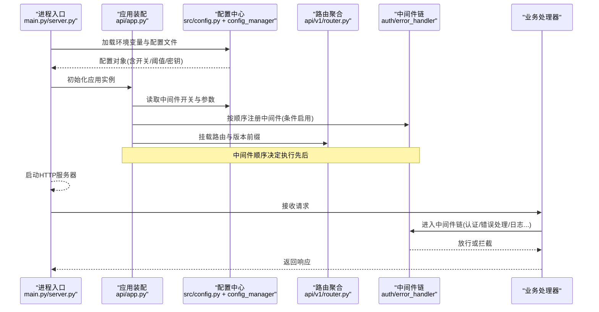
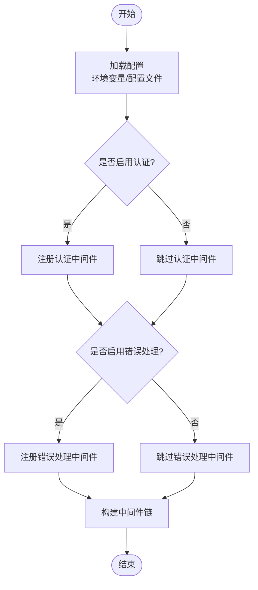
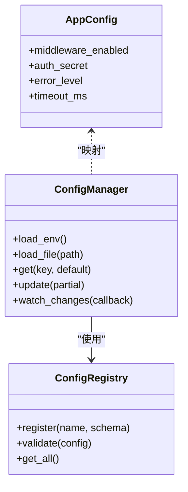
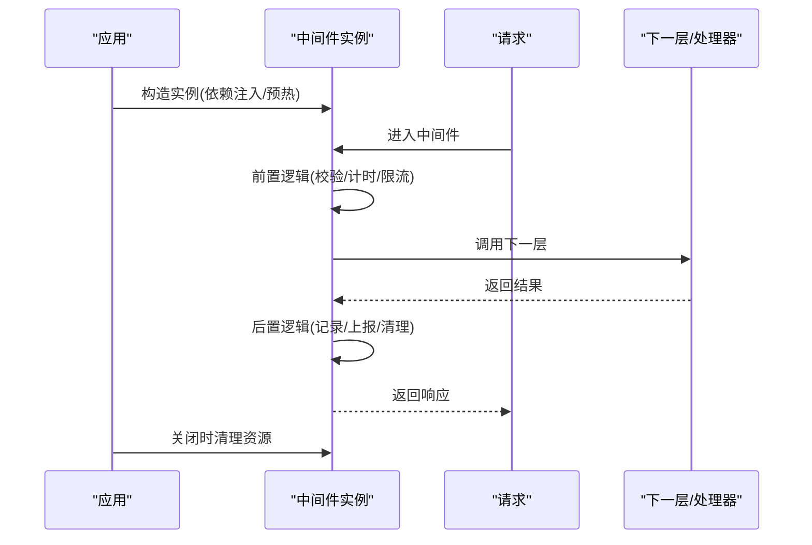
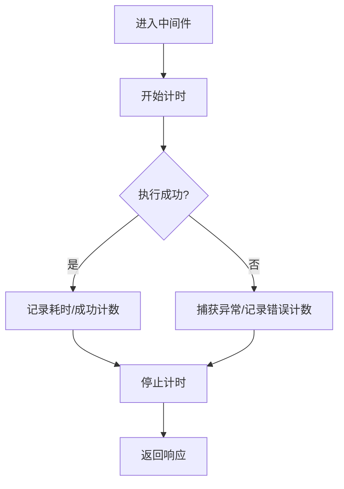
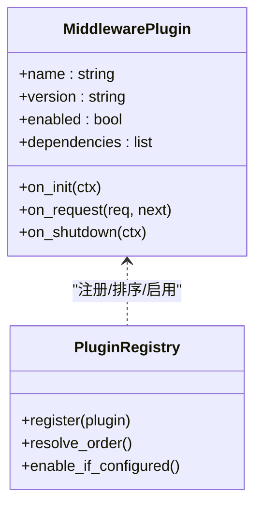
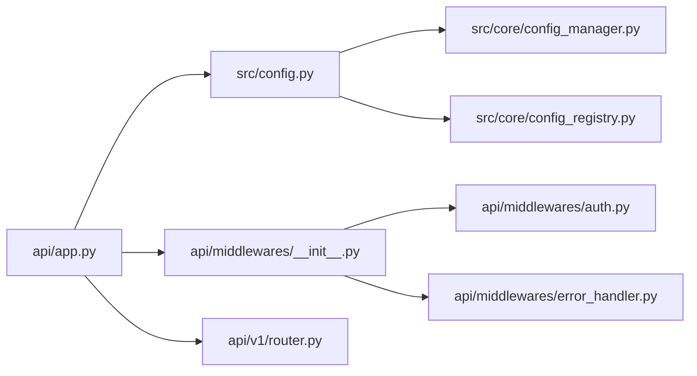

# 中间件配置管理

<cite>
**本文引用的文件**   
- [api/app.py](file://api/app.py)
- [api/middlewares/__init__.py](file://api/middlewares/__init__.py)
- [api/middlewares/auth.py](file://api/middlewares/auth.py)
- [api/middlewares/error_handler.py](file://api/middlewares/error_handler.py)
- [api/v1/router.py](file://api/v1/router.py)
- [src/config.py](file://src/config.py)
- [src/core/config_manager.py](file://src/core/config_manager.py)
- [src/core/config_registry.py](file://src/core/config_registry.py)
- [server.py](file://server.py)
- [main.py](file://main.py)
</cite>

## 目录
1. [简介](#简介)
2. [项目结构](#项目结构)
3. [核心组件](#核心组件)
4. [架构总览](#架构总览)
5. [详细组件分析](#详细组件分析)
6. [依赖关系分析](#依赖关系分析)
7. [性能考虑](#性能考虑)
8. [故障排查指南](#故障排查指南)
9. [结论](#结论)
10. [附录](#附录)

## 简介
本文件围绕 Daily Stock Analysis 项目的“中间件配置管理”进行系统化说明，重点覆盖：
- 中间件注册机制：启动顺序控制、依赖关系管理、条件启用
- 配置参数管理：环境变量读取、配置文件解析、运行时配置更新
- 中间件生命周期：初始化过程、请求处理流程、资源清理
- 性能监控集成：请求耗时统计、错误率监控、资源使用情况
- 扩展指南：自定义中间件开发、插件接口定义、第三方中间件集成

目标读者包括后端开发者、运维人员与系统集成工程师。文档以代码级事实为依据，辅以架构图与时序图帮助理解。

## 项目结构
本项目采用分层组织方式：API 层负责路由与中间件装配，核心配置由配置中心统一管理，应用入口负责服务启动与全局初始化。关键路径如下：
- API 应用与中间件：api/app.py、api/middlewares/*
- 路由聚合：api/v1/router.py
- 配置系统：src/config.py、src/core/config_manager.py、src/core/config_registry.py
- 应用入口：server.py、main.py

**图表来源** 
- [api/app.py](file://api/app.py)
- [api/middlewares/__init__.py](file://api/middlewares/__init__.py)
- [api/middlewares/auth.py](file://api/middlewares/auth.py)
- [api/middlewares/error_handler.py](file://api/middlewares/error_handler.py)
- [api/v1/router.py](file://api/v1/router.py)
- [src/config.py](file://src/config.py)
- [src/core/config_manager.py](file://src/core/config_manager.py)
- [src/core/config_registry.py](file://src/core/config_registry.py)
- [server.py](file://server.py)
- [main.py](file://main.py)

**章节来源**
- [api/app.py](file://api/app.py)
- [api/middlewares/__init__.py](file://api/middlewares/__init__.py)
- [api/middlewares/auth.py](file://api/middlewares/auth.py)
- [api/middlewares/error_handler.py](file://api/middlewares/error_handler.py)
- [api/v1/router.py](file://api/v1/router.py)
- [src/config.py](file://src/config.py)
- [src/core/config_manager.py](file://src/core/config_manager.py)
- [src/core/config_registry.py](file://src/core/config_registry.py)
- [server.py](file://server.py)
- [main.py](file://main.py)

## 核心组件
- 应用装配器（api/app.py）：创建并挂载中间件、注册路由、注入依赖。
- 中间件集合（api/middlewares/*）：认证鉴权、错误处理等通用能力。
- 路由聚合（api/v1/router.py）：按版本/模块聚合路由，便于中间件作用域控制。
- 配置中心（src/config.py + src/core/*）：统一加载环境变量与配置文件，提供运行时更新能力。

这些组件共同构成“配置驱动、按需启用、顺序可控”的中间件体系。

**章节来源**
- [api/app.py](file://api/app.py)
- [api/middlewares/__init__.py](file://api/middlewares/__init__.py)
- [api/middlewares/auth.py](file://api/middlewares/auth.py)
- [api/middlewares/error_handler.py](file://api/middlewares/error_handler.py)
- [api/v1/router.py](file://api/v1/router.py)
- [src/config.py](file://src/config.py)
- [src/core/config_manager.py](file://src/core/config_manager.py)
- [src/core/config_registry.py](file://src/core/config_registry.py)

## 架构总览
下图展示从进程启动到请求处理的完整链路，以及配置如何影响中间件的启用与行为。

**图表来源** 
- [main.py](file://main.py)
- [server.py](file://server.py)
- [api/app.py](file://api/app.py)
- [src/config.py](file://src/config.py)
- [src/core/config_manager.py](file://src/core/config_manager.py)
- [api/v1/router.py](file://api/v1/router.py)
- [api/middlewares/auth.py](file://api/middlewares/auth.py)
- [api/middlewares/error_handler.py](file://api/middlewares/error_handler.py)

## 详细组件分析

### 中间件注册机制（启动顺序、依赖关系、条件启用）
- 启动顺序控制
  - 中间件在应用装配阶段按注册顺序入栈，先注册的先执行（外层），后注册的靠近业务处理器（内层）。
  - 建议将跨切面能力（如计时、限流、CORS、安全头）放在外层；将业务相关能力（如鉴权、租户隔离）放在内层。
- 依赖关系管理
  - 通过配置中心暴露的开关与参数，中间件之间形成隐式依赖。例如：认证中间件依赖密钥配置，错误处理依赖日志级别。
  - 建议在中间件初始化时校验依赖是否满足，不满足则跳过或降级。
- 条件启用
  - 基于环境变量或配置项动态决定是否启用某中间件（如仅在调试模式开启详细日志、仅在特定环境启用外部认证）。
  - 推荐集中式开关管理，避免分散 if/else 判断。

**图表来源** 
- [api/app.py](file://api/app.py)
- [api/middlewares/auth.py](file://api/middlewares/auth.py)
- [api/middlewares/error_handler.py](file://api/middlewares/error_handler.py)
- [src/config.py](file://src/config.py)
- [src/core/config_manager.py](file://src/core/config_manager.py)

**章节来源**
- [api/app.py](file://api/app.py)
- [api/middlewares/auth.py](file://api/middlewares/auth.py)
- [api/middlewares/error_handler.py](file://api/middlewares/error_handler.py)
- [src/config.py](file://src/config.py)
- [src/core/config_manager.py](file://src/core/config_manager.py)

### 配置参数管理（环境变量、配置文件、运行时更新）
- 环境变量读取
  - 通过配置中心统一读取环境变量，支持类型转换、默认值与校验。
  - 敏感信息（如密钥）应仅从环境变量注入，避免写入配置文件。
- 配置文件解析
  - 支持 YAML/JSON 等格式，提供键空间隔离与环境区分（dev/staging/prod）。
  - 配置文件变更可通过热重载或重新加载策略生效。
- 运行时配置更新
  - 提供配置快照与增量更新接口，允许在不重启的情况下调整非敏感参数（如日志级别、超时时间）。
  - 对已启用的中间件，需实现参数监听与动态刷新逻辑。

**图表来源** 
- [src/core/config_manager.py](file://src/core/config_manager.py)
- [src/core/config_registry.py](file://src/core/config_registry.py)
- [src/config.py](file://src/config.py)

**章节来源**
- [src/config.py](file://src/config.py)
- [src/core/config_manager.py](file://src/core/config_manager.py)
- [src/core/config_registry.py](file://src/core/config_registry.py)

### 中间件生命周期（初始化、请求处理、资源清理）
- 初始化过程
  - 应用启动时创建中间件实例，完成依赖注入、连接池初始化、缓存预热等。
  - 根据配置决定是否启用，未启用则直接跳过。
- 请求处理流程
  - 每个请求进入中间件链，依次执行前置逻辑（如鉴权、计时、限流），再调用下一层，最后执行后置逻辑（如记录耗时、上报指标）。
- 资源清理
  - 应用关闭时触发中间件的清理回调，释放数据库连接、关闭网络客户端、清空临时缓存等。

**图表来源** 
- [api/app.py](file://api/app.py)
- [api/middlewares/auth.py](file://api/middlewares/auth.py)
- [api/middlewares/error_handler.py](file://api/middlewares/error_handler.py)

**章节来源**
- [api/app.py](file://api/app.py)
- [api/middlewares/auth.py](file://api/middlewares/auth.py)
- [api/middlewares/error_handler.py](file://api/middlewares/error_handler.py)

### 性能监控集成（耗时统计、错误率、资源使用）
- 请求耗时统计
  - 在中间件外层包裹计时逻辑，记录起止时间并输出到日志或指标系统。
  - 可按端点维度聚合，便于定位慢接口。
- 错误率监控
  - 捕获异常并分类（业务错误/系统错误），上报错误计数与堆栈摘要。
  - 结合错误处理中间件统一格式化响应码与消息。
- 资源使用情况
  - 采集内存、CPU、线程数等指标，设置告警阈值。
  - 对长耗时任务引入异步化与队列化，避免阻塞主循环。

**图表来源** 
- [api/middlewares/error_handler.py](file://api/middlewares/error_handler.py)
- [api/app.py](file://api/app.py)

**章节来源**
- [api/middlewares/error_handler.py](file://api/middlewares/error_handler.py)
- [api/app.py](file://api/app.py)

### 扩展指南（自定义中间件、插件接口、第三方集成）
- 自定义中间件开发
  - 遵循统一的函数签名与上下文协议，确保可被框架编排。
  - 实现前置/后置钩子，保证幂等性与异常安全。
- 插件接口定义
  - 通过配置注册表声明插件元数据（名称、版本、依赖、开关）。
  - 提供生命周期回调（on_init/on_request/on_shutdown）。
- 第三方中间件集成
  - 封装适配层，屏蔽第三方库差异，统一错误与指标上报。
  - 通过环境变量与配置文件注入凭据与参数，避免硬编码。

**图表来源** 
- [src/core/config_registry.py](file://src/core/config_registry.py)
- [api/middlewares/__init__.py](file://api/middlewares/__init__.py)

**章节来源**
- [src/core/config_registry.py](file://src/core/config_registry.py)
- [api/middlewares/__init__.py](file://api/middlewares/__init__.py)

## 依赖关系分析
- 组件耦合
  - 应用装配器依赖配置中心获取开关与参数；中间件之间通过上下文共享状态。
  - 路由聚合与中间件解耦，便于按模块启用不同中间件集。
- 外部依赖
  - 配置中心可能依赖文件系统与环境变量；认证中间件可能依赖外部身份服务。
- 潜在循环依赖
  - 应避免中间件互相强引用，必要时通过事件总线或共享存储通信。

**图表来源** 
- [api/app.py](file://api/app.py)
- [api/middlewares/__init__.py](file://api/middlewares/__init__.py)
- [api/middlewares/auth.py](file://api/middlewares/auth.py)
- [api/middlewares/error_handler.py](file://api/middlewares/error_handler.py)
- [api/v1/router.py](file://api/v1/router.py)
- [src/config.py](file://src/config.py)
- [src/core/config_manager.py](file://src/core/config_manager.py)
- [src/core/config_registry.py](file://src/core/config_registry.py)

**章节来源**
- [api/app.py](file://api/app.py)
- [api/middlewares/__init__.py](file://api/middlewares/__init__.py)
- [api/middlewares/auth.py](file://api/middlewares/auth.py)
- [api/middlewares/error_handler.py](file://api/middlewares/error_handler.py)
- [api/v1/router.py](file://api/v1/router.py)
- [src/config.py](file://src/config.py)
- [src/core/config_manager.py](file://src/core/config_manager.py)
- [src/core/config_registry.py](file://src/core/config_registry.py)

## 性能考虑
- 中间件顺序优化
  - 将高开销的中间件（如复杂鉴权、外部调用）置于内层，减少不必要的执行路径。
- 并发与异步
  - 对 I/O 密集型操作使用异步或线程池，避免阻塞请求线程。
- 缓存与预热
  - 对静态配置、字典映射进行缓存；启动时预热常用资源。
- 指标与采样
  - 对高频指标进行采样，降低上报开销；对慢请求全量记录。

[本节为通用指导，无需源码引用]

## 故障排查指南
- 常见问题
  - 中间件未生效：检查配置开关与注册顺序；确认条件启用逻辑。
  - 认证失败：核对密钥与令牌来源；查看错误处理中间件的响应体。
  - 性能退化：检查耗时指标与错误率；定位慢中间件与外部依赖。
- 诊断步骤
  - 启用详细日志与追踪 ID，串联请求链路。
  - 逐步禁用中间件，缩小问题范围。
  - 使用健康检查端点验证依赖服务可用性。

**章节来源**
- [api/middlewares/error_handler.py](file://api/middlewares/error_handler.py)
- [api/middlewares/auth.py](file://api/middlewares/auth.py)
- [api/app.py](file://api/app.py)

## 结论
通过配置中心驱动的中间件体系，Daily Stock Analysis 实现了灵活的启动顺序控制、清晰的依赖管理与条件启用机制。结合生命周期管理与性能监控，系统在可扩展性、可观测性与稳定性方面具备良好基础。建议持续完善插件接口与指标体系，提升第三方集成体验与运维效率。

[本节为总结，无需源码引用]

## 附录
- 最佳实践
  - 将中间件职责单一化，避免在一个中间件中做过多事情。
  - 所有外部依赖通过配置注入，保持环境一致性。
  - 对关键路径增加熔断与重试策略，提高鲁棒性。
- 参考路径
  - 应用装配：[api/app.py](file://api/app.py)
  - 中间件实现：[api/middlewares/auth.py](file://api/middlewares/auth.py)、[api/middlewares/error_handler.py](file://api/middlewares/error_handler.py)
  - 配置中心：[src/config.py](file://src/config.py)、[src/core/config_manager.py](file://src/core/config_manager.py)、[src/core/config_registry.py](file://src/core/config_registry.py)
  - 入口与启动：[main.py](file://main.py)、[server.py](file://server.py)

[本节为附录，无需源码引用]