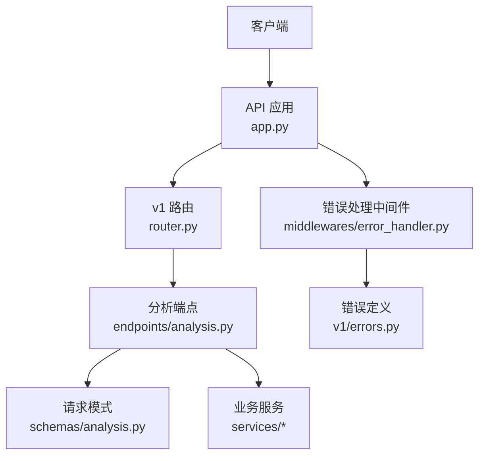
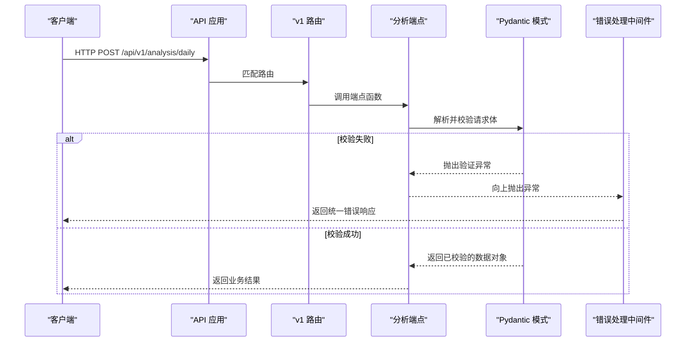
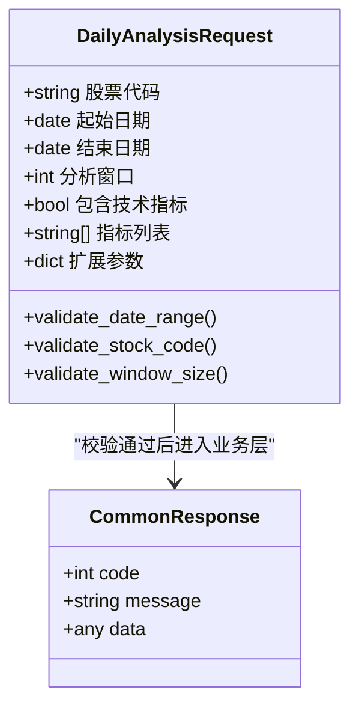
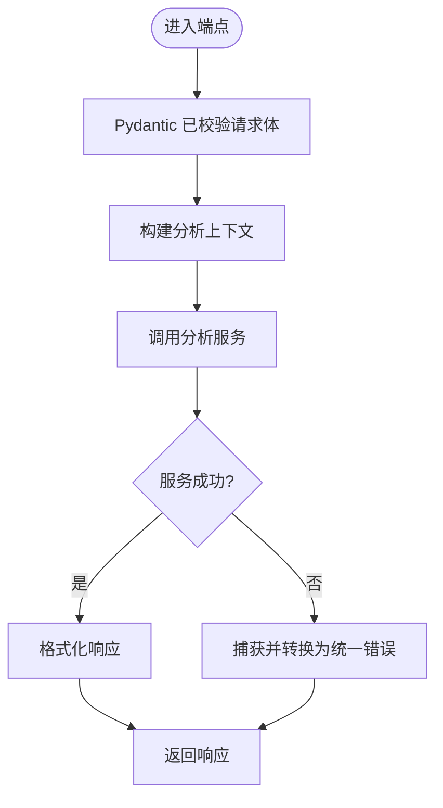
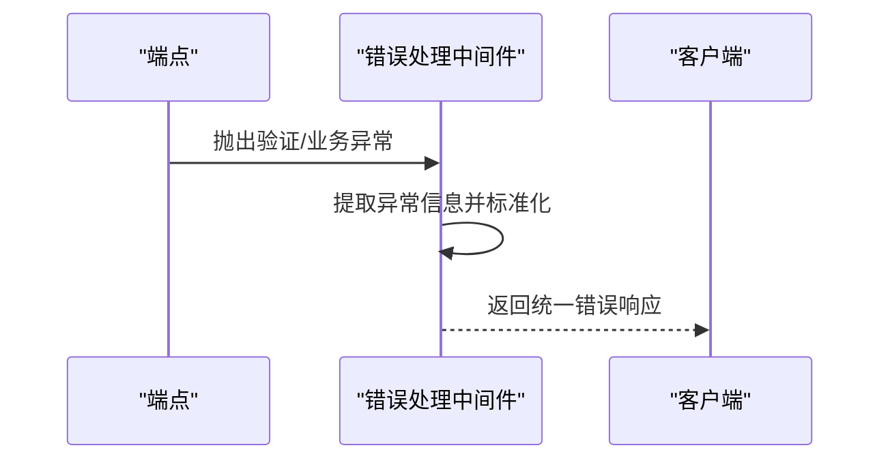
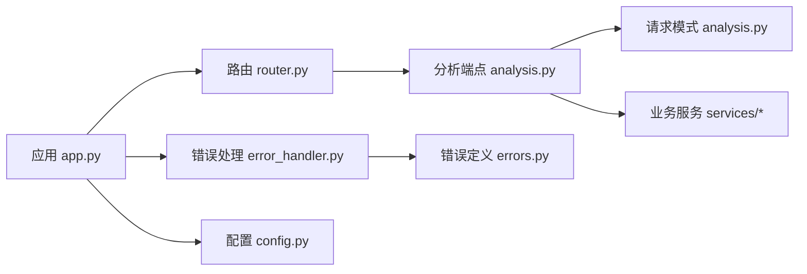

# 请求验证中间件

<cite>
**本文引用的文件**   
- [api/app.py](file://api/app.py)
- [api/middlewares/error_handler.py](file://api/middlewares/error_handler.py)
- [api/v1/router.py](file://api/v1/router.py)
- [api/v1/endpoints/analysis.py](file://api/v1/endpoints/analysis.py)
- [api/v1/schemas/analysis.py](file://api/v1/schemas/analysis.py)
- [api/v1/schemas/common.py](file://api/v1/schemas/common.py)
- [api/v1/errors.py](file://api/v1/errors.py)
- [src/config.py](file://src/config.py)
</cite>

## 目录
1. [简介](#简介)
2. [项目结构](#项目结构)
3. [核心组件](#核心组件)
4. [架构总览](#架构总览)
5. [详细组件分析](#详细组件分析)
6. [依赖关系分析](#依赖关系分析)
7. [性能考量](#性能考量)
8. [故障排查指南](#故障排查指南)
9. [结论](#结论)
10. [附录](#附录)

## 简介
本文件聚焦于“每日股票分析”（Daily Stock Analysis）接口的请求验证中间件，系统性说明输入数据校验机制、Pydantic 模型验证、字段类型与必填参数校验、请求体格式校验（JSON 结构、数据类型转换、默认值处理）、自定义业务规则验证（范围检查、格式规范）、以及错误响应统一格式与调试建议。文档同时提供配置示例与最佳实践，帮助开发者快速落地并优化验证流程。

## 项目结构
围绕 Daily Stock Analysis 的验证链路主要涉及以下模块：
- API 应用入口与路由注册：负责挂载中间件与路由
- 中间件层：统一错误处理与异常捕获
- 接口端点：定义请求路径与调用服务逻辑
- Pydantic 模式：定义请求体结构与校验规则
- 错误定义：统一的错误码与消息

图表来源
- [api/app.py](file://api/app.py)
- [api/v1/router.py](file://api/v1/router.py)
- [api/v1/endpoints/analysis.py](file://api/v1/endpoints/analysis.py)
- [api/v1/schemas/analysis.py](file://api/v1/schemas/analysis.py)
- [api/middlewares/error_handler.py](file://api/middlewares/error_handler.py)
- [api/v1/errors.py](file://api/v1/errors.py)

章节来源
- [api/app.py](file://api/app.py)
- [api/v1/router.py](file://api/v1/router.py)
- [api/v1/endpoints/analysis.py](file://api/v1/endpoints/analysis.py)
- [api/v1/schemas/analysis.py](file://api/v1/schemas/analysis.py)
- [api/middlewares/error_handler.py](file://api/middlewares/error_handler.py)
- [api/v1/errors.py](file://api/v1/errors.py)

## 核心组件
- Pydantic 请求模式：集中定义 Daily Stock Analysis 的请求体字段、类型、默认值与自定义校验器
- 端点函数：接收已校验的请求对象，执行业务逻辑
- 错误处理中间件：捕获验证异常与业务异常，返回统一错误格式
- 路由与中间件装配：在应用启动时注册路由与全局错误处理

章节来源
- [api/v1/schemas/analysis.py](file://api/v1/schemas/analysis.py)
- [api/v1/endpoints/analysis.py](file://api/v1/endpoints/analysis.py)
- [api/middlewares/error_handler.py](file://api/middlewares/error_handler.py)
- [api/v1/router.py](file://api/v1/router.py)

## 架构总览
下图展示了从客户端请求到 Pydantic 校验、再到错误处理的完整时序。

图表来源
- [api/v1/router.py](file://api/v1/router.py)
- [api/v1/endpoints/analysis.py](file://api/v1/endpoints/analysis.py)
- [api/v1/schemas/analysis.py](file://api/v1/schemas/analysis.py)
- [api/middlewares/error_handler.py](file://api/middlewares/error_handler.py)

## 详细组件分析

### Pydantic 模式与字段校验
- 字段类型检查：通过 Pydantic 模型声明字段类型，自动完成 JSON 到 Python 类型的转换与校验
- 必填参数验证：未提供必填字段将触发验证错误
- 默认值处理：为可选字段设置默认值，缺失时回退到默认值
- 自定义验证规则：使用 Pydantic 的 validator 或 field_validator 实现业务规则校验，如日期范围、股票代码格式、窗口长度限制等
- 嵌套结构与列表校验：对复杂请求体进行逐层校验，确保数组元素满足约束

图表来源
- [api/v1/schemas/analysis.py](file://api/v1/schemas/analysis.py)
- [api/v1/schemas/common.py](file://api/v1/schemas/common.py)

章节来源
- [api/v1/schemas/analysis.py](file://api/v1/schemas/analysis.py)
- [api/v1/schemas/common.py](file://api/v1/schemas/common.py)

### 端点函数与请求体处理
- 端点接收 Pydantic 已校验的请求对象，避免重复校验
- 根据请求参数构建上下文，调用服务层执行分析
- 对服务层返回结果进行封装，统一响应格式

图表来源
- [api/v1/endpoints/analysis.py](file://api/v1/endpoints/analysis.py)

章节来源
- [api/v1/endpoints/analysis.py](file://api/v1/endpoints/analysis.py)

### 错误处理中间件与统一错误格式
- 捕获 Pydantic 验证异常与业务异常
- 将异常转换为统一错误格式，包含错误码、消息与详情
- 保证所有错误响应具有一致的结构与可观测性

图表来源
- [api/middlewares/error_handler.py](file://api/middlewares/error_handler.py)
- [api/v1/errors.py](file://api/v1/errors.py)

章节来源
- [api/middlewares/error_handler.py](file://api/middlewares/error_handler.py)
- [api/v1/errors.py](file://api/v1/errors.py)

### 路由与中间件装配
- 在应用初始化时注册 v1 路由
- 挂载全局错误处理中间件，确保所有请求均经过统一错误处理
- 支持跨域、日志、限流等通用中间件的组合

章节来源
- [api/app.py](file://api/app.py)
- [api/v1/router.py](file://api/v1/router.py)

## 依赖关系分析
- 端点依赖 Pydantic 模式进行强类型校验
- 中间件依赖错误定义模块以输出一致的错误结构
- 路由依赖应用实例以挂载中间件与路由
- 配置模块影响行为（如是否启用严格校验、错误级别等）

图表来源
- [api/app.py](file://api/app.py)
- [api/v1/router.py](file://api/v1/router.py)
- [api/v1/endpoints/analysis.py](file://api/v1/endpoints/analysis.py)
- [api/v1/schemas/analysis.py](file://api/v1/schemas/analysis.py)
- [api/middlewares/error_handler.py](file://api/middlewares/error_handler.py)
- [api/v1/errors.py](file://api/v1/errors.py)
- [src/config.py](file://src/config.py)

章节来源
- [api/app.py](file://api/app.py)
- [api/v1/router.py](file://api/v1/router.py)
- [api/v1/endpoints/analysis.py](file://api/v1/endpoints/analysis.py)
- [api/v1/schemas/analysis.py](file://api/v1/schemas/analysis.py)
- [api/middlewares/error_handler.py](file://api/middlewares/error_handler.py)
- [api/v1/errors.py](file://api/v1/errors.py)
- [src/config.py](file://src/config.py)

## 性能考量
- 减少不必要的深拷贝与重复校验：利用 Pydantic 一次性校验与类型转换
- 合理设置默认值与可选字段，降低无效请求的处理开销
- 对大体积请求体进行分块或分页策略，避免内存峰值
- 在自定义校验中避免阻塞 I/O，必要时异步化
- 开启合理的超时与重试策略，提升整体吞吐

## 故障排查指南
- 常见验证失败原因
  - 缺少必填字段：检查请求体是否包含所有必需参数
  - 类型不匹配：确认字段类型与期望一致（字符串、日期、整数、布尔等）
  - 范围越界：检查日期区间、窗口大小、数值范围是否符合约束
  - 格式不规范：股票代码、URL、邮箱等格式需符合正则或内置校验器
- 定位步骤
  - 查看统一错误响应的错误码与消息
  - 检查请求体 JSON 结构是否与模式定义一致
  - 在本地复现并打印关键变量，确认默认值与转换结果
- 调试建议
  - 开启详细日志，记录进入端点与异常堆栈
  - 使用最小可复现请求体逐步缩小问题范围
  - 针对自定义校验器添加断言与边界用例

章节来源
- [api/middlewares/error_handler.py](file://api/middlewares/error_handler.py)
- [api/v1/errors.py](file://api/v1/errors.py)

## 结论
通过对 Pydantic 模式的系统化设计与统一错误处理中间件的配合，Daily Stock Analysis 的请求验证具备高内聚、低耦合、易维护的特点。遵循本文档的最佳实践，可在保障数据安全与一致性的同时，显著提升开发效率与系统稳定性。

## 附录
- 配置示例与最佳实践
  - 在配置中启用严格校验模式，关闭宽松转换
  - 为常用字段设置合理默认值，减少前端负担
  - 将业务规则集中在自定义校验器中，便于复用与测试
  - 对错误码与消息进行集中管理，保持前后端一致性
- 常见验证场景实现模式
  - 日期范围校验：起止日期不得早于当前日期且间隔不超过上限
  - 股票代码校验：支持多市场前缀与后缀，拒绝非法字符
  - 窗口大小校验：正整数且在允许范围内
  - 指标列表校验：白名单过滤，防止注入与未知指标