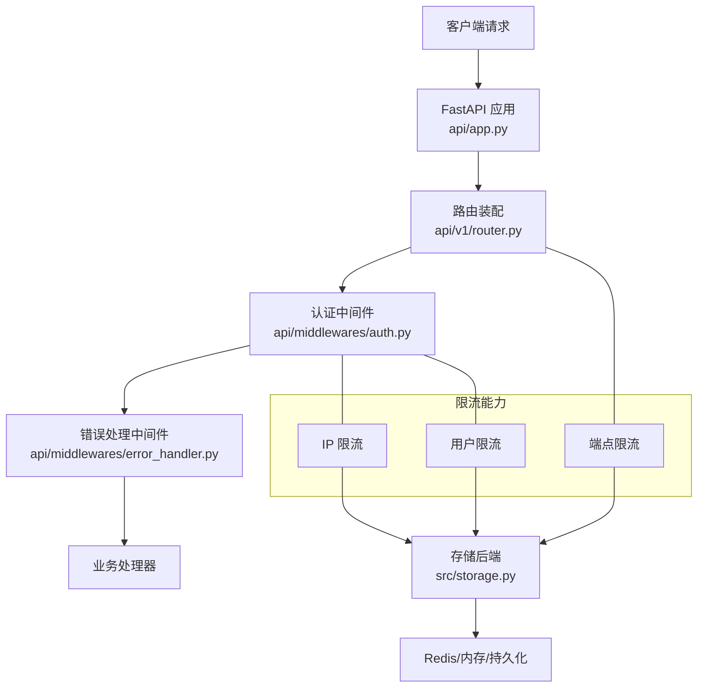
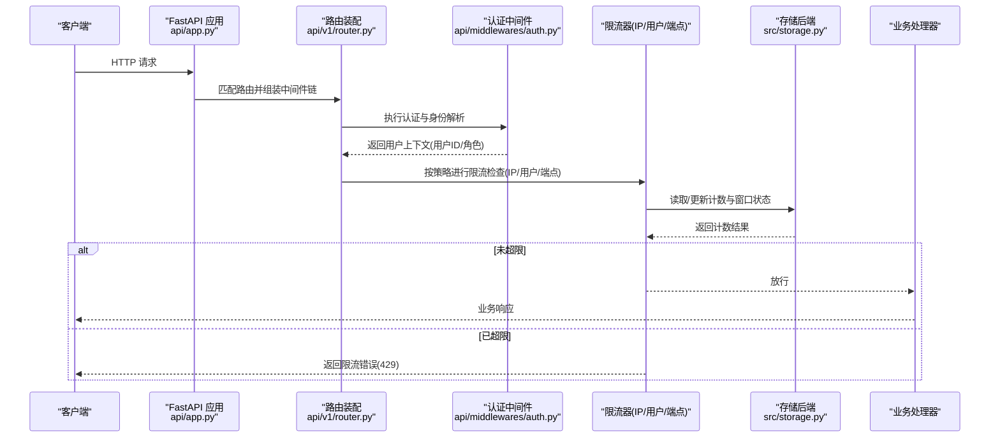
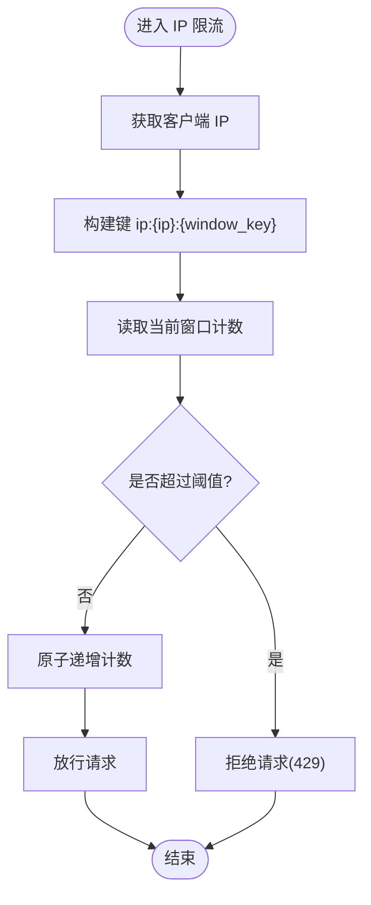
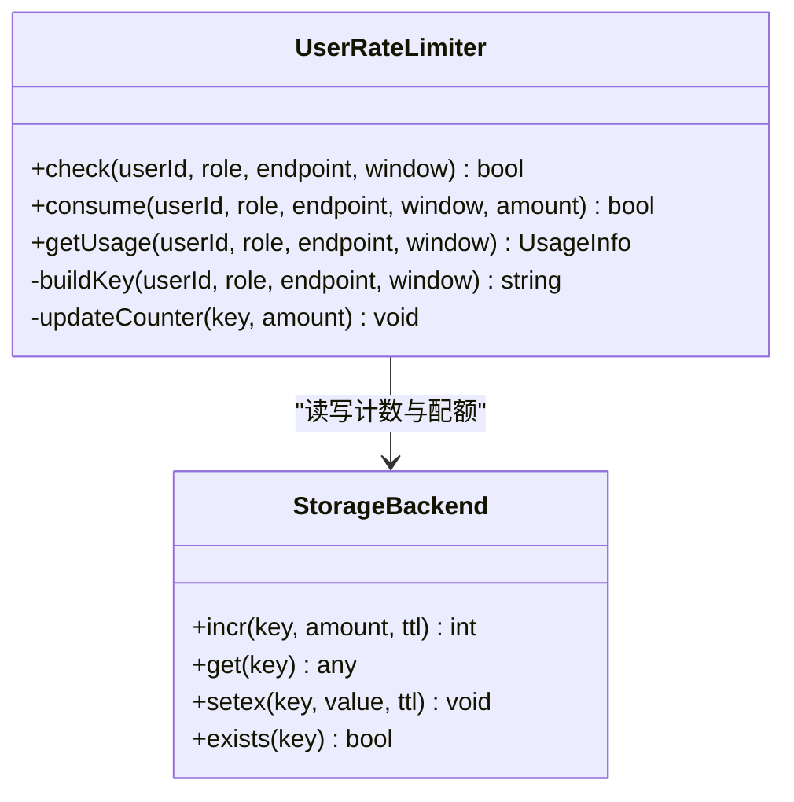
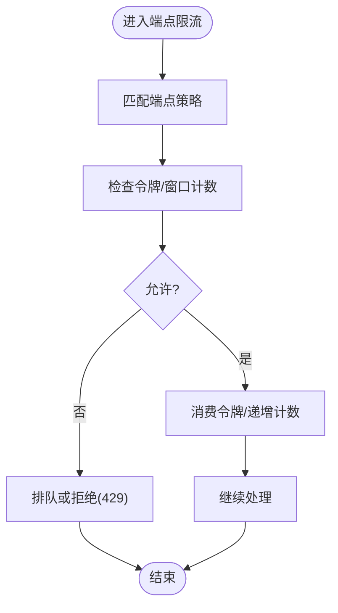
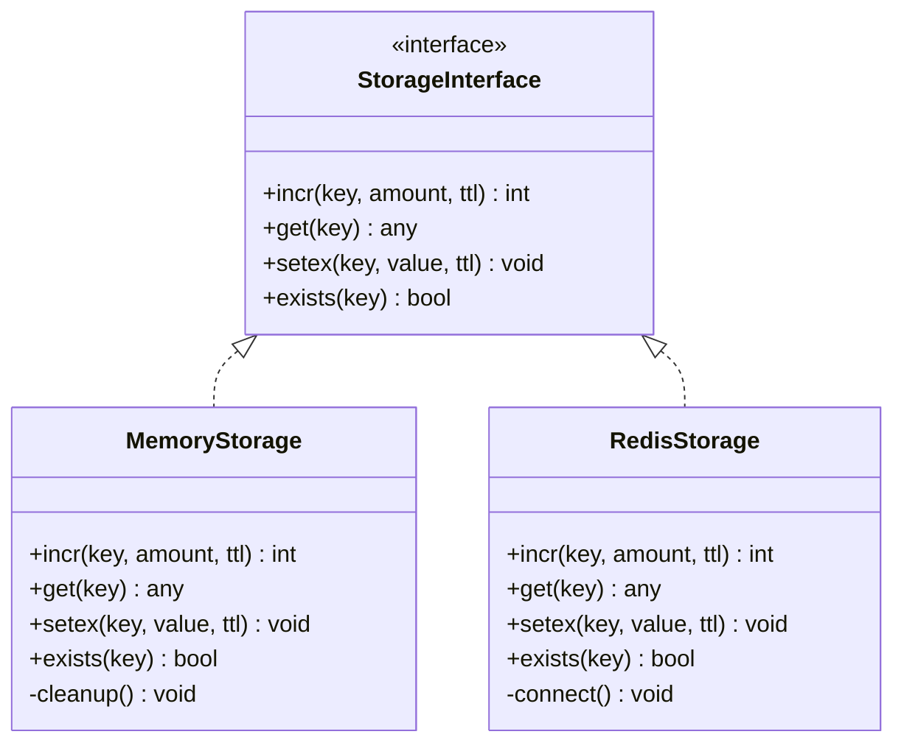
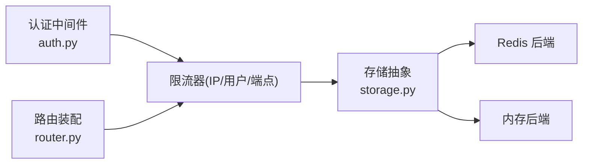

# 速率限制中间件

<cite>
**本文引用的文件**   
- [api/middlewares/__init__.py](file://api/middlewares/__init__.py)
- [api/middlewares/auth.py](file://api/middlewares/auth.py)
- [api/middlewares/error_handler.py](file://api/middlewares/error_handler.py)
- [api/v1/router.py](file://api/v1/router.py)
- [api/app.py](file://api/app.py)
- [src/config.py](file://src/config.py)
- [src/storage.py](file://src/storage.py)
- [api/deps.py](file://api/deps.py)
</cite>

## 目录
1. [简介](#简介)
2. [项目结构](#项目结构)
3. [核心组件](#核心组件)
4. [架构总览](#架构总览)
5. [详细组件分析](#详细组件分析)
6. [依赖关系分析](#依赖关系分析)
7. [性能考量](#性能考量)
8. [故障排查指南](#故障排查指南)
9. [结论](#结论)
10. [附录](#附录)

## 简介
本文件围绕 Daily Stock Analysis 的速率限制中间件进行系统化说明，重点覆盖以下方面：
- IP 限流机制：基于 IP 的请求计数、滑动窗口算法与分布式支持。
- 用户限流实现：基于用户 ID 的访问控制、角色权限分级与配额管理。
- API 调用频率控制：端点级别的限流策略、突发流量处理与降级策略。
- 限流数据存储：Redis 缓存、内存限流器与持久化选项。
- 配置与管理：动态调整、监控告警与性能调优建议。

## 项目结构
速率限制相关代码主要位于 API 层中间件与路由装配处，并结合全局应用初始化与配置模块完成加载与生效。关键位置如下：
- 中间件定义与注册：api/middlewares/*
- 路由装配与中间件挂载：api/v1/router.py、api/app.py
- 配置与存储抽象：src/config.py、src/storage.py、api/deps.py

图表来源
- [api/app.py](file://api/app.py)
- [api/v1/router.py](file://api/v1/router.py)
- [api/middlewares/auth.py](file://api/middlewares/auth.py)
- [api/middlewares/error_handler.py](file://api/middlewares/error_handler.py)
- [src/storage.py](file://src/storage.py)

章节来源
- [api/app.py](file://api/app.py)
- [api/v1/router.py](file://api/v1/router.py)
- [api/middlewares/__init__.py](file://api/middlewares/__init__.py)

## 核心组件
- 认证与鉴权中间件：负责提取身份上下文（如用户ID、角色），为后续的用户级限流提供依据。
- 错误处理中间件：统一返回限流错误码与提示，便于前端与客户端识别与重试。
- 路由装配：在路由层注入端点级限流策略，结合全局中间件形成多层防护。
- 配置与存储：通过配置中心读取限流参数，并通过存储抽象对接 Redis/内存等后端。

章节来源
- [api/middlewares/auth.py](file://api/middlewares/auth.py)
- [api/middlewares/error_handler.py](file://api/middlewares/error_handler.py)
- [api/v1/router.py](file://api/v1/router.py)
- [src/config.py](file://src/config.py)
- [src/storage.py](file://src/storage.py)

## 架构总览
下图展示从请求进入至限流决策的关键路径，以及各组件之间的协作关系。

图表来源
- [api/app.py](file://api/app.py)
- [api/v1/router.py](file://api/v1/router.py)
- [api/middlewares/auth.py](file://api/middlewares/auth.py)
- [src/storage.py](file://src/storage.py)

## 详细组件分析

### IP 限流机制
- 目标：防止单 IP 高频访问导致资源耗尽或滥用。
- 关键点：
  - 请求计数：以 IP 为键统计单位时间内的请求数。
  - 滑动窗口：使用固定窗口或滑动窗口算法平滑突发流量。
  - 分布式支持：通过共享存储（如 Redis）在多实例间保持一致性。
- 数据模型：
  - 键空间：ip:{ip}:{window_key}
  - 字段：计数、过期时间、窗口起始时间
- 复杂度：O(1) 读写；窗口清理可异步批量进行。
- 异常与边界：时钟回拨、跨节点时间不一致、高并发原子性。

图表来源
- [api/middlewares/auth.py](file://api/middlewares/auth.py)
- [src/storage.py](file://src/storage.py)

章节来源
- [api/middlewares/auth.py](file://api/middlewares/auth.py)
- [src/storage.py](file://src/storage.py)

### 用户限流实现
- 目标：基于用户身份进行精细化限流，支持角色分级与配额管理。
- 关键点：
  - 身份来源：从认证中间件解析用户ID与角色。
  - 策略维度：用户ID + 角色 + 端点组合限定。
  - 配额管理：每日/每小时/每分钟多级配额，支持软限制与硬限制。
- 数据模型：
  - 键空间：user:{userId}:{role}:{endpoint}:{window_key}
  - 字段：累计用量、配额上限、剩余配额、过期时间
- 复杂度：O(1) 读写；配额聚合可异步计算。
- 异常与边界：用户不存在、角色变更、配额重置周期对齐。

图表来源
- [api/middlewares/auth.py](file://api/middlewares/auth.py)
- [src/storage.py](file://src/storage.py)

章节来源
- [api/middlewares/auth.py](file://api/middlewares/auth.py)
- [src/storage.py](file://src/storage.py)

### API 调用频率控制（端点级限流）
- 目标：对特定端点进行独立限流，避免热点接口拖垮系统。
- 关键点：
  - 策略粒度：按端点路径 + 方法 + 可选查询参数分组。
  - 突发处理：令牌桶或漏桶算法平滑突发流量。
  - 降级策略：当后端负载过高时主动降低配额或返回排队提示。
- 数据模型：
  - 键空间：endpoint:{path}:{method}:{window_key}
  - 字段：令牌余额/窗口计数、刷新间隔、冷却时间
- 复杂度：O(1) 读写；令牌生成可后台定时任务维护。

图表来源
- [api/v1/router.py](file://api/v1/router.py)
- [src/storage.py](file://src/storage.py)

章节来源
- [api/v1/router.py](file://api/v1/router.py)
- [src/storage.py](file://src/storage.py)

### 限流数据存储（Redis/内存/持久化）
- 目标：提供统一的存储抽象，支持多后端切换与扩展。
- 关键点：
  - 一致性：分布式场景下保证原子性与可见性。
  - 性能：低延迟读写，支持批量操作与管道。
  - 持久化：根据需求选择仅内存或带持久化的后端。
- 接口设计：
  - incr(key, amount, ttl)：原子递增并设置过期
  - get(key)：读取值
  - setex(key, value, ttl)：设置带过期时间的值
  - exists(key)：判断键是否存在
- 选型建议：
  - 单机：内存字典 + TTL 定时器
  - 集群：Redis 作为共享计数器
  - 审计：写入日志或对象存储用于离线分析

图表来源
- [src/storage.py](file://src/storage.py)

章节来源
- [src/storage.py](file://src/storage.py)

### 配置与管理（动态调整、监控告警、性能调优）
- 配置项建议：
  - 全局：默认窗口大小、默认阈值、是否启用分布式存储
  - IP 限流：阈值、窗口类型（固定/滑动）、黑名单/白名单
  - 用户限流：角色配额表、每日/小时/分钟配额、软/硬限制行为
  - 端点限流：端点策略映射、令牌速率、突发容量、冷却时间
- 动态调整：
  - 热更新：通过配置中心推送新策略，中间件监听变更并即时生效
  - 灰度发布：按 IP 段或用户组逐步放量
- 监控告警：
  - 指标：QPS、拒绝率、平均延迟、P95/P99 延迟、配额使用率
  - 告警：拒绝率突增、配额耗尽、存储延迟升高
- 性能调优：
  - 减少跨进程/网络调用：本地缓存热点键
  - 批处理：合并写入与清理任务
  - 连接池：复用存储连接，避免频繁建立

章节来源
- [src/config.py](file://src/config.py)
- [api/deps.py](file://api/deps.py)

## 依赖关系分析
- 中间件依赖：认证中间件为限流提供用户上下文；错误处理中间件统一限流响应格式。
- 路由装配：将端点级限流策略注入到具体路由，确保细粒度控制。
- 存储抽象：限流逻辑不直接耦合具体存储实现，便于替换与测试。

图表来源
- [api/middlewares/auth.py](file://api/middlewares/auth.py)
- [api/v1/router.py](file://api/v1/router.py)
- [src/storage.py](file://src/storage.py)

章节来源
- [api/middlewares/auth.py](file://api/middlewares/auth.py)
- [api/v1/router.py](file://api/v1/router.py)
- [src/storage.py](file://src/storage.py)

## 性能考量
- 原子性与一致性：在高并发下使用原子递增与事务保证计数准确。
- 窗口算法选择：滑动窗口更平滑但开销更高；固定窗口简单高效。
- 存储延迟：优先使用本地缓存热点键，降低远程调用次数。
- 清理策略：异步清理过期键，避免阻塞主流程。
- 背压与降级：当存储不可用时快速失败并返回友好提示。

## 故障排查指南
- 常见问题：
  - 限流误判：检查键空间命名与时区一致性
  - 配额不同步：确认分布式存储连接与幂等性
  - 高延迟：观察存储 RTT 与连接池状态
- 定位步骤：
  - 查看限流指标与拒绝率趋势
  - 核对配置下发与生效时间戳
  - 检查存储健康与慢查询日志
- 恢复措施：
  - 临时放宽阈值或关闭非关键端点限流
  - 扩容存储实例或切换到备用后端
  - 重启中间件以清理异常状态

章节来源
- [api/middlewares/error_handler.py](file://api/middlewares/error_handler.py)
- [src/storage.py](file://src/storage.py)

## 结论
通过 IP 限流、用户限流与端点限流的三层协同，配合统一的存储抽象与灵活的配置管理，Daily Stock Analysis 能够在高并发与分布式环境下稳定运行。建议在上线前完善监控告警与压测验证，持续优化窗口算法与存储策略，确保用户体验与系统稳定性。

## 附录
- 术语表：
  - 滑动窗口：将时间划分为多个小窗口，按权重累加计数，平滑突发。
  - 令牌桶：以固定速率生成令牌，请求需消耗令牌，超出则拒绝或排队。
  - 软限制：超限后仍允许但记录警告；硬限制：直接拒绝。
- 参考实现位置：
  - 中间件入口与注册：api/middlewares/__init__.py
  - 认证与用户上下文：api/middlewares/auth.py
  - 错误响应格式：api/middlewares/error_handler.py
  - 路由装配与端点策略：api/v1/router.py
  - 应用初始化与中间件链：api/app.py
  - 配置加载与默认值：src/config.py
  - 存储抽象与后端实现：src/storage.py
  - 依赖注入与实例化：api/deps.py